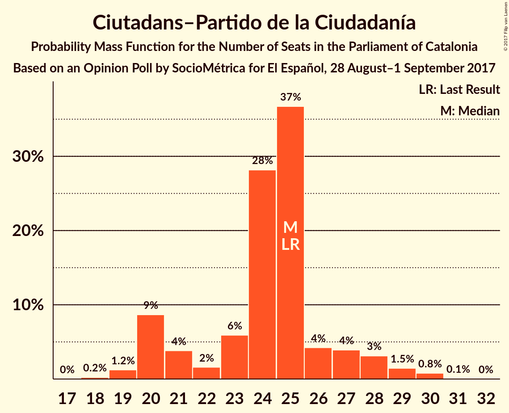
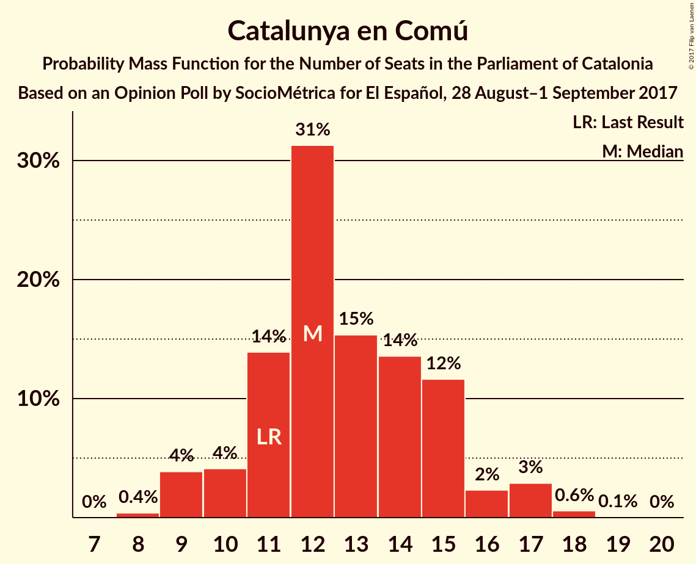

# Opinion Poll by SocioMétrica for El Español, 28 August–1 September 2017

<a href="#voting-intentions">Voting Intentions</a> | <a href="#seats">Seats</a> | <a href="#coalitions">Coalitions</a> | <a href="#technical-information">Technical Information</a>

## Voting Intentions

### Confidence Intervals

| Party | Last Result | Poll Result | 80% Confidence Interval | 90% Confidence Interval | 95% Confidence Interval | 99% Confidence Interval |
|:-----:|:-----------:|:-----------:|:-----------------------:|:-----------------------:|:-----------------------:|:-----------------------:|
| Esquerra Republicana de Catalunya–Catalunya Sí | 39.6% | 28.0% | 25.9–30.3% |25.3–30.9% |24.8–31.4% |23.8–32.5% |
| Ciutadans–Partido de la Ciudadanía | 17.9% | 17.6% | 15.8–19.5% |15.3–20.1% |14.9–20.6% |14.1–21.5% |
| Partit Demòcrata Europeu Català | 39.6% | 12.7% | 11.2–14.5% |10.8–15.0% |10.4–15.4% |9.8–16.3% |
| Partit Popular | 8.5% | 10.6% | 9.2–12.2% |8.8–12.7% |8.5–13.1% |7.9–13.9% |
| Catalunya en Comú | 8.9% | 10.4% | 9.1–12.1% |8.7–12.5% |8.4–12.9% |7.8–13.7% |
| Partit dels Socialistes de Catalunya (PSC-PSOE) | 12.7% | 10.1% | 8.8–11.8% |8.4–12.2% |8.1–12.6% |7.5–13.4% |
| Candidatura d’Unitat Popular | 8.2% | 6.9% | 5.8–8.2% |5.5–8.6% |5.2–9.0% |4.7–9.7% |

*Note:* The poll result column reflects the actual value used in the calculations. Published results may vary slightly, and in addition be rounded to fewer digits.

## Seats

### Confidence Intervals

| Party | Last Result | Median | 80% Confidence Interval | 90% Confidence Interval | 95% Confidence Interval | 99% Confidence Interval |
|:-----:|:-----------:|:------:|:-----------------------:|:-----------------------:|:-----------------------:|:-----------------------:|
| <a href="#esquerra-republicana-de-catalunya–catalunya-sí">Esquerra Republicana de Catalunya–Catalunya Sí</a> | 20 | 44 | 40–47 |39–48 |38–49 |37–51 |
| <a href="#ciutadans–partido-de-la-ciudadanía">Ciutadans–Partido de la Ciudadanía</a> | 25 | 25 | 20–26 |20–28 |20–28 |19–30 |
| <a href="#partit-demòcrata-europeu-català">Partit Demòcrata Europeu Català</a> | 29 | 18 | 16–22 |15–22 |15–23 |14–24 |
| <a href="#partit-popular">Partit Popular</a> | 11 | 14 | 12–16 |12–17 |11–18 |10–19 |
| <a href="#catalunya-en-comú">Catalunya en Comú</a> | 11 | 12 | 11–15 |10–16 |9–17 |9–18 |
| <a href="#partit-dels-socialistes-de-catalunya-(psc-psoe)">Partit dels Socialistes de Catalunya (PSC-PSOE)</a> | 16 | 14 | 11–15 |11–15 |10–16 |9–17 |
| <a href="#candidatura-d’unitat-popular">Candidatura d’Unitat Popular</a> | 10 | 9 | 8–10 |8–10 |6–11 |5–12 |

### Esquerra Republicana de Catalunya–Catalunya Sí

*For a full overview of the results for this party, see the [Esquerra Republicana de Catalunya–Catalunya Sí](party-esquerrarepublicanadecatalunya–catalunyasí.html) page.*

| Number of Seats | Probability | Accumulated | Special Marks |
|:---------------:|:-----------:|:-----------:|:-------------:|
| 20 | 0% | 100% | Last Result |
| 21 | 0% | 100% |  |
| 22 | 0% | 100% |  |
| 23 | 0% | 100% |  |
| 24 | 0% | 100% |  |
| 25 | 0% | 100% |  |
| 26 | 0% | 100% |  |
| 27 | 0% | 100% |  |
| 28 | 0% | 100% |  |
| 29 | 0% | 100% |  |
| 30 | 0% | 100% |  |
| 31 | 0% | 100% |  |
| 32 | 0% | 100% |  |
| 33 | 0% | 100% |  |
| 34 | 0% | 100% |  |
| 35 | 0% | 100% |  |
| 36 | 0.1% | 99.9% |  |
| 37 | 0.8% | 99.8% |  |
| 38 | 3% | 99.1% |  |
| 39 | 4% | 96% |  |
| 40 | 5% | 92% |  |
| 41 | 8% | 87% |  |
| 42 | 10% | 80% |  |
| 43 | 15% | 70% |  |
| 44 | 22% | 55% | Median |
| 45 | 14% | 32% |  |
| 46 | 7% | 18% |  |
| 47 | 5% | 11% |  |
| 48 | 3% | 6% |  |
| 49 | 2% | 3% |  |
| 50 | 0.8% | 1.3% |  |
| 51 | 0.4% | 0.5% |  |
| 52 | 0.1% | 0.1% |  |
| 53 | 0% | 0% |  |

### Ciutadans–Partido de la Ciudadanía

*For a full overview of the results for this party, see the [Ciutadans–Partido de la Ciudadanía](party-ciutadans–partidodelaciudadanía.html) page.*

| Number of Seats | Probability | Accumulated | Special Marks |
|:---------------:|:-----------:|:-----------:|:-------------:|
| 18 | 0.2% | 100% |  |
| 19 | 1.2% | 99.7% |  |
| 20 | 9% | 98.5% |  |
| 21 | 4% | 90% |  |
| 22 | 2% | 86% |  |
| 23 | 6% | 84% |  |
| 24 | 28% | 79% |  |
| 25 | 37% | 50% | Last Result, Median |
| 26 | 4% | 14% |  |
| 27 | 4% | 9% |  |
| 28 | 3% | 5% |  |
| 29 | 1.5% | 2% |  |
| 30 | 0.8% | 0.9% |  |
| 31 | 0.1% | 0.1% |  |
| 32 | 0% | 0% |  |

### Partit Demòcrata Europeu Català

*For a full overview of the results for this party, see the [Partit Demòcrata Europeu Català](party-partitdemòcrataeuropeucatalà.html) page.*

| Number of Seats | Probability | Accumulated | Special Marks |
|:---------------:|:-----------:|:-----------:|:-------------:|
| 13 | 0.3% | 100% |  |
| 14 | 0.7% | 99.7% |  |
| 15 | 4% | 99.0% |  |
| 16 | 8% | 95% |  |
| 17 | 14% | 87% |  |
| 18 | 26% | 73% | Median |
| 19 | 10% | 47% |  |
| 20 | 14% | 36% |  |
| 21 | 12% | 23% |  |
| 22 | 6% | 10% |  |
| 23 | 2% | 4% |  |
| 24 | 1.3% | 2% |  |
| 25 | 0.1% | 0.2% |  |
| 26 | 0.1% | 0.1% |  |
| 27 | 0% | 0% |  |
| 28 | 0% | 0% |  |
| 29 | 0% | 0% | Last Result |

### Partit Popular

*For a full overview of the results for this party, see the [Partit Popular](party-partitpopular.html) page.*

| Number of Seats | Probability | Accumulated | Special Marks |
|:---------------:|:-----------:|:-----------:|:-------------:|
| 9 | 0.1% | 100% |  |
| 10 | 2% | 99.9% |  |
| 11 | 2% | 98% | Last Result |
| 12 | 11% | 97% |  |
| 13 | 32% | 86% |  |
| 14 | 32% | 53% | Median |
| 15 | 11% | 21% |  |
| 16 | 5% | 10% |  |
| 17 | 2% | 5% |  |
| 18 | 2% | 4% |  |
| 19 | 0.6% | 1.1% |  |
| 20 | 0.4% | 0.5% |  |
| 21 | 0.1% | 0.1% |  |
| 22 | 0% | 0% |  |

### Catalunya en Comú

*For a full overview of the results for this party, see the [Catalunya en Comú](party-catalunyaencomú.html) page.*

| Number of Seats | Probability | Accumulated | Special Marks |
|:---------------:|:-----------:|:-----------:|:-------------:|
| 8 | 0.4% | 100% |  |
| 9 | 4% | 99.6% |  |
| 10 | 4% | 96% |  |
| 11 | 14% | 92% | Last Result |
| 12 | 31% | 78% | Median |
| 13 | 15% | 46% |  |
| 14 | 14% | 31% |  |
| 15 | 12% | 17% |  |
| 16 | 2% | 6% |  |
| 17 | 3% | 4% |  |
| 18 | 0.6% | 0.6% |  |
| 19 | 0.1% | 0.1% |  |
| 20 | 0% | 0% |  |

### Partit dels Socialistes de Catalunya (PSC-PSOE)

*For a full overview of the results for this party, see the [Partit dels Socialistes de Catalunya (PSC-PSOE)](party-partitdelssocialistesdecatalunyapsc-psoe.html) page.*

| Number of Seats | Probability | Accumulated | Special Marks |
|:---------------:|:-----------:|:-----------:|:-------------:|
| 7 | 0.1% | 100% |  |
| 8 | 0.1% | 99.9% |  |
| 9 | 2% | 99.8% |  |
| 10 | 1.2% | 98% |  |
| 11 | 14% | 97% |  |
| 12 | 16% | 83% |  |
| 13 | 17% | 67% |  |
| 14 | 31% | 50% | Median |
| 15 | 15% | 20% |  |
| 16 | 4% | 5% | Last Result |
| 17 | 0.5% | 0.7% |  |
| 18 | 0.2% | 0.2% |  |
| 19 | 0% | 0.1% |  |
| 20 | 0% | 0% |  |

### Candidatura d’Unitat Popular

*For a full overview of the results for this party, see the [Candidatura d’Unitat Popular](party-candidaturad’unitatpopular.html) page.*

| Number of Seats | Probability | Accumulated | Special Marks |
|:---------------:|:-----------:|:-----------:|:-------------:|
| 3 | 0.1% | 100% |  |
| 4 | 0.2% | 99.9% |  |
| 5 | 1.1% | 99.7% |  |
| 6 | 2% | 98.6% |  |
| 7 | 2% | 97% |  |
| 8 | 28% | 95% |  |
| 9 | 42% | 67% | Median |
| 10 | 21% | 25% | Last Result |
| 11 | 3% | 4% |  |
| 12 | 1.2% | 2% |  |
| 13 | 0.2% | 0.4% |  |
| 14 | 0.2% | 0.2% |  |
| 15 | 0% | 0.1% |  |
| 16 | 0% | 0% |  |

## Coalitions

### Confidence Intervals

| Coalition | Last Result | Median | Majority? | 80% Confidence Interval | 90% Confidence Interval | 95% Confidence Interval | 99% Confidence Interval |
|:---------:|:-----------:|:------:|:---------:|:-----------------------:|:-----------------------:|:-----------------------:|:-----------------------:|
| Esquerra Republicana de Catalunya–Catalunya Sí – Partit Demòcrata Europeu Català – Catalunya en Comú | 60 | 75 | 99.7% | 72–78 | 71–79 | 70–80 | 68–82 |
| Esquerra Republicana de Catalunya–Catalunya Sí – Partit Demòcrata Europeu Català – Candidatura d’Unitat Popular | 59 | 71 | 92% | 68–74 | 67–76 | 66–77 | 64–79 |
| Ciutadans–Partido de la Ciudadanía – Partit Popular – Catalunya en Comú – Partit dels Socialistes de Catalunya (PSC-PSOE) | 63 | 64 | 8% | 61–67 | 59–68 | 58–69 | 56–71 |
| Esquerra Republicana de Catalunya–Catalunya Sí – Partit Demòcrata Europeu Català | 49 | 62 | 3% | 59–65 | 58–67 | 57–68 | 55–70 |
| Ciutadans–Partido de la Ciudadanía – Partit Popular – Partit dels Socialistes de Catalunya (PSC-PSOE) | 52 | 51 | 0% | 48–54 | 47–55 | 46–56 | 44–58 |

### Esquerra Republicana de Catalunya–Catalunya Sí – Partit Demòcrata Europeu Català – Catalunya en Comú

| Number of Seats | Probability | Accumulated | Special Marks |
|:---------------:|:-----------:|:-----------:|:-------------:|
| 60 | 0% | 100% | Last Result |
| 61 | 0% | 100% |  |
| 62 | 0% | 100% |  |
| 63 | 0% | 100% |  |
| 64 | 0% | 100% |  |
| 65 | 0% | 100% |  |
| 66 | 0.1% | 100% |  |
| 67 | 0.2% | 99.9% |  |
| 68 | 0.4% | 99.7% | Majority |
| 69 | 0.9% | 99.3% |  |
| 70 | 2% | 98% |  |
| 71 | 4% | 96% |  |
| 72 | 7% | 92% |  |
| 73 | 13% | 85% |  |
| 74 | 17% | 72% | Median |
| 75 | 15% | 56% |  |
| 76 | 15% | 41% |  |
| 77 | 11% | 26% |  |
| 78 | 7% | 15% |  |
| 79 | 4% | 8% |  |
| 80 | 2% | 4% |  |
| 81 | 1.2% | 2% |  |
| 82 | 0.5% | 0.8% |  |
| 83 | 0.2% | 0.3% |  |
| 84 | 0.1% | 0.1% |  |
| 85 | 0% | 0% |  |

### Esquerra Republicana de Catalunya–Catalunya Sí – Partit Demòcrata Europeu Català – Candidatura d’Unitat Popular

| Number of Seats | Probability | Accumulated | Special Marks |
|:---------------:|:-----------:|:-----------:|:-------------:|
| 59 | 0% | 100% | Last Result |
| 60 | 0% | 100% |  |
| 61 | 0% | 100% |  |
| 62 | 0.1% | 100% |  |
| 63 | 0.2% | 99.9% |  |
| 64 | 0.5% | 99.7% |  |
| 65 | 0.9% | 99.2% |  |
| 66 | 2% | 98% |  |
| 67 | 4% | 96% |  |
| 68 | 8% | 92% | Majority |
| 69 | 11% | 84% |  |
| 70 | 14% | 74% |  |
| 71 | 14% | 59% | Median |
| 72 | 14% | 45% |  |
| 73 | 14% | 31% |  |
| 74 | 8% | 17% |  |
| 75 | 4% | 9% |  |
| 76 | 3% | 5% |  |
| 77 | 1.4% | 3% |  |
| 78 | 0.7% | 1.2% |  |
| 79 | 0.3% | 0.5% |  |
| 80 | 0.2% | 0.2% |  |
| 81 | 0% | 0.1% |  |
| 82 | 0% | 0% |  |

### Ciutadans–Partido de la Ciudadanía – Partit Popular – Catalunya en Comú – Partit dels Socialistes de Catalunya (PSC-PSOE)

| Number of Seats | Probability | Accumulated | Special Marks |
|:---------------:|:-----------:|:-----------:|:-------------:|
| 54 | 0% | 100% |  |
| 55 | 0.2% | 99.9% |  |
| 56 | 0.3% | 99.8% |  |
| 57 | 0.7% | 99.5% |  |
| 58 | 1.4% | 98.8% |  |
| 59 | 3% | 97% |  |
| 60 | 4% | 95% |  |
| 61 | 8% | 91% |  |
| 62 | 14% | 83% |  |
| 63 | 14% | 69% | Last Result |
| 64 | 14% | 55% |  |
| 65 | 14% | 41% | Median |
| 66 | 11% | 26% |  |
| 67 | 8% | 16% |  |
| 68 | 4% | 8% | Majority |
| 69 | 2% | 4% |  |
| 70 | 0.9% | 2% |  |
| 71 | 0.5% | 0.8% |  |
| 72 | 0.2% | 0.3% |  |
| 73 | 0.1% | 0.1% |  |
| 74 | 0% | 0% |  |

### Esquerra Republicana de Catalunya–Catalunya Sí – Partit Demòcrata Europeu Català

| Number of Seats | Probability | Accumulated | Special Marks |
|:---------------:|:-----------:|:-----------:|:-------------:|
| 49 | 0% | 100% | Last Result |
| 50 | 0% | 100% |  |
| 51 | 0% | 100% |  |
| 52 | 0% | 100% |  |
| 53 | 0.1% | 100% |  |
| 54 | 0.2% | 99.9% |  |
| 55 | 0.4% | 99.8% |  |
| 56 | 0.9% | 99.3% |  |
| 57 | 2% | 98% |  |
| 58 | 4% | 97% |  |
| 59 | 8% | 93% |  |
| 60 | 10% | 85% |  |
| 61 | 13% | 75% |  |
| 62 | 16% | 62% | Median |
| 63 | 14% | 46% |  |
| 64 | 13% | 32% |  |
| 65 | 9% | 19% |  |
| 66 | 4% | 10% |  |
| 67 | 3% | 6% |  |
| 68 | 2% | 3% | Majority |
| 69 | 0.7% | 1.3% |  |
| 70 | 0.3% | 0.6% |  |
| 71 | 0.2% | 0.2% |  |
| 72 | 0% | 0.1% |  |
| 73 | 0% | 0% |  |

### Ciutadans–Partido de la Ciudadanía – Partit Popular – Partit dels Socialistes de Catalunya (PSC-PSOE)

| Number of Seats | Probability | Accumulated | Special Marks |
|:---------------:|:-----------:|:-----------:|:-------------:|
| 42 | 0.1% | 100% |  |
| 43 | 0.1% | 99.9% |  |
| 44 | 0.4% | 99.8% |  |
| 45 | 1.1% | 99.4% |  |
| 46 | 2% | 98% |  |
| 47 | 4% | 96% |  |
| 48 | 6% | 93% |  |
| 49 | 10% | 86% |  |
| 50 | 15% | 76% |  |
| 51 | 16% | 61% |  |
| 52 | 16% | 45% | Last Result |
| 53 | 13% | 29% | Median |
| 54 | 8% | 16% |  |
| 55 | 4% | 8% |  |
| 56 | 2% | 4% |  |
| 57 | 0.9% | 2% |  |
| 58 | 0.4% | 0.8% |  |
| 59 | 0.2% | 0.3% |  |
| 60 | 0.1% | 0.1% |  |
| 61 | 0% | 0% |  |

## Technical Information

### Opinion Poll

+ **Polling firm:** SocioMétrica
+ **Commissioner(s):** El Español
+ **Fieldwork period:** 28 August–1 September 2017

### Calculations

+ **Sample size:** 700
+ **Simulations done:** 8,388,608
+ **Error estimate:** 0.40%

