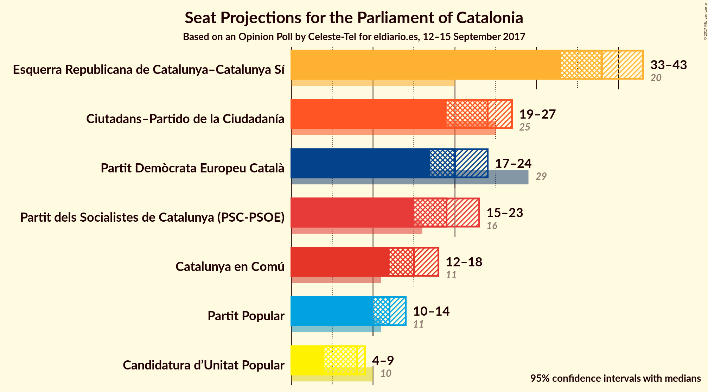

# Opinion Poll by Celeste-Tel for eldiario.es, 12–15 September 2017

<a href="#voting-intentions">Voting Intentions</a> | <a href="#seats">Seats</a> | <a href="#coalitions">Coalitions</a> | <a href="#technical-information">Technical Information</a>

## Voting Intentions

### Confidence Intervals

| Party | Last Result | Poll Result | 80% Confidence Interval | 90% Confidence Interval | 95% Confidence Interval | 99% Confidence Interval |
|:-----:|:-----------:|:-----------:|:-----------------------:|:-----------------------:|:-----------------------:|:-----------------------:|
| Esquerra Republicana de Catalunya–Catalunya Sí | 39.6% | 24.8% | 22.9–26.8% |22.3–27.4% |21.9–27.9% |21.0–28.9% |
| Ciutadans–Partido de la Ciudadanía | 17.9% | 17.4% | 15.7–19.2% |15.3–19.7% |14.9–20.2% |14.2–21.1% |
| Partit dels Socialistes de Catalunya (PSC-PSOE) | 12.7% | 14.8% | 13.2–16.5% |12.8–17.0% |12.5–17.4% |11.8–18.2% |
| Partit Demòcrata Europeu Català | 39.6% | 13.6% | 12.2–15.3% |11.8–15.8% |11.4–16.2% |10.8–17.0% |
| Catalunya en Comú | 8.9% | 12.2% | 10.9–13.9% |10.5–14.3% |10.2–14.7% |9.5–15.5% |
| Partit Popular | 8.5% | 9.4% | 8.2–10.8% |7.8–11.2% |7.5–11.6% |7.0–12.3% |
| Candidatura d’Unitat Popular | 8.2% | 5.9% | 4.9–7.1% |4.7–7.4% |4.5–7.7% |4.0–8.4% |

*Note:* The poll result column reflects the actual value used in the calculations. Published results may vary slightly, and in addition be rounded to fewer digits.

## Seats

### Confidence Intervals

| Party | Last Result | Median | 80% Confidence Interval | 90% Confidence Interval | 95% Confidence Interval | 99% Confidence Interval |
|:-----:|:-----------:|:------:|:-----------------------:|:-----------------------:|:-----------------------:|:-----------------------:|
| <a href="#esquerra-republicana-de-catalunya–catalunya-sí">Esquerra Republicana de Catalunya–Catalunya Sí</a> | 20 | 38 | 35–41 |34–42 |33–43 |31–44 |
| <a href="#ciutadans–partido-de-la-ciudadanía">Ciutadans–Partido de la Ciudadanía</a> | 25 | 24 | 20–25 |20–26 |20–27 |19–29 |
| <a href="#partit-dels-socialistes-de-catalunya-(psc-psoe)">Partit dels Socialistes de Catalunya (PSC-PSOE)</a> | 16 | 19 | 16–22 |16–23 |15–23 |15–24 |
| <a href="#partit-demòcrata-europeu-català">Partit Demòcrata Europeu Català</a> | 29 | 21 | 17–23 |17–23 |16–24 |15–25 |
| <a href="#catalunya-en-comú">Catalunya en Comú</a> | 11 | 15 | 13–17 |12–18 |12–18 |11–19 |
| <a href="#partit-popular">Partit Popular</a> | 11 | 12 | 10–14 |10–14 |10–14 |8–16 |
| <a href="#candidatura-d’unitat-popular">Candidatura d’Unitat Popular</a> | 10 | 8 | 5–9 |5–9 |4–9 |3–10 |

### Esquerra Republicana de Catalunya–Catalunya Sí

*For a full overview of the results for this party, see the [Esquerra Republicana de Catalunya–Catalunya Sí](party-esquerrarepublicanadecatalunyacatalunyas.html) page.*

| Number of Seats | Probability | Accumulated | Special Marks |
|:---------------:|:-----------:|:-----------:|:-------------:|
| 20 | 0% | 100% | Last Result |
| 21 | 0% | 100% |  |
| 22 | 0% | 100% |  |
| 23 | 0% | 100% |  |
| 24 | 0% | 100% |  |
| 25 | 0% | 100% |  |
| 26 | 0% | 100% |  |
| 27 | 0% | 100% |  |
| 28 | 0% | 100% |  |
| 29 | 0% | 100% |  |
| 30 | 0% | 100% |  |
| 31 | 0.5% | 100% |  |
| 32 | 2% | 99.4% |  |
| 33 | 2% | 98% |  |
| 34 | 3% | 96% |  |
| 35 | 8% | 93% |  |
| 36 | 14% | 85% |  |
| 37 | 19% | 71% |  |
| 38 | 23% | 52% | Median |
| 39 | 8% | 29% |  |
| 40 | 7% | 21% |  |
| 41 | 6% | 14% |  |
| 42 | 5% | 8% |  |
| 43 | 2% | 3% |  |
| 44 | 1.0% | 1.2% |  |
| 45 | 0.1% | 0.2% |  |
| 46 | 0.1% | 0.1% |  |
| 47 | 0% | 0% |  |

### Ciutadans–Partido de la Ciudadanía

*For a full overview of the results for this party, see the [Ciutadans–Partido de la Ciudadanía](party-ciutadanspartidodelaciudadana.html) page.*

| Number of Seats | Probability | Accumulated | Special Marks |
|:---------------:|:-----------:|:-----------:|:-------------:|
| 17 | 0.1% | 100% |  |
| 18 | 0.3% | 99.8% |  |
| 19 | 2% | 99.6% |  |
| 20 | 10% | 98% |  |
| 21 | 6% | 88% |  |
| 22 | 15% | 82% |  |
| 23 | 7% | 66% |  |
| 24 | 29% | 59% | Median |
| 25 | 21% | 31% | Last Result |
| 26 | 7% | 9% |  |
| 27 | 1.5% | 3% |  |
| 28 | 0.8% | 1.4% |  |
| 29 | 0.3% | 0.6% |  |
| 30 | 0.2% | 0.2% |  |
| 31 | 0% | 0% |  |

### Partit dels Socialistes de Catalunya (PSC-PSOE)

*For a full overview of the results for this party, see the [Partit dels Socialistes de Catalunya (PSC-PSOE)](party-partitdelssocialistesdecatalunyapscpsoe.html) page.*

| Number of Seats | Probability | Accumulated | Special Marks |
|:---------------:|:-----------:|:-----------:|:-------------:|
| 14 | 0.2% | 100% |  |
| 15 | 3% | 99.8% |  |
| 16 | 13% | 97% | Last Result |
| 17 | 16% | 84% |  |
| 18 | 15% | 68% |  |
| 19 | 7% | 53% | Median |
| 20 | 19% | 46% |  |
| 21 | 8% | 27% |  |
| 22 | 11% | 19% |  |
| 23 | 6% | 7% |  |
| 24 | 1.0% | 1.2% |  |
| 25 | 0.1% | 0.1% |  |
| 26 | 0% | 0% |  |

### Partit Demòcrata Europeu Català

*For a full overview of the results for this party, see the [Partit Demòcrata Europeu Català](party-partitdemcrataeuropeucatal.html) page.*

| Number of Seats | Probability | Accumulated | Special Marks |
|:---------------:|:-----------:|:-----------:|:-------------:|
| 14 | 0% | 100% |  |
| 15 | 1.0% | 99.9% |  |
| 16 | 2% | 98.9% |  |
| 17 | 12% | 97% |  |
| 18 | 14% | 86% |  |
| 19 | 12% | 72% |  |
| 20 | 9% | 60% |  |
| 21 | 27% | 51% | Median |
| 22 | 11% | 24% |  |
| 23 | 9% | 13% |  |
| 24 | 3% | 4% |  |
| 25 | 0.4% | 0.7% |  |
| 26 | 0.2% | 0.3% |  |
| 27 | 0.1% | 0.2% |  |
| 28 | 0% | 0% |  |
| 29 | 0% | 0% | Last Result |

### Catalunya en Comú

*For a full overview of the results for this party, see the [Catalunya en Comú](party-catalunyaencom.html) page.*

| Number of Seats | Probability | Accumulated | Special Marks |
|:---------------:|:-----------:|:-----------:|:-------------:|
| 10 | 0.1% | 100% |  |
| 11 | 1.1% | 99.8% | Last Result |
| 12 | 6% | 98.7% |  |
| 13 | 4% | 92% |  |
| 14 | 24% | 88% |  |
| 15 | 25% | 64% | Median |
| 16 | 10% | 40% |  |
| 17 | 21% | 30% |  |
| 18 | 7% | 9% |  |
| 19 | 2% | 2% |  |
| 20 | 0.2% | 0.2% |  |
| 21 | 0% | 0% |  |

### Partit Popular

*For a full overview of the results for this party, see the [Partit Popular](party-partitpopular.html) page.*

| Number of Seats | Probability | Accumulated | Special Marks |
|:---------------:|:-----------:|:-----------:|:-------------:|
| 7 | 0% | 100% |  |
| 8 | 0.5% | 99.9% |  |
| 9 | 2% | 99.5% |  |
| 10 | 17% | 98% |  |
| 11 | 5% | 81% | Last Result |
| 12 | 35% | 75% | Median |
| 13 | 30% | 40% |  |
| 14 | 9% | 11% |  |
| 15 | 0.8% | 2% |  |
| 16 | 0.7% | 0.8% |  |
| 17 | 0.1% | 0.1% |  |
| 18 | 0.1% | 0.1% |  |
| 19 | 0% | 0% |  |

### Candidatura d’Unitat Popular

*For a full overview of the results for this party, see the [Candidatura d’Unitat Popular](party-candidaturadunitatpopular.html) page.*

| Number of Seats | Probability | Accumulated | Special Marks |
|:---------------:|:-----------:|:-----------:|:-------------:|
| 3 | 2% | 100% |  |
| 4 | 2% | 98% |  |
| 5 | 9% | 96% |  |
| 6 | 6% | 87% |  |
| 7 | 13% | 81% |  |
| 8 | 47% | 68% | Median |
| 9 | 18% | 20% |  |
| 10 | 2% | 2% | Last Result |
| 11 | 0.1% | 0.1% |  |
| 12 | 0% | 0% |  |

## Coalitions

### Confidence Intervals

| Coalition | Last Result | Median | Majority? | 80% Confidence Interval | 90% Confidence Interval | 95% Confidence Interval | 99% Confidence Interval |
|:---------:|:-----------:|:------:|:---------:|:-----------------------:|:-----------------------:|:-----------------------:|:-----------------------:|
| Ciutadans–Partido de la Ciudadanía – Partit dels Socialistes de Catalunya (PSC-PSOE) – Catalunya en Comú – Partit Popular | 63 | 70 | 81% | 66–73 | 65–74 | 64–75 | 63–77 |
| Esquerra Republicana de Catalunya–Catalunya Sí – Partit Demòcrata Europeu Català – Candidatura d’Unitat Popular | 59 | 65 | 19% | 62–69 | 61–70 | 60–71 | 58–72 |
| Esquerra Republicana de Catalunya–Catalunya Sí – Partit Demòcrata Europeu Català | 49 | 58 | 0% | 54–61 | 54–62 | 53–63 | 51–65 |

### Ciutadans–Partido de la Ciudadanía – Partit dels Socialistes de Catalunya (PSC-PSOE) – Catalunya en Comú – Partit Popular

| Number of Seats | Probability | Accumulated | Special Marks |
|:---------------:|:-----------:|:-----------:|:-------------:|
| 61 | 0.1% | 100% |  |
| 62 | 0.2% | 99.9% |  |
| 63 | 1.0% | 99.6% | Last Result |
| 64 | 2% | 98.6% |  |
| 65 | 2% | 96% |  |
| 66 | 5% | 94% |  |
| 67 | 8% | 89% |  |
| 68 | 13% | 81% | Majority |
| 69 | 16% | 68% |  |
| 70 | 15% | 52% | Median |
| 71 | 13% | 37% |  |
| 72 | 10% | 25% |  |
| 73 | 8% | 15% |  |
| 74 | 4% | 8% |  |
| 75 | 2% | 4% |  |
| 76 | 0.7% | 1.4% |  |
| 77 | 0.4% | 0.6% |  |
| 78 | 0.1% | 0.2% |  |
| 79 | 0% | 0.1% |  |
| 80 | 0% | 0% |  |

### Esquerra Republicana de Catalunya–Catalunya Sí – Partit Demòcrata Europeu Català – Candidatura d’Unitat Popular

| Number of Seats | Probability | Accumulated | Special Marks |
|:---------------:|:-----------:|:-----------:|:-------------:|
| 56 | 0% | 100% |  |
| 57 | 0.1% | 99.9% |  |
| 58 | 0.4% | 99.8% |  |
| 59 | 0.7% | 99.4% | Last Result |
| 60 | 2% | 98.6% |  |
| 61 | 4% | 96% |  |
| 62 | 8% | 92% |  |
| 63 | 10% | 85% |  |
| 64 | 13% | 75% |  |
| 65 | 15% | 63% |  |
| 66 | 16% | 48% |  |
| 67 | 13% | 32% | Median |
| 68 | 8% | 19% | Majority |
| 69 | 5% | 11% |  |
| 70 | 2% | 6% |  |
| 71 | 2% | 4% |  |
| 72 | 1.0% | 1.4% |  |
| 73 | 0.2% | 0.4% |  |
| 74 | 0.1% | 0.1% |  |
| 75 | 0% | 0% |  |

### Esquerra Republicana de Catalunya–Catalunya Sí – Partit Demòcrata Europeu Català

| Number of Seats | Probability | Accumulated | Special Marks |
|:---------------:|:-----------:|:-----------:|:-------------:|
| 49 | 0% | 100% | Last Result |
| 50 | 0.2% | 99.9% |  |
| 51 | 0.3% | 99.7% |  |
| 52 | 2% | 99.4% |  |
| 53 | 3% | 98% |  |
| 54 | 6% | 95% |  |
| 55 | 10% | 89% |  |
| 56 | 10% | 80% |  |
| 57 | 15% | 69% |  |
| 58 | 15% | 54% |  |
| 59 | 15% | 39% | Median |
| 60 | 10% | 24% |  |
| 61 | 6% | 15% |  |
| 62 | 4% | 8% |  |
| 63 | 3% | 5% |  |
| 64 | 1.3% | 2% |  |
| 65 | 0.4% | 0.6% |  |
| 66 | 0.1% | 0.2% |  |
| 67 | 0% | 0.1% |  |
| 68 | 0% | 0% | Majority |

## Technical Information

### Opinion Poll

+ **Polling firm:** Celeste-Tel
+ **Commissioner(s):** eldiario.es
+ **Fieldwork period:** 12–15 September 2017

### Calculations

+ **Sample size:** 800
+ **Simulations done:** 1,048,576
+ **Error estimate:** 1.13%

