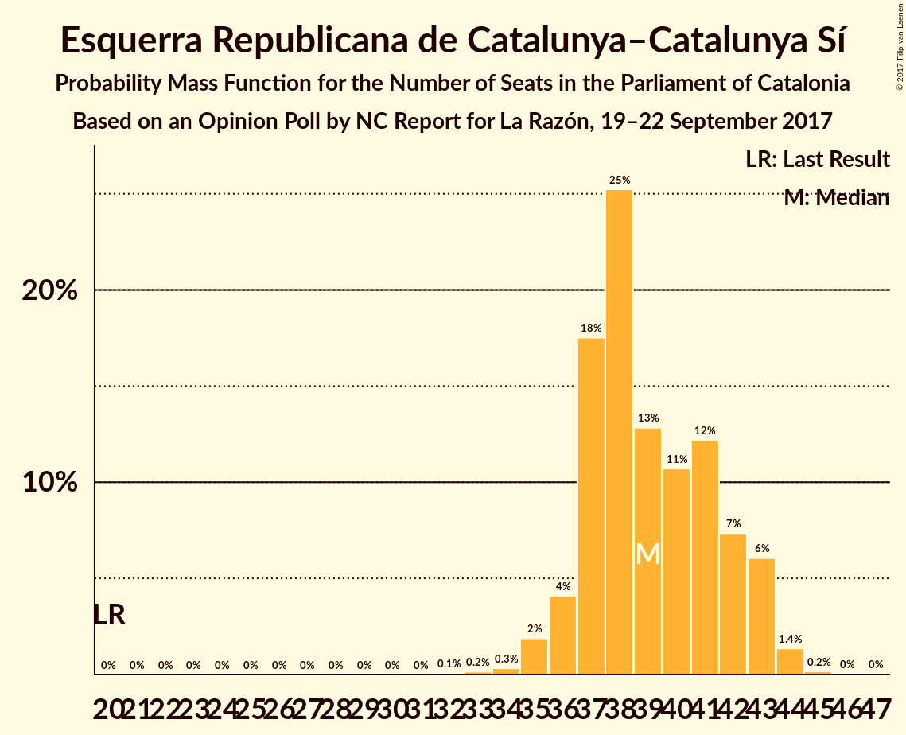
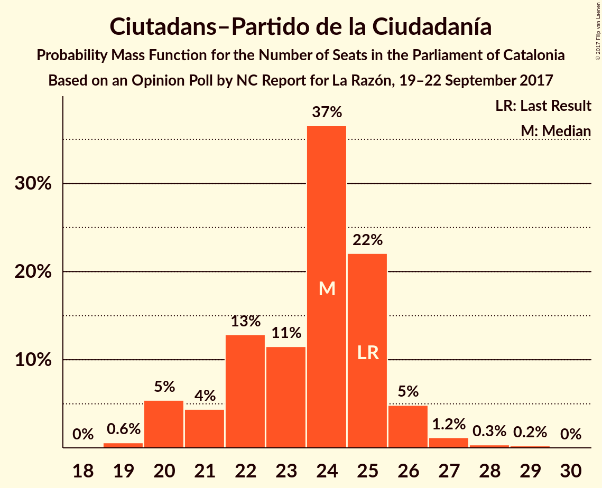
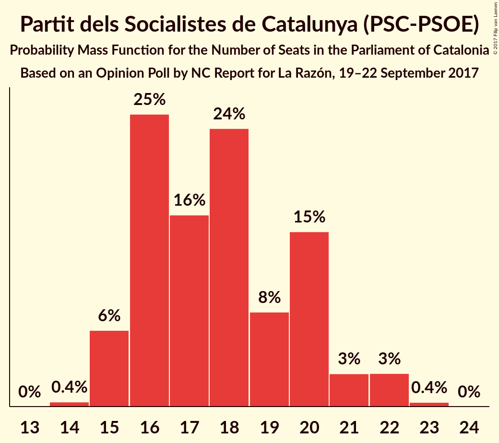
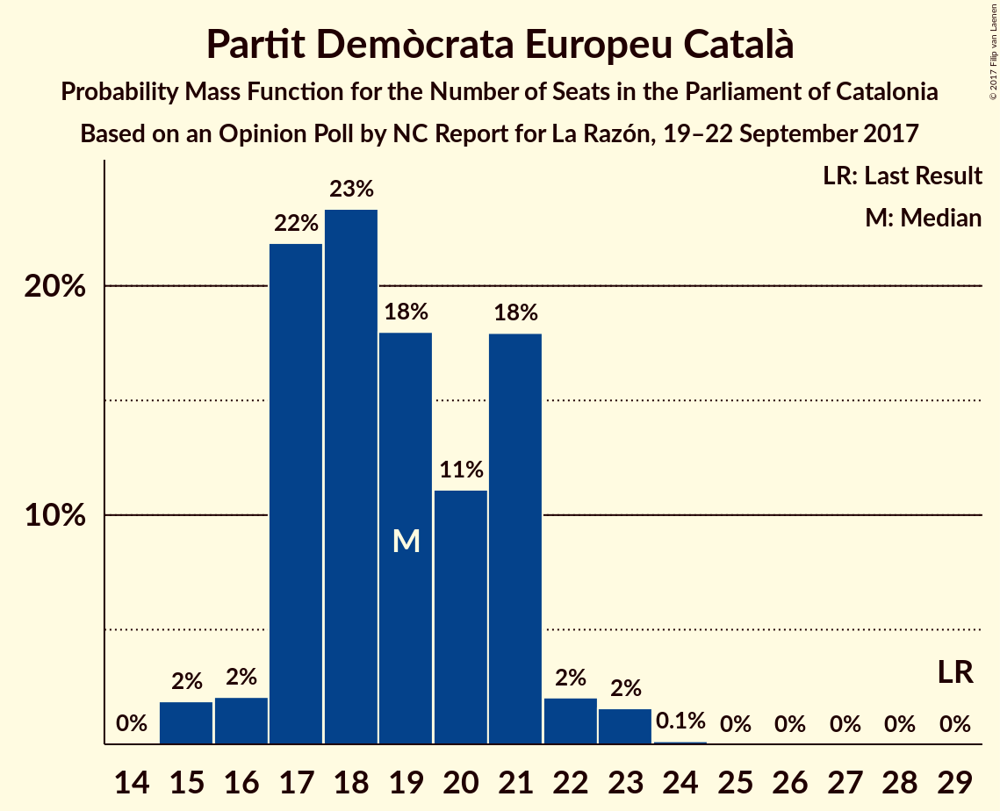
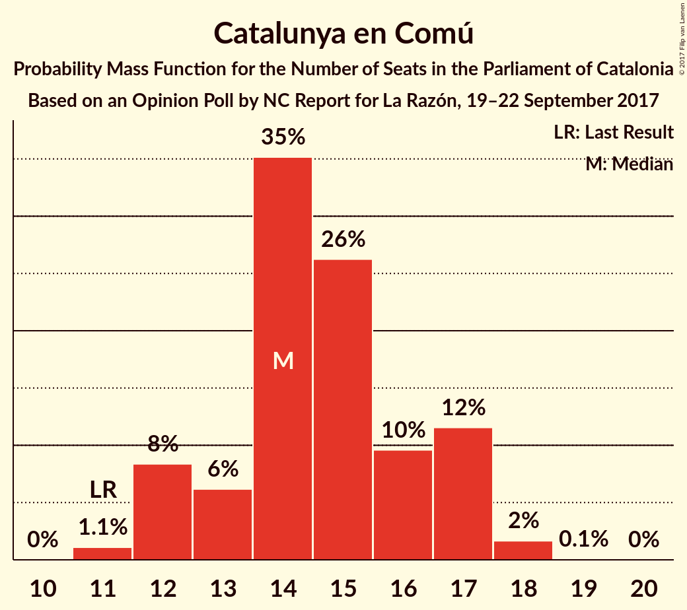
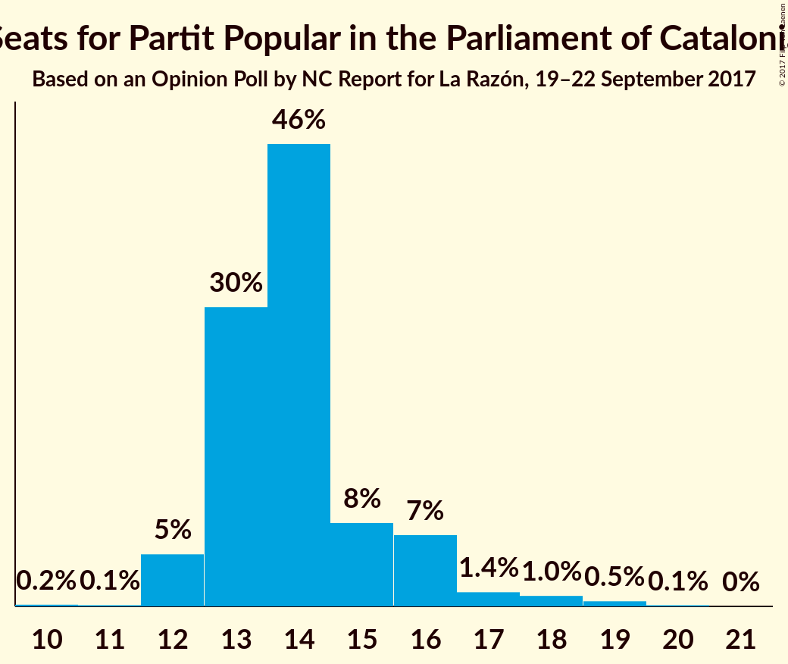
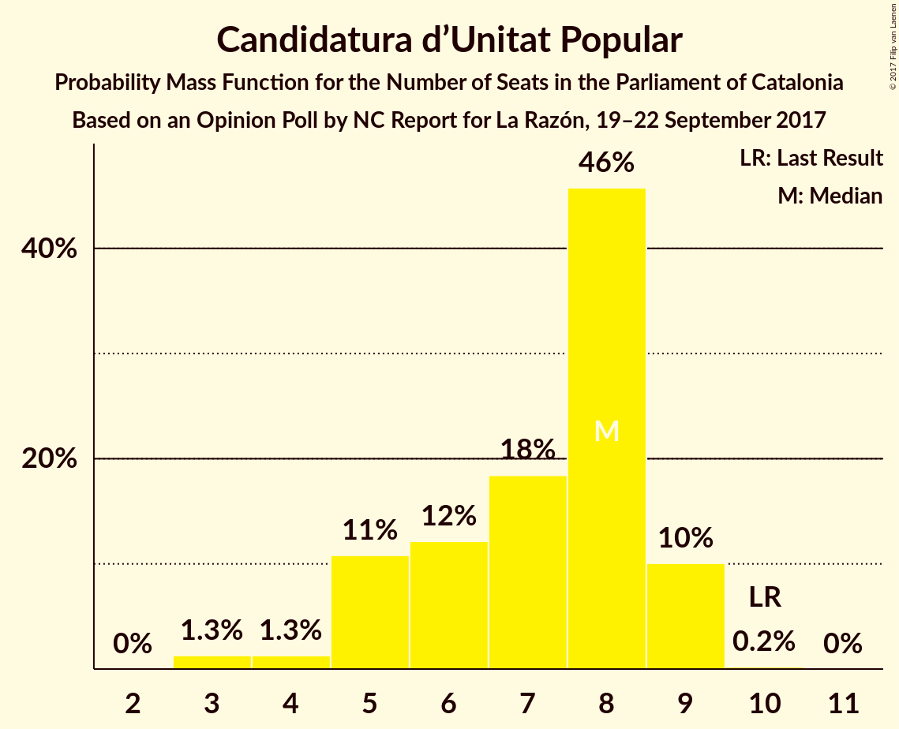

# Opinion Poll by NC Report for La Razón, 19–22 September 2017

<a href="#voting-intentions">Voting Intentions</a> | <a href="#seats">Seats</a> | <a href="#coalitions">Coalitions</a> | <a href="#technical-information">Technical Information</a>

## Voting Intentions

### Confidence Intervals

| Party | Last Result | Poll Result | 80% Confidence Interval | 90% Confidence Interval | 95% Confidence Interval | 99% Confidence Interval |
|:-----:|:-----------:|:-----------:|:-----------------------:|:-----------------------:|:-----------------------:|:-----------------------:|
| Esquerra Republicana de Catalunya–Catalunya Sí | 39.6% | 25.1% | 23.6–26.7% |23.1–27.2% |22.8–27.6% |22.1–28.4% |
| Ciutadans–Partido de la Ciudadanía | 17.9% | 17.2% | 15.9–18.6% |15.5–19.1% |15.2–19.4% |14.6–20.1% |
| Partit dels Socialistes de Catalunya (PSC-PSOE) | 12.7% | 13.7% | 12.5–15.0% |12.2–15.4% |11.9–15.7% |11.4–16.4% |
| Partit Demòcrata Europeu Català | 39.6% | 12.7% | 11.5–13.9% |11.2–14.3% |10.9–14.6% |10.4–15.3% |
| Catalunya en Comú | 8.9% | 11.6% | 10.5–12.9% |10.2–13.2% |10.0–13.5% |9.5–14.1% |
| Partit Popular | 8.5% | 10.8% | 9.8–12.0% |9.5–12.4% |9.2–12.7% |8.7–13.3% |
| Candidatura d’Unitat Popular | 8.2% | 5.6% | 4.8–6.5% |4.6–6.8% |4.4–7.0% |4.1–7.5% |

*Note:* The poll result column reflects the actual value used in the calculations. Published results may vary slightly, and in addition be rounded to fewer digits.

## Seats

### Confidence Intervals

| Party | Last Result | Median | 80% Confidence Interval | 90% Confidence Interval | 95% Confidence Interval | 99% Confidence Interval |
|:-----:|:-----------:|:------:|:-----------------------:|:-----------------------:|:-----------------------:|:-----------------------:|
| <a href="#esquerra-republicana-de-catalunya–catalunya-sí">Esquerra Republicana de Catalunya–Catalunya Sí</a> | 20 | 39 | 37–42 |36–43 |35–43 |34–44 |
| <a href="#ciutadans–partido-de-la-ciudadanía">Ciutadans–Partido de la Ciudadanía</a> | 25 | 24 | 22–25 |20–26 |20–26 |19–28 |
| <a href="#partit-dels-socialistes-de-catalunya-(psc-psoe)">Partit dels Socialistes de Catalunya (PSC-PSOE)</a> | 16 | 17 | 16–20 |15–21 |15–22 |15–22 |
| <a href="#partit-demòcrata-europeu-català">Partit Demòcrata Europeu Català</a> | 29 | 19 | 17–21 |17–21 |16–22 |15–23 |
| <a href="#catalunya-en-comú">Catalunya en Comú</a> | 11 | 14 | 13–17 |12–17 |12–17 |11–18 |
| <a href="#partit-popular">Partit Popular</a> | 11 | 14 | 13–16 |12–16 |12–17 |12–19 |
| <a href="#candidatura-d’unitat-popular">Candidatura d’Unitat Popular</a> | 10 | 8 | 5–9 |5–9 |4–9 |3–9 |

### Esquerra Republicana de Catalunya–Catalunya Sí

*For a full overview of the results for this party, see the [Esquerra Republicana de Catalunya–Catalunya Sí](party-esquerrarepublicanadecatalunyacatalunyas.html) page.*

| Number of Seats | Probability | Accumulated | Special Marks |
|:---------------:|:-----------:|:-----------:|:-------------:|
| 20 | 0% | 100% | Last Result |
| 21 | 0% | 100% |  |
| 22 | 0% | 100% |  |
| 23 | 0% | 100% |  |
| 24 | 0% | 100% |  |
| 25 | 0% | 100% |  |
| 26 | 0% | 100% |  |
| 27 | 0% | 100% |  |
| 28 | 0% | 100% |  |
| 29 | 0% | 100% |  |
| 30 | 0% | 100% |  |
| 31 | 0% | 100% |  |
| 32 | 0.1% | 100% |  |
| 33 | 0.1% | 99.9% |  |
| 34 | 0.3% | 99.8% |  |
| 35 | 2% | 99.5% |  |
| 36 | 5% | 97% |  |
| 37 | 18% | 92% |  |
| 38 | 22% | 74% |  |
| 39 | 14% | 52% | Median |
| 40 | 12% | 39% |  |
| 41 | 10% | 27% |  |
| 42 | 11% | 17% |  |
| 43 | 4% | 5% |  |
| 44 | 1.4% | 2% |  |
| 45 | 0.1% | 0.2% |  |
| 46 | 0% | 0.1% |  |
| 47 | 0% | 0% |  |

### Ciutadans–Partido de la Ciudadanía

*For a full overview of the results for this party, see the [Ciutadans–Partido de la Ciudadanía](party-ciutadanspartidodelaciudadana.html) page.*

| Number of Seats | Probability | Accumulated | Special Marks |
|:---------------:|:-----------:|:-----------:|:-------------:|
| 19 | 0.7% | 100% |  |
| 20 | 5% | 99.3% |  |
| 21 | 3% | 94% |  |
| 22 | 14% | 91% |  |
| 23 | 10% | 77% |  |
| 24 | 41% | 67% | Median |
| 25 | 20% | 27% | Last Result |
| 26 | 5% | 7% |  |
| 27 | 1.2% | 2% |  |
| 28 | 0.4% | 0.6% |  |
| 29 | 0.2% | 0.2% |  |
| 30 | 0% | 0% |  |

### Partit dels Socialistes de Catalunya (PSC-PSOE)

*For a full overview of the results for this party, see the [Partit dels Socialistes de Catalunya (PSC-PSOE)](party-partitdelssocialistesdecatalunyapscpsoe.html) page.*

| Number of Seats | Probability | Accumulated | Special Marks |
|:---------------:|:-----------:|:-----------:|:-------------:|
| 14 | 0.4% | 100% |  |
| 15 | 6% | 99.6% |  |
| 16 | 26% | 94% | Last Result |
| 17 | 21% | 68% | Median |
| 18 | 18% | 47% |  |
| 19 | 7% | 29% |  |
| 20 | 17% | 22% |  |
| 21 | 2% | 6% |  |
| 22 | 3% | 4% |  |
| 23 | 0.3% | 0.3% |  |
| 24 | 0% | 0% |  |

### Partit Demòcrata Europeu Català

*For a full overview of the results for this party, see the [Partit Demòcrata Europeu Català](party-partitdemcrataeuropeucatal.html) page.*

| Number of Seats | Probability | Accumulated | Special Marks |
|:---------------:|:-----------:|:-----------:|:-------------:|
| 14 | 0.1% | 100% |  |
| 15 | 2% | 99.9% |  |
| 16 | 2% | 98% |  |
| 17 | 24% | 96% |  |
| 18 | 22% | 72% |  |
| 19 | 15% | 50% | Median |
| 20 | 9% | 35% |  |
| 21 | 22% | 26% |  |
| 22 | 2% | 4% |  |
| 23 | 2% | 2% |  |
| 24 | 0.1% | 0.1% |  |
| 25 | 0% | 0% |  |
| 26 | 0% | 0% |  |
| 27 | 0% | 0% |  |
| 28 | 0% | 0% |  |
| 29 | 0% | 0% | Last Result |

### Catalunya en Comú

*For a full overview of the results for this party, see the [Catalunya en Comú](party-catalunyaencom.html) page.*

| Number of Seats | Probability | Accumulated | Special Marks |
|:---------------:|:-----------:|:-----------:|:-------------:|
| 10 | 0% | 100% |  |
| 11 | 1.0% | 99.9% | Last Result |
| 12 | 7% | 98.9% |  |
| 13 | 9% | 91% |  |
| 14 | 35% | 82% | Median |
| 15 | 24% | 48% |  |
| 16 | 10% | 24% |  |
| 17 | 12% | 13% |  |
| 18 | 2% | 2% |  |
| 19 | 0.1% | 0.1% |  |
| 20 | 0% | 0% |  |

### Partit Popular

*For a full overview of the results for this party, see the [Partit Popular](party-partitpopular.html) page.*

| Number of Seats | Probability | Accumulated | Special Marks |
|:---------------:|:-----------:|:-----------:|:-------------:|
| 10 | 0.2% | 100% |  |
| 11 | 0.2% | 99.8% | Last Result |
| 12 | 5% | 99.7% |  |
| 13 | 29% | 94% |  |
| 14 | 47% | 66% | Median |
| 15 | 8% | 19% |  |
| 16 | 7% | 10% |  |
| 17 | 2% | 3% |  |
| 18 | 0.9% | 1.5% |  |
| 19 | 0.4% | 0.5% |  |
| 20 | 0.1% | 0.1% |  |
| 21 | 0% | 0% |  |

### Candidatura d’Unitat Popular

*For a full overview of the results for this party, see the [Candidatura d’Unitat Popular](party-candidaturadunitatpopular.html) page.*

| Number of Seats | Probability | Accumulated | Special Marks |
|:---------------:|:-----------:|:-----------:|:-------------:|
| 3 | 1.3% | 100% |  |
| 4 | 1.3% | 98.7% |  |
| 5 | 11% | 97% |  |
| 6 | 12% | 87% |  |
| 7 | 18% | 74% |  |
| 8 | 46% | 56% | Median |
| 9 | 10% | 10% |  |
| 10 | 0.2% | 0.2% | Last Result |
| 11 | 0% | 0% |  |

## Coalitions

### Confidence Intervals

| Coalition | Last Result | Median | Majority? | 80% Confidence Interval | 90% Confidence Interval | 95% Confidence Interval | 99% Confidence Interval |
|:---------:|:-----------:|:------:|:---------:|:-----------------------:|:-----------------------:|:-----------------------:|:-----------------------:|
| Esquerra Republicana de Catalunya–Catalunya Sí – Partit Demòcrata Europeu Català – Catalunya en Comú | 60 | 73 | 98.5% | 69–75 | 69–76 | 68–77 | 67–78 |
| Ciutadans–Partido de la Ciudadanía – Partit dels Socialistes de Catalunya (PSC-PSOE) – Catalunya en Comú – Partit Popular | 63 | 70 | 88% | 67–73 | 66–74 | 65–74 | 64–76 |
| Esquerra Republicana de Catalunya–Catalunya Sí – Partit Demòcrata Europeu Català – Candidatura d’Unitat Popular | 59 | 65 | 12% | 62–68 | 61–69 | 61–70 | 59–71 |
| Esquerra Republicana de Catalunya–Catalunya Sí – Partit Demòcrata Europeu Català | 49 | 58 | 0% | 55–61 | 54–62 | 54–62 | 53–64 |
| Ciutadans–Partido de la Ciudadanía – Partit dels Socialistes de Catalunya (PSC-PSOE) – Partit Popular | 52 | 55 | 0% | 52–58 | 52–59 | 51–60 | 49–61 |

### Esquerra Republicana de Catalunya–Catalunya Sí – Partit Demòcrata Europeu Català – Catalunya en Comú

| Number of Seats | Probability | Accumulated | Special Marks |
|:---------------:|:-----------:|:-----------:|:-------------:|
| 60 | 0% | 100% | Last Result |
| 61 | 0% | 100% |  |
| 62 | 0% | 100% |  |
| 63 | 0% | 100% |  |
| 64 | 0% | 100% |  |
| 65 | 0.1% | 100% |  |
| 66 | 0.4% | 99.9% |  |
| 67 | 1.0% | 99.6% |  |
| 68 | 3% | 98.5% | Majority |
| 69 | 7% | 95% |  |
| 70 | 5% | 88% |  |
| 71 | 15% | 83% |  |
| 72 | 16% | 68% | Median |
| 73 | 22% | 52% |  |
| 74 | 12% | 30% |  |
| 75 | 8% | 18% |  |
| 76 | 5% | 10% |  |
| 77 | 3% | 4% |  |
| 78 | 1.5% | 2% |  |
| 79 | 0.4% | 0.5% |  |
| 80 | 0% | 0.1% |  |
| 81 | 0% | 0% |  |

### Ciutadans–Partido de la Ciudadanía – Partit dels Socialistes de Catalunya (PSC-PSOE) – Catalunya en Comú – Partit Popular

| Number of Seats | Probability | Accumulated | Special Marks |
|:---------------:|:-----------:|:-----------:|:-------------:|
| 63 | 0.1% | 100% | Last Result |
| 64 | 1.0% | 99.8% |  |
| 65 | 2% | 98.8% |  |
| 66 | 5% | 97% |  |
| 67 | 5% | 92% |  |
| 68 | 15% | 88% | Majority |
| 69 | 16% | 72% | Median |
| 70 | 21% | 57% |  |
| 71 | 9% | 36% |  |
| 72 | 14% | 27% |  |
| 73 | 7% | 13% |  |
| 74 | 4% | 6% |  |
| 75 | 1.1% | 2% |  |
| 76 | 0.5% | 0.7% |  |
| 77 | 0.1% | 0.2% |  |
| 78 | 0% | 0% |  |

### Esquerra Republicana de Catalunya–Catalunya Sí – Partit Demòcrata Europeu Català – Candidatura d’Unitat Popular

| Number of Seats | Probability | Accumulated | Special Marks |
|:---------------:|:-----------:|:-----------:|:-------------:|
| 58 | 0.1% | 100% |  |
| 59 | 0.5% | 99.8% | Last Result |
| 60 | 1.1% | 99.3% |  |
| 61 | 4% | 98% |  |
| 62 | 7% | 94% |  |
| 63 | 14% | 87% |  |
| 64 | 9% | 73% |  |
| 65 | 21% | 64% |  |
| 66 | 16% | 43% | Median |
| 67 | 15% | 28% |  |
| 68 | 5% | 12% | Majority |
| 69 | 5% | 8% |  |
| 70 | 2% | 3% |  |
| 71 | 1.0% | 1.2% |  |
| 72 | 0.1% | 0.2% |  |
| 73 | 0% | 0% |  |

### Esquerra Republicana de Catalunya–Catalunya Sí – Partit Demòcrata Europeu Català

| Number of Seats | Probability | Accumulated | Special Marks |
|:---------------:|:-----------:|:-----------:|:-------------:|
| 49 | 0% | 100% | Last Result |
| 50 | 0% | 100% |  |
| 51 | 0.1% | 100% |  |
| 52 | 0.3% | 99.9% |  |
| 53 | 1.0% | 99.6% |  |
| 54 | 6% | 98.6% |  |
| 55 | 10% | 92% |  |
| 56 | 8% | 83% |  |
| 57 | 18% | 75% |  |
| 58 | 16% | 57% | Median |
| 59 | 21% | 41% |  |
| 60 | 8% | 20% |  |
| 61 | 7% | 13% |  |
| 62 | 4% | 6% |  |
| 63 | 1.2% | 2% |  |
| 64 | 0.7% | 0.8% |  |
| 65 | 0.1% | 0.1% |  |
| 66 | 0% | 0% |  |

### Ciutadans–Partido de la Ciudadanía – Partit dels Socialistes de Catalunya (PSC-PSOE) – Partit Popular

| Number of Seats | Probability | Accumulated | Special Marks |
|:---------------:|:-----------:|:-----------:|:-------------:|
| 48 | 0.1% | 100% |  |
| 49 | 0.6% | 99.9% |  |
| 50 | 1.4% | 99.4% |  |
| 51 | 2% | 98% |  |
| 52 | 6% | 96% | Last Result |
| 53 | 9% | 90% |  |
| 54 | 18% | 81% |  |
| 55 | 21% | 63% | Median |
| 56 | 14% | 41% |  |
| 57 | 8% | 27% |  |
| 58 | 11% | 20% |  |
| 59 | 6% | 8% |  |
| 60 | 1.3% | 3% |  |
| 61 | 1.1% | 1.4% |  |
| 62 | 0.2% | 0.3% |  |
| 63 | 0% | 0% |  |

## Technical Information

### Opinion Poll

+ **Polling firm:** NC Report
+ **Commissioner(s):** La Razón
+ **Fieldwork period:** 19–22 September 2017

### Calculations

+ **Sample size:** 1255
+ **Simulations done:** 262,144
+ **Error estimate:** 0.76%

