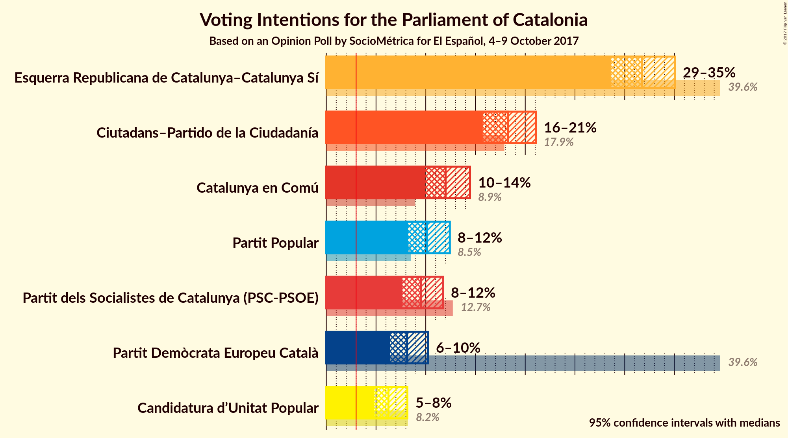
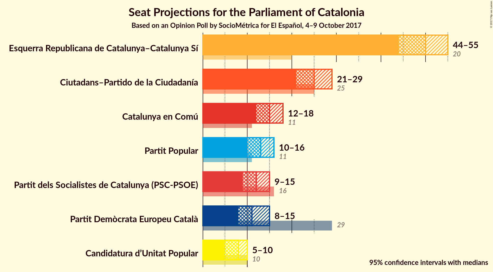
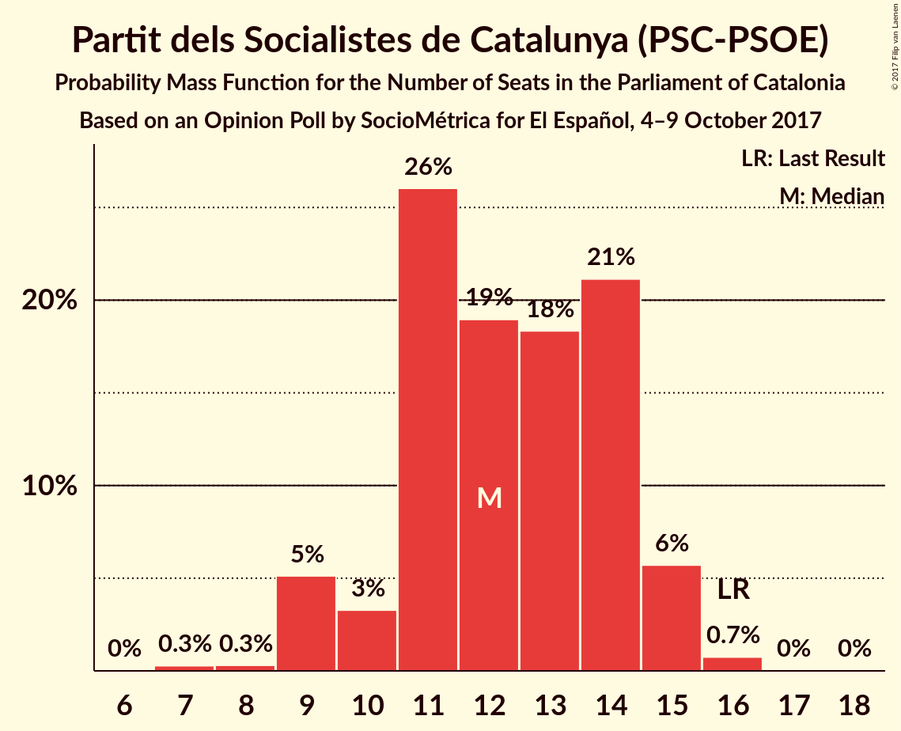
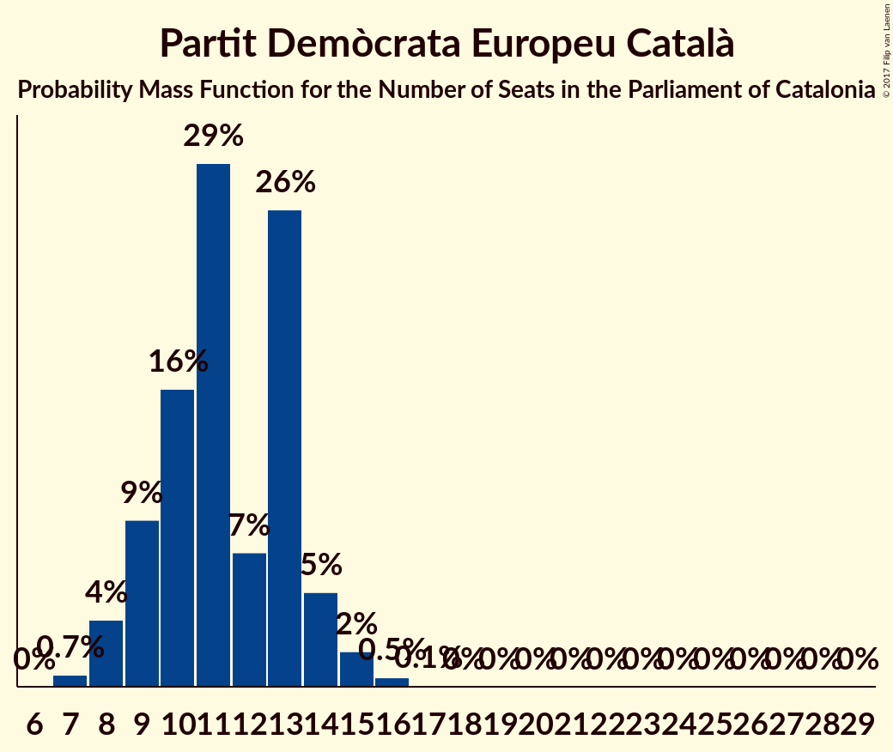
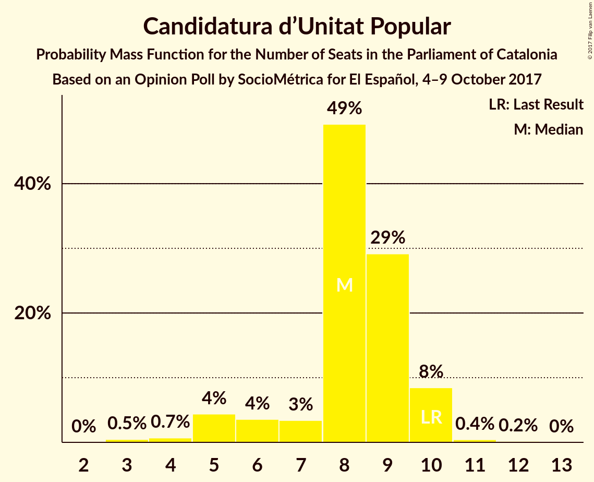
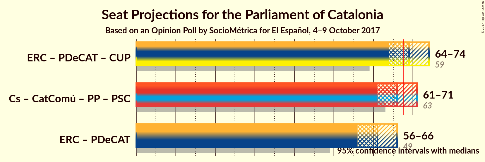

# Opinion Poll by SocioMétrica for El Español, 4–9 October 2017

<a href="#voting-intentions">Voting Intentions</a> | <a href="#seats">Seats</a> | <a href="#coalitions">Coalitions</a> | <a href="#technical-information">Technical Information</a>

## Voting Intentions

### Confidence Intervals

| Party | Last Result | Poll Result | 80% Confidence Interval | 90% Confidence Interval | 95% Confidence Interval | 99% Confidence Interval |
|:-----:|:-----------:|:-----------:|:-----------------------:|:-----------------------:|:-----------------------:|:-----------------------:|
| Esquerra Republicana de Catalunya–Catalunya Sí | 39.6% | 31.8% | 29.7–33.9% |29.1–34.5% |28.6–35.1% |27.6–36.1% |
| Ciutadans–Partido de la Ciudadanía | 17.9% | 18.2% | 16.6–20.1% |16.1–20.6% |15.7–21.1% |15.0–22.0% |
| Catalunya en Comú | 8.9% | 12.0% | 10.6–13.6% |10.2–14.1% |9.9–14.4% |9.3–15.2% |
| Partit Popular | 8.5% | 10.1% | 8.9–11.6% |8.5–12.0% |8.2–12.4% |7.7–13.2% |
| Partit dels Socialistes de Catalunya (PSC-PSOE) | 12.7% | 9.5% | 8.3–11.0% |7.9–11.4% |7.7–11.7% |7.1–12.5% |
| Partit Demòcrata Europeu Català | 39.6% | 8.1% | 7.0–9.5% |6.7–9.9% |6.4–10.2% |5.9–10.9% |
| Candidatura d’Unitat Popular | 8.2% | 6.2% | 5.3–7.5% |5.0–7.8% |4.8–8.2% |4.3–8.8% |

*Note:* The poll result column reflects the actual value used in the calculations. Published results may vary slightly, and in addition be rounded to fewer digits.

## Seats

### Confidence Intervals

| Party | Last Result | Median | 80% Confidence Interval | 90% Confidence Interval | 95% Confidence Interval | 99% Confidence Interval |
|:-----:|:-----------:|:------:|:-----------------------:|:-----------------------:|:-----------------------:|:-----------------------:|
| <a href="#esquerra-republicana-de-catalunya–catalunya-sí">Esquerra Republicana de Catalunya–Catalunya Sí</a> | 20 | 50 | 46–53 |45–54 |44–55 |43–56 |
| <a href="#ciutadans–partido-de-la-ciudadanía">Ciutadans–Partido de la Ciudadanía</a> | 25 | 25 | 22–27 |21–28 |21–29 |20–31 |
| <a href="#catalunya-en-comú">Catalunya en Comú</a> | 11 | 15 | 13–17 |12–18 |12–18 |11–19 |
| <a href="#partit-popular">Partit Popular</a> | 11 | 13 | 12–15 |11–15 |10–16 |10–18 |
| <a href="#partit-dels-socialistes-de-catalunya-(psc-psoe)">Partit dels Socialistes de Catalunya (PSC-PSOE)</a> | 16 | 12 | 11–14 |9–15 |9–15 |8–16 |
| <a href="#partit-demòcrata-europeu-català">Partit Demòcrata Europeu Català</a> | 29 | 11 | 9–13 |9–14 |8–15 |7–16 |
| <a href="#candidatura-d’unitat-popular">Candidatura d’Unitat Popular</a> | 10 | 8 | 7–9 |5–10 |5–10 |4–11 |

### Esquerra Republicana de Catalunya–Catalunya Sí

*For a full overview of the results for this party, see the [Esquerra Republicana de Catalunya–Catalunya Sí](party-esquerrarepublicanadecatalunyacatalunyas.html) page.*

| Number of Seats | Probability | Accumulated | Special Marks |
|:---------------:|:-----------:|:-----------:|:-------------:|
| 20 | 0% | 100% | Last Result |
| 21 | 0% | 100% |  |
| 22 | 0% | 100% |  |
| 23 | 0% | 100% |  |
| 24 | 0% | 100% |  |
| 25 | 0% | 100% |  |
| 26 | 0% | 100% |  |
| 27 | 0% | 100% |  |
| 28 | 0% | 100% |  |
| 29 | 0% | 100% |  |
| 30 | 0% | 100% |  |
| 31 | 0% | 100% |  |
| 32 | 0% | 100% |  |
| 33 | 0% | 100% |  |
| 34 | 0% | 100% |  |
| 35 | 0% | 100% |  |
| 36 | 0% | 100% |  |
| 37 | 0% | 100% |  |
| 38 | 0% | 100% |  |
| 39 | 0% | 100% |  |
| 40 | 0% | 100% |  |
| 41 | 0% | 100% |  |
| 42 | 0.1% | 100% |  |
| 43 | 0.5% | 99.9% |  |
| 44 | 2% | 99.4% |  |
| 45 | 3% | 97% |  |
| 46 | 5% | 94% |  |
| 47 | 7% | 89% |  |
| 48 | 10% | 82% |  |
| 49 | 17% | 72% |  |
| 50 | 20% | 55% | Median |
| 51 | 17% | 36% |  |
| 52 | 8% | 19% |  |
| 53 | 5% | 11% |  |
| 54 | 2% | 6% |  |
| 55 | 2% | 3% |  |
| 56 | 0.8% | 1.2% |  |
| 57 | 0.3% | 0.5% |  |
| 58 | 0.1% | 0.1% |  |
| 59 | 0% | 0% |  |

### Ciutadans–Partido de la Ciudadanía

*For a full overview of the results for this party, see the [Ciutadans–Partido de la Ciudadanía](party-ciutadanspartidodelaciudadana.html) page.*

| Number of Seats | Probability | Accumulated | Special Marks |
|:---------------:|:-----------:|:-----------:|:-------------:|
| 19 | 0.1% | 100% |  |
| 20 | 2% | 99.8% |  |
| 21 | 5% | 98% |  |
| 22 | 4% | 93% |  |
| 23 | 6% | 89% |  |
| 24 | 16% | 83% |  |
| 25 | 29% | 67% | Last Result, Median |
| 26 | 23% | 39% |  |
| 27 | 7% | 16% |  |
| 28 | 4% | 9% |  |
| 29 | 2% | 5% |  |
| 30 | 2% | 2% |  |
| 31 | 0.5% | 0.5% |  |
| 32 | 0% | 0.1% |  |
| 33 | 0% | 0% |  |

### Catalunya en Comú

*For a full overview of the results for this party, see the [Catalunya en Comú](party-catalunyaencom.html) page.*

| Number of Seats | Probability | Accumulated | Special Marks |
|:---------------:|:-----------:|:-----------:|:-------------:|
| 10 | 0.1% | 100% |  |
| 11 | 0.8% | 99.8% | Last Result |
| 12 | 7% | 99.0% |  |
| 13 | 9% | 92% |  |
| 14 | 16% | 83% |  |
| 15 | 26% | 66% | Median |
| 16 | 11% | 40% |  |
| 17 | 20% | 30% |  |
| 18 | 8% | 10% |  |
| 19 | 2% | 2% |  |
| 20 | 0.2% | 0.3% |  |
| 21 | 0% | 0% |  |

### Partit Popular

*For a full overview of the results for this party, see the [Partit Popular](party-partitpopular.html) page.*

| Number of Seats | Probability | Accumulated | Special Marks |
|:---------------:|:-----------:|:-----------:|:-------------:|
| 9 | 0.1% | 100% |  |
| 10 | 3% | 99.8% |  |
| 11 | 2% | 97% | Last Result |
| 12 | 17% | 94% |  |
| 13 | 39% | 77% | Median |
| 14 | 28% | 38% |  |
| 15 | 7% | 10% |  |
| 16 | 1.3% | 3% |  |
| 17 | 0.6% | 2% |  |
| 18 | 0.8% | 1.1% |  |
| 19 | 0.2% | 0.3% |  |
| 20 | 0.1% | 0.1% |  |
| 21 | 0% | 0% |  |

### Partit dels Socialistes de Catalunya (PSC-PSOE)

*For a full overview of the results for this party, see the [Partit dels Socialistes de Catalunya (PSC-PSOE)](party-partitdelssocialistesdecatalunyapscpsoe.html) page.*

| Number of Seats | Probability | Accumulated | Special Marks |
|:---------------:|:-----------:|:-----------:|:-------------:|
| 7 | 0.3% | 100% |  |
| 8 | 0.3% | 99.7% |  |
| 9 | 5% | 99.4% |  |
| 10 | 3% | 94% |  |
| 11 | 26% | 91% |  |
| 12 | 18% | 65% | Median |
| 13 | 20% | 47% |  |
| 14 | 20% | 27% |  |
| 15 | 6% | 7% |  |
| 16 | 0.8% | 0.9% | Last Result |
| 17 | 0% | 0.1% |  |
| 18 | 0% | 0% |  |

### Partit Demòcrata Europeu Català

*For a full overview of the results for this party, see the [Partit Demòcrata Europeu Català](party-partitdemcrataeuropeucatal.html) page.*

| Number of Seats | Probability | Accumulated | Special Marks |
|:---------------:|:-----------:|:-----------:|:-------------:|
| 7 | 0.7% | 100% |  |
| 8 | 4% | 99.3% |  |
| 9 | 9% | 96% |  |
| 10 | 16% | 86% |  |
| 11 | 29% | 70% | Median |
| 12 | 7% | 41% |  |
| 13 | 26% | 34% |  |
| 14 | 5% | 8% |  |
| 15 | 2% | 3% |  |
| 16 | 0.5% | 0.6% |  |
| 17 | 0.1% | 0.1% |  |
| 18 | 0% | 0% |  |
| 19 | 0% | 0% |  |
| 20 | 0% | 0% |  |
| 21 | 0% | 0% |  |
| 22 | 0% | 0% |  |
| 23 | 0% | 0% |  |
| 24 | 0% | 0% |  |
| 25 | 0% | 0% |  |
| 26 | 0% | 0% |  |
| 27 | 0% | 0% |  |
| 28 | 0% | 0% |  |
| 29 | 0% | 0% | Last Result |

### Candidatura d’Unitat Popular

*For a full overview of the results for this party, see the [Candidatura d’Unitat Popular](party-candidaturadunitatpopular.html) page.*

| Number of Seats | Probability | Accumulated | Special Marks |
|:---------------:|:-----------:|:-----------:|:-------------:|
| 3 | 0.5% | 100% |  |
| 4 | 0.7% | 99.5% |  |
| 5 | 4% | 98.8% |  |
| 6 | 4% | 94% |  |
| 7 | 3% | 91% |  |
| 8 | 49% | 87% | Median |
| 9 | 29% | 38% |  |
| 10 | 8% | 9% | Last Result |
| 11 | 0.4% | 0.6% |  |
| 12 | 0.2% | 0.2% |  |
| 13 | 0% | 0% |  |

## Coalitions

### Confidence Intervals

| Coalition | Last Result | Median | Majority? | 80% Confidence Interval | 90% Confidence Interval | 95% Confidence Interval | 99% Confidence Interval |
|:---------:|:-----------:|:------:|:---------:|:-----------------------:|:-----------------------:|:-----------------------:|:-----------------------:|
| Esquerra Republicana de Catalunya–Catalunya Sí – Partit Demòcrata Europeu Català – Candidatura d’Unitat Popular | 59 | 69 | 77% | 66–73 | 65–73 | 64–74 | 63–76 |
| Ciutadans–Partido de la Ciudadanía – Catalunya en Comú – Partit Popular – Partit dels Socialistes de Catalunya (PSC-PSOE) | 63 | 66 | 23% | 62–69 | 62–70 | 61–71 | 59–72 |
| Esquerra Republicana de Catalunya–Catalunya Sí – Partit Demòcrata Europeu Català | 49 | 61 | 0.7% | 58–64 | 57–65 | 56–66 | 54–68 |

### Esquerra Republicana de Catalunya–Catalunya Sí – Partit Demòcrata Europeu Català – Candidatura d’Unitat Popular

| Number of Seats | Probability | Accumulated | Special Marks |
|:---------------:|:-----------:|:-----------:|:-------------:|
| 59 | 0% | 100% | Last Result |
| 60 | 0% | 100% |  |
| 61 | 0.1% | 100% |  |
| 62 | 0.4% | 99.9% |  |
| 63 | 1.1% | 99.5% |  |
| 64 | 2% | 98% |  |
| 65 | 3% | 96% |  |
| 66 | 6% | 94% |  |
| 67 | 11% | 87% |  |
| 68 | 18% | 77% | Majority |
| 69 | 14% | 58% | Median |
| 70 | 14% | 45% |  |
| 71 | 12% | 31% |  |
| 72 | 8% | 19% |  |
| 73 | 6% | 11% |  |
| 74 | 3% | 5% |  |
| 75 | 1.0% | 2% |  |
| 76 | 0.5% | 0.7% |  |
| 77 | 0.1% | 0.2% |  |
| 78 | 0.1% | 0.1% |  |
| 79 | 0% | 0% |  |

### Ciutadans–Partido de la Ciudadanía – Catalunya en Comú – Partit Popular – Partit dels Socialistes de Catalunya (PSC-PSOE)

| Number of Seats | Probability | Accumulated | Special Marks |
|:---------------:|:-----------:|:-----------:|:-------------:|
| 57 | 0.1% | 100% |  |
| 58 | 0.1% | 99.9% |  |
| 59 | 0.5% | 99.8% |  |
| 60 | 1.0% | 99.3% |  |
| 61 | 3% | 98% |  |
| 62 | 6% | 95% |  |
| 63 | 8% | 89% | Last Result |
| 64 | 12% | 81% |  |
| 65 | 14% | 69% | Median |
| 66 | 14% | 55% |  |
| 67 | 18% | 42% |  |
| 68 | 11% | 23% | Majority |
| 69 | 6% | 13% |  |
| 70 | 3% | 6% |  |
| 71 | 2% | 4% |  |
| 72 | 1.1% | 2% |  |
| 73 | 0.4% | 0.5% |  |
| 74 | 0.1% | 0.1% |  |
| 75 | 0% | 0% |  |

### Esquerra Republicana de Catalunya–Catalunya Sí – Partit Demòcrata Europeu Català

| Number of Seats | Probability | Accumulated | Special Marks |
|:---------------:|:-----------:|:-----------:|:-------------:|
| 49 | 0% | 100% | Last Result |
| 50 | 0% | 100% |  |
| 51 | 0% | 100% |  |
| 52 | 0% | 100% |  |
| 53 | 0.1% | 100% |  |
| 54 | 0.4% | 99.8% |  |
| 55 | 1.3% | 99.5% |  |
| 56 | 2% | 98% |  |
| 57 | 3% | 96% |  |
| 58 | 8% | 93% |  |
| 59 | 13% | 85% |  |
| 60 | 17% | 73% |  |
| 61 | 13% | 56% | Median |
| 62 | 14% | 43% |  |
| 63 | 12% | 29% |  |
| 64 | 9% | 18% |  |
| 65 | 5% | 8% |  |
| 66 | 2% | 3% |  |
| 67 | 0.8% | 2% |  |
| 68 | 0.4% | 0.7% | Majority |
| 69 | 0.2% | 0.3% |  |
| 70 | 0.1% | 0.1% |  |
| 71 | 0% | 0% |  |

## Technical Information

### Opinion Poll

+ **Polling firm:** SocioMétrica
+ **Commissioner(s):** El Español
+ **Fieldwork period:** 4–9 October 2017

### Calculations

+ **Sample size:** 800
+ **Simulations done:** 1,048,576
+ **Error estimate:** 0.94%

