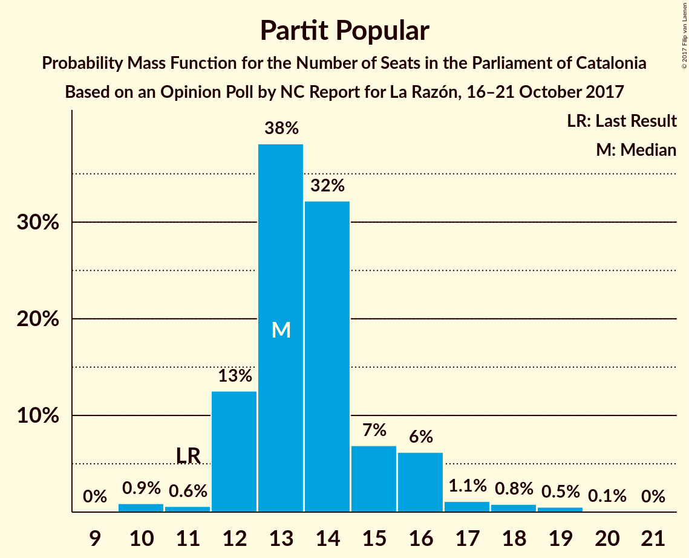
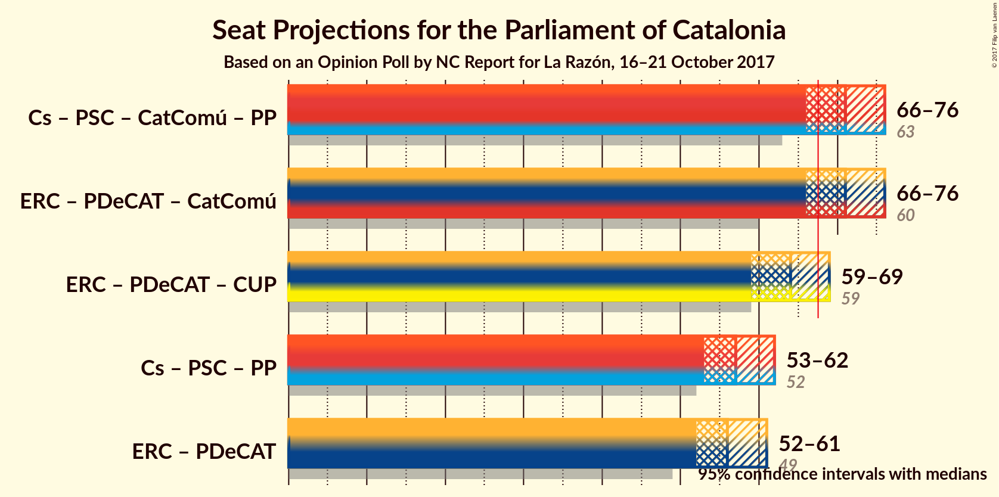

# Opinion Poll by NC Report for La Razón, 16–21 October 2017

<a href="#voting-intentions">Voting Intentions</a> | <a href="#seats">Seats</a> | <a href="#coalitions">Coalitions</a> | <a href="#technical-information">Technical Information</a>

## Voting Intentions

### Confidence Intervals

| Party | Last Result | Poll Result | 80% Confidence Interval | 90% Confidence Interval | 95% Confidence Interval | 99% Confidence Interval |
|:-----:|:-----------:|:-----------:|:-----------------------:|:-----------------------:|:-----------------------:|:-----------------------:|
| Esquerra Republicana de Catalunya–Catalunya Sí | 39.6% | 24.6% | 22.9–26.4% |22.4–26.9% |22.0–27.4% |21.2–28.3% |
| Ciutadans–Partido de la Ciudadanía | 17.9% | 19.2% | 17.7–20.9% |17.2–21.4% |16.9–21.8% |16.2–22.6% |
| Partit dels Socialistes de Catalunya (PSC-PSOE) | 12.7% | 13.1% | 11.8–14.6% |11.4–15.0% |11.1–15.3% |10.6–16.1% |
| Partit Demòcrata Europeu Català | 39.6% | 12.1% | 10.9–13.5% |10.5–13.9% |10.2–14.3% |9.6–15.0% |
| Catalunya en Comú | 8.9% | 11.4% | 10.2–12.8% |9.9–13.2% |9.6–13.5% |9.0–14.2% |
| Partit Popular | 8.5% | 10.5% | 9.3–11.8% |9.0–12.2% |8.7–12.6% |8.2–13.2% |
| Candidatura d’Unitat Popular | 8.2% | 5.6% | 4.8–6.6% |4.5–7.0% |4.3–7.2% |4.0–7.7% |

*Note:* The poll result column reflects the actual value used in the calculations. Published results may vary slightly, and in addition be rounded to fewer digits.

## Seats

### Confidence Intervals

| Party | Last Result | Median | 80% Confidence Interval | 90% Confidence Interval | 95% Confidence Interval | 99% Confidence Interval |
|:-----:|:-----------:|:------:|:-----------------------:|:-----------------------:|:-----------------------:|:-----------------------:|
| <a href="#esquerra-republicana-de-catalunya–catalunya-sí">Esquerra Republicana de Catalunya–Catalunya Sí</a> | 20 | 37 | 37 |37–39 |37–42 |37–43 |
| <a href="#ciutadans–partido-de-la-ciudadanía">Ciutadans–Partido de la Ciudadanía</a> | 25 | 28 | 28 |24–28 |22–28 |22–30 |
| <a href="#partit-dels-socialistes-de-catalunya-(psc-psoe)">Partit dels Socialistes de Catalunya (PSC-PSOE)</a> | 16 | 16 | 16 |15–16 |15–16 |14–20 |
| <a href="#partit-demòcrata-europeu-català">Partit Demòcrata Europeu Català</a> | 29 | 19 | 19 |17–19 |17–21 |15–21 |
| <a href="#catalunya-en-comú">Catalunya en Comú</a> | 11 | 14 | 14 |14–16 |13–18 |12–18 |
| <a href="#partit-popular">Partit Popular</a> | 11 | 13 | 13 |12–14 |12–14 |11–19 |
| <a href="#candidatura-d’unitat-popular">Candidatura d’Unitat Popular</a> | 10 | 8 | 8 |8–9 |5–9 |4–9 |

### Esquerra Republicana de Catalunya–Catalunya Sí

*For a full overview of the results for this party, see the [Esquerra Republicana de Catalunya–Catalunya Sí](party-esquerrarepublicanadecatalunyacatalunyas.html) page.*

| Number of Seats | Probability | Accumulated | Special Marks |
|:---------------:|:-----------:|:-----------:|:-------------:|
| 20 | 0% | 100% | Last Result |
| 21 | 0% | 100% |  |
| 22 | 0% | 100% |  |
| 23 | 0% | 100% |  |
| 24 | 0% | 100% |  |
| 25 | 0% | 100% |  |
| 26 | 0% | 100% |  |
| 27 | 0% | 100% |  |
| 28 | 0% | 100% |  |
| 29 | 0% | 100% |  |
| 30 | 0% | 100% |  |
| 31 | 0% | 100% |  |
| 32 | 0% | 100% |  |
| 33 | 0% | 100% |  |
| 34 | 0% | 100% |  |
| 35 | 0% | 100% |  |
| 36 | 0% | 100% |  |
| 37 | 90% | 100% | Median |
| 38 | 3% | 10% |  |
| 39 | 2% | 6% |  |
| 40 | 0% | 4% |  |
| 41 | 0.7% | 4% |  |
| 42 | 3% | 4% |  |
| 43 | 0.4% | 0.6% |  |
| 44 | 0.2% | 0.3% |  |
| 45 | 0% | 0% |  |

### Ciutadans–Partido de la Ciudadanía

*For a full overview of the results for this party, see the [Ciutadans–Partido de la Ciudadanía](party-ciutadanspartidodelaciudadana.html) page.*

| Number of Seats | Probability | Accumulated | Special Marks |
|:---------------:|:-----------:|:-----------:|:-------------:|
| 21 | 0.2% | 100% |  |
| 22 | 3% | 99.8% |  |
| 23 | 0.3% | 96% |  |
| 24 | 2% | 96% |  |
| 25 | 1.4% | 94% | Last Result |
| 26 | 1.1% | 93% |  |
| 27 | 0.3% | 91% |  |
| 28 | 89% | 91% | Median |
| 29 | 0.4% | 2% |  |
| 30 | 2% | 2% |  |
| 31 | 0% | 0.1% |  |
| 32 | 0% | 0% |  |

### Partit dels Socialistes de Catalunya (PSC-PSOE)

*For a full overview of the results for this party, see the [Partit dels Socialistes de Catalunya (PSC-PSOE)](party-partitdelssocialistesdecatalunyapscpsoe.html) page.*

| Number of Seats | Probability | Accumulated | Special Marks |
|:---------------:|:-----------:|:-----------:|:-------------:|
| 14 | 1.2% | 100% |  |
| 15 | 5% | 98.8% |  |
| 16 | 92% | 93% | Last Result, Median |
| 17 | 0% | 1.1% |  |
| 18 | 0.3% | 1.1% |  |
| 19 | 0.3% | 0.8% |  |
| 20 | 0.5% | 0.6% |  |
| 21 | 0% | 0% |  |

### Partit Demòcrata Europeu Català

*For a full overview of the results for this party, see the [Partit Demòcrata Europeu Català](party-partitdemcrataeuropeucatal.html) page.*

| Number of Seats | Probability | Accumulated | Special Marks |
|:---------------:|:-----------:|:-----------:|:-------------:|
| 14 | 0% | 100% |  |
| 15 | 0.8% | 99.9% |  |
| 16 | 0% | 99.2% |  |
| 17 | 5% | 99.1% |  |
| 18 | 0% | 94% |  |
| 19 | 89% | 94% | Median |
| 20 | 0.2% | 5% |  |
| 21 | 4% | 5% |  |
| 22 | 0.3% | 0.3% |  |
| 23 | 0% | 0% |  |
| 24 | 0% | 0% |  |
| 25 | 0% | 0% |  |
| 26 | 0% | 0% |  |
| 27 | 0% | 0% |  |
| 28 | 0% | 0% |  |
| 29 | 0% | 0% | Last Result |

### Catalunya en Comú

*For a full overview of the results for this party, see the [Catalunya en Comú](party-catalunyaencom.html) page.*

| Number of Seats | Probability | Accumulated | Special Marks |
|:---------------:|:-----------:|:-----------:|:-------------:|
| 9 | 0.3% | 100% |  |
| 10 | 0% | 99.7% |  |
| 11 | 0.2% | 99.7% | Last Result |
| 12 | 1.2% | 99.5% |  |
| 13 | 3% | 98% |  |
| 14 | 89% | 95% | Median |
| 15 | 0.2% | 6% |  |
| 16 | 0.9% | 5% |  |
| 17 | 1.1% | 5% |  |
| 18 | 3% | 3% |  |
| 19 | 0% | 0% |  |

### Partit Popular

*For a full overview of the results for this party, see the [Partit Popular](party-partitpopular.html) page.*

| Number of Seats | Probability | Accumulated | Special Marks |
|:---------------:|:-----------:|:-----------:|:-------------:|
| 11 | 1.3% | 100% | Last Result |
| 12 | 4% | 98.7% |  |
| 13 | 89% | 94% | Median |
| 14 | 4% | 6% |  |
| 15 | 0.4% | 2% |  |
| 16 | 0% | 1.4% |  |
| 17 | 0.1% | 1.4% |  |
| 18 | 0% | 1.2% |  |
| 19 | 1.2% | 1.2% |  |
| 20 | 0% | 0% |  |

### Candidatura d’Unitat Popular

*For a full overview of the results for this party, see the [Candidatura d’Unitat Popular](party-candidaturadunitatpopular.html) page.*

| Number of Seats | Probability | Accumulated | Special Marks |
|:---------------:|:-----------:|:-----------:|:-------------:|
| 3 | 0.2% | 100% |  |
| 4 | 1.4% | 99.8% |  |
| 5 | 0.9% | 98% |  |
| 6 | 0% | 97% |  |
| 7 | 0.1% | 97% |  |
| 8 | 92% | 97% | Median |
| 9 | 5% | 5% |  |
| 10 | 0.2% | 0.2% | Last Result |
| 11 | 0% | 0% |  |

## Coalitions

### Confidence Intervals

| Coalition | Last Result | Median | Majority? | 80% Confidence Interval | 90% Confidence Interval | 95% Confidence Interval | 99% Confidence Interval |
|:---------:|:-----------:|:------:|:---------:|:-----------------------:|:-----------------------:|:-----------------------:|:-----------------------:|
| Esquerra Republicana de Catalunya–Catalunya Sí – Partit Demòcrata Europeu Català – Catalunya en Comú | 60 | 70 | 98.7% | 70 | 70–74 | 70–76 | 67–76 |
| Ciutadans–Partido de la Ciudadanía – Partit dels Socialistes de Catalunya (PSC-PSOE) – Catalunya en Comú – Partit Popular | 63 | 71 | 97% | 71 | 69–71 | 64–72 | 64–76 |
| Esquerra Republicana de Catalunya–Catalunya Sí – Partit Demòcrata Europeu Català – Candidatura d’Unitat Popular | 59 | 64 | 3% | 64 | 64–66 | 63–71 | 59–71 |
| Esquerra Republicana de Catalunya–Catalunya Sí – Partit Demòcrata Europeu Català | 49 | 56 | 0% | 56 | 56–58 | 55–63 | 55–63 |
| Ciutadans–Partido de la Ciudadanía – Partit dels Socialistes de Catalunya (PSC-PSOE) – Partit Popular | 52 | 57 | 0% | 56–57 | 53–57 | 51–59 | 51–59 |

### Esquerra Republicana de Catalunya–Catalunya Sí – Partit Demòcrata Europeu Català – Catalunya en Comú

| Number of Seats | Probability | Accumulated | Special Marks |
|:---------------:|:-----------:|:-----------:|:-------------:|
| 60 | 0% | 100% | Last Result |
| 61 | 0% | 100% |  |
| 62 | 0% | 100% |  |
| 63 | 0% | 100% |  |
| 64 | 0% | 100% |  |
| 65 | 0% | 100% |  |
| 66 | 0% | 100% |  |
| 67 | 1.2% | 100% |  |
| 68 | 0.2% | 98.7% | Majority |
| 69 | 0% | 98.5% |  |
| 70 | 89% | 98% | Median |
| 71 | 1.0% | 10% |  |
| 72 | 2% | 9% |  |
| 73 | 0.4% | 7% |  |
| 74 | 2% | 7% |  |
| 75 | 0.3% | 5% |  |
| 76 | 4% | 4% |  |
| 77 | 0% | 0% |  |

### Ciutadans–Partido de la Ciudadanía – Partit dels Socialistes de Catalunya (PSC-PSOE) – Catalunya en Comú – Partit Popular

| Number of Seats | Probability | Accumulated | Special Marks |
|:---------------:|:-----------:|:-----------:|:-------------:|
| 63 | 0% | 100% | Last Result |
| 64 | 3% | 100% |  |
| 65 | 0.3% | 97% |  |
| 66 | 0% | 97% |  |
| 67 | 0% | 97% |  |
| 68 | 0% | 97% | Majority |
| 69 | 2% | 97% |  |
| 70 | 4% | 95% |  |
| 71 | 88% | 91% | Median |
| 72 | 0.6% | 3% |  |
| 73 | 0% | 2% |  |
| 74 | 0% | 2% |  |
| 75 | 0.7% | 2% |  |
| 76 | 1.1% | 1.2% |  |
| 77 | 0% | 0% |  |

### Esquerra Republicana de Catalunya–Catalunya Sí – Partit Demòcrata Europeu Català – Candidatura d’Unitat Popular

| Number of Seats | Probability | Accumulated | Special Marks |
|:---------------:|:-----------:|:-----------:|:-------------:|
| 59 | 1.1% | 100% | Last Result |
| 60 | 0.7% | 98.8% |  |
| 61 | 0% | 98% |  |
| 62 | 0% | 98% |  |
| 63 | 0.6% | 98% |  |
| 64 | 88% | 97% | Median |
| 65 | 4% | 9% |  |
| 66 | 2% | 5% |  |
| 67 | 0% | 3% |  |
| 68 | 0% | 3% | Majority |
| 69 | 0% | 3% |  |
| 70 | 0.3% | 3% |  |
| 71 | 3% | 3% |  |
| 72 | 0% | 0% |  |

### Esquerra Republicana de Catalunya–Catalunya Sí – Partit Demòcrata Europeu Català

| Number of Seats | Probability | Accumulated | Special Marks |
|:---------------:|:-----------:|:-----------:|:-------------:|
| 49 | 0% | 100% | Last Result |
| 50 | 0% | 100% |  |
| 51 | 0% | 100% |  |
| 52 | 0% | 100% |  |
| 53 | 0% | 100% |  |
| 54 | 0.2% | 99.9% |  |
| 55 | 3% | 99.7% |  |
| 56 | 91% | 96% | Median |
| 57 | 0% | 5% |  |
| 58 | 1.4% | 5% |  |
| 59 | 0.4% | 4% |  |
| 60 | 0% | 4% |  |
| 61 | 0.2% | 4% |  |
| 62 | 0.3% | 3% |  |
| 63 | 3% | 3% |  |
| 64 | 0% | 0% |  |

### Ciutadans–Partido de la Ciudadanía – Partit dels Socialistes de Catalunya (PSC-PSOE) – Partit Popular

| Number of Seats | Probability | Accumulated | Special Marks |
|:---------------:|:-----------:|:-----------:|:-------------:|
| 51 | 4% | 100% |  |
| 52 | 0% | 96% | Last Result |
| 53 | 2% | 96% |  |
| 54 | 0.6% | 94% |  |
| 55 | 0.3% | 93% |  |
| 56 | 5% | 93% |  |
| 57 | 85% | 88% | Median |
| 58 | 0.2% | 3% |  |
| 59 | 3% | 3% |  |
| 60 | 0% | 0.1% |  |
| 61 | 0% | 0.1% |  |
| 62 | 0.1% | 0.1% |  |
| 63 | 0% | 0% |  |

## Technical Information

### Opinion Poll

+ **Polling firm:** NC Report
+ **Commissioner(s):** La Razón
+ **Fieldwork period:** 16–21 October 2017

### Calculations

+ **Sample size:** 1000
+ **Simulations done:** 1,024
+ **Error estimate:** 3.96%

