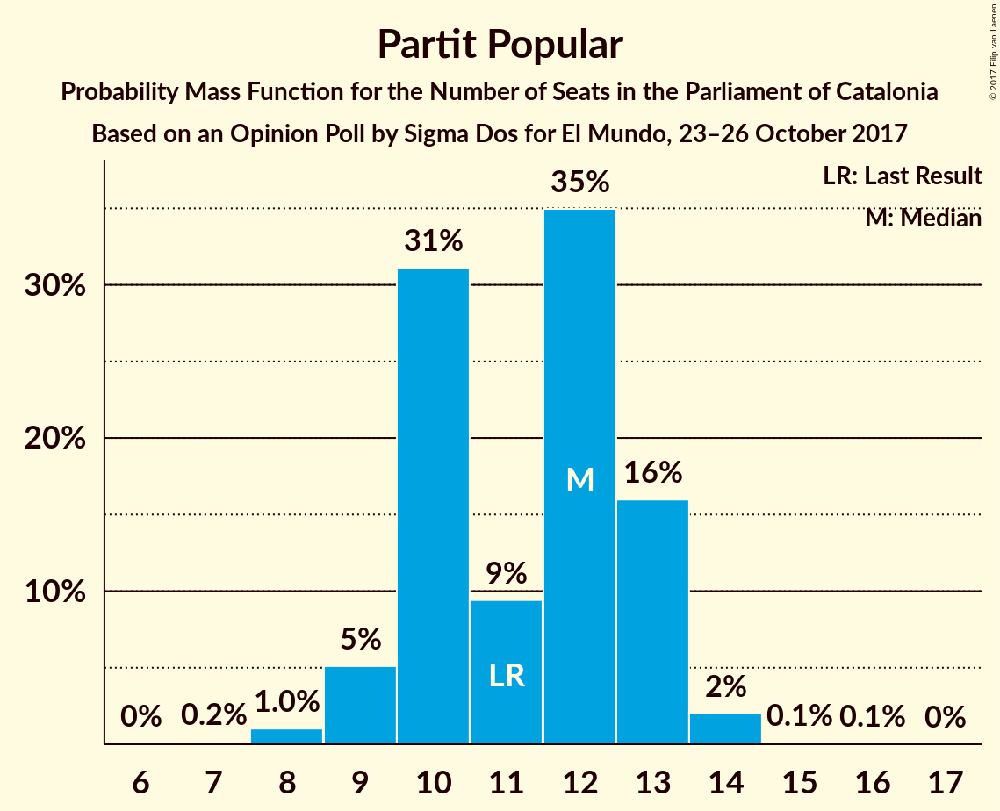

# Opinion Poll by Sigma Dos for El Mundo, 23–26 October 2017

<a href="#voting-intentions">Voting Intentions</a> | <a href="#seats">Seats</a> | <a href="#coalitions">Coalitions</a> | <a href="#technical-information">Technical Information</a>

## Voting Intentions

### Confidence Intervals

| Party | Last Result | Poll Result | 80% Confidence Interval | 90% Confidence Interval | 95% Confidence Interval | 99% Confidence Interval |
|:-----:|:-----------:|:-----------:|:-----------------------:|:-----------------------:|:-----------------------:|:-----------------------:|
| Esquerra Republicana de Catalunya–Catalunya Sí | 39.6% | 26.4% | 24.7–28.2% |24.2–28.8% |23.8–29.2% |22.9–30.1% |
| Ciutadans–Partido de la Ciudadanía | 17.9% | 19.6% | 18.1–21.3% |17.6–21.8% |17.3–22.2% |16.5–23.0% |
| Partit dels Socialistes de Catalunya (PSC-PSOE) | 12.7% | 15.1% | 13.7–16.6% |13.3–17.1% |13.0–17.5% |12.4–18.2% |
| Catalunya en Comú | 8.9% | 11.0% | 9.8–12.4% |9.5–12.8% |9.2–13.1% |8.7–13.8% |
| Partit Demòcrata Europeu Català | 39.6% | 9.8% | 8.7–11.1% |8.4–11.5% |8.1–11.8% |7.6–12.5% |
| Partit Popular | 8.5% | 8.7% | 7.7–10.0% |7.3–10.3% |7.1–10.6% |6.6–11.2% |
| Candidatura d’Unitat Popular | 8.2% | 6.3% | 5.4–7.4% |5.2–7.7% |5.0–8.0% |4.6–8.6% |

*Note:* The poll result column reflects the actual value used in the calculations. Published results may vary slightly, and in addition be rounded to fewer digits.

## Seats

### Confidence Intervals

| Party | Last Result | Median | 80% Confidence Interval | 90% Confidence Interval | 95% Confidence Interval | 99% Confidence Interval |
|:-----:|:-----------:|:------:|:-----------------------:|:-----------------------:|:-----------------------:|:-----------------------:|
| <a href="#esquerra-republicana-de-catalunya–catalunya-sí">Esquerra Republicana de Catalunya–Catalunya Sí</a> | 20 | 41 | 38–44 |37–44 |37–45 |35–47 |
| <a href="#ciutadans–partido-de-la-ciudadanía">Ciutadans–Partido de la Ciudadanía</a> | 25 | 26 | 25–30 |24–30 |24–31 |22–32 |
| <a href="#partit-dels-socialistes-de-catalunya-(psc-psoe)">Partit dels Socialistes de Catalunya (PSC-PSOE)</a> | 16 | 20 | 17–23 |16–23 |16–23 |16–24 |
| <a href="#catalunya-en-comú">Catalunya en Comú</a> | 11 | 14 | 12–15 |11–16 |11–17 |9–18 |
| <a href="#partit-demòcrata-europeu-català">Partit Demòcrata Europeu Català</a> | 29 | 14 | 13–16 |11–17 |11–17 |11–18 |
| <a href="#partit-popular">Partit Popular</a> | 11 | 12 | 10–13 |9–13 |9–13 |8–14 |
| <a href="#candidatura-d’unitat-popular">Candidatura d’Unitat Popular</a> | 10 | 8 | 7–9 |7–10 |5–10 |5–10 |

### Esquerra Republicana de Catalunya–Catalunya Sí

*For a full overview of the results for this party, see the [Esquerra Republicana de Catalunya–Catalunya Sí](party-esquerrarepublicanadecatalunyacatalunyas.html) page.*

| Number of Seats | Probability | Accumulated | Special Marks |
|:---------------:|:-----------:|:-----------:|:-------------:|
| 20 | 0% | 100% | Last Result |
| 21 | 0% | 100% |  |
| 22 | 0% | 100% |  |
| 23 | 0% | 100% |  |
| 24 | 0% | 100% |  |
| 25 | 0% | 100% |  |
| 26 | 0% | 100% |  |
| 27 | 0% | 100% |  |
| 28 | 0% | 100% |  |
| 29 | 0% | 100% |  |
| 30 | 0% | 100% |  |
| 31 | 0% | 100% |  |
| 32 | 0% | 100% |  |
| 33 | 0% | 100% |  |
| 34 | 0% | 100% |  |
| 35 | 0.5% | 99.9% |  |
| 36 | 1.2% | 99.5% |  |
| 37 | 5% | 98% |  |
| 38 | 10% | 93% |  |
| 39 | 11% | 83% |  |
| 40 | 11% | 72% |  |
| 41 | 17% | 62% | Median |
| 42 | 14% | 45% |  |
| 43 | 18% | 31% |  |
| 44 | 9% | 14% |  |
| 45 | 3% | 5% |  |
| 46 | 1.4% | 2% |  |
| 47 | 0.5% | 0.7% |  |
| 48 | 0.2% | 0.3% |  |
| 49 | 0.1% | 0.1% |  |
| 50 | 0% | 0% |  |

### Ciutadans–Partido de la Ciudadanía

*For a full overview of the results for this party, see the [Ciutadans–Partido de la Ciudadanía](party-ciutadanspartidodelaciudadana.html) page.*

| Number of Seats | Probability | Accumulated | Special Marks |
|:---------------:|:-----------:|:-----------:|:-------------:|
| 20 | 0.1% | 100% |  |
| 21 | 0.1% | 99.9% |  |
| 22 | 0.6% | 99.8% |  |
| 23 | 0.9% | 99.3% |  |
| 24 | 6% | 98% |  |
| 25 | 22% | 92% | Last Result |
| 26 | 29% | 70% | Median |
| 27 | 13% | 42% |  |
| 28 | 12% | 29% |  |
| 29 | 6% | 17% |  |
| 30 | 8% | 10% |  |
| 31 | 2% | 3% |  |
| 32 | 0.5% | 0.7% |  |
| 33 | 0.2% | 0.2% |  |
| 34 | 0% | 0% |  |

### Partit dels Socialistes de Catalunya (PSC-PSOE)

*For a full overview of the results for this party, see the [Partit dels Socialistes de Catalunya (PSC-PSOE)](party-partitdelssocialistesdecatalunyapscpsoe.html) page.*

| Number of Seats | Probability | Accumulated | Special Marks |
|:---------------:|:-----------:|:-----------:|:-------------:|
| 15 | 0.5% | 100% |  |
| 16 | 5% | 99.5% | Last Result |
| 17 | 7% | 95% |  |
| 18 | 12% | 87% |  |
| 19 | 9% | 75% |  |
| 20 | 22% | 66% | Median |
| 21 | 12% | 45% |  |
| 22 | 21% | 33% |  |
| 23 | 9% | 11% |  |
| 24 | 2% | 2% |  |
| 25 | 0.1% | 0.2% |  |
| 26 | 0% | 0.1% |  |
| 27 | 0% | 0% |  |

### Catalunya en Comú

*For a full overview of the results for this party, see the [Catalunya en Comú](party-catalunyaencom.html) page.*

| Number of Seats | Probability | Accumulated | Special Marks |
|:---------------:|:-----------:|:-----------:|:-------------:|
| 9 | 0.6% | 100% |  |
| 10 | 0.6% | 99.4% |  |
| 11 | 8% | 98.8% | Last Result |
| 12 | 18% | 91% |  |
| 13 | 13% | 72% |  |
| 14 | 36% | 60% | Median |
| 15 | 16% | 24% |  |
| 16 | 4% | 8% |  |
| 17 | 4% | 5% |  |
| 18 | 0.5% | 0.5% |  |
| 19 | 0% | 0% |  |

### Partit Demòcrata Europeu Català

*For a full overview of the results for this party, see the [Partit Demòcrata Europeu Català](party-partitdemcrataeuropeucatal.html) page.*

| Number of Seats | Probability | Accumulated | Special Marks |
|:---------------:|:-----------:|:-----------:|:-------------:|
| 9 | 0.1% | 100% |  |
| 10 | 0.1% | 99.9% |  |
| 11 | 6% | 99.8% |  |
| 12 | 3% | 94% |  |
| 13 | 34% | 90% |  |
| 14 | 14% | 56% | Median |
| 15 | 26% | 42% |  |
| 16 | 6% | 16% |  |
| 17 | 9% | 10% |  |
| 18 | 0.9% | 1.1% |  |
| 19 | 0.2% | 0.2% |  |
| 20 | 0% | 0% |  |
| 21 | 0% | 0% |  |
| 22 | 0% | 0% |  |
| 23 | 0% | 0% |  |
| 24 | 0% | 0% |  |
| 25 | 0% | 0% |  |
| 26 | 0% | 0% |  |
| 27 | 0% | 0% |  |
| 28 | 0% | 0% |  |
| 29 | 0% | 0% | Last Result |

### Partit Popular

*For a full overview of the results for this party, see the [Partit Popular](party-partitpopular.html) page.*

| Number of Seats | Probability | Accumulated | Special Marks |
|:---------------:|:-----------:|:-----------:|:-------------:|
| 7 | 0.2% | 100% |  |
| 8 | 1.0% | 99.8% |  |
| 9 | 5% | 98.8% |  |
| 10 | 31% | 94% |  |
| 11 | 9% | 63% | Last Result |
| 12 | 35% | 53% | Median |
| 13 | 16% | 18% |  |
| 14 | 2% | 2% |  |
| 15 | 0.1% | 0.2% |  |
| 16 | 0.1% | 0.1% |  |
| 17 | 0% | 0% |  |

### Candidatura d’Unitat Popular

*For a full overview of the results for this party, see the [Candidatura d’Unitat Popular](party-candidaturadunitatpopular.html) page.*

| Number of Seats | Probability | Accumulated | Special Marks |
|:---------------:|:-----------:|:-----------:|:-------------:|
| 3 | 0.2% | 100% |  |
| 4 | 0.3% | 99.8% |  |
| 5 | 2% | 99.5% |  |
| 6 | 2% | 97% |  |
| 7 | 7% | 95% |  |
| 8 | 51% | 88% | Median |
| 9 | 32% | 37% |  |
| 10 | 5% | 5% | Last Result |
| 11 | 0.1% | 0.2% |  |
| 12 | 0.1% | 0.1% |  |
| 13 | 0% | 0% |  |

## Coalitions

### Confidence Intervals

| Coalition | Last Result | Median | Majority? | 80% Confidence Interval | 90% Confidence Interval | 95% Confidence Interval | 99% Confidence Interval |
|:---------:|:-----------:|:------:|:---------:|:-----------------------:|:-----------------------:|:-----------------------:|:-----------------------:|
| Ciutadans–Partido de la Ciudadanía – Partit dels Socialistes de Catalunya (PSC-PSOE) – Catalunya en Comú – Partit Popular | 63 | 71 | 96% | 69–75 | 68–76 | 67–77 | 65–78 |
| Esquerra Republicana de Catalunya–Catalunya Sí – Catalunya en Comú – Partit Demòcrata Europeu Català | 60 | 69 | 69% | 65–72 | 64–73 | 64–73 | 63–75 |
| Esquerra Republicana de Catalunya–Catalunya Sí – Partit Demòcrata Europeu Català – Candidatura d’Unitat Popular | 59 | 64 | 4% | 60–66 | 59–67 | 58–68 | 57–70 |
| Ciutadans–Partido de la Ciudadanía – Partit dels Socialistes de Catalunya (PSC-PSOE) – Partit Popular | 52 | 58 | 0% | 55–61 | 54–62 | 53–63 | 52–64 |
| Esquerra Republicana de Catalunya–Catalunya Sí – Partit Demòcrata Europeu Català | 49 | 55 | 0% | 52–58 | 51–59 | 50–60 | 49–61 |

### Ciutadans–Partido de la Ciudadanía – Partit dels Socialistes de Catalunya (PSC-PSOE) – Catalunya en Comú – Partit Popular

| Number of Seats | Probability | Accumulated | Special Marks |
|:---------------:|:-----------:|:-----------:|:-------------:|
| 63 | 0% | 100% | Last Result |
| 64 | 0.2% | 99.9% |  |
| 65 | 0.4% | 99.8% |  |
| 66 | 1.2% | 99.4% |  |
| 67 | 3% | 98% |  |
| 68 | 5% | 96% | Majority |
| 69 | 9% | 91% |  |
| 70 | 15% | 81% |  |
| 71 | 16% | 66% |  |
| 72 | 14% | 50% | Median |
| 73 | 12% | 36% |  |
| 74 | 10% | 23% |  |
| 75 | 7% | 14% |  |
| 76 | 4% | 7% |  |
| 77 | 2% | 3% |  |
| 78 | 0.7% | 0.9% |  |
| 79 | 0.2% | 0.2% |  |
| 80 | 0% | 0% |  |

### Esquerra Republicana de Catalunya–Catalunya Sí – Catalunya en Comú – Partit Demòcrata Europeu Català

| Number of Seats | Probability | Accumulated | Special Marks |
|:---------------:|:-----------:|:-----------:|:-------------:|
| 60 | 0% | 100% | Last Result |
| 61 | 0.1% | 100% |  |
| 62 | 0.3% | 99.9% |  |
| 63 | 1.1% | 99.5% |  |
| 64 | 4% | 98% |  |
| 65 | 6% | 95% |  |
| 66 | 9% | 89% |  |
| 67 | 11% | 80% |  |
| 68 | 13% | 69% | Majority |
| 69 | 15% | 55% | Median |
| 70 | 15% | 40% |  |
| 71 | 13% | 25% |  |
| 72 | 6% | 12% |  |
| 73 | 3% | 6% |  |
| 74 | 1.5% | 2% |  |
| 75 | 0.6% | 0.9% |  |
| 76 | 0.2% | 0.3% |  |
| 77 | 0.1% | 0.1% |  |
| 78 | 0% | 0% |  |

### Esquerra Republicana de Catalunya–Catalunya Sí – Partit Demòcrata Europeu Català – Candidatura d’Unitat Popular

| Number of Seats | Probability | Accumulated | Special Marks |
|:---------------:|:-----------:|:-----------:|:-------------:|
| 56 | 0.2% | 100% |  |
| 57 | 0.7% | 99.8% |  |
| 58 | 2% | 99.1% |  |
| 59 | 4% | 97% | Last Result |
| 60 | 7% | 93% |  |
| 61 | 10% | 86% |  |
| 62 | 12% | 77% |  |
| 63 | 14% | 64% | Median |
| 64 | 16% | 50% |  |
| 65 | 15% | 34% |  |
| 66 | 9% | 19% |  |
| 67 | 5% | 9% |  |
| 68 | 3% | 4% | Majority |
| 69 | 1.2% | 2% |  |
| 70 | 0.4% | 0.6% |  |
| 71 | 0.2% | 0.2% |  |
| 72 | 0% | 0.1% |  |
| 73 | 0% | 0% |  |

### Ciutadans–Partido de la Ciudadanía – Partit dels Socialistes de Catalunya (PSC-PSOE) – Partit Popular

| Number of Seats | Probability | Accumulated | Special Marks |
|:---------------:|:-----------:|:-----------:|:-------------:|
| 50 | 0.1% | 100% |  |
| 51 | 0.3% | 99.9% |  |
| 52 | 0.7% | 99.7% | Last Result |
| 53 | 2% | 98.9% |  |
| 54 | 4% | 97% |  |
| 55 | 8% | 93% |  |
| 56 | 14% | 85% |  |
| 57 | 15% | 71% |  |
| 58 | 15% | 57% | Median |
| 59 | 13% | 42% |  |
| 60 | 11% | 29% |  |
| 61 | 8% | 17% |  |
| 62 | 5% | 9% |  |
| 63 | 3% | 4% |  |
| 64 | 0.8% | 1.2% |  |
| 65 | 0.3% | 0.4% |  |
| 66 | 0.1% | 0.1% |  |
| 67 | 0% | 0% |  |

### Esquerra Republicana de Catalunya–Catalunya Sí – Partit Demòcrata Europeu Català

| Number of Seats | Probability | Accumulated | Special Marks |
|:---------------:|:-----------:|:-----------:|:-------------:|
| 48 | 0.2% | 100% |  |
| 49 | 0.6% | 99.7% | Last Result |
| 50 | 2% | 99.1% |  |
| 51 | 4% | 97% |  |
| 52 | 8% | 92% |  |
| 53 | 10% | 85% |  |
| 54 | 13% | 75% |  |
| 55 | 14% | 62% | Median |
| 56 | 18% | 47% |  |
| 57 | 14% | 29% |  |
| 58 | 8% | 15% |  |
| 59 | 4% | 8% |  |
| 60 | 2% | 3% |  |
| 61 | 0.9% | 1.3% |  |
| 62 | 0.3% | 0.5% |  |
| 63 | 0.1% | 0.1% |  |
| 64 | 0% | 0% |  |

## Technical Information

### Opinion Poll

+ **Polling firm:** Sigma Dos
+ **Commissioner(s):** El Mundo
+ **Fieldwork period:** 23–26 October 2017

### Calculations

+ **Sample size:** 1000
+ **Simulations done:** 8,388,608
+ **Error estimate:** 0.82%

