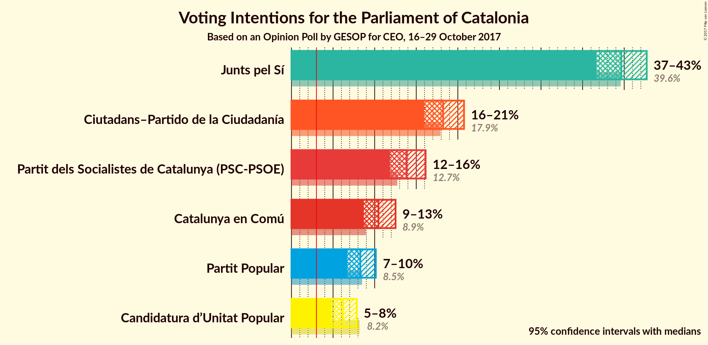
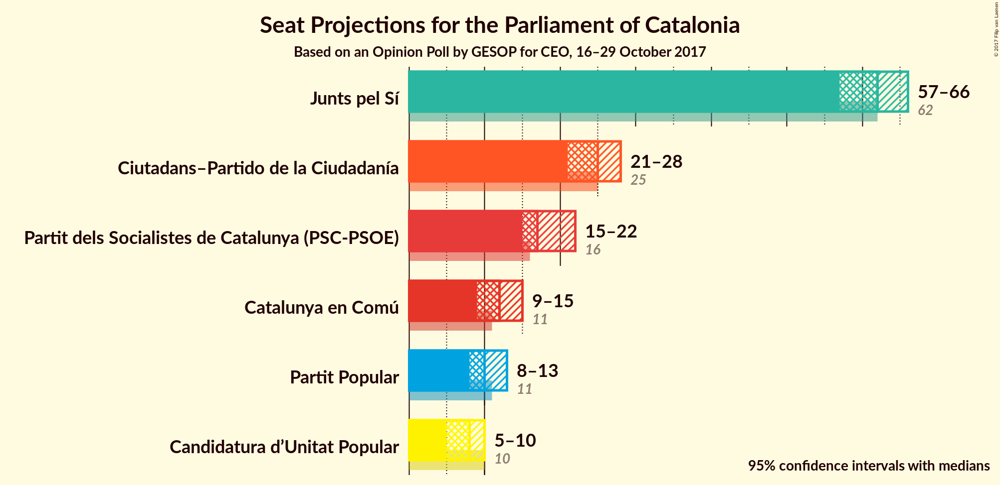
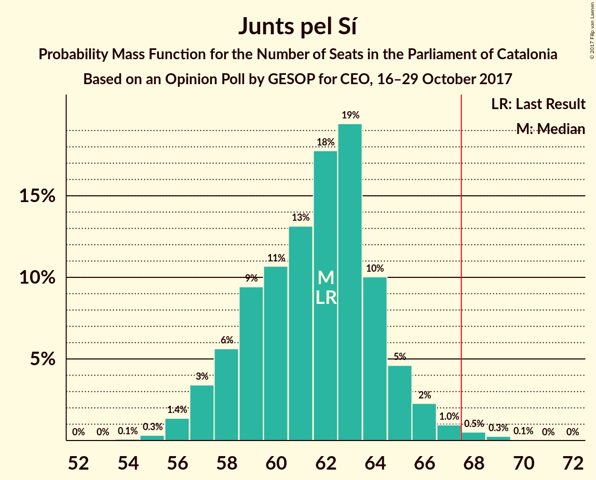
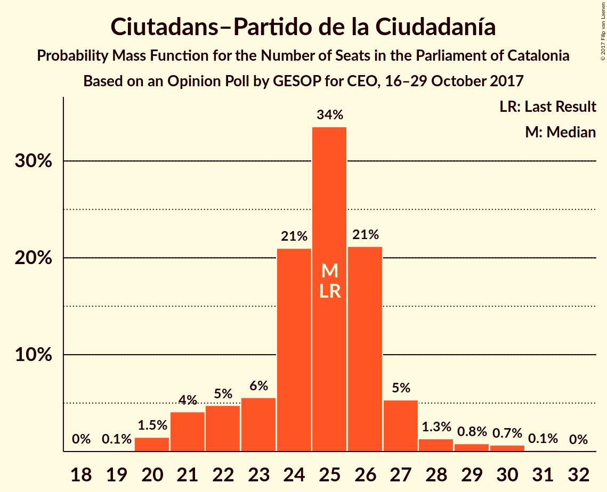
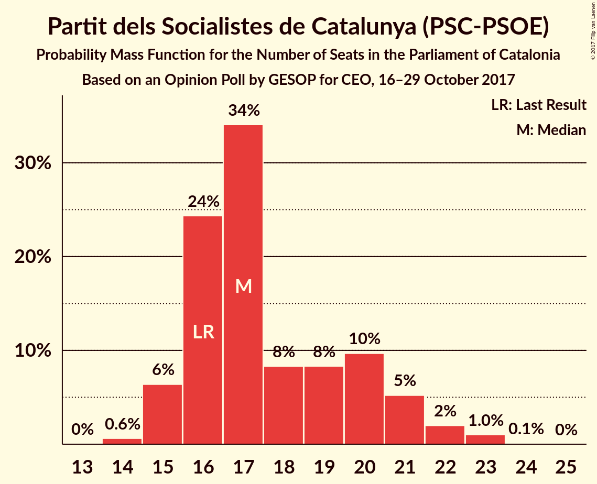
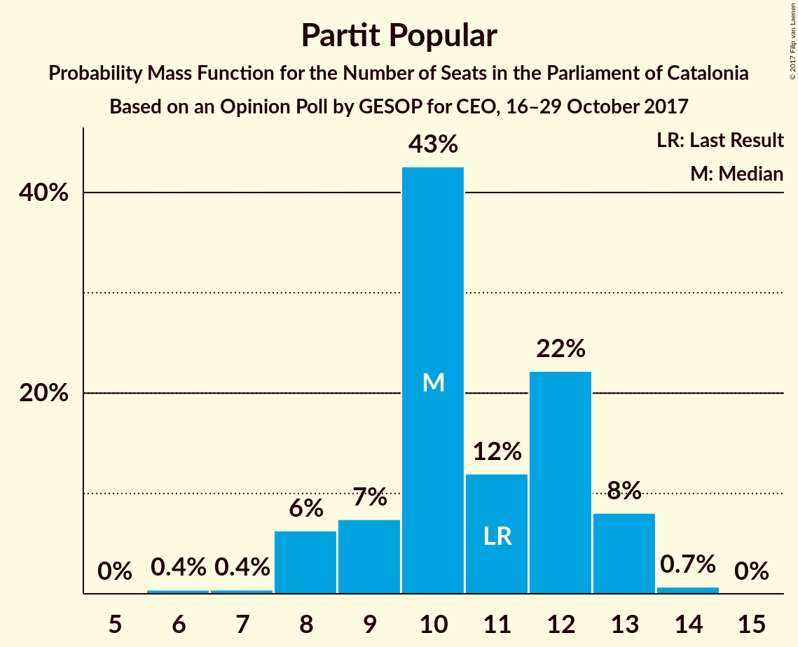
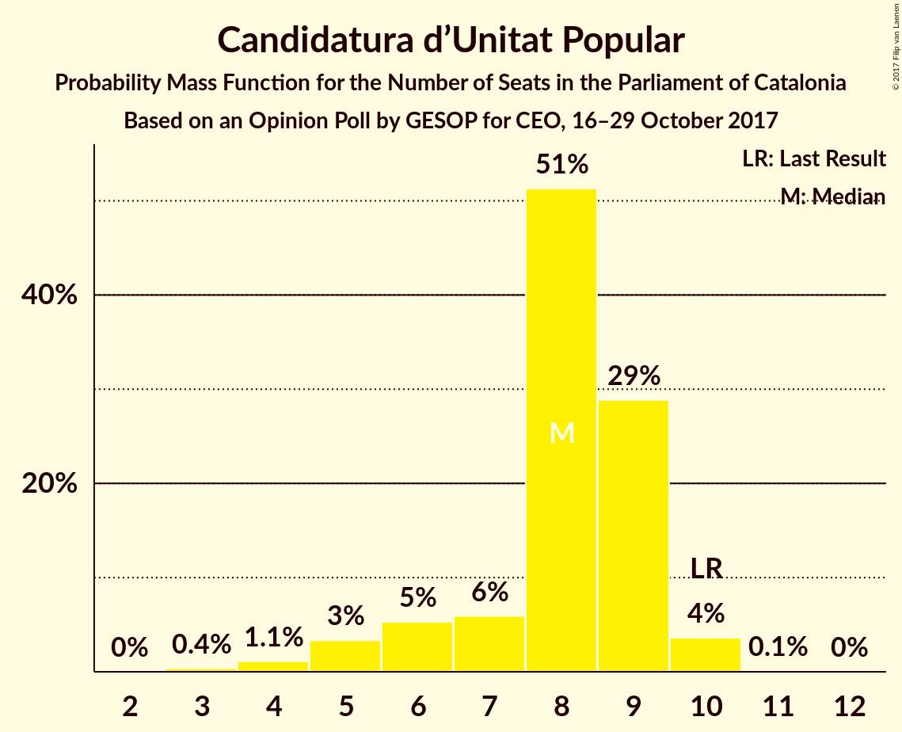
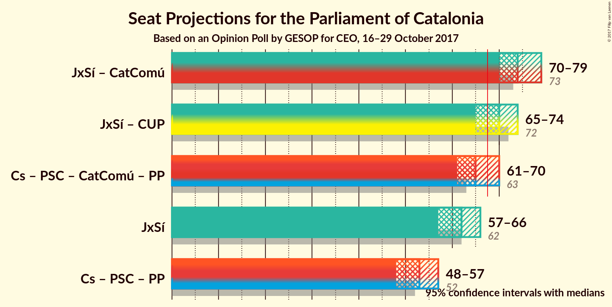

# Opinion Poll by GESOP for CEO, 16–29 October 2017

<a href="#voting-intentions">Voting Intentions</a> | <a href="#seats">Seats</a> | <a href="#coalitions">Coalitions</a> | <a href="#technical-information">Technical Information</a>

## Voting Intentions

### Confidence Intervals

| Party | Last Result | Poll Result | 80% Confidence Interval | 90% Confidence Interval | 95% Confidence Interval | 99% Confidence Interval |
|:-----:|:-----------:|:-----------:|:-----------------------:|:-----------------------:|:-----------------------:|:-----------------------:|
| Junts pel Sí | 39.6% | 39.6% | 37.7–41.7% |37.1–42.2% |36.7–42.7% |35.7–43.7% |
| Ciutadans–Partido de la Ciudadanía | 17.9% | 18.2% | 16.7–19.9% |16.3–20.3% |16.0–20.7% |15.3–21.6% |
| Partit dels Socialistes de Catalunya (PSC-PSOE) | 12.7% | 13.8% | 12.5–15.3% |12.2–15.8% |11.8–16.1% |11.2–16.9% |
| Catalunya en Comú | 8.9% | 10.5% | 9.3–11.8% |9.0–12.2% |8.7–12.5% |8.2–13.2% |
| Partit Popular | 8.5% | 8.3% | 7.2–9.5% |7.0–9.8% |6.7–10.1% |6.2–10.8% |
| Candidatura d’Unitat Popular | 8.2% | 6.2% | 5.3–7.3% |5.0–7.6% |4.8–7.8% |4.5–8.4% |

*Note:* The poll result column reflects the actual value used in the calculations. Published results may vary slightly, and in addition be rounded to fewer digits.

## Seats

### Confidence Intervals

| Party | Last Result | Median | 80% Confidence Interval | 90% Confidence Interval | 95% Confidence Interval | 99% Confidence Interval |
|:-----:|:-----------:|:------:|:-----------------------:|:-----------------------:|:-----------------------:|:-----------------------:|
| <a href="#junts-pel-sí">Junts pel Sí</a> | 62 | 62 | 58–64 |57–65 |57–66 |56–68 |
| <a href="#ciutadans–partido-de-la-ciudadanía">Ciutadans–Partido de la Ciudadanía</a> | 25 | 25 | 22–26 |21–27 |21–28 |20–30 |
| <a href="#partit-dels-socialistes-de-catalunya-(psc-psoe)">Partit dels Socialistes de Catalunya (PSC-PSOE)</a> | 16 | 17 | 16–20 |15–21 |15–22 |14–23 |
| <a href="#catalunya-en-comú">Catalunya en Comú</a> | 11 | 12 | 11–15 |10–15 |9–15 |9–17 |
| <a href="#partit-popular">Partit Popular</a> | 11 | 10 | 9–12 |8–13 |8–13 |7–14 |
| <a href="#candidatura-d’unitat-popular">Candidatura d’Unitat Popular</a> | 10 | 8 | 6–9 |6–9 |5–10 |4–10 |

### Junts pel Sí

*For a full overview of the results for this party, see the [Junts pel Sí](party-juntspels.html) page.*

| Number of Seats | Probability | Accumulated | Special Marks |
|:---------------:|:-----------:|:-----------:|:-------------:|
| 54 | 0.1% | 100% |  |
| 55 | 0.3% | 99.9% |  |
| 56 | 1.4% | 99.6% |  |
| 57 | 4% | 98% |  |
| 58 | 6% | 95% |  |
| 59 | 9% | 89% |  |
| 60 | 11% | 80% |  |
| 61 | 13% | 69% |  |
| 62 | 18% | 56% | Last Result, Median |
| 63 | 19% | 38% |  |
| 64 | 10% | 19% |  |
| 65 | 5% | 9% |  |
| 66 | 2% | 4% |  |
| 67 | 1.0% | 2% |  |
| 68 | 0.5% | 0.8% | Majority |
| 69 | 0.2% | 0.3% |  |
| 70 | 0.1% | 0.1% |  |
| 71 | 0% | 0% |  |

### Ciutadans–Partido de la Ciudadanía

*For a full overview of the results for this party, see the [Ciutadans–Partido de la Ciudadanía](party-ciutadanspartidodelaciudadana.html) page.*

| Number of Seats | Probability | Accumulated | Special Marks |
|:---------------:|:-----------:|:-----------:|:-------------:|
| 19 | 0.1% | 100% |  |
| 20 | 1.4% | 99.9% |  |
| 21 | 4% | 98% |  |
| 22 | 5% | 94% |  |
| 23 | 6% | 90% |  |
| 24 | 21% | 84% |  |
| 25 | 33% | 63% | Last Result, Median |
| 26 | 21% | 30% |  |
| 27 | 6% | 8% |  |
| 28 | 1.3% | 3% |  |
| 29 | 0.7% | 2% |  |
| 30 | 0.7% | 0.8% |  |
| 31 | 0.1% | 0.1% |  |
| 32 | 0% | 0% |  |

### Partit dels Socialistes de Catalunya (PSC-PSOE)

*For a full overview of the results for this party, see the [Partit dels Socialistes de Catalunya (PSC-PSOE)](party-partitdelssocialistesdecatalunyapscpsoe.html) page.*

| Number of Seats | Probability | Accumulated | Special Marks |
|:---------------:|:-----------:|:-----------:|:-------------:|
| 14 | 0.6% | 100% |  |
| 15 | 6% | 99.4% |  |
| 16 | 24% | 93% | Last Result |
| 17 | 33% | 68% | Median |
| 18 | 9% | 35% |  |
| 19 | 8% | 26% |  |
| 20 | 10% | 18% |  |
| 21 | 5% | 8% |  |
| 22 | 2% | 3% |  |
| 23 | 1.0% | 1.1% |  |
| 24 | 0.1% | 0.1% |  |
| 25 | 0% | 0% |  |

### Catalunya en Comú

*For a full overview of the results for this party, see the [Catalunya en Comú](party-catalunyaencom.html) page.*

| Number of Seats | Probability | Accumulated | Special Marks |
|:---------------:|:-----------:|:-----------:|:-------------:|
| 8 | 0.1% | 100% |  |
| 9 | 3% | 99.9% |  |
| 10 | 5% | 97% |  |
| 11 | 13% | 92% | Last Result |
| 12 | 37% | 79% | Median |
| 13 | 16% | 42% |  |
| 14 | 14% | 26% |  |
| 15 | 9% | 11% |  |
| 16 | 1.1% | 2% |  |
| 17 | 1.2% | 1.3% |  |
| 18 | 0.1% | 0.1% |  |
| 19 | 0% | 0% |  |

### Partit Popular

*For a full overview of the results for this party, see the [Partit Popular](party-partitpopular.html) page.*

| Number of Seats | Probability | Accumulated | Special Marks |
|:---------------:|:-----------:|:-----------:|:-------------:|
| 6 | 0.4% | 100% |  |
| 7 | 0.4% | 99.6% |  |
| 8 | 6% | 99.2% |  |
| 9 | 7% | 93% |  |
| 10 | 43% | 86% | Median |
| 11 | 12% | 43% | Last Result |
| 12 | 22% | 31% |  |
| 13 | 8% | 9% |  |
| 14 | 0.7% | 0.7% |  |
| 15 | 0% | 0% |  |

### Candidatura d’Unitat Popular

*For a full overview of the results for this party, see the [Candidatura d’Unitat Popular](party-candidaturadunitatpopular.html) page.*

| Number of Seats | Probability | Accumulated | Special Marks |
|:---------------:|:-----------:|:-----------:|:-------------:|
| 3 | 0.4% | 100% |  |
| 4 | 1.1% | 99.6% |  |
| 5 | 3% | 98.5% |  |
| 6 | 5% | 95% |  |
| 7 | 5% | 90% |  |
| 8 | 51% | 84% | Median |
| 9 | 29% | 33% |  |
| 10 | 4% | 4% | Last Result |
| 11 | 0.1% | 0.1% |  |
| 12 | 0% | 0% |  |

## Coalitions

### Confidence Intervals

| Coalition | Last Result | Median | Majority? | 80% Confidence Interval | 90% Confidence Interval | 95% Confidence Interval | 99% Confidence Interval |
|:---------:|:-----------:|:------:|:---------:|:-----------------------:|:-----------------------:|:-----------------------:|:-----------------------:|
| Junts pel Sí – Catalunya en Comú | 73 | 74 | 99.8% | 71–77 | 70–78 | 70–79 | 68–80 |
| Junts pel Sí – Candidatura d’Unitat Popular | 72 | 70 | 80% | 66–72 | 65–73 | 65–74 | 63–76 |
| Ciutadans–Partido de la Ciudadanía – Partit dels Socialistes de Catalunya (PSC-PSOE) – Catalunya en Comú – Partit Popular | 63 | 65 | 20% | 63–69 | 62–70 | 61–70 | 59–72 |
| Junts pel Sí | 62 | 62 | 0.8% | 58–64 | 57–65 | 57–66 | 56–68 |
| Ciutadans–Partido de la Ciudadanía – Partit dels Socialistes de Catalunya (PSC-PSOE) – Partit Popular | 52 | 53 | 0% | 50–56 | 49–57 | 48–57 | 47–59 |

### Junts pel Sí – Catalunya en Comú

| Number of Seats | Probability | Accumulated | Special Marks |
|:---------------:|:-----------:|:-----------:|:-------------:|
| 66 | 0.1% | 100% |  |
| 67 | 0.2% | 99.9% |  |
| 68 | 0.5% | 99.8% | Majority |
| 69 | 2% | 99.2% |  |
| 70 | 4% | 98% |  |
| 71 | 8% | 93% |  |
| 72 | 11% | 85% |  |
| 73 | 13% | 75% | Last Result |
| 74 | 16% | 62% | Median |
| 75 | 18% | 45% |  |
| 76 | 13% | 27% |  |
| 77 | 7% | 14% |  |
| 78 | 4% | 7% |  |
| 79 | 2% | 3% |  |
| 80 | 0.8% | 1.3% |  |
| 81 | 0.3% | 0.5% |  |
| 82 | 0.1% | 0.2% |  |
| 83 | 0% | 0% |  |

### Junts pel Sí – Candidatura d’Unitat Popular

| Number of Seats | Probability | Accumulated | Special Marks |
|:---------------:|:-----------:|:-----------:|:-------------:|
| 61 | 0% | 100% |  |
| 62 | 0.1% | 99.9% |  |
| 63 | 0.4% | 99.8% |  |
| 64 | 1.3% | 99.4% |  |
| 65 | 3% | 98% |  |
| 66 | 6% | 95% |  |
| 67 | 9% | 89% |  |
| 68 | 11% | 80% | Majority |
| 69 | 13% | 69% |  |
| 70 | 16% | 55% | Median |
| 71 | 18% | 40% |  |
| 72 | 12% | 22% | Last Result |
| 73 | 5% | 9% |  |
| 74 | 2% | 4% |  |
| 75 | 1.0% | 2% |  |
| 76 | 0.4% | 0.7% |  |
| 77 | 0.2% | 0.3% |  |
| 78 | 0.1% | 0.1% |  |
| 79 | 0% | 0% |  |

### Ciutadans–Partido de la Ciudadanía – Partit dels Socialistes de Catalunya (PSC-PSOE) – Catalunya en Comú – Partit Popular

| Number of Seats | Probability | Accumulated | Special Marks |
|:---------------:|:-----------:|:-----------:|:-------------:|
| 57 | 0.1% | 100% |  |
| 58 | 0.2% | 99.9% |  |
| 59 | 0.4% | 99.7% |  |
| 60 | 1.0% | 99.3% |  |
| 61 | 2% | 98% |  |
| 62 | 5% | 96% |  |
| 63 | 12% | 91% | Last Result |
| 64 | 18% | 78% | Median |
| 65 | 16% | 60% |  |
| 66 | 13% | 45% |  |
| 67 | 11% | 31% |  |
| 68 | 9% | 20% | Majority |
| 69 | 6% | 11% |  |
| 70 | 3% | 5% |  |
| 71 | 1.3% | 2% |  |
| 72 | 0.4% | 0.6% |  |
| 73 | 0.1% | 0.2% |  |
| 74 | 0% | 0.1% |  |
| 75 | 0% | 0% |  |

### Junts pel Sí

| Number of Seats | Probability | Accumulated | Special Marks |
|:---------------:|:-----------:|:-----------:|:-------------:|
| 54 | 0.1% | 100% |  |
| 55 | 0.3% | 99.9% |  |
| 56 | 1.4% | 99.6% |  |
| 57 | 4% | 98% |  |
| 58 | 6% | 95% |  |
| 59 | 9% | 89% |  |
| 60 | 11% | 80% |  |
| 61 | 13% | 69% |  |
| 62 | 18% | 56% | Last Result, Median |
| 63 | 19% | 38% |  |
| 64 | 10% | 19% |  |
| 65 | 5% | 9% |  |
| 66 | 2% | 4% |  |
| 67 | 1.0% | 2% |  |
| 68 | 0.5% | 0.8% | Majority |
| 69 | 0.2% | 0.3% |  |
| 70 | 0.1% | 0.1% |  |
| 71 | 0% | 0% |  |

### Ciutadans–Partido de la Ciudadanía – Partit dels Socialistes de Catalunya (PSC-PSOE) – Partit Popular

| Number of Seats | Probability | Accumulated | Special Marks |
|:---------------:|:-----------:|:-----------:|:-------------:|
| 45 | 0.1% | 100% |  |
| 46 | 0.2% | 99.9% |  |
| 47 | 0.7% | 99.6% |  |
| 48 | 1.4% | 98.9% |  |
| 49 | 3% | 97% |  |
| 50 | 7% | 94% |  |
| 51 | 15% | 87% |  |
| 52 | 19% | 72% | Last Result, Median |
| 53 | 16% | 53% |  |
| 54 | 13% | 37% |  |
| 55 | 11% | 24% |  |
| 56 | 7% | 14% |  |
| 57 | 4% | 6% |  |
| 58 | 2% | 2% |  |
| 59 | 0.5% | 0.9% |  |
| 60 | 0.2% | 0.3% |  |
| 61 | 0.1% | 0.1% |  |
| 62 | 0% | 0% |  |

## Technical Information

### Opinion Poll

+ **Polling firm:** GESOP
+ **Commissioner(s):** CEO
+ **Fieldwork period:** 16–29 October 2017

### Calculations

+ **Sample size:** 1004
+ **Simulations done:** 8,388,608
+ **Error estimate:** 0.38%

