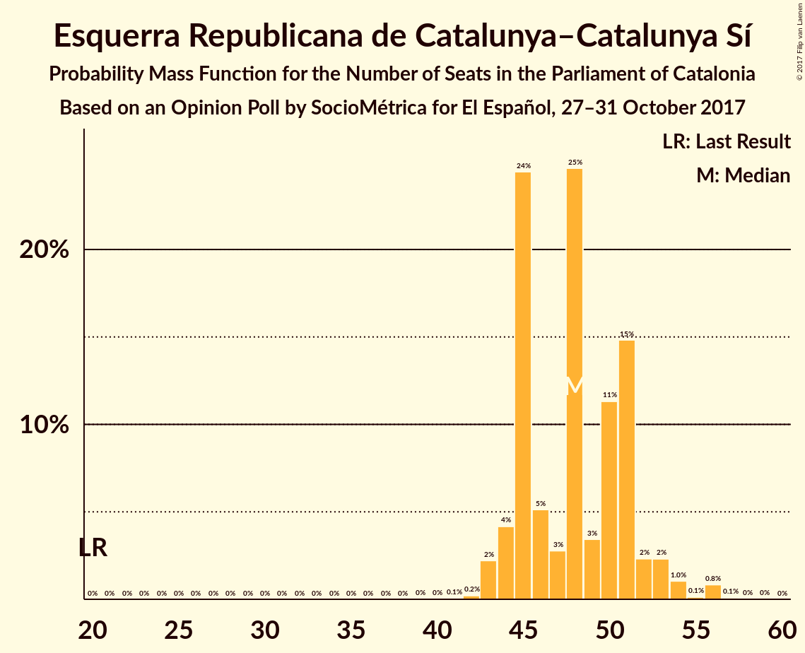
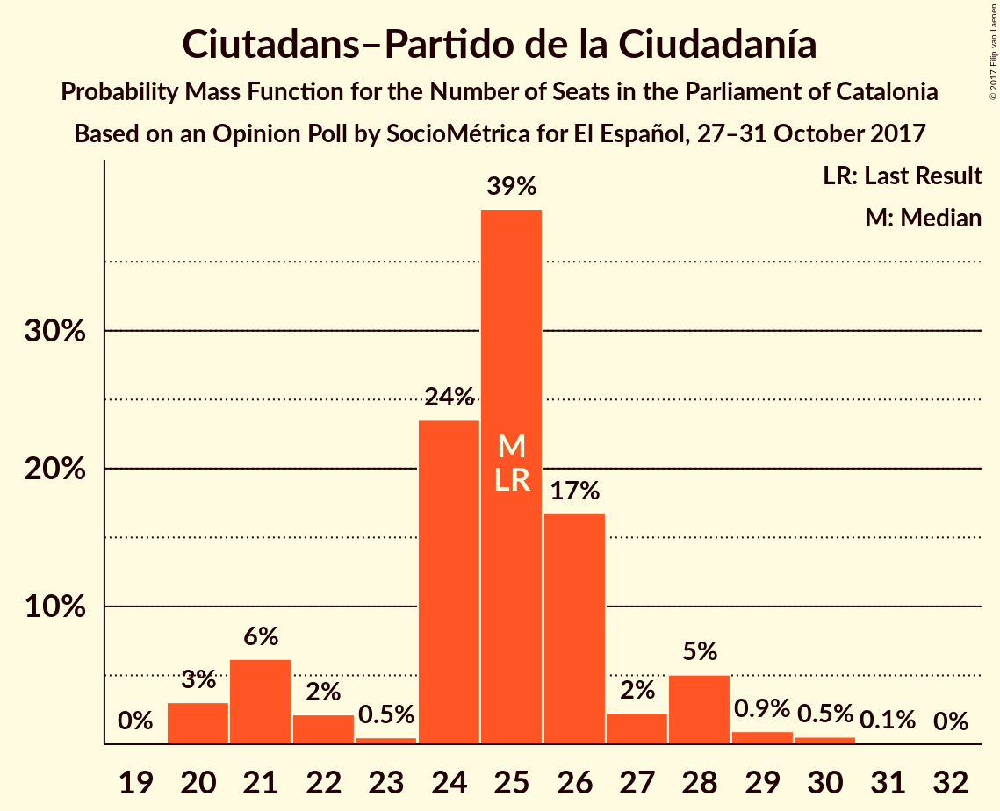
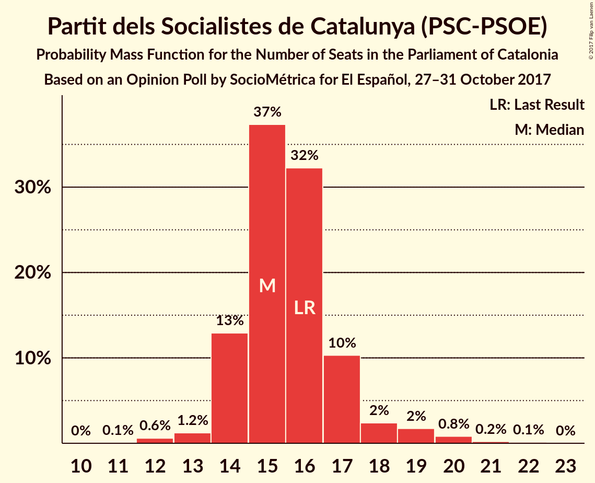
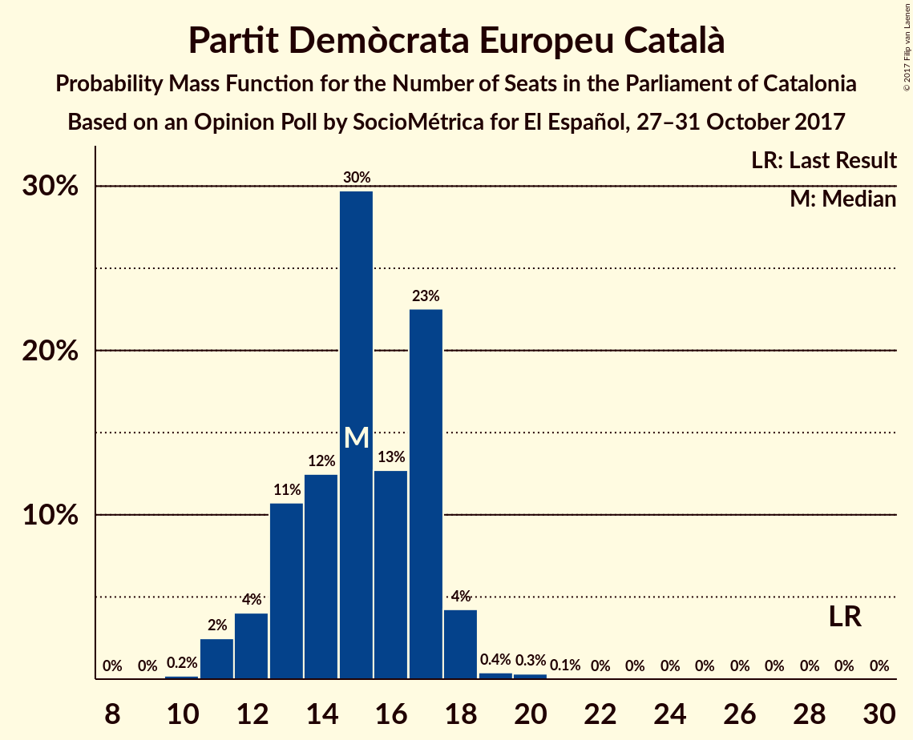
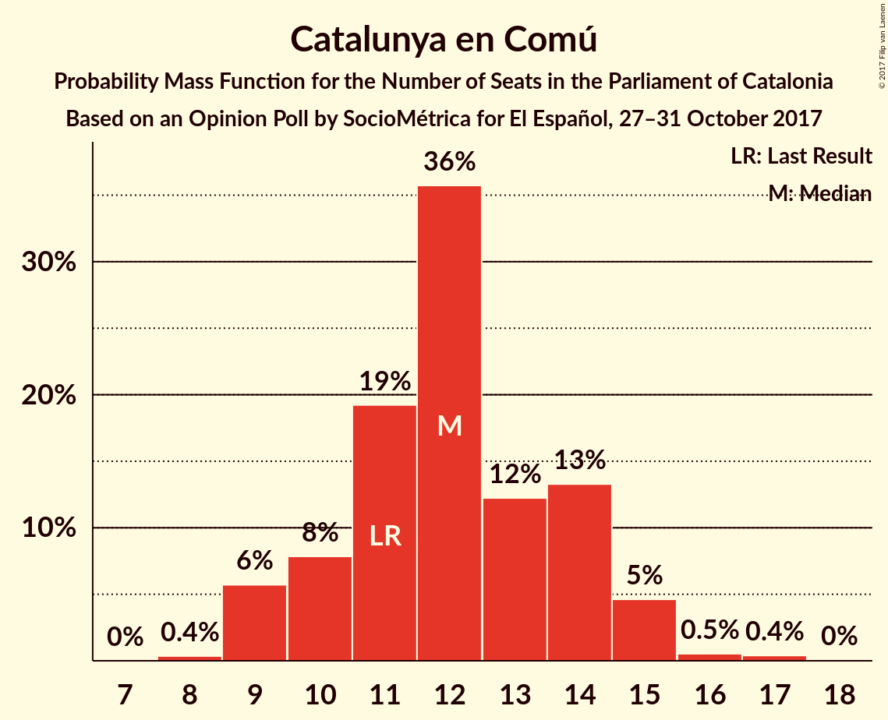
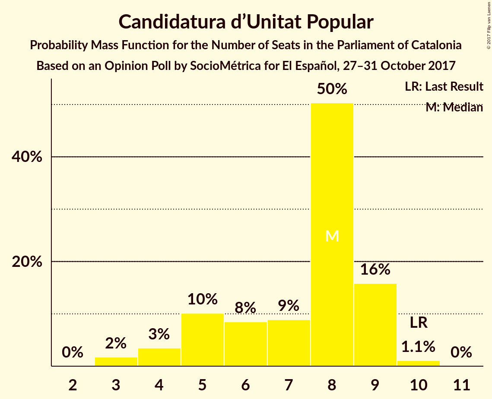

# Opinion Poll by SocioMétrica for El Español, 27–31 October 2017

<a href="#voting-intentions">Voting Intentions</a> | <a href="#seats">Seats</a> | <a href="#coalitions">Coalitions</a> | <a href="#technical-information">Technical Information</a>

## Voting Intentions

### Confidence Intervals

| Party | Last Result | Poll Result | 80% Confidence Interval | 90% Confidence Interval | 95% Confidence Interval | 99% Confidence Interval |
|:-----:|:-----------:|:-----------:|:-----------------------:|:-----------------------:|:-----------------------:|:-----------------------:|
| Esquerra Republicana de Catalunya–Catalunya Sí | 39.6% | 31.2% | 29.4–33.1% |28.8–33.7% |28.4–34.1% |27.5–35.1% |
| Ciutadans–Partido de la Ciudadanía | 17.9% | 18.3% | 16.8–20.0% |16.4–20.4% |16.0–20.8% |15.3–21.6% |
| Partit dels Socialistes de Catalunya (PSC-PSOE) | 12.7% | 12.2% | 11.0–13.6% |10.6–14.0% |10.3–14.4% |9.7–15.1% |
| Partit Demòcrata Europeu Català | 39.6% | 10.1% | 9.0–11.4% |8.6–11.8% |8.4–12.1% |7.9–12.8% |
| Catalunya en Comú | 8.9% | 10.0% | 8.9–11.3% |8.6–11.7% |8.3–12.0% |7.8–12.7% |
| Partit Popular | 8.5% | 9.0% | 7.9–10.3% |7.6–10.6% |7.4–10.9% |6.9–11.6% |
| Candidatura d’Unitat Popular | 8.2% | 5.7% | 4.9–6.8% |4.6–7.1% |4.4–7.3% |4.1–7.9% |

*Note:* The poll result column reflects the actual value used in the calculations. Published results may vary slightly, and in addition be rounded to fewer digits.

## Seats

### Confidence Intervals

| Party | Last Result | Median | 80% Confidence Interval | 90% Confidence Interval | 95% Confidence Interval | 99% Confidence Interval |
|:-----:|:-----------:|:------:|:-----------------------:|:-----------------------:|:-----------------------:|:-----------------------:|
| <a href="#esquerra-republicana-de-catalunya–catalunya-sí">Esquerra Republicana de Catalunya–Catalunya Sí</a> | 20 | 49 | 46–51 |45–52 |44–53 |43–55 |
| <a href="#ciutadans–partido-de-la-ciudadanía">Ciutadans–Partido de la Ciudadanía</a> | 25 | 25 | 23–27 |22–28 |21–29 |20–30 |
| <a href="#partit-dels-socialistes-de-catalunya-(psc-psoe)">Partit dels Socialistes de Catalunya (PSC-PSOE)</a> | 16 | 15 | 14–17 |14–18 |14–19 |12–20 |
| <a href="#partit-demòcrata-europeu-català">Partit Demòcrata Europeu Català</a> | 29 | 14 | 13–17 |12–17 |11–18 |11–19 |
| <a href="#catalunya-en-comú">Catalunya en Comú</a> | 11 | 12 | 10–14 |9–15 |9–15 |9–16 |
| <a href="#partit-popular">Partit Popular</a> | 11 | 12 | 10–13 |10–14 |10–14 |8–15 |
| <a href="#candidatura-d’unitat-popular">Candidatura d’Unitat Popular</a> | 10 | 8 | 5–9 |4–9 |4–9 |3–10 |

### Esquerra Republicana de Catalunya–Catalunya Sí

*For a full overview of the results for this party, see the [Esquerra Republicana de Catalunya–Catalunya Sí](party-esquerrarepublicanadecatalunyacatalunyas.html) page.*

| Number of Seats | Probability | Accumulated | Special Marks |
|:---------------:|:-----------:|:-----------:|:-------------:|
| 20 | 0% | 100% | Last Result |
| 21 | 0% | 100% |  |
| 22 | 0% | 100% |  |
| 23 | 0% | 100% |  |
| 24 | 0% | 100% |  |
| 25 | 0% | 100% |  |
| 26 | 0% | 100% |  |
| 27 | 0% | 100% |  |
| 28 | 0% | 100% |  |
| 29 | 0% | 100% |  |
| 30 | 0% | 100% |  |
| 31 | 0% | 100% |  |
| 32 | 0% | 100% |  |
| 33 | 0% | 100% |  |
| 34 | 0% | 100% |  |
| 35 | 0% | 100% |  |
| 36 | 0% | 100% |  |
| 37 | 0% | 100% |  |
| 38 | 0% | 100% |  |
| 39 | 0% | 100% |  |
| 40 | 0% | 100% |  |
| 41 | 0% | 100% |  |
| 42 | 0.1% | 100% |  |
| 43 | 0.8% | 99.8% |  |
| 44 | 3% | 99.0% |  |
| 45 | 6% | 96% |  |
| 46 | 8% | 90% |  |
| 47 | 9% | 82% |  |
| 48 | 17% | 73% |  |
| 49 | 13% | 56% | Median |
| 50 | 21% | 43% |  |
| 51 | 13% | 22% |  |
| 52 | 5% | 9% |  |
| 53 | 2% | 4% |  |
| 54 | 0.8% | 2% |  |
| 55 | 0.6% | 0.9% |  |
| 56 | 0.2% | 0.3% |  |
| 57 | 0.1% | 0.1% |  |
| 58 | 0% | 0% |  |

### Ciutadans–Partido de la Ciudadanía

*For a full overview of the results for this party, see the [Ciutadans–Partido de la Ciudadanía](party-ciutadanspartidodelaciudadana.html) page.*

| Number of Seats | Probability | Accumulated | Special Marks |
|:---------------:|:-----------:|:-----------:|:-------------:|
| 19 | 0% | 100% |  |
| 20 | 0.6% | 99.9% |  |
| 21 | 2% | 99.3% |  |
| 22 | 5% | 97% |  |
| 23 | 10% | 91% |  |
| 24 | 10% | 81% |  |
| 25 | 33% | 71% | Last Result, Median |
| 26 | 28% | 38% |  |
| 27 | 5% | 10% |  |
| 28 | 3% | 6% |  |
| 29 | 2% | 3% |  |
| 30 | 0.6% | 0.8% |  |
| 31 | 0.1% | 0.2% |  |
| 32 | 0% | 0% |  |

### Partit dels Socialistes de Catalunya (PSC-PSOE)

*For a full overview of the results for this party, see the [Partit dels Socialistes de Catalunya (PSC-PSOE)](party-partitdelssocialistesdecatalunyapscpsoe.html) page.*

| Number of Seats | Probability | Accumulated | Special Marks |
|:---------------:|:-----------:|:-----------:|:-------------:|
| 11 | 0.1% | 100% |  |
| 12 | 0.6% | 99.9% |  |
| 13 | 1.2% | 99.3% |  |
| 14 | 13% | 98% |  |
| 15 | 37% | 85% | Median |
| 16 | 32% | 48% | Last Result |
| 17 | 10% | 16% |  |
| 18 | 2% | 5% |  |
| 19 | 2% | 3% |  |
| 20 | 0.8% | 1.2% |  |
| 21 | 0.2% | 0.4% |  |
| 22 | 0.1% | 0.1% |  |
| 23 | 0% | 0% |  |

### Partit Demòcrata Europeu Català

*For a full overview of the results for this party, see the [Partit Demòcrata Europeu Català](party-partitdemcrataeuropeucatal.html) page.*

| Number of Seats | Probability | Accumulated | Special Marks |
|:---------------:|:-----------:|:-----------:|:-------------:|
| 10 | 0.1% | 100% |  |
| 11 | 3% | 99.9% |  |
| 12 | 4% | 97% |  |
| 13 | 23% | 94% |  |
| 14 | 25% | 70% | Median |
| 15 | 20% | 46% |  |
| 16 | 13% | 26% |  |
| 17 | 10% | 13% |  |
| 18 | 3% | 3% |  |
| 19 | 0.4% | 0.5% |  |
| 20 | 0.1% | 0.2% |  |
| 21 | 0% | 0% |  |
| 22 | 0% | 0% |  |
| 23 | 0% | 0% |  |
| 24 | 0% | 0% |  |
| 25 | 0% | 0% |  |
| 26 | 0% | 0% |  |
| 27 | 0% | 0% |  |
| 28 | 0% | 0% |  |
| 29 | 0% | 0% | Last Result |

### Catalunya en Comú

*For a full overview of the results for this party, see the [Catalunya en Comú](party-catalunyaencom.html) page.*

| Number of Seats | Probability | Accumulated | Special Marks |
|:---------------:|:-----------:|:-----------:|:-------------:|
| 8 | 0.4% | 100% |  |
| 9 | 6% | 99.6% |  |
| 10 | 8% | 94% |  |
| 11 | 19% | 86% | Last Result |
| 12 | 37% | 67% | Median |
| 13 | 12% | 30% |  |
| 14 | 13% | 19% |  |
| 15 | 5% | 6% |  |
| 16 | 0.4% | 0.9% |  |
| 17 | 0.4% | 0.4% |  |
| 18 | 0% | 0% |  |

### Partit Popular

*For a full overview of the results for this party, see the [Partit Popular](party-partitpopular.html) page.*

| Number of Seats | Probability | Accumulated | Special Marks |
|:---------------:|:-----------:|:-----------:|:-------------:|
| 8 | 0.9% | 100% |  |
| 9 | 2% | 99.1% |  |
| 10 | 20% | 98% |  |
| 11 | 14% | 78% | Last Result |
| 12 | 32% | 63% | Median |
| 13 | 26% | 32% |  |
| 14 | 5% | 6% |  |
| 15 | 0.4% | 0.5% |  |
| 16 | 0.2% | 0.2% |  |
| 17 | 0% | 0% |  |

### Candidatura d’Unitat Popular

*For a full overview of the results for this party, see the [Candidatura d’Unitat Popular](party-candidaturadunitatpopular.html) page.*

| Number of Seats | Probability | Accumulated | Special Marks |
|:---------------:|:-----------:|:-----------:|:-------------:|
| 3 | 2% | 100% |  |
| 4 | 4% | 98% |  |
| 5 | 8% | 94% |  |
| 6 | 10% | 86% |  |
| 7 | 8% | 76% |  |
| 8 | 51% | 68% | Median |
| 9 | 16% | 17% |  |
| 10 | 1.1% | 1.1% | Last Result |
| 11 | 0% | 0% |  |

## Coalitions

### Confidence Intervals

| Coalition | Last Result | Median | Majority? | 80% Confidence Interval | 90% Confidence Interval | 95% Confidence Interval | 99% Confidence Interval |
|:---------:|:-----------:|:------:|:---------:|:-----------------------:|:-----------------------:|:-----------------------:|:-----------------------:|
| Esquerra Republicana de Catalunya–Catalunya Sí – Partit Demòcrata Europeu Català – Candidatura d’Unitat Popular | 59 | 71 | 92% | 68–73 | 67–74 | 66–75 | 64–77 |
| Ciutadans–Partido de la Ciudadanía – Partit dels Socialistes de Catalunya (PSC-PSOE) – Catalunya en Comú – Partit Popular | 63 | 64 | 8% | 62–67 | 61–68 | 60–69 | 58–71 |
| Esquerra Republicana de Catalunya–Catalunya Sí – Partit Demòcrata Europeu Català | 49 | 63 | 3% | 60–66 | 59–67 | 59–68 | 57–70 |

### Esquerra Republicana de Catalunya–Catalunya Sí – Partit Demòcrata Europeu Català – Candidatura d’Unitat Popular

| Number of Seats | Probability | Accumulated | Special Marks |
|:---------------:|:-----------:|:-----------:|:-------------:|
| 59 | 0% | 100% | Last Result |
| 60 | 0% | 100% |  |
| 61 | 0% | 100% |  |
| 62 | 0% | 100% |  |
| 63 | 0.1% | 99.9% |  |
| 64 | 0.4% | 99.8% |  |
| 65 | 0.7% | 99.5% |  |
| 66 | 2% | 98.8% |  |
| 67 | 4% | 96% |  |
| 68 | 8% | 92% | Majority |
| 69 | 15% | 84% |  |
| 70 | 14% | 68% |  |
| 71 | 15% | 54% | Median |
| 72 | 19% | 39% |  |
| 73 | 10% | 20% |  |
| 74 | 5% | 10% |  |
| 75 | 3% | 4% |  |
| 76 | 1.0% | 2% |  |
| 77 | 0.3% | 0.5% |  |
| 78 | 0.2% | 0.3% |  |
| 79 | 0% | 0.1% |  |
| 80 | 0% | 0% |  |

### Ciutadans–Partido de la Ciudadanía – Partit dels Socialistes de Catalunya (PSC-PSOE) – Catalunya en Comú – Partit Popular

| Number of Seats | Probability | Accumulated | Special Marks |
|:---------------:|:-----------:|:-----------:|:-------------:|
| 56 | 0% | 100% |  |
| 57 | 0.2% | 99.9% |  |
| 58 | 0.3% | 99.7% |  |
| 59 | 1.0% | 99.5% |  |
| 60 | 3% | 98% |  |
| 61 | 5% | 96% |  |
| 62 | 10% | 90% |  |
| 63 | 19% | 80% | Last Result |
| 64 | 15% | 61% | Median |
| 65 | 14% | 46% |  |
| 66 | 15% | 32% |  |
| 67 | 8% | 16% |  |
| 68 | 4% | 8% | Majority |
| 69 | 2% | 4% |  |
| 70 | 0.7% | 1.2% |  |
| 71 | 0.4% | 0.5% |  |
| 72 | 0.1% | 0.2% |  |
| 73 | 0% | 0.1% |  |
| 74 | 0% | 0% |  |

### Esquerra Republicana de Catalunya–Catalunya Sí – Partit Demòcrata Europeu Català

| Number of Seats | Probability | Accumulated | Special Marks |
|:---------------:|:-----------:|:-----------:|:-------------:|
| 49 | 0% | 100% | Last Result |
| 50 | 0% | 100% |  |
| 51 | 0% | 100% |  |
| 52 | 0% | 100% |  |
| 53 | 0% | 100% |  |
| 54 | 0% | 100% |  |
| 55 | 0% | 100% |  |
| 56 | 0.2% | 99.9% |  |
| 57 | 0.5% | 99.8% |  |
| 58 | 2% | 99.3% |  |
| 59 | 3% | 98% |  |
| 60 | 5% | 94% |  |
| 61 | 12% | 89% |  |
| 62 | 13% | 78% |  |
| 63 | 18% | 64% | Median |
| 64 | 20% | 46% |  |
| 65 | 10% | 27% |  |
| 66 | 8% | 16% |  |
| 67 | 5% | 8% |  |
| 68 | 2% | 3% | Majority |
| 69 | 0.8% | 1.4% |  |
| 70 | 0.4% | 0.6% |  |
| 71 | 0.1% | 0.2% |  |
| 72 | 0% | 0% |  |

## Technical Information

### Opinion Poll

+ **Polling firm:** SocioMétrica
+ **Commissioner(s):** El Español
+ **Fieldwork period:** 27–31 October 2017

### Calculations

+ **Sample size:** 1000
+ **Simulations done:** 524,288
+ **Error estimate:** 1.14%

