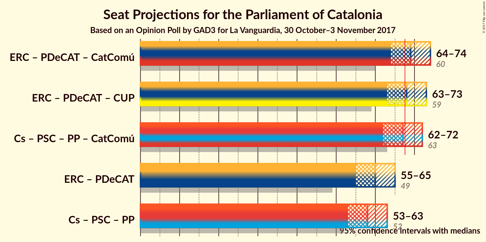

# Opinion Poll by GAD3 for La Vanguardia, 30 October–3 November 2017

<a href="#voting-intentions">Voting Intentions</a> | <a href="#seats">Seats</a> | <a href="#coalitions">Coalitions</a> | <a href="#technical-information">Technical Information</a>

## Voting Intentions

### Confidence Intervals

| Party | Last Result | Poll Result | 80% Confidence Interval | 90% Confidence Interval | 95% Confidence Interval | 99% Confidence Interval |
|:-----:|:-----------:|:-----------:|:-----------------------:|:-----------------------:|:-----------------------:|:-----------------------:|
| Esquerra Republicana de Catalunya–Catalunya Sí | 39.6% | 29.3% | 27.5–31.2% |27.0–31.8% |26.6–32.2% |25.7–33.2% |
| Ciutadans–Partido de la Ciudadanía | 17.9% | 20.6% | 19.1–22.3% |18.6–22.8% |18.2–23.2% |17.5–24.1% |
| Partit dels Socialistes de Catalunya (PSC-PSOE) | 12.7% | 14.6% | 13.3–16.1% |12.9–16.6% |12.6–16.9% |11.9–17.7% |
| Partit Demòcrata Europeu Català | 39.6% | 10.4% | 9.3–11.8% |8.9–12.1% |8.7–12.5% |8.1–13.1% |
| Partit Popular | 8.5% | 8.7% | 7.7–10.0% |7.4–10.3% |7.1–10.6% |6.6–11.2% |
| Catalunya en Comú | 8.9% | 8.3% | 7.3–9.5% |7.0–9.9% |6.8–10.2% |6.3–10.8% |
| Candidatura d’Unitat Popular | 8.2% | 6.3% | 5.4–7.4% |5.2–7.7% |5.0–8.0% |4.6–8.6% |

*Note:* The poll result column reflects the actual value used in the calculations. Published results may vary slightly, and in addition be rounded to fewer digits.

## Seats

### Confidence Intervals

| Party | Last Result | Median | 80% Confidence Interval | 90% Confidence Interval | 95% Confidence Interval | 99% Confidence Interval |
|:-----:|:-----------:|:------:|:-----------------------:|:-----------------------:|:-----------------------:|:-----------------------:|
| <a href="#esquerra-republicana-de-catalunya–catalunya-sí">Esquerra Republicana de Catalunya–Catalunya Sí</a> | 20 | 45 | 42–48 |41–49 |40–50 |39–51 |
| <a href="#ciutadans–partido-de-la-ciudadanía">Ciutadans–Partido de la Ciudadanía</a> | 25 | 27 | 25–30 |25–31 |25–32 |23–33 |
| <a href="#partit-dels-socialistes-de-catalunya-(psc-psoe)">Partit dels Socialistes de Catalunya (PSC-PSOE)</a> | 16 | 19 | 16–22 |16–22 |16–23 |15–23 |
| <a href="#partit-demòcrata-europeu-català">Partit Demòcrata Europeu Català</a> | 29 | 15 | 13–17 |13–17 |12–18 |11–19 |
| <a href="#partit-popular">Partit Popular</a> | 11 | 11 | 10–13 |9–13 |9–13 |8–14 |
| <a href="#catalunya-en-comú">Catalunya en Comú</a> | 11 | 9 | 8–11 |8–11 |7–12 |6–13 |
| <a href="#candidatura-d’unitat-popular">Candidatura d’Unitat Popular</a> | 10 | 8 | 7–9 |6–9 |5–10 |4–10 |

### Esquerra Republicana de Catalunya–Catalunya Sí

*For a full overview of the results for this party, see the [Esquerra Republicana de Catalunya–Catalunya Sí](party-esquerrarepublicanadecatalunyacatalunyas.html) page.*

| Number of Seats | Probability | Accumulated | Special Marks |
|:---------------:|:-----------:|:-----------:|:-------------:|
| 20 | 0% | 100% | Last Result |
| 21 | 0% | 100% |  |
| 22 | 0% | 100% |  |
| 23 | 0% | 100% |  |
| 24 | 0% | 100% |  |
| 25 | 0% | 100% |  |
| 26 | 0% | 100% |  |
| 27 | 0% | 100% |  |
| 28 | 0% | 100% |  |
| 29 | 0% | 100% |  |
| 30 | 0% | 100% |  |
| 31 | 0% | 100% |  |
| 32 | 0% | 100% |  |
| 33 | 0% | 100% |  |
| 34 | 0% | 100% |  |
| 35 | 0% | 100% |  |
| 36 | 0% | 100% |  |
| 37 | 0% | 100% |  |
| 38 | 0.2% | 100% |  |
| 39 | 0.5% | 99.7% |  |
| 40 | 2% | 99.2% |  |
| 41 | 3% | 97% |  |
| 42 | 6% | 95% |  |
| 43 | 10% | 88% |  |
| 44 | 19% | 78% |  |
| 45 | 16% | 59% | Median |
| 46 | 18% | 43% |  |
| 47 | 9% | 24% |  |
| 48 | 6% | 15% |  |
| 49 | 5% | 9% |  |
| 50 | 3% | 4% |  |
| 51 | 0.7% | 0.9% |  |
| 52 | 0.2% | 0.2% |  |
| 53 | 0% | 0.1% |  |
| 54 | 0% | 0% |  |

### Ciutadans–Partido de la Ciudadanía

*For a full overview of the results for this party, see the [Ciutadans–Partido de la Ciudadanía](party-ciutadanspartidodelaciudadana.html) page.*

| Number of Seats | Probability | Accumulated | Special Marks |
|:---------------:|:-----------:|:-----------:|:-------------:|
| 22 | 0.1% | 100% |  |
| 23 | 0.4% | 99.9% |  |
| 24 | 1.3% | 99.5% |  |
| 25 | 9% | 98% | Last Result |
| 26 | 23% | 89% |  |
| 27 | 18% | 66% | Median |
| 28 | 15% | 48% |  |
| 29 | 11% | 33% |  |
| 30 | 12% | 21% |  |
| 31 | 7% | 10% |  |
| 32 | 1.5% | 3% |  |
| 33 | 1.1% | 1.3% |  |
| 34 | 0.2% | 0.2% |  |
| 35 | 0% | 0% |  |

### Partit dels Socialistes de Catalunya (PSC-PSOE)

*For a full overview of the results for this party, see the [Partit dels Socialistes de Catalunya (PSC-PSOE)](party-partitdelssocialistesdecatalunyapscpsoe.html) page.*

| Number of Seats | Probability | Accumulated | Special Marks |
|:---------------:|:-----------:|:-----------:|:-------------:|
| 14 | 0.1% | 100% |  |
| 15 | 2% | 99.9% |  |
| 16 | 15% | 98% | Last Result |
| 17 | 16% | 83% |  |
| 18 | 12% | 68% |  |
| 19 | 18% | 56% | Median |
| 20 | 16% | 38% |  |
| 21 | 9% | 22% |  |
| 22 | 9% | 14% |  |
| 23 | 4% | 5% |  |
| 24 | 0.4% | 0.4% |  |
| 25 | 0% | 0% |  |

### Partit Demòcrata Europeu Català

*For a full overview of the results for this party, see the [Partit Demòcrata Europeu Català](party-partitdemcrataeuropeucatal.html) page.*

| Number of Seats | Probability | Accumulated | Special Marks |
|:---------------:|:-----------:|:-----------:|:-------------:|
| 11 | 2% | 100% |  |
| 12 | 3% | 98% |  |
| 13 | 21% | 95% |  |
| 14 | 17% | 74% |  |
| 15 | 26% | 57% | Median |
| 16 | 9% | 32% |  |
| 17 | 18% | 22% |  |
| 18 | 3% | 4% |  |
| 19 | 0.4% | 0.5% |  |
| 20 | 0.1% | 0.2% |  |
| 21 | 0.1% | 0.1% |  |
| 22 | 0% | 0% |  |
| 23 | 0% | 0% |  |
| 24 | 0% | 0% |  |
| 25 | 0% | 0% |  |
| 26 | 0% | 0% |  |
| 27 | 0% | 0% |  |
| 28 | 0% | 0% |  |
| 29 | 0% | 0% | Last Result |

### Partit Popular

*For a full overview of the results for this party, see the [Partit Popular](party-partitpopular.html) page.*

| Number of Seats | Probability | Accumulated | Special Marks |
|:---------------:|:-----------:|:-----------:|:-------------:|
| 7 | 0.2% | 100% |  |
| 8 | 2% | 99.8% |  |
| 9 | 5% | 98% |  |
| 10 | 35% | 93% |  |
| 11 | 15% | 58% | Last Result, Median |
| 12 | 27% | 43% |  |
| 13 | 14% | 16% |  |
| 14 | 2% | 2% |  |
| 15 | 0.1% | 0.2% |  |
| 16 | 0.1% | 0.1% |  |
| 17 | 0% | 0% |  |

### Catalunya en Comú

*For a full overview of the results for this party, see the [Catalunya en Comú](party-catalunyaencom.html) page.*

| Number of Seats | Probability | Accumulated | Special Marks |
|:---------------:|:-----------:|:-----------:|:-------------:|
| 5 | 0.1% | 100% |  |
| 6 | 1.1% | 99.9% |  |
| 7 | 3% | 98.9% |  |
| 8 | 25% | 96% |  |
| 9 | 42% | 71% | Median |
| 10 | 8% | 29% |  |
| 11 | 16% | 21% | Last Result |
| 12 | 4% | 5% |  |
| 13 | 0.8% | 1.1% |  |
| 14 | 0.3% | 0.3% |  |
| 15 | 0% | 0% |  |

### Candidatura d’Unitat Popular

*For a full overview of the results for this party, see the [Candidatura d’Unitat Popular](party-candidaturadunitatpopular.html) page.*

| Number of Seats | Probability | Accumulated | Special Marks |
|:---------------:|:-----------:|:-----------:|:-------------:|
| 3 | 0.3% | 100% |  |
| 4 | 0.5% | 99.7% |  |
| 5 | 3% | 99.2% |  |
| 6 | 3% | 97% |  |
| 7 | 7% | 94% |  |
| 8 | 50% | 86% | Median |
| 9 | 32% | 36% |  |
| 10 | 4% | 5% | Last Result |
| 11 | 0.1% | 0.2% |  |
| 12 | 0.1% | 0.1% |  |
| 13 | 0% | 0% |  |

## Coalitions

### Confidence Intervals

| Coalition | Last Result | Median | Majority? | 80% Confidence Interval | 90% Confidence Interval | 95% Confidence Interval | 99% Confidence Interval |
|:---------:|:-----------:|:------:|:---------:|:-----------------------:|:-----------------------:|:-----------------------:|:-----------------------:|
| Esquerra Republicana de Catalunya–Catalunya Sí – Partit Demòcrata Europeu Català – Catalunya en Comú | 60 | 69 | 77% | 66–72 | 65–74 | 64–74 | 63–75 |
| Esquerra Republicana de Catalunya–Catalunya Sí – Partit Demòcrata Europeu Català – Candidatura d’Unitat Popular | 59 | 68 | 62% | 65–71 | 64–72 | 63–73 | 62–74 |
| Ciutadans–Partido de la Ciudadanía – Partit dels Socialistes de Catalunya (PSC-PSOE) – Partit Popular – Catalunya en Comú | 63 | 67 | 38% | 64–70 | 63–71 | 62–72 | 61–73 |
| Esquerra Republicana de Catalunya–Catalunya Sí – Partit Demòcrata Europeu Català | 49 | 60 | 0.1% | 57–63 | 56–64 | 55–65 | 54–66 |
| Ciutadans–Partido de la Ciudadanía – Partit dels Socialistes de Catalunya (PSC-PSOE) – Partit Popular | 52 | 57 | 0% | 54–61 | 53–62 | 53–63 | 52–64 |

### Esquerra Republicana de Catalunya–Catalunya Sí – Partit Demòcrata Europeu Català – Catalunya en Comú

| Number of Seats | Probability | Accumulated | Special Marks |
|:---------------:|:-----------:|:-----------:|:-------------:|
| 60 | 0% | 100% | Last Result |
| 61 | 0.1% | 100% |  |
| 62 | 0.2% | 99.9% |  |
| 63 | 1.0% | 99.7% |  |
| 64 | 2% | 98.7% |  |
| 65 | 4% | 97% |  |
| 66 | 6% | 93% |  |
| 67 | 10% | 87% |  |
| 68 | 15% | 77% | Majority |
| 69 | 17% | 62% | Median |
| 70 | 16% | 45% |  |
| 71 | 13% | 29% |  |
| 72 | 7% | 16% |  |
| 73 | 4% | 9% |  |
| 74 | 3% | 5% |  |
| 75 | 1.1% | 2% |  |
| 76 | 0.4% | 0.5% |  |
| 77 | 0.1% | 0.1% |  |
| 78 | 0% | 0% |  |

### Esquerra Republicana de Catalunya–Catalunya Sí – Partit Demòcrata Europeu Català – Candidatura d’Unitat Popular

| Number of Seats | Probability | Accumulated | Special Marks |
|:---------------:|:-----------:|:-----------:|:-------------:|
| 59 | 0% | 100% | Last Result |
| 60 | 0.1% | 100% |  |
| 61 | 0.4% | 99.9% |  |
| 62 | 0.7% | 99.5% |  |
| 63 | 2% | 98.8% |  |
| 64 | 4% | 97% |  |
| 65 | 7% | 92% |  |
| 66 | 9% | 85% |  |
| 67 | 14% | 76% |  |
| 68 | 15% | 62% | Median, Majority |
| 69 | 18% | 47% |  |
| 70 | 13% | 29% |  |
| 71 | 8% | 16% |  |
| 72 | 4% | 8% |  |
| 73 | 2% | 4% |  |
| 74 | 1.0% | 1.4% |  |
| 75 | 0.3% | 0.3% |  |
| 76 | 0% | 0.1% |  |
| 77 | 0% | 0% |  |

### Ciutadans–Partido de la Ciudadanía – Partit dels Socialistes de Catalunya (PSC-PSOE) – Partit Popular – Catalunya en Comú

| Number of Seats | Probability | Accumulated | Special Marks |
|:---------------:|:-----------:|:-----------:|:-------------:|
| 59 | 0% | 100% |  |
| 60 | 0.3% | 99.9% |  |
| 61 | 1.0% | 99.7% |  |
| 62 | 2% | 98.6% |  |
| 63 | 4% | 96% | Last Result |
| 64 | 8% | 92% |  |
| 65 | 13% | 84% |  |
| 66 | 18% | 71% | Median |
| 67 | 15% | 53% |  |
| 68 | 14% | 38% | Majority |
| 69 | 9% | 24% |  |
| 70 | 7% | 15% |  |
| 71 | 4% | 8% |  |
| 72 | 2% | 3% |  |
| 73 | 0.7% | 1.2% |  |
| 74 | 0.4% | 0.5% |  |
| 75 | 0.1% | 0.1% |  |
| 76 | 0% | 0% |  |

### Esquerra Republicana de Catalunya–Catalunya Sí – Partit Demòcrata Europeu Català

| Number of Seats | Probability | Accumulated | Special Marks |
|:---------------:|:-----------:|:-----------:|:-------------:|
| 49 | 0% | 100% | Last Result |
| 50 | 0% | 100% |  |
| 51 | 0% | 100% |  |
| 52 | 0.1% | 100% |  |
| 53 | 0.3% | 99.9% |  |
| 54 | 0.9% | 99.6% |  |
| 55 | 2% | 98.7% |  |
| 56 | 4% | 96% |  |
| 57 | 7% | 92% |  |
| 58 | 10% | 85% |  |
| 59 | 17% | 75% |  |
| 60 | 14% | 58% | Median |
| 61 | 18% | 43% |  |
| 62 | 12% | 25% |  |
| 63 | 7% | 14% |  |
| 64 | 4% | 7% |  |
| 65 | 2% | 3% |  |
| 66 | 0.8% | 1.2% |  |
| 67 | 0.3% | 0.4% |  |
| 68 | 0.1% | 0.1% | Majority |
| 69 | 0% | 0% |  |

### Ciutadans–Partido de la Ciudadanía – Partit dels Socialistes de Catalunya (PSC-PSOE) – Partit Popular

| Number of Seats | Probability | Accumulated | Special Marks |
|:---------------:|:-----------:|:-----------:|:-------------:|
| 50 | 0.1% | 100% |  |
| 51 | 0.3% | 99.9% |  |
| 52 | 1.4% | 99.6% | Last Result |
| 53 | 4% | 98% |  |
| 54 | 5% | 95% |  |
| 55 | 8% | 90% |  |
| 56 | 14% | 82% |  |
| 57 | 19% | 68% | Median |
| 58 | 15% | 50% |  |
| 59 | 14% | 35% |  |
| 60 | 8% | 21% |  |
| 61 | 6% | 13% |  |
| 62 | 4% | 7% |  |
| 63 | 2% | 3% |  |
| 64 | 0.8% | 1.1% |  |
| 65 | 0.1% | 0.2% |  |
| 66 | 0.1% | 0.1% |  |
| 67 | 0% | 0% |  |

## Technical Information

### Opinion Poll

+ **Polling firm:** GAD3
+ **Commissioner(s):** La Vanguardia
+ **Fieldwork period:** 30 October–3 November 2017

### Calculations

+ **Sample size:** 999
+ **Simulations done:** 2,097,152
+ **Error estimate:** 1.05%

