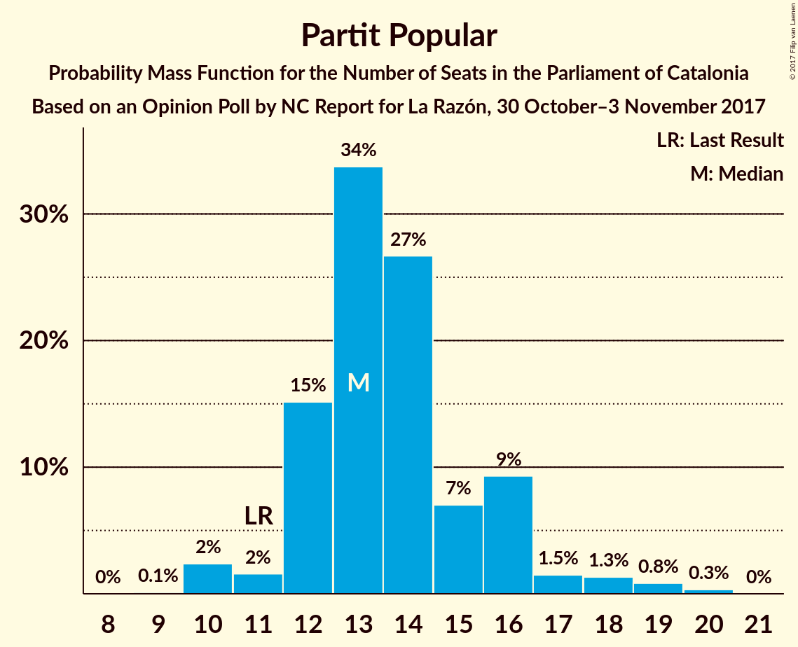

# Opinion Poll by NC Report for La Razón, 30 October–3 November 2017

<a href="#voting-intentions">Voting Intentions</a> | <a href="#seats">Seats</a> | <a href="#coalitions">Coalitions</a> | <a href="#technical-information">Technical Information</a>

## Voting Intentions

### Confidence Intervals

| Party | Last Result | Poll Result | 80% Confidence Interval | 90% Confidence Interval | 95% Confidence Interval | 99% Confidence Interval |
|:-----:|:-----------:|:-----------:|:-----------------------:|:-----------------------:|:-----------------------:|:-----------------------:|
| Esquerra Republicana de Catalunya–Catalunya Sí | 39.6% | 26.3% | 24.3–28.5% |23.7–29.2% |23.2–29.7% |22.3–30.8% |
| Ciutadans–Partido de la Ciudadanía | 17.9% | 19.6% | 17.8–21.6% |17.3–22.2% |16.8–22.7% |16.0–23.7% |
| Partit dels Socialistes de Catalunya (PSC-PSOE) | 12.7% | 13.7% | 12.1–15.4% |11.7–15.9% |11.3–16.4% |10.6–17.3% |
| Partit Demòcrata Europeu Català | 39.6% | 10.7% | 9.3–12.3% |9.0–12.8% |8.6–13.2% |8.0–14.0% |
| Partit Popular | 8.5% | 10.6% | 9.2–12.2% |8.8–12.7% |8.5–13.0% |7.9–13.9% |
| Catalunya en Comú | 8.9% | 10.4% | 9.1–12.0% |8.7–12.5% |8.4–12.9% |7.8–13.7% |
| Candidatura d’Unitat Popular | 8.2% | 6.3% | 5.3–7.7% |5.0–8.0% |4.8–8.4% |4.3–9.1% |

*Note:* The poll result column reflects the actual value used in the calculations. Published results may vary slightly, and in addition be rounded to fewer digits.

## Seats

### Confidence Intervals

| Party | Last Result | Median | 80% Confidence Interval | 90% Confidence Interval | 95% Confidence Interval | 99% Confidence Interval |
|:-----:|:-----------:|:------:|:-----------------------:|:-----------------------:|:-----------------------:|:-----------------------:|
| <a href="#esquerra-republicana-de-catalunya–catalunya-sí">Esquerra Republicana de Catalunya–Catalunya Sí</a> | 20 | 41 | 37–44 |37–45 |36–46 |34–48 |
| <a href="#ciutadans–partido-de-la-ciudadanía">Ciutadans–Partido de la Ciudadanía</a> | 25 | 26 | 24–30 |24–30 |23–31 |21–33 |
| <a href="#partit-dels-socialistes-de-catalunya-(psc-psoe)">Partit dels Socialistes de Catalunya (PSC-PSOE)</a> | 16 | 17 | 15–21 |15–22 |14–22 |14–23 |
| <a href="#partit-demòcrata-europeu-català">Partit Demòcrata Europeu Català</a> | 29 | 15 | 13–18 |13–18 |12–19 |11–21 |
| <a href="#partit-popular">Partit Popular</a> | 11 | 13 | 12–16 |11–16 |10–18 |10–19 |
| <a href="#catalunya-en-comú">Catalunya en Comú</a> | 11 | 13 | 11–15 |9–16 |9–17 |8–17 |
| <a href="#candidatura-d’unitat-popular">Candidatura d’Unitat Popular</a> | 10 | 8 | 7–9 |6–10 |5–10 |3–12 |

### Esquerra Republicana de Catalunya–Catalunya Sí

*For a full overview of the results for this party, see the [Esquerra Republicana de Catalunya–Catalunya Sí](party-esquerrarepublicanadecatalunyacatalunyas.html) page.*

| Number of Seats | Probability | Accumulated | Special Marks |
|:---------------:|:-----------:|:-----------:|:-------------:|
| 20 | 0% | 100% | Last Result |
| 21 | 0% | 100% |  |
| 22 | 0% | 100% |  |
| 23 | 0% | 100% |  |
| 24 | 0% | 100% |  |
| 25 | 0% | 100% |  |
| 26 | 0% | 100% |  |
| 27 | 0% | 100% |  |
| 28 | 0% | 100% |  |
| 29 | 0% | 100% |  |
| 30 | 0% | 100% |  |
| 31 | 0% | 100% |  |
| 32 | 0% | 100% |  |
| 33 | 0.2% | 99.9% |  |
| 34 | 0.3% | 99.8% |  |
| 35 | 1.3% | 99.4% |  |
| 36 | 3% | 98% |  |
| 37 | 8% | 95% |  |
| 38 | 11% | 87% |  |
| 39 | 12% | 76% |  |
| 40 | 10% | 65% |  |
| 41 | 12% | 55% | Median |
| 42 | 13% | 43% |  |
| 43 | 15% | 30% |  |
| 44 | 7% | 16% |  |
| 45 | 4% | 8% |  |
| 46 | 2% | 4% |  |
| 47 | 1.1% | 2% |  |
| 48 | 0.5% | 0.8% |  |
| 49 | 0.2% | 0.3% |  |
| 50 | 0.1% | 0.1% |  |
| 51 | 0% | 0% |  |

### Ciutadans–Partido de la Ciudadanía

*For a full overview of the results for this party, see the [Ciutadans–Partido de la Ciudadanía](party-ciutadanspartidodelaciudadana.html) page.*

| Number of Seats | Probability | Accumulated | Special Marks |
|:---------------:|:-----------:|:-----------:|:-------------:|
| 20 | 0.4% | 100% |  |
| 21 | 0.3% | 99.6% |  |
| 22 | 2% | 99.3% |  |
| 23 | 2% | 98% |  |
| 24 | 11% | 96% |  |
| 25 | 21% | 84% | Last Result |
| 26 | 22% | 63% | Median |
| 27 | 9% | 41% |  |
| 28 | 14% | 32% |  |
| 29 | 7% | 19% |  |
| 30 | 8% | 12% |  |
| 31 | 2% | 4% |  |
| 32 | 1.1% | 2% |  |
| 33 | 0.7% | 0.8% |  |
| 34 | 0.1% | 0.1% |  |
| 35 | 0% | 0% |  |

### Partit dels Socialistes de Catalunya (PSC-PSOE)

*For a full overview of the results for this party, see the [Partit dels Socialistes de Catalunya (PSC-PSOE)](party-partitdelssocialistesdecatalunyapscpsoe.html) page.*

| Number of Seats | Probability | Accumulated | Special Marks |
|:---------------:|:-----------:|:-----------:|:-------------:|
| 12 | 0% | 100% |  |
| 13 | 0.2% | 99.9% |  |
| 14 | 3% | 99.7% |  |
| 15 | 14% | 96% |  |
| 16 | 26% | 83% | Last Result |
| 17 | 12% | 57% | Median |
| 18 | 14% | 45% |  |
| 19 | 8% | 32% |  |
| 20 | 11% | 24% |  |
| 21 | 5% | 13% |  |
| 22 | 7% | 9% |  |
| 23 | 2% | 2% |  |
| 24 | 0.2% | 0.2% |  |
| 25 | 0% | 0% |  |

### Partit Demòcrata Europeu Català

*For a full overview of the results for this party, see the [Partit Demòcrata Europeu Català](party-partitdemcrataeuropeucatal.html) page.*

| Number of Seats | Probability | Accumulated | Special Marks |
|:---------------:|:-----------:|:-----------:|:-------------:|
| 10 | 0% | 100% |  |
| 11 | 2% | 99.9% |  |
| 12 | 1.1% | 98% |  |
| 13 | 15% | 97% |  |
| 14 | 8% | 82% |  |
| 15 | 25% | 74% | Median |
| 16 | 12% | 49% |  |
| 17 | 26% | 37% |  |
| 18 | 6% | 11% |  |
| 19 | 2% | 4% |  |
| 20 | 1.2% | 2% |  |
| 21 | 1.0% | 1.3% |  |
| 22 | 0.2% | 0.2% |  |
| 23 | 0.1% | 0.1% |  |
| 24 | 0% | 0% |  |
| 25 | 0% | 0% |  |
| 26 | 0% | 0% |  |
| 27 | 0% | 0% |  |
| 28 | 0% | 0% |  |
| 29 | 0% | 0% | Last Result |

### Partit Popular

*For a full overview of the results for this party, see the [Partit Popular](party-partitpopular.html) page.*

| Number of Seats | Probability | Accumulated | Special Marks |
|:---------------:|:-----------:|:-----------:|:-------------:|
| 9 | 0.1% | 100% |  |
| 10 | 3% | 99.9% |  |
| 11 | 2% | 97% | Last Result |
| 12 | 15% | 95% |  |
| 13 | 34% | 80% | Median |
| 14 | 24% | 47% |  |
| 15 | 7% | 22% |  |
| 16 | 11% | 16% |  |
| 17 | 2% | 5% |  |
| 18 | 2% | 3% |  |
| 19 | 1.1% | 1.5% |  |
| 20 | 0.4% | 0.4% |  |
| 21 | 0% | 0% |  |

### Catalunya en Comú

*For a full overview of the results for this party, see the [Catalunya en Comú](party-catalunyaencom.html) page.*

| Number of Seats | Probability | Accumulated | Special Marks |
|:---------------:|:-----------:|:-----------:|:-------------:|
| 8 | 0.7% | 100% |  |
| 9 | 5% | 99.3% |  |
| 10 | 3% | 94% |  |
| 11 | 22% | 91% | Last Result |
| 12 | 19% | 70% |  |
| 13 | 13% | 50% | Median |
| 14 | 23% | 38% |  |
| 15 | 9% | 15% |  |
| 16 | 3% | 6% |  |
| 17 | 3% | 3% |  |
| 18 | 0.3% | 0.4% |  |
| 19 | 0% | 0% |  |

### Candidatura d’Unitat Popular

*For a full overview of the results for this party, see the [Candidatura d’Unitat Popular](party-candidaturadunitatpopular.html) page.*

| Number of Seats | Probability | Accumulated | Special Marks |
|:---------------:|:-----------:|:-----------:|:-------------:|
| 3 | 0.7% | 100% |  |
| 4 | 0.5% | 99.3% |  |
| 5 | 4% | 98.8% |  |
| 6 | 2% | 95% |  |
| 7 | 8% | 93% |  |
| 8 | 45% | 84% | Median |
| 9 | 31% | 40% |  |
| 10 | 8% | 9% | Last Result |
| 11 | 0.4% | 1.0% |  |
| 12 | 0.5% | 0.6% |  |
| 13 | 0% | 0.1% |  |
| 14 | 0% | 0% |  |

## Coalitions

### Confidence Intervals

| Coalition | Last Result | Median | Majority? | 80% Confidence Interval | 90% Confidence Interval | 95% Confidence Interval | 99% Confidence Interval |
|:---------:|:-----------:|:------:|:---------:|:-----------------------:|:-----------------------:|:-----------------------:|:-----------------------:|
| Ciutadans–Partido de la Ciudadanía – Partit dels Socialistes de Catalunya (PSC-PSOE) – Partit Popular – Catalunya en Comú | 63 | 71 | 82% | 67–74 | 66–75 | 65–76 | 63–78 |
| Esquerra Republicana de Catalunya–Catalunya Sí – Partit Demòcrata Europeu Català – Catalunya en Comú | 60 | 69 | 70% | 65–73 | 64–73 | 63–74 | 61–76 |
| Esquerra Republicana de Catalunya–Catalunya Sí – Partit Demòcrata Europeu Català – Candidatura d’Unitat Popular | 59 | 64 | 18% | 61–68 | 60–69 | 59–70 | 57–72 |
| Ciutadans–Partido de la Ciudadanía – Partit dels Socialistes de Catalunya (PSC-PSOE) – Partit Popular | 52 | 58 | 0.1% | 54–61 | 53–63 | 53–64 | 51–65 |
| Esquerra Republicana de Catalunya–Catalunya Sí – Partit Demòcrata Europeu Català | 49 | 56 | 0% | 53–60 | 52–61 | 51–62 | 49–64 |

### Ciutadans–Partido de la Ciudadanía – Partit dels Socialistes de Catalunya (PSC-PSOE) – Partit Popular – Catalunya en Comú

| Number of Seats | Probability | Accumulated | Special Marks |
|:---------------:|:-----------:|:-----------:|:-------------:|
| 62 | 0.1% | 100% |  |
| 63 | 0.4% | 99.8% | Last Result |
| 64 | 0.9% | 99.4% |  |
| 65 | 2% | 98.5% |  |
| 66 | 5% | 96% |  |
| 67 | 9% | 91% |  |
| 68 | 9% | 82% | Majority |
| 69 | 11% | 73% | Median |
| 70 | 10% | 62% |  |
| 71 | 15% | 52% |  |
| 72 | 14% | 38% |  |
| 73 | 10% | 24% |  |
| 74 | 6% | 13% |  |
| 75 | 4% | 8% |  |
| 76 | 2% | 4% |  |
| 77 | 1.3% | 2% |  |
| 78 | 0.5% | 0.8% |  |
| 79 | 0.2% | 0.3% |  |
| 80 | 0.1% | 0.1% |  |
| 81 | 0% | 0% |  |

### Esquerra Republicana de Catalunya–Catalunya Sí – Partit Demòcrata Europeu Català – Catalunya en Comú

| Number of Seats | Probability | Accumulated | Special Marks |
|:---------------:|:-----------:|:-----------:|:-------------:|
| 60 | 0.1% | 100% | Last Result |
| 61 | 0.4% | 99.8% |  |
| 62 | 0.6% | 99.5% |  |
| 63 | 2% | 98.9% |  |
| 64 | 4% | 97% |  |
| 65 | 4% | 94% |  |
| 66 | 8% | 89% |  |
| 67 | 11% | 81% |  |
| 68 | 13% | 70% | Majority |
| 69 | 12% | 57% | Median |
| 70 | 13% | 45% |  |
| 71 | 12% | 31% |  |
| 72 | 9% | 19% |  |
| 73 | 6% | 10% |  |
| 74 | 3% | 5% |  |
| 75 | 1.1% | 2% |  |
| 76 | 0.7% | 1.1% |  |
| 77 | 0.3% | 0.4% |  |
| 78 | 0.1% | 0.1% |  |
| 79 | 0% | 0% |  |

### Esquerra Republicana de Catalunya–Catalunya Sí – Partit Demòcrata Europeu Català – Candidatura d’Unitat Popular

| Number of Seats | Probability | Accumulated | Special Marks |
|:---------------:|:-----------:|:-----------:|:-------------:|
| 55 | 0.1% | 100% |  |
| 56 | 0.2% | 99.9% |  |
| 57 | 0.5% | 99.7% |  |
| 58 | 1.3% | 99.2% |  |
| 59 | 2% | 98% | Last Result |
| 60 | 4% | 96% |  |
| 61 | 6% | 92% |  |
| 62 | 10% | 87% |  |
| 63 | 14% | 76% |  |
| 64 | 15% | 62% | Median |
| 65 | 10% | 48% |  |
| 66 | 11% | 38% |  |
| 67 | 9% | 27% |  |
| 68 | 9% | 18% | Majority |
| 69 | 5% | 9% |  |
| 70 | 2% | 4% |  |
| 71 | 0.9% | 1.5% |  |
| 72 | 0.4% | 0.6% |  |
| 73 | 0.1% | 0.2% |  |
| 74 | 0% | 0% |  |

### Ciutadans–Partido de la Ciudadanía – Partit dels Socialistes de Catalunya (PSC-PSOE) – Partit Popular

| Number of Seats | Probability | Accumulated | Special Marks |
|:---------------:|:-----------:|:-----------:|:-------------:|
| 49 | 0.1% | 100% |  |
| 50 | 0.2% | 99.9% |  |
| 51 | 0.5% | 99.7% |  |
| 52 | 1.3% | 99.2% | Last Result |
| 53 | 3% | 98% |  |
| 54 | 7% | 95% |  |
| 55 | 9% | 87% |  |
| 56 | 12% | 78% | Median |
| 57 | 13% | 66% |  |
| 58 | 14% | 53% |  |
| 59 | 9% | 39% |  |
| 60 | 13% | 29% |  |
| 61 | 7% | 16% |  |
| 62 | 4% | 10% |  |
| 63 | 3% | 5% |  |
| 64 | 1.4% | 3% |  |
| 65 | 0.7% | 1.1% |  |
| 66 | 0.3% | 0.4% |  |
| 67 | 0.1% | 0.2% |  |
| 68 | 0% | 0.1% | Majority |
| 69 | 0% | 0% |  |

### Esquerra Republicana de Catalunya–Catalunya Sí – Partit Demòcrata Europeu Català

| Number of Seats | Probability | Accumulated | Special Marks |
|:---------------:|:-----------:|:-----------:|:-------------:|
| 47 | 0% | 100% |  |
| 48 | 0.2% | 99.9% |  |
| 49 | 0.5% | 99.8% | Last Result |
| 50 | 2% | 99.3% |  |
| 51 | 2% | 98% |  |
| 52 | 4% | 96% |  |
| 53 | 6% | 92% |  |
| 54 | 11% | 86% |  |
| 55 | 17% | 74% |  |
| 56 | 13% | 58% | Median |
| 57 | 9% | 45% |  |
| 58 | 10% | 36% |  |
| 59 | 10% | 26% |  |
| 60 | 9% | 16% |  |
| 61 | 3% | 6% |  |
| 62 | 2% | 3% |  |
| 63 | 0.8% | 1.3% |  |
| 64 | 0.3% | 0.5% |  |
| 65 | 0.1% | 0.2% |  |
| 66 | 0% | 0.1% |  |
| 67 | 0% | 0% |  |

## Technical Information

### Opinion Poll

+ **Polling firm:** NC Report
+ **Commissioner(s):** La Razón
+ **Fieldwork period:** 30 October–3 November 2017

### Calculations

+ **Sample size:** 710
+ **Simulations done:** 1,048,576
+ **Error estimate:** 2.19%

