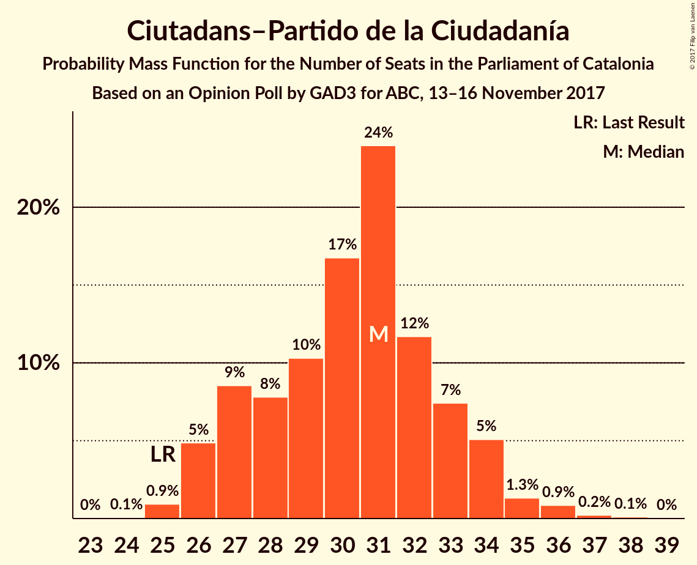

# Opinion Poll by GAD3 for ABC, 13–16 November 2017

<a href="#voting-intentions">Voting Intentions</a> | <a href="#seats">Seats</a> | <a href="#coalitions">Coalitions</a> | <a href="#technical-information">Technical Information</a>

## Voting Intentions

### Confidence Intervals

| Party | Last Result | Poll Result | 80% Confidence Interval | 90% Confidence Interval | 95% Confidence Interval | 99% Confidence Interval |
|:-----:|:-----------:|:-----------:|:-----------------------:|:-----------------------:|:-----------------------:|:-----------------------:|
| Esquerra Republicana de Catalunya–Catalunya Sí | 39.6% | 23.1% | 21.3–25.1% |20.7–25.7% |20.3–26.2% |19.4–27.1% |
| Ciutadans–Partido de la Ciudadanía | 17.9% | 22.3% | 20.5–24.3% |20.0–24.9% |19.6–25.4% |18.7–26.3% |
| Junts per Catalunya | 39.6% | 16.7% | 15.1–18.5% |14.7–19.0% |14.3–19.5% |13.6–20.4% |
| Partit dels Socialistes de Catalunya (PSC-PSOE) | 12.7% | 15.1% | 13.6–16.8% |13.2–17.3% |12.8–17.8% |12.1–18.6% |
| Partit Popular | 8.5% | 7.7% | 6.6–9.1% |6.3–9.5% |6.1–9.8% |5.6–10.5% |
| Catalunya en Comú | 8.9% | 7.6% | 6.5–9.0% |6.2–9.3% |6.0–9.7% |5.5–10.3% |
| Candidatura d’Unitat Popular | 8.2% | 5.6% | 4.7–6.8% |4.4–7.1% |4.2–7.4% |3.8–8.0% |

*Note:* The poll result column reflects the actual value used in the calculations. Published results may vary slightly, and in addition be rounded to fewer digits.

## Seats

### Confidence Intervals

| Party | Last Result | Median | 80% Confidence Interval | 90% Confidence Interval | 95% Confidence Interval | 99% Confidence Interval |
|:-----:|:-----------:|:------:|:-----------------------:|:-----------------------:|:-----------------------:|:-----------------------:|
| <a href="#esquerra-republicana-de-catalunya–catalunya-sí">Esquerra Republicana de Catalunya–Catalunya Sí</a> | 20 | 35 | 32–38 |31–39 |30–40 |29–42 |
| <a href="#ciutadans–partido-de-la-ciudadanía">Ciutadans–Partido de la Ciudadanía</a> | 25 | 31 | 27–33 |26–34 |26–34 |25–36 |
| <a href="#junts-per-catalunya">Junts per Catalunya</a> | 29 | 24 | 23–28 |22–29 |21–29 |20–30 |
| <a href="#partit-dels-socialistes-de-catalunya-(psc-psoe)">Partit dels Socialistes de Catalunya (PSC-PSOE)</a> | 16 | 20 | 17–23 |16–23 |16–24 |15–24 |
| <a href="#partit-popular">Partit Popular</a> | 11 | 10 | 8–12 |7–12 |7–13 |6–13 |
| <a href="#catalunya-en-comú">Catalunya en Comú</a> | 11 | 8 | 7–10 |6–11 |6–11 |5–12 |
| <a href="#candidatura-d’unitat-popular">Candidatura d’Unitat Popular</a> | 10 | 8 | 5–9 |4–9 |3–9 |3–10 |

### Esquerra Republicana de Catalunya–Catalunya Sí

*For a full overview of the results for this party, see the [Esquerra Republicana de Catalunya–Catalunya Sí](party-esquerrarepublicanadecatalunya–catalunyasí.html) page.*

| Number of Seats | Probability | Accumulated | Special Marks |
|:---------------:|:-----------:|:-----------:|:-------------:|
| 20 | 0% | 100% | Last Result |
| 21 | 0% | 100% |  |
| 22 | 0% | 100% |  |
| 23 | 0% | 100% |  |
| 24 | 0% | 100% |  |
| 25 | 0% | 100% |  |
| 26 | 0% | 100% |  |
| 27 | 0% | 100% |  |
| 28 | 0.1% | 100% |  |
| 29 | 0.7% | 99.9% |  |
| 30 | 2% | 99.2% |  |
| 31 | 4% | 97% |  |
| 32 | 11% | 93% |  |
| 33 | 8% | 82% |  |
| 34 | 9% | 74% |  |
| 35 | 18% | 65% | Median |
| 36 | 19% | 46% |  |
| 37 | 10% | 27% |  |
| 38 | 11% | 17% |  |
| 39 | 3% | 6% |  |
| 40 | 2% | 3% |  |
| 41 | 0.8% | 1.4% |  |
| 42 | 0.4% | 0.6% |  |
| 43 | 0.1% | 0.2% |  |
| 44 | 0.1% | 0.1% |  |
| 45 | 0% | 0% |  |

### Ciutadans–Partido de la Ciudadanía

*For a full overview of the results for this party, see the [Ciutadans–Partido de la Ciudadanía](party-ciutadans–partidodelaciudadanía.html) page.*

| Number of Seats | Probability | Accumulated | Special Marks |
|:---------------:|:-----------:|:-----------:|:-------------:|
| 24 | 0.1% | 100% |  |
| 25 | 0.9% | 99.9% | Last Result |
| 26 | 5% | 99.0% |  |
| 27 | 8% | 94% |  |
| 28 | 8% | 86% |  |
| 29 | 10% | 78% |  |
| 30 | 18% | 68% |  |
| 31 | 23% | 50% | Median |
| 32 | 12% | 27% |  |
| 33 | 7% | 15% |  |
| 34 | 5% | 8% |  |
| 35 | 1.3% | 2% |  |
| 36 | 0.8% | 1.2% |  |
| 37 | 0.2% | 0.4% |  |
| 38 | 0.1% | 0.1% |  |
| 39 | 0% | 0% |  |

### Junts per Catalunya

*For a full overview of the results for this party, see the [Junts per Catalunya](party-juntspercatalunya.html) page.*

| Number of Seats | Probability | Accumulated | Special Marks |
|:---------------:|:-----------:|:-----------:|:-------------:|
| 18 | 0.2% | 100% |  |
| 19 | 0.2% | 99.8% |  |
| 20 | 0.5% | 99.5% |  |
| 21 | 3% | 99.0% |  |
| 22 | 4% | 96% |  |
| 23 | 19% | 92% |  |
| 24 | 29% | 72% | Median |
| 25 | 10% | 44% |  |
| 26 | 11% | 33% |  |
| 27 | 9% | 23% |  |
| 28 | 6% | 13% |  |
| 29 | 6% | 8% | Last Result |
| 30 | 2% | 2% |  |
| 31 | 0.2% | 0.4% |  |
| 32 | 0.1% | 0.2% |  |
| 33 | 0% | 0% |  |

### Partit dels Socialistes de Catalunya (PSC-PSOE)

*For a full overview of the results for this party, see the [Partit dels Socialistes de Catalunya (PSC-PSOE)](party-partitdelssocialistesdecatalunyapsc-psoe.html) page.*

| Number of Seats | Probability | Accumulated | Special Marks |
|:---------------:|:-----------:|:-----------:|:-------------:|
| 14 | 0.1% | 100% |  |
| 15 | 1.2% | 99.9% |  |
| 16 | 8% | 98.7% | Last Result |
| 17 | 14% | 91% |  |
| 18 | 9% | 77% |  |
| 19 | 15% | 68% |  |
| 20 | 13% | 53% | Median |
| 21 | 11% | 40% |  |
| 22 | 17% | 29% |  |
| 23 | 9% | 11% |  |
| 24 | 2% | 3% |  |
| 25 | 0.3% | 0.3% |  |
| 26 | 0% | 0.1% |  |
| 27 | 0% | 0% |  |

### Partit Popular

*For a full overview of the results for this party, see the [Partit Popular](party-partitpopular.html) page.*

| Number of Seats | Probability | Accumulated | Special Marks |
|:---------------:|:-----------:|:-----------:|:-------------:|
| 5 | 0.2% | 100% |  |
| 6 | 2% | 99.8% |  |
| 7 | 4% | 98% |  |
| 8 | 13% | 94% |  |
| 9 | 18% | 81% |  |
| 10 | 41% | 62% | Median |
| 11 | 8% | 21% | Last Result |
| 12 | 10% | 13% |  |
| 13 | 3% | 3% |  |
| 14 | 0.2% | 0.2% |  |
| 15 | 0% | 0% |  |

### Catalunya en Comú

*For a full overview of the results for this party, see the [Catalunya en Comú](party-catalunyaencomú.html) page.*

| Number of Seats | Probability | Accumulated | Special Marks |
|:---------------:|:-----------:|:-----------:|:-------------:|
| 5 | 2% | 100% |  |
| 6 | 7% | 98% |  |
| 7 | 10% | 91% |  |
| 8 | 39% | 81% | Median |
| 9 | 31% | 42% |  |
| 10 | 4% | 12% |  |
| 11 | 6% | 7% | Last Result |
| 12 | 1.1% | 1.4% |  |
| 13 | 0.2% | 0.3% |  |
| 14 | 0.1% | 0.1% |  |
| 15 | 0% | 0% |  |

### Candidatura d’Unitat Popular

*For a full overview of the results for this party, see the [Candidatura d’Unitat Popular](party-candidaturad’unitatpopular.html) page.*

| Number of Seats | Probability | Accumulated | Special Marks |
|:---------------:|:-----------:|:-----------:|:-------------:|
| 3 | 5% | 100% |  |
| 4 | 4% | 95% |  |
| 5 | 15% | 91% |  |
| 6 | 5% | 76% |  |
| 7 | 15% | 71% |  |
| 8 | 43% | 57% | Median |
| 9 | 12% | 13% |  |
| 10 | 1.0% | 1.1% | Last Result |
| 11 | 0% | 0% |  |

## Coalitions

### Confidence Intervals

| Coalition | Last Result | Median | Majority? | 80% Confidence Interval | 90% Confidence Interval | 95% Confidence Interval | 99% Confidence Interval |
|:---------:|:-----------:|:------:|:---------:|:-----------------------:|:-----------------------:|:-----------------------:|:-----------------------:|
| Esquerra Republicana de Catalunya–Catalunya Sí – Junts per Catalunya – Catalunya en Comú | 60 | 68 | 61% | 64–72 | 63–73 | 63–74 | 61–76 |
| Esquerra Republicana de Catalunya–Catalunya Sí – Junts per Catalunya – Candidatura d’Unitat Popular | 59 | 67 | 44% | 63–70 | 62–72 | 62–73 | 60–74 |
| Ciutadans–Partido de la Ciudadanía – Partit dels Socialistes de Catalunya (PSC-PSOE) – Partit Popular – Catalunya en Comú | 63 | 68 | 56% | 65–72 | 63–73 | 62–73 | 61–75 |
| Esquerra Republicana de Catalunya–Catalunya Sí – Junts per Catalunya | 49 | 60 | 0.4% | 56–64 | 55–65 | 55–66 | 53–67 |
| Ciutadans–Partido de la Ciudadanía – Partit dels Socialistes de Catalunya (PSC-PSOE) – Partit Popular | 52 | 60 | 0.2% | 56–63 | 55–64 | 54–65 | 52–67 |

### Esquerra Republicana de Catalunya–Catalunya Sí – Junts per Catalunya – Catalunya en Comú

| Number of Seats | Probability | Accumulated | Special Marks |
|:---------------:|:-----------:|:-----------:|:-------------:|
| 60 | 0.1% | 100% | Last Result |
| 61 | 0.4% | 99.8% |  |
| 62 | 1.1% | 99.4% |  |
| 63 | 4% | 98% |  |
| 64 | 6% | 95% |  |
| 65 | 8% | 89% |  |
| 66 | 9% | 81% |  |
| 67 | 12% | 73% | Median |
| 68 | 13% | 61% | Majority |
| 69 | 15% | 48% |  |
| 70 | 12% | 33% |  |
| 71 | 9% | 21% |  |
| 72 | 5% | 12% |  |
| 73 | 3% | 7% |  |
| 74 | 2% | 4% |  |
| 75 | 1.2% | 2% |  |
| 76 | 0.5% | 0.7% |  |
| 77 | 0.1% | 0.2% |  |
| 78 | 0% | 0.1% |  |
| 79 | 0% | 0% |  |

### Esquerra Republicana de Catalunya–Catalunya Sí – Junts per Catalunya – Candidatura d’Unitat Popular

| Number of Seats | Probability | Accumulated | Special Marks |
|:---------------:|:-----------:|:-----------:|:-------------:|
| 58 | 0.1% | 100% |  |
| 59 | 0.3% | 99.9% | Last Result |
| 60 | 0.7% | 99.6% |  |
| 61 | 1.3% | 98.9% |  |
| 62 | 3% | 98% |  |
| 63 | 7% | 95% |  |
| 64 | 10% | 88% |  |
| 65 | 11% | 79% |  |
| 66 | 11% | 68% |  |
| 67 | 13% | 57% | Median |
| 68 | 12% | 44% | Majority |
| 69 | 13% | 32% |  |
| 70 | 10% | 19% |  |
| 71 | 4% | 10% |  |
| 72 | 3% | 5% |  |
| 73 | 1.4% | 3% |  |
| 74 | 0.7% | 1.1% |  |
| 75 | 0.3% | 0.4% |  |
| 76 | 0.1% | 0.1% |  |
| 77 | 0% | 0% |  |

### Ciutadans–Partido de la Ciudadanía – Partit dels Socialistes de Catalunya (PSC-PSOE) – Partit Popular – Catalunya en Comú

| Number of Seats | Probability | Accumulated | Special Marks |
|:---------------:|:-----------:|:-----------:|:-------------:|
| 59 | 0.1% | 100% |  |
| 60 | 0.3% | 99.9% |  |
| 61 | 0.7% | 99.6% |  |
| 62 | 1.4% | 98.9% |  |
| 63 | 3% | 97% | Last Result |
| 64 | 4% | 95% |  |
| 65 | 10% | 90% |  |
| 66 | 13% | 81% |  |
| 67 | 12% | 68% |  |
| 68 | 13% | 56% | Majority |
| 69 | 11% | 43% | Median |
| 70 | 11% | 32% |  |
| 71 | 10% | 21% |  |
| 72 | 7% | 12% |  |
| 73 | 3% | 5% |  |
| 74 | 1.3% | 2% |  |
| 75 | 0.7% | 1.1% |  |
| 76 | 0.3% | 0.4% |  |
| 77 | 0.1% | 0.1% |  |
| 78 | 0% | 0% |  |

### Esquerra Republicana de Catalunya–Catalunya Sí – Junts per Catalunya

| Number of Seats | Probability | Accumulated | Special Marks |
|:---------------:|:-----------:|:-----------:|:-------------:|
| 49 | 0% | 100% | Last Result |
| 50 | 0% | 100% |  |
| 51 | 0% | 100% |  |
| 52 | 0.2% | 99.9% |  |
| 53 | 0.5% | 99.8% |  |
| 54 | 2% | 99.3% |  |
| 55 | 4% | 98% |  |
| 56 | 6% | 94% |  |
| 57 | 7% | 87% |  |
| 58 | 10% | 80% |  |
| 59 | 14% | 70% | Median |
| 60 | 14% | 57% |  |
| 61 | 15% | 43% |  |
| 62 | 11% | 28% |  |
| 63 | 7% | 17% |  |
| 64 | 5% | 10% |  |
| 65 | 3% | 6% |  |
| 66 | 1.5% | 3% |  |
| 67 | 0.8% | 1.3% |  |
| 68 | 0.3% | 0.4% | Majority |
| 69 | 0.1% | 0.1% |  |
| 70 | 0% | 0% |  |

### Ciutadans–Partido de la Ciudadanía – Partit dels Socialistes de Catalunya (PSC-PSOE) – Partit Popular

| Number of Seats | Probability | Accumulated | Special Marks |
|:---------------:|:-----------:|:-----------:|:-------------:|
| 51 | 0.1% | 100% |  |
| 52 | 0.4% | 99.8% | Last Result |
| 53 | 1.1% | 99.5% |  |
| 54 | 2% | 98% |  |
| 55 | 3% | 97% |  |
| 56 | 7% | 94% |  |
| 57 | 10% | 87% |  |
| 58 | 14% | 77% |  |
| 59 | 12% | 63% |  |
| 60 | 12% | 51% |  |
| 61 | 10% | 39% | Median |
| 62 | 11% | 30% |  |
| 63 | 9% | 18% |  |
| 64 | 5% | 9% |  |
| 65 | 2% | 4% |  |
| 66 | 1.0% | 2% |  |
| 67 | 0.5% | 0.8% |  |
| 68 | 0.2% | 0.2% | Majority |
| 69 | 0% | 0.1% |  |
| 70 | 0% | 0% |  |

## Technical Information

### Opinion Poll

+ **Polling firm:** GAD3
+ **Commissioner(s):** ABC
+ **Fieldwork period:** 13–16 November 2017

### Calculations

+ **Sample size:** 801
+ **Simulations done:** 4,194,304
+ **Error estimate:** 0.96%

