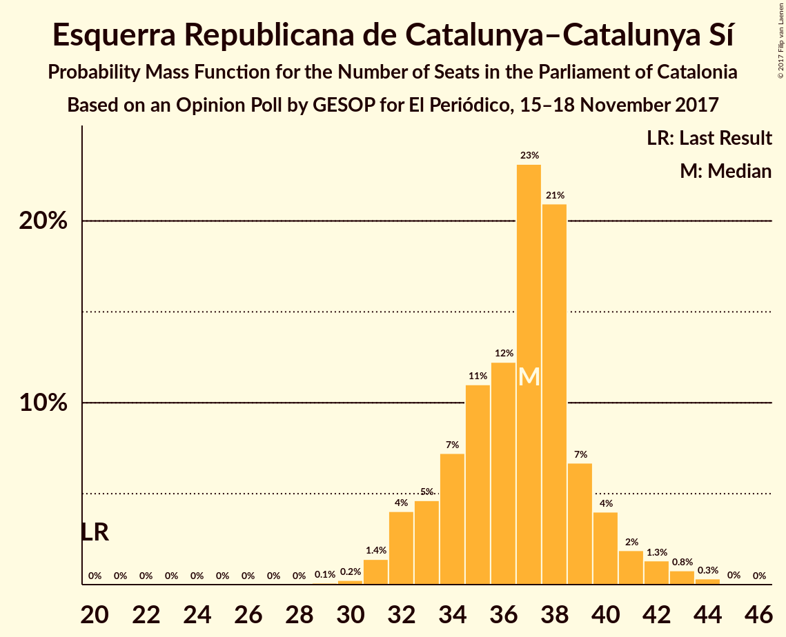
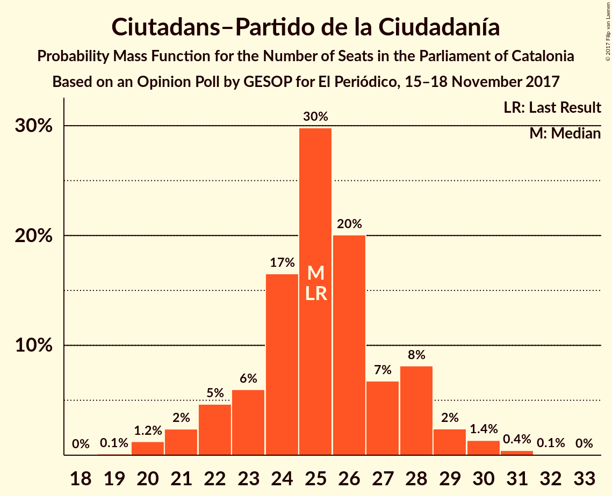
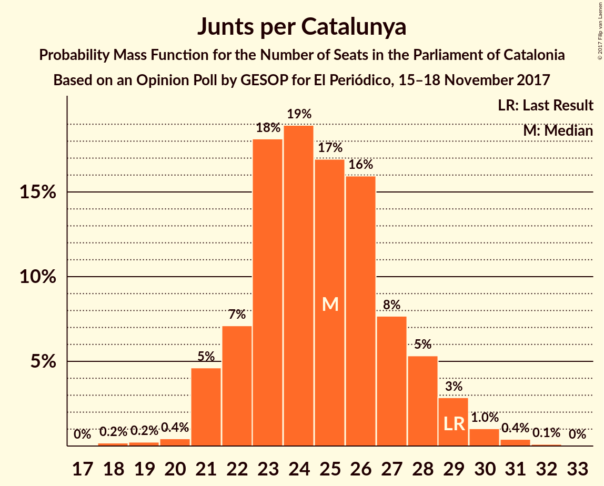

# Opinion Poll by GESOP for El Periódico, 15–18 November 2017

<a href="#voting-intentions">Voting Intentions</a> | <a href="#seats">Seats</a> | <a href="#coalitions">Coalitions</a> | <a href="#technical-information">Technical Information</a>

## Voting Intentions

### Confidence Intervals

| Party | Last Result | Poll Result | 80% Confidence Interval | 90% Confidence Interval | 95% Confidence Interval | 99% Confidence Interval |
|:-----:|:-----------:|:-----------:|:-----------------------:|:-----------------------:|:-----------------------:|:-----------------------:|
| Esquerra Republicana de Catalunya–Catalunya Sí | 39.6% | 23.9% | 22.0–25.9% |21.5–26.5% |21.0–27.0% |20.2–27.9% |
| Ciutadans–Partido de la Ciudadanía | 17.9% | 18.6% | 16.9–20.5% |16.5–21.0% |16.1–21.5% |15.3–22.4% |
| Partit dels Socialistes de Catalunya (PSC-PSOE) | 12.7% | 18.1% | 16.5–20.0% |16.0–20.5% |15.6–21.0% |14.8–21.9% |
| Junts per Catalunya | 39.6% | 16.5% | 14.9–18.3% |14.5–18.8% |14.1–19.2% |13.4–20.1% |
| Catalunya en Comú | 8.9% | 8.6% | 7.5–10.0% |7.1–10.4% |6.9–10.8% |6.4–11.5% |
| Candidatura d’Unitat Popular | 8.2% | 6.2% | 5.3–7.5% |5.0–7.8% |4.8–8.2% |4.3–8.8% |
| Partit Popular | 8.5% | 5.8% | 4.8–7.0% |4.6–7.3% |4.3–7.6% |3.9–8.2% |

*Note:* The poll result column reflects the actual value used in the calculations. Published results may vary slightly, and in addition be rounded to fewer digits.

## Seats

### Confidence Intervals

| Party | Last Result | Median | 80% Confidence Interval | 90% Confidence Interval | 95% Confidence Interval | 99% Confidence Interval |
|:-----:|:-----------:|:------:|:-----------------------:|:-----------------------:|:-----------------------:|:-----------------------:|
| <a href="#esquerra-republicana-de-catalunya–catalunya-sí">Esquerra Republicana de Catalunya–Catalunya Sí</a> | 20 | 37 | 33–39 |32–40 |32–41 |31–43 |
| <a href="#ciutadans–partido-de-la-ciudadanía">Ciutadans–Partido de la Ciudadanía</a> | 25 | 25 | 23–28 |22–28 |21–29 |20–31 |
| <a href="#partit-dels-socialistes-de-catalunya-(psc-psoe)">Partit dels Socialistes de Catalunya (PSC-PSOE)</a> | 16 | 24 | 22–26 |21–27 |21–29 |19–30 |
| <a href="#junts-per-catalunya">Junts per Catalunya</a> | 29 | 25 | 22–27 |21–28 |21–29 |20–31 |
| <a href="#catalunya-en-comú">Catalunya en Comú</a> | 11 | 9 | 8–12 |8–12 |8–13 |6–14 |
| <a href="#candidatura-d’unitat-popular">Candidatura d’Unitat Popular</a> | 10 | 8 | 7–9 |5–10 |5–10 |3–11 |
| <a href="#partit-popular">Partit Popular</a> | 11 | 6 | 5–9 |5–9 |4–10 |3–10 |

### Esquerra Republicana de Catalunya–Catalunya Sí

*For a full overview of the results for this party, see the [Esquerra Republicana de Catalunya–Catalunya Sí](party-esquerrarepublicanadecatalunya–catalunyasí.html) page.*

| Number of Seats | Probability | Accumulated | Special Marks |
|:---------------:|:-----------:|:-----------:|:-------------:|
| 20 | 0% | 100% | Last Result |
| 21 | 0% | 100% |  |
| 22 | 0% | 100% |  |
| 23 | 0% | 100% |  |
| 24 | 0% | 100% |  |
| 25 | 0% | 100% |  |
| 26 | 0% | 100% |  |
| 27 | 0% | 100% |  |
| 28 | 0% | 100% |  |
| 29 | 0.1% | 100% |  |
| 30 | 0.3% | 99.9% |  |
| 31 | 1.4% | 99.6% |  |
| 32 | 4% | 98% |  |
| 33 | 5% | 94% |  |
| 34 | 7% | 90% |  |
| 35 | 11% | 83% |  |
| 36 | 13% | 72% |  |
| 37 | 23% | 59% | Median |
| 38 | 21% | 36% |  |
| 39 | 7% | 15% |  |
| 40 | 4% | 8% |  |
| 41 | 2% | 4% |  |
| 42 | 1.3% | 2% |  |
| 43 | 0.8% | 1.2% |  |
| 44 | 0.3% | 0.4% |  |
| 45 | 0% | 0% |  |

### Ciutadans–Partido de la Ciudadanía

*For a full overview of the results for this party, see the [Ciutadans–Partido de la Ciudadanía](party-ciutadans–partidodelaciudadanía.html) page.*

| Number of Seats | Probability | Accumulated | Special Marks |
|:---------------:|:-----------:|:-----------:|:-------------:|
| 19 | 0.1% | 100% |  |
| 20 | 1.3% | 99.9% |  |
| 21 | 2% | 98.6% |  |
| 22 | 5% | 96% |  |
| 23 | 6% | 92% |  |
| 24 | 17% | 86% |  |
| 25 | 30% | 69% | Last Result, Median |
| 26 | 19% | 39% |  |
| 27 | 7% | 20% |  |
| 28 | 8% | 12% |  |
| 29 | 2% | 4% |  |
| 30 | 1.3% | 2% |  |
| 31 | 0.4% | 0.5% |  |
| 32 | 0.1% | 0.1% |  |
| 33 | 0% | 0% |  |

### Partit dels Socialistes de Catalunya (PSC-PSOE)

*For a full overview of the results for this party, see the [Partit dels Socialistes de Catalunya (PSC-PSOE)](party-partitdelssocialistesdecatalunyapsc-psoe.html) page.*

| Number of Seats | Probability | Accumulated | Special Marks |
|:---------------:|:-----------:|:-----------:|:-------------:|
| 16 | 0% | 100% | Last Result |
| 17 | 0.1% | 100% |  |
| 18 | 0.1% | 99.9% |  |
| 19 | 0.6% | 99.8% |  |
| 20 | 1.2% | 99.2% |  |
| 21 | 3% | 98% |  |
| 22 | 7% | 95% |  |
| 23 | 23% | 88% |  |
| 24 | 30% | 66% | Median |
| 25 | 21% | 36% |  |
| 26 | 6% | 15% |  |
| 27 | 5% | 9% |  |
| 28 | 2% | 5% |  |
| 29 | 2% | 3% |  |
| 30 | 0.4% | 0.5% |  |
| 31 | 0.1% | 0.1% |  |
| 32 | 0% | 0% |  |

### Junts per Catalunya

*For a full overview of the results for this party, see the [Junts per Catalunya](party-juntspercatalunya.html) page.*

| Number of Seats | Probability | Accumulated | Special Marks |
|:---------------:|:-----------:|:-----------:|:-------------:|
| 18 | 0.2% | 100% |  |
| 19 | 0.2% | 99.8% |  |
| 20 | 0.4% | 99.6% |  |
| 21 | 5% | 99.1% |  |
| 22 | 7% | 95% |  |
| 23 | 18% | 88% |  |
| 24 | 19% | 69% |  |
| 25 | 17% | 50% | Median |
| 26 | 16% | 34% |  |
| 27 | 8% | 17% |  |
| 28 | 5% | 10% |  |
| 29 | 3% | 4% | Last Result |
| 30 | 1.0% | 2% |  |
| 31 | 0.4% | 0.5% |  |
| 32 | 0.1% | 0.1% |  |
| 33 | 0% | 0% |  |

### Catalunya en Comú

*For a full overview of the results for this party, see the [Catalunya en Comú](party-catalunyaencomú.html) page.*

| Number of Seats | Probability | Accumulated | Special Marks |
|:---------------:|:-----------:|:-----------:|:-------------:|
| 5 | 0.1% | 100% |  |
| 6 | 0.6% | 99.9% |  |
| 7 | 2% | 99.3% |  |
| 8 | 17% | 98% |  |
| 9 | 32% | 81% | Median |
| 10 | 10% | 49% |  |
| 11 | 26% | 40% | Last Result |
| 12 | 10% | 13% |  |
| 13 | 1.4% | 3% |  |
| 14 | 1.3% | 2% |  |
| 15 | 0.2% | 0.2% |  |
| 16 | 0% | 0% |  |

### Candidatura d’Unitat Popular

*For a full overview of the results for this party, see the [Candidatura d’Unitat Popular](party-candidaturad’unitatpopular.html) page.*

| Number of Seats | Probability | Accumulated | Special Marks |
|:---------------:|:-----------:|:-----------:|:-------------:|
| 3 | 0.6% | 100% |  |
| 4 | 0.4% | 99.4% |  |
| 5 | 5% | 98.9% |  |
| 6 | 4% | 94% |  |
| 7 | 7% | 90% |  |
| 8 | 47% | 83% | Median |
| 9 | 30% | 36% |  |
| 10 | 6% | 6% | Last Result |
| 11 | 0.2% | 0.5% |  |
| 12 | 0.3% | 0.3% |  |
| 13 | 0% | 0% |  |

### Partit Popular

*For a full overview of the results for this party, see the [Partit Popular](party-partitpopular.html) page.*

| Number of Seats | Probability | Accumulated | Special Marks |
|:---------------:|:-----------:|:-----------:|:-------------:|
| 3 | 2% | 100% |  |
| 4 | 1.2% | 98% |  |
| 5 | 25% | 97% |  |
| 6 | 38% | 72% | Median |
| 7 | 11% | 35% |  |
| 8 | 11% | 24% |  |
| 9 | 9% | 13% |  |
| 10 | 3% | 3% |  |
| 11 | 0.1% | 0.2% | Last Result |
| 12 | 0.1% | 0.1% |  |
| 13 | 0% | 0% |  |

## Coalitions

### Confidence Intervals

| Coalition | Last Result | Median | Majority? | 80% Confidence Interval | 90% Confidence Interval | 95% Confidence Interval | 99% Confidence Interval |
|:---------:|:-----------:|:------:|:---------:|:-----------------------:|:-----------------------:|:-----------------------:|:-----------------------:|
| Esquerra Republicana de Catalunya–Catalunya Sí – Junts per Catalunya – Catalunya en Comú | 60 | 71 | 92% | 68–74 | 67–75 | 66–76 | 64–78 |
| Esquerra Republicana de Catalunya–Catalunya Sí – Junts per Catalunya – Candidatura d’Unitat Popular | 59 | 69 | 79% | 66–73 | 65–74 | 64–74 | 63–76 |
| Ciutadans–Partido de la Ciudadanía – Partit dels Socialistes de Catalunya (PSC-PSOE) – Catalunya en Comú – Partit Popular | 63 | 66 | 21% | 62–69 | 61–70 | 61–71 | 59–72 |
| Esquerra Republicana de Catalunya–Catalunya Sí – Junts per Catalunya | 49 | 61 | 1.0% | 58–65 | 57–66 | 56–66 | 55–68 |
| Ciutadans–Partido de la Ciudadanía – Partit dels Socialistes de Catalunya (PSC-PSOE) – Partit Popular | 52 | 56 | 0% | 53–59 | 52–60 | 51–61 | 49–63 |

### Esquerra Republicana de Catalunya–Catalunya Sí – Junts per Catalunya – Catalunya en Comú

| Number of Seats | Probability | Accumulated | Special Marks |
|:---------------:|:-----------:|:-----------:|:-------------:|
| 60 | 0% | 100% | Last Result |
| 61 | 0% | 100% |  |
| 62 | 0% | 100% |  |
| 63 | 0.2% | 99.9% |  |
| 64 | 0.4% | 99.7% |  |
| 65 | 1.0% | 99.3% |  |
| 66 | 2% | 98% |  |
| 67 | 4% | 96% |  |
| 68 | 7% | 92% | Majority |
| 69 | 10% | 85% |  |
| 70 | 12% | 74% |  |
| 71 | 16% | 63% | Median |
| 72 | 18% | 47% |  |
| 73 | 12% | 29% |  |
| 74 | 8% | 16% |  |
| 75 | 4% | 9% |  |
| 76 | 2% | 4% |  |
| 77 | 1.1% | 2% |  |
| 78 | 0.5% | 0.7% |  |
| 79 | 0.1% | 0.2% |  |
| 80 | 0% | 0.1% |  |
| 81 | 0% | 0% |  |

### Esquerra Republicana de Catalunya–Catalunya Sí – Junts per Catalunya – Candidatura d’Unitat Popular

| Number of Seats | Probability | Accumulated | Special Marks |
|:---------------:|:-----------:|:-----------:|:-------------:|
| 59 | 0% | 100% | Last Result |
| 60 | 0% | 100% |  |
| 61 | 0.1% | 100% |  |
| 62 | 0.3% | 99.9% |  |
| 63 | 1.0% | 99.5% |  |
| 64 | 2% | 98% |  |
| 65 | 3% | 97% |  |
| 66 | 5% | 93% |  |
| 67 | 9% | 88% |  |
| 68 | 14% | 79% | Majority |
| 69 | 16% | 64% |  |
| 70 | 15% | 48% | Median |
| 71 | 13% | 33% |  |
| 72 | 10% | 20% |  |
| 73 | 5% | 10% |  |
| 74 | 3% | 5% |  |
| 75 | 1.4% | 2% |  |
| 76 | 0.6% | 0.9% |  |
| 77 | 0.2% | 0.3% |  |
| 78 | 0.1% | 0.1% |  |
| 79 | 0% | 0% |  |

### Ciutadans–Partido de la Ciudadanía – Partit dels Socialistes de Catalunya (PSC-PSOE) – Catalunya en Comú – Partit Popular

| Number of Seats | Probability | Accumulated | Special Marks |
|:---------------:|:-----------:|:-----------:|:-------------:|
| 57 | 0.1% | 100% |  |
| 58 | 0.2% | 99.9% |  |
| 59 | 0.6% | 99.7% |  |
| 60 | 1.4% | 99.1% |  |
| 61 | 3% | 98% |  |
| 62 | 5% | 95% |  |
| 63 | 10% | 90% | Last Result |
| 64 | 13% | 80% | Median |
| 65 | 15% | 67% |  |
| 66 | 16% | 52% |  |
| 67 | 14% | 36% |  |
| 68 | 9% | 21% | Majority |
| 69 | 5% | 12% |  |
| 70 | 3% | 7% |  |
| 71 | 2% | 3% |  |
| 72 | 1.0% | 2% |  |
| 73 | 0.3% | 0.5% |  |
| 74 | 0.1% | 0.1% |  |
| 75 | 0% | 0% |  |

### Esquerra Republicana de Catalunya–Catalunya Sí – Junts per Catalunya

| Number of Seats | Probability | Accumulated | Special Marks |
|:---------------:|:-----------:|:-----------:|:-------------:|
| 49 | 0% | 100% | Last Result |
| 50 | 0% | 100% |  |
| 51 | 0% | 100% |  |
| 52 | 0% | 100% |  |
| 53 | 0.1% | 100% |  |
| 54 | 0.4% | 99.9% |  |
| 55 | 1.0% | 99.5% |  |
| 56 | 2% | 98% |  |
| 57 | 4% | 97% |  |
| 58 | 6% | 93% |  |
| 59 | 10% | 87% |  |
| 60 | 15% | 78% |  |
| 61 | 17% | 63% |  |
| 62 | 14% | 45% | Median |
| 63 | 13% | 32% |  |
| 64 | 9% | 19% |  |
| 65 | 5% | 10% |  |
| 66 | 3% | 5% |  |
| 67 | 1.5% | 2% |  |
| 68 | 0.6% | 1.0% | Majority |
| 69 | 0.2% | 0.3% |  |
| 70 | 0.1% | 0.1% |  |
| 71 | 0% | 0% |  |

### Ciutadans–Partido de la Ciudadanía – Partit dels Socialistes de Catalunya (PSC-PSOE) – Partit Popular

| Number of Seats | Probability | Accumulated | Special Marks |
|:---------------:|:-----------:|:-----------:|:-------------:|
| 48 | 0.1% | 100% |  |
| 49 | 0.5% | 99.8% |  |
| 50 | 1.0% | 99.4% |  |
| 51 | 2% | 98% |  |
| 52 | 5% | 96% | Last Result |
| 53 | 8% | 92% |  |
| 54 | 15% | 84% |  |
| 55 | 18% | 68% | Median |
| 56 | 14% | 51% |  |
| 57 | 12% | 36% |  |
| 58 | 10% | 24% |  |
| 59 | 7% | 14% |  |
| 60 | 4% | 7% |  |
| 61 | 2% | 3% |  |
| 62 | 1.0% | 2% |  |
| 63 | 0.4% | 0.6% |  |
| 64 | 0.2% | 0.2% |  |
| 65 | 0% | 0.1% |  |
| 66 | 0% | 0% |  |

## Technical Information

### Opinion Poll

+ **Polling firm:** GESOP
+ **Commissioner(s):** El Periódico
+ **Fieldwork period:** 15–18 November 2017

### Calculations

+ **Sample size:** 800
+ **Simulations done:** 4,194,304
+ **Error estimate:** 0.62%

