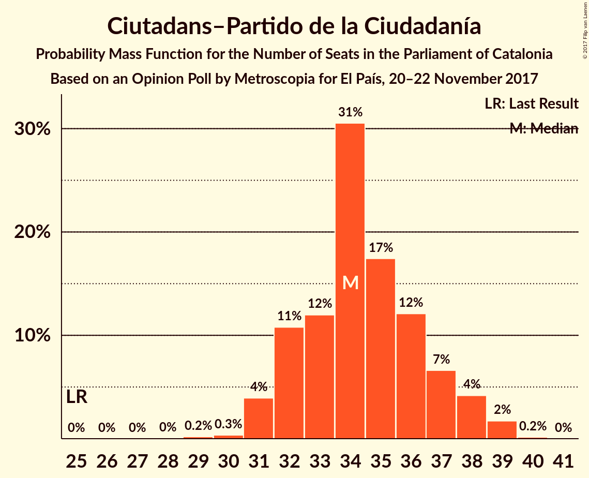
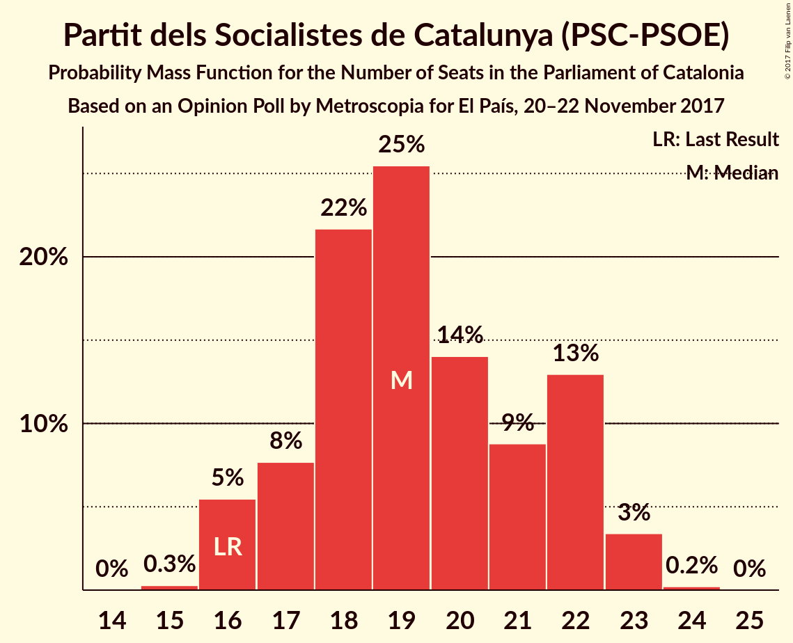
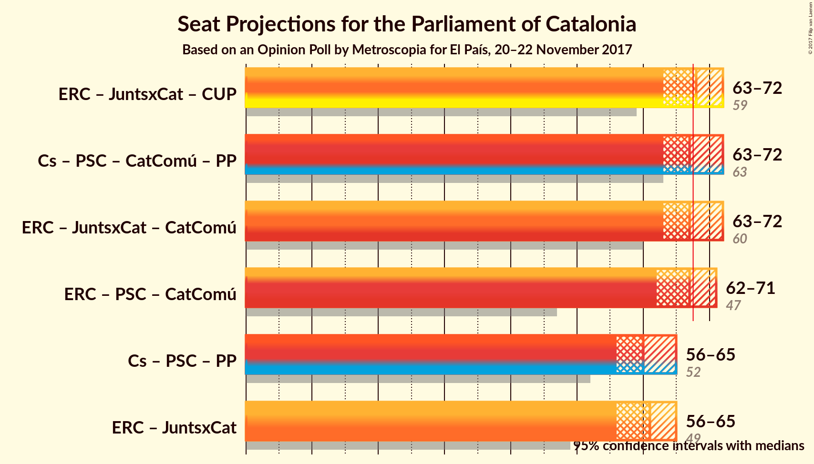

# Opinion Poll by Metroscopia for El País, 20–22 November 2017

<a href="#voting-intentions">Voting Intentions</a> | <a href="#seats">Seats</a> | <a href="#coalitions">Coalitions</a> | <a href="#technical-information">Technical Information</a>

## Voting Intentions

### Confidence Intervals

| Party | Last Result | Poll Result | 80% Confidence Interval | 90% Confidence Interval | 95% Confidence Interval | 99% Confidence Interval |
|:-----:|:-----------:|:-----------:|:-----------------------:|:-----------------------:|:-----------------------:|:-----------------------:|
| Esquerra Republicana de Catalunya–Catalunya Sí | 39.6% | 26.5% | 25.1–28.1% |24.7–28.5% |24.3–28.9% |23.6–29.6% |
| Ciutadans–Partido de la Ciudadanía | 17.9% | 25.3% | 23.8–26.8% |23.4–27.2% |23.1–27.6% |22.4–28.3% |
| Partit dels Socialistes de Catalunya (PSC-PSOE) | 12.7% | 14.9% | 13.8–16.2% |13.5–16.6% |13.2–16.9% |12.7–17.5% |
| Junts per Catalunya | 39.6% | 13.6% | 12.5–14.8% |12.2–15.2% |11.9–15.5% |11.4–16.1% |
| Catalunya en Comú | 8.9% | 6.7% | 5.9–7.6% |5.7–7.8% |5.5–8.1% |5.1–8.6% |
| Candidatura d’Unitat Popular | 8.2% | 5.9% | 5.2–6.8% |5.0–7.0% |4.8–7.3% |4.5–7.7% |
| Partit Popular | 8.5% | 5.8% | 5.1–6.7% |4.9–7.0% |4.7–7.2% |4.4–7.6% |

*Note:* The poll result column reflects the actual value used in the calculations. Published results may vary slightly, and in addition be rounded to fewer digits.

## Seats

### Confidence Intervals

| Party | Last Result | Median | 80% Confidence Interval | 90% Confidence Interval | 95% Confidence Interval | 99% Confidence Interval |
|:-----:|:-----------:|:------:|:-----------------------:|:-----------------------:|:-----------------------:|:-----------------------:|
| <a href="#esquerra-republicana-de-catalunya–catalunya-sí">Esquerra Republicana de Catalunya–Catalunya Sí</a> | 20 | 41 | 38–44 |37–44 |37–45 |37–46 |
| <a href="#ciutadans–partido-de-la-ciudadanía">Ciutadans–Partido de la Ciudadanía</a> | 25 | 34 | 32–37 |31–38 |31–38 |30–39 |
| <a href="#partit-dels-socialistes-de-catalunya-(psc-psoe)">Partit dels Socialistes de Catalunya (PSC-PSOE)</a> | 16 | 19 | 17–22 |16–23 |16–23 |16–23 |
| <a href="#junts-per-catalunya">Junts per Catalunya</a> | 29 | 19 | 18–22 |17–23 |17–23 |17–24 |
| <a href="#catalunya-en-comú">Catalunya en Comú</a> | 11 | 7 | 5–8 |5–9 |5–9 |5–9 |
| <a href="#candidatura-d’unitat-popular">Candidatura d’Unitat Popular</a> | 10 | 8 | 5–8 |5–9 |5–9 |4–9 |
| <a href="#partit-popular">Partit Popular</a> | 11 | 6 | 5–9 |5–9 |5–9 |4–10 |

### Esquerra Republicana de Catalunya–Catalunya Sí

*For a full overview of the results for this party, see the [Esquerra Republicana de Catalunya–Catalunya Sí](party-esquerrarepublicanadecatalunya–catalunyasí.html) page.*

| Number of Seats | Probability | Accumulated | Special Marks |
|:---------------:|:-----------:|:-----------:|:-------------:|
| 20 | 0% | 100% | Last Result |
| 21 | 0% | 100% |  |
| 22 | 0% | 100% |  |
| 23 | 0% | 100% |  |
| 24 | 0% | 100% |  |
| 25 | 0% | 100% |  |
| 26 | 0% | 100% |  |
| 27 | 0% | 100% |  |
| 28 | 0% | 100% |  |
| 29 | 0% | 100% |  |
| 30 | 0% | 100% |  |
| 31 | 0% | 100% |  |
| 32 | 0% | 100% |  |
| 33 | 0% | 100% |  |
| 34 | 0% | 100% |  |
| 35 | 0.1% | 100% |  |
| 36 | 0.3% | 99.9% |  |
| 37 | 8% | 99.5% |  |
| 38 | 16% | 91% |  |
| 39 | 13% | 75% |  |
| 40 | 11% | 62% |  |
| 41 | 8% | 51% | Median |
| 42 | 6% | 43% |  |
| 43 | 26% | 36% |  |
| 44 | 8% | 11% |  |
| 45 | 2% | 3% |  |
| 46 | 0.6% | 0.7% |  |
| 47 | 0% | 0.1% |  |
| 48 | 0% | 0% |  |

### Ciutadans–Partido de la Ciudadanía

*For a full overview of the results for this party, see the [Ciutadans–Partido de la Ciudadanía](party-ciutadans–partidodelaciudadanía.html) page.*

| Number of Seats | Probability | Accumulated | Special Marks |
|:---------------:|:-----------:|:-----------:|:-------------:|
| 25 | 0% | 100% | Last Result |
| 26 | 0% | 100% |  |
| 27 | 0% | 100% |  |
| 28 | 0% | 100% |  |
| 29 | 0.1% | 100% |  |
| 30 | 0.4% | 99.9% |  |
| 31 | 5% | 99.5% |  |
| 32 | 10% | 95% |  |
| 33 | 5% | 85% |  |
| 34 | 39% | 79% | Median |
| 35 | 8% | 40% |  |
| 36 | 10% | 32% |  |
| 37 | 13% | 21% |  |
| 38 | 7% | 9% |  |
| 39 | 1.2% | 1.3% |  |
| 40 | 0.2% | 0.2% |  |
| 41 | 0% | 0% |  |

### Partit dels Socialistes de Catalunya (PSC-PSOE)

*For a full overview of the results for this party, see the [Partit dels Socialistes de Catalunya (PSC-PSOE)](party-partitdelssocialistesdecatalunyapsc-psoe.html) page.*

| Number of Seats | Probability | Accumulated | Special Marks |
|:---------------:|:-----------:|:-----------:|:-------------:|
| 15 | 0.3% | 100% |  |
| 16 | 7% | 99.7% | Last Result |
| 17 | 7% | 92% |  |
| 18 | 30% | 86% |  |
| 19 | 22% | 56% | Median |
| 20 | 10% | 34% |  |
| 21 | 9% | 24% |  |
| 22 | 8% | 15% |  |
| 23 | 6% | 7% |  |
| 24 | 0.2% | 0.2% |  |
| 25 | 0% | 0% |  |

### Junts per Catalunya

*For a full overview of the results for this party, see the [Junts per Catalunya](party-juntspercatalunya.html) page.*

| Number of Seats | Probability | Accumulated | Special Marks |
|:---------------:|:-----------:|:-----------:|:-------------:|
| 15 | 0.2% | 100% |  |
| 16 | 0.3% | 99.8% |  |
| 17 | 9% | 99.5% |  |
| 18 | 31% | 91% |  |
| 19 | 10% | 60% | Median |
| 20 | 12% | 50% |  |
| 21 | 18% | 37% |  |
| 22 | 12% | 20% |  |
| 23 | 7% | 7% |  |
| 24 | 0.5% | 0.6% |  |
| 25 | 0.1% | 0.1% |  |
| 26 | 0% | 0% |  |
| 27 | 0% | 0% |  |
| 28 | 0% | 0% |  |
| 29 | 0% | 0% | Last Result |

### Catalunya en Comú

*For a full overview of the results for this party, see the [Catalunya en Comú](party-catalunyaencomú.html) page.*

| Number of Seats | Probability | Accumulated | Special Marks |
|:---------------:|:-----------:|:-----------:|:-------------:|
| 4 | 0.2% | 100% |  |
| 5 | 12% | 99.8% |  |
| 6 | 28% | 88% |  |
| 7 | 16% | 60% | Median |
| 8 | 39% | 44% |  |
| 9 | 5% | 6% |  |
| 10 | 0% | 0.1% |  |
| 11 | 0.1% | 0.1% | Last Result |
| 12 | 0% | 0% |  |

### Candidatura d’Unitat Popular

*For a full overview of the results for this party, see the [Candidatura d’Unitat Popular](party-candidaturad’unitatpopular.html) page.*

| Number of Seats | Probability | Accumulated | Special Marks |
|:---------------:|:-----------:|:-----------:|:-------------:|
| 3 | 0.3% | 100% |  |
| 4 | 0.4% | 99.7% |  |
| 5 | 14% | 99.3% |  |
| 6 | 6% | 85% |  |
| 7 | 10% | 78% |  |
| 8 | 58% | 68% | Median |
| 9 | 10% | 10% |  |
| 10 | 0.3% | 0.3% | Last Result |
| 11 | 0% | 0% |  |

### Partit Popular

*For a full overview of the results for this party, see the [Partit Popular](party-partitpopular.html) page.*

| Number of Seats | Probability | Accumulated | Special Marks |
|:---------------:|:-----------:|:-----------:|:-------------:|
| 3 | 0.4% | 100% |  |
| 4 | 0.4% | 99.6% |  |
| 5 | 18% | 99.2% |  |
| 6 | 44% | 82% | Median |
| 7 | 18% | 38% |  |
| 8 | 8% | 20% |  |
| 9 | 11% | 12% |  |
| 10 | 0.7% | 0.7% |  |
| 11 | 0% | 0% | Last Result |

## Coalitions

### Confidence Intervals

| Coalition | Last Result | Median | Majority? | 80% Confidence Interval | 90% Confidence Interval | 95% Confidence Interval | 99% Confidence Interval |
|:---------:|:-----------:|:------:|:---------:|:-----------------------:|:-----------------------:|:-----------------------:|:-----------------------:|
| Esquerra Republicana de Catalunya–Catalunya Sí – Junts per Catalunya – Candidatura d’Unitat Popular | 59 | 68 | 52% | 64–71 | 64–72 | 63–73 | 62–73 |
| Esquerra Republicana de Catalunya–Catalunya Sí – Junts per Catalunya – Catalunya en Comú | 60 | 68 | 52% | 64–70 | 63–71 | 63–72 | 62–74 |
| Ciutadans–Partido de la Ciudadanía – Partit dels Socialistes de Catalunya (PSC-PSOE) – Catalunya en Comú – Partit Popular | 63 | 67 | 48% | 64–71 | 63–71 | 62–72 | 62–73 |
| Esquerra Republicana de Catalunya–Catalunya Sí – Partit dels Socialistes de Catalunya (PSC-PSOE) – Catalunya en Comú | 47 | 67 | 47% | 63–70 | 62–71 | 62–72 | 61–72 |
| Esquerra Republicana de Catalunya–Catalunya Sí – Junts per Catalunya | 49 | 61 | 0% | 56–63 | 56–65 | 56–65 | 55–67 |
| Ciutadans–Partido de la Ciudadanía – Partit dels Socialistes de Catalunya (PSC-PSOE) – Partit Popular | 52 | 60 | 0.1% | 58–64 | 56–64 | 56–64 | 55–66 |

### Esquerra Republicana de Catalunya–Catalunya Sí – Junts per Catalunya – Candidatura d’Unitat Popular

| Number of Seats | Probability | Accumulated | Special Marks |
|:---------------:|:-----------:|:-----------:|:-------------:|
| 59 | 0% | 100% | Last Result |
| 60 | 0.1% | 100% |  |
| 61 | 0.1% | 99.9% |  |
| 62 | 0.3% | 99.8% |  |
| 63 | 2% | 99.5% |  |
| 64 | 8% | 97% |  |
| 65 | 6% | 89% |  |
| 66 | 10% | 83% |  |
| 67 | 21% | 73% |  |
| 68 | 14% | 52% | Median, Majority |
| 69 | 18% | 39% |  |
| 70 | 9% | 20% |  |
| 71 | 4% | 11% |  |
| 72 | 3% | 7% |  |
| 73 | 4% | 4% |  |
| 74 | 0.1% | 0.3% |  |
| 75 | 0.1% | 0.2% |  |
| 76 | 0% | 0% |  |

### Esquerra Republicana de Catalunya–Catalunya Sí – Junts per Catalunya – Catalunya en Comú

| Number of Seats | Probability | Accumulated | Special Marks |
|:---------------:|:-----------:|:-----------:|:-------------:|
| 60 | 0.2% | 100% | Last Result |
| 61 | 0.1% | 99.8% |  |
| 62 | 0.6% | 99.7% |  |
| 63 | 7% | 99.1% |  |
| 64 | 7% | 92% |  |
| 65 | 13% | 85% |  |
| 66 | 9% | 72% |  |
| 67 | 11% | 63% | Median |
| 68 | 15% | 52% | Majority |
| 69 | 17% | 37% |  |
| 70 | 10% | 20% |  |
| 71 | 6% | 10% |  |
| 72 | 3% | 4% |  |
| 73 | 0.4% | 1.1% |  |
| 74 | 0.6% | 0.7% |  |
| 75 | 0.1% | 0.1% |  |
| 76 | 0% | 0% |  |

### Ciutadans–Partido de la Ciudadanía – Partit dels Socialistes de Catalunya (PSC-PSOE) – Catalunya en Comú – Partit Popular

| Number of Seats | Probability | Accumulated | Special Marks |
|:---------------:|:-----------:|:-----------:|:-------------:|
| 60 | 0.1% | 100% |  |
| 61 | 0.1% | 99.8% |  |
| 62 | 4% | 99.7% |  |
| 63 | 3% | 96% | Last Result |
| 64 | 4% | 93% |  |
| 65 | 9% | 89% |  |
| 66 | 18% | 80% | Median |
| 67 | 14% | 61% |  |
| 68 | 21% | 48% | Majority |
| 69 | 10% | 27% |  |
| 70 | 6% | 17% |  |
| 71 | 8% | 11% |  |
| 72 | 2% | 3% |  |
| 73 | 0.3% | 0.5% |  |
| 74 | 0.1% | 0.2% |  |
| 75 | 0.1% | 0.1% |  |
| 76 | 0% | 0% |  |

### Esquerra Republicana de Catalunya–Catalunya Sí – Partit dels Socialistes de Catalunya (PSC-PSOE) – Catalunya en Comú

| Number of Seats | Probability | Accumulated | Special Marks |
|:---------------:|:-----------:|:-----------:|:-------------:|
| 47 | 0% | 100% | Last Result |
| 48 | 0% | 100% |  |
| 49 | 0% | 100% |  |
| 50 | 0% | 100% |  |
| 51 | 0% | 100% |  |
| 52 | 0% | 100% |  |
| 53 | 0% | 100% |  |
| 54 | 0% | 100% |  |
| 55 | 0% | 100% |  |
| 56 | 0% | 100% |  |
| 57 | 0% | 100% |  |
| 58 | 0% | 100% |  |
| 59 | 0% | 100% |  |
| 60 | 0.3% | 100% |  |
| 61 | 1.3% | 99.6% |  |
| 62 | 4% | 98% |  |
| 63 | 6% | 94% |  |
| 64 | 11% | 88% |  |
| 65 | 5% | 76% |  |
| 66 | 18% | 71% |  |
| 67 | 6% | 54% | Median |
| 68 | 17% | 47% | Majority |
| 69 | 16% | 30% |  |
| 70 | 7% | 14% |  |
| 71 | 2% | 7% |  |
| 72 | 4% | 4% |  |
| 73 | 0.2% | 0.3% |  |
| 74 | 0.1% | 0.1% |  |
| 75 | 0% | 0% |  |

### Esquerra Republicana de Catalunya–Catalunya Sí – Junts per Catalunya

| Number of Seats | Probability | Accumulated | Special Marks |
|:---------------:|:-----------:|:-----------:|:-------------:|
| 49 | 0% | 100% | Last Result |
| 50 | 0% | 100% |  |
| 51 | 0% | 100% |  |
| 52 | 0% | 100% |  |
| 53 | 0% | 100% |  |
| 54 | 0.3% | 100% |  |
| 55 | 0.6% | 99.7% |  |
| 56 | 10% | 99.1% |  |
| 57 | 2% | 89% |  |
| 58 | 6% | 87% |  |
| 59 | 16% | 82% |  |
| 60 | 15% | 66% | Median |
| 61 | 21% | 51% |  |
| 62 | 13% | 29% |  |
| 63 | 8% | 16% |  |
| 64 | 3% | 9% |  |
| 65 | 4% | 6% |  |
| 66 | 0.9% | 2% |  |
| 67 | 0.6% | 0.7% |  |
| 68 | 0% | 0% | Majority |

### Ciutadans–Partido de la Ciudadanía – Partit dels Socialistes de Catalunya (PSC-PSOE) – Partit Popular

| Number of Seats | Probability | Accumulated | Special Marks |
|:---------------:|:-----------:|:-----------:|:-------------:|
| 52 | 0% | 100% | Last Result |
| 53 | 0.1% | 100% |  |
| 54 | 0.2% | 99.9% |  |
| 55 | 2% | 99.7% |  |
| 56 | 5% | 98% |  |
| 57 | 3% | 93% |  |
| 58 | 17% | 91% |  |
| 59 | 15% | 74% | Median |
| 60 | 17% | 59% |  |
| 61 | 10% | 42% |  |
| 62 | 10% | 32% |  |
| 63 | 12% | 22% |  |
| 64 | 8% | 11% |  |
| 65 | 1.3% | 2% |  |
| 66 | 0.8% | 1.1% |  |
| 67 | 0.2% | 0.3% |  |
| 68 | 0.1% | 0.1% | Majority |
| 69 | 0% | 0% |  |

## Technical Information

### Opinion Poll

+ **Polling firm:** Metroscopia
+ **Commissioner(s):** El País
+ **Fieldwork period:** 20–22 November 2017

### Calculations

+ **Sample size:** 1440
+ **Simulations done:** 65,536
+ **Error estimate:** 1.20%

