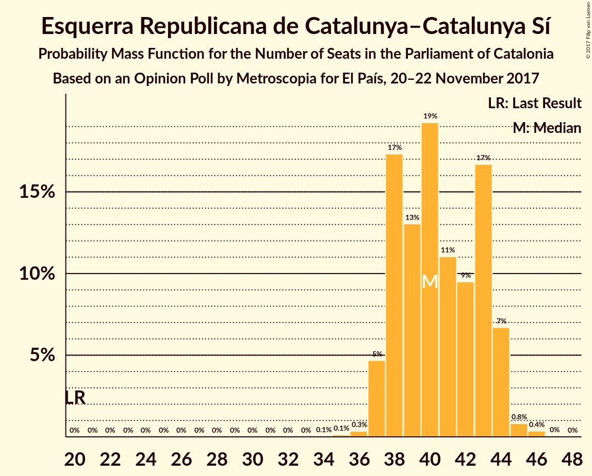
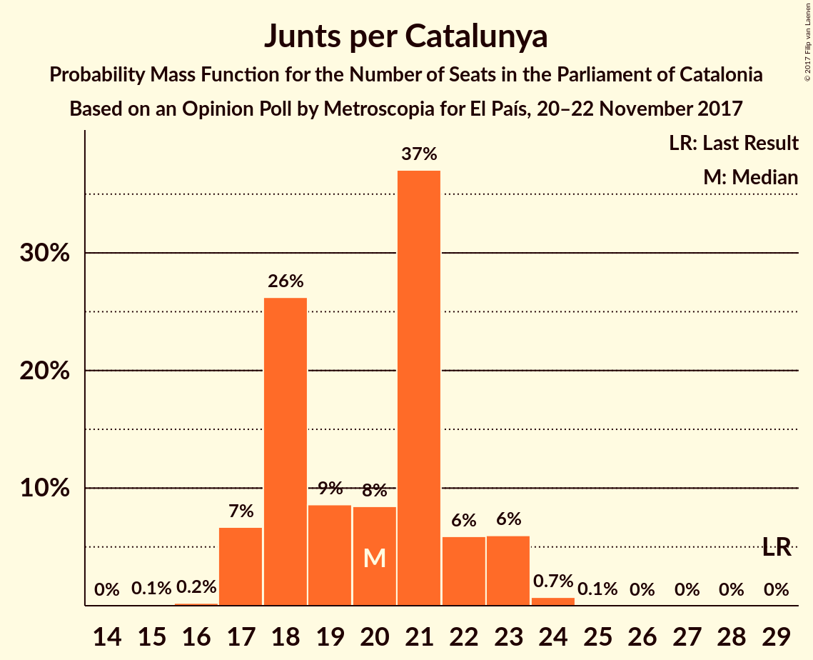
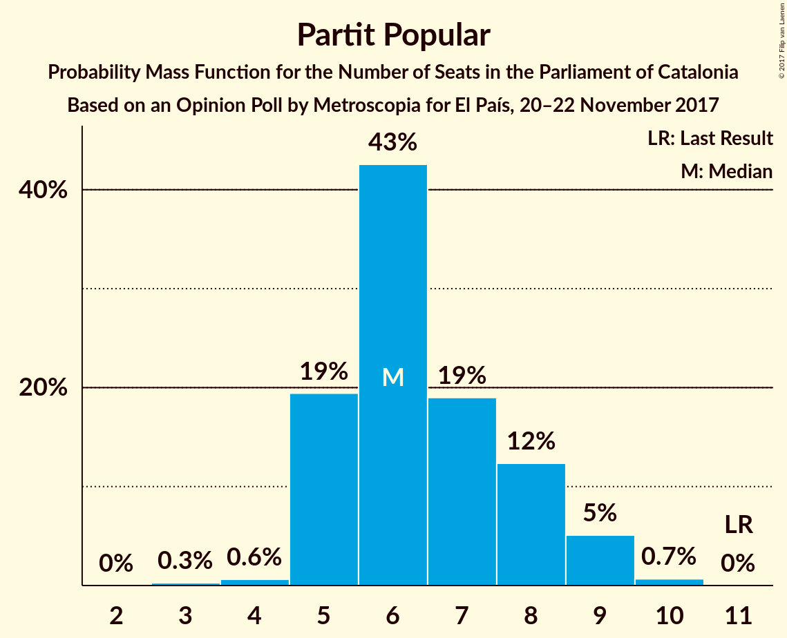

# Opinion Poll by Metroscopia for El País, 20–22 November 2017

<a href="#voting-intentions">Voting Intentions</a> | <a href="#seats">Seats</a> | <a href="#coalitions">Coalitions</a> | <a href="#technical-information">Technical Information</a>

## Voting Intentions

### Confidence Intervals

| Party | Last Result | Poll Result | 80% Confidence Interval | 90% Confidence Interval | 95% Confidence Interval | 99% Confidence Interval |
|:-----:|:-----------:|:-----------:|:-----------------------:|:-----------------------:|:-----------------------:|:-----------------------:|
| Esquerra Republicana de Catalunya–Catalunya Sí | 39.6% | 26.5% | 25.1–28.1% |24.7–28.5% |24.3–28.9% |23.6–29.6% |
| Ciutadans–Partido de la Ciudadanía | 17.9% | 25.3% | 23.8–26.8% |23.4–27.2% |23.1–27.6% |22.4–28.3% |
| Partit dels Socialistes de Catalunya (PSC-PSOE) | 12.7% | 14.9% | 13.8–16.2% |13.5–16.6% |13.2–16.9% |12.7–17.5% |
| Junts per Catalunya | 39.6% | 13.6% | 12.5–14.8% |12.2–15.2% |11.9–15.5% |11.4–16.1% |
| Catalunya en Comú | 8.9% | 6.7% | 5.9–7.6% |5.7–7.8% |5.5–8.1% |5.1–8.6% |
| Candidatura d’Unitat Popular | 8.2% | 5.9% | 5.2–6.8% |5.0–7.0% |4.8–7.3% |4.5–7.7% |
| Partit Popular | 8.5% | 5.8% | 5.1–6.7% |4.9–7.0% |4.7–7.2% |4.4–7.6% |

*Note:* The poll result column reflects the actual value used in the calculations. Published results may vary slightly, and in addition be rounded to fewer digits.

## Seats

### Confidence Intervals

| Party | Last Result | Median | 80% Confidence Interval | 90% Confidence Interval | 95% Confidence Interval | 99% Confidence Interval |
|:-----:|:-----------:|:------:|:-----------------------:|:-----------------------:|:-----------------------:|:-----------------------:|
| <a href="#esquerra-republicana-de-catalunya–catalunya-sí">Esquerra Republicana de Catalunya–Catalunya Sí</a> | 20 | 40 | 38–43 |37–44 |37–44 |36–45 |
| <a href="#ciutadans–partido-de-la-ciudadanía">Ciutadans–Partido de la Ciudadanía</a> | 25 | 34 | 32–37 |32–38 |31–38 |30–39 |
| <a href="#partit-dels-socialistes-de-catalunya-(psc-psoe)">Partit dels Socialistes de Catalunya (PSC-PSOE)</a> | 16 | 19 | 17–22 |16–22 |16–23 |16–23 |
| <a href="#junts-per-catalunya">Junts per Catalunya</a> | 29 | 20 | 18–22 |17–23 |17–23 |16–24 |
| <a href="#catalunya-en-comú">Catalunya en Comú</a> | 11 | 7 | 6–8 |5–8 |5–9 |5–9 |
| <a href="#candidatura-d’unitat-popular">Candidatura d’Unitat Popular</a> | 10 | 8 | 5–9 |5–9 |5–9 |4–9 |
| <a href="#partit-popular">Partit Popular</a> | 11 | 6 | 5–8 |5–9 |5–9 |4–10 |

### Esquerra Republicana de Catalunya–Catalunya Sí

*For a full overview of the results for this party, see the [Esquerra Republicana de Catalunya–Catalunya Sí](party-esquerrarepublicanadecatalunya–catalunyasí.html) page.*

| Number of Seats | Probability | Accumulated | Special Marks |
|:---------------:|:-----------:|:-----------:|:-------------:|
| 20 | 0% | 100% | Last Result |
| 21 | 0% | 100% |  |
| 22 | 0% | 100% |  |
| 23 | 0% | 100% |  |
| 24 | 0% | 100% |  |
| 25 | 0% | 100% |  |
| 26 | 0% | 100% |  |
| 27 | 0% | 100% |  |
| 28 | 0% | 100% |  |
| 29 | 0% | 100% |  |
| 30 | 0% | 100% |  |
| 31 | 0% | 100% |  |
| 32 | 0% | 100% |  |
| 33 | 0% | 100% |  |
| 34 | 0% | 100% |  |
| 35 | 0.1% | 100% |  |
| 36 | 0.4% | 99.8% |  |
| 37 | 5% | 99.4% |  |
| 38 | 17% | 94% |  |
| 39 | 15% | 78% |  |
| 40 | 15% | 62% | Median |
| 41 | 10% | 47% |  |
| 42 | 10% | 37% |  |
| 43 | 19% | 27% |  |
| 44 | 6% | 8% |  |
| 45 | 0.8% | 1.2% |  |
| 46 | 0.4% | 0.4% |  |
| 47 | 0% | 0.1% |  |
| 48 | 0% | 0% |  |

### Ciutadans–Partido de la Ciudadanía

*For a full overview of the results for this party, see the [Ciutadans–Partido de la Ciudadanía](party-ciutadans–partidodelaciudadanía.html) page.*

| Number of Seats | Probability | Accumulated | Special Marks |
|:---------------:|:-----------:|:-----------:|:-------------:|
| 25 | 0% | 100% | Last Result |
| 26 | 0% | 100% |  |
| 27 | 0% | 100% |  |
| 28 | 0% | 100% |  |
| 29 | 0.2% | 100% |  |
| 30 | 0.3% | 99.8% |  |
| 31 | 4% | 99.5% |  |
| 32 | 11% | 95% |  |
| 33 | 11% | 85% |  |
| 34 | 31% | 73% | Median |
| 35 | 16% | 42% |  |
| 36 | 13% | 26% |  |
| 37 | 7% | 13% |  |
| 38 | 4% | 6% |  |
| 39 | 2% | 2% |  |
| 40 | 0.2% | 0.2% |  |
| 41 | 0% | 0% |  |

### Partit dels Socialistes de Catalunya (PSC-PSOE)

*For a full overview of the results for this party, see the [Partit dels Socialistes de Catalunya (PSC-PSOE)](party-partitdelssocialistesdecatalunyapsc-psoe.html) page.*

| Number of Seats | Probability | Accumulated | Special Marks |
|:---------------:|:-----------:|:-----------:|:-------------:|
| 15 | 0.3% | 100% |  |
| 16 | 5% | 99.7% | Last Result |
| 17 | 7% | 95% |  |
| 18 | 24% | 88% |  |
| 19 | 25% | 64% | Median |
| 20 | 13% | 39% |  |
| 21 | 9% | 26% |  |
| 22 | 13% | 17% |  |
| 23 | 4% | 4% |  |
| 24 | 0.2% | 0.2% |  |
| 25 | 0% | 0% |  |

### Junts per Catalunya

*For a full overview of the results for this party, see the [Junts per Catalunya](party-juntspercatalunya.html) page.*

| Number of Seats | Probability | Accumulated | Special Marks |
|:---------------:|:-----------:|:-----------:|:-------------:|
| 15 | 0.1% | 100% |  |
| 16 | 0.4% | 99.9% |  |
| 17 | 5% | 99.5% |  |
| 18 | 33% | 94% |  |
| 19 | 7% | 61% |  |
| 20 | 9% | 54% | Median |
| 21 | 29% | 45% |  |
| 22 | 7% | 15% |  |
| 23 | 7% | 8% |  |
| 24 | 0.6% | 0.7% |  |
| 25 | 0.1% | 0.1% |  |
| 26 | 0% | 0% |  |
| 27 | 0% | 0% |  |
| 28 | 0% | 0% |  |
| 29 | 0% | 0% | Last Result |

### Catalunya en Comú

*For a full overview of the results for this party, see the [Catalunya en Comú](party-catalunyaencomú.html) page.*

| Number of Seats | Probability | Accumulated | Special Marks |
|:---------------:|:-----------:|:-----------:|:-------------:|
| 4 | 0.2% | 100% |  |
| 5 | 10% | 99.8% |  |
| 6 | 29% | 90% |  |
| 7 | 26% | 62% | Median |
| 8 | 32% | 36% |  |
| 9 | 4% | 4% |  |
| 10 | 0.1% | 0.2% |  |
| 11 | 0.1% | 0.1% | Last Result |
| 12 | 0% | 0% |  |

### Candidatura d’Unitat Popular

*For a full overview of the results for this party, see the [Candidatura d’Unitat Popular](party-candidaturad’unitatpopular.html) page.*

| Number of Seats | Probability | Accumulated | Special Marks |
|:---------------:|:-----------:|:-----------:|:-------------:|
| 3 | 0.4% | 100% |  |
| 4 | 0.4% | 99.6% |  |
| 5 | 10% | 99.2% |  |
| 6 | 5% | 90% |  |
| 7 | 12% | 85% |  |
| 8 | 59% | 73% | Median |
| 9 | 14% | 14% |  |
| 10 | 0.4% | 0.4% | Last Result |
| 11 | 0% | 0% |  |

### Partit Popular

*For a full overview of the results for this party, see the [Partit Popular](party-partitpopular.html) page.*

| Number of Seats | Probability | Accumulated | Special Marks |
|:---------------:|:-----------:|:-----------:|:-------------:|
| 3 | 0.3% | 100% |  |
| 4 | 0.7% | 99.7% |  |
| 5 | 18% | 99.1% |  |
| 6 | 44% | 81% | Median |
| 7 | 20% | 37% |  |
| 8 | 11% | 18% |  |
| 9 | 6% | 7% |  |
| 10 | 0.7% | 0.7% |  |
| 11 | 0% | 0% | Last Result |

## Coalitions

### Confidence Intervals

| Coalition | Last Result | Median | Majority? | 80% Confidence Interval | 90% Confidence Interval | 95% Confidence Interval | 99% Confidence Interval |
|:---------:|:-----------:|:------:|:---------:|:-----------------------:|:-----------------------:|:-----------------------:|:-----------------------:|
| Esquerra Republicana de Catalunya–Catalunya Sí – Junts per Catalunya – Candidatura d’Unitat Popular | 59 | 68 | 60% | 65–71 | 64–72 | 63–73 | 62–74 |
| Esquerra Republicana de Catalunya–Catalunya Sí – Junts per Catalunya – Catalunya en Comú | 60 | 67 | 46% | 64–70 | 63–71 | 63–72 | 62–73 |
| Ciutadans–Partido de la Ciudadanía – Partit dels Socialistes de Catalunya (PSC-PSOE) – Catalunya en Comú – Partit Popular | 63 | 67 | 40% | 64–70 | 63–71 | 62–72 | 61–73 |
| Ciutadans–Partido de la Ciudadanía – Partit dels Socialistes de Catalunya (PSC-PSOE) – Partit Popular | 52 | 60 | 0.1% | 57–63 | 57–64 | 56–65 | 55–66 |
| Esquerra Republicana de Catalunya–Catalunya Sí – Junts per Catalunya | 49 | 60 | 0% | 58–63 | 56–64 | 56–65 | 55–66 |

### Esquerra Republicana de Catalunya–Catalunya Sí – Junts per Catalunya – Candidatura d’Unitat Popular

| Number of Seats | Probability | Accumulated | Special Marks |
|:---------------:|:-----------:|:-----------:|:-------------:|
| 59 | 0% | 100% | Last Result |
| 60 | 0.1% | 100% |  |
| 61 | 0.2% | 99.9% |  |
| 62 | 0.7% | 99.7% |  |
| 63 | 2% | 99.1% |  |
| 64 | 5% | 97% |  |
| 65 | 6% | 92% |  |
| 66 | 11% | 86% |  |
| 67 | 15% | 75% |  |
| 68 | 20% | 60% | Median, Majority |
| 69 | 17% | 39% |  |
| 70 | 10% | 23% |  |
| 71 | 7% | 12% |  |
| 72 | 3% | 5% |  |
| 73 | 2% | 3% |  |
| 74 | 0.4% | 0.6% |  |
| 75 | 0.2% | 0.2% |  |
| 76 | 0% | 0% |  |

### Esquerra Republicana de Catalunya–Catalunya Sí – Junts per Catalunya – Catalunya en Comú

| Number of Seats | Probability | Accumulated | Special Marks |
|:---------------:|:-----------:|:-----------:|:-------------:|
| 60 | 0.1% | 100% | Last Result |
| 61 | 0.3% | 99.9% |  |
| 62 | 1.1% | 99.6% |  |
| 63 | 4% | 98% |  |
| 64 | 6% | 94% |  |
| 65 | 11% | 88% |  |
| 66 | 11% | 77% |  |
| 67 | 21% | 66% | Median |
| 68 | 16% | 46% | Majority |
| 69 | 15% | 29% |  |
| 70 | 8% | 14% |  |
| 71 | 4% | 7% |  |
| 72 | 2% | 3% |  |
| 73 | 0.5% | 0.9% |  |
| 74 | 0.2% | 0.3% |  |
| 75 | 0.1% | 0.1% |  |
| 76 | 0% | 0% |  |

### Ciutadans–Partido de la Ciudadanía – Partit dels Socialistes de Catalunya (PSC-PSOE) – Catalunya en Comú – Partit Popular

| Number of Seats | Probability | Accumulated | Special Marks |
|:---------------:|:-----------:|:-----------:|:-------------:|
| 60 | 0.2% | 100% |  |
| 61 | 0.4% | 99.8% |  |
| 62 | 2% | 99.4% |  |
| 63 | 3% | 97% | Last Result |
| 64 | 7% | 95% |  |
| 65 | 10% | 88% |  |
| 66 | 17% | 77% | Median |
| 67 | 20% | 61% |  |
| 68 | 15% | 40% | Majority |
| 69 | 11% | 25% |  |
| 70 | 6% | 14% |  |
| 71 | 5% | 8% |  |
| 72 | 2% | 3% |  |
| 73 | 0.7% | 0.9% |  |
| 74 | 0.2% | 0.3% |  |
| 75 | 0.1% | 0.1% |  |
| 76 | 0% | 0% |  |

### Ciutadans–Partido de la Ciudadanía – Partit dels Socialistes de Catalunya (PSC-PSOE) – Partit Popular

| Number of Seats | Probability | Accumulated | Special Marks |
|:---------------:|:-----------:|:-----------:|:-------------:|
| 52 | 0% | 100% | Last Result |
| 53 | 0.1% | 100% |  |
| 54 | 0.3% | 99.9% |  |
| 55 | 1.4% | 99.6% |  |
| 56 | 3% | 98% |  |
| 57 | 6% | 95% |  |
| 58 | 13% | 90% |  |
| 59 | 14% | 76% | Median |
| 60 | 22% | 62% |  |
| 61 | 12% | 40% |  |
| 62 | 12% | 28% |  |
| 63 | 8% | 16% |  |
| 64 | 5% | 8% |  |
| 65 | 2% | 3% |  |
| 66 | 0.7% | 0.9% |  |
| 67 | 0.2% | 0.2% |  |
| 68 | 0.1% | 0.1% | Majority |
| 69 | 0% | 0% |  |

### Esquerra Republicana de Catalunya–Catalunya Sí – Junts per Catalunya

| Number of Seats | Probability | Accumulated | Special Marks |
|:---------------:|:-----------:|:-----------:|:-------------:|
| 49 | 0% | 100% | Last Result |
| 50 | 0% | 100% |  |
| 51 | 0% | 100% |  |
| 52 | 0% | 100% |  |
| 53 | 0% | 100% |  |
| 54 | 0.2% | 100% |  |
| 55 | 1.3% | 99.7% |  |
| 56 | 4% | 98% |  |
| 57 | 4% | 94% |  |
| 58 | 9% | 90% |  |
| 59 | 14% | 81% |  |
| 60 | 20% | 67% | Median |
| 61 | 21% | 47% |  |
| 62 | 9% | 26% |  |
| 63 | 9% | 16% |  |
| 64 | 4% | 7% |  |
| 65 | 2% | 3% |  |
| 66 | 0.8% | 1.1% |  |
| 67 | 0.3% | 0.4% |  |
| 68 | 0% | 0% | Majority |

## Technical Information

### Opinion Poll

+ **Polling firm:** Metroscopia
+ **Commissioner(s):** El País
+ **Fieldwork period:** 20–22 November 2017

### Calculations

+ **Sample size:** 1440
+ **Simulations done:** 524,288
+ **Error estimate:** 0.69%

