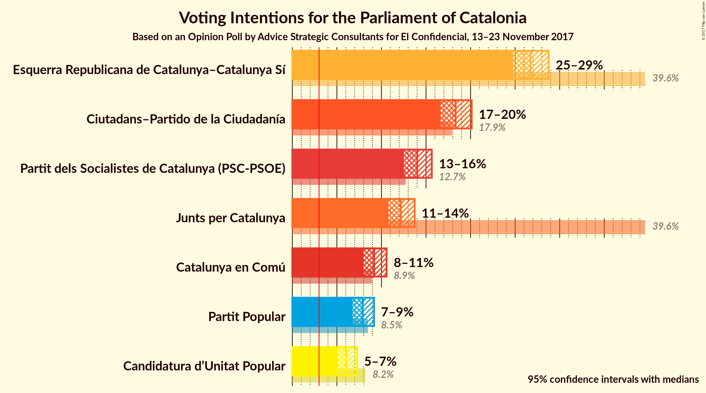
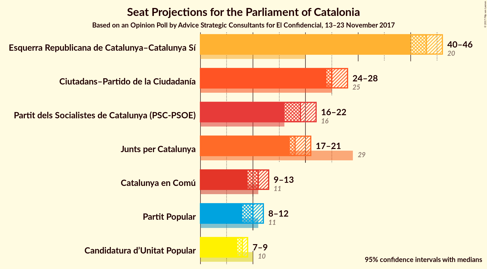
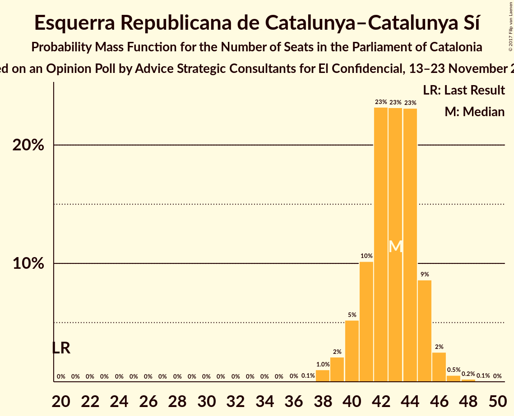
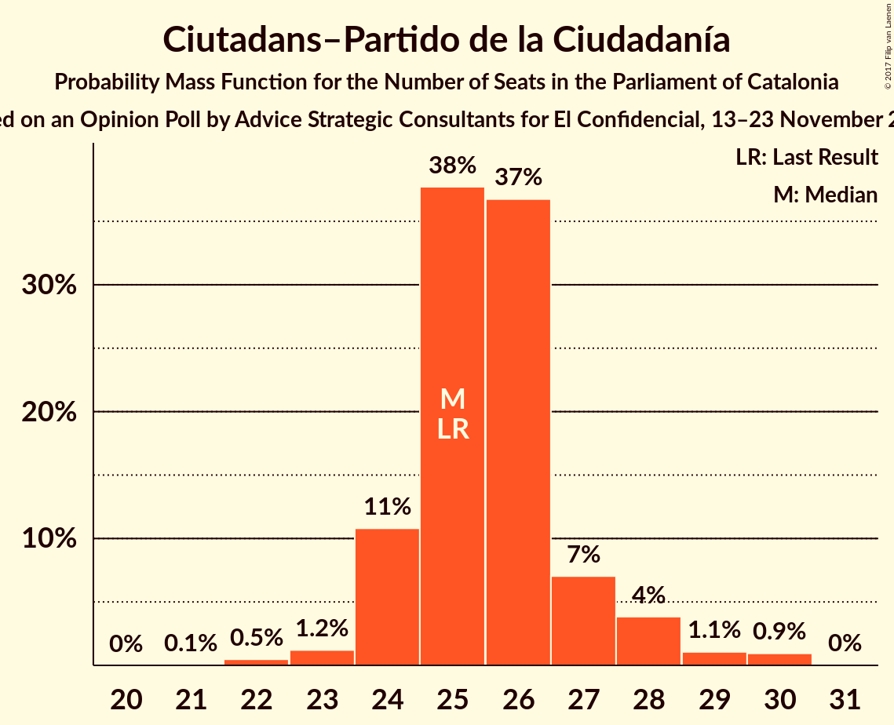
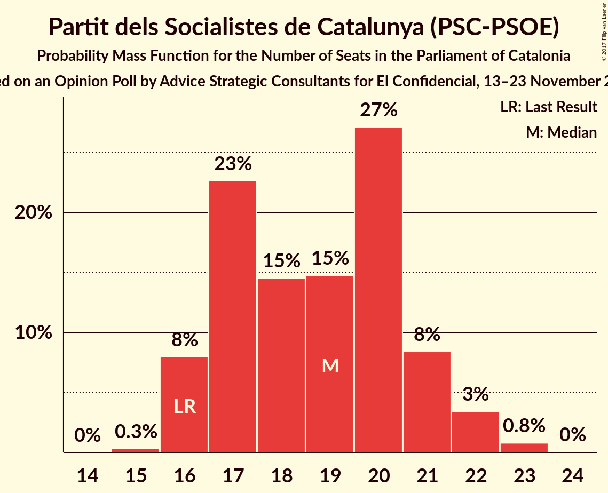
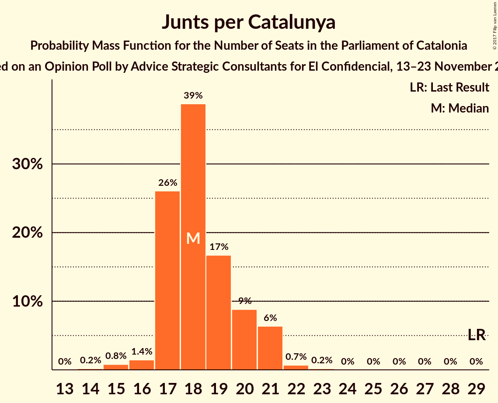
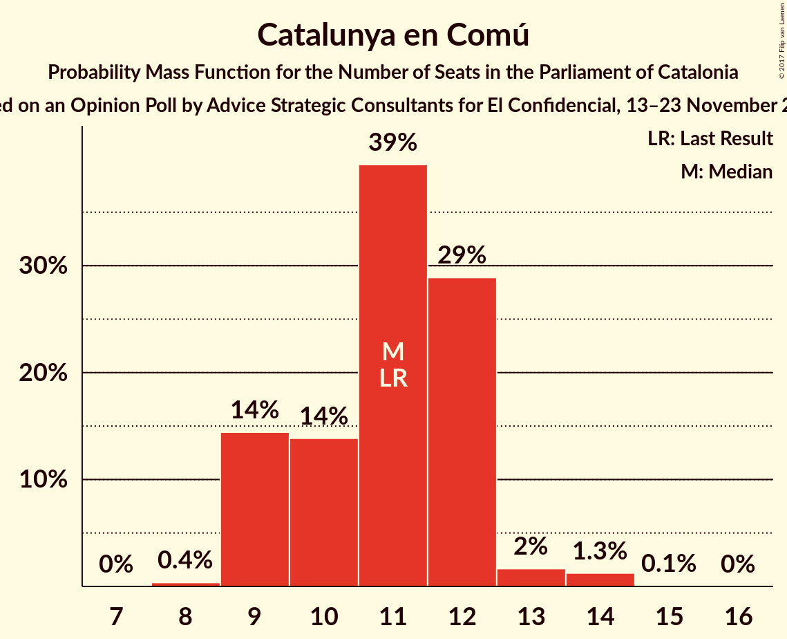
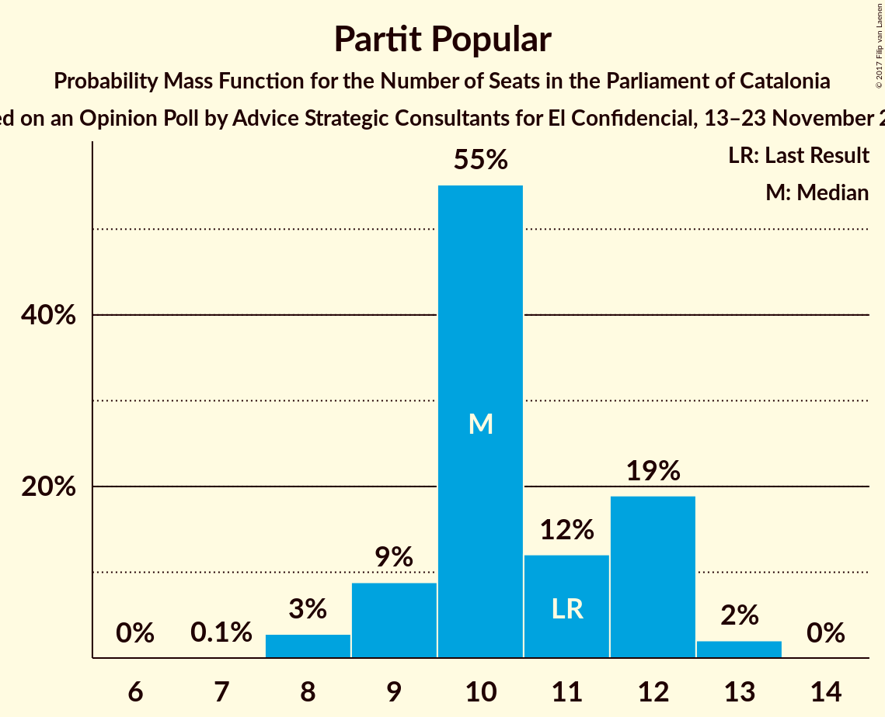
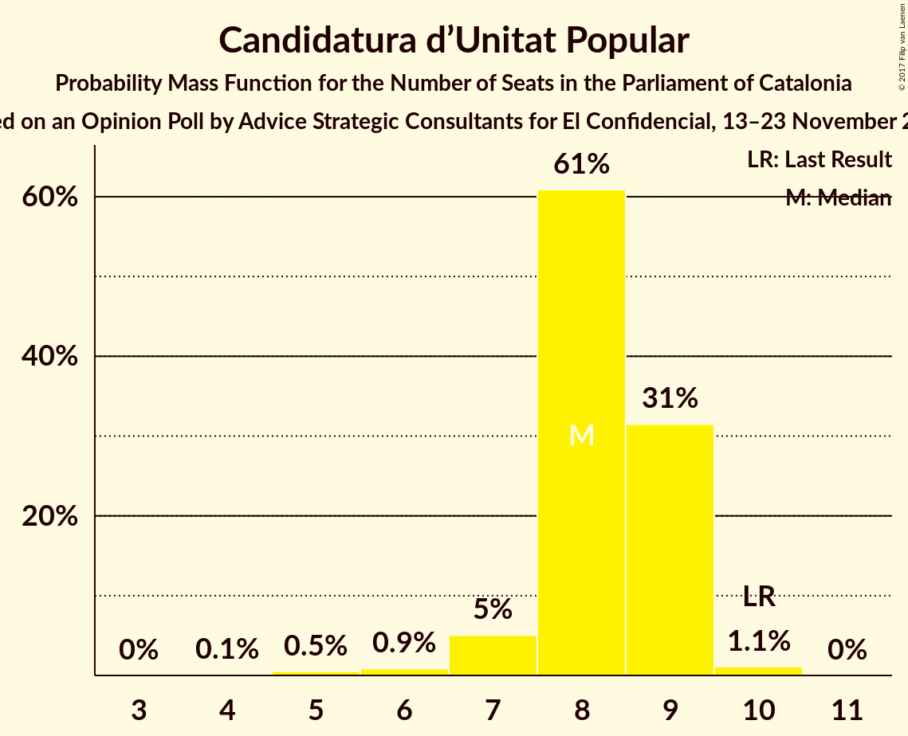
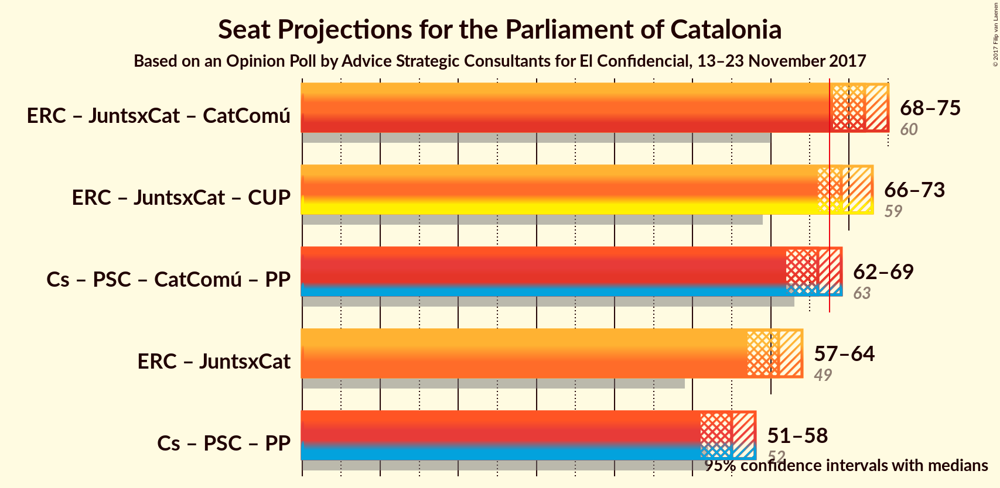

# Opinion Poll by Advice Strategic Consultants for El Confidencial, 13–23 November 2017

<a href="#voting-intentions">Voting Intentions</a> | <a href="#seats">Seats</a> | <a href="#coalitions">Coalitions</a> | <a href="#technical-information">Technical Information</a>

## Voting Intentions

### Confidence Intervals

| Party | Last Result | Poll Result | 80% Confidence Interval | 90% Confidence Interval | 95% Confidence Interval | 99% Confidence Interval |
|:-----:|:-----------:|:-----------:|:-----------------------:|:-----------------------:|:-----------------------:|:-----------------------:|
| Esquerra Republicana de Catalunya–Catalunya Sí | 39.6% | 26.7% | 25.4–28.1% |25.1–28.4% |24.8–28.8% |24.2–29.4% |
| Ciutadans–Partido de la Ciudadanía | 17.9% | 18.3% | 17.2–19.5% |16.9–19.8% |16.6–20.1% |16.1–20.7% |
| Partit dels Socialistes de Catalunya (PSC-PSOE) | 12.7% | 14.0% | 13.0–15.1% |12.8–15.4% |12.5–15.7% |12.1–16.2% |
| Junts per Catalunya | 39.6% | 12.2% | 11.3–13.2% |11.0–13.5% |10.8–13.7% |10.3–14.2% |
| Catalunya en Comú | 8.9% | 9.2% | 8.4–10.1% |8.2–10.3% |8.0–10.6% |7.6–11.0% |
| Partit Popular | 8.5% | 7.9% | 7.1–8.7% |6.9–9.0% |6.7–9.2% |6.4–9.6% |
| Candidatura d’Unitat Popular | 8.2% | 6.1% | 5.4–6.9% |5.3–7.1% |5.1–7.3% |4.8–7.6% |

*Note:* The poll result column reflects the actual value used in the calculations. Published results may vary slightly, and in addition be rounded to fewer digits.

## Seats

### Confidence Intervals

| Party | Last Result | Median | 80% Confidence Interval | 90% Confidence Interval | 95% Confidence Interval | 99% Confidence Interval |
|:-----:|:-----------:|:------:|:-----------------------:|:-----------------------:|:-----------------------:|:-----------------------:|
| <a href="#esquerra-republicana-de-catalunya–catalunya-sí">Esquerra Republicana de Catalunya–Catalunya Sí</a> | 20 | 43 | 41–44 |40–45 |39–46 |38–47 |
| <a href="#ciutadans–partido-de-la-ciudadanía">Ciutadans–Partido de la Ciudadanía</a> | 25 | 26 | 24–27 |24–28 |24–28 |22–30 |
| <a href="#partit-dels-socialistes-de-catalunya-(psc-psoe)">Partit dels Socialistes de Catalunya (PSC-PSOE)</a> | 16 | 19 | 17–21 |16–21 |16–22 |16–23 |
| <a href="#junts-per-catalunya">Junts per Catalunya</a> | 29 | 18 | 17–20 |17–21 |17–21 |15–22 |
| <a href="#catalunya-en-comú">Catalunya en Comú</a> | 11 | 11 | 9–12 |9–12 |9–13 |9–14 |
| <a href="#partit-popular">Partit Popular</a> | 11 | 10 | 9–12 |9–12 |8–12 |8–13 |
| <a href="#candidatura-d’unitat-popular">Candidatura d’Unitat Popular</a> | 10 | 8 | 8–9 |7–9 |7–9 |5–10 |

### Esquerra Republicana de Catalunya–Catalunya Sí

*For a full overview of the results for this party, see the [Esquerra Republicana de Catalunya–Catalunya Sí](party-esquerrarepublicanadecatalunya–catalunyasí.html) page.*

| Number of Seats | Probability | Accumulated | Special Marks |
|:---------------:|:-----------:|:-----------:|:-------------:|
| 20 | 0% | 100% | Last Result |
| 21 | 0% | 100% |  |
| 22 | 0% | 100% |  |
| 23 | 0% | 100% |  |
| 24 | 0% | 100% |  |
| 25 | 0% | 100% |  |
| 26 | 0% | 100% |  |
| 27 | 0% | 100% |  |
| 28 | 0% | 100% |  |
| 29 | 0% | 100% |  |
| 30 | 0% | 100% |  |
| 31 | 0% | 100% |  |
| 32 | 0% | 100% |  |
| 33 | 0% | 100% |  |
| 34 | 0% | 100% |  |
| 35 | 0% | 100% |  |
| 36 | 0% | 100% |  |
| 37 | 0.1% | 100% |  |
| 38 | 1.0% | 99.9% |  |
| 39 | 2% | 98.9% |  |
| 40 | 5% | 97% |  |
| 41 | 12% | 92% |  |
| 42 | 22% | 80% |  |
| 43 | 22% | 57% | Median |
| 44 | 25% | 35% |  |
| 45 | 6% | 9% |  |
| 46 | 2% | 3% |  |
| 47 | 0.6% | 0.8% |  |
| 48 | 0.2% | 0.3% |  |
| 49 | 0% | 0% |  |

### Ciutadans–Partido de la Ciudadanía

*For a full overview of the results for this party, see the [Ciutadans–Partido de la Ciudadanía](party-ciutadans–partidodelaciudadanía.html) page.*

| Number of Seats | Probability | Accumulated | Special Marks |
|:---------------:|:-----------:|:-----------:|:-------------:|
| 21 | 0.1% | 100% |  |
| 22 | 0.5% | 99.9% |  |
| 23 | 1.1% | 99.4% |  |
| 24 | 10% | 98% |  |
| 25 | 38% | 88% | Last Result |
| 26 | 38% | 51% | Median |
| 27 | 8% | 13% |  |
| 28 | 3% | 5% |  |
| 29 | 1.2% | 2% |  |
| 30 | 0.8% | 0.9% |  |
| 31 | 0% | 0% |  |

### Partit dels Socialistes de Catalunya (PSC-PSOE)

*For a full overview of the results for this party, see the [Partit dels Socialistes de Catalunya (PSC-PSOE)](party-partitdelssocialistesdecatalunyapsc-psoe.html) page.*

| Number of Seats | Probability | Accumulated | Special Marks |
|:---------------:|:-----------:|:-----------:|:-------------:|
| 15 | 0.3% | 100% |  |
| 16 | 8% | 99.7% | Last Result |
| 17 | 24% | 92% |  |
| 18 | 14% | 68% |  |
| 19 | 16% | 54% | Median |
| 20 | 25% | 39% |  |
| 21 | 9% | 13% |  |
| 22 | 3% | 4% |  |
| 23 | 0.8% | 0.9% |  |
| 24 | 0% | 0% |  |

### Junts per Catalunya

*For a full overview of the results for this party, see the [Junts per Catalunya](party-juntspercatalunya.html) page.*

| Number of Seats | Probability | Accumulated | Special Marks |
|:---------------:|:-----------:|:-----------:|:-------------:|
| 14 | 0.2% | 100% |  |
| 15 | 0.8% | 99.8% |  |
| 16 | 1.4% | 99.1% |  |
| 17 | 25% | 98% |  |
| 18 | 38% | 73% | Median |
| 19 | 17% | 34% |  |
| 20 | 9% | 17% |  |
| 21 | 7% | 8% |  |
| 22 | 0.7% | 0.9% |  |
| 23 | 0.2% | 0.2% |  |
| 24 | 0% | 0% |  |
| 25 | 0% | 0% |  |
| 26 | 0% | 0% |  |
| 27 | 0% | 0% |  |
| 28 | 0% | 0% |  |
| 29 | 0% | 0% | Last Result |

### Catalunya en Comú

*For a full overview of the results for this party, see the [Catalunya en Comú](party-catalunyaencomú.html) page.*

| Number of Seats | Probability | Accumulated | Special Marks |
|:---------------:|:-----------:|:-----------:|:-------------:|
| 8 | 0.4% | 100% |  |
| 9 | 13% | 99.6% |  |
| 10 | 13% | 87% |  |
| 11 | 38% | 74% | Last Result, Median |
| 12 | 31% | 36% |  |
| 13 | 3% | 5% |  |
| 14 | 2% | 2% |  |
| 15 | 0.1% | 0.1% |  |
| 16 | 0% | 0% |  |

### Partit Popular

*For a full overview of the results for this party, see the [Partit Popular](party-partitpopular.html) page.*

| Number of Seats | Probability | Accumulated | Special Marks |
|:---------------:|:-----------:|:-----------:|:-------------:|
| 7 | 0.1% | 100% |  |
| 8 | 3% | 99.9% |  |
| 9 | 9% | 97% |  |
| 10 | 56% | 88% | Median |
| 11 | 11% | 32% | Last Result |
| 12 | 19% | 21% |  |
| 13 | 2% | 2% |  |
| 14 | 0% | 0% |  |

### Candidatura d’Unitat Popular

*For a full overview of the results for this party, see the [Candidatura d’Unitat Popular](party-candidaturad’unitatpopular.html) page.*

| Number of Seats | Probability | Accumulated | Special Marks |
|:---------------:|:-----------:|:-----------:|:-------------:|
| 4 | 0.1% | 100% |  |
| 5 | 0.5% | 99.9% |  |
| 6 | 1.0% | 99.4% |  |
| 7 | 5% | 98% |  |
| 8 | 61% | 94% | Median |
| 9 | 31% | 32% |  |
| 10 | 1.2% | 1.2% | Last Result |
| 11 | 0% | 0% |  |

## Coalitions

### Confidence Intervals

| Coalition | Last Result | Median | Majority? | 80% Confidence Interval | 90% Confidence Interval | 95% Confidence Interval | 99% Confidence Interval |
|:---------:|:-----------:|:------:|:---------:|:-----------------------:|:-----------------------:|:-----------------------:|:-----------------------:|
| Esquerra Republicana de Catalunya–Catalunya Sí – Junts per Catalunya – Catalunya en Comú | 60 | 72 | 99.2% | 70–75 | 69–75 | 69–76 | 67–76 |
| Esquerra Republicana de Catalunya–Catalunya Sí – Junts per Catalunya – Candidatura d’Unitat Popular | 59 | 69 | 83% | 67–72 | 66–72 | 66–73 | 64–74 |
| Ciutadans–Partido de la Ciudadanía – Partit dels Socialistes de Catalunya (PSC-PSOE) – Catalunya en Comú – Partit Popular | 63 | 66 | 17% | 63–68 | 63–69 | 62–69 | 61–71 |
| Esquerra Republicana de Catalunya–Catalunya Sí – Junts per Catalunya | 49 | 61 | 0% | 59–63 | 58–64 | 57–64 | 56–66 |
| Ciutadans–Partido de la Ciudadanía – Partit dels Socialistes de Catalunya (PSC-PSOE) – Partit Popular | 52 | 55 | 0% | 52–57 | 52–58 | 51–58 | 50–60 |

### Esquerra Republicana de Catalunya–Catalunya Sí – Junts per Catalunya – Catalunya en Comú

| Number of Seats | Probability | Accumulated | Special Marks |
|:---------------:|:-----------:|:-----------:|:-------------:|
| 60 | 0% | 100% | Last Result |
| 61 | 0% | 100% |  |
| 62 | 0% | 100% |  |
| 63 | 0% | 100% |  |
| 64 | 0% | 100% |  |
| 65 | 0% | 100% |  |
| 66 | 0.2% | 99.9% |  |
| 67 | 0.6% | 99.8% |  |
| 68 | 2% | 99.2% | Majority |
| 69 | 4% | 98% |  |
| 70 | 13% | 93% |  |
| 71 | 22% | 81% |  |
| 72 | 19% | 59% | Median |
| 73 | 16% | 40% |  |
| 74 | 13% | 23% |  |
| 75 | 8% | 10% |  |
| 76 | 2% | 3% |  |
| 77 | 0.4% | 0.5% |  |
| 78 | 0.1% | 0.1% |  |
| 79 | 0% | 0% |  |

### Esquerra Republicana de Catalunya–Catalunya Sí – Junts per Catalunya – Candidatura d’Unitat Popular

| Number of Seats | Probability | Accumulated | Special Marks |
|:---------------:|:-----------:|:-----------:|:-------------:|
| 59 | 0% | 100% | Last Result |
| 60 | 0% | 100% |  |
| 61 | 0% | 100% |  |
| 62 | 0% | 100% |  |
| 63 | 0.1% | 100% |  |
| 64 | 0.6% | 99.9% |  |
| 65 | 2% | 99.3% |  |
| 66 | 4% | 98% |  |
| 67 | 11% | 93% |  |
| 68 | 17% | 83% | Majority |
| 69 | 20% | 66% | Median |
| 70 | 20% | 46% |  |
| 71 | 15% | 27% |  |
| 72 | 8% | 12% |  |
| 73 | 3% | 3% |  |
| 74 | 0.8% | 0.9% |  |
| 75 | 0.1% | 0.1% |  |
| 76 | 0% | 0% |  |

### Ciutadans–Partido de la Ciudadanía – Partit dels Socialistes de Catalunya (PSC-PSOE) – Catalunya en Comú – Partit Popular

| Number of Seats | Probability | Accumulated | Special Marks |
|:---------------:|:-----------:|:-----------:|:-------------:|
| 60 | 0.1% | 100% |  |
| 61 | 0.8% | 99.9% |  |
| 62 | 3% | 99.1% |  |
| 63 | 8% | 97% | Last Result |
| 64 | 15% | 88% |  |
| 65 | 20% | 73% |  |
| 66 | 20% | 54% | Median |
| 67 | 17% | 34% |  |
| 68 | 11% | 17% | Majority |
| 69 | 4% | 7% |  |
| 70 | 2% | 2% |  |
| 71 | 0.6% | 0.7% |  |
| 72 | 0.1% | 0.1% |  |
| 73 | 0% | 0% |  |

### Esquerra Republicana de Catalunya–Catalunya Sí – Junts per Catalunya

| Number of Seats | Probability | Accumulated | Special Marks |
|:---------------:|:-----------:|:-----------:|:-------------:|
| 49 | 0% | 100% | Last Result |
| 50 | 0% | 100% |  |
| 51 | 0% | 100% |  |
| 52 | 0% | 100% |  |
| 53 | 0% | 100% |  |
| 54 | 0% | 100% |  |
| 55 | 0.2% | 100% |  |
| 56 | 0.7% | 99.8% |  |
| 57 | 2% | 99.1% |  |
| 58 | 5% | 97% |  |
| 59 | 13% | 92% |  |
| 60 | 18% | 79% |  |
| 61 | 21% | 61% | Median |
| 62 | 19% | 40% |  |
| 63 | 13% | 22% |  |
| 64 | 6% | 9% |  |
| 65 | 2% | 2% |  |
| 66 | 0.5% | 0.6% |  |
| 67 | 0.1% | 0.1% |  |
| 68 | 0% | 0% | Majority |

### Ciutadans–Partido de la Ciudadanía – Partit dels Socialistes de Catalunya (PSC-PSOE) – Partit Popular

| Number of Seats | Probability | Accumulated | Special Marks |
|:---------------:|:-----------:|:-----------:|:-------------:|
| 49 | 0.1% | 100% |  |
| 50 | 0.5% | 99.9% |  |
| 51 | 3% | 99.5% |  |
| 52 | 9% | 96% | Last Result |
| 53 | 14% | 87% |  |
| 54 | 18% | 73% |  |
| 55 | 20% | 55% | Median |
| 56 | 21% | 35% |  |
| 57 | 10% | 15% |  |
| 58 | 3% | 5% |  |
| 59 | 1.4% | 2% |  |
| 60 | 0.5% | 0.6% |  |
| 61 | 0.1% | 0.1% |  |
| 62 | 0% | 0% |  |

## Technical Information

### Opinion Poll

+ **Polling firm:** Advice Strategic Consultants
+ **Commissioner(s):** El Confidencial
+ **Fieldwork period:** 13–23 November 2017

### Calculations

+ **Sample size:** 1905
+ **Simulations done:** 8,388,608
+ **Error estimate:** 0.50%

