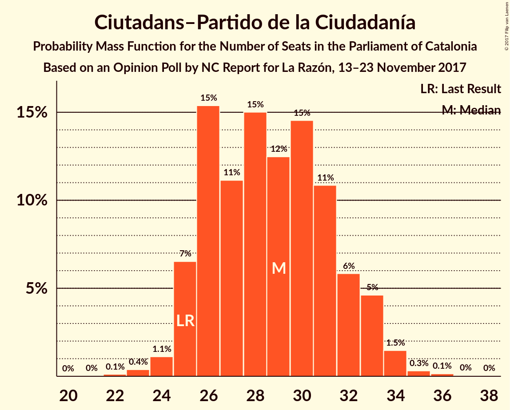

# Opinion Poll by NC Report for La Razón, 13–23 November 2017

<a href="#voting-intentions">Voting Intentions</a> | <a href="#seats">Seats</a> | <a href="#coalitions">Coalitions</a> | <a href="#technical-information">Technical Information</a>

## Voting Intentions

### Confidence Intervals

| Party | Last Result | Poll Result | 80% Confidence Interval | 90% Confidence Interval | 95% Confidence Interval | 99% Confidence Interval |
|:-----:|:-----------:|:-----------:|:-----------------------:|:-----------------------:|:-----------------------:|:-----------------------:|
| Esquerra Republicana de Catalunya–Catalunya Sí | 39.6% | 24.1% | 22.1–26.2% |21.5–26.8% |21.0–27.3% |20.1–28.4% |
| Ciutadans–Partido de la Ciudadanía | 17.9% | 21.0% | 19.1–23.0% |18.6–23.6% |18.1–24.1% |17.3–25.1% |
| Partit dels Socialistes de Catalunya (PSC-PSOE) | 12.7% | 14.8% | 13.2–16.6% |12.7–17.1% |12.3–17.6% |11.6–18.5% |
| Junts per Catalunya | 39.6% | 13.6% | 12.1–15.4% |11.7–15.9% |11.3–16.4% |10.6–17.3% |
| Partit Popular | 8.5% | 9.3% | 8.0–10.8% |7.7–11.3% |7.4–11.6% |6.8–12.4% |
| Catalunya en Comú | 8.9% | 8.4% | 7.2–9.9% |6.9–10.3% |6.6–10.7% |6.1–11.5% |
| Candidatura d’Unitat Popular | 8.2% | 5.8% | 4.8–7.1% |4.5–7.4% |4.3–7.7% |3.8–8.4% |

*Note:* The poll result column reflects the actual value used in the calculations. Published results may vary slightly, and in addition be rounded to fewer digits.

## Seats

### Confidence Intervals

| Party | Last Result | Median | 80% Confidence Interval | 90% Confidence Interval | 95% Confidence Interval | 99% Confidence Interval |
|:-----:|:-----------:|:------:|:-----------------------:|:-----------------------:|:-----------------------:|:-----------------------:|
| <a href="#esquerra-republicana-de-catalunya–catalunya-sí">Esquerra Republicana de Catalunya–Catalunya Sí</a> | 20 | 37 | 34–40 |32–41 |32–42 |31–44 |
| <a href="#ciutadans–partido-de-la-ciudadanía">Ciutadans–Partido de la Ciudadanía</a> | 25 | 28 | 26–32 |25–33 |25–33 |24–35 |
| <a href="#partit-dels-socialistes-de-catalunya-(psc-psoe)">Partit dels Socialistes de Catalunya (PSC-PSOE)</a> | 16 | 20 | 17–23 |16–23 |16–23 |15–24 |
| <a href="#junts-per-catalunya">Junts per Catalunya</a> | 29 | 21 | 18–23 |17–24 |17–24 |15–26 |
| <a href="#partit-popular">Partit Popular</a> | 11 | 12 | 10–14 |10–14 |9–15 |9–16 |
| <a href="#catalunya-en-comú">Catalunya en Comú</a> | 11 | 9 | 8–12 |8–12 |7–13 |6–14 |
| <a href="#candidatura-d’unitat-popular">Candidatura d’Unitat Popular</a> | 10 | 8 | 5–9 |5–9 |3–9 |3–10 |

### Esquerra Republicana de Catalunya–Catalunya Sí

*For a full overview of the results for this party, see the [Esquerra Republicana de Catalunya–Catalunya Sí](party-esquerrarepublicanadecatalunya–catalunyasí.html) page.*

| Number of Seats | Probability | Accumulated | Special Marks |
|:---------------:|:-----------:|:-----------:|:-------------:|
| 20 | 0% | 100% | Last Result |
| 21 | 0% | 100% |  |
| 22 | 0% | 100% |  |
| 23 | 0% | 100% |  |
| 24 | 0% | 100% |  |
| 25 | 0% | 100% |  |
| 26 | 0% | 100% |  |
| 27 | 0% | 100% |  |
| 28 | 0% | 100% |  |
| 29 | 0.1% | 100% |  |
| 30 | 0.2% | 99.9% |  |
| 31 | 1.2% | 99.7% |  |
| 32 | 4% | 98.5% |  |
| 33 | 2% | 95% |  |
| 34 | 7% | 93% |  |
| 35 | 16% | 86% |  |
| 36 | 7% | 69% |  |
| 37 | 16% | 62% | Median |
| 38 | 14% | 46% |  |
| 39 | 14% | 32% |  |
| 40 | 11% | 17% |  |
| 41 | 2% | 6% |  |
| 42 | 2% | 4% |  |
| 43 | 1.3% | 2% |  |
| 44 | 0.6% | 0.8% |  |
| 45 | 0.1% | 0.2% |  |
| 46 | 0.1% | 0.1% |  |
| 47 | 0% | 0% |  |

### Ciutadans–Partido de la Ciudadanía

*For a full overview of the results for this party, see the [Ciutadans–Partido de la Ciudadanía](party-ciutadans–partidodelaciudadanía.html) page.*

| Number of Seats | Probability | Accumulated | Special Marks |
|:---------------:|:-----------:|:-----------:|:-------------:|
| 22 | 0.1% | 100% |  |
| 23 | 0.2% | 99.8% |  |
| 24 | 1.1% | 99.6% |  |
| 25 | 5% | 98.6% | Last Result |
| 26 | 18% | 94% |  |
| 27 | 22% | 76% |  |
| 28 | 9% | 53% | Median |
| 29 | 10% | 44% |  |
| 30 | 11% | 34% |  |
| 31 | 13% | 23% |  |
| 32 | 1.3% | 11% |  |
| 33 | 8% | 9% |  |
| 34 | 0.8% | 1.5% |  |
| 35 | 0.3% | 0.6% |  |
| 36 | 0.2% | 0.3% |  |
| 37 | 0.1% | 0.2% |  |
| 38 | 0% | 0% |  |

### Partit dels Socialistes de Catalunya (PSC-PSOE)

*For a full overview of the results for this party, see the [Partit dels Socialistes de Catalunya (PSC-PSOE)](party-partitdelssocialistesdecatalunyapsc-psoe.html) page.*

| Number of Seats | Probability | Accumulated | Special Marks |
|:---------------:|:-----------:|:-----------:|:-------------:|
| 14 | 0.3% | 100% |  |
| 15 | 2% | 99.7% |  |
| 16 | 7% | 98% | Last Result |
| 17 | 12% | 91% |  |
| 18 | 8% | 79% |  |
| 19 | 17% | 71% |  |
| 20 | 25% | 54% | Median |
| 21 | 1.2% | 30% |  |
| 22 | 16% | 29% |  |
| 23 | 11% | 13% |  |
| 24 | 1.4% | 2% |  |
| 25 | 0.2% | 0.2% |  |
| 26 | 0% | 0.1% |  |
| 27 | 0% | 0% |  |

### Junts per Catalunya

*For a full overview of the results for this party, see the [Junts per Catalunya](party-juntspercatalunya.html) page.*

| Number of Seats | Probability | Accumulated | Special Marks |
|:---------------:|:-----------:|:-----------:|:-------------:|
| 13 | 0% | 100% |  |
| 14 | 0% | 99.9% |  |
| 15 | 0.7% | 99.9% |  |
| 16 | 0.7% | 99.2% |  |
| 17 | 9% | 98.6% |  |
| 18 | 15% | 90% |  |
| 19 | 14% | 75% |  |
| 20 | 4% | 61% |  |
| 21 | 23% | 57% | Median |
| 22 | 9% | 34% |  |
| 23 | 20% | 25% |  |
| 24 | 4% | 5% |  |
| 25 | 0.9% | 1.4% |  |
| 26 | 0.3% | 0.5% |  |
| 27 | 0.1% | 0.2% |  |
| 28 | 0.1% | 0.1% |  |
| 29 | 0% | 0% | Last Result |

### Partit Popular

*For a full overview of the results for this party, see the [Partit Popular](party-partitpopular.html) page.*

| Number of Seats | Probability | Accumulated | Special Marks |
|:---------------:|:-----------:|:-----------:|:-------------:|
| 7 | 0.1% | 100% |  |
| 8 | 0.3% | 99.9% |  |
| 9 | 3% | 99.6% |  |
| 10 | 8% | 97% |  |
| 11 | 10% | 89% | Last Result |
| 12 | 42% | 79% | Median |
| 13 | 24% | 37% |  |
| 14 | 10% | 13% |  |
| 15 | 0.7% | 3% |  |
| 16 | 2% | 2% |  |
| 17 | 0% | 0.1% |  |
| 18 | 0% | 0.1% |  |
| 19 | 0.1% | 0.1% |  |
| 20 | 0% | 0% |  |

### Catalunya en Comú

*For a full overview of the results for this party, see the [Catalunya en Comú](party-catalunyaencomú.html) page.*

| Number of Seats | Probability | Accumulated | Special Marks |
|:---------------:|:-----------:|:-----------:|:-------------:|
| 5 | 0.2% | 100% |  |
| 6 | 0.9% | 99.8% |  |
| 7 | 4% | 98.9% |  |
| 8 | 22% | 95% |  |
| 9 | 33% | 73% | Median |
| 10 | 3% | 39% |  |
| 11 | 26% | 37% | Last Result |
| 12 | 7% | 11% |  |
| 13 | 2% | 3% |  |
| 14 | 1.2% | 1.4% |  |
| 15 | 0.2% | 0.2% |  |
| 16 | 0% | 0% |  |

### Candidatura d’Unitat Popular

*For a full overview of the results for this party, see the [Candidatura d’Unitat Popular](party-candidaturad’unitatpopular.html) page.*

| Number of Seats | Probability | Accumulated | Special Marks |
|:---------------:|:-----------:|:-----------:|:-------------:|
| 3 | 3% | 100% |  |
| 4 | 2% | 97% |  |
| 5 | 6% | 95% |  |
| 6 | 9% | 89% |  |
| 7 | 11% | 80% |  |
| 8 | 47% | 69% | Median |
| 9 | 20% | 22% |  |
| 10 | 2% | 2% | Last Result |
| 11 | 0% | 0.1% |  |
| 12 | 0.1% | 0.1% |  |
| 13 | 0% | 0% |  |

## Coalitions

### Confidence Intervals

| Coalition | Last Result | Median | Majority? | 80% Confidence Interval | 90% Confidence Interval | 95% Confidence Interval | 99% Confidence Interval |
|:---------:|:-----------:|:------:|:---------:|:-----------------------:|:-----------------------:|:-----------------------:|:-----------------------:|
| Ciutadans–Partido de la Ciudadanía – Partit dels Socialistes de Catalunya (PSC-PSOE) – Partit Popular – Catalunya en Comú | 63 | 69 | 81% | 66–74 | 66–75 | 65–76 | 63–77 |
| Esquerra Republicana de Catalunya–Catalunya Sí – Junts per Catalunya – Catalunya en Comú | 60 | 67 | 33% | 64–71 | 62–72 | 61–73 | 61–74 |
| Esquerra Republicana de Catalunya–Catalunya Sí – Junts per Catalunya – Candidatura d’Unitat Popular | 59 | 66 | 19% | 61–69 | 60–69 | 59–70 | 58–72 |
| Ciutadans–Partido de la Ciudadanía – Partit dels Socialistes de Catalunya (PSC-PSOE) – Partit Popular | 52 | 60 | 0.6% | 57–64 | 56–65 | 55–66 | 53–68 |
| Esquerra Republicana de Catalunya–Catalunya Sí – Junts per Catalunya | 49 | 58 | 0% | 54–61 | 53–63 | 52–63 | 50–65 |

### Ciutadans–Partido de la Ciudadanía – Partit dels Socialistes de Catalunya (PSC-PSOE) – Partit Popular – Catalunya en Comú

| Number of Seats | Probability | Accumulated | Special Marks |
|:---------------:|:-----------:|:-----------:|:-------------:|
| 61 | 0.1% | 100% |  |
| 62 | 0.2% | 99.9% |  |
| 63 | 0.8% | 99.6% | Last Result |
| 64 | 0.2% | 98.8% |  |
| 65 | 2% | 98.7% |  |
| 66 | 8% | 96% |  |
| 67 | 7% | 88% |  |
| 68 | 15% | 81% | Majority |
| 69 | 20% | 66% | Median |
| 70 | 7% | 46% |  |
| 71 | 8% | 39% |  |
| 72 | 9% | 31% |  |
| 73 | 11% | 22% |  |
| 74 | 5% | 11% |  |
| 75 | 4% | 7% |  |
| 76 | 1.5% | 3% |  |
| 77 | 0.9% | 1.3% |  |
| 78 | 0.2% | 0.3% |  |
| 79 | 0% | 0.1% |  |
| 80 | 0% | 0.1% |  |
| 81 | 0% | 0% |  |

### Esquerra Republicana de Catalunya–Catalunya Sí – Junts per Catalunya – Catalunya en Comú

| Number of Seats | Probability | Accumulated | Special Marks |
|:---------------:|:-----------:|:-----------:|:-------------:|
| 58 | 0.1% | 100% |  |
| 59 | 0.1% | 99.9% |  |
| 60 | 0.3% | 99.8% | Last Result |
| 61 | 3% | 99.5% |  |
| 62 | 3% | 96% |  |
| 63 | 3% | 93% |  |
| 64 | 7% | 90% |  |
| 65 | 4% | 83% |  |
| 66 | 6% | 79% |  |
| 67 | 40% | 73% | Median |
| 68 | 11% | 33% | Majority |
| 69 | 1.0% | 22% |  |
| 70 | 9% | 21% |  |
| 71 | 4% | 12% |  |
| 72 | 4% | 7% |  |
| 73 | 2% | 3% |  |
| 74 | 0.5% | 0.9% |  |
| 75 | 0.1% | 0.4% |  |
| 76 | 0.3% | 0.3% |  |
| 77 | 0.1% | 0.1% |  |
| 78 | 0% | 0% |  |

### Esquerra Republicana de Catalunya–Catalunya Sí – Junts per Catalunya – Candidatura d’Unitat Popular

| Number of Seats | Probability | Accumulated | Special Marks |
|:---------------:|:-----------:|:-----------:|:-------------:|
| 55 | 0% | 100% |  |
| 56 | 0% | 99.9% |  |
| 57 | 0.2% | 99.9% |  |
| 58 | 0.9% | 99.7% |  |
| 59 | 1.5% | 98.7% | Last Result |
| 60 | 4% | 97% |  |
| 61 | 5% | 93% |  |
| 62 | 11% | 89% |  |
| 63 | 9% | 78% |  |
| 64 | 8% | 69% |  |
| 65 | 7% | 61% |  |
| 66 | 20% | 54% | Median |
| 67 | 15% | 34% |  |
| 68 | 7% | 19% | Majority |
| 69 | 8% | 12% |  |
| 70 | 2% | 4% |  |
| 71 | 0.2% | 1.3% |  |
| 72 | 0.8% | 1.2% |  |
| 73 | 0.2% | 0.4% |  |
| 74 | 0.1% | 0.1% |  |
| 75 | 0% | 0% |  |

### Ciutadans–Partido de la Ciudadanía – Partit dels Socialistes de Catalunya (PSC-PSOE) – Partit Popular

| Number of Seats | Probability | Accumulated | Special Marks |
|:---------------:|:-----------:|:-----------:|:-------------:|
| 51 | 0.1% | 100% |  |
| 52 | 0.1% | 99.9% | Last Result |
| 53 | 0.4% | 99.8% |  |
| 54 | 1.4% | 99.4% |  |
| 55 | 1.3% | 98% |  |
| 56 | 3% | 97% |  |
| 57 | 9% | 94% |  |
| 58 | 10% | 85% |  |
| 59 | 11% | 75% |  |
| 60 | 25% | 64% | Median |
| 61 | 11% | 39% |  |
| 62 | 7% | 28% |  |
| 63 | 7% | 21% |  |
| 64 | 6% | 14% |  |
| 65 | 4% | 9% |  |
| 66 | 4% | 5% |  |
| 67 | 0.5% | 1.1% |  |
| 68 | 0.3% | 0.6% | Majority |
| 69 | 0.2% | 0.2% |  |
| 70 | 0% | 0% |  |

### Esquerra Republicana de Catalunya–Catalunya Sí – Junts per Catalunya

| Number of Seats | Probability | Accumulated | Special Marks |
|:---------------:|:-----------:|:-----------:|:-------------:|
| 48 | 0% | 100% |  |
| 49 | 0% | 99.9% | Last Result |
| 50 | 0.6% | 99.9% |  |
| 51 | 0.6% | 99.3% |  |
| 52 | 2% | 98.7% |  |
| 53 | 4% | 97% |  |
| 54 | 8% | 93% |  |
| 55 | 10% | 85% |  |
| 56 | 10% | 75% |  |
| 57 | 11% | 65% |  |
| 58 | 18% | 54% | Median |
| 59 | 13% | 36% |  |
| 60 | 6% | 23% |  |
| 61 | 11% | 17% |  |
| 62 | 1.5% | 7% |  |
| 63 | 3% | 5% |  |
| 64 | 1.3% | 2% |  |
| 65 | 0.3% | 0.5% |  |
| 66 | 0.1% | 0.2% |  |
| 67 | 0.1% | 0.1% |  |
| 68 | 0% | 0% | Majority |

## Technical Information

### Opinion Poll

+ **Polling firm:** NC Report
+ **Commissioner(s):** La Razón
+ **Fieldwork period:** 13–23 November 2017

### Calculations

+ **Sample size:** 711
+ **Simulations done:** 65,536
+ **Error estimate:** 3.95%

