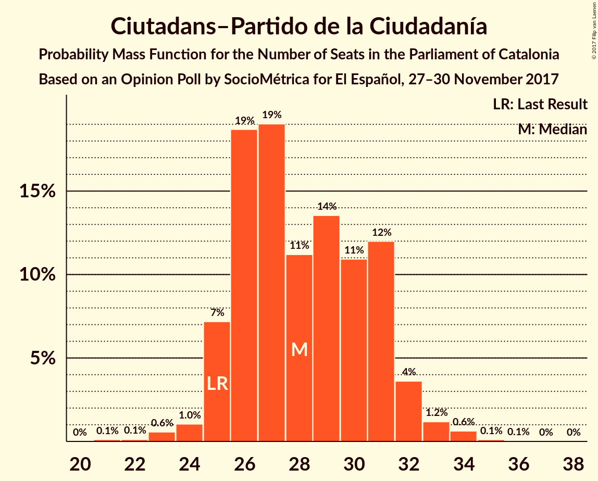

# Opinion Poll by SocioMétrica for El Español, 27–30 November 2017

<a href="#voting-intentions">Voting Intentions</a> | <a href="#seats">Seats</a> | <a href="#coalitions">Coalitions</a> | <a href="#technical-information">Technical Information</a>

## Voting Intentions

### Confidence Intervals

| Party | Last Result | Poll Result | 80% Confidence Interval | 90% Confidence Interval | 95% Confidence Interval | 99% Confidence Interval |
|:-----:|:-----------:|:-----------:|:-----------------------:|:-----------------------:|:-----------------------:|:-----------------------:|
| Esquerra Republicana de Catalunya–Catalunya Sí | 39.6% | 23.1% | 21.3–25.1% |20.8–25.7% |20.3–26.2% |19.5–27.2% |
| Ciutadans–Partido de la Ciudadanía | 17.9% | 20.5% | 18.7–22.4% |18.3–23.0% |17.8–23.4% |17.0–24.4% |
| Junts per Catalunya | 39.6% | 19.0% | 17.3–20.9% |16.8–21.4% |16.4–21.9% |15.7–22.8% |
| Partit dels Socialistes de Catalunya (PSC-PSOE) | 12.7% | 15.2% | 13.7–17.0% |13.3–17.5% |12.9–17.9% |12.2–18.8% |
| Catalunya en Comú | 8.9% | 6.4% | 5.4–7.6% |5.1–8.0% |4.9–8.3% |4.5–8.9% |
| Partit Popular | 8.5% | 6.2% | 5.3–7.5% |5.0–7.8% |4.8–8.2% |4.3–8.8% |
| Candidatura d’Unitat Popular | 8.2% | 6.0% | 5.0–7.2% |4.8–7.6% |4.6–7.9% |4.1–8.5% |

*Note:* The poll result column reflects the actual value used in the calculations. Published results may vary slightly, and in addition be rounded to fewer digits.

## Seats

### Confidence Intervals

| Party | Last Result | Median | 80% Confidence Interval | 90% Confidence Interval | 95% Confidence Interval | 99% Confidence Interval |
|:-----:|:-----------:|:------:|:-----------------------:|:-----------------------:|:-----------------------:|:-----------------------:|
| <a href="#esquerra-republicana-de-catalunya–catalunya-sí">Esquerra Republicana de Catalunya–Catalunya Sí</a> | 20 | 36 | 33–40 |32–40 |32–41 |30–42 |
| <a href="#ciutadans–partido-de-la-ciudadanía">Ciutadans–Partido de la Ciudadanía</a> | 25 | 28 | 26–31 |25–32 |25–33 |23–34 |
| <a href="#junts-per-catalunya">Junts per Catalunya</a> | 29 | 29 | 26–32 |24–34 |24–35 |23–35 |
| <a href="#partit-dels-socialistes-de-catalunya-(psc-psoe)">Partit dels Socialistes de Catalunya (PSC-PSOE)</a> | 16 | 20 | 17–23 |17–23 |16–24 |16–25 |
| <a href="#catalunya-en-comú">Catalunya en Comú</a> | 11 | 7 | 5–8 |5–9 |4–9 |4–11 |
| <a href="#partit-popular">Partit Popular</a> | 11 | 8 | 5–10 |5–10 |5–11 |5–12 |
| <a href="#candidatura-d’unitat-popular">Candidatura d’Unitat Popular</a> | 10 | 8 | 4–9 |4–10 |4–10 |4–10 |

### Esquerra Republicana de Catalunya–Catalunya Sí

*For a full overview of the results for this party, see the [Esquerra Republicana de Catalunya–Catalunya Sí](party-esquerrarepublicanadecatalunya–catalunyasí.html) page.*

| Number of Seats | Probability | Accumulated | Special Marks |
|:---------------:|:-----------:|:-----------:|:-------------:|
| 20 | 0% | 100% | Last Result |
| 21 | 0% | 100% |  |
| 22 | 0% | 100% |  |
| 23 | 0% | 100% |  |
| 24 | 0% | 100% |  |
| 25 | 0% | 100% |  |
| 26 | 0% | 100% |  |
| 27 | 0% | 100% |  |
| 28 | 0.1% | 100% |  |
| 29 | 0.1% | 99.9% |  |
| 30 | 0.6% | 99.8% |  |
| 31 | 1.4% | 99.2% |  |
| 32 | 5% | 98% |  |
| 33 | 5% | 93% |  |
| 34 | 6% | 88% |  |
| 35 | 19% | 82% |  |
| 36 | 15% | 63% | Median |
| 37 | 14% | 48% |  |
| 38 | 16% | 35% |  |
| 39 | 6% | 18% |  |
| 40 | 10% | 13% |  |
| 41 | 0.5% | 3% |  |
| 42 | 2% | 2% |  |
| 43 | 0.2% | 0.4% |  |
| 44 | 0.2% | 0.2% |  |
| 45 | 0% | 0% |  |

### Ciutadans–Partido de la Ciudadanía

*For a full overview of the results for this party, see the [Ciutadans–Partido de la Ciudadanía](party-ciutadans–partidodelaciudadanía.html) page.*

| Number of Seats | Probability | Accumulated | Special Marks |
|:---------------:|:-----------:|:-----------:|:-------------:|
| 21 | 0.1% | 100% |  |
| 22 | 0% | 99.9% |  |
| 23 | 0.6% | 99.9% |  |
| 24 | 0.8% | 99.3% |  |
| 25 | 7% | 98.5% | Last Result |
| 26 | 10% | 92% |  |
| 27 | 22% | 82% |  |
| 28 | 14% | 59% | Median |
| 29 | 9% | 46% |  |
| 30 | 19% | 37% |  |
| 31 | 12% | 18% |  |
| 32 | 3% | 6% |  |
| 33 | 2% | 3% |  |
| 34 | 0.9% | 1.2% |  |
| 35 | 0.2% | 0.3% |  |
| 36 | 0% | 0.1% |  |
| 37 | 0% | 0% |  |

### Junts per Catalunya

*For a full overview of the results for this party, see the [Junts per Catalunya](party-juntspercatalunya.html) page.*

| Number of Seats | Probability | Accumulated | Special Marks |
|:---------------:|:-----------:|:-----------:|:-------------:|
| 22 | 0.1% | 100% |  |
| 23 | 0.5% | 99.9% |  |
| 24 | 6% | 99.4% |  |
| 25 | 3% | 93% |  |
| 26 | 11% | 90% |  |
| 27 | 9% | 79% |  |
| 28 | 18% | 71% |  |
| 29 | 19% | 53% | Last Result, Median |
| 30 | 15% | 34% |  |
| 31 | 6% | 19% |  |
| 32 | 7% | 13% |  |
| 33 | 1.3% | 7% |  |
| 34 | 2% | 5% |  |
| 35 | 3% | 3% |  |
| 36 | 0.1% | 0.3% |  |
| 37 | 0% | 0.1% |  |
| 38 | 0.1% | 0.1% |  |
| 39 | 0% | 0% |  |

### Partit dels Socialistes de Catalunya (PSC-PSOE)

*For a full overview of the results for this party, see the [Partit dels Socialistes de Catalunya (PSC-PSOE)](party-partitdelssocialistesdecatalunyapsc-psoe.html) page.*

| Number of Seats | Probability | Accumulated | Special Marks |
|:---------------:|:-----------:|:-----------:|:-------------:|
| 15 | 0.4% | 100% |  |
| 16 | 2% | 99.6% | Last Result |
| 17 | 26% | 97% |  |
| 18 | 4% | 71% |  |
| 19 | 13% | 67% |  |
| 20 | 7% | 54% | Median |
| 21 | 31% | 47% |  |
| 22 | 2% | 16% |  |
| 23 | 10% | 13% |  |
| 24 | 3% | 3% |  |
| 25 | 0.7% | 0.8% |  |
| 26 | 0.1% | 0.2% |  |
| 27 | 0.1% | 0.1% |  |
| 28 | 0% | 0% |  |

### Catalunya en Comú

*For a full overview of the results for this party, see the [Catalunya en Comú](party-catalunyaencomú.html) page.*

| Number of Seats | Probability | Accumulated | Special Marks |
|:---------------:|:-----------:|:-----------:|:-------------:|
| 4 | 3% | 100% |  |
| 5 | 13% | 97% |  |
| 6 | 22% | 84% |  |
| 7 | 15% | 62% | Median |
| 8 | 39% | 47% |  |
| 9 | 6% | 8% |  |
| 10 | 0.9% | 2% |  |
| 11 | 0.7% | 0.7% | Last Result |
| 12 | 0.1% | 0.1% |  |
| 13 | 0% | 0% |  |

### Partit Popular

*For a full overview of the results for this party, see the [Partit Popular](party-partitpopular.html) page.*

| Number of Seats | Probability | Accumulated | Special Marks |
|:---------------:|:-----------:|:-----------:|:-------------:|
| 3 | 0.2% | 100% |  |
| 4 | 0.1% | 99.8% |  |
| 5 | 12% | 99.7% |  |
| 6 | 26% | 88% |  |
| 7 | 7% | 62% |  |
| 8 | 27% | 55% | Median |
| 9 | 17% | 29% |  |
| 10 | 9% | 12% |  |
| 11 | 2% | 3% | Last Result |
| 12 | 0.6% | 0.6% |  |
| 13 | 0.1% | 0.1% |  |
| 14 | 0% | 0% |  |

### Candidatura d’Unitat Popular

*For a full overview of the results for this party, see the [Candidatura d’Unitat Popular](party-candidaturad’unitatpopular.html) page.*

| Number of Seats | Probability | Accumulated | Special Marks |
|:---------------:|:-----------:|:-----------:|:-------------:|
| 3 | 0.3% | 100% |  |
| 4 | 11% | 99.7% |  |
| 5 | 11% | 89% |  |
| 6 | 6% | 78% |  |
| 7 | 13% | 72% |  |
| 8 | 34% | 59% | Median |
| 9 | 16% | 25% |  |
| 10 | 9% | 9% | Last Result |
| 11 | 0% | 0% |  |

## Coalitions

### Confidence Intervals

| Coalition | Last Result | Median | Majority? | 80% Confidence Interval | 90% Confidence Interval | 95% Confidence Interval | 99% Confidence Interval |
|:---------:|:-----------:|:------:|:---------:|:-----------------------:|:-----------------------:|:-----------------------:|:-----------------------:|
| Esquerra Republicana de Catalunya–Catalunya Sí – Junts per Catalunya – Candidatura d’Unitat Popular | 59 | 73 | 97% | 68–76 | 68–78 | 67–78 | 64–79 |
| Esquerra Republicana de Catalunya–Catalunya Sí – Junts per Catalunya – Catalunya en Comú | 60 | 72 | 90% | 67–76 | 67–77 | 67–78 | 64–79 |
| Esquerra Republicana de Catalunya–Catalunya Sí – Junts per Catalunya | 49 | 65 | 17% | 61–69 | 61–70 | 60–71 | 58–72 |
| Ciutadans–Partido de la Ciudadanía – Partit dels Socialistes de Catalunya (PSC-PSOE) – Catalunya en Comú – Partit Popular | 63 | 62 | 3% | 59–67 | 57–67 | 57–68 | 56–71 |
| Ciutadans–Partido de la Ciudadanía – Partit dels Socialistes de Catalunya (PSC-PSOE) – Partit Popular | 52 | 55 | 0% | 52–60 | 51–61 | 50–61 | 48–63 |

### Esquerra Republicana de Catalunya–Catalunya Sí – Junts per Catalunya – Candidatura d’Unitat Popular

| Number of Seats | Probability | Accumulated | Special Marks |
|:---------------:|:-----------:|:-----------:|:-------------:|
| 59 | 0% | 100% | Last Result |
| 60 | 0% | 100% |  |
| 61 | 0% | 100% |  |
| 62 | 0% | 100% |  |
| 63 | 0% | 100% |  |
| 64 | 0.5% | 99.9% |  |
| 65 | 0.4% | 99.4% |  |
| 66 | 0.9% | 99.0% |  |
| 67 | 0.8% | 98% |  |
| 68 | 9% | 97% | Majority |
| 69 | 3% | 89% |  |
| 70 | 12% | 85% |  |
| 71 | 12% | 73% |  |
| 72 | 6% | 61% |  |
| 73 | 24% | 55% | Median |
| 74 | 11% | 31% |  |
| 75 | 7% | 20% |  |
| 76 | 3% | 13% |  |
| 77 | 4% | 10% |  |
| 78 | 3% | 5% |  |
| 79 | 2% | 2% |  |
| 80 | 0.2% | 0.4% |  |
| 81 | 0.2% | 0.2% |  |
| 82 | 0% | 0% |  |

### Esquerra Republicana de Catalunya–Catalunya Sí – Junts per Catalunya – Catalunya en Comú

| Number of Seats | Probability | Accumulated | Special Marks |
|:---------------:|:-----------:|:-----------:|:-------------:|
| 60 | 0% | 100% | Last Result |
| 61 | 0% | 100% |  |
| 62 | 0.1% | 100% |  |
| 63 | 0.1% | 99.9% |  |
| 64 | 0.3% | 99.8% |  |
| 65 | 0.4% | 99.5% |  |
| 66 | 0.5% | 99.1% |  |
| 67 | 9% | 98.6% |  |
| 68 | 0.7% | 90% | Majority |
| 69 | 5% | 89% |  |
| 70 | 18% | 84% |  |
| 71 | 9% | 66% |  |
| 72 | 10% | 58% | Median |
| 73 | 9% | 48% |  |
| 74 | 24% | 39% |  |
| 75 | 4% | 15% |  |
| 76 | 2% | 11% |  |
| 77 | 4% | 8% |  |
| 78 | 4% | 4% |  |
| 79 | 0.5% | 0.6% |  |
| 80 | 0% | 0.1% |  |
| 81 | 0.1% | 0.1% |  |
| 82 | 0% | 0% |  |

### Esquerra Republicana de Catalunya–Catalunya Sí – Junts per Catalunya

| Number of Seats | Probability | Accumulated | Special Marks |
|:---------------:|:-----------:|:-----------:|:-------------:|
| 49 | 0% | 100% | Last Result |
| 50 | 0% | 100% |  |
| 51 | 0% | 100% |  |
| 52 | 0% | 100% |  |
| 53 | 0% | 100% |  |
| 54 | 0% | 100% |  |
| 55 | 0% | 100% |  |
| 56 | 0.1% | 100% |  |
| 57 | 0.2% | 99.9% |  |
| 58 | 0.4% | 99.6% |  |
| 59 | 1.0% | 99.2% |  |
| 60 | 1.4% | 98% |  |
| 61 | 7% | 97% |  |
| 62 | 9% | 89% |  |
| 63 | 10% | 81% |  |
| 64 | 10% | 70% |  |
| 65 | 14% | 61% | Median |
| 66 | 23% | 47% |  |
| 67 | 7% | 24% |  |
| 68 | 4% | 17% | Majority |
| 69 | 5% | 13% |  |
| 70 | 3% | 8% |  |
| 71 | 2% | 4% |  |
| 72 | 2% | 2% |  |
| 73 | 0.1% | 0.2% |  |
| 74 | 0.1% | 0.2% |  |
| 75 | 0% | 0% |  |

### Ciutadans–Partido de la Ciudadanía – Partit dels Socialistes de Catalunya (PSC-PSOE) – Catalunya en Comú – Partit Popular

| Number of Seats | Probability | Accumulated | Special Marks |
|:---------------:|:-----------:|:-----------:|:-------------:|
| 54 | 0.2% | 100% |  |
| 55 | 0.2% | 99.8% |  |
| 56 | 2% | 99.6% |  |
| 57 | 3% | 98% |  |
| 58 | 4% | 95% |  |
| 59 | 3% | 90% |  |
| 60 | 7% | 87% |  |
| 61 | 11% | 80% |  |
| 62 | 24% | 69% |  |
| 63 | 6% | 45% | Last Result, Median |
| 64 | 12% | 39% |  |
| 65 | 12% | 27% |  |
| 66 | 3% | 15% |  |
| 67 | 9% | 11% |  |
| 68 | 0.8% | 3% | Majority |
| 69 | 0.9% | 2% |  |
| 70 | 0.4% | 1.0% |  |
| 71 | 0.5% | 0.6% |  |
| 72 | 0% | 0.1% |  |
| 73 | 0% | 0% |  |

### Ciutadans–Partido de la Ciudadanía – Partit dels Socialistes de Catalunya (PSC-PSOE) – Partit Popular

| Number of Seats | Probability | Accumulated | Special Marks |
|:---------------:|:-----------:|:-----------:|:-------------:|
| 47 | 0% | 100% |  |
| 48 | 0.8% | 99.9% |  |
| 49 | 2% | 99.1% |  |
| 50 | 0.6% | 98% |  |
| 51 | 3% | 97% |  |
| 52 | 8% | 94% | Last Result |
| 53 | 11% | 87% |  |
| 54 | 17% | 76% |  |
| 55 | 13% | 59% |  |
| 56 | 13% | 46% | Median |
| 57 | 7% | 33% |  |
| 58 | 4% | 26% |  |
| 59 | 11% | 22% |  |
| 60 | 1.0% | 11% |  |
| 61 | 8% | 10% |  |
| 62 | 0.7% | 2% |  |
| 63 | 0.8% | 1.1% |  |
| 64 | 0.2% | 0.3% |  |
| 65 | 0% | 0.1% |  |
| 66 | 0% | 0% |  |

## Technical Information

### Opinion Poll

+ **Polling firm:** SocioMétrica
+ **Commissioner(s):** El Español
+ **Fieldwork period:** 27–30 November 2017

### Calculations

+ **Sample size:** 800
+ **Simulations done:** 32,768
+ **Error estimate:** 3.06%

