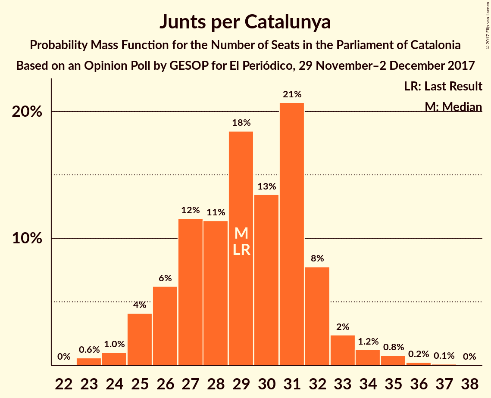
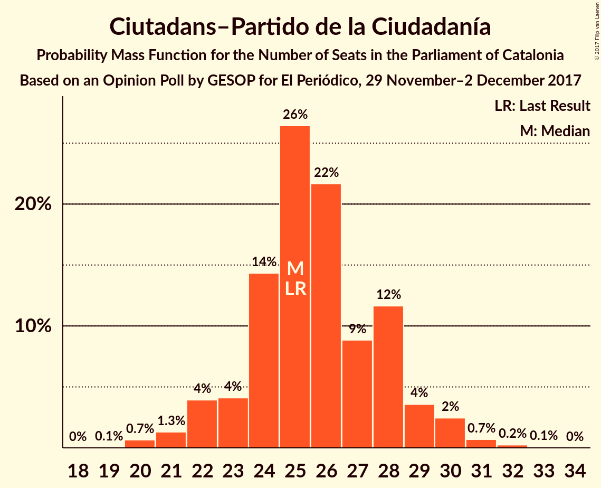
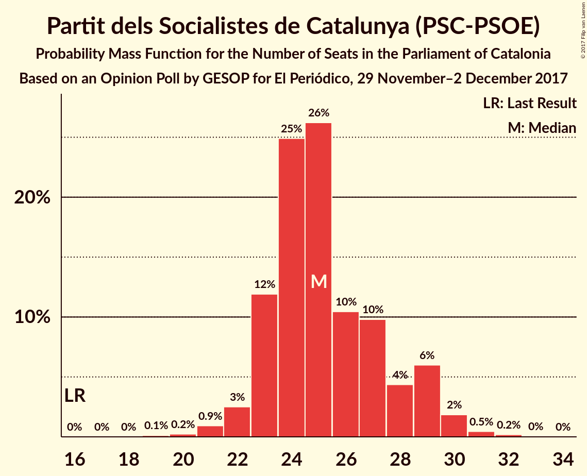
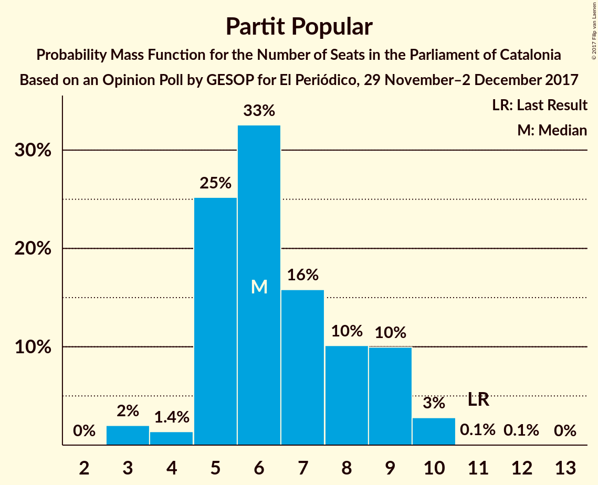

# Opinion Poll by GESOP for El Periódico, 29 November–2 December 2017

<a href="#voting-intentions">Voting Intentions</a> | <a href="#seats">Seats</a> | <a href="#coalitions">Coalitions</a> | <a href="#technical-information">Technical Information</a>

## Voting Intentions

### Confidence Intervals

| Party | Last Result | Poll Result | 80% Confidence Interval | 90% Confidence Interval | 95% Confidence Interval | 99% Confidence Interval |
|:-----:|:-----------:|:-----------:|:-----------------------:|:-----------------------:|:-----------------------:|:-----------------------:|
| Esquerra Republicana de Catalunya–Catalunya Sí | 39.6% | 20.5% | 18.7–22.4% |18.3–23.0% |17.8–23.4% |17.0–24.4% |
| Junts per Catalunya | 39.6% | 19.2% | 17.5–21.1% |17.1–21.7% |16.7–22.1% |15.9–23.1% |
| Ciutadans–Partido de la Ciudadanía | 17.9% | 19.0% | 17.3–20.9% |16.8–21.4% |16.4–21.9% |15.7–22.8% |
| Partit dels Socialistes de Catalunya (PSC-PSOE) | 12.7% | 19.0% | 17.3–20.9% |16.8–21.4% |16.4–21.9% |15.7–22.8% |
| Catalunya en Comú | 8.9% | 8.5% | 7.3–9.9% |7.0–10.3% |6.8–10.6% |6.2–11.4% |
| Candidatura d’Unitat Popular | 8.2% | 6.0% | 5.0–7.2% |4.8–7.6% |4.6–7.9% |4.1–8.5% |
| Partit Popular | 8.5% | 5.8% | 4.8–7.0% |4.6–7.3% |4.3–7.6% |3.9–8.2% |

*Note:* The poll result column reflects the actual value used in the calculations. Published results may vary slightly, and in addition be rounded to fewer digits.

## Seats

### Confidence Intervals

| Party | Last Result | Median | 80% Confidence Interval | 90% Confidence Interval | 95% Confidence Interval | 99% Confidence Interval |
|:-----:|:-----------:|:------:|:-----------------------:|:-----------------------:|:-----------------------:|:-----------------------:|
| <a href="#esquerra-republicana-de-catalunya–catalunya-sí">Esquerra Republicana de Catalunya–Catalunya Sí</a> | 20 | 31 | 28–34 |27–35 |27–36 |25–37 |
| <a href="#junts-per-catalunya">Junts per Catalunya</a> | 29 | 29 | 26–32 |26–32 |25–33 |23–35 |
| <a href="#ciutadans–partido-de-la-ciudadanía">Ciutadans–Partido de la Ciudadanía</a> | 25 | 25 | 24–28 |22–29 |22–30 |20–31 |
| <a href="#partit-dels-socialistes-de-catalunya-(psc-psoe)">Partit dels Socialistes de Catalunya (PSC-PSOE)</a> | 16 | 25 | 23–28 |23–29 |22–29 |21–31 |
| <a href="#catalunya-en-comú">Catalunya en Comú</a> | 11 | 9 | 8–11 |8–12 |7–12 |6–14 |
| <a href="#candidatura-d’unitat-popular">Candidatura d’Unitat Popular</a> | 10 | 8 | 5–9 |5–9 |5–10 |3–10 |
| <a href="#partit-popular">Partit Popular</a> | 11 | 6 | 5–9 |5–9 |4–10 |3–10 |

### Esquerra Republicana de Catalunya–Catalunya Sí

*For a full overview of the results for this party, see the [Esquerra Republicana de Catalunya–Catalunya Sí](party-esquerrarepublicanadecatalunya–catalunyasí.html) page.*

| Number of Seats | Probability | Accumulated | Special Marks |
|:---------------:|:-----------:|:-----------:|:-------------:|
| 20 | 0% | 100% | Last Result |
| 21 | 0% | 100% |  |
| 22 | 0% | 100% |  |
| 23 | 0% | 100% |  |
| 24 | 0.1% | 100% |  |
| 25 | 0.6% | 99.8% |  |
| 26 | 1.1% | 99.3% |  |
| 27 | 3% | 98% |  |
| 28 | 5% | 95% |  |
| 29 | 15% | 90% |  |
| 30 | 12% | 74% |  |
| 31 | 23% | 63% | Median |
| 32 | 19% | 40% |  |
| 33 | 8% | 21% |  |
| 34 | 5% | 13% |  |
| 35 | 4% | 8% |  |
| 36 | 2% | 4% |  |
| 37 | 2% | 2% |  |
| 38 | 0.4% | 0.4% |  |
| 39 | 0% | 0% |  |

### Junts per Catalunya

*For a full overview of the results for this party, see the [Junts per Catalunya](party-juntspercatalunya.html) page.*

| Number of Seats | Probability | Accumulated | Special Marks |
|:---------------:|:-----------:|:-----------:|:-------------:|
| 23 | 0.8% | 100% |  |
| 24 | 1.2% | 99.2% |  |
| 25 | 3% | 98% |  |
| 26 | 7% | 95% |  |
| 27 | 14% | 88% |  |
| 28 | 16% | 75% |  |
| 29 | 14% | 59% | Last Result, Median |
| 30 | 7% | 45% |  |
| 31 | 24% | 38% |  |
| 32 | 9% | 13% |  |
| 33 | 2% | 4% |  |
| 34 | 1.2% | 2% |  |
| 35 | 0.5% | 1.0% |  |
| 36 | 0.3% | 0.5% |  |
| 37 | 0.1% | 0.1% |  |
| 38 | 0% | 0% |  |

### Ciutadans–Partido de la Ciudadanía

*For a full overview of the results for this party, see the [Ciutadans–Partido de la Ciudadanía](party-ciutadans–partidodelaciudadanía.html) page.*

| Number of Seats | Probability | Accumulated | Special Marks |
|:---------------:|:-----------:|:-----------:|:-------------:|
| 19 | 0.1% | 100% |  |
| 20 | 0.7% | 99.9% |  |
| 21 | 1.3% | 99.3% |  |
| 22 | 4% | 98% |  |
| 23 | 4% | 94% |  |
| 24 | 15% | 90% |  |
| 25 | 26% | 75% | Last Result, Median |
| 26 | 21% | 49% |  |
| 27 | 8% | 27% |  |
| 28 | 12% | 19% |  |
| 29 | 3% | 7% |  |
| 30 | 2% | 3% |  |
| 31 | 0.6% | 0.9% |  |
| 32 | 0.2% | 0.3% |  |
| 33 | 0.1% | 0.1% |  |
| 34 | 0% | 0% |  |

### Partit dels Socialistes de Catalunya (PSC-PSOE)

*For a full overview of the results for this party, see the [Partit dels Socialistes de Catalunya (PSC-PSOE)](party-partitdelssocialistesdecatalunyapsc-psoe.html) page.*

| Number of Seats | Probability | Accumulated | Special Marks |
|:---------------:|:-----------:|:-----------:|:-------------:|
| 16 | 0% | 100% | Last Result |
| 17 | 0% | 100% |  |
| 18 | 0% | 100% |  |
| 19 | 0.1% | 100% |  |
| 20 | 0.2% | 99.8% |  |
| 21 | 0.7% | 99.6% |  |
| 22 | 3% | 98.9% |  |
| 23 | 12% | 96% |  |
| 24 | 25% | 84% |  |
| 25 | 26% | 59% | Median |
| 26 | 12% | 33% |  |
| 27 | 9% | 21% |  |
| 28 | 4% | 12% |  |
| 29 | 6% | 8% |  |
| 30 | 2% | 2% |  |
| 31 | 0.5% | 0.7% |  |
| 32 | 0.2% | 0.3% |  |
| 33 | 0% | 0% |  |

### Catalunya en Comú

*For a full overview of the results for this party, see the [Catalunya en Comú](party-catalunyaencomú.html) page.*

| Number of Seats | Probability | Accumulated | Special Marks |
|:---------------:|:-----------:|:-----------:|:-------------:|
| 5 | 0.1% | 100% |  |
| 6 | 1.0% | 99.9% |  |
| 7 | 2% | 98.8% |  |
| 8 | 22% | 97% |  |
| 9 | 29% | 75% | Median |
| 10 | 10% | 45% |  |
| 11 | 26% | 36% | Last Result |
| 12 | 7% | 10% |  |
| 13 | 1.4% | 2% |  |
| 14 | 0.9% | 1.0% |  |
| 15 | 0.1% | 0.1% |  |
| 16 | 0% | 0% |  |

### Candidatura d’Unitat Popular

*For a full overview of the results for this party, see the [Candidatura d’Unitat Popular](party-candidaturad’unitatpopular.html) page.*

| Number of Seats | Probability | Accumulated | Special Marks |
|:---------------:|:-----------:|:-----------:|:-------------:|
| 3 | 0.9% | 100% |  |
| 4 | 0.9% | 99.1% |  |
| 5 | 9% | 98% |  |
| 6 | 3% | 89% |  |
| 7 | 5% | 85% |  |
| 8 | 49% | 81% | Median |
| 9 | 27% | 32% |  |
| 10 | 4% | 4% | Last Result |
| 11 | 0.1% | 0.2% |  |
| 12 | 0.2% | 0.2% |  |
| 13 | 0% | 0% |  |

### Partit Popular

*For a full overview of the results for this party, see the [Partit Popular](party-partitpopular.html) page.*

| Number of Seats | Probability | Accumulated | Special Marks |
|:---------------:|:-----------:|:-----------:|:-------------:|
| 3 | 2% | 100% |  |
| 4 | 1.3% | 98% |  |
| 5 | 26% | 97% |  |
| 6 | 31% | 71% | Median |
| 7 | 17% | 40% |  |
| 8 | 10% | 23% |  |
| 9 | 10% | 13% |  |
| 10 | 3% | 3% |  |
| 11 | 0.1% | 0.2% | Last Result |
| 12 | 0.1% | 0.1% |  |
| 13 | 0% | 0% |  |

## Coalitions

### Confidence Intervals

| Coalition | Last Result | Median | Majority? | 80% Confidence Interval | 90% Confidence Interval | 95% Confidence Interval | 99% Confidence Interval |
|:---------:|:-----------:|:------:|:---------:|:-----------------------:|:-----------------------:|:-----------------------:|:-----------------------:|
| Esquerra Republicana de Catalunya–Catalunya Sí – Junts per Catalunya – Catalunya en Comú | 60 | 70 | 81% | 66–73 | 65–74 | 65–75 | 63–77 |
| Esquerra Republicana de Catalunya–Catalunya Sí – Junts per Catalunya – Candidatura d’Unitat Popular | 59 | 68 | 60% | 65–71 | 64–72 | 63–73 | 61–75 |
| Ciutadans–Partido de la Ciudadanía – Partit dels Socialistes de Catalunya (PSC-PSOE) – Catalunya en Comú – Partit Popular | 63 | 67 | 40% | 64–70 | 63–71 | 62–72 | 60–74 |
| Esquerra Republicana de Catalunya–Catalunya Sí – Junts per Catalunya | 49 | 60 | 0.3% | 57–64 | 56–65 | 55–66 | 53–67 |
| Ciutadans–Partido de la Ciudadanía – Partit dels Socialistes de Catalunya (PSC-PSOE) – Partit Popular | 52 | 57 | 0% | 54–61 | 53–62 | 52–63 | 51–64 |

### Esquerra Republicana de Catalunya–Catalunya Sí – Junts per Catalunya – Catalunya en Comú

| Number of Seats | Probability | Accumulated | Special Marks |
|:---------------:|:-----------:|:-----------:|:-------------:|
| 60 | 0% | 100% | Last Result |
| 61 | 0.1% | 100% |  |
| 62 | 0.2% | 99.9% |  |
| 63 | 0.6% | 99.7% |  |
| 64 | 1.3% | 99.1% |  |
| 65 | 3% | 98% |  |
| 66 | 6% | 95% |  |
| 67 | 8% | 89% |  |
| 68 | 10% | 81% | Majority |
| 69 | 13% | 71% | Median |
| 70 | 17% | 58% |  |
| 71 | 14% | 41% |  |
| 72 | 13% | 28% |  |
| 73 | 6% | 15% |  |
| 74 | 5% | 9% |  |
| 75 | 2% | 4% |  |
| 76 | 1.2% | 2% |  |
| 77 | 0.4% | 0.6% |  |
| 78 | 0.2% | 0.2% |  |
| 79 | 0% | 0% |  |

### Esquerra Republicana de Catalunya–Catalunya Sí – Junts per Catalunya – Candidatura d’Unitat Popular

| Number of Seats | Probability | Accumulated | Special Marks |
|:---------------:|:-----------:|:-----------:|:-------------:|
| 59 | 0.1% | 100% | Last Result |
| 60 | 0.1% | 99.9% |  |
| 61 | 0.4% | 99.8% |  |
| 62 | 1.3% | 99.3% |  |
| 63 | 2% | 98% |  |
| 64 | 5% | 96% |  |
| 65 | 8% | 91% |  |
| 66 | 9% | 83% |  |
| 67 | 14% | 74% |  |
| 68 | 15% | 60% | Median, Majority |
| 69 | 15% | 46% |  |
| 70 | 11% | 30% |  |
| 71 | 10% | 20% |  |
| 72 | 5% | 10% |  |
| 73 | 3% | 5% |  |
| 74 | 1.1% | 2% |  |
| 75 | 0.5% | 0.8% |  |
| 76 | 0.2% | 0.3% |  |
| 77 | 0% | 0.1% |  |
| 78 | 0% | 0% |  |

### Ciutadans–Partido de la Ciudadanía – Partit dels Socialistes de Catalunya (PSC-PSOE) – Catalunya en Comú – Partit Popular

| Number of Seats | Probability | Accumulated | Special Marks |
|:---------------:|:-----------:|:-----------:|:-------------:|
| 58 | 0% | 100% |  |
| 59 | 0.2% | 99.9% |  |
| 60 | 0.5% | 99.7% |  |
| 61 | 1.1% | 99.2% |  |
| 62 | 3% | 98% |  |
| 63 | 5% | 95% | Last Result |
| 64 | 10% | 90% |  |
| 65 | 11% | 80% | Median |
| 66 | 15% | 70% |  |
| 67 | 15% | 54% |  |
| 68 | 14% | 40% | Majority |
| 69 | 9% | 26% |  |
| 70 | 8% | 17% |  |
| 71 | 5% | 9% |  |
| 72 | 2% | 4% |  |
| 73 | 1.3% | 2% |  |
| 74 | 0.4% | 0.7% |  |
| 75 | 0.1% | 0.2% |  |
| 76 | 0.1% | 0.1% |  |
| 77 | 0% | 0% |  |

### Esquerra Republicana de Catalunya–Catalunya Sí – Junts per Catalunya

| Number of Seats | Probability | Accumulated | Special Marks |
|:---------------:|:-----------:|:-----------:|:-------------:|
| 49 | 0% | 100% | Last Result |
| 50 | 0% | 100% |  |
| 51 | 0% | 100% |  |
| 52 | 0.1% | 100% |  |
| 53 | 0.3% | 99.8% |  |
| 54 | 1.0% | 99.5% |  |
| 55 | 2% | 98.5% |  |
| 56 | 4% | 96% |  |
| 57 | 8% | 92% |  |
| 58 | 9% | 84% |  |
| 59 | 12% | 75% |  |
| 60 | 17% | 63% | Median |
| 61 | 14% | 46% |  |
| 62 | 12% | 31% |  |
| 63 | 9% | 20% |  |
| 64 | 5% | 10% |  |
| 65 | 3% | 5% |  |
| 66 | 2% | 3% |  |
| 67 | 0.8% | 1.0% |  |
| 68 | 0.2% | 0.3% | Majority |
| 69 | 0.1% | 0.1% |  |
| 70 | 0% | 0% |  |

### Ciutadans–Partido de la Ciudadanía – Partit dels Socialistes de Catalunya (PSC-PSOE) – Partit Popular

| Number of Seats | Probability | Accumulated | Special Marks |
|:---------------:|:-----------:|:-----------:|:-------------:|
| 49 | 0.1% | 100% |  |
| 50 | 0.3% | 99.9% |  |
| 51 | 0.6% | 99.6% |  |
| 52 | 2% | 99.0% | Last Result |
| 53 | 4% | 97% |  |
| 54 | 7% | 93% |  |
| 55 | 13% | 86% |  |
| 56 | 15% | 73% | Median |
| 57 | 14% | 58% |  |
| 58 | 13% | 43% |  |
| 59 | 10% | 31% |  |
| 60 | 9% | 21% |  |
| 61 | 7% | 12% |  |
| 62 | 3% | 5% |  |
| 63 | 1.5% | 3% |  |
| 64 | 0.7% | 1.1% |  |
| 65 | 0.3% | 0.4% |  |
| 66 | 0.1% | 0.1% |  |
| 67 | 0% | 0% |  |

## Technical Information

### Opinion Poll

+ **Polling firm:** GESOP
+ **Commissioner(s):** El Periódico
+ **Fieldwork period:** 29 November–2 December 2017

### Calculations

+ **Sample size:** 800
+ **Simulations done:** 1,048,576
+ **Error estimate:** 1.16%

