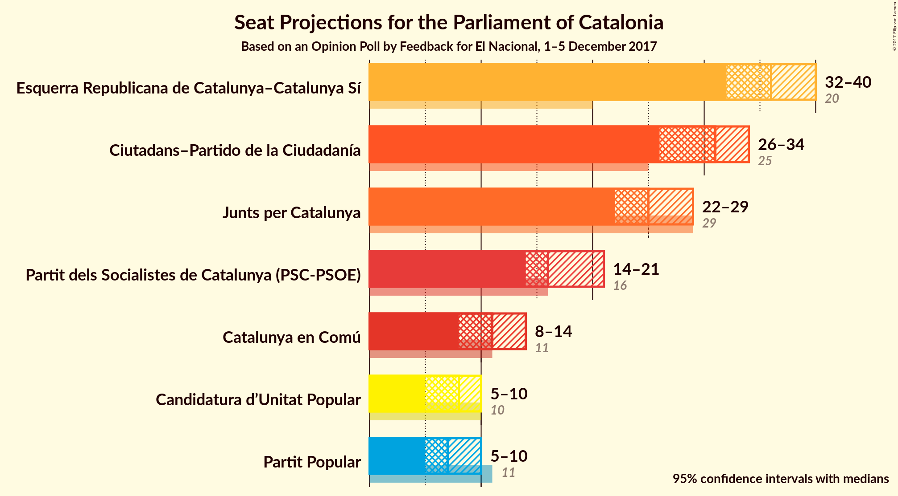
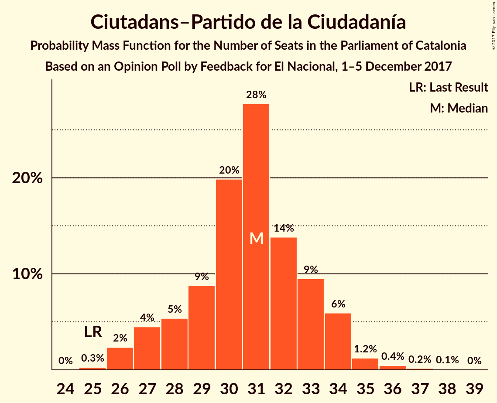
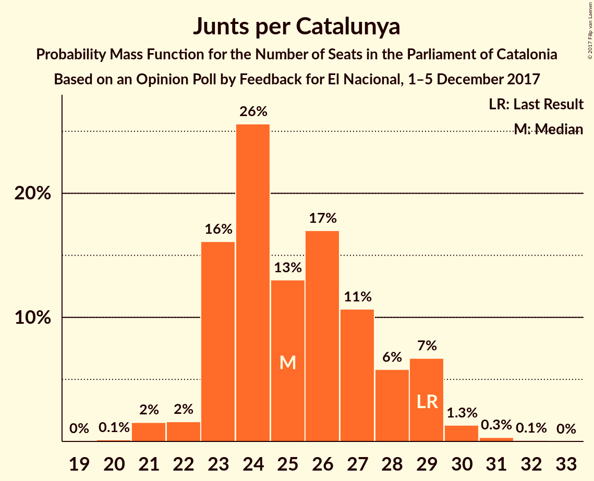
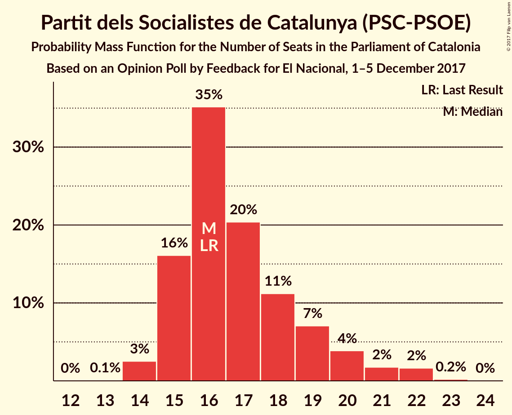

# Opinion Poll by Feedback for El Nacional, 1–5 December 2017

<a href="#voting-intentions">Voting Intentions</a> | <a href="#seats">Seats</a> | <a href="#coalitions">Coalitions</a> | <a href="#technical-information">Technical Information</a>

## Voting Intentions

### Confidence Intervals

| Party | Last Result | Poll Result | 80% Confidence Interval | 90% Confidence Interval | 95% Confidence Interval | 99% Confidence Interval |
|:-----:|:-----------:|:-----------:|:-----------------------:|:-----------------------:|:-----------------------:|:-----------------------:|
| Esquerra Republicana de Catalunya–Catalunya Sí | 39.6% | 24.0% | 22.3–25.8% |21.9–26.3% |21.4–26.7% |20.7–27.6% |
| Ciutadans–Partido de la Ciudadanía | 17.9% | 22.8% | 21.2–24.6% |20.7–25.1% |20.3–25.5% |19.5–26.4% |
| Junts per Catalunya | 39.6% | 17.1% | 15.7–18.7% |15.2–19.2% |14.9–19.6% |14.2–20.4% |
| Partit dels Socialistes de Catalunya (PSC-PSOE) | 12.7% | 13.5% | 12.2–15.0% |11.8–15.4% |11.5–15.8% |10.9–16.5% |
| Catalunya en Comú | 8.9% | 9.3% | 8.2–10.6% |7.9–10.9% |7.7–11.3% |7.2–11.9% |
| Candidatura d’Unitat Popular | 8.2% | 6.4% | 5.5–7.5% |5.3–7.8% |5.0–8.1% |4.6–8.7% |
| Partit Popular | 8.5% | 6.2% | 5.3–7.3% |5.1–7.6% |4.9–7.9% |4.5–8.4% |

*Note:* The poll result column reflects the actual value used in the calculations. Published results may vary slightly, and in addition be rounded to fewer digits.

## Seats

### Confidence Intervals

| Party | Last Result | Median | 80% Confidence Interval | 90% Confidence Interval | 95% Confidence Interval | 99% Confidence Interval |
|:-----:|:-----------:|:------:|:-----------------------:|:-----------------------:|:-----------------------:|:-----------------------:|
| <a href="#esquerra-republicana-de-catalunya–catalunya-sí">Esquerra Republicana de Catalunya–Catalunya Sí</a> | 20 | 36 | 33–39 |32–40 |32–40 |31–42 |
| <a href="#ciutadans–partido-de-la-ciudadanía">Ciutadans–Partido de la Ciudadanía</a> | 25 | 31 | 28–33 |27–34 |26–34 |26–36 |
| <a href="#junts-per-catalunya">Junts per Catalunya</a> | 29 | 25 | 23–28 |23–29 |22–29 |21–30 |
| <a href="#partit-dels-socialistes-de-catalunya-(psc-psoe)">Partit dels Socialistes de Catalunya (PSC-PSOE)</a> | 16 | 17 | 15–19 |15–20 |15–21 |14–22 |
| <a href="#catalunya-en-comú">Catalunya en Comú</a> | 11 | 11 | 9–12 |8–13 |8–14 |8–14 |
| <a href="#candidatura-d’unitat-popular">Candidatura d’Unitat Popular</a> | 10 | 8 | 7–9 |7–9 |5–10 |4–10 |
| <a href="#partit-popular">Partit Popular</a> | 11 | 7 | 5–9 |5–9 |5–10 |4–10 |

### Esquerra Republicana de Catalunya–Catalunya Sí

*For a full overview of the results for this party, see the [Esquerra Republicana de Catalunya–Catalunya Sí](party-esquerrarepublicanadecatalunya–catalunyasí.html) page.*

| Number of Seats | Probability | Accumulated | Special Marks |
|:---------------:|:-----------:|:-----------:|:-------------:|
| 20 | 0% | 100% | Last Result |
| 21 | 0% | 100% |  |
| 22 | 0% | 100% |  |
| 23 | 0% | 100% |  |
| 24 | 0% | 100% |  |
| 25 | 0% | 100% |  |
| 26 | 0% | 100% |  |
| 27 | 0% | 100% |  |
| 28 | 0% | 100% |  |
| 29 | 0.1% | 100% |  |
| 30 | 0.4% | 99.9% |  |
| 31 | 0.9% | 99.6% |  |
| 32 | 4% | 98.6% |  |
| 33 | 5% | 95% |  |
| 34 | 6% | 89% |  |
| 35 | 17% | 84% |  |
| 36 | 18% | 66% | Median |
| 37 | 23% | 49% |  |
| 38 | 13% | 26% |  |
| 39 | 8% | 13% |  |
| 40 | 4% | 6% |  |
| 41 | 0.8% | 2% |  |
| 42 | 0.7% | 1.1% |  |
| 43 | 0.3% | 0.3% |  |
| 44 | 0.1% | 0.1% |  |
| 45 | 0% | 0% |  |

### Ciutadans–Partido de la Ciudadanía

*For a full overview of the results for this party, see the [Ciutadans–Partido de la Ciudadanía](party-ciutadans–partidodelaciudadanía.html) page.*

| Number of Seats | Probability | Accumulated | Special Marks |
|:---------------:|:-----------:|:-----------:|:-------------:|
| 25 | 0.3% | 100% | Last Result |
| 26 | 3% | 99.7% |  |
| 27 | 4% | 97% |  |
| 28 | 5% | 93% |  |
| 29 | 11% | 88% |  |
| 30 | 21% | 76% |  |
| 31 | 25% | 56% | Median |
| 32 | 13% | 31% |  |
| 33 | 10% | 17% |  |
| 34 | 6% | 7% |  |
| 35 | 1.1% | 2% |  |
| 36 | 0.4% | 0.6% |  |
| 37 | 0.1% | 0.3% |  |
| 38 | 0.1% | 0.1% |  |
| 39 | 0% | 0% |  |

### Junts per Catalunya

*For a full overview of the results for this party, see the [Junts per Catalunya](party-juntspercatalunya.html) page.*

| Number of Seats | Probability | Accumulated | Special Marks |
|:---------------:|:-----------:|:-----------:|:-------------:|
| 19 | 0% | 100% |  |
| 20 | 0.1% | 99.9% |  |
| 21 | 2% | 99.8% |  |
| 22 | 1.4% | 98% |  |
| 23 | 18% | 97% |  |
| 24 | 25% | 79% |  |
| 25 | 12% | 54% | Median |
| 26 | 15% | 43% |  |
| 27 | 14% | 27% |  |
| 28 | 5% | 14% |  |
| 29 | 7% | 8% | Last Result |
| 30 | 1.3% | 2% |  |
| 31 | 0.3% | 0.4% |  |
| 32 | 0.1% | 0.1% |  |
| 33 | 0% | 0% |  |

### Partit dels Socialistes de Catalunya (PSC-PSOE)

*For a full overview of the results for this party, see the [Partit dels Socialistes de Catalunya (PSC-PSOE)](party-partitdelssocialistesdecatalunyapsc-psoe.html) page.*

| Number of Seats | Probability | Accumulated | Special Marks |
|:---------------:|:-----------:|:-----------:|:-------------:|
| 13 | 0.1% | 100% |  |
| 14 | 2% | 99.8% |  |
| 15 | 15% | 98% |  |
| 16 | 32% | 83% | Last Result |
| 17 | 24% | 50% | Median |
| 18 | 10% | 26% |  |
| 19 | 9% | 16% |  |
| 20 | 4% | 7% |  |
| 21 | 2% | 3% |  |
| 22 | 2% | 2% |  |
| 23 | 0.2% | 0.2% |  |
| 24 | 0% | 0% |  |

### Catalunya en Comú

*For a full overview of the results for this party, see the [Catalunya en Comú](party-catalunyaencomú.html) page.*

| Number of Seats | Probability | Accumulated | Special Marks |
|:---------------:|:-----------:|:-----------:|:-------------:|
| 7 | 0.2% | 100% |  |
| 8 | 5% | 99.8% |  |
| 9 | 23% | 94% |  |
| 10 | 9% | 72% |  |
| 11 | 34% | 63% | Last Result, Median |
| 12 | 20% | 29% |  |
| 13 | 5% | 9% |  |
| 14 | 3% | 4% |  |
| 15 | 0.4% | 0.5% |  |
| 16 | 0% | 0% |  |

### Candidatura d’Unitat Popular

*For a full overview of the results for this party, see the [Candidatura d’Unitat Popular](party-candidaturad’unitatpopular.html) page.*

| Number of Seats | Probability | Accumulated | Special Marks |
|:---------------:|:-----------:|:-----------:|:-------------:|
| 3 | 0.2% | 100% |  |
| 4 | 0.3% | 99.8% |  |
| 5 | 3% | 99.5% |  |
| 6 | 2% | 97% |  |
| 7 | 6% | 95% |  |
| 8 | 50% | 89% | Median |
| 9 | 34% | 39% |  |
| 10 | 5% | 5% | Last Result |
| 11 | 0.1% | 0.2% |  |
| 12 | 0.1% | 0.1% |  |
| 13 | 0% | 0% |  |

### Partit Popular

*For a full overview of the results for this party, see the [Partit Popular](party-partitpopular.html) page.*

| Number of Seats | Probability | Accumulated | Special Marks |
|:---------------:|:-----------:|:-----------:|:-------------:|
| 3 | 0.3% | 100% |  |
| 4 | 0.2% | 99.7% |  |
| 5 | 13% | 99.5% |  |
| 6 | 26% | 87% |  |
| 7 | 25% | 61% | Median |
| 8 | 22% | 36% |  |
| 9 | 10% | 14% |  |
| 10 | 4% | 5% |  |
| 11 | 0.2% | 0.2% | Last Result |
| 12 | 0.1% | 0.1% |  |
| 13 | 0% | 0% |  |

## Coalitions

### Confidence Intervals

| Coalition | Last Result | Median | Majority? | 80% Confidence Interval | 90% Confidence Interval | 95% Confidence Interval | 99% Confidence Interval |
|:---------:|:-----------:|:------:|:---------:|:-----------------------:|:-----------------------:|:-----------------------:|:-----------------------:|
| Esquerra Republicana de Catalunya–Catalunya Sí – Junts per Catalunya – Catalunya en Comú | 60 | 72 | 97% | 69–75 | 68–76 | 67–77 | 66–79 |
| Esquerra Republicana de Catalunya–Catalunya Sí – Junts per Catalunya – Candidatura d’Unitat Popular | 59 | 69 | 85% | 67–73 | 66–73 | 65–74 | 63–76 |
| Ciutadans–Partido de la Ciudadanía – Partit dels Socialistes de Catalunya (PSC-PSOE) – Catalunya en Comú – Partit Popular | 63 | 66 | 15% | 62–68 | 62–69 | 61–70 | 59–72 |
| Esquerra Republicana de Catalunya–Catalunya Sí – Junts per Catalunya | 49 | 61 | 0.8% | 59–65 | 58–65 | 57–66 | 55–68 |
| Ciutadans–Partido de la Ciudadanía – Partit dels Socialistes de Catalunya (PSC-PSOE) – Partit Popular | 52 | 55 | 0% | 51–58 | 51–59 | 50–60 | 48–61 |

### Esquerra Republicana de Catalunya–Catalunya Sí – Junts per Catalunya – Catalunya en Comú

| Number of Seats | Probability | Accumulated | Special Marks |
|:---------------:|:-----------:|:-----------:|:-------------:|
| 60 | 0% | 100% | Last Result |
| 61 | 0% | 100% |  |
| 62 | 0% | 100% |  |
| 63 | 0% | 100% |  |
| 64 | 0.1% | 100% |  |
| 65 | 0.3% | 99.9% |  |
| 66 | 0.9% | 99.6% |  |
| 67 | 2% | 98.7% |  |
| 68 | 3% | 97% | Majority |
| 69 | 7% | 94% |  |
| 70 | 12% | 87% |  |
| 71 | 14% | 75% |  |
| 72 | 18% | 62% | Median |
| 73 | 14% | 44% |  |
| 74 | 11% | 30% |  |
| 75 | 10% | 19% |  |
| 76 | 5% | 9% |  |
| 77 | 2% | 4% |  |
| 78 | 0.9% | 1.4% |  |
| 79 | 0.4% | 0.5% |  |
| 80 | 0.1% | 0.1% |  |
| 81 | 0% | 0% |  |

### Esquerra Republicana de Catalunya–Catalunya Sí – Junts per Catalunya – Candidatura d’Unitat Popular

| Number of Seats | Probability | Accumulated | Special Marks |
|:---------------:|:-----------:|:-----------:|:-------------:|
| 59 | 0% | 100% | Last Result |
| 60 | 0% | 100% |  |
| 61 | 0% | 100% |  |
| 62 | 0.2% | 100% |  |
| 63 | 0.6% | 99.8% |  |
| 64 | 1.3% | 99.2% |  |
| 65 | 2% | 98% |  |
| 66 | 4% | 96% |  |
| 67 | 7% | 92% |  |
| 68 | 15% | 85% | Majority |
| 69 | 21% | 70% | Median |
| 70 | 11% | 49% |  |
| 71 | 13% | 38% |  |
| 72 | 10% | 25% |  |
| 73 | 11% | 15% |  |
| 74 | 3% | 5% |  |
| 75 | 0.8% | 2% |  |
| 76 | 1.0% | 1.3% |  |
| 77 | 0.2% | 0.3% |  |
| 78 | 0.1% | 0.1% |  |
| 79 | 0% | 0% |  |

### Ciutadans–Partido de la Ciudadanía – Partit dels Socialistes de Catalunya (PSC-PSOE) – Catalunya en Comú – Partit Popular

| Number of Seats | Probability | Accumulated | Special Marks |
|:---------------:|:-----------:|:-----------:|:-------------:|
| 57 | 0.1% | 100% |  |
| 58 | 0.2% | 99.9% |  |
| 59 | 1.0% | 99.7% |  |
| 60 | 0.8% | 98.7% |  |
| 61 | 3% | 98% |  |
| 62 | 11% | 95% |  |
| 63 | 10% | 85% | Last Result |
| 64 | 13% | 75% |  |
| 65 | 11% | 62% |  |
| 66 | 21% | 51% | Median |
| 67 | 15% | 30% |  |
| 68 | 7% | 15% | Majority |
| 69 | 4% | 8% |  |
| 70 | 2% | 4% |  |
| 71 | 1.3% | 2% |  |
| 72 | 0.6% | 0.8% |  |
| 73 | 0.2% | 0.2% |  |
| 74 | 0% | 0% |  |

### Esquerra Republicana de Catalunya–Catalunya Sí – Junts per Catalunya

| Number of Seats | Probability | Accumulated | Special Marks |
|:---------------:|:-----------:|:-----------:|:-------------:|
| 49 | 0% | 100% | Last Result |
| 50 | 0% | 100% |  |
| 51 | 0% | 100% |  |
| 52 | 0% | 100% |  |
| 53 | 0% | 100% |  |
| 54 | 0.2% | 100% |  |
| 55 | 0.6% | 99.8% |  |
| 56 | 1.3% | 99.2% |  |
| 57 | 2% | 98% |  |
| 58 | 5% | 96% |  |
| 59 | 10% | 91% |  |
| 60 | 16% | 81% |  |
| 61 | 19% | 65% | Median |
| 62 | 13% | 46% |  |
| 63 | 13% | 34% |  |
| 64 | 9% | 21% |  |
| 65 | 8% | 12% |  |
| 66 | 2% | 4% |  |
| 67 | 1.5% | 2% |  |
| 68 | 0.6% | 0.8% | Majority |
| 69 | 0.1% | 0.2% |  |
| 70 | 0% | 0.1% |  |
| 71 | 0% | 0% |  |

### Ciutadans–Partido de la Ciudadanía – Partit dels Socialistes de Catalunya (PSC-PSOE) – Partit Popular

| Number of Seats | Probability | Accumulated | Special Marks |
|:---------------:|:-----------:|:-----------:|:-------------:|
| 47 | 0.1% | 100% |  |
| 48 | 0.3% | 99.8% |  |
| 49 | 1.2% | 99.5% |  |
| 50 | 3% | 98% |  |
| 51 | 8% | 95% |  |
| 52 | 8% | 88% | Last Result |
| 53 | 13% | 80% |  |
| 54 | 17% | 67% |  |
| 55 | 16% | 50% | Median |
| 56 | 12% | 34% |  |
| 57 | 11% | 22% |  |
| 58 | 5% | 11% |  |
| 59 | 3% | 5% |  |
| 60 | 1.3% | 3% |  |
| 61 | 0.9% | 1.3% |  |
| 62 | 0.2% | 0.3% |  |
| 63 | 0.1% | 0.1% |  |
| 64 | 0% | 0% |  |

## Technical Information

### Opinion Poll

+ **Polling firm:** Feedback
+ **Commissioner(s):** El Nacional
+ **Fieldwork period:** 1–5 December 2017

### Calculations

+ **Sample size:** 1000
+ **Simulations done:** 1,048,576
+ **Error estimate:** 1.92%

