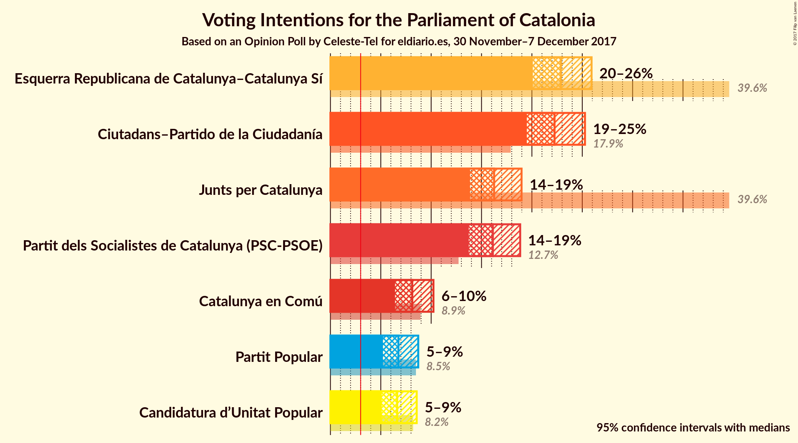
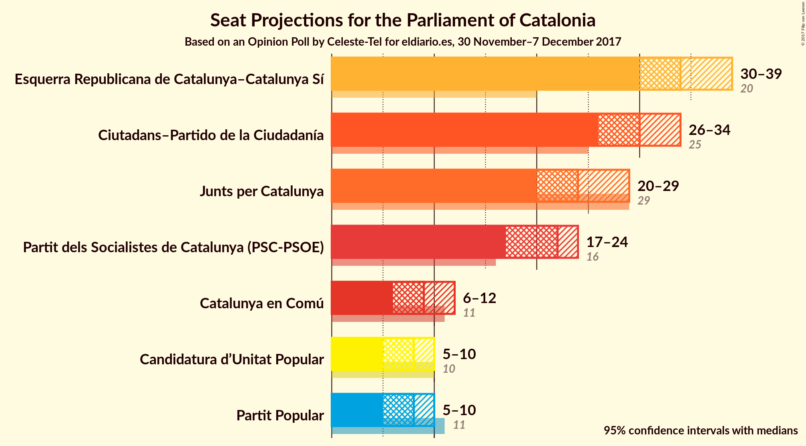
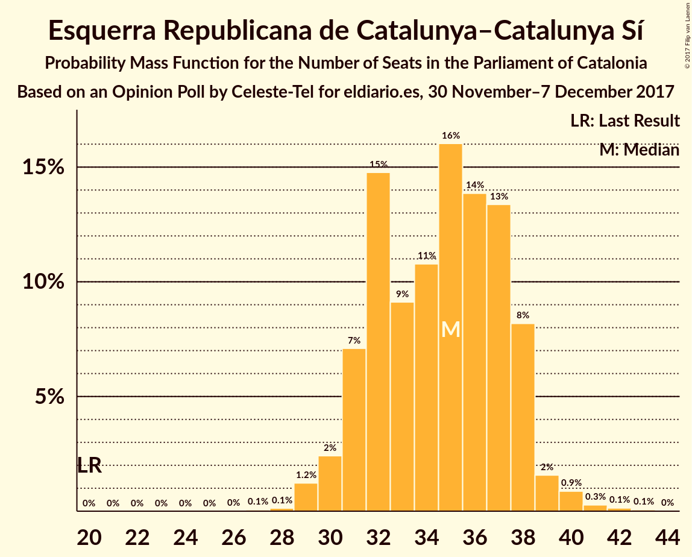
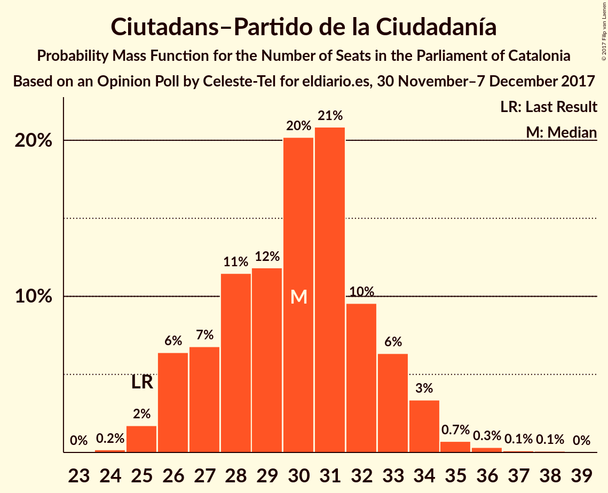
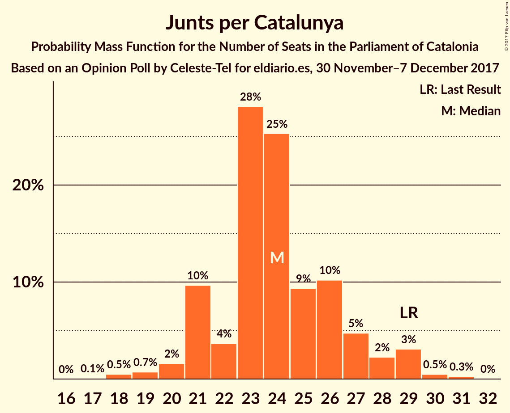
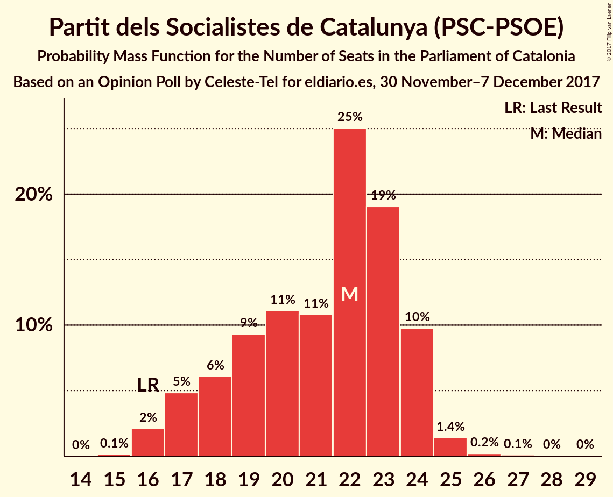
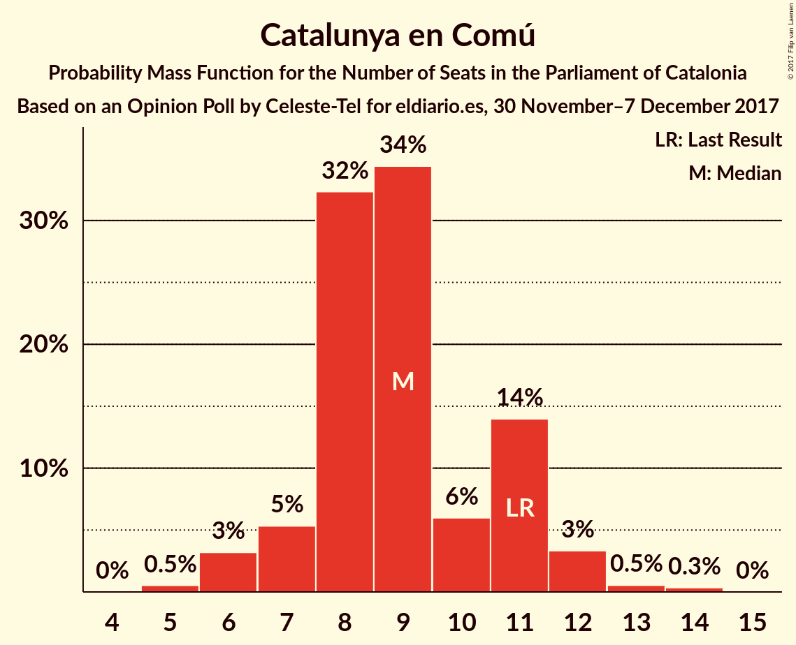
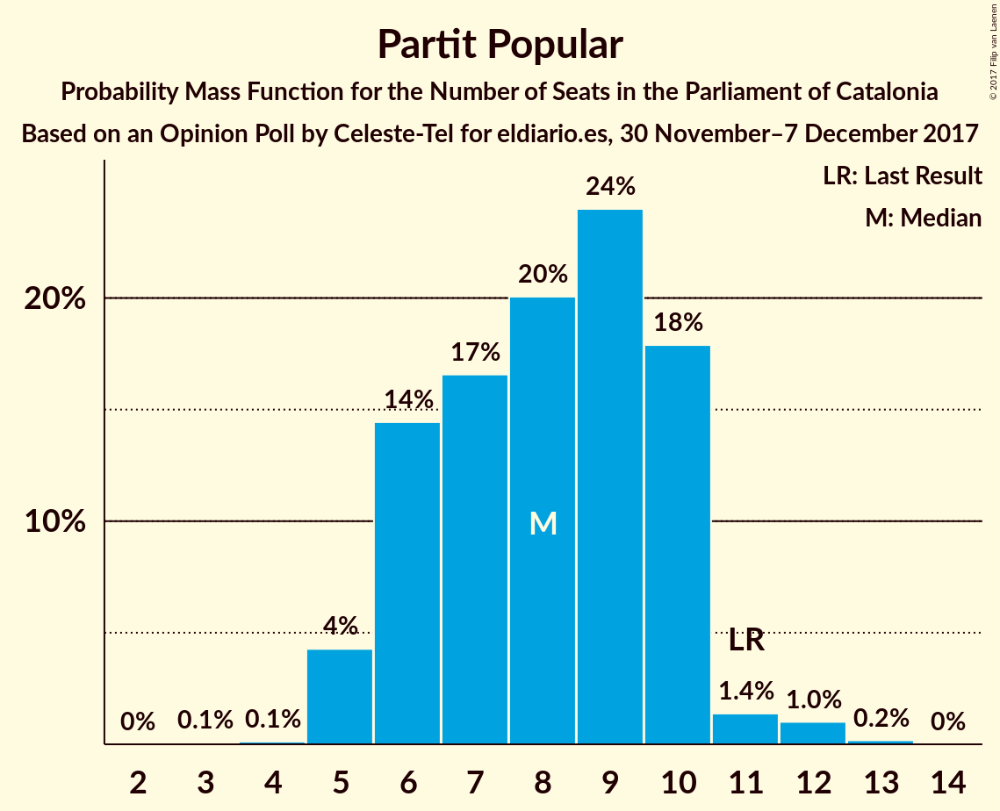
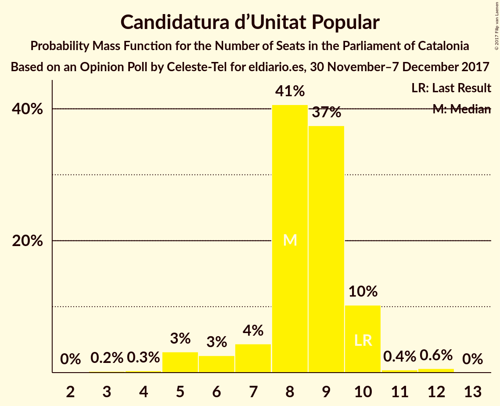
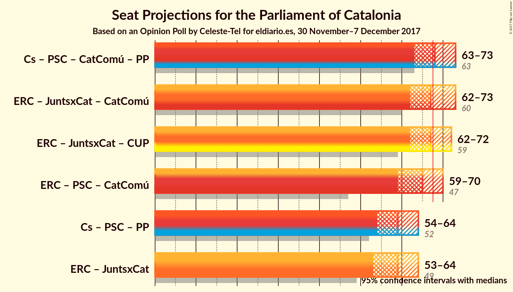

# Opinion Poll by Celeste-Tel for eldiario.es, 30 November–7 December 2017

<a href="#voting-intentions">Voting Intentions</a> | <a href="#seats">Seats</a> | <a href="#coalitions">Coalitions</a> | <a href="#technical-information">Technical Information</a>

## Voting Intentions

### Confidence Intervals

| Party | Last Result | Poll Result | 80% Confidence Interval | 90% Confidence Interval | 95% Confidence Interval | 99% Confidence Interval |
|:-----:|:-----------:|:-----------:|:-----------------------:|:-----------------------:|:-----------------------:|:-----------------------:|
| Esquerra Republicana de Catalunya–Catalunya Sí | 39.6% | 22.9% | 21.0–24.9% |20.5–25.4% |20.1–25.9% |19.3–26.9% |
| Ciutadans–Partido de la Ciudadanía | 17.9% | 22.2% | 20.4–24.2% |19.9–24.8% |19.5–25.3% |18.7–26.2% |
| Junts per Catalunya | 39.6% | 16.2% | 14.7–18.0% |14.2–18.5% |13.9–19.0% |13.1–19.9% |
| Partit dels Socialistes de Catalunya (PSC-PSOE) | 12.7% | 16.1% | 14.6–17.9% |14.1–18.4% |13.7–18.8% |13.0–19.7% |
| Catalunya en Comú | 8.9% | 8.1% | 7.0–9.5% |6.7–9.9% |6.4–10.2% |5.9–10.9% |
| Partit Popular | 8.5% | 6.8% | 5.7–8.0% |5.4–8.4% |5.2–8.7% |4.8–9.4% |
| Candidatura d’Unitat Popular | 8.2% | 6.6% | 5.6–7.9% |5.3–8.3% |5.1–8.6% |4.6–9.2% |

*Note:* The poll result column reflects the actual value used in the calculations. Published results may vary slightly, and in addition be rounded to fewer digits.

## Seats

### Confidence Intervals

| Party | Last Result | Median | 80% Confidence Interval | 90% Confidence Interval | 95% Confidence Interval | 99% Confidence Interval |
|:-----:|:-----------:|:------:|:-----------------------:|:-----------------------:|:-----------------------:|:-----------------------:|
| <a href="#esquerra-republicana-de-catalunya–catalunya-sí">Esquerra Republicana de Catalunya–Catalunya Sí</a> | 20 | 34 | 31–38 |31–38 |30–39 |29–41 |
| <a href="#ciutadans–partido-de-la-ciudadanía">Ciutadans–Partido de la Ciudadanía</a> | 25 | 30 | 27–33 |26–33 |26–34 |25–36 |
| <a href="#junts-per-catalunya">Junts per Catalunya</a> | 29 | 24 | 21–27 |21–28 |20–29 |18–30 |
| <a href="#partit-dels-socialistes-de-catalunya-(psc-psoe)">Partit dels Socialistes de Catalunya (PSC-PSOE)</a> | 16 | 22 | 18–24 |17–24 |17–24 |16–25 |
| <a href="#catalunya-en-comú">Catalunya en Comú</a> | 11 | 9 | 8–11 |7–11 |6–12 |5–13 |
| <a href="#partit-popular">Partit Popular</a> | 11 | 8 | 6–10 |5–10 |5–10 |5–12 |
| <a href="#candidatura-d’unitat-popular">Candidatura d’Unitat Popular</a> | 10 | 8 | 7–10 |6–10 |5–10 |4–12 |

### Esquerra Republicana de Catalunya–Catalunya Sí

*For a full overview of the results for this party, see the [Esquerra Republicana de Catalunya–Catalunya Sí](party-esquerrarepublicanadecatalunya–catalunyasí.html) page.*

| Number of Seats | Probability | Accumulated | Special Marks |
|:---------------:|:-----------:|:-----------:|:-------------:|
| 20 | 0% | 100% | Last Result |
| 21 | 0% | 100% |  |
| 22 | 0% | 100% |  |
| 23 | 0% | 100% |  |
| 24 | 0% | 100% |  |
| 25 | 0% | 100% |  |
| 26 | 0% | 100% |  |
| 27 | 0.1% | 100% |  |
| 28 | 0.1% | 99.9% |  |
| 29 | 1.4% | 99.8% |  |
| 30 | 2% | 98% |  |
| 31 | 8% | 96% |  |
| 32 | 17% | 88% |  |
| 33 | 10% | 71% |  |
| 34 | 12% | 61% | Median |
| 35 | 12% | 49% |  |
| 36 | 13% | 37% |  |
| 37 | 13% | 24% |  |
| 38 | 8% | 11% |  |
| 39 | 2% | 3% |  |
| 40 | 0.8% | 1.5% |  |
| 41 | 0.4% | 0.7% |  |
| 42 | 0.2% | 0.2% |  |
| 43 | 0.1% | 0.1% |  |
| 44 | 0% | 0% |  |

### Ciutadans–Partido de la Ciudadanía

*For a full overview of the results for this party, see the [Ciutadans–Partido de la Ciudadanía](party-ciutadans–partidodelaciudadanía.html) page.*

| Number of Seats | Probability | Accumulated | Special Marks |
|:---------------:|:-----------:|:-----------:|:-------------:|
| 24 | 0.2% | 100% |  |
| 25 | 2% | 99.8% | Last Result |
| 26 | 6% | 98% |  |
| 27 | 7% | 92% |  |
| 28 | 11% | 85% |  |
| 29 | 12% | 73% |  |
| 30 | 20% | 62% | Median |
| 31 | 21% | 41% |  |
| 32 | 10% | 21% |  |
| 33 | 6% | 11% |  |
| 34 | 3% | 5% |  |
| 35 | 0.7% | 1.3% |  |
| 36 | 0.3% | 0.5% |  |
| 37 | 0.1% | 0.2% |  |
| 38 | 0.1% | 0.1% |  |
| 39 | 0% | 0% |  |

### Junts per Catalunya

*For a full overview of the results for this party, see the [Junts per Catalunya](party-juntspercatalunya.html) page.*

| Number of Seats | Probability | Accumulated | Special Marks |
|:---------------:|:-----------:|:-----------:|:-------------:|
| 17 | 0.1% | 100% |  |
| 18 | 0.5% | 99.9% |  |
| 19 | 0.7% | 99.4% |  |
| 20 | 2% | 98.7% |  |
| 21 | 10% | 97% |  |
| 22 | 4% | 87% |  |
| 23 | 28% | 84% |  |
| 24 | 25% | 56% | Median |
| 25 | 9% | 30% |  |
| 26 | 10% | 21% |  |
| 27 | 5% | 11% |  |
| 28 | 2% | 6% |  |
| 29 | 3% | 4% | Last Result |
| 30 | 0.5% | 0.8% |  |
| 31 | 0.3% | 0.3% |  |
| 32 | 0% | 0% |  |

### Partit dels Socialistes de Catalunya (PSC-PSOE)

*For a full overview of the results for this party, see the [Partit dels Socialistes de Catalunya (PSC-PSOE)](party-partitdelssocialistesdecatalunyapsc-psoe.html) page.*

| Number of Seats | Probability | Accumulated | Special Marks |
|:---------------:|:-----------:|:-----------:|:-------------:|
| 15 | 0.1% | 100% |  |
| 16 | 2% | 99.9% | Last Result |
| 17 | 5% | 98% |  |
| 18 | 6% | 93% |  |
| 19 | 9% | 87% |  |
| 20 | 11% | 78% |  |
| 21 | 11% | 66% |  |
| 22 | 25% | 56% | Median |
| 23 | 19% | 31% |  |
| 24 | 10% | 12% |  |
| 25 | 1.4% | 2% |  |
| 26 | 0.2% | 0.4% |  |
| 27 | 0.1% | 0.2% |  |
| 28 | 0% | 0.1% |  |
| 29 | 0% | 0% |  |

### Catalunya en Comú

*For a full overview of the results for this party, see the [Catalunya en Comú](party-catalunyaencomú.html) page.*

| Number of Seats | Probability | Accumulated | Special Marks |
|:---------------:|:-----------:|:-----------:|:-------------:|
| 5 | 0.6% | 100% |  |
| 6 | 3% | 99.4% |  |
| 7 | 5% | 96% |  |
| 8 | 30% | 91% |  |
| 9 | 39% | 61% | Median |
| 10 | 3% | 21% |  |
| 11 | 13% | 18% | Last Result |
| 12 | 4% | 5% |  |
| 13 | 0.6% | 1.0% |  |
| 14 | 0.4% | 0.4% |  |
| 15 | 0% | 0% |  |

### Partit Popular

*For a full overview of the results for this party, see the [Partit Popular](party-partitpopular.html) page.*

| Number of Seats | Probability | Accumulated | Special Marks |
|:---------------:|:-----------:|:-----------:|:-------------:|
| 4 | 0.1% | 100% |  |
| 5 | 5% | 99.8% |  |
| 6 | 13% | 95% |  |
| 7 | 17% | 82% |  |
| 8 | 18% | 65% | Median |
| 9 | 24% | 47% |  |
| 10 | 20% | 23% |  |
| 11 | 1.3% | 2% | Last Result |
| 12 | 1.0% | 1.2% |  |
| 13 | 0.2% | 0.2% |  |
| 14 | 0% | 0% |  |

### Candidatura d’Unitat Popular

*For a full overview of the results for this party, see the [Candidatura d’Unitat Popular](party-candidaturad’unitatpopular.html) page.*

| Number of Seats | Probability | Accumulated | Special Marks |
|:---------------:|:-----------:|:-----------:|:-------------:|
| 3 | 0.2% | 100% |  |
| 4 | 0.4% | 99.8% |  |
| 5 | 3% | 99.4% |  |
| 6 | 2% | 97% |  |
| 7 | 5% | 95% |  |
| 8 | 41% | 90% | Median |
| 9 | 38% | 49% |  |
| 10 | 10% | 11% | Last Result |
| 11 | 0.5% | 1.1% |  |
| 12 | 0.6% | 0.6% |  |
| 13 | 0% | 0.1% |  |
| 14 | 0% | 0% |  |

## Coalitions

### Confidence Intervals

| Coalition | Last Result | Median | Majority? | 80% Confidence Interval | 90% Confidence Interval | 95% Confidence Interval | 99% Confidence Interval |
|:---------:|:-----------:|:------:|:---------:|:-----------------------:|:-----------------------:|:-----------------------:|:-----------------------:|
| Esquerra Republicana de Catalunya–Catalunya Sí – Junts per Catalunya – Candidatura d’Unitat Popular | 59 | 67 | 44% | 63–70 | 62–71 | 62–73 | 60–74 |
| Ciutadans–Partido de la Ciudadanía – Partit dels Socialistes de Catalunya (PSC-PSOE) – Catalunya en Comú – Partit Popular | 63 | 68 | 56% | 65–72 | 64–73 | 62–73 | 61–75 |
| Esquerra Republicana de Catalunya–Catalunya Sí – Junts per Catalunya – Catalunya en Comú | 60 | 68 | 51% | 64–71 | 63–72 | 62–73 | 61–75 |
| Esquerra Republicana de Catalunya–Catalunya Sí – Partit dels Socialistes de Catalunya (PSC-PSOE) – Catalunya en Comú | 47 | 64 | 15% | 61–68 | 60–69 | 59–70 | 57–72 |
| Ciutadans–Partido de la Ciudadanía – Partit dels Socialistes de Catalunya (PSC-PSOE) – Partit Popular | 52 | 59 | 0.1% | 56–63 | 55–64 | 54–64 | 52–66 |
| Esquerra Republicana de Catalunya–Catalunya Sí – Junts per Catalunya | 49 | 59 | 0.1% | 55–62 | 54–63 | 53–64 | 52–65 |

### Esquerra Republicana de Catalunya–Catalunya Sí – Junts per Catalunya – Candidatura d’Unitat Popular

| Number of Seats | Probability | Accumulated | Special Marks |
|:---------------:|:-----------:|:-----------:|:-------------:|
| 58 | 0.1% | 100% |  |
| 59 | 0.2% | 99.9% | Last Result |
| 60 | 0.6% | 99.7% |  |
| 61 | 1.5% | 99.1% |  |
| 62 | 4% | 98% |  |
| 63 | 10% | 94% |  |
| 64 | 9% | 84% |  |
| 65 | 12% | 75% |  |
| 66 | 7% | 63% | Median |
| 67 | 12% | 56% |  |
| 68 | 11% | 44% | Majority |
| 69 | 16% | 34% |  |
| 70 | 9% | 18% |  |
| 71 | 4% | 9% |  |
| 72 | 2% | 4% |  |
| 73 | 2% | 3% |  |
| 74 | 0.7% | 1.0% |  |
| 75 | 0.2% | 0.3% |  |
| 76 | 0.1% | 0.1% |  |
| 77 | 0% | 0% |  |

### Ciutadans–Partido de la Ciudadanía – Partit dels Socialistes de Catalunya (PSC-PSOE) – Catalunya en Comú – Partit Popular

| Number of Seats | Probability | Accumulated | Special Marks |
|:---------------:|:-----------:|:-----------:|:-------------:|
| 59 | 0.1% | 100% |  |
| 60 | 0.2% | 99.9% |  |
| 61 | 0.7% | 99.7% |  |
| 62 | 2% | 99.0% |  |
| 63 | 2% | 97% | Last Result |
| 64 | 4% | 96% |  |
| 65 | 9% | 91% |  |
| 66 | 16% | 82% |  |
| 67 | 11% | 66% |  |
| 68 | 12% | 56% | Majority |
| 69 | 7% | 44% | Median |
| 70 | 12% | 37% |  |
| 71 | 9% | 25% |  |
| 72 | 10% | 16% |  |
| 73 | 4% | 6% |  |
| 74 | 1.5% | 2% |  |
| 75 | 0.6% | 0.9% |  |
| 76 | 0.2% | 0.3% |  |
| 77 | 0.1% | 0.1% |  |
| 78 | 0% | 0% |  |

### Esquerra Republicana de Catalunya–Catalunya Sí – Junts per Catalunya – Catalunya en Comú

| Number of Seats | Probability | Accumulated | Special Marks |
|:---------------:|:-----------:|:-----------:|:-------------:|
| 59 | 0.1% | 100% |  |
| 60 | 0.2% | 99.9% | Last Result |
| 61 | 0.8% | 99.7% |  |
| 62 | 3% | 98.9% |  |
| 63 | 3% | 96% |  |
| 64 | 14% | 93% |  |
| 65 | 11% | 79% |  |
| 66 | 6% | 68% |  |
| 67 | 11% | 61% | Median |
| 68 | 11% | 51% | Majority |
| 69 | 14% | 39% |  |
| 70 | 13% | 25% |  |
| 71 | 7% | 12% |  |
| 72 | 2% | 5% |  |
| 73 | 2% | 3% |  |
| 74 | 0.5% | 1.1% |  |
| 75 | 0.4% | 0.6% |  |
| 76 | 0.1% | 0.2% |  |
| 77 | 0% | 0.1% |  |
| 78 | 0% | 0% |  |

### Esquerra Republicana de Catalunya–Catalunya Sí – Partit dels Socialistes de Catalunya (PSC-PSOE) – Catalunya en Comú

| Number of Seats | Probability | Accumulated | Special Marks |
|:---------------:|:-----------:|:-----------:|:-------------:|
| 47 | 0% | 100% | Last Result |
| 48 | 0% | 100% |  |
| 49 | 0% | 100% |  |
| 50 | 0% | 100% |  |
| 51 | 0% | 100% |  |
| 52 | 0% | 100% |  |
| 53 | 0% | 100% |  |
| 54 | 0% | 100% |  |
| 55 | 0% | 100% |  |
| 56 | 0.2% | 99.9% |  |
| 57 | 0.3% | 99.8% |  |
| 58 | 0.9% | 99.5% |  |
| 59 | 2% | 98.6% |  |
| 60 | 3% | 97% |  |
| 61 | 4% | 93% |  |
| 62 | 10% | 89% |  |
| 63 | 13% | 80% |  |
| 64 | 19% | 67% |  |
| 65 | 14% | 48% | Median |
| 66 | 8% | 34% |  |
| 67 | 10% | 25% |  |
| 68 | 7% | 15% | Majority |
| 69 | 4% | 8% |  |
| 70 | 2% | 3% |  |
| 71 | 0.8% | 1.4% |  |
| 72 | 0.4% | 0.5% |  |
| 73 | 0.1% | 0.1% |  |
| 74 | 0% | 0% |  |

### Ciutadans–Partido de la Ciudadanía – Partit dels Socialistes de Catalunya (PSC-PSOE) – Partit Popular

| Number of Seats | Probability | Accumulated | Special Marks |
|:---------------:|:-----------:|:-----------:|:-------------:|
| 50 | 0.1% | 100% |  |
| 51 | 0.2% | 99.9% |  |
| 52 | 0.4% | 99.7% | Last Result |
| 53 | 2% | 99.3% |  |
| 54 | 2% | 98% |  |
| 55 | 4% | 96% |  |
| 56 | 8% | 92% |  |
| 57 | 13% | 84% |  |
| 58 | 16% | 71% |  |
| 59 | 12% | 55% |  |
| 60 | 7% | 43% | Median |
| 61 | 10% | 37% |  |
| 62 | 10% | 26% |  |
| 63 | 10% | 17% |  |
| 64 | 4% | 7% |  |
| 65 | 2% | 2% |  |
| 66 | 0.5% | 0.7% |  |
| 67 | 0.2% | 0.2% |  |
| 68 | 0% | 0.1% | Majority |
| 69 | 0% | 0% |  |

### Esquerra Republicana de Catalunya–Catalunya Sí – Junts per Catalunya

| Number of Seats | Probability | Accumulated | Special Marks |
|:---------------:|:-----------:|:-----------:|:-------------:|
| 49 | 0% | 100% | Last Result |
| 50 | 0.1% | 100% |  |
| 51 | 0.3% | 99.9% |  |
| 52 | 0.8% | 99.6% |  |
| 53 | 3% | 98.8% |  |
| 54 | 4% | 96% |  |
| 55 | 11% | 92% |  |
| 56 | 13% | 81% |  |
| 57 | 9% | 68% |  |
| 58 | 7% | 59% | Median |
| 59 | 12% | 52% |  |
| 60 | 12% | 40% |  |
| 61 | 15% | 28% |  |
| 62 | 8% | 14% |  |
| 63 | 2% | 5% |  |
| 64 | 2% | 3% |  |
| 65 | 0.8% | 1.3% |  |
| 66 | 0.3% | 0.5% |  |
| 67 | 0.1% | 0.2% |  |
| 68 | 0% | 0.1% | Majority |
| 69 | 0% | 0% |  |

## Technical Information

### Opinion Poll

+ **Polling firm:** Celeste-Tel
+ **Commissioner(s):** eldiario.es
+ **Fieldwork period:** 30 November–7 December 2017

### Calculations

+ **Sample size:** 800
+ **Simulations done:** 262,144
+ **Error estimate:** 1.08%

