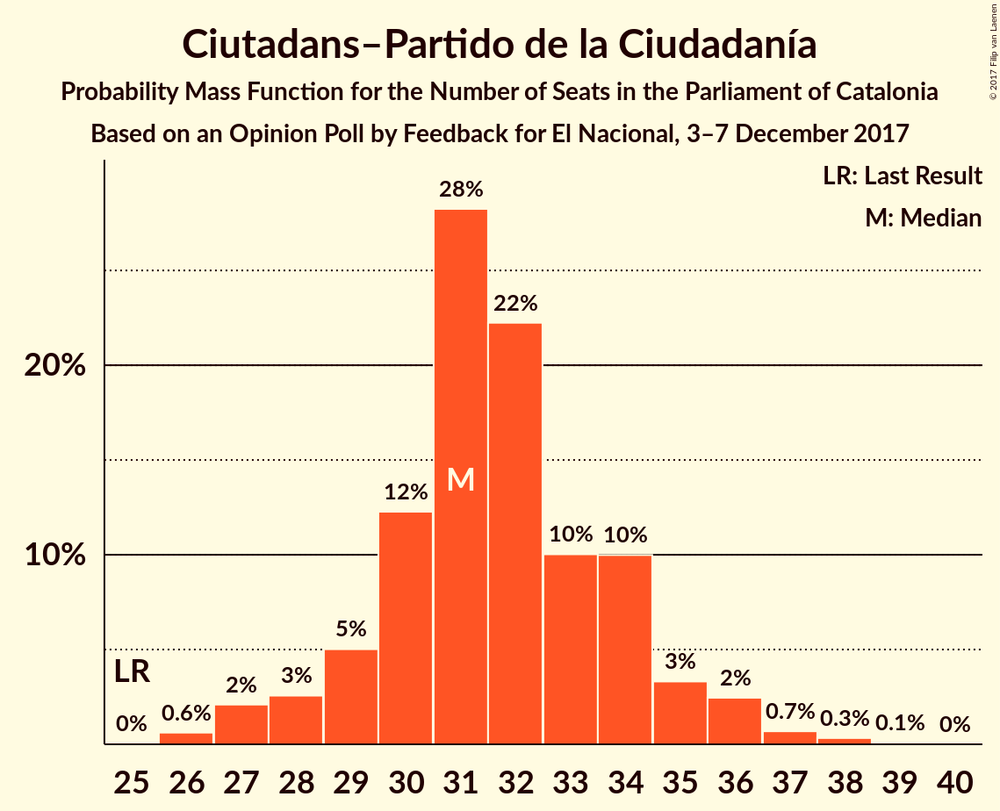
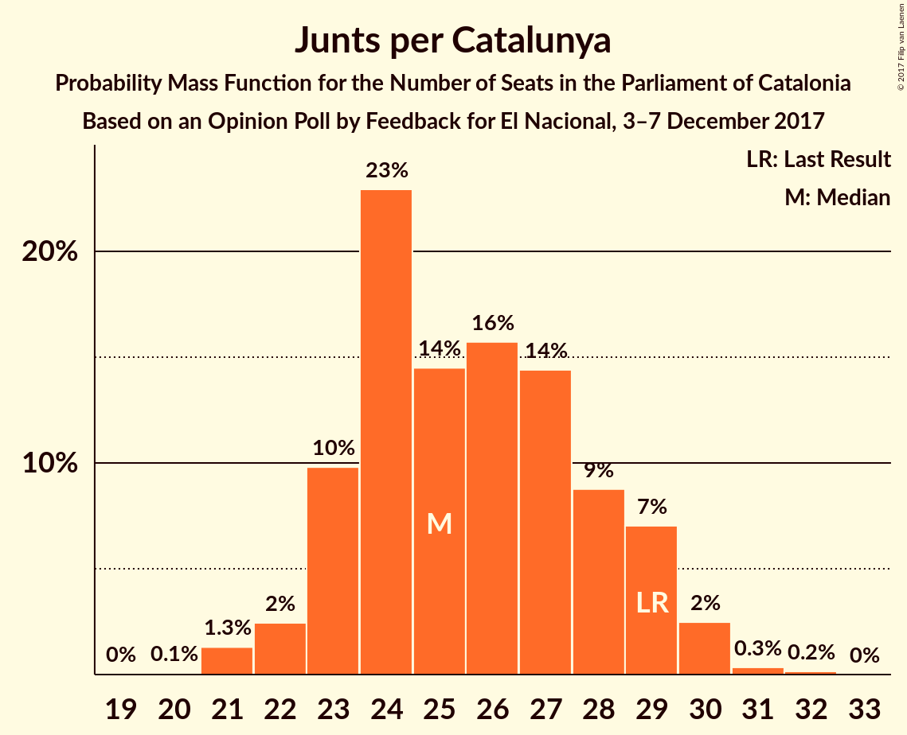
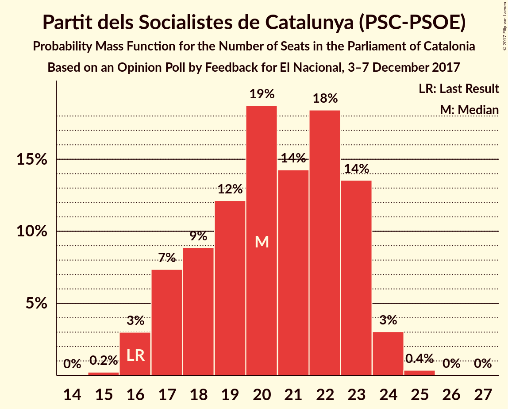
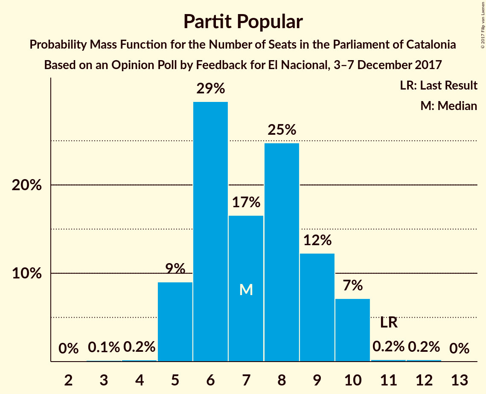

# Opinion Poll by Feedback for El Nacional, 3–7 December 2017

<a href="#voting-intentions">Voting Intentions</a> | <a href="#seats">Seats</a> | <a href="#coalitions">Coalitions</a> | <a href="#technical-information">Technical Information</a>

## Voting Intentions

### Confidence Intervals

| Party | Last Result | Poll Result | 80% Confidence Interval | 90% Confidence Interval | 95% Confidence Interval | 99% Confidence Interval |
|:-----:|:-----------:|:-----------:|:-----------------------:|:-----------------------:|:-----------------------:|:-----------------------:|
| Esquerra Republicana de Catalunya–Catalunya Sí | 39.6% | 23.1% | 21.4–24.9% |21.0–25.4% |20.6–25.8% |19.8–26.7% |
| Ciutadans–Partido de la Ciudadanía | 17.9% | 23.0% | 21.4–24.8% |20.9–25.3% |20.5–25.7% |19.7–26.6% |
| Junts per Catalunya | 39.6% | 17.0% | 15.5–18.6% |15.1–19.1% |14.8–19.5% |14.1–20.3% |
| Partit dels Socialistes de Catalunya (PSC-PSOE) | 12.7% | 15.3% | 13.9–16.9% |13.5–17.3% |13.2–17.7% |12.6–18.4% |
| Candidatura d’Unitat Popular | 8.2% | 7.1% | 6.2–8.3% |5.9–8.6% |5.7–8.9% |5.2–9.4% |
| Partit Popular | 8.5% | 6.2% | 5.3–7.3% |5.1–7.6% |4.9–7.9% |4.5–8.4% |
| Catalunya en Comú | 8.9% | 5.6% | 4.8–6.6% |4.5–7.0% |4.3–7.2% |4.0–7.7% |

*Note:* The poll result column reflects the actual value used in the calculations. Published results may vary slightly, and in addition be rounded to fewer digits.

## Seats

### Confidence Intervals

| Party | Last Result | Median | 80% Confidence Interval | 90% Confidence Interval | 95% Confidence Interval | 99% Confidence Interval |
|:-----:|:-----------:|:------:|:-----------------------:|:-----------------------:|:-----------------------:|:-----------------------:|
| <a href="#esquerra-republicana-de-catalunya–catalunya-sí">Esquerra Republicana de Catalunya–Catalunya Sí</a> | 20 | 36 | 32–38 |32–39 |31–39 |30–41 |
| <a href="#ciutadans–partido-de-la-ciudadanía">Ciutadans–Partido de la Ciudadanía</a> | 25 | 32 | 29–34 |29–35 |28–36 |26–37 |
| <a href="#junts-per-catalunya">Junts per Catalunya</a> | 29 | 25 | 23–29 |23–29 |22–30 |21–30 |
| <a href="#partit-dels-socialistes-de-catalunya-(psc-psoe)">Partit dels Socialistes de Catalunya (PSC-PSOE)</a> | 16 | 20 | 17–23 |17–23 |16–24 |16–24 |
| <a href="#candidatura-d’unitat-popular">Candidatura d’Unitat Popular</a> | 10 | 9 | 8–10 |8–10 |8–11 |6–12 |
| <a href="#partit-popular">Partit Popular</a> | 11 | 7 | 6–9 |5–10 |5–10 |5–10 |
| <a href="#catalunya-en-comú">Catalunya en Comú</a> | 11 | 5 | 4–7 |4–8 |4–8 |4–8 |

### Esquerra Republicana de Catalunya–Catalunya Sí

*For a full overview of the results for this party, see the [Esquerra Republicana de Catalunya–Catalunya Sí](party-esquerrarepublicanadecatalunya–catalunyasí.html) page.*

| Number of Seats | Probability | Accumulated | Special Marks |
|:---------------:|:-----------:|:-----------:|:-------------:|
| 20 | 0% | 100% | Last Result |
| 21 | 0% | 100% |  |
| 22 | 0% | 100% |  |
| 23 | 0% | 100% |  |
| 24 | 0% | 100% |  |
| 25 | 0% | 100% |  |
| 26 | 0% | 100% |  |
| 27 | 0% | 100% |  |
| 28 | 0% | 100% |  |
| 29 | 0.1% | 100% |  |
| 30 | 0.5% | 99.9% |  |
| 31 | 2% | 99.4% |  |
| 32 | 8% | 97% |  |
| 33 | 7% | 89% |  |
| 34 | 14% | 82% |  |
| 35 | 13% | 68% |  |
| 36 | 18% | 54% | Median |
| 37 | 16% | 36% |  |
| 38 | 15% | 21% |  |
| 39 | 4% | 6% |  |
| 40 | 1.4% | 2% |  |
| 41 | 0.4% | 0.8% |  |
| 42 | 0.3% | 0.4% |  |
| 43 | 0.1% | 0.1% |  |
| 44 | 0% | 0% |  |

### Ciutadans–Partido de la Ciudadanía

*For a full overview of the results for this party, see the [Ciutadans–Partido de la Ciudadanía](party-ciutadans–partidodelaciudadanía.html) page.*

| Number of Seats | Probability | Accumulated | Special Marks |
|:---------------:|:-----------:|:-----------:|:-------------:|
| 25 | 0% | 100% | Last Result |
| 26 | 0.7% | 100% |  |
| 27 | 2% | 99.2% |  |
| 28 | 2% | 98% |  |
| 29 | 5% | 95% |  |
| 30 | 13% | 90% |  |
| 31 | 26% | 77% |  |
| 32 | 25% | 51% | Median |
| 33 | 10% | 26% |  |
| 34 | 10% | 16% |  |
| 35 | 3% | 6% |  |
| 36 | 2% | 3% |  |
| 37 | 0.9% | 1.3% |  |
| 38 | 0.3% | 0.4% |  |
| 39 | 0.1% | 0.1% |  |
| 40 | 0% | 0% |  |

### Junts per Catalunya

*For a full overview of the results for this party, see the [Junts per Catalunya](party-juntspercatalunya.html) page.*

| Number of Seats | Probability | Accumulated | Special Marks |
|:---------------:|:-----------:|:-----------:|:-------------:|
| 20 | 0.1% | 100% |  |
| 21 | 0.9% | 99.9% |  |
| 22 | 2% | 98.9% |  |
| 23 | 11% | 97% |  |
| 24 | 28% | 86% |  |
| 25 | 15% | 58% | Median |
| 26 | 7% | 43% |  |
| 27 | 15% | 35% |  |
| 28 | 10% | 21% |  |
| 29 | 8% | 11% | Last Result |
| 30 | 3% | 3% |  |
| 31 | 0.2% | 0.4% |  |
| 32 | 0.2% | 0.2% |  |
| 33 | 0% | 0% |  |

### Partit dels Socialistes de Catalunya (PSC-PSOE)

*For a full overview of the results for this party, see the [Partit dels Socialistes de Catalunya (PSC-PSOE)](party-partitdelssocialistesdecatalunyapsc-psoe.html) page.*

| Number of Seats | Probability | Accumulated | Special Marks |
|:---------------:|:-----------:|:-----------:|:-------------:|
| 15 | 0.2% | 100% |  |
| 16 | 3% | 99.8% | Last Result |
| 17 | 8% | 96% |  |
| 18 | 8% | 89% |  |
| 19 | 14% | 80% |  |
| 20 | 17% | 66% | Median |
| 21 | 14% | 50% |  |
| 22 | 17% | 35% |  |
| 23 | 14% | 18% |  |
| 24 | 3% | 4% |  |
| 25 | 0.3% | 0.4% |  |
| 26 | 0% | 0% |  |

### Candidatura d’Unitat Popular

*For a full overview of the results for this party, see the [Candidatura d’Unitat Popular](party-candidaturad’unitatpopular.html) page.*

| Number of Seats | Probability | Accumulated | Special Marks |
|:---------------:|:-----------:|:-----------:|:-------------:|
| 5 | 0.2% | 100% |  |
| 6 | 0.3% | 99.8% |  |
| 7 | 0.7% | 99.5% |  |
| 8 | 22% | 98.7% |  |
| 9 | 47% | 77% | Median |
| 10 | 27% | 30% | Last Result |
| 11 | 2% | 3% |  |
| 12 | 1.1% | 1.2% |  |
| 13 | 0.1% | 0.1% |  |
| 14 | 0% | 0.1% |  |
| 15 | 0% | 0% |  |

### Partit Popular

*For a full overview of the results for this party, see the [Partit Popular](party-partitpopular.html) page.*

| Number of Seats | Probability | Accumulated | Special Marks |
|:---------------:|:-----------:|:-----------:|:-------------:|
| 3 | 0.1% | 100% |  |
| 4 | 0.1% | 99.9% |  |
| 5 | 9% | 99.7% |  |
| 6 | 27% | 90% |  |
| 7 | 20% | 63% | Median |
| 8 | 22% | 44% |  |
| 9 | 12% | 22% |  |
| 10 | 9% | 10% |  |
| 11 | 0.3% | 0.5% | Last Result |
| 12 | 0.2% | 0.2% |  |
| 13 | 0% | 0% |  |

### Catalunya en Comú

*For a full overview of the results for this party, see the [Catalunya en Comú](party-catalunyaencomú.html) page.*

| Number of Seats | Probability | Accumulated | Special Marks |
|:---------------:|:-----------:|:-----------:|:-------------:|
| 3 | 0.3% | 100% |  |
| 4 | 13% | 99.7% |  |
| 5 | 46% | 87% | Median |
| 6 | 25% | 41% |  |
| 7 | 9% | 16% |  |
| 8 | 6% | 7% |  |
| 9 | 0.4% | 0.4% |  |
| 10 | 0% | 0% |  |
| 11 | 0% | 0% | Last Result |

## Coalitions

### Confidence Intervals

| Coalition | Last Result | Median | Majority? | 80% Confidence Interval | 90% Confidence Interval | 95% Confidence Interval | 99% Confidence Interval |
|:---------:|:-----------:|:------:|:---------:|:-----------------------:|:-----------------------:|:-----------------------:|:-----------------------:|
| Esquerra Republicana de Catalunya–Catalunya Sí – Junts per Catalunya – Candidatura d’Unitat Popular | 59 | 70 | 85% | 67–74 | 66–74 | 65–75 | 64–77 |
| Esquerra Republicana de Catalunya–Catalunya Sí – Junts per Catalunya – Catalunya en Comú | 60 | 66 | 36% | 63–70 | 63–71 | 62–72 | 60–73 |
| Ciutadans–Partido de la Ciudadanía – Partit dels Socialistes de Catalunya (PSC-PSOE) – Partit Popular – Catalunya en Comú | 63 | 65 | 15% | 61–68 | 61–69 | 60–70 | 58–71 |
| Esquerra Republicana de Catalunya–Catalunya Sí – Junts per Catalunya | 49 | 61 | 0.6% | 58–65 | 57–65 | 56–66 | 55–68 |
| Ciutadans–Partido de la Ciudadanía – Partit dels Socialistes de Catalunya (PSC-PSOE) – Partit Popular | 52 | 59 | 0.1% | 56–63 | 55–63 | 54–64 | 53–66 |

### Esquerra Republicana de Catalunya–Catalunya Sí – Junts per Catalunya – Candidatura d’Unitat Popular

| Number of Seats | Probability | Accumulated | Special Marks |
|:---------------:|:-----------:|:-----------:|:-------------:|
| 59 | 0% | 100% | Last Result |
| 60 | 0% | 100% |  |
| 61 | 0% | 100% |  |
| 62 | 0.1% | 100% |  |
| 63 | 0.3% | 99.9% |  |
| 64 | 1.0% | 99.6% |  |
| 65 | 1.4% | 98.7% |  |
| 66 | 5% | 97% |  |
| 67 | 7% | 92% |  |
| 68 | 10% | 85% | Majority |
| 69 | 16% | 75% |  |
| 70 | 15% | 59% | Median |
| 71 | 17% | 44% |  |
| 72 | 9% | 28% |  |
| 73 | 6% | 18% |  |
| 74 | 7% | 12% |  |
| 75 | 2% | 5% |  |
| 76 | 2% | 2% |  |
| 77 | 0.5% | 0.7% |  |
| 78 | 0.1% | 0.2% |  |
| 79 | 0% | 0.1% |  |
| 80 | 0% | 0% |  |

### Esquerra Republicana de Catalunya–Catalunya Sí – Junts per Catalunya – Catalunya en Comú

| Number of Seats | Probability | Accumulated | Special Marks |
|:---------------:|:-----------:|:-----------:|:-------------:|
| 59 | 0.1% | 100% |  |
| 60 | 0.4% | 99.8% | Last Result |
| 61 | 1.3% | 99.4% |  |
| 62 | 3% | 98% |  |
| 63 | 7% | 95% |  |
| 64 | 10% | 88% |  |
| 65 | 15% | 78% |  |
| 66 | 15% | 63% | Median |
| 67 | 13% | 49% |  |
| 68 | 13% | 36% | Majority |
| 69 | 9% | 23% |  |
| 70 | 6% | 15% |  |
| 71 | 5% | 9% |  |
| 72 | 3% | 4% |  |
| 73 | 0.7% | 1.1% |  |
| 74 | 0.3% | 0.4% |  |
| 75 | 0.1% | 0.1% |  |
| 76 | 0% | 0% |  |

### Ciutadans–Partido de la Ciudadanía – Partit dels Socialistes de Catalunya (PSC-PSOE) – Partit Popular – Catalunya en Comú

| Number of Seats | Probability | Accumulated | Special Marks |
|:---------------:|:-----------:|:-----------:|:-------------:|
| 56 | 0% | 100% |  |
| 57 | 0.1% | 99.9% |  |
| 58 | 0.5% | 99.8% |  |
| 59 | 2% | 99.3% |  |
| 60 | 2% | 98% |  |
| 61 | 7% | 95% |  |
| 62 | 6% | 88% |  |
| 63 | 9% | 82% | Last Result |
| 64 | 17% | 72% | Median |
| 65 | 15% | 56% |  |
| 66 | 16% | 41% |  |
| 67 | 10% | 25% |  |
| 68 | 7% | 15% | Majority |
| 69 | 5% | 8% |  |
| 70 | 1.4% | 3% |  |
| 71 | 1.0% | 1.3% |  |
| 72 | 0.3% | 0.4% |  |
| 73 | 0.1% | 0.1% |  |
| 74 | 0% | 0% |  |

### Esquerra Republicana de Catalunya–Catalunya Sí – Junts per Catalunya

| Number of Seats | Probability | Accumulated | Special Marks |
|:---------------:|:-----------:|:-----------:|:-------------:|
| 49 | 0% | 100% | Last Result |
| 50 | 0% | 100% |  |
| 51 | 0% | 100% |  |
| 52 | 0% | 100% |  |
| 53 | 0.1% | 100% |  |
| 54 | 0.2% | 99.9% |  |
| 55 | 0.8% | 99.7% |  |
| 56 | 2% | 99.0% |  |
| 57 | 5% | 97% |  |
| 58 | 7% | 92% |  |
| 59 | 13% | 85% |  |
| 60 | 12% | 71% |  |
| 61 | 20% | 59% | Median |
| 62 | 11% | 40% |  |
| 63 | 11% | 28% |  |
| 64 | 5% | 18% |  |
| 65 | 8% | 13% |  |
| 66 | 3% | 5% |  |
| 67 | 1.2% | 2% |  |
| 68 | 0.5% | 0.6% | Majority |
| 69 | 0.1% | 0.1% |  |
| 70 | 0% | 0% |  |

### Ciutadans–Partido de la Ciudadanía – Partit dels Socialistes de Catalunya (PSC-PSOE) – Partit Popular

| Number of Seats | Probability | Accumulated | Special Marks |
|:---------------:|:-----------:|:-----------:|:-------------:|
| 51 | 0.1% | 100% |  |
| 52 | 0.2% | 99.9% | Last Result |
| 53 | 0.9% | 99.6% |  |
| 54 | 2% | 98.8% |  |
| 55 | 5% | 96% |  |
| 56 | 6% | 91% |  |
| 57 | 9% | 86% |  |
| 58 | 13% | 77% |  |
| 59 | 15% | 63% | Median |
| 60 | 14% | 48% |  |
| 61 | 15% | 34% |  |
| 62 | 9% | 19% |  |
| 63 | 6% | 11% |  |
| 64 | 3% | 5% |  |
| 65 | 1.0% | 2% |  |
| 66 | 0.4% | 0.6% |  |
| 67 | 0.1% | 0.2% |  |
| 68 | 0.1% | 0.1% | Majority |
| 69 | 0% | 0% |  |

## Technical Information

### Opinion Poll

+ **Polling firm:** Feedback
+ **Commissioner(s):** El Nacional
+ **Fieldwork period:** 3–7 December 2017

### Calculations

+ **Sample size:** 1000
+ **Simulations done:** 524,288
+ **Error estimate:** 1.28%

