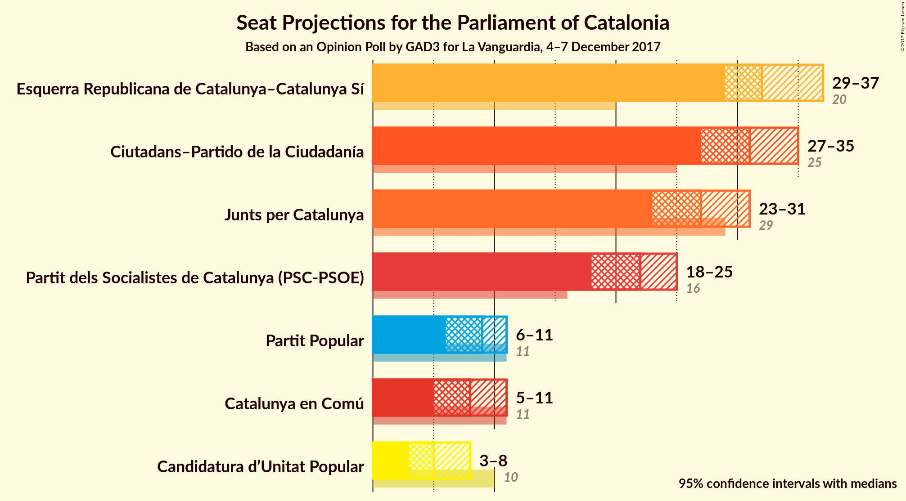
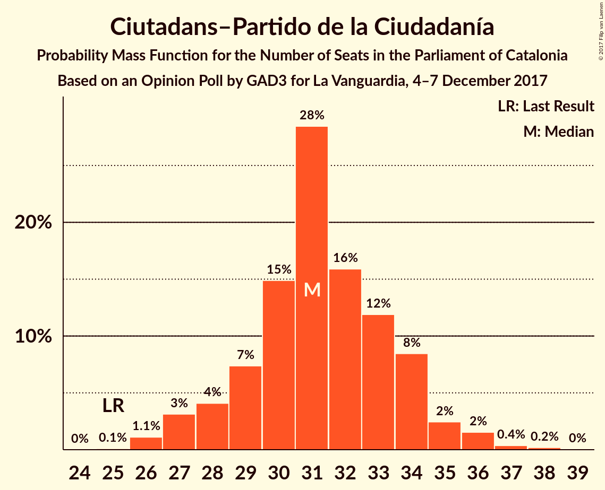
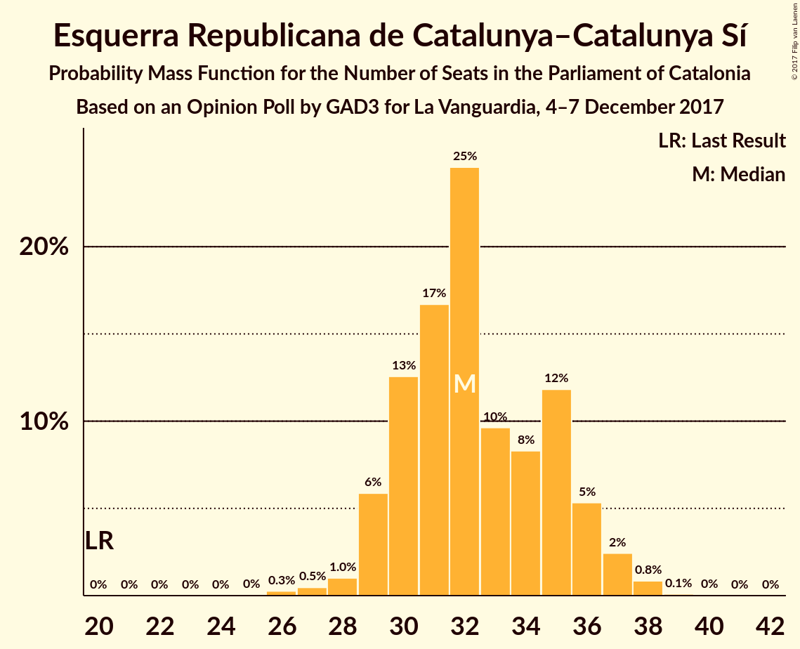
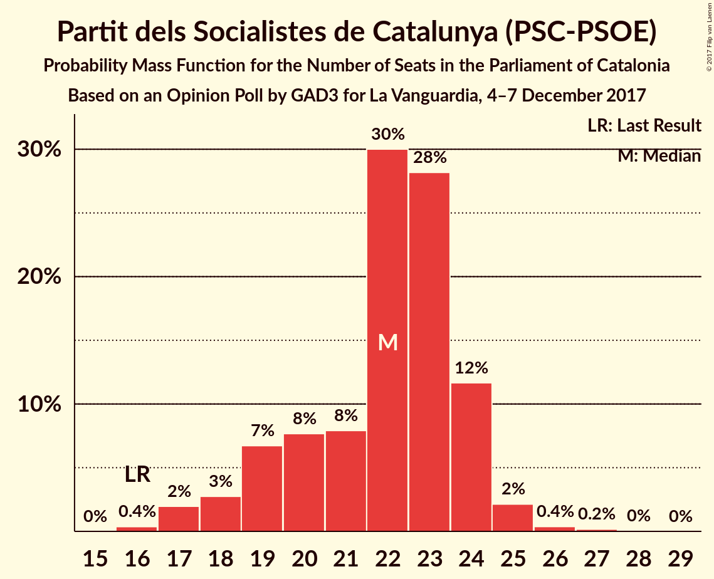
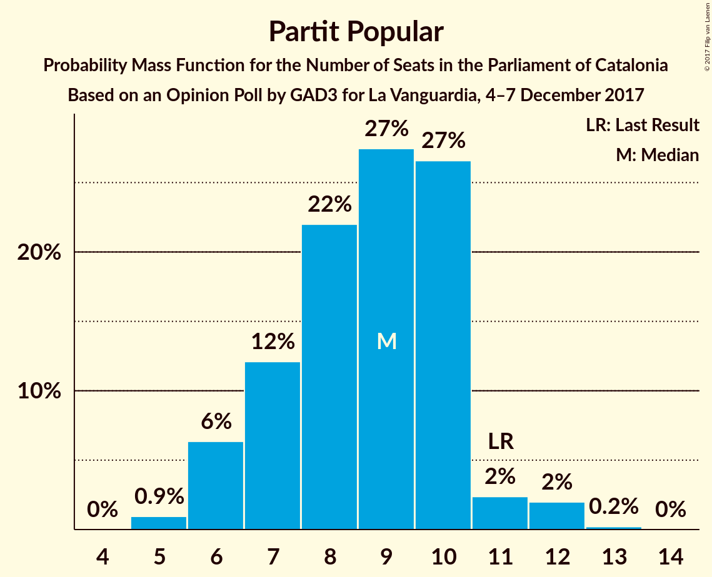

# Opinion Poll by GAD3 for La Vanguardia, 4–7 December 2017

<a href="#voting-intentions">Voting Intentions</a> | <a href="#seats">Seats</a> | <a href="#coalitions">Coalitions</a> | <a href="#technical-information">Technical Information</a>

## Voting Intentions

### Confidence Intervals

| Party | Last Result | Poll Result | 80% Confidence Interval | 90% Confidence Interval | 95% Confidence Interval | 99% Confidence Interval |
|:-----:|:-----------:|:-----------:|:-----------------------:|:-----------------------:|:-----------------------:|:-----------------------:|
| Ciutadans–Partido de la Ciudadanía | 17.9% | 23.1% | 21.4–24.9% |21.0–25.4% |20.6–25.8% |19.8–26.7% |
| Esquerra Republicana de Catalunya–Catalunya Sí | 39.6% | 21.5% | 19.9–23.2% |19.4–23.7% |19.1–24.2% |18.3–25.0% |
| Junts per Catalunya | 39.6% | 18.2% | 16.7–19.8% |16.3–20.3% |15.9–20.7% |15.2–21.5% |
| Partit dels Socialistes de Catalunya (PSC-PSOE) | 12.7% | 16.5% | 15.1–18.1% |14.7–18.5% |14.3–18.9% |13.7–19.7% |
| Catalunya en Comú | 8.9% | 7.4% | 6.4–8.6% |6.2–8.9% |5.9–9.2% |5.5–9.8% |
| Partit Popular | 8.5% | 7.1% | 6.2–8.3% |5.9–8.6% |5.7–8.9% |5.2–9.4% |
| Candidatura d’Unitat Popular | 8.2% | 5.0% | 4.2–6.0% |4.0–6.3% |3.8–6.5% |3.5–7.1% |

*Note:* The poll result column reflects the actual value used in the calculations. Published results may vary slightly, and in addition be rounded to fewer digits.

## Seats

### Confidence Intervals

| Party | Last Result | Median | 80% Confidence Interval | 90% Confidence Interval | 95% Confidence Interval | 99% Confidence Interval |
|:-----:|:-----------:|:------:|:-----------------------:|:-----------------------:|:-----------------------:|:-----------------------:|
| <a href="#ciutadans–partido-de-la-ciudadanía">Ciutadans–Partido de la Ciudadanía</a> | 25 | 31 | 29–34 |28–34 |27–35 |26–37 |
| <a href="#esquerra-republicana-de-catalunya–catalunya-sí">Esquerra Republicana de Catalunya–Catalunya Sí</a> | 20 | 32 | 30–35 |29–36 |29–37 |27–38 |
| <a href="#junts-per-catalunya">Junts per Catalunya</a> | 29 | 27 | 24–30 |24–30 |23–31 |23–32 |
| <a href="#partit-dels-socialistes-de-catalunya-(psc-psoe)">Partit dels Socialistes de Catalunya (PSC-PSOE)</a> | 16 | 22 | 19–24 |18–24 |18–25 |17–26 |
| <a href="#catalunya-en-comú">Catalunya en Comú</a> | 11 | 8 | 6–9 |6–10 |6–11 |5–11 |
| <a href="#partit-popular">Partit Popular</a> | 11 | 9 | 7–10 |6–10 |6–11 |5–12 |
| <a href="#candidatura-d’unitat-popular">Candidatura d’Unitat Popular</a> | 10 | 5 | 3–8 |3–8 |3–8 |3–9 |

### Ciutadans–Partido de la Ciudadanía

*For a full overview of the results for this party, see the [Ciutadans–Partido de la Ciudadanía](party-ciutadans–partidodelaciudadanía.html) page.*

| Number of Seats | Probability | Accumulated | Special Marks |
|:---------------:|:-----------:|:-----------:|:-------------:|
| 25 | 0.1% | 100% | Last Result |
| 26 | 1.1% | 99.9% |  |
| 27 | 3% | 98.8% |  |
| 28 | 4% | 96% |  |
| 29 | 8% | 92% |  |
| 30 | 16% | 84% |  |
| 31 | 28% | 69% | Median |
| 32 | 17% | 41% |  |
| 33 | 11% | 24% |  |
| 34 | 8% | 13% |  |
| 35 | 2% | 5% |  |
| 36 | 2% | 2% |  |
| 37 | 0.4% | 0.6% |  |
| 38 | 0.2% | 0.2% |  |
| 39 | 0% | 0% |  |

### Esquerra Republicana de Catalunya–Catalunya Sí

*For a full overview of the results for this party, see the [Esquerra Republicana de Catalunya–Catalunya Sí](party-esquerrarepublicanadecatalunya–catalunyasí.html) page.*

| Number of Seats | Probability | Accumulated | Special Marks |
|:---------------:|:-----------:|:-----------:|:-------------:|
| 20 | 0% | 100% | Last Result |
| 21 | 0% | 100% |  |
| 22 | 0% | 100% |  |
| 23 | 0% | 100% |  |
| 24 | 0% | 100% |  |
| 25 | 0% | 100% |  |
| 26 | 0.2% | 100% |  |
| 27 | 0.5% | 99.8% |  |
| 28 | 1.1% | 99.3% |  |
| 29 | 6% | 98% |  |
| 30 | 11% | 92% |  |
| 31 | 18% | 81% |  |
| 32 | 24% | 63% | Median |
| 33 | 10% | 39% |  |
| 34 | 8% | 28% |  |
| 35 | 12% | 20% |  |
| 36 | 5% | 9% |  |
| 37 | 2% | 3% |  |
| 38 | 0.9% | 1.1% |  |
| 39 | 0.1% | 0.1% |  |
| 40 | 0% | 0% |  |

### Junts per Catalunya

*For a full overview of the results for this party, see the [Junts per Catalunya](party-juntspercatalunya.html) page.*

| Number of Seats | Probability | Accumulated | Special Marks |
|:---------------:|:-----------:|:-----------:|:-------------:|
| 21 | 0.1% | 100% |  |
| 22 | 0.2% | 99.9% |  |
| 23 | 3% | 99.7% |  |
| 24 | 9% | 97% |  |
| 25 | 11% | 88% |  |
| 26 | 16% | 77% |  |
| 27 | 14% | 60% | Median |
| 28 | 13% | 46% |  |
| 29 | 21% | 33% | Last Result |
| 30 | 8% | 12% |  |
| 31 | 3% | 4% |  |
| 32 | 1.1% | 1.3% |  |
| 33 | 0.2% | 0.3% |  |
| 34 | 0.1% | 0.1% |  |
| 35 | 0% | 0% |  |

### Partit dels Socialistes de Catalunya (PSC-PSOE)

*For a full overview of the results for this party, see the [Partit dels Socialistes de Catalunya (PSC-PSOE)](party-partitdelssocialistesdecatalunyapsc-psoe.html) page.*

| Number of Seats | Probability | Accumulated | Special Marks |
|:---------------:|:-----------:|:-----------:|:-------------:|
| 16 | 0.4% | 100% | Last Result |
| 17 | 2% | 99.6% |  |
| 18 | 3% | 98% |  |
| 19 | 7% | 95% |  |
| 20 | 7% | 88% |  |
| 21 | 8% | 81% |  |
| 22 | 30% | 73% | Median |
| 23 | 29% | 43% |  |
| 24 | 11% | 14% |  |
| 25 | 2% | 3% |  |
| 26 | 0.3% | 0.6% |  |
| 27 | 0.2% | 0.3% |  |
| 28 | 0% | 0.1% |  |
| 29 | 0% | 0% |  |

### Catalunya en Comú

*For a full overview of the results for this party, see the [Catalunya en Comú](party-catalunyaencomú.html) page.*

| Number of Seats | Probability | Accumulated | Special Marks |
|:---------------:|:-----------:|:-----------:|:-------------:|
| 5 | 2% | 100% |  |
| 6 | 9% | 98% |  |
| 7 | 15% | 89% |  |
| 8 | 46% | 74% | Median |
| 9 | 23% | 28% |  |
| 10 | 2% | 5% |  |
| 11 | 3% | 3% | Last Result |
| 12 | 0.2% | 0.3% |  |
| 13 | 0% | 0.1% |  |
| 14 | 0% | 0% |  |

### Partit Popular

*For a full overview of the results for this party, see the [Partit Popular](party-partitpopular.html) page.*

| Number of Seats | Probability | Accumulated | Special Marks |
|:---------------:|:-----------:|:-----------:|:-------------:|
| 5 | 1.1% | 100% |  |
| 6 | 6% | 98.9% |  |
| 7 | 11% | 93% |  |
| 8 | 24% | 82% |  |
| 9 | 29% | 58% | Median |
| 10 | 25% | 30% |  |
| 11 | 3% | 5% | Last Result |
| 12 | 2% | 2% |  |
| 13 | 0.2% | 0.2% |  |
| 14 | 0% | 0% |  |

### Candidatura d’Unitat Popular

*For a full overview of the results for this party, see the [Candidatura d’Unitat Popular](party-candidaturad’unitatpopular.html) page.*

| Number of Seats | Probability | Accumulated | Special Marks |
|:---------------:|:-----------:|:-----------:|:-------------:|
| 2 | 0.2% | 100% |  |
| 3 | 17% | 99.8% |  |
| 4 | 9% | 83% |  |
| 5 | 30% | 74% | Median |
| 6 | 7% | 44% |  |
| 7 | 14% | 37% |  |
| 8 | 22% | 23% |  |
| 9 | 2% | 2% |  |
| 10 | 0% | 0% | Last Result |

## Coalitions

### Confidence Intervals

| Coalition | Last Result | Median | Majority? | 80% Confidence Interval | 90% Confidence Interval | 95% Confidence Interval | 99% Confidence Interval |
|:---------:|:-----------:|:------:|:---------:|:-----------------------:|:-----------------------:|:-----------------------:|:-----------------------:|
| Ciutadans–Partido de la Ciudadanía – Partit dels Socialistes de Catalunya (PSC-PSOE) – Catalunya en Comú – Partit Popular | 63 | 70 | 82% | 66–73 | 66–74 | 65–75 | 63–76 |
| Esquerra Republicana de Catalunya–Catalunya Sí – Junts per Catalunya – Catalunya en Comú | 60 | 68 | 51% | 64–71 | 63–72 | 63–73 | 61–75 |
| Esquerra Republicana de Catalunya–Catalunya Sí – Junts per Catalunya – Candidatura d’Unitat Popular | 59 | 65 | 18% | 62–69 | 61–69 | 60–70 | 59–72 |
| Esquerra Republicana de Catalunya–Catalunya Sí – Partit dels Socialistes de Catalunya (PSC-PSOE) – Catalunya en Comú | 47 | 62 | 2% | 59–66 | 58–67 | 57–67 | 56–69 |
| Ciutadans–Partido de la Ciudadanía – Partit dels Socialistes de Catalunya (PSC-PSOE) – Partit Popular | 52 | 62 | 1.0% | 59–65 | 58–66 | 57–67 | 55–68 |
| Esquerra Republicana de Catalunya–Catalunya Sí – Junts per Catalunya | 49 | 60 | 0.1% | 56–63 | 55–64 | 55–65 | 54–66 |

### Ciutadans–Partido de la Ciudadanía – Partit dels Socialistes de Catalunya (PSC-PSOE) – Catalunya en Comú – Partit Popular

| Number of Seats | Probability | Accumulated | Special Marks |
|:---------------:|:-----------:|:-----------:|:-------------:|
| 61 | 0.1% | 100% |  |
| 62 | 0.1% | 99.9% |  |
| 63 | 0.6% | 99.8% | Last Result |
| 64 | 1.3% | 99.2% |  |
| 65 | 3% | 98% |  |
| 66 | 6% | 95% |  |
| 67 | 7% | 89% |  |
| 68 | 11% | 82% | Majority |
| 69 | 13% | 71% |  |
| 70 | 15% | 58% | Median |
| 71 | 18% | 43% |  |
| 72 | 11% | 25% |  |
| 73 | 7% | 14% |  |
| 74 | 4% | 7% |  |
| 75 | 2% | 3% |  |
| 76 | 0.8% | 1.1% |  |
| 77 | 0.2% | 0.3% |  |
| 78 | 0.1% | 0.1% |  |
| 79 | 0% | 0% |  |

### Esquerra Republicana de Catalunya–Catalunya Sí – Junts per Catalunya – Catalunya en Comú

| Number of Seats | Probability | Accumulated | Special Marks |
|:---------------:|:-----------:|:-----------:|:-------------:|
| 59 | 0% | 100% |  |
| 60 | 0.1% | 99.9% | Last Result |
| 61 | 0.4% | 99.8% |  |
| 62 | 1.5% | 99.4% |  |
| 63 | 4% | 98% |  |
| 64 | 8% | 94% |  |
| 65 | 11% | 86% |  |
| 66 | 11% | 76% |  |
| 67 | 13% | 65% | Median |
| 68 | 15% | 51% | Majority |
| 69 | 16% | 36% |  |
| 70 | 9% | 20% |  |
| 71 | 5% | 11% |  |
| 72 | 3% | 6% |  |
| 73 | 2% | 3% |  |
| 74 | 0.6% | 1.1% |  |
| 75 | 0.4% | 0.6% |  |
| 76 | 0.1% | 0.2% |  |
| 77 | 0% | 0% |  |

### Esquerra Republicana de Catalunya–Catalunya Sí – Junts per Catalunya – Candidatura d’Unitat Popular

| Number of Seats | Probability | Accumulated | Special Marks |
|:---------------:|:-----------:|:-----------:|:-------------:|
| 57 | 0.1% | 100% |  |
| 58 | 0.2% | 99.9% |  |
| 59 | 0.8% | 99.7% | Last Result |
| 60 | 2% | 98.9% |  |
| 61 | 4% | 97% |  |
| 62 | 7% | 93% |  |
| 63 | 11% | 86% |  |
| 64 | 18% | 75% | Median |
| 65 | 15% | 57% |  |
| 66 | 13% | 42% |  |
| 67 | 11% | 29% |  |
| 68 | 7% | 18% | Majority |
| 69 | 6% | 11% |  |
| 70 | 3% | 5% |  |
| 71 | 1.3% | 2% |  |
| 72 | 0.6% | 0.8% |  |
| 73 | 0.1% | 0.2% |  |
| 74 | 0.1% | 0.1% |  |
| 75 | 0% | 0% |  |

### Esquerra Republicana de Catalunya–Catalunya Sí – Partit dels Socialistes de Catalunya (PSC-PSOE) – Catalunya en Comú

| Number of Seats | Probability | Accumulated | Special Marks |
|:---------------:|:-----------:|:-----------:|:-------------:|
| 47 | 0% | 100% | Last Result |
| 48 | 0% | 100% |  |
| 49 | 0% | 100% |  |
| 50 | 0% | 100% |  |
| 51 | 0% | 100% |  |
| 52 | 0% | 100% |  |
| 53 | 0% | 100% |  |
| 54 | 0.1% | 100% |  |
| 55 | 0.3% | 99.9% |  |
| 56 | 1.1% | 99.6% |  |
| 57 | 3% | 98% |  |
| 58 | 4% | 96% |  |
| 59 | 5% | 92% |  |
| 60 | 9% | 87% |  |
| 61 | 14% | 78% |  |
| 62 | 17% | 63% | Median |
| 63 | 18% | 46% |  |
| 64 | 10% | 28% |  |
| 65 | 7% | 18% |  |
| 66 | 5% | 11% |  |
| 67 | 3% | 5% |  |
| 68 | 2% | 2% | Majority |
| 69 | 0.6% | 0.8% |  |
| 70 | 0.2% | 0.2% |  |
| 71 | 0% | 0% |  |

### Ciutadans–Partido de la Ciudadanía – Partit dels Socialistes de Catalunya (PSC-PSOE) – Partit Popular

| Number of Seats | Probability | Accumulated | Special Marks |
|:---------------:|:-----------:|:-----------:|:-------------:|
| 52 | 0% | 100% | Last Result |
| 53 | 0.1% | 100% |  |
| 54 | 0.2% | 99.9% |  |
| 55 | 0.6% | 99.7% |  |
| 56 | 1.1% | 99.2% |  |
| 57 | 3% | 98% |  |
| 58 | 5% | 95% |  |
| 59 | 7% | 90% |  |
| 60 | 10% | 83% |  |
| 61 | 14% | 73% |  |
| 62 | 17% | 59% | Median |
| 63 | 16% | 42% |  |
| 64 | 13% | 26% |  |
| 65 | 6% | 13% |  |
| 66 | 4% | 7% |  |
| 67 | 2% | 3% |  |
| 68 | 0.7% | 1.0% | Majority |
| 69 | 0.2% | 0.3% |  |
| 70 | 0.1% | 0.1% |  |
| 71 | 0% | 0% |  |

### Esquerra Republicana de Catalunya–Catalunya Sí – Junts per Catalunya

| Number of Seats | Probability | Accumulated | Special Marks |
|:---------------:|:-----------:|:-----------:|:-------------:|
| 49 | 0% | 100% | Last Result |
| 50 | 0% | 100% |  |
| 51 | 0% | 100% |  |
| 52 | 0.1% | 100% |  |
| 53 | 0.3% | 99.9% |  |
| 54 | 1.4% | 99.5% |  |
| 55 | 4% | 98% |  |
| 56 | 7% | 94% |  |
| 57 | 11% | 87% |  |
| 58 | 11% | 76% |  |
| 59 | 12% | 65% | Median |
| 60 | 17% | 53% |  |
| 61 | 15% | 36% |  |
| 62 | 10% | 21% |  |
| 63 | 5% | 11% |  |
| 64 | 3% | 6% |  |
| 65 | 2% | 3% |  |
| 66 | 0.8% | 1.2% |  |
| 67 | 0.3% | 0.4% |  |
| 68 | 0.1% | 0.1% | Majority |
| 69 | 0% | 0% |  |

## Technical Information

### Opinion Poll

+ **Polling firm:** GAD3
+ **Commissioner(s):** La Vanguardia
+ **Fieldwork period:** 4–7 December 2017

### Calculations

+ **Sample size:** 1000
+ **Simulations done:** 2,097,152
+ **Error estimate:** 0.50%

