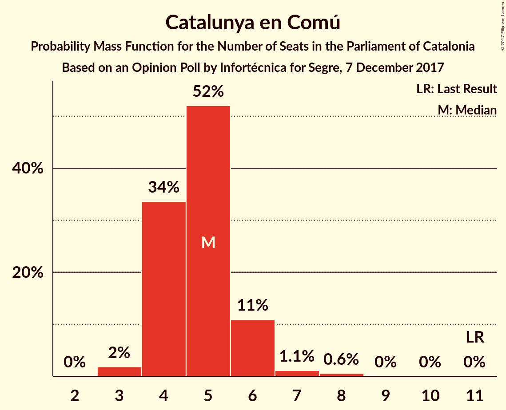

# Opinion Poll by Infortécnica for Segre, 7 December 2017

<a href="#voting-intentions">Voting Intentions</a> | <a href="#seats">Seats</a> | <a href="#coalitions">Coalitions</a> | <a href="#technical-information">Technical Information</a>

## Voting Intentions

### Confidence Intervals

| Party | Last Result | Poll Result | 80% Confidence Interval | 90% Confidence Interval | 95% Confidence Interval | 99% Confidence Interval |
|:-----:|:-----------:|:-----------:|:-----------------------:|:-----------------------:|:-----------------------:|:-----------------------:|
| Ciutadans–Partido de la Ciudadanía | 17.9% | 24.4% | 22.9–26.1% |22.5–26.5% |22.1–26.9% |21.4–27.7% |
| Esquerra Republicana de Catalunya–Catalunya Sí | 39.6% | 23.3% | 21.8–24.9% |21.3–25.3% |21.0–25.7% |20.3–26.5% |
| Junts per Catalunya | 39.6% | 18.9% | 17.5–20.4% |17.1–20.9% |16.8–21.2% |16.2–22.0% |
| Partit dels Socialistes de Catalunya (PSC-PSOE) | 12.7% | 16.3% | 15.0–17.7% |14.6–18.1% |14.3–18.5% |13.7–19.2% |
| Candidatura d’Unitat Popular | 8.2% | 6.3% | 5.5–7.3% |5.3–7.6% |5.1–7.8% |4.7–8.4% |
| Partit Popular | 8.5% | 5.6% | 4.8–6.5% |4.6–6.8% |4.4–7.0% |4.1–7.5% |
| Catalunya en Comú | 8.9% | 5.2% | 4.5–6.1% |4.2–6.4% |4.1–6.6% |3.7–7.0% |

*Note:* The poll result column reflects the actual value used in the calculations. Published results may vary slightly, and in addition be rounded to fewer digits.

## Seats

### Confidence Intervals

| Party | Last Result | Median | 80% Confidence Interval | 90% Confidence Interval | 95% Confidence Interval | 99% Confidence Interval |
|:-----:|:-----------:|:------:|:-----------------------:|:-----------------------:|:-----------------------:|:-----------------------:|
| <a href="#ciutadans–partido-de-la-ciudadanía">Ciutadans–Partido de la Ciudadanía</a> | 25 | 33 | 31–35 |30–36 |29–36 |28–38 |
| <a href="#esquerra-republicana-de-catalunya–catalunya-sí">Esquerra Republicana de Catalunya–Catalunya Sí</a> | 20 | 34 | 32–37 |32–38 |32–38 |30–40 |
| <a href="#junts-per-catalunya">Junts per Catalunya</a> | 29 | 28 | 25–30 |25–30 |24–31 |24–32 |
| <a href="#partit-dels-socialistes-de-catalunya-(psc-psoe)">Partit dels Socialistes de Catalunya (PSC-PSOE)</a> | 16 | 21 | 19–23 |18–24 |17–24 |16–25 |
| <a href="#candidatura-d’unitat-popular">Candidatura d’Unitat Popular</a> | 10 | 8 | 7–9 |5–9 |5–9 |4–10 |
| <a href="#partit-popular">Partit Popular</a> | 11 | 6 | 5–8 |5–8 |4–8 |3–9 |
| <a href="#catalunya-en-comú">Catalunya en Comú</a> | 11 | 5 | 4–6 |4–6 |4–6 |3–8 |

### Ciutadans–Partido de la Ciudadanía

*For a full overview of the results for this party, see the [Ciutadans–Partido de la Ciudadanía](party-ciutadans–partidodelaciudadanía.html) page.*

| Number of Seats | Probability | Accumulated | Special Marks |
|:---------------:|:-----------:|:-----------:|:-------------:|
| 25 | 0% | 100% | Last Result |
| 26 | 0% | 100% |  |
| 27 | 0.4% | 100% |  |
| 28 | 0.7% | 99.6% |  |
| 29 | 2% | 98.9% |  |
| 30 | 3% | 97% |  |
| 31 | 19% | 94% |  |
| 32 | 24% | 76% |  |
| 33 | 11% | 52% | Median |
| 34 | 20% | 40% |  |
| 35 | 11% | 20% |  |
| 36 | 7% | 9% |  |
| 37 | 2% | 2% |  |
| 38 | 0.4% | 0.6% |  |
| 39 | 0.1% | 0.1% |  |
| 40 | 0% | 0% |  |

### Esquerra Republicana de Catalunya–Catalunya Sí

*For a full overview of the results for this party, see the [Esquerra Republicana de Catalunya–Catalunya Sí](party-esquerrarepublicanadecatalunya–catalunyasí.html) page.*

| Number of Seats | Probability | Accumulated | Special Marks |
|:---------------:|:-----------:|:-----------:|:-------------:|
| 20 | 0% | 100% | Last Result |
| 21 | 0% | 100% |  |
| 22 | 0% | 100% |  |
| 23 | 0% | 100% |  |
| 24 | 0% | 100% |  |
| 25 | 0% | 100% |  |
| 26 | 0% | 100% |  |
| 27 | 0% | 100% |  |
| 28 | 0.1% | 100% |  |
| 29 | 0.1% | 99.9% |  |
| 30 | 0.4% | 99.8% |  |
| 31 | 2% | 99.4% |  |
| 32 | 23% | 98% |  |
| 33 | 10% | 75% |  |
| 34 | 18% | 65% | Median |
| 35 | 20% | 47% |  |
| 36 | 13% | 26% |  |
| 37 | 7% | 13% |  |
| 38 | 5% | 7% |  |
| 39 | 0.8% | 1.5% |  |
| 40 | 0.5% | 0.7% |  |
| 41 | 0.1% | 0.2% |  |
| 42 | 0% | 0% |  |

### Junts per Catalunya

*For a full overview of the results for this party, see the [Junts per Catalunya](party-juntspercatalunya.html) page.*

| Number of Seats | Probability | Accumulated | Special Marks |
|:---------------:|:-----------:|:-----------:|:-------------:|
| 22 | 0.1% | 100% |  |
| 23 | 0.4% | 99.9% |  |
| 24 | 2% | 99.5% |  |
| 25 | 8% | 97% |  |
| 26 | 21% | 89% |  |
| 27 | 10% | 68% |  |
| 28 | 20% | 58% | Median |
| 29 | 16% | 38% | Last Result |
| 30 | 19% | 22% |  |
| 31 | 2% | 3% |  |
| 32 | 1.0% | 1.3% |  |
| 33 | 0.1% | 0.3% |  |
| 34 | 0% | 0.1% |  |
| 35 | 0.1% | 0.1% |  |
| 36 | 0% | 0% |  |

### Partit dels Socialistes de Catalunya (PSC-PSOE)

*For a full overview of the results for this party, see the [Partit dels Socialistes de Catalunya (PSC-PSOE)](party-partitdelssocialistesdecatalunyapsc-psoe.html) page.*

| Number of Seats | Probability | Accumulated | Special Marks |
|:---------------:|:-----------:|:-----------:|:-------------:|
| 16 | 0.5% | 100% | Last Result |
| 17 | 3% | 99.5% |  |
| 18 | 3% | 97% |  |
| 19 | 13% | 94% |  |
| 20 | 13% | 81% |  |
| 21 | 23% | 67% | Median |
| 22 | 17% | 44% |  |
| 23 | 20% | 28% |  |
| 24 | 7% | 8% |  |
| 25 | 0.9% | 0.9% |  |
| 26 | 0% | 0.1% |  |
| 27 | 0% | 0% |  |

### Candidatura d’Unitat Popular

*For a full overview of the results for this party, see the [Candidatura d’Unitat Popular](party-candidaturad’unitatpopular.html) page.*

| Number of Seats | Probability | Accumulated | Special Marks |
|:---------------:|:-----------:|:-----------:|:-------------:|
| 3 | 0.1% | 100% |  |
| 4 | 0.4% | 99.9% |  |
| 5 | 5% | 99.5% |  |
| 6 | 2% | 94% |  |
| 7 | 5% | 92% |  |
| 8 | 56% | 87% | Median |
| 9 | 28% | 31% |  |
| 10 | 2% | 2% | Last Result |
| 11 | 0% | 0% |  |

### Partit Popular

*For a full overview of the results for this party, see the [Partit Popular](party-partitpopular.html) page.*

| Number of Seats | Probability | Accumulated | Special Marks |
|:---------------:|:-----------:|:-----------:|:-------------:|
| 3 | 2% | 100% |  |
| 4 | 2% | 98% |  |
| 5 | 31% | 96% |  |
| 6 | 46% | 65% | Median |
| 7 | 9% | 19% |  |
| 8 | 9% | 10% |  |
| 9 | 0.7% | 1.1% |  |
| 10 | 0.4% | 0.4% |  |
| 11 | 0% | 0% | Last Result |

### Catalunya en Comú

*For a full overview of the results for this party, see the [Catalunya en Comú](party-catalunyaencomú.html) page.*

| Number of Seats | Probability | Accumulated | Special Marks |
|:---------------:|:-----------:|:-----------:|:-------------:|
| 3 | 2% | 100% |  |
| 4 | 29% | 98% |  |
| 5 | 55% | 69% | Median |
| 6 | 12% | 14% |  |
| 7 | 1.4% | 2% |  |
| 8 | 0.6% | 0.6% |  |
| 9 | 0% | 0% |  |
| 10 | 0% | 0% |  |
| 11 | 0% | 0% | Last Result |

## Coalitions

### Confidence Intervals

| Coalition | Last Result | Median | Majority? | 80% Confidence Interval | 90% Confidence Interval | 95% Confidence Interval | 99% Confidence Interval |
|:---------:|:-----------:|:------:|:---------:|:-----------------------:|:-----------------------:|:-----------------------:|:-----------------------:|
| Esquerra Republicana de Catalunya–Catalunya Sí – Junts per Catalunya – Candidatura d’Unitat Popular | 59 | 70 | 89% | 67–73 | 67–74 | 66–75 | 65–77 |
| Esquerra Republicana de Catalunya–Catalunya Sí – Junts per Catalunya – Catalunya en Comú | 60 | 67 | 29% | 64–70 | 64–71 | 63–72 | 62–73 |
| Ciutadans–Partido de la Ciudadanía – Partit dels Socialistes de Catalunya (PSC-PSOE) – Partit Popular – Catalunya en Comú | 63 | 65 | 11% | 62–68 | 61–68 | 60–69 | 58–70 |
| Esquerra Republicana de Catalunya–Catalunya Sí – Junts per Catalunya | 49 | 62 | 2% | 60–65 | 59–66 | 58–67 | 57–68 |
| Esquerra Republicana de Catalunya–Catalunya Sí – Partit dels Socialistes de Catalunya (PSC-PSOE) – Catalunya en Comú | 47 | 60 | 0.1% | 57–63 | 57–64 | 56–65 | 55–66 |
| Ciutadans–Partido de la Ciudadanía – Partit dels Socialistes de Catalunya (PSC-PSOE) – Partit Popular | 52 | 60 | 0% | 57–63 | 56–63 | 55–64 | 54–65 |

### Esquerra Republicana de Catalunya–Catalunya Sí – Junts per Catalunya – Candidatura d’Unitat Popular

| Number of Seats | Probability | Accumulated | Special Marks |
|:---------------:|:-----------:|:-----------:|:-------------:|
| 59 | 0% | 100% | Last Result |
| 60 | 0% | 100% |  |
| 61 | 0% | 100% |  |
| 62 | 0% | 100% |  |
| 63 | 0.1% | 100% |  |
| 64 | 0.3% | 99.9% |  |
| 65 | 0.7% | 99.7% |  |
| 66 | 3% | 98.9% |  |
| 67 | 6% | 96% |  |
| 68 | 7% | 89% | Majority |
| 69 | 20% | 82% |  |
| 70 | 25% | 63% | Median |
| 71 | 16% | 38% |  |
| 72 | 9% | 22% |  |
| 73 | 5% | 13% |  |
| 74 | 4% | 8% |  |
| 75 | 1.5% | 3% |  |
| 76 | 1.1% | 2% |  |
| 77 | 0.5% | 0.6% |  |
| 78 | 0% | 0.1% |  |
| 79 | 0% | 0% |  |

### Esquerra Republicana de Catalunya–Catalunya Sí – Junts per Catalunya – Catalunya en Comú

| Number of Seats | Probability | Accumulated | Special Marks |
|:---------------:|:-----------:|:-----------:|:-------------:|
| 60 | 0.1% | 100% | Last Result |
| 61 | 0.2% | 99.9% |  |
| 62 | 0.7% | 99.7% |  |
| 63 | 3% | 99.0% |  |
| 64 | 7% | 96% |  |
| 65 | 9% | 89% |  |
| 66 | 25% | 80% |  |
| 67 | 26% | 55% | Median |
| 68 | 9% | 29% | Majority |
| 69 | 7% | 20% |  |
| 70 | 7% | 13% |  |
| 71 | 2% | 6% |  |
| 72 | 2% | 4% |  |
| 73 | 2% | 2% |  |
| 74 | 0.2% | 0.2% |  |
| 75 | 0% | 0% |  |

### Ciutadans–Partido de la Ciudadanía – Partit dels Socialistes de Catalunya (PSC-PSOE) – Partit Popular – Catalunya en Comú

| Number of Seats | Probability | Accumulated | Special Marks |
|:---------------:|:-----------:|:-----------:|:-------------:|
| 57 | 0% | 100% |  |
| 58 | 0.5% | 99.9% |  |
| 59 | 1.1% | 99.4% |  |
| 60 | 1.5% | 98% |  |
| 61 | 4% | 97% |  |
| 62 | 5% | 92% |  |
| 63 | 9% | 87% | Last Result |
| 64 | 16% | 78% |  |
| 65 | 25% | 62% | Median |
| 66 | 20% | 37% |  |
| 67 | 7% | 18% |  |
| 68 | 6% | 11% | Majority |
| 69 | 3% | 4% |  |
| 70 | 0.7% | 1.1% |  |
| 71 | 0.3% | 0.3% |  |
| 72 | 0.1% | 0.1% |  |
| 73 | 0% | 0% |  |

### Esquerra Republicana de Catalunya–Catalunya Sí – Junts per Catalunya

| Number of Seats | Probability | Accumulated | Special Marks |
|:---------------:|:-----------:|:-----------:|:-------------:|
| 49 | 0% | 100% | Last Result |
| 50 | 0% | 100% |  |
| 51 | 0% | 100% |  |
| 52 | 0% | 100% |  |
| 53 | 0% | 100% |  |
| 54 | 0% | 100% |  |
| 55 | 0.1% | 100% |  |
| 56 | 0.2% | 99.9% |  |
| 57 | 0.5% | 99.7% |  |
| 58 | 2% | 99.2% |  |
| 59 | 5% | 97% |  |
| 60 | 9% | 92% |  |
| 61 | 24% | 83% |  |
| 62 | 26% | 59% | Median |
| 63 | 11% | 33% |  |
| 64 | 10% | 22% |  |
| 65 | 3% | 11% |  |
| 66 | 5% | 8% |  |
| 67 | 1.3% | 3% |  |
| 68 | 2% | 2% | Majority |
| 69 | 0.3% | 0.3% |  |
| 70 | 0% | 0% |  |

### Esquerra Republicana de Catalunya–Catalunya Sí – Partit dels Socialistes de Catalunya (PSC-PSOE) – Catalunya en Comú

| Number of Seats | Probability | Accumulated | Special Marks |
|:---------------:|:-----------:|:-----------:|:-------------:|
| 47 | 0% | 100% | Last Result |
| 48 | 0% | 100% |  |
| 49 | 0% | 100% |  |
| 50 | 0% | 100% |  |
| 51 | 0% | 100% |  |
| 52 | 0% | 100% |  |
| 53 | 0.1% | 100% |  |
| 54 | 0.2% | 99.9% |  |
| 55 | 0.8% | 99.6% |  |
| 56 | 3% | 98.9% |  |
| 57 | 6% | 95% |  |
| 58 | 10% | 89% |  |
| 59 | 12% | 79% |  |
| 60 | 23% | 67% | Median |
| 61 | 16% | 44% |  |
| 62 | 9% | 29% |  |
| 63 | 11% | 20% |  |
| 64 | 6% | 9% |  |
| 65 | 2% | 3% |  |
| 66 | 1.0% | 1.5% |  |
| 67 | 0.3% | 0.5% |  |
| 68 | 0.1% | 0.1% | Majority |
| 69 | 0% | 0% |  |

### Ciutadans–Partido de la Ciudadanía – Partit dels Socialistes de Catalunya (PSC-PSOE) – Partit Popular

| Number of Seats | Probability | Accumulated | Special Marks |
|:---------------:|:-----------:|:-----------:|:-------------:|
| 52 | 0% | 100% | Last Result |
| 53 | 0.3% | 100% |  |
| 54 | 2% | 99.6% |  |
| 55 | 0.6% | 98% |  |
| 56 | 3% | 97% |  |
| 57 | 7% | 95% |  |
| 58 | 9% | 87% |  |
| 59 | 12% | 78% |  |
| 60 | 27% | 66% | Median |
| 61 | 20% | 40% |  |
| 62 | 6% | 20% |  |
| 63 | 9% | 14% |  |
| 64 | 3% | 4% |  |
| 65 | 1.2% | 2% |  |
| 66 | 0.3% | 0.4% |  |
| 67 | 0.1% | 0.1% |  |
| 68 | 0% | 0% | Majority |

## Technical Information

### Opinion Poll

+ **Polling firm:** Infortécnica
+ **Commissioner(s):** Segre
+ **Fieldwork period:** 7 December 2017

### Calculations

+ **Sample size:** 1216
+ **Simulations done:** 1,048,576
+ **Error estimate:** 1.25%

