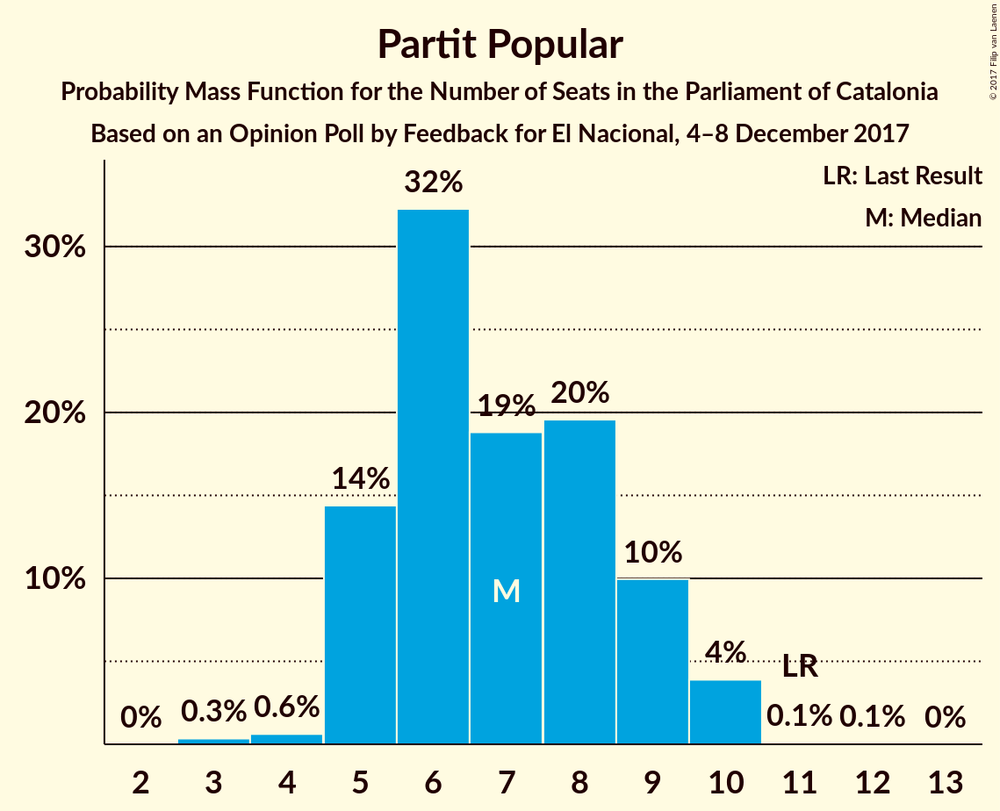

# Opinion Poll by Feedback for El Nacional, 4–8 December 2017

<a href="#voting-intentions">Voting Intentions</a> | <a href="#seats">Seats</a> | <a href="#coalitions">Coalitions</a> | <a href="#technical-information">Technical Information</a>

## Voting Intentions

### Confidence Intervals

| Party | Last Result | Poll Result | 80% Confidence Interval | 90% Confidence Interval | 95% Confidence Interval | 99% Confidence Interval |
|:-----:|:-----------:|:-----------:|:-----------------------:|:-----------------------:|:-----------------------:|:-----------------------:|
| Esquerra Republicana de Catalunya–Catalunya Sí | 39.6% | 22.3% | 20.7–24.1% |20.2–24.6% |19.8–25.0% |19.1–25.8% |
| Ciutadans–Partido de la Ciudadanía | 17.9% | 21.3% | 19.7–23.0% |19.3–23.5% |18.9–24.0% |18.1–24.8% |
| Junts per Catalunya | 39.6% | 18.9% | 17.4–20.6% |16.9–21.0% |16.6–21.5% |15.9–22.3% |
| Partit dels Socialistes de Catalunya (PSC-PSOE) | 12.7% | 15.9% | 14.5–17.5% |14.1–17.9% |13.8–18.3% |13.1–19.1% |
| Catalunya en Comú | 8.9% | 7.4% | 6.4–8.6% |6.2–8.9% |5.9–9.2% |5.5–9.8% |
| Candidatura d’Unitat Popular | 8.2% | 7.4% | 6.4–8.6% |6.2–8.9% |5.9–9.2% |5.5–9.8% |
| Partit Popular | 8.5% | 6.1% | 5.2–7.2% |5.0–7.5% |4.8–7.8% |4.4–8.3% |

*Note:* The poll result column reflects the actual value used in the calculations. Published results may vary slightly, and in addition be rounded to fewer digits.

## Seats

### Confidence Intervals

| Party | Last Result | Median | 80% Confidence Interval | 90% Confidence Interval | 95% Confidence Interval | 99% Confidence Interval |
|:-----:|:-----------:|:------:|:-----------------------:|:-----------------------:|:-----------------------:|:-----------------------:|
| <a href="#esquerra-republicana-de-catalunya–catalunya-sí">Esquerra Republicana de Catalunya–Catalunya Sí</a> | 20 | 33 | 31–37 |30–37 |30–38 |28–39 |
| <a href="#ciutadans–partido-de-la-ciudadanía">Ciutadans–Partido de la Ciudadanía</a> | 25 | 28 | 26–31 |26–32 |25–32 |24–34 |
| <a href="#junts-per-catalunya">Junts per Catalunya</a> | 29 | 28 | 26–31 |25–32 |24–32 |23–33 |
| <a href="#partit-dels-socialistes-de-catalunya-(psc-psoe)">Partit dels Socialistes de Catalunya (PSC-PSOE)</a> | 16 | 21 | 18–23 |17–24 |17–24 |16–25 |
| <a href="#catalunya-en-comú">Catalunya en Comú</a> | 11 | 8 | 6–9 |6–9 |5–11 |5–11 |
| <a href="#candidatura-d’unitat-popular">Candidatura d’Unitat Popular</a> | 10 | 9 | 8–10 |8–11 |8–11 |7–12 |
| <a href="#partit-popular">Partit Popular</a> | 11 | 7 | 5–9 |5–9 |5–10 |4–10 |

### Esquerra Republicana de Catalunya–Catalunya Sí

*For a full overview of the results for this party, see the [Esquerra Republicana de Catalunya–Catalunya Sí](party-esquerrarepublicanadecatalunya–catalunyasí.html) page.*

| Number of Seats | Probability | Accumulated | Special Marks |
|:---------------:|:-----------:|:-----------:|:-------------:|
| 20 | 0% | 100% | Last Result |
| 21 | 0% | 100% |  |
| 22 | 0% | 100% |  |
| 23 | 0% | 100% |  |
| 24 | 0% | 100% |  |
| 25 | 0% | 100% |  |
| 26 | 0% | 100% |  |
| 27 | 0.1% | 100% |  |
| 28 | 0.5% | 99.8% |  |
| 29 | 2% | 99.4% |  |
| 30 | 4% | 98% |  |
| 31 | 11% | 94% |  |
| 32 | 24% | 83% |  |
| 33 | 12% | 58% | Median |
| 34 | 14% | 46% |  |
| 35 | 12% | 32% |  |
| 36 | 9% | 20% |  |
| 37 | 7% | 10% |  |
| 38 | 3% | 4% |  |
| 39 | 0.5% | 0.7% |  |
| 40 | 0.2% | 0.2% |  |
| 41 | 0% | 0.1% |  |
| 42 | 0% | 0% |  |

### Ciutadans–Partido de la Ciudadanía

*For a full overview of the results for this party, see the [Ciutadans–Partido de la Ciudadanía](party-ciutadans–partidodelaciudadanía.html) page.*

| Number of Seats | Probability | Accumulated | Special Marks |
|:---------------:|:-----------:|:-----------:|:-------------:|
| 23 | 0.2% | 100% |  |
| 24 | 0.4% | 99.8% |  |
| 25 | 4% | 99.4% | Last Result |
| 26 | 13% | 95% |  |
| 27 | 13% | 82% |  |
| 28 | 21% | 69% | Median |
| 29 | 19% | 48% |  |
| 30 | 12% | 28% |  |
| 31 | 12% | 17% |  |
| 32 | 3% | 5% |  |
| 33 | 2% | 2% |  |
| 34 | 0.5% | 0.6% |  |
| 35 | 0% | 0.1% |  |
| 36 | 0% | 0% |  |

### Junts per Catalunya

*For a full overview of the results for this party, see the [Junts per Catalunya](party-juntspercatalunya.html) page.*

| Number of Seats | Probability | Accumulated | Special Marks |
|:---------------:|:-----------:|:-----------:|:-------------:|
| 22 | 0.1% | 100% |  |
| 23 | 0.8% | 99.9% |  |
| 24 | 3% | 99.1% |  |
| 25 | 5% | 96% |  |
| 26 | 14% | 91% |  |
| 27 | 12% | 77% |  |
| 28 | 16% | 65% | Median |
| 29 | 23% | 49% | Last Result |
| 30 | 14% | 26% |  |
| 31 | 6% | 12% |  |
| 32 | 5% | 6% |  |
| 33 | 0.4% | 0.9% |  |
| 34 | 0.3% | 0.5% |  |
| 35 | 0.1% | 0.1% |  |
| 36 | 0% | 0% |  |

### Partit dels Socialistes de Catalunya (PSC-PSOE)

*For a full overview of the results for this party, see the [Partit dels Socialistes de Catalunya (PSC-PSOE)](party-partitdelssocialistesdecatalunyapsc-psoe.html) page.*

| Number of Seats | Probability | Accumulated | Special Marks |
|:---------------:|:-----------:|:-----------:|:-------------:|
| 15 | 0.1% | 100% |  |
| 16 | 1.5% | 99.9% | Last Result |
| 17 | 4% | 98% |  |
| 18 | 7% | 94% |  |
| 19 | 15% | 87% |  |
| 20 | 11% | 72% |  |
| 21 | 13% | 61% | Median |
| 22 | 25% | 48% |  |
| 23 | 17% | 23% |  |
| 24 | 5% | 6% |  |
| 25 | 0.8% | 0.8% |  |
| 26 | 0% | 0.1% |  |
| 27 | 0% | 0% |  |

### Catalunya en Comú

*For a full overview of the results for this party, see the [Catalunya en Comú](party-catalunyaencomú.html) page.*

| Number of Seats | Probability | Accumulated | Special Marks |
|:---------------:|:-----------:|:-----------:|:-------------:|
| 5 | 3% | 100% |  |
| 6 | 10% | 97% |  |
| 7 | 14% | 87% |  |
| 8 | 45% | 73% | Median |
| 9 | 23% | 28% |  |
| 10 | 2% | 5% |  |
| 11 | 3% | 3% | Last Result |
| 12 | 0.2% | 0.3% |  |
| 13 | 0% | 0% |  |

### Candidatura d’Unitat Popular

*For a full overview of the results for this party, see the [Candidatura d’Unitat Popular](party-candidaturad’unitatpopular.html) page.*

| Number of Seats | Probability | Accumulated | Special Marks |
|:---------------:|:-----------:|:-----------:|:-------------:|
| 5 | 0.2% | 100% |  |
| 6 | 0.1% | 99.8% |  |
| 7 | 0.6% | 99.7% |  |
| 8 | 14% | 99.1% |  |
| 9 | 57% | 85% | Median |
| 10 | 23% | 28% | Last Result |
| 11 | 3% | 5% |  |
| 12 | 2% | 2% |  |
| 13 | 0.1% | 0.2% |  |
| 14 | 0.1% | 0.1% |  |
| 15 | 0% | 0% |  |

### Partit Popular

*For a full overview of the results for this party, see the [Partit Popular](party-partitpopular.html) page.*

| Number of Seats | Probability | Accumulated | Special Marks |
|:---------------:|:-----------:|:-----------:|:-------------:|
| 3 | 0.4% | 100% |  |
| 4 | 0.6% | 99.6% |  |
| 5 | 16% | 99.1% |  |
| 6 | 33% | 83% |  |
| 7 | 16% | 51% | Median |
| 8 | 21% | 35% |  |
| 9 | 10% | 14% |  |
| 10 | 4% | 4% |  |
| 11 | 0.1% | 0.2% | Last Result |
| 12 | 0.1% | 0.1% |  |
| 13 | 0% | 0% |  |

## Coalitions

### Confidence Intervals

| Coalition | Last Result | Median | Majority? | 80% Confidence Interval | 90% Confidence Interval | 95% Confidence Interval | 99% Confidence Interval |
|:---------:|:-----------:|:------:|:---------:|:-----------------------:|:-----------------------:|:-----------------------:|:-----------------------:|
| Esquerra Republicana de Catalunya–Catalunya Sí – Junts per Catalunya – Candidatura d’Unitat Popular | 59 | 71 | 92% | 68–74 | 67–75 | 66–76 | 64–77 |
| Esquerra Republicana de Catalunya–Catalunya Sí – Junts per Catalunya – Catalunya en Comú | 60 | 69 | 81% | 66–73 | 65–74 | 65–75 | 63–76 |
| Ciutadans–Partido de la Ciudadanía – Partit dels Socialistes de Catalunya (PSC-PSOE) – Catalunya en Comú – Partit Popular | 63 | 64 | 8% | 61–67 | 60–68 | 59–69 | 58–71 |
| Esquerra Republicana de Catalunya–Catalunya Sí – Partit dels Socialistes de Catalunya (PSC-PSOE) – Catalunya en Comú | 47 | 62 | 3% | 59–65 | 58–67 | 57–68 | 56–69 |
| Esquerra Republicana de Catalunya–Catalunya Sí – Junts per Catalunya | 49 | 62 | 0.9% | 59–65 | 58–66 | 57–67 | 55–68 |
| Ciutadans–Partido de la Ciudadanía – Partit dels Socialistes de Catalunya (PSC-PSOE) – Partit Popular | 52 | 56 | 0% | 53–59 | 52–60 | 51–61 | 50–62 |

### Esquerra Republicana de Catalunya–Catalunya Sí – Junts per Catalunya – Candidatura d’Unitat Popular

| Number of Seats | Probability | Accumulated | Special Marks |
|:---------------:|:-----------:|:-----------:|:-------------:|
| 59 | 0% | 100% | Last Result |
| 60 | 0% | 100% |  |
| 61 | 0% | 100% |  |
| 62 | 0% | 100% |  |
| 63 | 0.1% | 100% |  |
| 64 | 0.4% | 99.9% |  |
| 65 | 1.3% | 99.5% |  |
| 66 | 2% | 98% |  |
| 67 | 4% | 96% |  |
| 68 | 8% | 92% | Majority |
| 69 | 13% | 84% |  |
| 70 | 18% | 72% | Median |
| 71 | 15% | 54% |  |
| 72 | 16% | 39% |  |
| 73 | 8% | 23% |  |
| 74 | 6% | 14% |  |
| 75 | 4% | 8% |  |
| 76 | 3% | 4% |  |
| 77 | 0.9% | 1.2% |  |
| 78 | 0.2% | 0.4% |  |
| 79 | 0.1% | 0.1% |  |
| 80 | 0% | 0% |  |

### Esquerra Republicana de Catalunya–Catalunya Sí – Junts per Catalunya – Catalunya en Comú

| Number of Seats | Probability | Accumulated | Special Marks |
|:---------------:|:-----------:|:-----------:|:-------------:|
| 60 | 0% | 100% | Last Result |
| 61 | 0% | 100% |  |
| 62 | 0.2% | 100% |  |
| 63 | 0.4% | 99.8% |  |
| 64 | 2% | 99.4% |  |
| 65 | 3% | 98% |  |
| 66 | 5% | 95% |  |
| 67 | 9% | 90% |  |
| 68 | 12% | 81% | Majority |
| 69 | 19% | 68% | Median |
| 70 | 16% | 49% |  |
| 71 | 12% | 33% |  |
| 72 | 8% | 21% |  |
| 73 | 6% | 13% |  |
| 74 | 3% | 7% |  |
| 75 | 2% | 3% |  |
| 76 | 1.2% | 1.4% |  |
| 77 | 0.2% | 0.3% |  |
| 78 | 0% | 0.1% |  |
| 79 | 0% | 0% |  |

### Ciutadans–Partido de la Ciudadanía – Partit dels Socialistes de Catalunya (PSC-PSOE) – Catalunya en Comú – Partit Popular

| Number of Seats | Probability | Accumulated | Special Marks |
|:---------------:|:-----------:|:-----------:|:-------------:|
| 56 | 0.1% | 100% |  |
| 57 | 0.2% | 99.9% |  |
| 58 | 0.9% | 99.6% |  |
| 59 | 3% | 98.8% |  |
| 60 | 4% | 96% |  |
| 61 | 6% | 92% |  |
| 62 | 8% | 86% |  |
| 63 | 16% | 77% | Last Result |
| 64 | 15% | 61% | Median |
| 65 | 18% | 46% |  |
| 66 | 13% | 28% |  |
| 67 | 8% | 16% |  |
| 68 | 4% | 8% | Majority |
| 69 | 2% | 4% |  |
| 70 | 1.3% | 2% |  |
| 71 | 0.4% | 0.5% |  |
| 72 | 0.1% | 0.1% |  |
| 73 | 0% | 0% |  |

### Esquerra Republicana de Catalunya–Catalunya Sí – Partit dels Socialistes de Catalunya (PSC-PSOE) – Catalunya en Comú

| Number of Seats | Probability | Accumulated | Special Marks |
|:---------------:|:-----------:|:-----------:|:-------------:|
| 47 | 0% | 100% | Last Result |
| 48 | 0% | 100% |  |
| 49 | 0% | 100% |  |
| 50 | 0% | 100% |  |
| 51 | 0% | 100% |  |
| 52 | 0% | 100% |  |
| 53 | 0% | 100% |  |
| 54 | 0% | 100% |  |
| 55 | 0.3% | 99.9% |  |
| 56 | 1.1% | 99.6% |  |
| 57 | 2% | 98.5% |  |
| 58 | 4% | 97% |  |
| 59 | 5% | 93% |  |
| 60 | 10% | 87% |  |
| 61 | 11% | 77% |  |
| 62 | 20% | 66% | Median |
| 63 | 19% | 46% |  |
| 64 | 10% | 27% |  |
| 65 | 8% | 17% |  |
| 66 | 4% | 10% |  |
| 67 | 3% | 5% |  |
| 68 | 2% | 3% | Majority |
| 69 | 0.8% | 1.0% |  |
| 70 | 0.1% | 0.2% |  |
| 71 | 0% | 0% |  |

### Esquerra Republicana de Catalunya–Catalunya Sí – Junts per Catalunya

| Number of Seats | Probability | Accumulated | Special Marks |
|:---------------:|:-----------:|:-----------:|:-------------:|
| 49 | 0% | 100% | Last Result |
| 50 | 0% | 100% |  |
| 51 | 0% | 100% |  |
| 52 | 0% | 100% |  |
| 53 | 0% | 100% |  |
| 54 | 0.1% | 100% |  |
| 55 | 0.4% | 99.9% |  |
| 56 | 2% | 99.4% |  |
| 57 | 2% | 98% |  |
| 58 | 5% | 96% |  |
| 59 | 9% | 91% |  |
| 60 | 12% | 82% |  |
| 61 | 19% | 70% | Median |
| 62 | 16% | 51% |  |
| 63 | 14% | 35% |  |
| 64 | 7% | 20% |  |
| 65 | 6% | 13% |  |
| 66 | 4% | 7% |  |
| 67 | 2% | 3% |  |
| 68 | 0.6% | 0.9% | Majority |
| 69 | 0.2% | 0.2% |  |
| 70 | 0.1% | 0.1% |  |
| 71 | 0% | 0% |  |

### Ciutadans–Partido de la Ciudadanía – Partit dels Socialistes de Catalunya (PSC-PSOE) – Partit Popular

| Number of Seats | Probability | Accumulated | Special Marks |
|:---------------:|:-----------:|:-----------:|:-------------:|
| 48 | 0.1% | 100% |  |
| 49 | 0.3% | 99.9% |  |
| 50 | 1.3% | 99.6% |  |
| 51 | 2% | 98% |  |
| 52 | 4% | 96% | Last Result |
| 53 | 6% | 92% |  |
| 54 | 9% | 86% |  |
| 55 | 13% | 77% |  |
| 56 | 15% | 63% | Median |
| 57 | 18% | 48% |  |
| 58 | 14% | 30% |  |
| 59 | 7% | 16% |  |
| 60 | 4% | 9% |  |
| 61 | 3% | 5% |  |
| 62 | 1.4% | 2% |  |
| 63 | 0.3% | 0.5% |  |
| 64 | 0.1% | 0.1% |  |
| 65 | 0% | 0% |  |

## Technical Information

### Opinion Poll

+ **Polling firm:** Feedback
+ **Commissioner(s):** El Nacional
+ **Fieldwork period:** 4–8 December 2017

### Calculations

+ **Sample size:** 1000
+ **Simulations done:** 1,048,576
+ **Error estimate:** 1.05%

