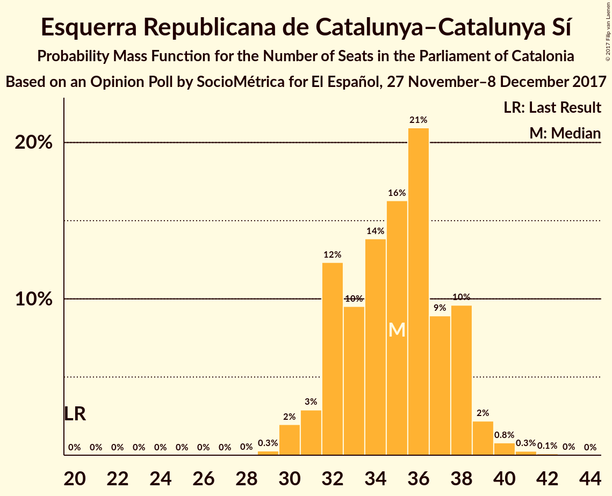
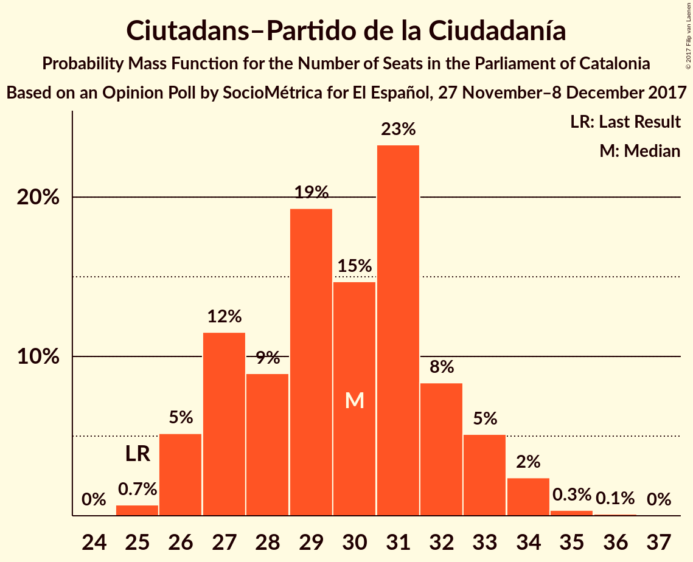
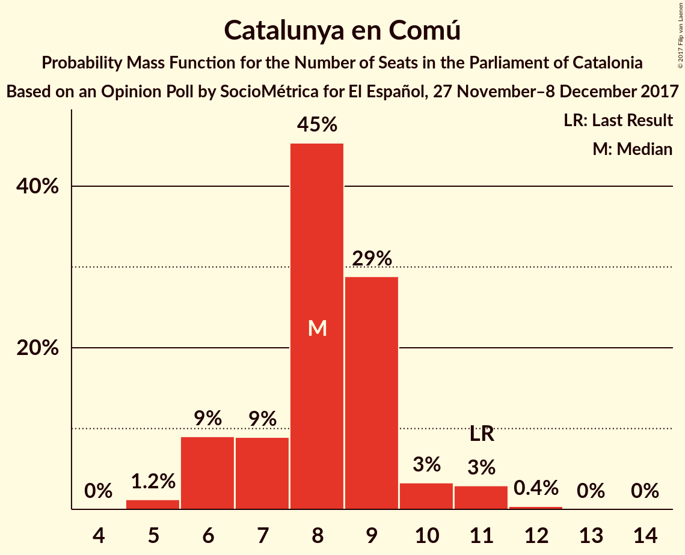

# Opinion Poll by SocioMétrica for El Español, 27 November–8 December 2017

<a href="#voting-intentions">Voting Intentions</a> | <a href="#seats">Seats</a> | <a href="#coalitions">Coalitions</a> | <a href="#technical-information">Technical Information</a>

## Voting Intentions

### Confidence Intervals

| Party | Last Result | Poll Result | 80% Confidence Interval | 90% Confidence Interval | 95% Confidence Interval | 99% Confidence Interval |
|:-----:|:-----------:|:-----------:|:-----------------------:|:-----------------------:|:-----------------------:|:-----------------------:|
| Esquerra Republicana de Catalunya–Catalunya Sí | 39.6% | 22.5% | 21.0–24.2% |20.5–24.7% |20.2–25.1% |19.4–25.9% |
| Ciutadans–Partido de la Ciudadanía | 17.9% | 21.5% | 20.0–23.2% |19.6–23.7% |19.2–24.1% |18.5–24.9% |
| Junts per Catalunya | 39.6% | 19.8% | 18.3–21.4% |17.9–21.9% |17.6–22.3% |16.9–23.1% |
| Partit dels Socialistes de Catalunya (PSC-PSOE) | 12.7% | 14.4% | 13.1–15.8% |12.7–16.2% |12.4–16.6% |11.8–17.3% |
| Catalunya en Comú | 8.9% | 7.4% | 6.4–8.5% |6.2–8.8% |6.0–9.1% |5.5–9.6% |
| Candidatura d’Unitat Popular | 8.2% | 5.5% | 4.8–6.5% |4.5–6.8% |4.3–7.1% |4.0–7.6% |
| Partit Popular | 8.5% | 5.4% | 4.6–6.3% |4.4–6.6% |4.2–6.9% |3.8–7.4% |

*Note:* The poll result column reflects the actual value used in the calculations. Published results may vary slightly, and in addition be rounded to fewer digits.

## Seats

### Confidence Intervals

| Party | Last Result | Median | 80% Confidence Interval | 90% Confidence Interval | 95% Confidence Interval | 99% Confidence Interval |
|:-----:|:-----------:|:------:|:-----------------------:|:-----------------------:|:-----------------------:|:-----------------------:|
| <a href="#esquerra-republicana-de-catalunya–catalunya-sí">Esquerra Republicana de Catalunya–Catalunya Sí</a> | 20 | 35 | 32–38 |31–38 |31–39 |30–40 |
| <a href="#ciutadans–partido-de-la-ciudadanía">Ciutadans–Partido de la Ciudadanía</a> | 25 | 30 | 27–32 |26–33 |26–34 |25–34 |
| <a href="#junts-per-catalunya">Junts per Catalunya</a> | 29 | 30 | 28–33 |27–34 |26–35 |25–36 |
| <a href="#partit-dels-socialistes-de-catalunya-(psc-psoe)">Partit dels Socialistes de Catalunya (PSC-PSOE)</a> | 16 | 19 | 16–22 |16–22 |16–23 |15–23 |
| <a href="#catalunya-en-comú">Catalunya en Comú</a> | 11 | 8 | 6–9 |6–10 |6–11 |5–11 |
| <a href="#candidatura-d’unitat-popular">Candidatura d’Unitat Popular</a> | 10 | 8 | 5–9 |4–9 |3–9 |3–9 |
| <a href="#partit-popular">Partit Popular</a> | 11 | 6 | 5–8 |4–8 |3–8 |3–10 |

### Esquerra Republicana de Catalunya–Catalunya Sí

*For a full overview of the results for this party, see the [Esquerra Republicana de Catalunya–Catalunya Sí](party-esquerrarepublicanadecatalunya–catalunyasí.html) page.*

| Number of Seats | Probability | Accumulated | Special Marks |
|:---------------:|:-----------:|:-----------:|:-------------:|
| 20 | 0% | 100% | Last Result |
| 21 | 0% | 100% |  |
| 22 | 0% | 100% |  |
| 23 | 0% | 100% |  |
| 24 | 0% | 100% |  |
| 25 | 0% | 100% |  |
| 26 | 0% | 100% |  |
| 27 | 0% | 100% |  |
| 28 | 0% | 100% |  |
| 29 | 0.3% | 100% |  |
| 30 | 2% | 99.7% |  |
| 31 | 3% | 98% |  |
| 32 | 12% | 95% |  |
| 33 | 9% | 82% |  |
| 34 | 13% | 73% |  |
| 35 | 16% | 60% | Median |
| 36 | 22% | 44% |  |
| 37 | 9% | 22% |  |
| 38 | 10% | 13% |  |
| 39 | 2% | 3% |  |
| 40 | 0.8% | 1.2% |  |
| 41 | 0.3% | 0.4% |  |
| 42 | 0.1% | 0.1% |  |
| 43 | 0% | 0% |  |

### Ciutadans–Partido de la Ciudadanía

*For a full overview of the results for this party, see the [Ciutadans–Partido de la Ciudadanía](party-ciutadans–partidodelaciudadanía.html) page.*

| Number of Seats | Probability | Accumulated | Special Marks |
|:---------------:|:-----------:|:-----------:|:-------------:|
| 24 | 0% | 100% |  |
| 25 | 0.7% | 99.9% | Last Result |
| 26 | 5% | 99.2% |  |
| 27 | 12% | 94% |  |
| 28 | 8% | 82% |  |
| 29 | 19% | 74% |  |
| 30 | 15% | 55% | Median |
| 31 | 22% | 39% |  |
| 32 | 9% | 17% |  |
| 33 | 5% | 8% |  |
| 34 | 2% | 3% |  |
| 35 | 0.3% | 0.5% |  |
| 36 | 0.1% | 0.2% |  |
| 37 | 0% | 0% |  |

### Junts per Catalunya

*For a full overview of the results for this party, see the [Junts per Catalunya](party-juntspercatalunya.html) page.*

| Number of Seats | Probability | Accumulated | Special Marks |
|:---------------:|:-----------:|:-----------:|:-------------:|
| 24 | 0.3% | 100% |  |
| 25 | 0.4% | 99.7% |  |
| 26 | 3% | 99.3% |  |
| 27 | 2% | 96% |  |
| 28 | 4% | 94% |  |
| 29 | 21% | 90% | Last Result |
| 30 | 27% | 69% | Median |
| 31 | 13% | 42% |  |
| 32 | 18% | 29% |  |
| 33 | 5% | 11% |  |
| 34 | 2% | 6% |  |
| 35 | 2% | 3% |  |
| 36 | 0.9% | 1.1% |  |
| 37 | 0.1% | 0.2% |  |
| 38 | 0% | 0% |  |

### Partit dels Socialistes de Catalunya (PSC-PSOE)

*For a full overview of the results for this party, see the [Partit dels Socialistes de Catalunya (PSC-PSOE)](party-partitdelssocialistesdecatalunyapsc-psoe.html) page.*

| Number of Seats | Probability | Accumulated | Special Marks |
|:---------------:|:-----------:|:-----------:|:-------------:|
| 14 | 0.1% | 100% |  |
| 15 | 1.4% | 99.9% |  |
| 16 | 11% | 98.6% | Last Result |
| 17 | 21% | 88% |  |
| 18 | 12% | 67% |  |
| 19 | 24% | 55% | Median |
| 20 | 9% | 31% |  |
| 21 | 7% | 22% |  |
| 22 | 10% | 15% |  |
| 23 | 4% | 4% |  |
| 24 | 0.4% | 0.4% |  |
| 25 | 0% | 0% |  |

### Catalunya en Comú

*For a full overview of the results for this party, see the [Catalunya en Comú](party-catalunyaencomú.html) page.*

| Number of Seats | Probability | Accumulated | Special Marks |
|:---------------:|:-----------:|:-----------:|:-------------:|
| 5 | 1.1% | 100% |  |
| 6 | 9% | 98.9% |  |
| 7 | 10% | 90% |  |
| 8 | 45% | 80% | Median |
| 9 | 28% | 35% |  |
| 10 | 3% | 7% |  |
| 11 | 3% | 3% | Last Result |
| 12 | 0.4% | 0.4% |  |
| 13 | 0% | 0% |  |

### Candidatura d’Unitat Popular

*For a full overview of the results for this party, see the [Candidatura d’Unitat Popular](party-candidaturad’unitatpopular.html) page.*

| Number of Seats | Probability | Accumulated | Special Marks |
|:---------------:|:-----------:|:-----------:|:-------------:|
| 3 | 3% | 100% |  |
| 4 | 3% | 97% |  |
| 5 | 15% | 95% |  |
| 6 | 8% | 80% |  |
| 7 | 11% | 72% |  |
| 8 | 50% | 60% | Median |
| 9 | 10% | 11% |  |
| 10 | 0.4% | 0.4% | Last Result |
| 11 | 0% | 0% |  |

### Partit Popular

*For a full overview of the results for this party, see the [Partit Popular](party-partitpopular.html) page.*

| Number of Seats | Probability | Accumulated | Special Marks |
|:---------------:|:-----------:|:-----------:|:-------------:|
| 3 | 3% | 100% |  |
| 4 | 4% | 97% |  |
| 5 | 35% | 94% |  |
| 6 | 37% | 59% | Median |
| 7 | 11% | 23% |  |
| 8 | 9% | 11% |  |
| 9 | 2% | 2% |  |
| 10 | 0.5% | 0.5% |  |
| 11 | 0% | 0% | Last Result |

## Coalitions

### Confidence Intervals

| Coalition | Last Result | Median | Majority? | 80% Confidence Interval | 90% Confidence Interval | 95% Confidence Interval | 99% Confidence Interval |
|:---------:|:-----------:|:------:|:---------:|:-----------------------:|:-----------------------:|:-----------------------:|:-----------------------:|
| Esquerra Republicana de Catalunya–Catalunya Sí – Junts per Catalunya – Catalunya en Comú | 60 | 74 | 99.2% | 70–77 | 69–78 | 69–78 | 67–80 |
| Esquerra Republicana de Catalunya–Catalunya Sí – Junts per Catalunya – Candidatura d’Unitat Popular | 59 | 72 | 97% | 69–76 | 68–76 | 67–77 | 66–79 |
| Esquerra Republicana de Catalunya–Catalunya Sí – Junts per Catalunya | 49 | 65 | 20% | 62–68 | 61–69 | 61–70 | 59–72 |
| Ciutadans–Partido de la Ciudadanía – Partit dels Socialistes de Catalunya (PSC-PSOE) – Catalunya en Comú – Partit Popular | 63 | 63 | 3% | 59–66 | 59–67 | 58–68 | 56–69 |
| Esquerra Republicana de Catalunya–Catalunya Sí – Partit dels Socialistes de Catalunya (PSC-PSOE) – Catalunya en Comú | 47 | 62 | 2% | 58–65 | 57–66 | 57–67 | 56–69 |
| Ciutadans–Partido de la Ciudadanía – Partit dels Socialistes de Catalunya (PSC-PSOE) – Partit Popular | 52 | 54 | 0% | 51–58 | 50–59 | 50–59 | 48–61 |

### Esquerra Republicana de Catalunya–Catalunya Sí – Junts per Catalunya – Catalunya en Comú

| Number of Seats | Probability | Accumulated | Special Marks |
|:---------------:|:-----------:|:-----------:|:-------------:|
| 60 | 0% | 100% | Last Result |
| 61 | 0% | 100% |  |
| 62 | 0% | 100% |  |
| 63 | 0% | 100% |  |
| 64 | 0% | 100% |  |
| 65 | 0.1% | 100% |  |
| 66 | 0.2% | 99.9% |  |
| 67 | 0.6% | 99.8% |  |
| 68 | 2% | 99.2% | Majority |
| 69 | 4% | 98% |  |
| 70 | 8% | 94% |  |
| 71 | 10% | 86% |  |
| 72 | 12% | 76% |  |
| 73 | 13% | 64% | Median |
| 74 | 14% | 51% |  |
| 75 | 13% | 36% |  |
| 76 | 12% | 23% |  |
| 77 | 6% | 11% |  |
| 78 | 3% | 5% |  |
| 79 | 1.4% | 2% |  |
| 80 | 0.6% | 1.0% |  |
| 81 | 0.2% | 0.3% |  |
| 82 | 0.1% | 0.1% |  |
| 83 | 0% | 0% |  |

### Esquerra Republicana de Catalunya–Catalunya Sí – Junts per Catalunya – Candidatura d’Unitat Popular

| Number of Seats | Probability | Accumulated | Special Marks |
|:---------------:|:-----------:|:-----------:|:-------------:|
| 59 | 0% | 100% | Last Result |
| 60 | 0% | 100% |  |
| 61 | 0% | 100% |  |
| 62 | 0% | 100% |  |
| 63 | 0% | 100% |  |
| 64 | 0.1% | 100% |  |
| 65 | 0.3% | 99.9% |  |
| 66 | 0.7% | 99.6% |  |
| 67 | 1.4% | 98.9% |  |
| 68 | 3% | 97% | Majority |
| 69 | 7% | 94% |  |
| 70 | 12% | 88% |  |
| 71 | 13% | 76% |  |
| 72 | 13% | 63% |  |
| 73 | 14% | 50% | Median |
| 74 | 11% | 36% |  |
| 75 | 11% | 25% |  |
| 76 | 9% | 13% |  |
| 77 | 3% | 4% |  |
| 78 | 1.2% | 2% |  |
| 79 | 0.4% | 0.6% |  |
| 80 | 0.1% | 0.2% |  |
| 81 | 0% | 0% |  |

### Esquerra Republicana de Catalunya–Catalunya Sí – Junts per Catalunya

| Number of Seats | Probability | Accumulated | Special Marks |
|:---------------:|:-----------:|:-----------:|:-------------:|
| 49 | 0% | 100% | Last Result |
| 50 | 0% | 100% |  |
| 51 | 0% | 100% |  |
| 52 | 0% | 100% |  |
| 53 | 0% | 100% |  |
| 54 | 0% | 100% |  |
| 55 | 0% | 100% |  |
| 56 | 0% | 100% |  |
| 57 | 0.1% | 100% |  |
| 58 | 0.2% | 99.9% |  |
| 59 | 0.5% | 99.7% |  |
| 60 | 1.4% | 99.3% |  |
| 61 | 5% | 98% |  |
| 62 | 9% | 93% |  |
| 63 | 11% | 84% |  |
| 64 | 11% | 74% |  |
| 65 | 14% | 63% | Median |
| 66 | 15% | 50% |  |
| 67 | 15% | 35% |  |
| 68 | 12% | 20% | Majority |
| 69 | 4% | 9% |  |
| 70 | 2% | 4% |  |
| 71 | 1.1% | 2% |  |
| 72 | 0.5% | 0.8% |  |
| 73 | 0.2% | 0.3% |  |
| 74 | 0.1% | 0.1% |  |
| 75 | 0% | 0% |  |

### Ciutadans–Partido de la Ciudadanía – Partit dels Socialistes de Catalunya (PSC-PSOE) – Catalunya en Comú – Partit Popular

| Number of Seats | Probability | Accumulated | Special Marks |
|:---------------:|:-----------:|:-----------:|:-------------:|
| 55 | 0.1% | 100% |  |
| 56 | 0.4% | 99.8% |  |
| 57 | 1.2% | 99.4% |  |
| 58 | 3% | 98% |  |
| 59 | 9% | 96% |  |
| 60 | 11% | 87% |  |
| 61 | 11% | 75% |  |
| 62 | 14% | 64% |  |
| 63 | 13% | 50% | Last Result, Median |
| 64 | 13% | 37% |  |
| 65 | 12% | 24% |  |
| 66 | 7% | 12% |  |
| 67 | 3% | 6% |  |
| 68 | 1.4% | 3% | Majority |
| 69 | 0.7% | 1.1% |  |
| 70 | 0.3% | 0.4% |  |
| 71 | 0.1% | 0.1% |  |
| 72 | 0% | 0% |  |

### Esquerra Republicana de Catalunya–Catalunya Sí – Partit dels Socialistes de Catalunya (PSC-PSOE) – Catalunya en Comú

| Number of Seats | Probability | Accumulated | Special Marks |
|:---------------:|:-----------:|:-----------:|:-------------:|
| 47 | 0% | 100% | Last Result |
| 48 | 0% | 100% |  |
| 49 | 0% | 100% |  |
| 50 | 0% | 100% |  |
| 51 | 0% | 100% |  |
| 52 | 0% | 100% |  |
| 53 | 0% | 100% |  |
| 54 | 0.1% | 100% |  |
| 55 | 0.4% | 99.9% |  |
| 56 | 1.4% | 99.5% |  |
| 57 | 3% | 98% |  |
| 58 | 5% | 95% |  |
| 59 | 7% | 90% |  |
| 60 | 10% | 82% |  |
| 61 | 15% | 72% |  |
| 62 | 16% | 57% | Median |
| 63 | 18% | 41% |  |
| 64 | 10% | 23% |  |
| 65 | 6% | 14% |  |
| 66 | 4% | 8% |  |
| 67 | 2% | 4% |  |
| 68 | 1.2% | 2% | Majority |
| 69 | 0.4% | 0.6% |  |
| 70 | 0.1% | 0.2% |  |
| 71 | 0% | 0% |  |

### Ciutadans–Partido de la Ciudadanía – Partit dels Socialistes de Catalunya (PSC-PSOE) – Partit Popular

| Number of Seats | Probability | Accumulated | Special Marks |
|:---------------:|:-----------:|:-----------:|:-------------:|
| 47 | 0.1% | 100% |  |
| 48 | 0.6% | 99.9% |  |
| 49 | 1.4% | 99.2% |  |
| 50 | 3% | 98% |  |
| 51 | 9% | 94% |  |
| 52 | 10% | 85% | Last Result |
| 53 | 12% | 75% |  |
| 54 | 15% | 63% |  |
| 55 | 13% | 48% | Median |
| 56 | 13% | 35% |  |
| 57 | 10% | 22% |  |
| 58 | 6% | 11% |  |
| 59 | 3% | 5% |  |
| 60 | 2% | 2% |  |
| 61 | 0.6% | 0.9% |  |
| 62 | 0.2% | 0.3% |  |
| 63 | 0% | 0.1% |  |
| 64 | 0% | 0% |  |

## Technical Information

### Opinion Poll

+ **Polling firm:** SocioMétrica
+ **Commissioner(s):** El Español
+ **Fieldwork period:** 27 November–8 December 2017

### Calculations

+ **Sample size:** 1100
+ **Simulations done:** 2,097,152
+ **Error estimate:** 1.17%

