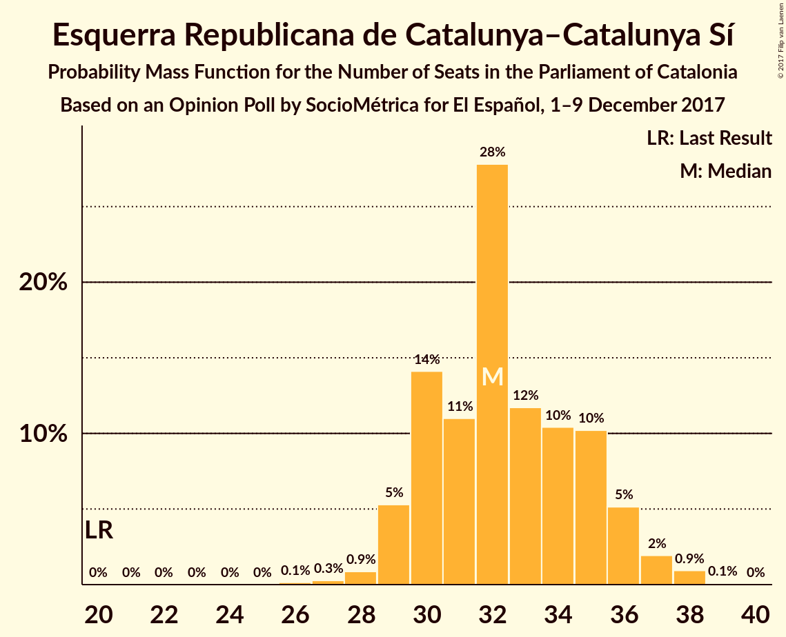

# Opinion Poll by SocioMétrica for El Español, 1–9 December 2017

<a href="#voting-intentions">Voting Intentions</a> | <a href="#seats">Seats</a> | <a href="#coalitions">Coalitions</a> | <a href="#technical-information">Technical Information</a>

## Voting Intentions

### Confidence Intervals

| Party | Last Result | Poll Result | 80% Confidence Interval | 90% Confidence Interval | 95% Confidence Interval | 99% Confidence Interval |
|:-----:|:-----------:|:-----------:|:-----------------------:|:-----------------------:|:-----------------------:|:-----------------------:|
| Esquerra Republicana de Catalunya–Catalunya Sí | 39.6% | 21.4% | 19.8–23.0% |19.4–23.5% |19.0–23.9% |18.3–24.7% |
| Junts per Catalunya | 39.6% | 21.3% | 19.8–22.9% |19.3–23.4% |18.9–23.8% |18.2–24.6% |
| Ciutadans–Partido de la Ciudadanía | 17.9% | 21.2% | 19.7–22.8% |19.2–23.3% |18.9–23.7% |18.2–24.5% |
| Partit dels Socialistes de Catalunya (PSC-PSOE) | 12.7% | 14.1% | 12.8–15.5% |12.5–15.9% |12.1–16.3% |11.6–17.0% |
| Catalunya en Comú | 8.9% | 8.2% | 7.2–9.3% |6.9–9.7% |6.7–10.0% |6.3–10.5% |
| Partit Popular | 8.5% | 6.1% | 5.3–7.1% |5.0–7.4% |4.8–7.7% |4.5–8.2% |
| Candidatura d’Unitat Popular | 8.2% | 5.9% | 5.1–6.9% |4.8–7.2% |4.7–7.5% |4.3–8.0% |

*Note:* The poll result column reflects the actual value used in the calculations. Published results may vary slightly, and in addition be rounded to fewer digits.

## Seats

### Confidence Intervals

| Party | Last Result | Median | 80% Confidence Interval | 90% Confidence Interval | 95% Confidence Interval | 99% Confidence Interval |
|:-----:|:-----------:|:------:|:-----------------------:|:-----------------------:|:-----------------------:|:-----------------------:|
| <a href="#esquerra-republicana-de-catalunya–catalunya-sí">Esquerra Republicana de Catalunya–Catalunya Sí</a> | 20 | 32 | 30–35 |29–36 |29–37 |28–38 |
| <a href="#junts-per-catalunya">Junts per Catalunya</a> | 29 | 32 | 30–35 |29–36 |29–37 |27–38 |
| <a href="#ciutadans–partido-de-la-ciudadanía">Ciutadans–Partido de la Ciudadanía</a> | 25 | 29 | 26–31 |26–32 |25–32 |25–34 |
| <a href="#partit-dels-socialistes-de-catalunya-(psc-psoe)">Partit dels Socialistes de Catalunya (PSC-PSOE)</a> | 16 | 18 | 16–21 |16–22 |15–22 |15–23 |
| <a href="#catalunya-en-comú">Catalunya en Comú</a> | 11 | 9 | 8–11 |8–11 |7–12 |6–12 |
| <a href="#partit-popular">Partit Popular</a> | 11 | 7 | 5–9 |5–9 |5–10 |4–10 |
| <a href="#candidatura-d’unitat-popular">Candidatura d’Unitat Popular</a> | 10 | 8 | 5–9 |5–9 |5–9 |3–10 |

### Esquerra Republicana de Catalunya–Catalunya Sí

*For a full overview of the results for this party, see the [Esquerra Republicana de Catalunya–Catalunya Sí](party-esquerrarepublicanadecatalunya–catalunyasí.html) page.*

| Number of Seats | Probability | Accumulated | Special Marks |
|:---------------:|:-----------:|:-----------:|:-------------:|
| 20 | 0% | 100% | Last Result |
| 21 | 0% | 100% |  |
| 22 | 0% | 100% |  |
| 23 | 0% | 100% |  |
| 24 | 0% | 100% |  |
| 25 | 0% | 100% |  |
| 26 | 0.1% | 100% |  |
| 27 | 0.3% | 99.8% |  |
| 28 | 1.1% | 99.6% |  |
| 29 | 5% | 98.5% |  |
| 30 | 15% | 94% |  |
| 31 | 10% | 78% |  |
| 32 | 27% | 68% | Median |
| 33 | 12% | 41% |  |
| 34 | 8% | 29% |  |
| 35 | 13% | 20% |  |
| 36 | 4% | 7% |  |
| 37 | 2% | 3% |  |
| 38 | 1.0% | 1.1% |  |
| 39 | 0.1% | 0.1% |  |
| 40 | 0% | 0% |  |

### Junts per Catalunya

*For a full overview of the results for this party, see the [Junts per Catalunya](party-juntspercatalunya.html) page.*

| Number of Seats | Probability | Accumulated | Special Marks |
|:---------------:|:-----------:|:-----------:|:-------------:|
| 26 | 0.2% | 100% |  |
| 27 | 0.3% | 99.8% |  |
| 28 | 1.1% | 99.5% |  |
| 29 | 6% | 98% | Last Result |
| 30 | 15% | 92% |  |
| 31 | 9% | 77% |  |
| 32 | 30% | 67% | Median |
| 33 | 13% | 37% |  |
| 34 | 10% | 25% |  |
| 35 | 8% | 15% |  |
| 36 | 4% | 7% |  |
| 37 | 3% | 4% |  |
| 38 | 0.7% | 0.8% |  |
| 39 | 0.1% | 0.1% |  |
| 40 | 0% | 0% |  |

### Ciutadans–Partido de la Ciudadanía

*For a full overview of the results for this party, see the [Ciutadans–Partido de la Ciudadanía](party-ciutadans–partidodelaciudadanía.html) page.*

| Number of Seats | Probability | Accumulated | Special Marks |
|:---------------:|:-----------:|:-----------:|:-------------:|
| 23 | 0% | 100% |  |
| 24 | 0.2% | 99.9% |  |
| 25 | 3% | 99.7% | Last Result |
| 26 | 14% | 97% |  |
| 27 | 15% | 83% |  |
| 28 | 13% | 67% |  |
| 29 | 14% | 54% | Median |
| 30 | 19% | 40% |  |
| 31 | 14% | 21% |  |
| 32 | 4% | 7% |  |
| 33 | 2% | 2% |  |
| 34 | 0.6% | 0.7% |  |
| 35 | 0.1% | 0.1% |  |
| 36 | 0% | 0% |  |

### Partit dels Socialistes de Catalunya (PSC-PSOE)

*For a full overview of the results for this party, see the [Partit dels Socialistes de Catalunya (PSC-PSOE)](party-partitdelssocialistesdecatalunyapsc-psoe.html) page.*

| Number of Seats | Probability | Accumulated | Special Marks |
|:---------------:|:-----------:|:-----------:|:-------------:|
| 14 | 0.2% | 100% |  |
| 15 | 3% | 99.7% |  |
| 16 | 21% | 96% | Last Result |
| 17 | 25% | 76% |  |
| 18 | 14% | 51% | Median |
| 19 | 16% | 36% |  |
| 20 | 10% | 20% |  |
| 21 | 5% | 10% |  |
| 22 | 5% | 6% |  |
| 23 | 0.9% | 1.0% |  |
| 24 | 0.1% | 0.1% |  |
| 25 | 0% | 0% |  |

### Catalunya en Comú

*For a full overview of the results for this party, see the [Catalunya en Comú](party-catalunyaencomú.html) page.*

| Number of Seats | Probability | Accumulated | Special Marks |
|:---------------:|:-----------:|:-----------:|:-------------:|
| 5 | 0.1% | 100% |  |
| 6 | 1.0% | 99.9% |  |
| 7 | 3% | 98.9% |  |
| 8 | 29% | 96% |  |
| 9 | 44% | 67% | Median |
| 10 | 8% | 23% |  |
| 11 | 12% | 15% | Last Result |
| 12 | 3% | 3% |  |
| 13 | 0.3% | 0.5% |  |
| 14 | 0.1% | 0.2% |  |
| 15 | 0% | 0% |  |

### Partit Popular

*For a full overview of the results for this party, see the [Partit Popular](party-partitpopular.html) page.*

| Number of Seats | Probability | Accumulated | Special Marks |
|:---------------:|:-----------:|:-----------:|:-------------:|
| 3 | 0.2% | 100% |  |
| 4 | 0.3% | 99.8% |  |
| 5 | 12% | 99.5% |  |
| 6 | 29% | 87% |  |
| 7 | 22% | 58% | Median |
| 8 | 23% | 36% |  |
| 9 | 9% | 13% |  |
| 10 | 4% | 4% |  |
| 11 | 0.1% | 0.1% | Last Result |
| 12 | 0.1% | 0.1% |  |
| 13 | 0% | 0% |  |

### Candidatura d’Unitat Popular

*For a full overview of the results for this party, see the [Candidatura d’Unitat Popular](party-candidaturad’unitatpopular.html) page.*

| Number of Seats | Probability | Accumulated | Special Marks |
|:---------------:|:-----------:|:-----------:|:-------------:|
| 3 | 0.7% | 100% |  |
| 4 | 1.2% | 99.3% |  |
| 5 | 8% | 98% |  |
| 6 | 4% | 90% |  |
| 7 | 12% | 86% |  |
| 8 | 55% | 74% | Median |
| 9 | 18% | 19% |  |
| 10 | 1.2% | 1.2% | Last Result |
| 11 | 0% | 0% |  |

## Coalitions

### Confidence Intervals

| Coalition | Last Result | Median | Majority? | 80% Confidence Interval | 90% Confidence Interval | 95% Confidence Interval | 99% Confidence Interval |
|:---------:|:-----------:|:------:|:---------:|:-----------------------:|:-----------------------:|:-----------------------:|:-----------------------:|
| Esquerra Republicana de Catalunya–Catalunya Sí – Junts per Catalunya – Catalunya en Comú | 60 | 74 | 99.5% | 70–77 | 70–78 | 69–79 | 68–80 |
| Esquerra Republicana de Catalunya–Catalunya Sí – Junts per Catalunya – Candidatura d’Unitat Popular | 59 | 72 | 97% | 69–76 | 68–76 | 67–77 | 66–78 |
| Esquerra Republicana de Catalunya–Catalunya Sí – Junts per Catalunya | 49 | 65 | 13% | 61–68 | 61–69 | 60–69 | 59–71 |
| Ciutadans–Partido de la Ciudadanía – Partit dels Socialistes de Catalunya (PSC-PSOE) – Catalunya en Comú – Partit Popular | 63 | 63 | 3% | 59–66 | 59–67 | 58–68 | 57–69 |
| Esquerra Republicana de Catalunya–Catalunya Sí – Partit dels Socialistes de Catalunya (PSC-PSOE) – Catalunya en Comú | 47 | 59 | 0.1% | 56–63 | 56–64 | 55–64 | 54–66 |
| Ciutadans–Partido de la Ciudadanía – Partit dels Socialistes de Catalunya (PSC-PSOE) – Partit Popular | 52 | 54 | 0% | 50–57 | 50–58 | 49–58 | 48–60 |

### Esquerra Republicana de Catalunya–Catalunya Sí – Junts per Catalunya – Catalunya en Comú

| Number of Seats | Probability | Accumulated | Special Marks |
|:---------------:|:-----------:|:-----------:|:-------------:|
| 60 | 0% | 100% | Last Result |
| 61 | 0% | 100% |  |
| 62 | 0% | 100% |  |
| 63 | 0% | 100% |  |
| 64 | 0% | 100% |  |
| 65 | 0% | 100% |  |
| 66 | 0.1% | 100% |  |
| 67 | 0.4% | 99.9% |  |
| 68 | 0.8% | 99.5% | Majority |
| 69 | 2% | 98.7% |  |
| 70 | 8% | 96% |  |
| 71 | 10% | 89% |  |
| 72 | 11% | 78% |  |
| 73 | 16% | 67% | Median |
| 74 | 13% | 51% |  |
| 75 | 11% | 38% |  |
| 76 | 12% | 26% |  |
| 77 | 8% | 14% |  |
| 78 | 3% | 6% |  |
| 79 | 2% | 3% |  |
| 80 | 0.6% | 0.8% |  |
| 81 | 0.2% | 0.3% |  |
| 82 | 0.1% | 0.1% |  |
| 83 | 0% | 0% |  |

### Esquerra Republicana de Catalunya–Catalunya Sí – Junts per Catalunya – Candidatura d’Unitat Popular

| Number of Seats | Probability | Accumulated | Special Marks |
|:---------------:|:-----------:|:-----------:|:-------------:|
| 59 | 0% | 100% | Last Result |
| 60 | 0% | 100% |  |
| 61 | 0% | 100% |  |
| 62 | 0% | 100% |  |
| 63 | 0% | 100% |  |
| 64 | 0.1% | 100% |  |
| 65 | 0.3% | 99.9% |  |
| 66 | 0.6% | 99.6% |  |
| 67 | 2% | 98.9% |  |
| 68 | 4% | 97% | Majority |
| 69 | 7% | 94% |  |
| 70 | 13% | 86% |  |
| 71 | 10% | 73% |  |
| 72 | 16% | 63% | Median |
| 73 | 15% | 48% |  |
| 74 | 12% | 32% |  |
| 75 | 10% | 21% |  |
| 76 | 7% | 11% |  |
| 77 | 2% | 4% |  |
| 78 | 1.2% | 2% |  |
| 79 | 0.3% | 0.4% |  |
| 80 | 0.1% | 0.1% |  |
| 81 | 0% | 0% |  |

### Esquerra Republicana de Catalunya–Catalunya Sí – Junts per Catalunya

| Number of Seats | Probability | Accumulated | Special Marks |
|:---------------:|:-----------:|:-----------:|:-------------:|
| 49 | 0% | 100% | Last Result |
| 50 | 0% | 100% |  |
| 51 | 0% | 100% |  |
| 52 | 0% | 100% |  |
| 53 | 0% | 100% |  |
| 54 | 0% | 100% |  |
| 55 | 0% | 100% |  |
| 56 | 0% | 100% |  |
| 57 | 0.1% | 100% |  |
| 58 | 0.3% | 99.9% |  |
| 59 | 1.0% | 99.6% |  |
| 60 | 3% | 98.6% |  |
| 61 | 6% | 95% |  |
| 62 | 12% | 89% |  |
| 63 | 11% | 77% |  |
| 64 | 13% | 66% | Median |
| 65 | 17% | 53% |  |
| 66 | 12% | 36% |  |
| 67 | 12% | 25% |  |
| 68 | 7% | 13% | Majority |
| 69 | 4% | 6% |  |
| 70 | 1.4% | 2% |  |
| 71 | 0.5% | 0.8% |  |
| 72 | 0.2% | 0.3% |  |
| 73 | 0.1% | 0.1% |  |
| 74 | 0% | 0% |  |

### Ciutadans–Partido de la Ciudadanía – Partit dels Socialistes de Catalunya (PSC-PSOE) – Catalunya en Comú – Partit Popular

| Number of Seats | Probability | Accumulated | Special Marks |
|:---------------:|:-----------:|:-----------:|:-------------:|
| 55 | 0.1% | 100% |  |
| 56 | 0.3% | 99.9% |  |
| 57 | 1.2% | 99.6% |  |
| 58 | 2% | 98% |  |
| 59 | 7% | 96% |  |
| 60 | 10% | 89% |  |
| 61 | 12% | 79% |  |
| 62 | 15% | 68% |  |
| 63 | 16% | 52% | Last Result, Median |
| 64 | 10% | 37% |  |
| 65 | 13% | 27% |  |
| 66 | 7% | 14% |  |
| 67 | 4% | 6% |  |
| 68 | 2% | 3% | Majority |
| 69 | 0.6% | 1.1% |  |
| 70 | 0.3% | 0.4% |  |
| 71 | 0.1% | 0.1% |  |
| 72 | 0% | 0% |  |

### Esquerra Republicana de Catalunya–Catalunya Sí – Partit dels Socialistes de Catalunya (PSC-PSOE) – Catalunya en Comú

| Number of Seats | Probability | Accumulated | Special Marks |
|:---------------:|:-----------:|:-----------:|:-------------:|
| 47 | 0% | 100% | Last Result |
| 48 | 0% | 100% |  |
| 49 | 0% | 100% |  |
| 50 | 0% | 100% |  |
| 51 | 0% | 100% |  |
| 52 | 0.1% | 100% |  |
| 53 | 0.4% | 99.9% |  |
| 54 | 1.1% | 99.5% |  |
| 55 | 2% | 98% |  |
| 56 | 8% | 96% |  |
| 57 | 15% | 88% |  |
| 58 | 14% | 74% |  |
| 59 | 11% | 60% | Median |
| 60 | 14% | 49% |  |
| 61 | 12% | 34% |  |
| 62 | 11% | 22% |  |
| 63 | 6% | 12% |  |
| 64 | 3% | 5% |  |
| 65 | 1.4% | 2% |  |
| 66 | 0.5% | 1.0% |  |
| 67 | 0.4% | 0.5% |  |
| 68 | 0.1% | 0.1% | Majority |
| 69 | 0% | 0% |  |

### Ciutadans–Partido de la Ciudadanía – Partit dels Socialistes de Catalunya (PSC-PSOE) – Partit Popular

| Number of Seats | Probability | Accumulated | Special Marks |
|:---------------:|:-----------:|:-----------:|:-------------:|
| 47 | 0.3% | 100% |  |
| 48 | 2% | 99.7% |  |
| 49 | 2% | 98% |  |
| 50 | 7% | 96% |  |
| 51 | 10% | 88% |  |
| 52 | 12% | 78% | Last Result |
| 53 | 13% | 67% |  |
| 54 | 18% | 54% | Median |
| 55 | 11% | 36% |  |
| 56 | 11% | 25% |  |
| 57 | 9% | 14% |  |
| 58 | 3% | 5% |  |
| 59 | 1.4% | 2% |  |
| 60 | 0.6% | 1.0% |  |
| 61 | 0.2% | 0.3% |  |
| 62 | 0.1% | 0.1% |  |
| 63 | 0% | 0% |  |

## Technical Information

### Opinion Poll

+ **Polling firm:** SocioMétrica
+ **Commissioner(s):** El Español
+ **Fieldwork period:** 1–9 December 2017

### Calculations

+ **Sample size:** 1100
+ **Simulations done:** 1,048,576
+ **Error estimate:** 1.25%

