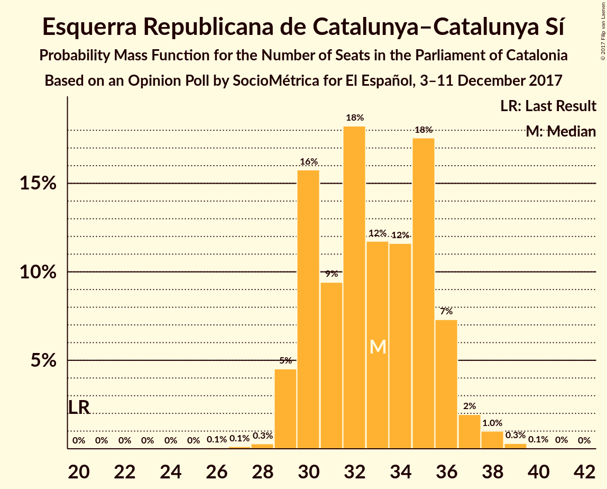

# Opinion Poll by SocioMétrica for El Español, 3–11 December 2017

<a href="#voting-intentions">Voting Intentions</a> | <a href="#seats">Seats</a> | <a href="#coalitions">Coalitions</a> | <a href="#technical-information">Technical Information</a>

## Voting Intentions

### Confidence Intervals

| Party | Last Result | Poll Result | 80% Confidence Interval | 90% Confidence Interval | 95% Confidence Interval | 99% Confidence Interval |
|:-----:|:-----------:|:-----------:|:-----------------------:|:-----------------------:|:-----------------------:|:-----------------------:|
| Ciutadans–Partido de la Ciudadanía | 17.9% | 21.9% | 20.4–23.6% |19.9–24.1% |19.6–24.5% |18.8–25.3% |
| Esquerra Republicana de Catalunya–Catalunya Sí | 39.6% | 21.5% | 20.0–23.2% |19.6–23.7% |19.2–24.1% |18.5–24.9% |
| Junts per Catalunya | 39.6% | 20.6% | 19.1–22.3% |18.7–22.7% |18.3–23.1% |17.6–23.9% |
| Partit dels Socialistes de Catalunya (PSC-PSOE) | 12.7% | 14.6% | 13.3–16.1% |13.0–16.5% |12.7–16.9% |12.1–17.6% |
| Catalunya en Comú | 8.9% | 9.1% | 8.1–10.3% |7.8–10.6% |7.5–10.9% |7.1–11.6% |
| Candidatura d’Unitat Popular | 8.2% | 5.3% | 4.5–6.2% |4.3–6.5% |4.1–6.8% |3.7–7.3% |
| Partit Popular | 8.5% | 5.0% | 4.3–6.0% |4.0–6.2% |3.9–6.5% |3.5–7.0% |

*Note:* The poll result column reflects the actual value used in the calculations. Published results may vary slightly, and in addition be rounded to fewer digits.

## Seats

### Confidence Intervals

| Party | Last Result | Median | 80% Confidence Interval | 90% Confidence Interval | 95% Confidence Interval | 99% Confidence Interval |
|:-----:|:-----------:|:------:|:-----------------------:|:-----------------------:|:-----------------------:|:-----------------------:|
| <a href="#ciutadans–partido-de-la-ciudadanía">Ciutadans–Partido de la Ciudadanía</a> | 25 | 30 | 27–33 |26–33 |26–34 |25–35 |
| <a href="#esquerra-republicana-de-catalunya–catalunya-sí">Esquerra Republicana de Catalunya–Catalunya Sí</a> | 20 | 32 | 30–36 |30–36 |29–37 |28–39 |
| <a href="#junts-per-catalunya">Junts per Catalunya</a> | 29 | 31 | 29–35 |29–35 |28–35 |26–37 |
| <a href="#partit-dels-socialistes-de-catalunya-(psc-psoe)">Partit dels Socialistes de Catalunya (PSC-PSOE)</a> | 16 | 19 | 16–22 |16–22 |16–23 |15–24 |
| <a href="#catalunya-en-comú">Catalunya en Comú</a> | 11 | 11 | 9–12 |8–13 |8–14 |8–14 |
| <a href="#candidatura-d’unitat-popular">Candidatura d’Unitat Popular</a> | 10 | 7 | 4–8 |3–8 |3–9 |3–9 |
| <a href="#partit-popular">Partit Popular</a> | 11 | 5 | 4–7 |3–7 |3–8 |3–8 |

### Ciutadans–Partido de la Ciudadanía

*For a full overview of the results for this party, see the [Ciutadans–Partido de la Ciudadanía](party-ciutadans–partidodelaciudadanía.html) page.*

| Number of Seats | Probability | Accumulated | Special Marks |
|:---------------:|:-----------:|:-----------:|:-------------:|
| 25 | 0.7% | 100% | Last Result |
| 26 | 7% | 99.2% |  |
| 27 | 14% | 93% |  |
| 28 | 7% | 78% |  |
| 29 | 10% | 71% |  |
| 30 | 19% | 61% | Median |
| 31 | 19% | 42% |  |
| 32 | 6% | 22% |  |
| 33 | 13% | 17% |  |
| 34 | 3% | 3% |  |
| 35 | 0.7% | 0.8% |  |
| 36 | 0.1% | 0.1% |  |
| 37 | 0% | 0% |  |

### Esquerra Republicana de Catalunya–Catalunya Sí

*For a full overview of the results for this party, see the [Esquerra Republicana de Catalunya–Catalunya Sí](party-esquerrarepublicanadecatalunya–catalunyasí.html) page.*

| Number of Seats | Probability | Accumulated | Special Marks |
|:---------------:|:-----------:|:-----------:|:-------------:|
| 20 | 0% | 100% | Last Result |
| 21 | 0% | 100% |  |
| 22 | 0% | 100% |  |
| 23 | 0% | 100% |  |
| 24 | 0% | 100% |  |
| 25 | 0% | 100% |  |
| 26 | 0% | 100% |  |
| 27 | 0.3% | 99.9% |  |
| 28 | 0.3% | 99.6% |  |
| 29 | 4% | 99.4% |  |
| 30 | 16% | 95% |  |
| 31 | 10% | 79% |  |
| 32 | 28% | 69% | Median |
| 33 | 8% | 42% |  |
| 34 | 10% | 33% |  |
| 35 | 12% | 23% |  |
| 36 | 7% | 11% |  |
| 37 | 2% | 3% |  |
| 38 | 0.9% | 2% |  |
| 39 | 0.5% | 0.6% |  |
| 40 | 0.1% | 0.1% |  |
| 41 | 0% | 0% |  |

### Junts per Catalunya

*For a full overview of the results for this party, see the [Junts per Catalunya](party-juntspercatalunya.html) page.*

| Number of Seats | Probability | Accumulated | Special Marks |
|:---------------:|:-----------:|:-----------:|:-------------:|
| 24 | 0.1% | 100% |  |
| 25 | 0.2% | 99.9% |  |
| 26 | 0.8% | 99.7% |  |
| 27 | 1.0% | 99.0% |  |
| 28 | 1.3% | 98% |  |
| 29 | 16% | 97% | Last Result |
| 30 | 30% | 81% |  |
| 31 | 12% | 51% | Median |
| 32 | 14% | 40% |  |
| 33 | 9% | 26% |  |
| 34 | 4% | 17% |  |
| 35 | 10% | 12% |  |
| 36 | 2% | 2% |  |
| 37 | 0.5% | 0.7% |  |
| 38 | 0.2% | 0.2% |  |
| 39 | 0% | 0% |  |

### Partit dels Socialistes de Catalunya (PSC-PSOE)

*For a full overview of the results for this party, see the [Partit dels Socialistes de Catalunya (PSC-PSOE)](party-partitdelssocialistesdecatalunyapsc-psoe.html) page.*

| Number of Seats | Probability | Accumulated | Special Marks |
|:---------------:|:-----------:|:-----------:|:-------------:|
| 14 | 0.1% | 100% |  |
| 15 | 1.1% | 99.9% |  |
| 16 | 12% | 98.8% | Last Result |
| 17 | 21% | 87% |  |
| 18 | 12% | 66% |  |
| 19 | 11% | 54% | Median |
| 20 | 8% | 43% |  |
| 21 | 13% | 35% |  |
| 22 | 18% | 22% |  |
| 23 | 3% | 4% |  |
| 24 | 0.7% | 0.7% |  |
| 25 | 0% | 0% |  |

### Catalunya en Comú

*For a full overview of the results for this party, see the [Catalunya en Comú](party-catalunyaencomú.html) page.*

| Number of Seats | Probability | Accumulated | Special Marks |
|:---------------:|:-----------:|:-----------:|:-------------:|
| 6 | 0.1% | 100% |  |
| 7 | 0.2% | 99.9% |  |
| 8 | 5% | 99.7% |  |
| 9 | 29% | 95% |  |
| 10 | 13% | 65% |  |
| 11 | 32% | 52% | Last Result, Median |
| 12 | 14% | 20% |  |
| 13 | 3% | 6% |  |
| 14 | 3% | 3% |  |
| 15 | 0.2% | 0.2% |  |
| 16 | 0% | 0% |  |

### Candidatura d’Unitat Popular

*For a full overview of the results for this party, see the [Candidatura d’Unitat Popular](party-candidaturad’unitatpopular.html) page.*

| Number of Seats | Probability | Accumulated | Special Marks |
|:---------------:|:-----------:|:-----------:|:-------------:|
| 3 | 7% | 100% |  |
| 4 | 8% | 93% |  |
| 5 | 16% | 85% |  |
| 6 | 9% | 69% |  |
| 7 | 22% | 61% | Median |
| 8 | 35% | 39% |  |
| 9 | 4% | 4% |  |
| 10 | 0.1% | 0.1% | Last Result |
| 11 | 0% | 0% |  |

### Partit Popular

*For a full overview of the results for this party, see the [Partit Popular](party-partitpopular.html) page.*

| Number of Seats | Probability | Accumulated | Special Marks |
|:---------------:|:-----------:|:-----------:|:-------------:|
| 2 | 0.1% | 100% |  |
| 3 | 9% | 99.9% |  |
| 4 | 5% | 91% |  |
| 5 | 48% | 86% | Median |
| 6 | 25% | 37% |  |
| 7 | 9% | 12% |  |
| 8 | 3% | 3% |  |
| 9 | 0.4% | 0.5% |  |
| 10 | 0.1% | 0.1% |  |
| 11 | 0% | 0% | Last Result |

## Coalitions

### Confidence Intervals

| Coalition | Last Result | Median | Majority? | 80% Confidence Interval | 90% Confidence Interval | 95% Confidence Interval | 99% Confidence Interval |
|:---------:|:-----------:|:------:|:---------:|:-----------------------:|:-----------------------:|:-----------------------:|:-----------------------:|
| Esquerra Republicana de Catalunya–Catalunya Sí – Junts per Catalunya – Catalunya en Comú | 60 | 74 | 99.9% | 71–78 | 70–79 | 70–80 | 68–82 |
| Esquerra Republicana de Catalunya–Catalunya Sí – Junts per Catalunya – Candidatura d’Unitat Popular | 59 | 70 | 85% | 67–74 | 66–75 | 65–76 | 64–77 |
| Ciutadans–Partido de la Ciudadanía – Partit dels Socialistes de Catalunya (PSC-PSOE) – Catalunya en Comú – Partit Popular | 63 | 65 | 15% | 61–68 | 60–69 | 59–70 | 58–71 |
| Esquerra Republicana de Catalunya–Catalunya Sí – Junts per Catalunya | 49 | 63 | 10% | 61–67 | 60–68 | 59–69 | 57–71 |
| Esquerra Republicana de Catalunya–Catalunya Sí – Partit dels Socialistes de Catalunya (PSC-PSOE) – Catalunya en Comú | 47 | 62 | 3% | 58–66 | 58–67 | 57–68 | 56–69 |
| Ciutadans–Partido de la Ciudadanía – Partit dels Socialistes de Catalunya (PSC-PSOE) – Partit Popular | 52 | 54 | 0% | 50–58 | 50–59 | 49–60 | 47–61 |

### Esquerra Republicana de Catalunya–Catalunya Sí – Junts per Catalunya – Catalunya en Comú

| Number of Seats | Probability | Accumulated | Special Marks |
|:---------------:|:-----------:|:-----------:|:-------------:|
| 60 | 0% | 100% | Last Result |
| 61 | 0% | 100% |  |
| 62 | 0% | 100% |  |
| 63 | 0% | 100% |  |
| 64 | 0% | 100% |  |
| 65 | 0% | 100% |  |
| 66 | 0% | 100% |  |
| 67 | 0.1% | 99.9% |  |
| 68 | 0.5% | 99.9% | Majority |
| 69 | 1.2% | 99.4% |  |
| 70 | 6% | 98% |  |
| 71 | 9% | 92% |  |
| 72 | 13% | 83% |  |
| 73 | 10% | 70% |  |
| 74 | 19% | 60% | Median |
| 75 | 9% | 41% |  |
| 76 | 9% | 32% |  |
| 77 | 10% | 23% |  |
| 78 | 7% | 13% |  |
| 79 | 3% | 6% |  |
| 80 | 2% | 3% |  |
| 81 | 0.6% | 1.3% |  |
| 82 | 0.5% | 0.7% |  |
| 83 | 0.1% | 0.2% |  |
| 84 | 0% | 0% |  |

### Esquerra Republicana de Catalunya–Catalunya Sí – Junts per Catalunya – Candidatura d’Unitat Popular

| Number of Seats | Probability | Accumulated | Special Marks |
|:---------------:|:-----------:|:-----------:|:-------------:|
| 59 | 0% | 100% | Last Result |
| 60 | 0% | 100% |  |
| 61 | 0% | 100% |  |
| 62 | 0% | 100% |  |
| 63 | 0.3% | 99.9% |  |
| 64 | 1.3% | 99.7% |  |
| 65 | 2% | 98% |  |
| 66 | 5% | 96% |  |
| 67 | 6% | 91% |  |
| 68 | 6% | 85% | Majority |
| 69 | 15% | 78% |  |
| 70 | 19% | 63% | Median |
| 71 | 14% | 44% |  |
| 72 | 7% | 29% |  |
| 73 | 8% | 22% |  |
| 74 | 7% | 15% |  |
| 75 | 5% | 8% |  |
| 76 | 2% | 3% |  |
| 77 | 0.5% | 0.9% |  |
| 78 | 0.3% | 0.3% |  |
| 79 | 0% | 0.1% |  |
| 80 | 0% | 0% |  |

### Ciutadans–Partido de la Ciudadanía – Partit dels Socialistes de Catalunya (PSC-PSOE) – Catalunya en Comú – Partit Popular

| Number of Seats | Probability | Accumulated | Special Marks |
|:---------------:|:-----------:|:-----------:|:-------------:|
| 56 | 0% | 100% |  |
| 57 | 0.3% | 99.9% |  |
| 58 | 0.5% | 99.7% |  |
| 59 | 2% | 99.1% |  |
| 60 | 5% | 97% |  |
| 61 | 7% | 92% |  |
| 62 | 8% | 85% |  |
| 63 | 7% | 78% | Last Result |
| 64 | 14% | 71% |  |
| 65 | 19% | 56% | Median |
| 66 | 15% | 37% |  |
| 67 | 6% | 22% |  |
| 68 | 6% | 15% | Majority |
| 69 | 5% | 9% |  |
| 70 | 2% | 4% |  |
| 71 | 1.3% | 2% |  |
| 72 | 0.3% | 0.3% |  |
| 73 | 0% | 0.1% |  |
| 74 | 0% | 0% |  |

### Esquerra Republicana de Catalunya–Catalunya Sí – Junts per Catalunya

| Number of Seats | Probability | Accumulated | Special Marks |
|:---------------:|:-----------:|:-----------:|:-------------:|
| 49 | 0% | 100% | Last Result |
| 50 | 0% | 100% |  |
| 51 | 0% | 100% |  |
| 52 | 0% | 100% |  |
| 53 | 0% | 100% |  |
| 54 | 0% | 100% |  |
| 55 | 0% | 100% |  |
| 56 | 0.1% | 100% |  |
| 57 | 0.4% | 99.9% |  |
| 58 | 0.7% | 99.5% |  |
| 59 | 2% | 98.8% |  |
| 60 | 6% | 97% |  |
| 61 | 10% | 91% |  |
| 62 | 12% | 81% |  |
| 63 | 21% | 69% | Median |
| 64 | 9% | 48% |  |
| 65 | 16% | 39% |  |
| 66 | 6% | 24% |  |
| 67 | 8% | 18% |  |
| 68 | 5% | 10% | Majority |
| 69 | 2% | 5% |  |
| 70 | 2% | 2% |  |
| 71 | 0.4% | 0.7% |  |
| 72 | 0.2% | 0.3% |  |
| 73 | 0.1% | 0.1% |  |
| 74 | 0% | 0% |  |

### Esquerra Republicana de Catalunya–Catalunya Sí – Partit dels Socialistes de Catalunya (PSC-PSOE) – Catalunya en Comú

| Number of Seats | Probability | Accumulated | Special Marks |
|:---------------:|:-----------:|:-----------:|:-------------:|
| 47 | 0% | 100% | Last Result |
| 48 | 0% | 100% |  |
| 49 | 0% | 100% |  |
| 50 | 0% | 100% |  |
| 51 | 0% | 100% |  |
| 52 | 0% | 100% |  |
| 53 | 0% | 100% |  |
| 54 | 0% | 100% |  |
| 55 | 0.2% | 100% |  |
| 56 | 0.7% | 99.8% |  |
| 57 | 4% | 99.1% |  |
| 58 | 7% | 96% |  |
| 59 | 9% | 88% |  |
| 60 | 8% | 79% |  |
| 61 | 14% | 71% |  |
| 62 | 12% | 57% | Median |
| 63 | 15% | 45% |  |
| 64 | 12% | 31% |  |
| 65 | 8% | 19% |  |
| 66 | 4% | 11% |  |
| 67 | 5% | 7% |  |
| 68 | 2% | 3% | Majority |
| 69 | 0.8% | 1.0% |  |
| 70 | 0.2% | 0.2% |  |
| 71 | 0% | 0.1% |  |
| 72 | 0% | 0% |  |

### Ciutadans–Partido de la Ciudadanía – Partit dels Socialistes de Catalunya (PSC-PSOE) – Partit Popular

| Number of Seats | Probability | Accumulated | Special Marks |
|:---------------:|:-----------:|:-----------:|:-------------:|
| 46 | 0.1% | 100% |  |
| 47 | 0.7% | 99.9% |  |
| 48 | 0.9% | 99.2% |  |
| 49 | 3% | 98% |  |
| 50 | 7% | 96% |  |
| 51 | 5% | 89% |  |
| 52 | 10% | 83% | Last Result |
| 53 | 13% | 73% |  |
| 54 | 12% | 60% | Median |
| 55 | 13% | 48% |  |
| 56 | 11% | 35% |  |
| 57 | 12% | 24% |  |
| 58 | 6% | 11% |  |
| 59 | 3% | 5% |  |
| 60 | 2% | 3% |  |
| 61 | 0.5% | 0.5% |  |
| 62 | 0.1% | 0.1% |  |
| 63 | 0% | 0% |  |

## Technical Information

### Opinion Poll

+ **Polling firm:** SocioMétrica
+ **Commissioner(s):** El Español
+ **Fieldwork period:** 3–11 December 2017

### Calculations

+ **Sample size:** 1100
+ **Simulations done:** 262,144
+ **Error estimate:** 2.15%

