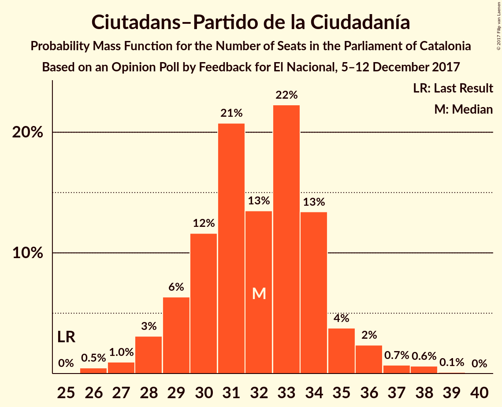
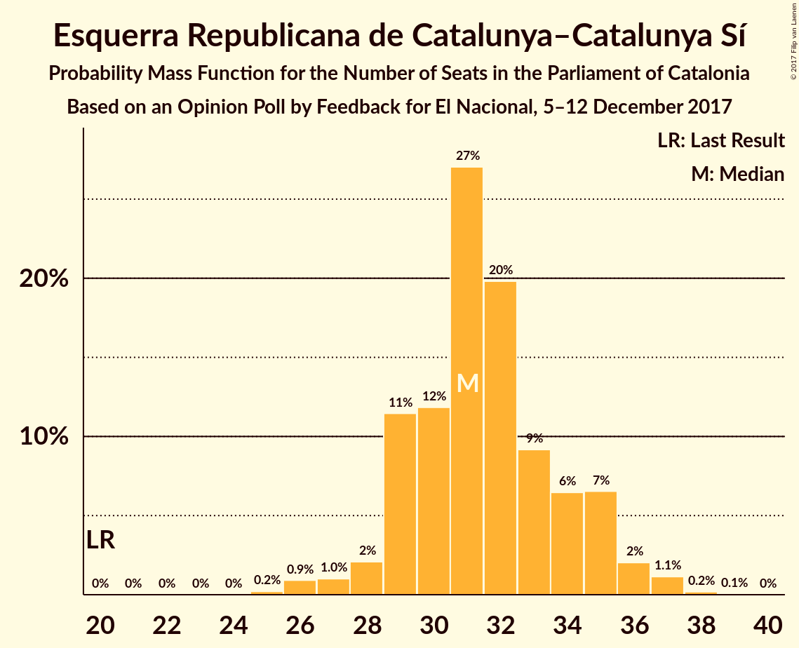
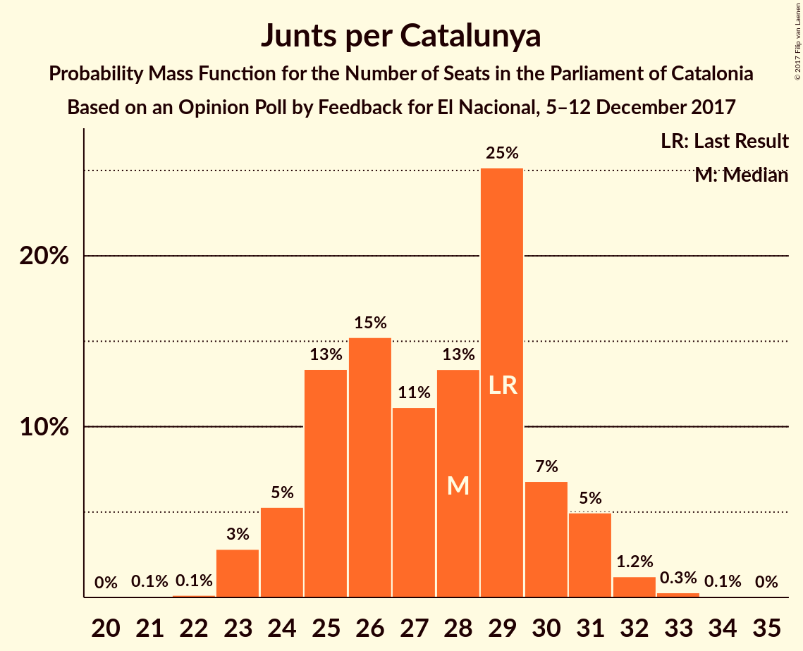
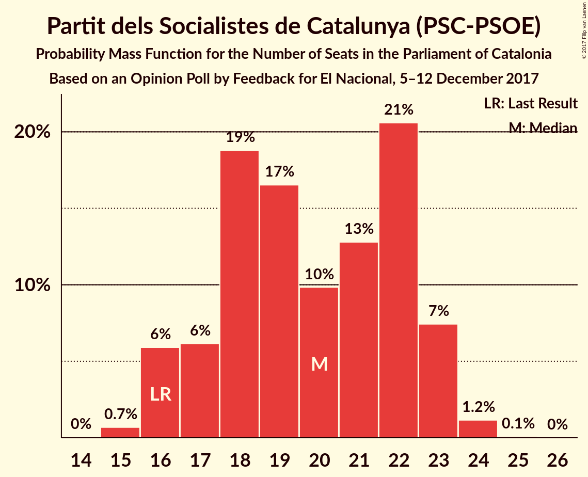

# Opinion Poll by Feedback for El Nacional, 5–12 December 2017

<a href="#voting-intentions">Voting Intentions</a> | <a href="#seats">Seats</a> | <a href="#coalitions">Coalitions</a> | <a href="#technical-information">Technical Information</a>

## Voting Intentions

### Confidence Intervals

| Party | Last Result | Poll Result | 80% Confidence Interval | 90% Confidence Interval | 95% Confidence Interval | 99% Confidence Interval |
|:-----:|:-----------:|:-----------:|:-----------------------:|:-----------------------:|:-----------------------:|:-----------------------:|
| Ciutadans–Partido de la Ciudadanía | 17.9% | 23.6% | 21.9–25.4% |21.5–25.9% |21.1–26.3% |20.3–27.2% |
| Esquerra Republicana de Catalunya–Catalunya Sí | 39.6% | 20.9% | 19.3–22.6% |18.9–23.1% |18.5–23.5% |17.8–24.4% |
| Junts per Catalunya | 39.6% | 18.3% | 16.8–20.0% |16.4–20.4% |16.0–20.8% |15.3–21.6% |
| Partit dels Socialistes de Catalunya (PSC-PSOE) | 12.7% | 15.2% | 13.8–16.8% |13.4–17.2% |13.1–17.6% |12.5–18.3% |
| Catalunya en Comú | 8.9% | 8.2% | 7.2–9.4% |6.9–9.8% |6.6–10.1% |6.2–10.7% |
| Candidatura d’Unitat Popular | 8.2% | 7.7% | 6.7–8.9% |6.4–9.2% |6.2–9.5% |5.8–10.1% |
| Partit Popular | 8.5% | 5.4% | 4.6–6.4% |4.3–6.7% |4.2–7.0% |3.8–7.5% |

*Note:* The poll result column reflects the actual value used in the calculations. Published results may vary slightly, and in addition be rounded to fewer digits.

## Seats

### Confidence Intervals

| Party | Last Result | Median | 80% Confidence Interval | 90% Confidence Interval | 95% Confidence Interval | 99% Confidence Interval |
|:-----:|:-----------:|:------:|:-----------------------:|:-----------------------:|:-----------------------:|:-----------------------:|
| <a href="#ciutadans–partido-de-la-ciudadanía">Ciutadans–Partido de la Ciudadanía</a> | 25 | 32 | 30–35 |29–35 |28–36 |26–38 |
| <a href="#esquerra-republicana-de-catalunya–catalunya-sí">Esquerra Republicana de Catalunya–Catalunya Sí</a> | 20 | 31 | 30–35 |29–35 |28–36 |26–37 |
| <a href="#junts-per-catalunya">Junts per Catalunya</a> | 29 | 28 | 25–30 |24–31 |23–31 |23–32 |
| <a href="#partit-dels-socialistes-de-catalunya-(psc-psoe)">Partit dels Socialistes de Catalunya (PSC-PSOE)</a> | 16 | 20 | 17–23 |16–23 |16–23 |15–24 |
| <a href="#catalunya-en-comú">Catalunya en Comú</a> | 11 | 9 | 8–11 |8–11 |7–12 |6–13 |
| <a href="#candidatura-d’unitat-popular">Candidatura d’Unitat Popular</a> | 10 | 9 | 8–11 |8–12 |8–12 |8–14 |
| <a href="#partit-popular">Partit Popular</a> | 11 | 5 | 4–7 |3–8 |3–9 |3–10 |

### Ciutadans–Partido de la Ciudadanía

*For a full overview of the results for this party, see the [Ciutadans–Partido de la Ciudadanía](party-ciutadans–partidodelaciudadanía.html) page.*

| Number of Seats | Probability | Accumulated | Special Marks |
|:---------------:|:-----------:|:-----------:|:-------------:|
| 25 | 0% | 100% | Last Result |
| 26 | 0.6% | 100% |  |
| 27 | 0.9% | 99.3% |  |
| 28 | 3% | 98% |  |
| 29 | 4% | 96% |  |
| 30 | 14% | 91% |  |
| 31 | 15% | 78% |  |
| 32 | 14% | 63% | Median |
| 33 | 20% | 49% |  |
| 34 | 18% | 29% |  |
| 35 | 6% | 11% |  |
| 36 | 3% | 5% |  |
| 37 | 0.9% | 2% |  |
| 38 | 0.7% | 0.8% |  |
| 39 | 0.1% | 0.1% |  |
| 40 | 0% | 0% |  |

### Esquerra Republicana de Catalunya–Catalunya Sí

*For a full overview of the results for this party, see the [Esquerra Republicana de Catalunya–Catalunya Sí](party-esquerrarepublicanadecatalunya–catalunyasí.html) page.*

| Number of Seats | Probability | Accumulated | Special Marks |
|:---------------:|:-----------:|:-----------:|:-------------:|
| 20 | 0% | 100% | Last Result |
| 21 | 0% | 100% |  |
| 22 | 0% | 100% |  |
| 23 | 0% | 100% |  |
| 24 | 0% | 100% |  |
| 25 | 0.3% | 100% |  |
| 26 | 1.0% | 99.7% |  |
| 27 | 1.1% | 98.6% |  |
| 28 | 1.2% | 98% |  |
| 29 | 6% | 96% |  |
| 30 | 12% | 90% |  |
| 31 | 33% | 78% | Median |
| 32 | 26% | 45% |  |
| 33 | 6% | 19% |  |
| 34 | 3% | 13% |  |
| 35 | 6% | 10% |  |
| 36 | 3% | 5% |  |
| 37 | 2% | 2% |  |
| 38 | 0.1% | 0.2% |  |
| 39 | 0% | 0% |  |

### Junts per Catalunya

*For a full overview of the results for this party, see the [Junts per Catalunya](party-juntspercatalunya.html) page.*

| Number of Seats | Probability | Accumulated | Special Marks |
|:---------------:|:-----------:|:-----------:|:-------------:|
| 21 | 0.1% | 100% |  |
| 22 | 0.2% | 99.9% |  |
| 23 | 3% | 99.7% |  |
| 24 | 6% | 97% |  |
| 25 | 13% | 91% |  |
| 26 | 16% | 77% |  |
| 27 | 10% | 61% |  |
| 28 | 13% | 51% | Median |
| 29 | 26% | 38% | Last Result |
| 30 | 7% | 12% |  |
| 31 | 4% | 5% |  |
| 32 | 1.2% | 2% |  |
| 33 | 0.2% | 0.3% |  |
| 34 | 0.1% | 0.1% |  |
| 35 | 0.1% | 0.1% |  |
| 36 | 0% | 0% |  |

### Partit dels Socialistes de Catalunya (PSC-PSOE)

*For a full overview of the results for this party, see the [Partit dels Socialistes de Catalunya (PSC-PSOE)](party-partitdelssocialistesdecatalunyapsc-psoe.html) page.*

| Number of Seats | Probability | Accumulated | Special Marks |
|:---------------:|:-----------:|:-----------:|:-------------:|
| 15 | 0.8% | 100% |  |
| 16 | 6% | 99.2% | Last Result |
| 17 | 6% | 93% |  |
| 18 | 16% | 87% |  |
| 19 | 18% | 72% |  |
| 20 | 6% | 54% | Median |
| 21 | 17% | 48% |  |
| 22 | 20% | 31% |  |
| 23 | 9% | 11% |  |
| 24 | 2% | 2% |  |
| 25 | 0.1% | 0.1% |  |
| 26 | 0% | 0% |  |

### Catalunya en Comú

*For a full overview of the results for this party, see the [Catalunya en Comú](party-catalunyaencomú.html) page.*

| Number of Seats | Probability | Accumulated | Special Marks |
|:---------------:|:-----------:|:-----------:|:-------------:|
| 5 | 0.2% | 100% |  |
| 6 | 2% | 99.8% |  |
| 7 | 2% | 98% |  |
| 8 | 41% | 95% |  |
| 9 | 34% | 54% | Median |
| 10 | 6% | 20% |  |
| 11 | 11% | 14% | Last Result |
| 12 | 2% | 3% |  |
| 13 | 0.4% | 0.6% |  |
| 14 | 0.2% | 0.2% |  |
| 15 | 0% | 0% |  |

### Candidatura d’Unitat Popular

*For a full overview of the results for this party, see the [Candidatura d’Unitat Popular](party-candidaturad’unitatpopular.html) page.*

| Number of Seats | Probability | Accumulated | Special Marks |
|:---------------:|:-----------:|:-----------:|:-------------:|
| 6 | 0% | 100% |  |
| 7 | 0.2% | 99.9% |  |
| 8 | 14% | 99.7% |  |
| 9 | 45% | 86% | Median |
| 10 | 31% | 41% | Last Result |
| 11 | 4% | 10% |  |
| 12 | 5% | 6% |  |
| 13 | 0.4% | 1.1% |  |
| 14 | 0.3% | 0.6% |  |
| 15 | 0.3% | 0.3% |  |
| 16 | 0% | 0% |  |

### Partit Popular

*For a full overview of the results for this party, see the [Partit Popular](party-partitpopular.html) page.*

| Number of Seats | Probability | Accumulated | Special Marks |
|:---------------:|:-----------:|:-----------:|:-------------:|
| 3 | 7% | 100% |  |
| 4 | 5% | 93% |  |
| 5 | 41% | 88% | Median |
| 6 | 22% | 46% |  |
| 7 | 15% | 24% |  |
| 8 | 5% | 9% |  |
| 9 | 3% | 4% |  |
| 10 | 0.6% | 0.6% |  |
| 11 | 0% | 0% | Last Result |

## Coalitions

### Confidence Intervals

| Coalition | Last Result | Median | Majority? | 80% Confidence Interval | 90% Confidence Interval | 95% Confidence Interval | 99% Confidence Interval |
|:---------:|:-----------:|:------:|:---------:|:-----------------------:|:-----------------------:|:-----------------------:|:-----------------------:|
| Esquerra Republicana de Catalunya–Catalunya Sí – Junts per Catalunya – Candidatura d’Unitat Popular | 59 | 68 | 63% | 65–72 | 64–72 | 64–74 | 62–75 |
| Esquerra Republicana de Catalunya–Catalunya Sí – Junts per Catalunya – Catalunya en Comú | 60 | 68 | 57% | 65–71 | 64–72 | 63–73 | 62–74 |
| Ciutadans–Partido de la Ciudadanía – Partit dels Socialistes de Catalunya (PSC-PSOE) – Catalunya en Comú – Partit Popular | 63 | 67 | 37% | 63–70 | 63–71 | 61–71 | 60–73 |
| Esquerra Republicana de Catalunya–Catalunya Sí – Partit dels Socialistes de Catalunya (PSC-PSOE) – Catalunya en Comú | 47 | 61 | 0.4% | 57–63 | 56–65 | 55–66 | 54–67 |
| Esquerra Republicana de Catalunya–Catalunya Sí – Junts per Catalunya | 49 | 59 | 0% | 56–62 | 55–63 | 54–64 | 53–66 |
| Ciutadans–Partido de la Ciudadanía – Partit dels Socialistes de Catalunya (PSC-PSOE) – Partit Popular | 52 | 58 | 0% | 54–61 | 53–62 | 52–62 | 51–64 |

### Esquerra Republicana de Catalunya–Catalunya Sí – Junts per Catalunya – Candidatura d’Unitat Popular

| Number of Seats | Probability | Accumulated | Special Marks |
|:---------------:|:-----------:|:-----------:|:-------------:|
| 59 | 0% | 100% | Last Result |
| 60 | 0% | 100% |  |
| 61 | 0.1% | 99.9% |  |
| 62 | 0.8% | 99.8% |  |
| 63 | 1.5% | 99.0% |  |
| 64 | 4% | 98% |  |
| 65 | 8% | 94% |  |
| 66 | 13% | 86% |  |
| 67 | 9% | 73% |  |
| 68 | 14% | 63% | Median, Majority |
| 69 | 15% | 50% |  |
| 70 | 17% | 35% |  |
| 71 | 7% | 17% |  |
| 72 | 6% | 11% |  |
| 73 | 2% | 5% |  |
| 74 | 1.3% | 3% |  |
| 75 | 0.9% | 1.2% |  |
| 76 | 0.2% | 0.3% |  |
| 77 | 0.1% | 0.1% |  |
| 78 | 0% | 0% |  |

### Esquerra Republicana de Catalunya–Catalunya Sí – Junts per Catalunya – Catalunya en Comú

| Number of Seats | Probability | Accumulated | Special Marks |
|:---------------:|:-----------:|:-----------:|:-------------:|
| 60 | 0.1% | 100% | Last Result |
| 61 | 0.3% | 99.9% |  |
| 62 | 0.9% | 99.6% |  |
| 63 | 2% | 98.7% |  |
| 64 | 4% | 96% |  |
| 65 | 15% | 92% |  |
| 66 | 10% | 77% |  |
| 67 | 10% | 67% |  |
| 68 | 18% | 57% | Median, Majority |
| 69 | 18% | 40% |  |
| 70 | 10% | 22% |  |
| 71 | 6% | 12% |  |
| 72 | 3% | 6% |  |
| 73 | 2% | 3% |  |
| 74 | 0.8% | 1.3% |  |
| 75 | 0.4% | 0.5% |  |
| 76 | 0.1% | 0.1% |  |
| 77 | 0% | 0% |  |

### Ciutadans–Partido de la Ciudadanía – Partit dels Socialistes de Catalunya (PSC-PSOE) – Catalunya en Comú – Partit Popular

| Number of Seats | Probability | Accumulated | Special Marks |
|:---------------:|:-----------:|:-----------:|:-------------:|
| 58 | 0.1% | 100% |  |
| 59 | 0.2% | 99.9% |  |
| 60 | 0.9% | 99.7% |  |
| 61 | 1.3% | 98.8% |  |
| 62 | 2% | 97% |  |
| 63 | 6% | 95% | Last Result |
| 64 | 7% | 89% |  |
| 65 | 17% | 83% |  |
| 66 | 15% | 65% | Median |
| 67 | 14% | 50% |  |
| 68 | 9% | 37% | Majority |
| 69 | 13% | 27% |  |
| 70 | 8% | 14% |  |
| 71 | 4% | 6% |  |
| 72 | 1.5% | 2% |  |
| 73 | 0.8% | 1.0% |  |
| 74 | 0.1% | 0.2% |  |
| 75 | 0% | 0.1% |  |
| 76 | 0% | 0% |  |

### Esquerra Republicana de Catalunya–Catalunya Sí – Partit dels Socialistes de Catalunya (PSC-PSOE) – Catalunya en Comú

| Number of Seats | Probability | Accumulated | Special Marks |
|:---------------:|:-----------:|:-----------:|:-------------:|
| 47 | 0% | 100% | Last Result |
| 48 | 0% | 100% |  |
| 49 | 0% | 100% |  |
| 50 | 0% | 100% |  |
| 51 | 0% | 100% |  |
| 52 | 0.1% | 100% |  |
| 53 | 0.2% | 99.9% |  |
| 54 | 0.5% | 99.8% |  |
| 55 | 2% | 99.2% |  |
| 56 | 4% | 97% |  |
| 57 | 8% | 93% |  |
| 58 | 10% | 85% |  |
| 59 | 11% | 75% |  |
| 60 | 12% | 63% | Median |
| 61 | 17% | 51% |  |
| 62 | 14% | 34% |  |
| 63 | 10% | 20% |  |
| 64 | 4% | 9% |  |
| 65 | 3% | 6% |  |
| 66 | 2% | 3% |  |
| 67 | 0.5% | 0.8% |  |
| 68 | 0.3% | 0.4% | Majority |
| 69 | 0.1% | 0.1% |  |
| 70 | 0% | 0% |  |

### Esquerra Republicana de Catalunya–Catalunya Sí – Junts per Catalunya

| Number of Seats | Probability | Accumulated | Special Marks |
|:---------------:|:-----------:|:-----------:|:-------------:|
| 49 | 0% | 100% | Last Result |
| 50 | 0% | 100% |  |
| 51 | 0.1% | 100% |  |
| 52 | 0.3% | 99.9% |  |
| 53 | 0.9% | 99.6% |  |
| 54 | 2% | 98.7% |  |
| 55 | 6% | 96% |  |
| 56 | 8% | 90% |  |
| 57 | 12% | 82% |  |
| 58 | 11% | 70% |  |
| 59 | 14% | 59% | Median |
| 60 | 19% | 45% |  |
| 61 | 15% | 26% |  |
| 62 | 5% | 11% |  |
| 63 | 3% | 6% |  |
| 64 | 1.3% | 3% |  |
| 65 | 0.8% | 1.3% |  |
| 66 | 0.4% | 0.6% |  |
| 67 | 0.1% | 0.1% |  |
| 68 | 0% | 0% | Majority |

### Ciutadans–Partido de la Ciudadanía – Partit dels Socialistes de Catalunya (PSC-PSOE) – Partit Popular

| Number of Seats | Probability | Accumulated | Special Marks |
|:---------------:|:-----------:|:-----------:|:-------------:|
| 49 | 0.1% | 100% |  |
| 50 | 0.2% | 99.9% |  |
| 51 | 0.7% | 99.7% |  |
| 52 | 2% | 99.0% | Last Result |
| 53 | 2% | 97% |  |
| 54 | 5% | 95% |  |
| 55 | 6% | 89% |  |
| 56 | 12% | 83% |  |
| 57 | 17% | 71% | Median |
| 58 | 18% | 55% |  |
| 59 | 9% | 37% |  |
| 60 | 8% | 28% |  |
| 61 | 14% | 19% |  |
| 62 | 3% | 5% |  |
| 63 | 1.4% | 2% |  |
| 64 | 0.5% | 0.7% |  |
| 65 | 0.1% | 0.2% |  |
| 66 | 0% | 0.1% |  |
| 67 | 0% | 0% |  |

## Technical Information

### Opinion Poll

+ **Polling firm:** Feedback
+ **Commissioner(s):** El Nacional
+ **Fieldwork period:** 5–12 December 2017

### Calculations

+ **Sample size:** 1000
+ **Simulations done:** 524,288
+ **Error estimate:** 2.21%

