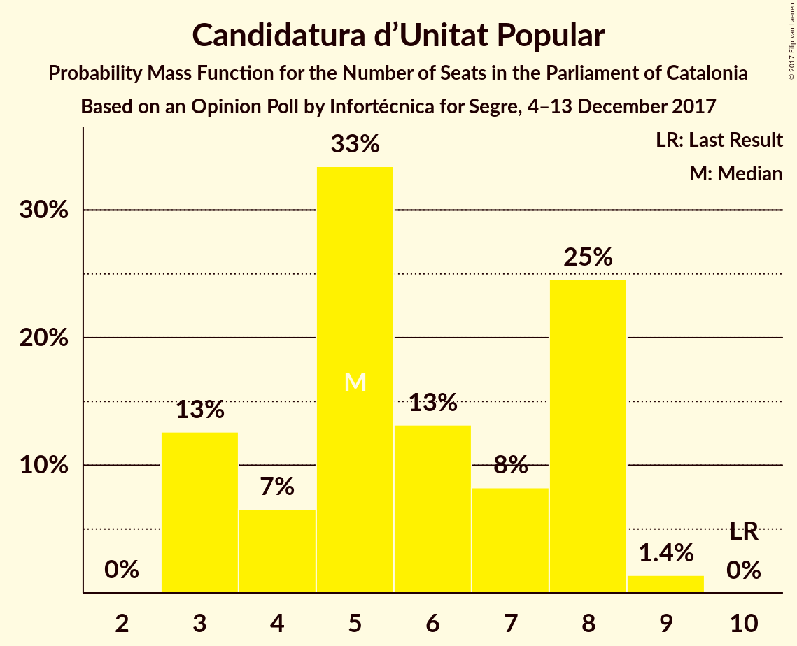

# Opinion Poll by Infortécnica for Segre, 4–13 December 2017

<a href="#voting-intentions">Voting Intentions</a> | <a href="#seats">Seats</a> | <a href="#coalitions">Coalitions</a> | <a href="#technical-information">Technical Information</a>

## Voting Intentions

### Confidence Intervals

| Party | Last Result | Poll Result | 80% Confidence Interval | 90% Confidence Interval | 95% Confidence Interval | 99% Confidence Interval |
|:-----:|:-----------:|:-----------:|:-----------------------:|:-----------------------:|:-----------------------:|:-----------------------:|
| Esquerra Republicana de Catalunya–Catalunya Sí | 39.6% | 23.6% | 22.1–25.2% |21.7–25.7% |21.3–26.1% |20.6–26.9% |
| Ciutadans–Partido de la Ciudadanía | 17.9% | 23.6% | 22.1–25.2% |21.7–25.7% |21.3–26.1% |20.6–26.9% |
| Junts per Catalunya | 39.6% | 18.5% | 17.1–20.0% |16.8–20.4% |16.4–20.8% |15.8–21.5% |
| Partit dels Socialistes de Catalunya (PSC-PSOE) | 12.7% | 17.3% | 15.9–18.7% |15.6–19.1% |15.2–19.5% |14.6–20.2% |
| Partit Popular | 8.5% | 6.3% | 5.5–7.3% |5.3–7.6% |5.1–7.8% |4.7–8.4% |
| Catalunya en Comú | 8.9% | 5.5% | 4.8–6.4% |4.5–6.7% |4.4–7.0% |4.0–7.4% |
| Candidatura d’Unitat Popular | 8.2% | 5.2% | 4.5–6.1% |4.2–6.4% |4.1–6.6% |3.7–7.0% |

*Note:* The poll result column reflects the actual value used in the calculations. Published results may vary slightly, and in addition be rounded to fewer digits.

## Seats

### Confidence Intervals

| Party | Last Result | Median | 80% Confidence Interval | 90% Confidence Interval | 95% Confidence Interval | 99% Confidence Interval |
|:-----:|:-----------:|:------:|:-----------------------:|:-----------------------:|:-----------------------:|:-----------------------:|
| <a href="#esquerra-republicana-de-catalunya–catalunya-sí">Esquerra Republicana de Catalunya–Catalunya Sí</a> | 20 | 36 | 36 |36 |36 |31–36 |
| <a href="#ciutadans–partido-de-la-ciudadanía">Ciutadans–Partido de la Ciudadanía</a> | 25 | 32 | 32 |32 |32 |32 |
| <a href="#junts-per-catalunya">Junts per Catalunya</a> | 29 | 26 | 26 |26 |26 |26 |
| <a href="#partit-dels-socialistes-de-catalunya-(psc-psoe)">Partit dels Socialistes de Catalunya (PSC-PSOE)</a> | 16 | 23 | 23 |23 |23 |23 |
| <a href="#partit-popular">Partit Popular</a> | 11 | 6 | 6 |6 |6 |6 |
| <a href="#catalunya-en-comú">Catalunya en Comú</a> | 11 | 4 | 4 |4 |4 |4–5 |
| <a href="#candidatura-d’unitat-popular">Candidatura d’Unitat Popular</a> | 10 | 8 | 8 |8 |8 |7–8 |

### Esquerra Republicana de Catalunya–Catalunya Sí

*For a full overview of the results for this party, see the [Esquerra Republicana de Catalunya–Catalunya Sí](party-esquerrarepublicanadecatalunya–catalunyasí.html) page.*

| Number of Seats | Probability | Accumulated | Special Marks |
|:---------------:|:-----------:|:-----------:|:-------------:|
| 20 | 0% | 100% | Last Result |
| 21 | 0% | 100% |  |
| 22 | 0% | 100% |  |
| 23 | 0% | 100% |  |
| 24 | 0% | 100% |  |
| 25 | 0% | 100% |  |
| 26 | 0% | 100% |  |
| 27 | 0% | 100% |  |
| 28 | 0% | 100% |  |
| 29 | 0% | 100% |  |
| 30 | 0.5% | 100% |  |
| 31 | 0% | 99.5% |  |
| 32 | 0% | 99.5% |  |
| 33 | 0% | 99.5% |  |
| 34 | 0% | 99.5% |  |
| 35 | 0% | 99.5% |  |
| 36 | 99.4% | 99.5% | Median |
| 37 | 0% | 0% |  |

### Ciutadans–Partido de la Ciudadanía

*For a full overview of the results for this party, see the [Ciutadans–Partido de la Ciudadanía](party-ciutadans–partidodelaciudadanía.html) page.*

| Number of Seats | Probability | Accumulated | Special Marks |
|:---------------:|:-----------:|:-----------:|:-------------:|
| 25 | 0% | 100% | Last Result |
| 26 | 0% | 100% |  |
| 27 | 0% | 100% |  |
| 28 | 0% | 100% |  |
| 29 | 0% | 100% |  |
| 30 | 0% | 100% |  |
| 31 | 0.4% | 100% |  |
| 32 | 99.5% | 99.6% | Median |
| 33 | 0% | 0.1% |  |
| 34 | 0.1% | 0.1% |  |
| 35 | 0% | 0% |  |

### Junts per Catalunya

*For a full overview of the results for this party, see the [Junts per Catalunya](party-juntspercatalunya.html) page.*

| Number of Seats | Probability | Accumulated | Special Marks |
|:---------------:|:-----------:|:-----------:|:-------------:|
| 26 | 99.5% | 100% | Median |
| 27 | 0% | 0.5% |  |
| 28 | 0% | 0.5% |  |
| 29 | 0.4% | 0.4% | Last Result |
| 30 | 0% | 0% |  |

### Partit dels Socialistes de Catalunya (PSC-PSOE)

*For a full overview of the results for this party, see the [Partit dels Socialistes de Catalunya (PSC-PSOE)](party-partitdelssocialistesdecatalunyapsc-psoe.html) page.*

| Number of Seats | Probability | Accumulated | Special Marks |
|:---------------:|:-----------:|:-----------:|:-------------:|
| 16 | 0% | 100% | Last Result |
| 17 | 0% | 100% |  |
| 18 | 0% | 100% |  |
| 19 | 0% | 100% |  |
| 20 | 0% | 100% |  |
| 21 | 0% | 100% |  |
| 22 | 0% | 99.9% |  |
| 23 | 99.4% | 99.9% | Median |
| 24 | 0.4% | 0.5% |  |
| 25 | 0.1% | 0.1% |  |
| 26 | 0% | 0% |  |

### Partit Popular

*For a full overview of the results for this party, see the [Partit Popular](party-partitpopular.html) page.*

| Number of Seats | Probability | Accumulated | Special Marks |
|:---------------:|:-----------:|:-----------:|:-------------:|
| 6 | 99.5% | 100% | Median |
| 7 | 0% | 0.5% |  |
| 8 | 0% | 0.4% |  |
| 9 | 0% | 0.4% |  |
| 10 | 0% | 0.4% |  |
| 11 | 0.4% | 0.4% | Last Result |
| 12 | 0% | 0% |  |

### Catalunya en Comú

*For a full overview of the results for this party, see the [Catalunya en Comú](party-catalunyaencomú.html) page.*

| Number of Seats | Probability | Accumulated | Special Marks |
|:---------------:|:-----------:|:-----------:|:-------------:|
| 4 | 99.5% | 100% | Median |
| 5 | 0.4% | 0.5% |  |
| 6 | 0% | 0.1% |  |
| 7 | 0.1% | 0.1% |  |
| 8 | 0% | 0% |  |
| 9 | 0% | 0% |  |
| 10 | 0% | 0% |  |
| 11 | 0% | 0% | Last Result |

### Candidatura d’Unitat Popular

*For a full overview of the results for this party, see the [Candidatura d’Unitat Popular](party-candidaturad’unitatpopular.html) page.*

| Number of Seats | Probability | Accumulated | Special Marks |
|:---------------:|:-----------:|:-----------:|:-------------:|
| 5 | 0.4% | 100% |  |
| 6 | 0% | 99.6% |  |
| 7 | 0.1% | 99.6% |  |
| 8 | 99.5% | 99.5% | Median |
| 9 | 0% | 0% |  |
| 10 | 0% | 0% | Last Result |

## Coalitions

### Confidence Intervals

| Coalition | Last Result | Median | Majority? | 80% Confidence Interval | 90% Confidence Interval | 95% Confidence Interval | 99% Confidence Interval |
|:---------:|:-----------:|:------:|:---------:|:-----------------------:|:-----------------------:|:-----------------------:|:-----------------------:|
| Esquerra Republicana de Catalunya–Catalunya Sí – Junts per Catalunya – Candidatura d’Unitat Popular | 59 | 70 | 99.5% | 70 | 70 | 70 | 65–70 |
| Esquerra Republicana de Catalunya–Catalunya Sí – Junts per Catalunya – Catalunya en Comú | 60 | 66 | 0% | 66 | 66 | 66 | 65–66 |
| Ciutadans–Partido de la Ciudadanía – Partit dels Socialistes de Catalunya (PSC-PSOE) – Partit Popular – Catalunya en Comú | 63 | 65 | 0.5% | 65 | 65 | 65 | 65–70 |
| Esquerra Republicana de Catalunya–Catalunya Sí – Partit dels Socialistes de Catalunya (PSC-PSOE) – Catalunya en Comú | 47 | 63 | 0% | 63 | 63 | 63 | 62–63 |
| Esquerra Republicana de Catalunya–Catalunya Sí – Junts per Catalunya | 49 | 62 | 0% | 62 | 62 | 62 | 61–62 |
| Ciutadans–Partido de la Ciudadanía – Partit dels Socialistes de Catalunya (PSC-PSOE) – Partit Popular | 52 | 61 | 0% | 61 | 61 | 61 | 61–64 |

### Esquerra Republicana de Catalunya–Catalunya Sí – Junts per Catalunya – Candidatura d’Unitat Popular

| Number of Seats | Probability | Accumulated | Special Marks |
|:---------------:|:-----------:|:-----------:|:-------------:|
| 59 | 0% | 100% | Last Result |
| 60 | 0% | 100% |  |
| 61 | 0% | 100% |  |
| 62 | 0% | 100% |  |
| 63 | 0.1% | 100% |  |
| 64 | 0.4% | 99.9% |  |
| 65 | 0% | 99.5% |  |
| 66 | 0% | 99.5% |  |
| 67 | 0% | 99.5% |  |
| 68 | 0% | 99.5% | Majority |
| 69 | 0% | 99.5% |  |
| 70 | 99.5% | 99.5% | Median |
| 71 | 0% | 0% |  |

### Esquerra Republicana de Catalunya–Catalunya Sí – Junts per Catalunya – Catalunya en Comú

| Number of Seats | Probability | Accumulated | Special Marks |
|:---------------:|:-----------:|:-----------:|:-------------:|
| 60 | 0% | 100% | Last Result |
| 61 | 0% | 100% |  |
| 62 | 0% | 100% |  |
| 63 | 0.1% | 100% |  |
| 64 | 0.4% | 99.9% |  |
| 65 | 0% | 99.5% |  |
| 66 | 99.4% | 99.5% | Median |
| 67 | 0% | 0.1% |  |
| 68 | 0% | 0% | Majority |

### Ciutadans–Partido de la Ciudadanía – Partit dels Socialistes de Catalunya (PSC-PSOE) – Partit Popular – Catalunya en Comú

| Number of Seats | Probability | Accumulated | Special Marks |
|:---------------:|:-----------:|:-----------:|:-------------:|
| 63 | 0% | 100% | Last Result |
| 64 | 0% | 100% |  |
| 65 | 99.5% | 100% | Median |
| 66 | 0% | 0.5% |  |
| 67 | 0% | 0.5% |  |
| 68 | 0% | 0.5% | Majority |
| 69 | 0% | 0.5% |  |
| 70 | 0% | 0.5% |  |
| 71 | 0.4% | 0.5% |  |
| 72 | 0.1% | 0.1% |  |
| 73 | 0% | 0% |  |

### Esquerra Republicana de Catalunya–Catalunya Sí – Partit dels Socialistes de Catalunya (PSC-PSOE) – Catalunya en Comú

| Number of Seats | Probability | Accumulated | Special Marks |
|:---------------:|:-----------:|:-----------:|:-------------:|
| 47 | 0% | 100% | Last Result |
| 48 | 0% | 100% |  |
| 49 | 0% | 100% |  |
| 50 | 0% | 100% |  |
| 51 | 0% | 100% |  |
| 52 | 0% | 100% |  |
| 53 | 0% | 100% |  |
| 54 | 0% | 100% |  |
| 55 | 0% | 100% |  |
| 56 | 0% | 100% |  |
| 57 | 0% | 100% |  |
| 58 | 0% | 100% |  |
| 59 | 0.4% | 100% |  |
| 60 | 0% | 99.6% |  |
| 61 | 0% | 99.6% |  |
| 62 | 0.1% | 99.6% |  |
| 63 | 99.5% | 99.5% | Median |
| 64 | 0% | 0% |  |

### Esquerra Republicana de Catalunya–Catalunya Sí – Junts per Catalunya

| Number of Seats | Probability | Accumulated | Special Marks |
|:---------------:|:-----------:|:-----------:|:-------------:|
| 49 | 0% | 100% | Last Result |
| 50 | 0% | 100% |  |
| 51 | 0% | 100% |  |
| 52 | 0% | 100% |  |
| 53 | 0% | 100% |  |
| 54 | 0% | 100% |  |
| 55 | 0% | 100% |  |
| 56 | 0.1% | 100% |  |
| 57 | 0% | 99.9% |  |
| 58 | 0% | 99.9% |  |
| 59 | 0.4% | 99.9% |  |
| 60 | 0% | 99.5% |  |
| 61 | 0% | 99.5% |  |
| 62 | 99.4% | 99.5% | Median |
| 63 | 0% | 0% |  |

### Ciutadans–Partido de la Ciudadanía – Partit dels Socialistes de Catalunya (PSC-PSOE) – Partit Popular

| Number of Seats | Probability | Accumulated | Special Marks |
|:---------------:|:-----------:|:-----------:|:-------------:|
| 52 | 0% | 100% | Last Result |
| 53 | 0% | 100% |  |
| 54 | 0% | 100% |  |
| 55 | 0% | 100% |  |
| 56 | 0% | 100% |  |
| 57 | 0% | 100% |  |
| 58 | 0% | 100% |  |
| 59 | 0% | 100% |  |
| 60 | 0% | 100% |  |
| 61 | 99.5% | 100% | Median |
| 62 | 0% | 0.5% |  |
| 63 | 0% | 0.5% |  |
| 64 | 0% | 0.5% |  |
| 65 | 0.1% | 0.5% |  |
| 66 | 0.4% | 0.4% |  |
| 67 | 0% | 0% |  |

## Technical Information

### Opinion Poll

+ **Polling firm:** Infortécnica
+ **Commissioner(s):** Segre
+ **Fieldwork period:** 4–13 December 2017

### Calculations

+ **Sample size:** 1216
+ **Simulations done:** 1,024
+ **Error estimate:** 2.87%

