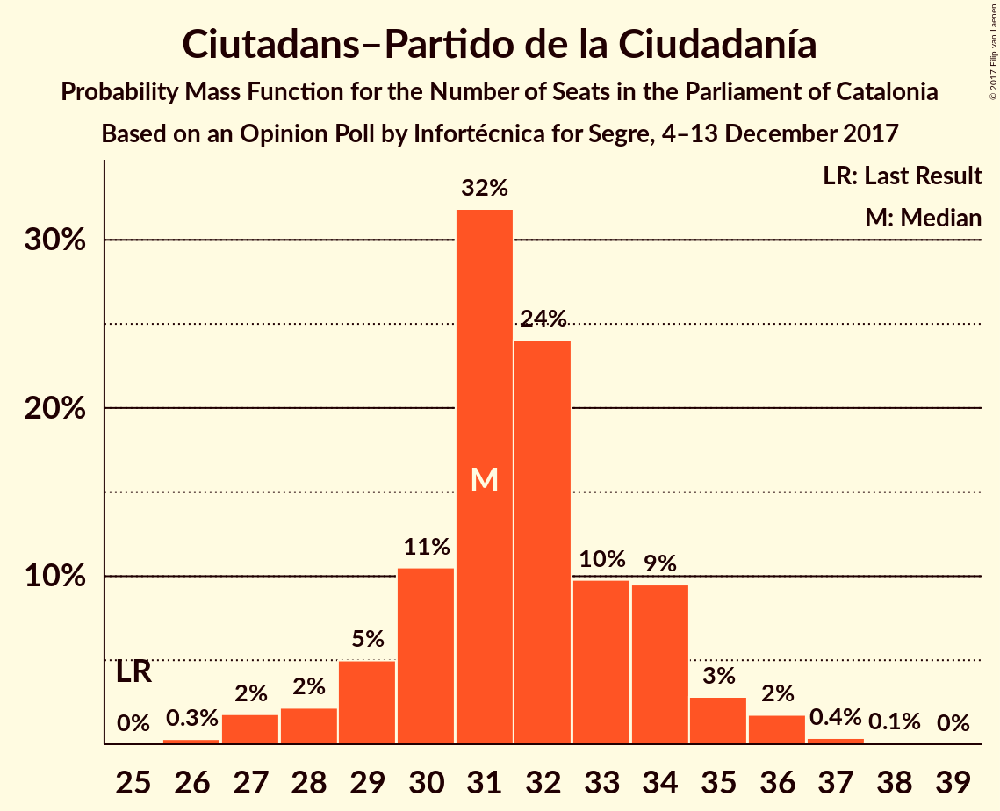

# Opinion Poll by Infortécnica for Segre, 4–13 December 2017

<a href="#voting-intentions">Voting Intentions</a> | <a href="#seats">Seats</a> | <a href="#coalitions">Coalitions</a> | <a href="#technical-information">Technical Information</a>

## Voting Intentions

### Confidence Intervals

| Party | Last Result | Poll Result | 80% Confidence Interval | 90% Confidence Interval | 95% Confidence Interval | 99% Confidence Interval |
|:-----:|:-----------:|:-----------:|:-----------------------:|:-----------------------:|:-----------------------:|:-----------------------:|
| Esquerra Republicana de Catalunya–Catalunya Sí | 39.6% | 23.6% | 22.1–25.2% |21.7–25.7% |21.3–26.1% |20.6–26.9% |
| Ciutadans–Partido de la Ciudadanía | 17.9% | 23.6% | 22.1–25.2% |21.7–25.7% |21.3–26.1% |20.6–26.9% |
| Junts per Catalunya | 39.6% | 18.5% | 17.1–20.0% |16.8–20.4% |16.4–20.8% |15.8–21.5% |
| Partit dels Socialistes de Catalunya (PSC-PSOE) | 12.7% | 17.3% | 15.9–18.7% |15.6–19.1% |15.2–19.5% |14.6–20.2% |
| Partit Popular | 8.5% | 6.3% | 5.5–7.3% |5.3–7.6% |5.1–7.8% |4.7–8.4% |
| Catalunya en Comú | 8.9% | 5.5% | 4.8–6.4% |4.5–6.7% |4.4–7.0% |4.0–7.4% |
| Candidatura d’Unitat Popular | 8.2% | 5.2% | 4.5–6.1% |4.2–6.4% |4.1–6.6% |3.7–7.0% |

*Note:* The poll result column reflects the actual value used in the calculations. Published results may vary slightly, and in addition be rounded to fewer digits.

## Seats

### Confidence Intervals

| Party | Last Result | Median | 80% Confidence Interval | 90% Confidence Interval | 95% Confidence Interval | 99% Confidence Interval |
|:-----:|:-----------:|:------:|:-----------------------:|:-----------------------:|:-----------------------:|:-----------------------:|
| <a href="#esquerra-republicana-de-catalunya–catalunya-sí">Esquerra Republicana de Catalunya–Catalunya Sí</a> | 20 | 35 | 32–38 |32–38 |32–39 |30–40 |
| <a href="#ciutadans–partido-de-la-ciudadanía">Ciutadans–Partido de la Ciudadanía</a> | 25 | 31 | 30–34 |29–35 |28–35 |27–36 |
| <a href="#junts-per-catalunya">Junts per Catalunya</a> | 29 | 27 | 25–30 |24–30 |24–31 |23–32 |
| <a href="#partit-dels-socialistes-de-catalunya-(psc-psoe)">Partit dels Socialistes de Catalunya (PSC-PSOE)</a> | 16 | 23 | 21–24 |20–25 |19–25 |18–26 |
| <a href="#partit-popular">Partit Popular</a> | 11 | 7 | 5–9 |5–10 |5–10 |5–10 |
| <a href="#catalunya-en-comú">Catalunya en Comú</a> | 11 | 5 | 4–6 |4–7 |4–7 |4–8 |
| <a href="#candidatura-d’unitat-popular">Candidatura d’Unitat Popular</a> | 10 | 5 | 3–8 |3–8 |3–8 |3–9 |

### Esquerra Republicana de Catalunya–Catalunya Sí

*For a full overview of the results for this party, see the [Esquerra Republicana de Catalunya–Catalunya Sí](party-esquerrarepublicanadecatalunya–catalunyasí.html) page.*

| Number of Seats | Probability | Accumulated | Special Marks |
|:---------------:|:-----------:|:-----------:|:-------------:|
| 20 | 0% | 100% | Last Result |
| 21 | 0% | 100% |  |
| 22 | 0% | 100% |  |
| 23 | 0% | 100% |  |
| 24 | 0% | 100% |  |
| 25 | 0% | 100% |  |
| 26 | 0% | 100% |  |
| 27 | 0% | 100% |  |
| 28 | 0% | 100% |  |
| 29 | 0.1% | 100% |  |
| 30 | 0.5% | 99.9% |  |
| 31 | 2% | 99.4% |  |
| 32 | 8% | 98% |  |
| 33 | 11% | 90% |  |
| 34 | 12% | 79% |  |
| 35 | 18% | 67% | Median |
| 36 | 21% | 49% |  |
| 37 | 14% | 27% |  |
| 38 | 10% | 13% |  |
| 39 | 2% | 4% |  |
| 40 | 1.2% | 2% |  |
| 41 | 0.3% | 0.4% |  |
| 42 | 0.1% | 0.1% |  |
| 43 | 0% | 0% |  |

### Ciutadans–Partido de la Ciudadanía

*For a full overview of the results for this party, see the [Ciutadans–Partido de la Ciudadanía](party-ciutadans–partidodelaciudadanía.html) page.*

| Number of Seats | Probability | Accumulated | Special Marks |
|:---------------:|:-----------:|:-----------:|:-------------:|
| 25 | 0% | 100% | Last Result |
| 26 | 0.3% | 100% |  |
| 27 | 2% | 99.7% |  |
| 28 | 2% | 98% |  |
| 29 | 5% | 96% |  |
| 30 | 11% | 91% |  |
| 31 | 32% | 80% | Median |
| 32 | 24% | 48% |  |
| 33 | 10% | 24% |  |
| 34 | 9% | 15% |  |
| 35 | 3% | 5% |  |
| 36 | 2% | 2% |  |
| 37 | 0.4% | 0.5% |  |
| 38 | 0.1% | 0.1% |  |
| 39 | 0% | 0% |  |

### Junts per Catalunya

*For a full overview of the results for this party, see the [Junts per Catalunya](party-juntspercatalunya.html) page.*

| Number of Seats | Probability | Accumulated | Special Marks |
|:---------------:|:-----------:|:-----------:|:-------------:|
| 22 | 0.4% | 100% |  |
| 23 | 1.1% | 99.5% |  |
| 24 | 8% | 98% |  |
| 25 | 8% | 90% |  |
| 26 | 13% | 83% |  |
| 27 | 22% | 69% | Median |
| 28 | 19% | 47% |  |
| 29 | 16% | 28% | Last Result |
| 30 | 10% | 12% |  |
| 31 | 2% | 3% |  |
| 32 | 0.6% | 0.8% |  |
| 33 | 0.1% | 0.2% |  |
| 34 | 0% | 0% |  |

### Partit dels Socialistes de Catalunya (PSC-PSOE)

*For a full overview of the results for this party, see the [Partit dels Socialistes de Catalunya (PSC-PSOE)](party-partitdelssocialistesdecatalunyapsc-psoe.html) page.*

| Number of Seats | Probability | Accumulated | Special Marks |
|:---------------:|:-----------:|:-----------:|:-------------:|
| 16 | 0% | 100% | Last Result |
| 17 | 0.4% | 100% |  |
| 18 | 0.5% | 99.6% |  |
| 19 | 3% | 99.1% |  |
| 20 | 5% | 96% |  |
| 21 | 8% | 91% |  |
| 22 | 19% | 83% |  |
| 23 | 36% | 65% | Median |
| 24 | 22% | 29% |  |
| 25 | 5% | 6% |  |
| 26 | 0.9% | 1.4% |  |
| 27 | 0.4% | 0.5% |  |
| 28 | 0.1% | 0.1% |  |
| 29 | 0% | 0% |  |

### Partit Popular

*For a full overview of the results for this party, see the [Partit Popular](party-partitpopular.html) page.*

| Number of Seats | Probability | Accumulated | Special Marks |
|:---------------:|:-----------:|:-----------:|:-------------:|
| 4 | 0.1% | 100% |  |
| 5 | 11% | 99.9% |  |
| 6 | 26% | 89% |  |
| 7 | 17% | 64% | Median |
| 8 | 34% | 46% |  |
| 9 | 6% | 12% |  |
| 10 | 6% | 6% |  |
| 11 | 0.1% | 0.1% | Last Result |
| 12 | 0.1% | 0.1% |  |
| 13 | 0% | 0% |  |

### Catalunya en Comú

*For a full overview of the results for this party, see the [Catalunya en Comú](party-catalunyaencomú.html) page.*

| Number of Seats | Probability | Accumulated | Special Marks |
|:---------------:|:-----------:|:-----------:|:-------------:|
| 3 | 0.5% | 100% |  |
| 4 | 18% | 99.5% |  |
| 5 | 55% | 81% | Median |
| 6 | 19% | 26% |  |
| 7 | 5% | 7% |  |
| 8 | 2% | 2% |  |
| 9 | 0% | 0% |  |
| 10 | 0% | 0% |  |
| 11 | 0% | 0% | Last Result |

### Candidatura d’Unitat Popular

*For a full overview of the results for this party, see the [Candidatura d’Unitat Popular](party-candidaturad’unitatpopular.html) page.*

| Number of Seats | Probability | Accumulated | Special Marks |
|:---------------:|:-----------:|:-----------:|:-------------:|
| 3 | 13% | 100% |  |
| 4 | 7% | 87% |  |
| 5 | 33% | 81% | Median |
| 6 | 13% | 47% |  |
| 7 | 8% | 34% |  |
| 8 | 25% | 26% |  |
| 9 | 1.4% | 1.4% |  |
| 10 | 0% | 0% | Last Result |

## Coalitions

### Confidence Intervals

| Coalition | Last Result | Median | Majority? | 80% Confidence Interval | 90% Confidence Interval | 95% Confidence Interval | 99% Confidence Interval |
|:---------:|:-----------:|:------:|:---------:|:-----------------------:|:-----------------------:|:-----------------------:|:-----------------------:|
| Esquerra Republicana de Catalunya–Catalunya Sí – Junts per Catalunya – Candidatura d’Unitat Popular | 59 | 68 | 64% | 66–71 | 65–72 | 64–73 | 63–75 |
| Esquerra Republicana de Catalunya–Catalunya Sí – Junts per Catalunya – Catalunya en Comú | 60 | 68 | 55% | 65–71 | 64–72 | 63–72 | 62–74 |
| Ciutadans–Partido de la Ciudadanía – Partit dels Socialistes de Catalunya (PSC-PSOE) – Partit Popular – Catalunya en Comú | 63 | 67 | 36% | 64–69 | 63–70 | 62–71 | 60–72 |
| Esquerra Republicana de Catalunya–Catalunya Sí – Partit dels Socialistes de Catalunya (PSC-PSOE) – Catalunya en Comú | 47 | 63 | 2% | 60–66 | 59–67 | 59–67 | 57–69 |
| Esquerra Republicana de Catalunya–Catalunya Sí – Junts per Catalunya | 49 | 63 | 1.3% | 60–66 | 59–66 | 58–67 | 57–68 |
| Ciutadans–Partido de la Ciudadanía – Partit dels Socialistes de Catalunya (PSC-PSOE) – Partit Popular | 52 | 62 | 0.4% | 59–64 | 58–65 | 57–66 | 55–67 |

### Esquerra Republicana de Catalunya–Catalunya Sí – Junts per Catalunya – Candidatura d’Unitat Popular

| Number of Seats | Probability | Accumulated | Special Marks |
|:---------------:|:-----------:|:-----------:|:-------------:|
| 59 | 0% | 100% | Last Result |
| 60 | 0% | 100% |  |
| 61 | 0.1% | 100% |  |
| 62 | 0.3% | 99.9% |  |
| 63 | 1.0% | 99.6% |  |
| 64 | 2% | 98.6% |  |
| 65 | 5% | 97% |  |
| 66 | 9% | 91% |  |
| 67 | 19% | 83% | Median |
| 68 | 19% | 64% | Majority |
| 69 | 14% | 45% |  |
| 70 | 16% | 31% |  |
| 71 | 7% | 15% |  |
| 72 | 4% | 8% |  |
| 73 | 2% | 4% |  |
| 74 | 1.0% | 2% |  |
| 75 | 0.4% | 0.6% |  |
| 76 | 0.2% | 0.2% |  |
| 77 | 0% | 0% |  |

### Esquerra Republicana de Catalunya–Catalunya Sí – Junts per Catalunya – Catalunya en Comú

| Number of Seats | Probability | Accumulated | Special Marks |
|:---------------:|:-----------:|:-----------:|:-------------:|
| 60 | 0.1% | 100% | Last Result |
| 61 | 0.2% | 99.9% |  |
| 62 | 0.8% | 99.7% |  |
| 63 | 2% | 98.9% |  |
| 64 | 5% | 97% |  |
| 65 | 10% | 92% |  |
| 66 | 12% | 82% |  |
| 67 | 15% | 70% | Median |
| 68 | 18% | 55% | Majority |
| 69 | 15% | 37% |  |
| 70 | 9% | 22% |  |
| 71 | 7% | 13% |  |
| 72 | 4% | 6% |  |
| 73 | 1.3% | 2% |  |
| 74 | 0.4% | 0.6% |  |
| 75 | 0.2% | 0.3% |  |
| 76 | 0.1% | 0.1% |  |
| 77 | 0% | 0% |  |

### Ciutadans–Partido de la Ciudadanía – Partit dels Socialistes de Catalunya (PSC-PSOE) – Partit Popular – Catalunya en Comú

| Number of Seats | Probability | Accumulated | Special Marks |
|:---------------:|:-----------:|:-----------:|:-------------:|
| 59 | 0.2% | 100% |  |
| 60 | 0.4% | 99.8% |  |
| 61 | 1.0% | 99.4% |  |
| 62 | 2% | 98% |  |
| 63 | 4% | 96% | Last Result |
| 64 | 7% | 92% |  |
| 65 | 16% | 85% |  |
| 66 | 14% | 69% | Median |
| 67 | 19% | 55% |  |
| 68 | 19% | 36% | Majority |
| 69 | 9% | 17% |  |
| 70 | 5% | 9% |  |
| 71 | 2% | 3% |  |
| 72 | 1.0% | 1.4% |  |
| 73 | 0.3% | 0.4% |  |
| 74 | 0.1% | 0.1% |  |
| 75 | 0% | 0% |  |

### Esquerra Republicana de Catalunya–Catalunya Sí – Partit dels Socialistes de Catalunya (PSC-PSOE) – Catalunya en Comú

| Number of Seats | Probability | Accumulated | Special Marks |
|:---------------:|:-----------:|:-----------:|:-------------:|
| 47 | 0% | 100% | Last Result |
| 48 | 0% | 100% |  |
| 49 | 0% | 100% |  |
| 50 | 0% | 100% |  |
| 51 | 0% | 100% |  |
| 52 | 0% | 100% |  |
| 53 | 0% | 100% |  |
| 54 | 0% | 100% |  |
| 55 | 0% | 100% |  |
| 56 | 0.1% | 100% |  |
| 57 | 0.7% | 99.8% |  |
| 58 | 1.3% | 99.1% |  |
| 59 | 3% | 98% |  |
| 60 | 8% | 95% |  |
| 61 | 10% | 86% |  |
| 62 | 14% | 76% |  |
| 63 | 17% | 62% | Median |
| 64 | 17% | 45% |  |
| 65 | 13% | 28% |  |
| 66 | 8% | 15% |  |
| 67 | 4% | 7% |  |
| 68 | 2% | 2% | Majority |
| 69 | 0.7% | 0.9% |  |
| 70 | 0.1% | 0.2% |  |
| 71 | 0% | 0.1% |  |
| 72 | 0% | 0% |  |

### Esquerra Republicana de Catalunya–Catalunya Sí – Junts per Catalunya

| Number of Seats | Probability | Accumulated | Special Marks |
|:---------------:|:-----------:|:-----------:|:-------------:|
| 49 | 0% | 100% | Last Result |
| 50 | 0% | 100% |  |
| 51 | 0% | 100% |  |
| 52 | 0% | 100% |  |
| 53 | 0% | 100% |  |
| 54 | 0% | 100% |  |
| 55 | 0.1% | 100% |  |
| 56 | 0.3% | 99.9% |  |
| 57 | 0.9% | 99.6% |  |
| 58 | 2% | 98.8% |  |
| 59 | 5% | 96% |  |
| 60 | 10% | 91% |  |
| 61 | 13% | 82% |  |
| 62 | 17% | 69% | Median |
| 63 | 17% | 51% |  |
| 64 | 14% | 34% |  |
| 65 | 8% | 20% |  |
| 66 | 7% | 12% |  |
| 67 | 4% | 5% |  |
| 68 | 1.0% | 1.3% | Majority |
| 69 | 0.2% | 0.4% |  |
| 70 | 0.1% | 0.2% |  |
| 71 | 0% | 0.1% |  |
| 72 | 0% | 0% |  |

### Ciutadans–Partido de la Ciudadanía – Partit dels Socialistes de Catalunya (PSC-PSOE) – Partit Popular

| Number of Seats | Probability | Accumulated | Special Marks |
|:---------------:|:-----------:|:-----------:|:-------------:|
| 52 | 0% | 100% | Last Result |
| 53 | 0% | 100% |  |
| 54 | 0.2% | 100% |  |
| 55 | 0.5% | 99.8% |  |
| 56 | 1.2% | 99.3% |  |
| 57 | 2% | 98% |  |
| 58 | 4% | 96% |  |
| 59 | 10% | 92% |  |
| 60 | 13% | 82% |  |
| 61 | 16% | 68% | Median |
| 62 | 20% | 52% |  |
| 63 | 17% | 33% |  |
| 64 | 9% | 16% |  |
| 65 | 4% | 7% |  |
| 66 | 1.5% | 3% |  |
| 67 | 1.0% | 1.4% |  |
| 68 | 0.3% | 0.4% | Majority |
| 69 | 0.1% | 0.1% |  |
| 70 | 0% | 0% |  |

## Technical Information

### Opinion Poll

+ **Polling firm:** Infortécnica
+ **Commissioner(s):** Segre
+ **Fieldwork period:** 4–13 December 2017

### Calculations

+ **Sample size:** 1216
+ **Simulations done:** 8,388,608
+ **Error estimate:** 0.88%

