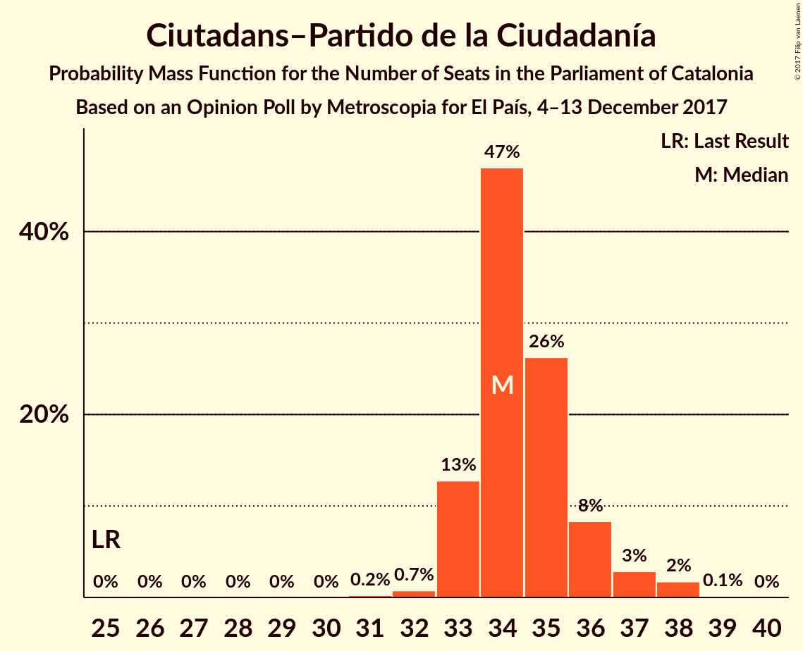
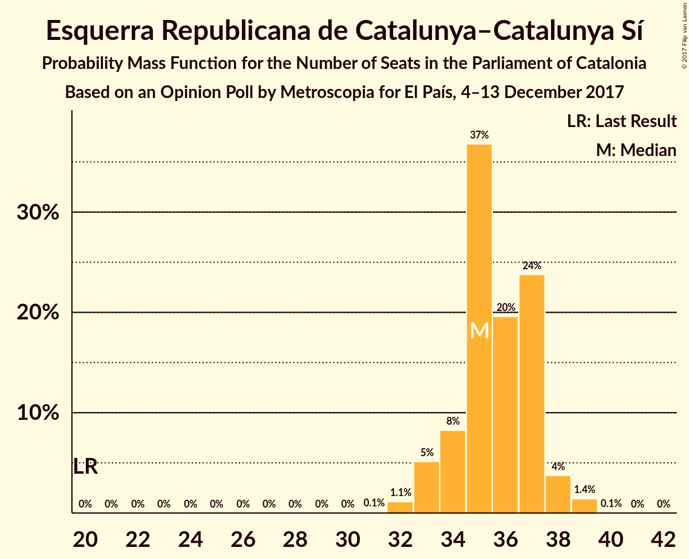
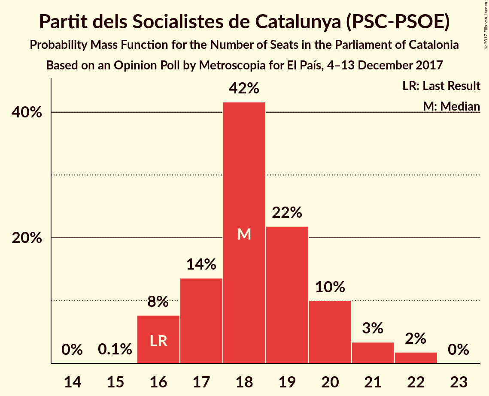
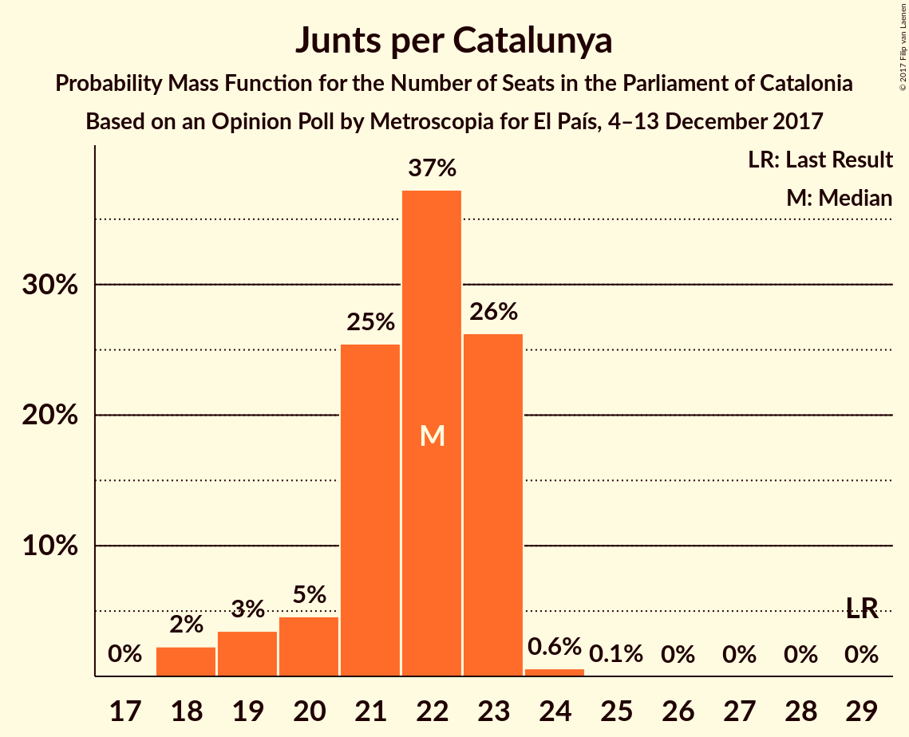
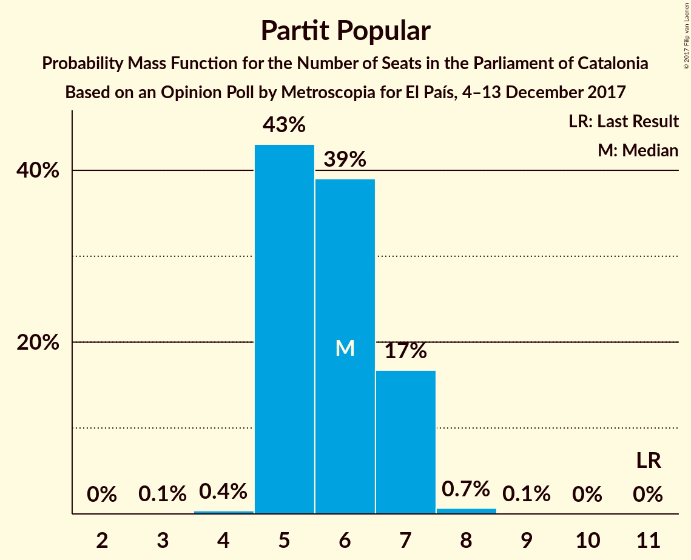

# Opinion Poll by Metroscopia for El País, 4–13 December 2017

<a href="#voting-intentions">Voting Intentions</a> | <a href="#seats">Seats</a> | <a href="#coalitions">Coalitions</a> | <a href="#technical-information">Technical Information</a>

## Voting Intentions

### Confidence Intervals

| Party | Last Result | Poll Result | 80% Confidence Interval | 90% Confidence Interval | 95% Confidence Interval | 99% Confidence Interval |
|:-----:|:-----------:|:-----------:|:-----------------------:|:-----------------------:|:-----------------------:|:-----------------------:|
| Ciutadans–Partido de la Ciudadanía | 17.9% | 25.2% | 24.2–26.2% |24.0–26.5% |23.7–26.7% |23.3–27.2% |
| Esquerra Republicana de Catalunya–Catalunya Sí | 39.6% | 23.1% | 22.2–24.1% |21.9–24.3% |21.7–24.6% |21.2–25.0% |
| Partit dels Socialistes de Catalunya (PSC-PSOE) | 12.7% | 14.3% | 13.5–15.1% |13.3–15.3% |13.1–15.5% |12.8–15.9% |
| Junts per Catalunya | 39.6% | 14.3% | 13.5–15.1% |13.3–15.3% |13.1–15.5% |12.8–15.9% |
| Catalunya en Comú | 8.9% | 9.3% | 8.7–10.0% |8.5–10.2% |8.4–10.3% |8.1–10.7% |
| Candidatura d’Unitat Popular | 8.2% | 6.4% | 5.9–7.0% |5.7–7.1% |5.6–7.3% |5.4–7.6% |
| Partit Popular | 8.5% | 5.4% | 4.9–5.9% |4.8–6.1% |4.7–6.2% |4.5–6.5% |

*Note:* The poll result column reflects the actual value used in the calculations. Published results may vary slightly, and in addition be rounded to fewer digits.

## Seats

### Confidence Intervals

| Party | Last Result | Median | 80% Confidence Interval | 90% Confidence Interval | 95% Confidence Interval | 99% Confidence Interval |
|:-----:|:-----------:|:------:|:-----------------------:|:-----------------------:|:-----------------------:|:-----------------------:|
| <a href="#ciutadans–partido-de-la-ciudadanía">Ciutadans–Partido de la Ciudadanía</a> | 25 | 34 | 33–36 |33–37 |33–37 |32–38 |
| <a href="#esquerra-republicana-de-catalunya–catalunya-sí">Esquerra Republicana de Catalunya–Catalunya Sí</a> | 20 | 35 | 34–37 |33–38 |33–38 |32–39 |
| <a href="#partit-dels-socialistes-de-catalunya-(psc-psoe)">Partit dels Socialistes de Catalunya (PSC-PSOE)</a> | 16 | 18 | 17–20 |16–20 |16–21 |16–22 |
| <a href="#junts-per-catalunya">Junts per Catalunya</a> | 29 | 22 | 20–23 |19–23 |18–23 |18–24 |
| <a href="#catalunya-en-comú">Catalunya en Comú</a> | 11 | 11 | 9–12 |9–12 |9–13 |9–13 |
| <a href="#candidatura-d’unitat-popular">Candidatura d’Unitat Popular</a> | 10 | 8 | 8–9 |8–9 |8–9 |7–9 |
| <a href="#partit-popular">Partit Popular</a> | 11 | 6 | 5–7 |5–7 |5–7 |5–8 |

### Ciutadans–Partido de la Ciudadanía

*For a full overview of the results for this party, see the [Ciutadans–Partido de la Ciudadanía](party-ciutadans–partidodelaciudadanía.html) page.*

| Number of Seats | Probability | Accumulated | Special Marks |
|:---------------:|:-----------:|:-----------:|:-------------:|
| 25 | 0% | 100% | Last Result |
| 26 | 0% | 100% |  |
| 27 | 0% | 100% |  |
| 28 | 0% | 100% |  |
| 29 | 0% | 100% |  |
| 30 | 0% | 100% |  |
| 31 | 0.2% | 100% |  |
| 32 | 0.8% | 99.8% |  |
| 33 | 13% | 99.0% |  |
| 34 | 44% | 86% | Median |
| 35 | 29% | 42% |  |
| 36 | 8% | 13% |  |
| 37 | 3% | 5% |  |
| 38 | 2% | 2% |  |
| 39 | 0.1% | 0.1% |  |
| 40 | 0% | 0% |  |

### Esquerra Republicana de Catalunya–Catalunya Sí

*For a full overview of the results for this party, see the [Esquerra Republicana de Catalunya–Catalunya Sí](party-esquerrarepublicanadecatalunya–catalunyasí.html) page.*

| Number of Seats | Probability | Accumulated | Special Marks |
|:---------------:|:-----------:|:-----------:|:-------------:|
| 20 | 0% | 100% | Last Result |
| 21 | 0% | 100% |  |
| 22 | 0% | 100% |  |
| 23 | 0% | 100% |  |
| 24 | 0% | 100% |  |
| 25 | 0% | 100% |  |
| 26 | 0% | 100% |  |
| 27 | 0% | 100% |  |
| 28 | 0% | 100% |  |
| 29 | 0% | 100% |  |
| 30 | 0% | 100% |  |
| 31 | 0.1% | 100% |  |
| 32 | 1.4% | 99.9% |  |
| 33 | 5% | 98% |  |
| 34 | 9% | 94% |  |
| 35 | 37% | 85% | Median |
| 36 | 21% | 48% |  |
| 37 | 21% | 27% |  |
| 38 | 4% | 6% |  |
| 39 | 1.2% | 1.2% |  |
| 40 | 0% | 0% |  |

### Partit dels Socialistes de Catalunya (PSC-PSOE)

*For a full overview of the results for this party, see the [Partit dels Socialistes de Catalunya (PSC-PSOE)](party-partitdelssocialistesdecatalunyapsc-psoe.html) page.*

| Number of Seats | Probability | Accumulated | Special Marks |
|:---------------:|:-----------:|:-----------:|:-------------:|
| 15 | 0.1% | 100% |  |
| 16 | 7% | 99.9% | Last Result |
| 17 | 13% | 93% |  |
| 18 | 41% | 80% | Median |
| 19 | 25% | 39% |  |
| 20 | 9% | 14% |  |
| 21 | 3% | 5% |  |
| 22 | 2% | 2% |  |
| 23 | 0% | 0% |  |

### Junts per Catalunya

*For a full overview of the results for this party, see the [Junts per Catalunya](party-juntspercatalunya.html) page.*

| Number of Seats | Probability | Accumulated | Special Marks |
|:---------------:|:-----------:|:-----------:|:-------------:|
| 18 | 3% | 100% |  |
| 19 | 3% | 97% |  |
| 20 | 5% | 94% |  |
| 21 | 25% | 89% |  |
| 22 | 39% | 65% | Median |
| 23 | 25% | 26% |  |
| 24 | 0.6% | 0.6% |  |
| 25 | 0.1% | 0.1% |  |
| 26 | 0% | 0% |  |
| 27 | 0% | 0% |  |
| 28 | 0% | 0% |  |
| 29 | 0% | 0% | Last Result |

### Catalunya en Comú

*For a full overview of the results for this party, see the [Catalunya en Comú](party-catalunyaencomú.html) page.*

| Number of Seats | Probability | Accumulated | Special Marks |
|:---------------:|:-----------:|:-----------:|:-------------:|
| 8 | 0.1% | 100% |  |
| 9 | 12% | 99.9% |  |
| 10 | 8% | 88% |  |
| 11 | 65% | 80% | Last Result, Median |
| 12 | 11% | 15% |  |
| 13 | 4% | 4% |  |
| 14 | 0.2% | 0.2% |  |
| 15 | 0% | 0% |  |

### Candidatura d’Unitat Popular

*For a full overview of the results for this party, see the [Candidatura d’Unitat Popular](party-candidaturad’unitatpopular.html) page.*

| Number of Seats | Probability | Accumulated | Special Marks |
|:---------------:|:-----------:|:-----------:|:-------------:|
| 6 | 0.1% | 100% |  |
| 7 | 2% | 99.9% |  |
| 8 | 68% | 98% | Median |
| 9 | 30% | 30% |  |
| 10 | 0.2% | 0.2% | Last Result |
| 11 | 0% | 0% |  |

### Partit Popular

*For a full overview of the results for this party, see the [Partit Popular](party-partitpopular.html) page.*

| Number of Seats | Probability | Accumulated | Special Marks |
|:---------------:|:-----------:|:-----------:|:-------------:|
| 3 | 0.1% | 100% |  |
| 4 | 0.4% | 99.9% |  |
| 5 | 43% | 99.5% |  |
| 6 | 39% | 57% | Median |
| 7 | 17% | 18% |  |
| 8 | 0.7% | 0.8% |  |
| 9 | 0.1% | 0.1% |  |
| 10 | 0% | 0% |  |
| 11 | 0% | 0% | Last Result |

## Coalitions

### Confidence Intervals

| Coalition | Last Result | Median | Majority? | 80% Confidence Interval | 90% Confidence Interval | 95% Confidence Interval | 99% Confidence Interval |
|:---------:|:-----------:|:------:|:---------:|:-----------------------:|:-----------------------:|:-----------------------:|:-----------------------:|
| Ciutadans–Partido de la Ciudadanía – Partit dels Socialistes de Catalunya (PSC-PSOE) – Catalunya en Comú – Partit Popular | 63 | 69 | 89% | 67–72 | 67–72 | 67–73 | 66–73 |
| Esquerra Republicana de Catalunya–Catalunya Sí – Junts per Catalunya – Catalunya en Comú | 60 | 68 | 69% | 66–70 | 66–71 | 65–71 | 64–72 |
| Esquerra Republicana de Catalunya–Catalunya Sí – Junts per Catalunya – Candidatura d’Unitat Popular | 59 | 66 | 11% | 63–68 | 63–68 | 62–68 | 62–69 |
| Esquerra Republicana de Catalunya–Catalunya Sí – Partit dels Socialistes de Catalunya (PSC-PSOE) – Catalunya en Comú | 47 | 65 | 4% | 63–66 | 63–67 | 62–68 | 61–69 |
| Ciutadans–Partido de la Ciudadanía – Partit dels Socialistes de Catalunya (PSC-PSOE) – Partit Popular | 52 | 58 | 0% | 57–61 | 56–61 | 56–62 | 55–63 |
| Esquerra Republicana de Catalunya–Catalunya Sí – Junts per Catalunya | 49 | 57 | 0% | 55–59 | 55–60 | 54–60 | 53–61 |

### Ciutadans–Partido de la Ciudadanía – Partit dels Socialistes de Catalunya (PSC-PSOE) – Catalunya en Comú – Partit Popular

| Number of Seats | Probability | Accumulated | Special Marks |
|:---------------:|:-----------:|:-----------:|:-------------:|
| 63 | 0% | 100% | Last Result |
| 64 | 0% | 100% |  |
| 65 | 0.1% | 100% |  |
| 66 | 2% | 99.9% |  |
| 67 | 9% | 98% |  |
| 68 | 17% | 89% | Majority |
| 69 | 26% | 71% | Median |
| 70 | 23% | 46% |  |
| 71 | 12% | 23% |  |
| 72 | 8% | 11% |  |
| 73 | 2% | 3% |  |
| 74 | 0.3% | 0.4% |  |
| 75 | 0.1% | 0.1% |  |
| 76 | 0% | 0% |  |

### Esquerra Republicana de Catalunya–Catalunya Sí – Junts per Catalunya – Catalunya en Comú

| Number of Seats | Probability | Accumulated | Special Marks |
|:---------------:|:-----------:|:-----------:|:-------------:|
| 60 | 0% | 100% | Last Result |
| 61 | 0% | 100% |  |
| 62 | 0% | 100% |  |
| 63 | 0.2% | 100% |  |
| 64 | 0.7% | 99.7% |  |
| 65 | 4% | 99.0% |  |
| 66 | 9% | 95% |  |
| 67 | 18% | 86% |  |
| 68 | 27% | 69% | Median, Majority |
| 69 | 23% | 42% |  |
| 70 | 14% | 19% |  |
| 71 | 5% | 6% |  |
| 72 | 1.0% | 1.1% |  |
| 73 | 0% | 0% |  |

### Esquerra Republicana de Catalunya–Catalunya Sí – Junts per Catalunya – Candidatura d’Unitat Popular

| Number of Seats | Probability | Accumulated | Special Marks |
|:---------------:|:-----------:|:-----------:|:-------------:|
| 59 | 0% | 100% | Last Result |
| 60 | 0.1% | 100% |  |
| 61 | 0.3% | 99.9% |  |
| 62 | 2% | 99.6% |  |
| 63 | 8% | 97% |  |
| 64 | 12% | 89% |  |
| 65 | 23% | 77% | Median |
| 66 | 26% | 54% |  |
| 67 | 17% | 29% |  |
| 68 | 9% | 11% | Majority |
| 69 | 2% | 2% |  |
| 70 | 0.1% | 0.1% |  |
| 71 | 0% | 0% |  |

### Esquerra Republicana de Catalunya–Catalunya Sí – Partit dels Socialistes de Catalunya (PSC-PSOE) – Catalunya en Comú

| Number of Seats | Probability | Accumulated | Special Marks |
|:---------------:|:-----------:|:-----------:|:-------------:|
| 47 | 0% | 100% | Last Result |
| 48 | 0% | 100% |  |
| 49 | 0% | 100% |  |
| 50 | 0% | 100% |  |
| 51 | 0% | 100% |  |
| 52 | 0% | 100% |  |
| 53 | 0% | 100% |  |
| 54 | 0% | 100% |  |
| 55 | 0% | 100% |  |
| 56 | 0% | 100% |  |
| 57 | 0% | 100% |  |
| 58 | 0% | 100% |  |
| 59 | 0% | 100% |  |
| 60 | 0.3% | 100% |  |
| 61 | 2% | 99.6% |  |
| 62 | 3% | 98% |  |
| 63 | 9% | 95% |  |
| 64 | 28% | 86% | Median |
| 65 | 32% | 58% |  |
| 66 | 16% | 26% |  |
| 67 | 6% | 10% |  |
| 68 | 3% | 4% | Majority |
| 69 | 0.7% | 0.9% |  |
| 70 | 0.2% | 0.2% |  |
| 71 | 0% | 0% |  |

### Ciutadans–Partido de la Ciudadanía – Partit dels Socialistes de Catalunya (PSC-PSOE) – Partit Popular

| Number of Seats | Probability | Accumulated | Special Marks |
|:---------------:|:-----------:|:-----------:|:-------------:|
| 52 | 0% | 100% | Last Result |
| 53 | 0% | 100% |  |
| 54 | 0.1% | 100% |  |
| 55 | 2% | 99.9% |  |
| 56 | 7% | 98% |  |
| 57 | 16% | 91% |  |
| 58 | 26% | 76% | Median |
| 59 | 25% | 50% |  |
| 60 | 14% | 25% |  |
| 61 | 8% | 11% |  |
| 62 | 3% | 3% |  |
| 63 | 0.4% | 0.6% |  |
| 64 | 0.2% | 0.2% |  |
| 65 | 0% | 0% |  |

### Esquerra Republicana de Catalunya–Catalunya Sí – Junts per Catalunya

| Number of Seats | Probability | Accumulated | Special Marks |
|:---------------:|:-----------:|:-----------:|:-------------:|
| 49 | 0% | 100% | Last Result |
| 50 | 0% | 100% |  |
| 51 | 0% | 100% |  |
| 52 | 0.1% | 100% |  |
| 53 | 0.5% | 99.9% |  |
| 54 | 3% | 99.3% |  |
| 55 | 9% | 96% |  |
| 56 | 16% | 87% |  |
| 57 | 25% | 72% | Median |
| 58 | 24% | 47% |  |
| 59 | 14% | 22% |  |
| 60 | 7% | 8% |  |
| 61 | 0.8% | 0.9% |  |
| 62 | 0% | 0% |  |

## Technical Information

### Opinion Poll

+ **Polling firm:** Metroscopia
+ **Commissioner(s):** El País
+ **Fieldwork period:** 4–13 December 2017

### Calculations

+ **Sample size:** 3300
+ **Simulations done:** 1,048,576
+ **Error estimate:** 0.85%

