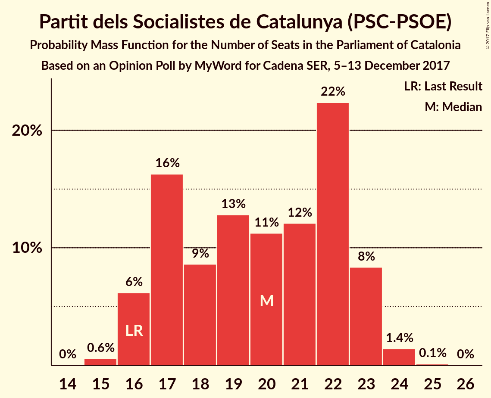

# Opinion Poll by MyWord for Cadena SER, 5–13 December 2017

<a href="#voting-intentions">Voting Intentions</a> | <a href="#seats">Seats</a> | <a href="#coalitions">Coalitions</a> | <a href="#technical-information">Technical Information</a>

## Voting Intentions

### Confidence Intervals

| Party | Last Result | Poll Result | 80% Confidence Interval | 90% Confidence Interval | 95% Confidence Interval | 99% Confidence Interval |
|:-----:|:-----------:|:-----------:|:-----------------------:|:-----------------------:|:-----------------------:|:-----------------------:|
| Esquerra Republicana de Catalunya–Catalunya Sí | 39.6% | 24.3% | 22.6–26.1% |22.1–26.6% |21.7–27.1% |21.0–27.9% |
| Ciutadans–Partido de la Ciudadanía | 17.9% | 22.4% | 20.8–24.2% |20.3–24.7% |19.9–25.1% |19.2–26.0% |
| Junts per Catalunya | 39.6% | 17.9% | 16.4–19.6% |16.0–20.0% |15.7–20.4% |15.0–21.2% |
| Partit dels Socialistes de Catalunya (PSC-PSOE) | 12.7% | 15.1% | 13.8–16.7% |13.4–17.1% |13.0–17.5% |12.4–18.3% |
| Catalunya en Comú | 8.9% | 9.0% | 7.9–10.2% |7.6–10.6% |7.3–10.9% |6.9–11.5% |
| Candidatura d’Unitat Popular | 8.2% | 5.1% | 4.3–6.1% |4.1–6.4% |3.9–6.6% |3.5–7.1% |
| Partit Popular | 8.5% | 4.8% | 4.0–5.8% |3.8–6.0% |3.6–6.3% |3.3–6.8% |

*Note:* The poll result column reflects the actual value used in the calculations. Published results may vary slightly, and in addition be rounded to fewer digits.

## Seats

### Confidence Intervals

| Party | Last Result | Median | 80% Confidence Interval | 90% Confidence Interval | 95% Confidence Interval | 99% Confidence Interval |
|:-----:|:-----------:|:------:|:-----------------------:|:-----------------------:|:-----------------------:|:-----------------------:|
| <a href="#esquerra-republicana-de-catalunya–catalunya-sí">Esquerra Republicana de Catalunya–Catalunya Sí</a> | 20 | 37 | 35–40 |33–41 |32–42 |31–43 |
| <a href="#ciutadans–partido-de-la-ciudadanía">Ciutadans–Partido de la Ciudadanía</a> | 25 | 31 | 27–33 |27–34 |26–34 |26–36 |
| <a href="#junts-per-catalunya">Junts per Catalunya</a> | 29 | 27 | 24–29 |24–30 |23–30 |23–32 |
| <a href="#partit-dels-socialistes-de-catalunya-(psc-psoe)">Partit dels Socialistes de Catalunya (PSC-PSOE)</a> | 16 | 20 | 17–23 |16–23 |16–23 |15–24 |
| <a href="#catalunya-en-comú">Catalunya en Comú</a> | 11 | 10 | 9–12 |8–13 |8–13 |7–14 |
| <a href="#candidatura-d’unitat-popular">Candidatura d’Unitat Popular</a> | 10 | 6 | 3–8 |3–8 |3–8 |3–9 |
| <a href="#partit-popular">Partit Popular</a> | 11 | 5 | 3–6 |3–7 |3–7 |3–8 |

### Esquerra Republicana de Catalunya–Catalunya Sí

*For a full overview of the results for this party, see the [Esquerra Republicana de Catalunya–Catalunya Sí](party-esquerrarepublicanadecatalunya–catalunyasí.html) page.*

| Number of Seats | Probability | Accumulated | Special Marks |
|:---------------:|:-----------:|:-----------:|:-------------:|
| 20 | 0% | 100% | Last Result |
| 21 | 0% | 100% |  |
| 22 | 0% | 100% |  |
| 23 | 0% | 100% |  |
| 24 | 0% | 100% |  |
| 25 | 0% | 100% |  |
| 26 | 0% | 100% |  |
| 27 | 0% | 100% |  |
| 28 | 0% | 100% |  |
| 29 | 0% | 100% |  |
| 30 | 0.3% | 100% |  |
| 31 | 0.4% | 99.7% |  |
| 32 | 2% | 99.3% |  |
| 33 | 2% | 97% |  |
| 34 | 4% | 95% |  |
| 35 | 13% | 90% |  |
| 36 | 23% | 77% |  |
| 37 | 14% | 54% | Median |
| 38 | 16% | 41% |  |
| 39 | 11% | 25% |  |
| 40 | 7% | 14% |  |
| 41 | 4% | 7% |  |
| 42 | 2% | 3% |  |
| 43 | 0.7% | 1.0% |  |
| 44 | 0.2% | 0.3% |  |
| 45 | 0.1% | 0.1% |  |
| 46 | 0% | 0% |  |

### Ciutadans–Partido de la Ciudadanía

*For a full overview of the results for this party, see the [Ciutadans–Partido de la Ciudadanía](party-ciutadans–partidodelaciudadanía.html) page.*

| Number of Seats | Probability | Accumulated | Special Marks |
|:---------------:|:-----------:|:-----------:|:-------------:|
| 25 | 0.4% | 100% | Last Result |
| 26 | 3% | 99.6% |  |
| 27 | 9% | 96% |  |
| 28 | 6% | 87% |  |
| 29 | 11% | 81% |  |
| 30 | 18% | 70% |  |
| 31 | 23% | 52% | Median |
| 32 | 10% | 29% |  |
| 33 | 12% | 19% |  |
| 34 | 5% | 6% |  |
| 35 | 1.0% | 2% |  |
| 36 | 0.6% | 0.7% |  |
| 37 | 0.1% | 0.1% |  |
| 38 | 0% | 0% |  |

### Junts per Catalunya

*For a full overview of the results for this party, see the [Junts per Catalunya](party-juntspercatalunya.html) page.*

| Number of Seats | Probability | Accumulated | Special Marks |
|:---------------:|:-----------:|:-----------:|:-------------:|
| 21 | 0.1% | 100% |  |
| 22 | 0.2% | 99.8% |  |
| 23 | 5% | 99.6% |  |
| 24 | 18% | 95% |  |
| 25 | 9% | 77% |  |
| 26 | 13% | 69% |  |
| 27 | 12% | 55% | Median |
| 28 | 11% | 43% |  |
| 29 | 24% | 32% | Last Result |
| 30 | 7% | 9% |  |
| 31 | 1.2% | 2% |  |
| 32 | 0.6% | 1.0% |  |
| 33 | 0.2% | 0.3% |  |
| 34 | 0.1% | 0.1% |  |
| 35 | 0% | 0% |  |

### Partit dels Socialistes de Catalunya (PSC-PSOE)

*For a full overview of the results for this party, see the [Partit dels Socialistes de Catalunya (PSC-PSOE)](party-partitdelssocialistesdecatalunyapsc-psoe.html) page.*

| Number of Seats | Probability | Accumulated | Special Marks |
|:---------------:|:-----------:|:-----------:|:-------------:|
| 15 | 0.6% | 100% |  |
| 16 | 6% | 99.4% | Last Result |
| 17 | 16% | 93% |  |
| 18 | 9% | 77% |  |
| 19 | 13% | 68% |  |
| 20 | 11% | 55% | Median |
| 21 | 12% | 44% |  |
| 22 | 22% | 32% |  |
| 23 | 9% | 10% |  |
| 24 | 1.4% | 2% |  |
| 25 | 0.1% | 0.1% |  |
| 26 | 0% | 0% |  |

### Catalunya en Comú

*For a full overview of the results for this party, see the [Catalunya en Comú](party-catalunyaencomú.html) page.*

| Number of Seats | Probability | Accumulated | Special Marks |
|:---------------:|:-----------:|:-----------:|:-------------:|
| 6 | 0.2% | 100% |  |
| 7 | 0.4% | 99.8% |  |
| 8 | 9% | 99.5% |  |
| 9 | 33% | 91% |  |
| 10 | 16% | 58% | Median |
| 11 | 24% | 42% | Last Result |
| 12 | 11% | 17% |  |
| 13 | 4% | 6% |  |
| 14 | 2% | 2% |  |
| 15 | 0.1% | 0.2% |  |
| 16 | 0% | 0% |  |

### Candidatura d’Unitat Popular

*For a full overview of the results for this party, see the [Candidatura d’Unitat Popular](party-candidaturad’unitatpopular.html) page.*

| Number of Seats | Probability | Accumulated | Special Marks |
|:---------------:|:-----------:|:-----------:|:-------------:|
| 2 | 0.1% | 100% |  |
| 3 | 15% | 99.9% |  |
| 4 | 9% | 84% |  |
| 5 | 20% | 75% |  |
| 6 | 12% | 56% | Median |
| 7 | 16% | 43% |  |
| 8 | 26% | 28% |  |
| 9 | 2% | 2% |  |
| 10 | 0% | 0% | Last Result |

### Partit Popular

*For a full overview of the results for this party, see the [Partit Popular](party-partitpopular.html) page.*

| Number of Seats | Probability | Accumulated | Special Marks |
|:---------------:|:-----------:|:-----------:|:-------------:|
| 0 | 0.1% | 100% |  |
| 1 | 0% | 99.9% |  |
| 2 | 0.3% | 99.9% |  |
| 3 | 19% | 99.7% |  |
| 4 | 7% | 80% |  |
| 5 | 51% | 73% | Median |
| 6 | 15% | 22% |  |
| 7 | 6% | 7% |  |
| 8 | 1.3% | 2% |  |
| 9 | 0.2% | 0.2% |  |
| 10 | 0% | 0% |  |
| 11 | 0% | 0% | Last Result |

## Coalitions

### Confidence Intervals

| Coalition | Last Result | Median | Majority? | 80% Confidence Interval | 90% Confidence Interval | 95% Confidence Interval | 99% Confidence Interval |
|:---------:|:-----------:|:------:|:---------:|:-----------------------:|:-----------------------:|:-----------------------:|:-----------------------:|
| Esquerra Republicana de Catalunya–Catalunya Sí – Junts per Catalunya – Catalunya en Comú | 60 | 74 | 99.4% | 70–78 | 70–79 | 69–80 | 67–81 |
| Esquerra Republicana de Catalunya–Catalunya Sí – Junts per Catalunya – Candidatura d’Unitat Popular | 59 | 70 | 79% | 66–73 | 65–75 | 64–75 | 63–77 |
| Esquerra Republicana de Catalunya–Catalunya Sí – Partit dels Socialistes de Catalunya (PSC-PSOE) – Catalunya en Comú | 47 | 67 | 44% | 63–71 | 63–72 | 62–72 | 60–74 |
| Ciutadans–Partido de la Ciudadanía – Partit dels Socialistes de Catalunya (PSC-PSOE) – Catalunya en Comú – Partit Popular | 63 | 65 | 21% | 62–69 | 60–70 | 60–71 | 58–72 |
| Esquerra Republicana de Catalunya–Catalunya Sí – Junts per Catalunya | 49 | 64 | 9% | 60–67 | 59–68 | 59–69 | 57–71 |
| Ciutadans–Partido de la Ciudadanía – Partit dels Socialistes de Catalunya (PSC-PSOE) – Partit Popular | 52 | 55 | 0% | 51–59 | 50–60 | 50–60 | 48–61 |

### Esquerra Republicana de Catalunya–Catalunya Sí – Junts per Catalunya – Catalunya en Comú

| Number of Seats | Probability | Accumulated | Special Marks |
|:---------------:|:-----------:|:-----------:|:-------------:|
| 60 | 0% | 100% | Last Result |
| 61 | 0% | 100% |  |
| 62 | 0% | 100% |  |
| 63 | 0% | 100% |  |
| 64 | 0% | 100% |  |
| 65 | 0% | 100% |  |
| 66 | 0.1% | 100% |  |
| 67 | 0.4% | 99.8% |  |
| 68 | 0.9% | 99.4% | Majority |
| 69 | 3% | 98.6% |  |
| 70 | 7% | 96% |  |
| 71 | 11% | 89% |  |
| 72 | 10% | 78% |  |
| 73 | 10% | 68% |  |
| 74 | 13% | 58% | Median |
| 75 | 13% | 45% |  |
| 76 | 14% | 32% |  |
| 77 | 9% | 19% |  |
| 78 | 4% | 10% |  |
| 79 | 3% | 6% |  |
| 80 | 1.4% | 3% |  |
| 81 | 0.7% | 1.1% |  |
| 82 | 0.3% | 0.5% |  |
| 83 | 0.1% | 0.1% |  |
| 84 | 0% | 0% |  |

### Esquerra Republicana de Catalunya–Catalunya Sí – Junts per Catalunya – Candidatura d’Unitat Popular

| Number of Seats | Probability | Accumulated | Special Marks |
|:---------------:|:-----------:|:-----------:|:-------------:|
| 59 | 0% | 100% | Last Result |
| 60 | 0% | 100% |  |
| 61 | 0% | 100% |  |
| 62 | 0.2% | 99.9% |  |
| 63 | 0.8% | 99.8% |  |
| 64 | 2% | 99.0% |  |
| 65 | 3% | 97% |  |
| 66 | 6% | 94% |  |
| 67 | 8% | 88% |  |
| 68 | 12% | 79% | Majority |
| 69 | 14% | 67% |  |
| 70 | 13% | 53% | Median |
| 71 | 13% | 39% |  |
| 72 | 9% | 27% |  |
| 73 | 8% | 18% |  |
| 74 | 5% | 10% |  |
| 75 | 3% | 5% |  |
| 76 | 1.3% | 2% |  |
| 77 | 0.3% | 0.5% |  |
| 78 | 0.1% | 0.2% |  |
| 79 | 0% | 0% |  |

### Esquerra Republicana de Catalunya–Catalunya Sí – Partit dels Socialistes de Catalunya (PSC-PSOE) – Catalunya en Comú

| Number of Seats | Probability | Accumulated | Special Marks |
|:---------------:|:-----------:|:-----------:|:-------------:|
| 47 | 0% | 100% | Last Result |
| 48 | 0% | 100% |  |
| 49 | 0% | 100% |  |
| 50 | 0% | 100% |  |
| 51 | 0% | 100% |  |
| 52 | 0% | 100% |  |
| 53 | 0% | 100% |  |
| 54 | 0% | 100% |  |
| 55 | 0% | 100% |  |
| 56 | 0% | 100% |  |
| 57 | 0% | 100% |  |
| 58 | 0.1% | 100% |  |
| 59 | 0.2% | 99.9% |  |
| 60 | 0.4% | 99.7% |  |
| 61 | 1.1% | 99.3% |  |
| 62 | 3% | 98% |  |
| 63 | 6% | 95% |  |
| 64 | 10% | 89% |  |
| 65 | 9% | 79% |  |
| 66 | 12% | 69% |  |
| 67 | 14% | 58% | Median |
| 68 | 13% | 44% | Majority |
| 69 | 12% | 31% |  |
| 70 | 8% | 19% |  |
| 71 | 5% | 10% |  |
| 72 | 3% | 5% |  |
| 73 | 1.4% | 2% |  |
| 74 | 0.7% | 1.0% |  |
| 75 | 0.3% | 0.4% |  |
| 76 | 0.1% | 0.1% |  |
| 77 | 0% | 0% |  |

### Ciutadans–Partido de la Ciudadanía – Partit dels Socialistes de Catalunya (PSC-PSOE) – Catalunya en Comú – Partit Popular

| Number of Seats | Probability | Accumulated | Special Marks |
|:---------------:|:-----------:|:-----------:|:-------------:|
| 57 | 0.1% | 100% |  |
| 58 | 0.3% | 99.8% |  |
| 59 | 1.3% | 99.5% |  |
| 60 | 3% | 98% |  |
| 61 | 5% | 95% |  |
| 62 | 8% | 90% |  |
| 63 | 9% | 82% | Last Result |
| 64 | 13% | 73% |  |
| 65 | 13% | 61% |  |
| 66 | 14% | 47% | Median |
| 67 | 12% | 33% |  |
| 68 | 8% | 21% | Majority |
| 69 | 6% | 12% |  |
| 70 | 3% | 6% |  |
| 71 | 2% | 3% |  |
| 72 | 0.8% | 1.0% |  |
| 73 | 0.2% | 0.2% |  |
| 74 | 0% | 0.1% |  |
| 75 | 0% | 0% |  |

### Esquerra Republicana de Catalunya–Catalunya Sí – Junts per Catalunya

| Number of Seats | Probability | Accumulated | Special Marks |
|:---------------:|:-----------:|:-----------:|:-------------:|
| 49 | 0% | 100% | Last Result |
| 50 | 0% | 100% |  |
| 51 | 0% | 100% |  |
| 52 | 0% | 100% |  |
| 53 | 0% | 100% |  |
| 54 | 0% | 100% |  |
| 55 | 0.1% | 100% |  |
| 56 | 0.2% | 99.9% |  |
| 57 | 0.4% | 99.7% |  |
| 58 | 1.1% | 99.3% |  |
| 59 | 3% | 98% |  |
| 60 | 6% | 95% |  |
| 61 | 10% | 89% |  |
| 62 | 12% | 79% |  |
| 63 | 11% | 67% |  |
| 64 | 12% | 55% | Median |
| 65 | 15% | 43% |  |
| 66 | 10% | 28% |  |
| 67 | 9% | 19% |  |
| 68 | 5% | 9% | Majority |
| 69 | 3% | 5% |  |
| 70 | 1.2% | 2% |  |
| 71 | 0.5% | 0.8% |  |
| 72 | 0.2% | 0.3% |  |
| 73 | 0.1% | 0.1% |  |
| 74 | 0% | 0% |  |

### Ciutadans–Partido de la Ciudadanía – Partit dels Socialistes de Catalunya (PSC-PSOE) – Partit Popular

| Number of Seats | Probability | Accumulated | Special Marks |
|:---------------:|:-----------:|:-----------:|:-------------:|
| 46 | 0% | 100% |  |
| 47 | 0.2% | 99.9% |  |
| 48 | 0.6% | 99.8% |  |
| 49 | 1.3% | 99.2% |  |
| 50 | 3% | 98% |  |
| 51 | 6% | 95% |  |
| 52 | 8% | 89% | Last Result |
| 53 | 11% | 81% |  |
| 54 | 11% | 70% |  |
| 55 | 14% | 60% |  |
| 56 | 14% | 46% | Median |
| 57 | 13% | 32% |  |
| 58 | 8% | 19% |  |
| 59 | 6% | 11% |  |
| 60 | 3% | 5% |  |
| 61 | 1.5% | 2% |  |
| 62 | 0.3% | 0.4% |  |
| 63 | 0.1% | 0.1% |  |
| 64 | 0% | 0% |  |

## Technical Information

### Opinion Poll

+ **Polling firm:** MyWord
+ **Commissioner(s):** Cadena SER
+ **Fieldwork period:** 5–13 December 2017

### Calculations

+ **Sample size:** 1004
+ **Simulations done:** 4,194,304
+ **Error estimate:** 0.90%

