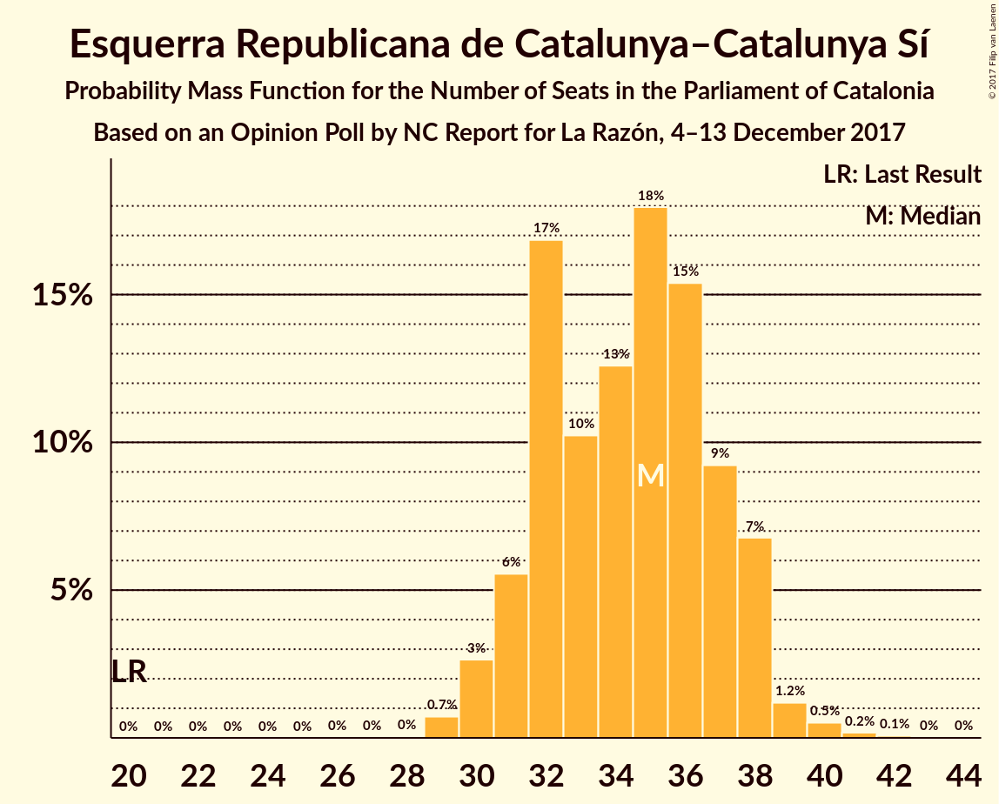
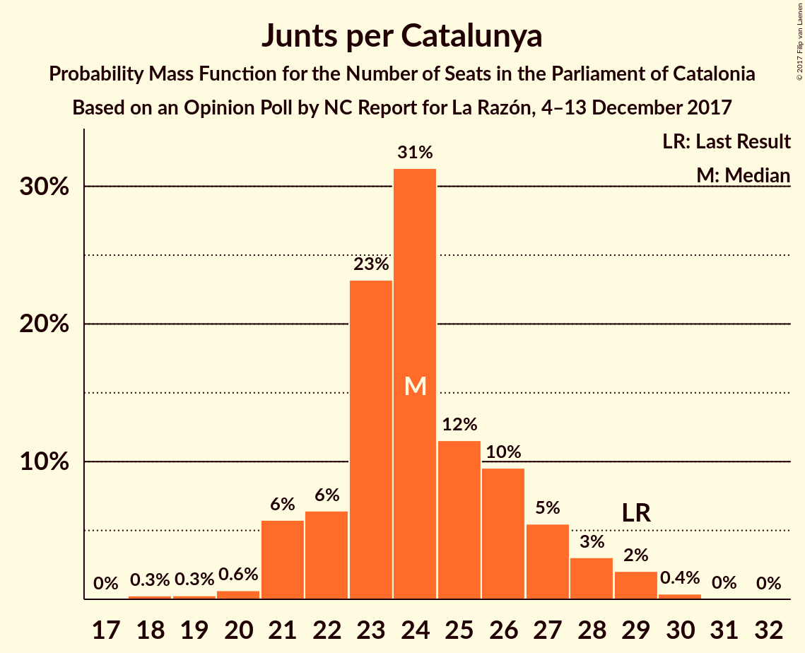
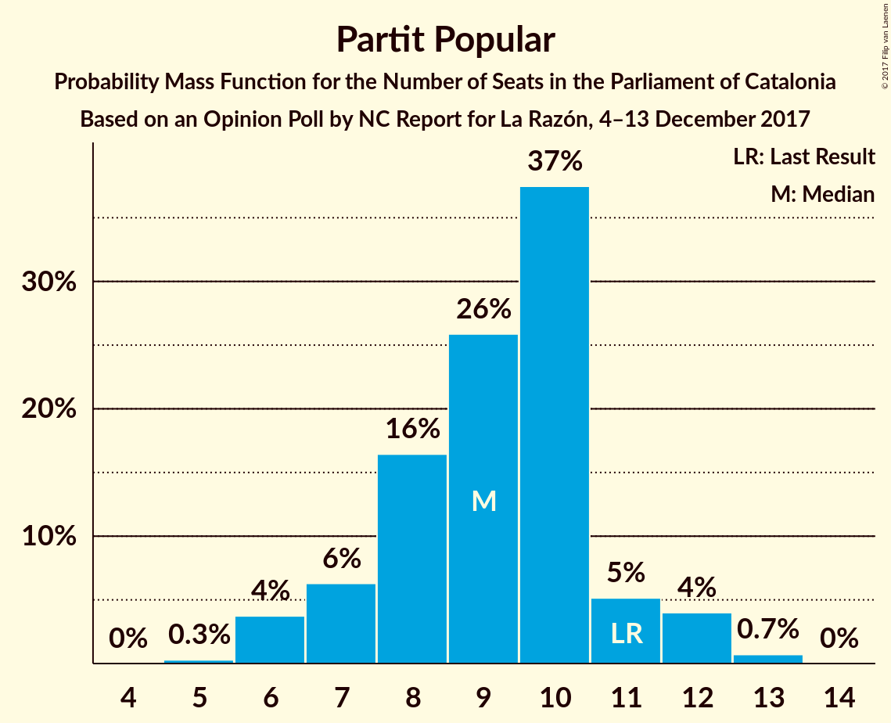

# Opinion Poll by NC Report for La Razón, 4–13 December 2017

<a href="#voting-intentions">Voting Intentions</a> | <a href="#seats">Seats</a> | <a href="#coalitions">Coalitions</a> | <a href="#technical-information">Technical Information</a>

## Voting Intentions

### Confidence Intervals

| Party | Last Result | Poll Result | 80% Confidence Interval | 90% Confidence Interval | 95% Confidence Interval | 99% Confidence Interval |
|:-----:|:-----------:|:-----------:|:-----------------------:|:-----------------------:|:-----------------------:|:-----------------------:|
| Esquerra Republicana de Catalunya–Catalunya Sí | 39.6% | 22.4% | 20.8–24.2% |20.3–24.7% |19.9–25.1% |19.2–26.0% |
| Ciutadans–Partido de la Ciudadanía | 17.9% | 21.8% | 20.2–23.5% |19.7–24.0% |19.3–24.5% |18.6–25.3% |
| Junts per Catalunya | 39.6% | 16.1% | 14.7–17.7% |14.3–18.1% |13.9–18.5% |13.3–19.3% |
| Partit dels Socialistes de Catalunya (PSC-PSOE) | 12.7% | 15.9% | 14.5–17.5% |14.1–17.9% |13.8–18.3% |13.1–19.1% |
| Catalunya en Comú | 8.9% | 7.6% | 6.6–8.8% |6.3–9.1% |6.1–9.4% |5.7–10.0% |
| Partit Popular | 8.5% | 7.3% | 6.3–8.5% |6.1–8.8% |5.8–9.1% |5.4–9.7% |
| Candidatura d’Unitat Popular | 8.2% | 5.8% | 5.0–6.9% |4.7–7.2% |4.5–7.4% |4.1–8.0% |

*Note:* The poll result column reflects the actual value used in the calculations. Published results may vary slightly, and in addition be rounded to fewer digits.

## Seats

### Confidence Intervals

| Party | Last Result | Median | 80% Confidence Interval | 90% Confidence Interval | 95% Confidence Interval | 99% Confidence Interval |
|:-----:|:-----------:|:------:|:-----------------------:|:-----------------------:|:-----------------------:|:-----------------------:|
| <a href="#esquerra-republicana-de-catalunya–catalunya-sí">Esquerra Republicana de Catalunya–Catalunya Sí</a> | 20 | 38 | 35–38 |35–39 |35–39 |32–39 |
| <a href="#ciutadans–partido-de-la-ciudadanía">Ciutadans–Partido de la Ciudadanía</a> | 25 | 32 | 28–32 |25–32 |25–32 |25–32 |
| <a href="#junts-per-catalunya">Junts per Catalunya</a> | 29 | 25 | 21–26 |21–26 |21–26 |18–28 |
| <a href="#partit-dels-socialistes-de-catalunya-(psc-psoe)">Partit dels Socialistes de Catalunya (PSC-PSOE)</a> | 16 | 20 | 20–25 |20–25 |20–25 |18–25 |
| <a href="#catalunya-en-comú">Catalunya en Comú</a> | 11 | 8 | 6–8 |6–9 |6–10 |6–13 |
| <a href="#partit-popular">Partit Popular</a> | 11 | 8 | 7–13 |7–13 |7–13 |6–13 |
| <a href="#candidatura-d’unitat-popular">Candidatura d’Unitat Popular</a> | 10 | 4 | 4–7 |4–8 |4–9 |3–9 |

### Esquerra Republicana de Catalunya–Catalunya Sí

*For a full overview of the results for this party, see the [Esquerra Republicana de Catalunya–Catalunya Sí](party-esquerrarepublicanadecatalunya–catalunyasí.html) page.*

| Number of Seats | Probability | Accumulated | Special Marks |
|:---------------:|:-----------:|:-----------:|:-------------:|
| 20 | 0% | 100% | Last Result |
| 21 | 0% | 100% |  |
| 22 | 0% | 100% |  |
| 23 | 0% | 100% |  |
| 24 | 0% | 100% |  |
| 25 | 0% | 100% |  |
| 26 | 0% | 100% |  |
| 27 | 0% | 100% |  |
| 28 | 0.1% | 100% |  |
| 29 | 0% | 99.9% |  |
| 30 | 0% | 99.9% |  |
| 31 | 0.1% | 99.8% |  |
| 32 | 0.4% | 99.7% |  |
| 33 | 0% | 99.4% |  |
| 34 | 0% | 99.4% |  |
| 35 | 20% | 99.4% |  |
| 36 | 22% | 80% |  |
| 37 | 0.2% | 58% |  |
| 38 | 52% | 58% | Median |
| 39 | 6% | 6% |  |
| 40 | 0% | 0.1% |  |
| 41 | 0% | 0.1% |  |
| 42 | 0% | 0.1% |  |
| 43 | 0% | 0% |  |

### Ciutadans–Partido de la Ciudadanía

*For a full overview of the results for this party, see the [Ciutadans–Partido de la Ciudadanía](party-ciutadans–partidodelaciudadanía.html) page.*

| Number of Seats | Probability | Accumulated | Special Marks |
|:---------------:|:-----------:|:-----------:|:-------------:|
| 24 | 0.1% | 100% |  |
| 25 | 6% | 99.9% | Last Result |
| 26 | 0.2% | 94% |  |
| 27 | 0% | 94% |  |
| 28 | 23% | 94% |  |
| 29 | 0.2% | 71% |  |
| 30 | 17% | 71% |  |
| 31 | 2% | 54% |  |
| 32 | 52% | 52% | Median |
| 33 | 0.2% | 0.4% |  |
| 34 | 0% | 0.2% |  |
| 35 | 0.1% | 0.2% |  |
| 36 | 0% | 0.1% |  |
| 37 | 0% | 0.1% |  |
| 38 | 0% | 0% |  |

### Junts per Catalunya

*For a full overview of the results for this party, see the [Junts per Catalunya](party-juntspercatalunya.html) page.*

| Number of Seats | Probability | Accumulated | Special Marks |
|:---------------:|:-----------:|:-----------:|:-------------:|
| 18 | 2% | 100% |  |
| 19 | 0% | 98% |  |
| 20 | 0% | 98% |  |
| 21 | 23% | 98% |  |
| 22 | 4% | 75% |  |
| 23 | 0% | 71% |  |
| 24 | 17% | 71% |  |
| 25 | 12% | 54% | Median |
| 26 | 40% | 43% |  |
| 27 | 0.3% | 2% |  |
| 28 | 2% | 2% |  |
| 29 | 0% | 0% | Last Result |

### Partit dels Socialistes de Catalunya (PSC-PSOE)

*For a full overview of the results for this party, see the [Partit dels Socialistes de Catalunya (PSC-PSOE)](party-partitdelssocialistesdecatalunyapsc-psoe.html) page.*

| Number of Seats | Probability | Accumulated | Special Marks |
|:---------------:|:-----------:|:-----------:|:-------------:|
| 16 | 0.2% | 100% | Last Result |
| 17 | 0.1% | 99.8% |  |
| 18 | 0.2% | 99.7% |  |
| 19 | 0% | 99.5% |  |
| 20 | 55% | 99.4% | Median |
| 21 | 0% | 45% |  |
| 22 | 16% | 45% |  |
| 23 | 6% | 29% |  |
| 24 | 0% | 23% |  |
| 25 | 22% | 23% |  |
| 26 | 0.2% | 0.4% |  |
| 27 | 0.2% | 0.2% |  |
| 28 | 0% | 0% |  |

### Catalunya en Comú

*For a full overview of the results for this party, see the [Catalunya en Comú](party-catalunyaencomú.html) page.*

| Number of Seats | Probability | Accumulated | Special Marks |
|:---------------:|:-----------:|:-----------:|:-------------:|
| 5 | 0.1% | 100% |  |
| 6 | 16% | 99.9% |  |
| 7 | 0% | 84% |  |
| 8 | 78% | 84% | Median |
| 9 | 2% | 5% |  |
| 10 | 2% | 3% |  |
| 11 | 0.3% | 2% | Last Result |
| 12 | 0.2% | 1.3% |  |
| 13 | 1.0% | 1.0% |  |
| 14 | 0% | 0% |  |

### Partit Popular

*For a full overview of the results for this party, see the [Partit Popular](party-partitpopular.html) page.*

| Number of Seats | Probability | Accumulated | Special Marks |
|:---------------:|:-----------:|:-----------:|:-------------:|
| 6 | 2% | 100% |  |
| 7 | 41% | 98% |  |
| 8 | 12% | 58% | Median |
| 9 | 4% | 46% |  |
| 10 | 24% | 42% |  |
| 11 | 2% | 18% | Last Result |
| 12 | 0.2% | 16% |  |
| 13 | 16% | 16% |  |
| 14 | 0% | 0% |  |

### Candidatura d’Unitat Popular

*For a full overview of the results for this party, see the [Candidatura d’Unitat Popular](party-candidaturad’unitatpopular.html) page.*

| Number of Seats | Probability | Accumulated | Special Marks |
|:---------------:|:-----------:|:-----------:|:-------------:|
| 3 | 1.4% | 100% |  |
| 4 | 52% | 98.5% | Median |
| 5 | 16% | 47% |  |
| 6 | 0% | 31% |  |
| 7 | 24% | 31% |  |
| 8 | 3% | 7% |  |
| 9 | 4% | 4% |  |
| 10 | 0% | 0.2% | Last Result |
| 11 | 0.1% | 0.1% |  |
| 12 | 0% | 0% |  |

## Coalitions

### Confidence Intervals

| Coalition | Last Result | Median | Majority? | 80% Confidence Interval | 90% Confidence Interval | 95% Confidence Interval | 99% Confidence Interval |
|:---------:|:-----------:|:------:|:---------:|:-----------------------:|:-----------------------:|:-----------------------:|:-----------------------:|
| Esquerra Republicana de Catalunya–Catalunya Sí – Junts per Catalunya – Catalunya en Comú | 60 | 71 | 59% | 65–72 | 65–72 | 65–72 | 64–73 |
| Ciutadans–Partido de la Ciudadanía – Partit dels Socialistes de Catalunya (PSC-PSOE) – Catalunya en Comú – Partit Popular | 63 | 68 | 54% | 67–71 | 65–71 | 65–71 | 64–73 |
| Esquerra Republicana de Catalunya–Catalunya Sí – Junts per Catalunya – Candidatura d’Unitat Popular | 59 | 67 | 46% | 64–68 | 64–70 | 64–70 | 62–71 |
| Esquerra Republicana de Catalunya–Catalunya Sí – Partit dels Socialistes de Catalunya (PSC-PSOE) – Catalunya en Comú | 47 | 66 | 31% | 63–69 | 63–69 | 63–70 | 63–70 |
| Ciutadans–Partido de la Ciudadanía – Partit dels Socialistes de Catalunya (PSC-PSOE) – Partit Popular | 52 | 60 | 0% | 59–65 | 57–65 | 57–65 | 54–65 |
| Esquerra Republicana de Catalunya–Catalunya Sí – Junts per Catalunya | 49 | 63 | 0% | 57–64 | 57–64 | 57–64 | 56–64 |

### Esquerra Republicana de Catalunya–Catalunya Sí – Junts per Catalunya – Catalunya en Comú

| Number of Seats | Probability | Accumulated | Special Marks |
|:---------------:|:-----------:|:-----------:|:-------------:|
| 60 | 0% | 100% | Last Result |
| 61 | 0% | 100% |  |
| 62 | 0.1% | 99.9% |  |
| 63 | 0.1% | 99.8% |  |
| 64 | 1.0% | 99.7% |  |
| 65 | 38% | 98.7% |  |
| 66 | 2% | 61% |  |
| 67 | 0.2% | 59% |  |
| 68 | 0% | 59% | Majority |
| 69 | 4% | 59% |  |
| 70 | 0% | 55% |  |
| 71 | 12% | 55% | Median |
| 72 | 41% | 43% |  |
| 73 | 2% | 2% |  |
| 74 | 0% | 0.2% |  |
| 75 | 0% | 0.2% |  |
| 76 | 0% | 0.2% |  |
| 77 | 0.2% | 0.2% |  |
| 78 | 0% | 0% |  |

### Ciutadans–Partido de la Ciudadanía – Partit dels Socialistes de Catalunya (PSC-PSOE) – Catalunya en Comú – Partit Popular

| Number of Seats | Probability | Accumulated | Special Marks |
|:---------------:|:-----------:|:-----------:|:-------------:|
| 61 | 0% | 100% |  |
| 62 | 0.2% | 99.9% |  |
| 63 | 0% | 99.8% | Last Result |
| 64 | 2% | 99.8% |  |
| 65 | 4% | 98% |  |
| 66 | 0.1% | 94% |  |
| 67 | 40% | 94% |  |
| 68 | 12% | 54% | Median, Majority |
| 69 | 0.1% | 42% |  |
| 70 | 0.1% | 42% |  |
| 71 | 40% | 42% |  |
| 72 | 0.3% | 2% |  |
| 73 | 1.2% | 1.4% |  |
| 74 | 0.1% | 0.1% |  |
| 75 | 0% | 0.1% |  |
| 76 | 0% | 0.1% |  |
| 77 | 0% | 0% |  |

### Esquerra Republicana de Catalunya–Catalunya Sí – Junts per Catalunya – Candidatura d’Unitat Popular

| Number of Seats | Probability | Accumulated | Special Marks |
|:---------------:|:-----------:|:-----------:|:-------------:|
| 59 | 0% | 100% | Last Result |
| 60 | 0% | 99.9% |  |
| 61 | 0.1% | 99.9% |  |
| 62 | 1.2% | 99.9% |  |
| 63 | 0.3% | 98.6% |  |
| 64 | 40% | 98% |  |
| 65 | 0.1% | 58% |  |
| 66 | 0.1% | 58% |  |
| 67 | 12% | 58% | Median |
| 68 | 40% | 46% | Majority |
| 69 | 0.1% | 6% |  |
| 70 | 4% | 6% |  |
| 71 | 2% | 2% |  |
| 72 | 0% | 0.2% |  |
| 73 | 0.2% | 0.2% |  |
| 74 | 0% | 0.1% |  |
| 75 | 0% | 0% |  |

### Esquerra Republicana de Catalunya–Catalunya Sí – Partit dels Socialistes de Catalunya (PSC-PSOE) – Catalunya en Comú

| Number of Seats | Probability | Accumulated | Special Marks |
|:---------------:|:-----------:|:-----------:|:-------------:|
| 47 | 0% | 100% | Last Result |
| 48 | 0% | 100% |  |
| 49 | 0% | 100% |  |
| 50 | 0% | 100% |  |
| 51 | 0% | 100% |  |
| 52 | 0% | 100% |  |
| 53 | 0% | 100% |  |
| 54 | 0.1% | 100% |  |
| 55 | 0% | 99.9% |  |
| 56 | 0% | 99.8% |  |
| 57 | 0.1% | 99.8% |  |
| 58 | 0% | 99.8% |  |
| 59 | 0% | 99.7% |  |
| 60 | 0.1% | 99.7% |  |
| 61 | 0% | 99.7% |  |
| 62 | 0% | 99.7% |  |
| 63 | 16% | 99.7% |  |
| 64 | 0.1% | 84% |  |
| 65 | 0% | 84% |  |
| 66 | 52% | 83% | Median |
| 67 | 0% | 31% |  |
| 68 | 6% | 31% | Majority |
| 69 | 22% | 26% |  |
| 70 | 4% | 4% |  |
| 71 | 0.1% | 0.2% |  |
| 72 | 0.2% | 0.2% |  |
| 73 | 0% | 0% |  |

### Ciutadans–Partido de la Ciudadanía – Partit dels Socialistes de Catalunya (PSC-PSOE) – Partit Popular

| Number of Seats | Probability | Accumulated | Special Marks |
|:---------------:|:-----------:|:-----------:|:-------------:|
| 50 | 0.2% | 100% |  |
| 51 | 0% | 99.8% |  |
| 52 | 0% | 99.8% | Last Result |
| 53 | 0% | 99.8% |  |
| 54 | 2% | 99.8% |  |
| 55 | 0% | 98% |  |
| 56 | 0.1% | 98% |  |
| 57 | 4% | 98% |  |
| 58 | 0% | 94% |  |
| 59 | 40% | 94% |  |
| 60 | 13% | 54% | Median |
| 61 | 0.2% | 41% |  |
| 62 | 2% | 41% |  |
| 63 | 23% | 39% |  |
| 64 | 0% | 16% |  |
| 65 | 16% | 16% |  |
| 66 | 0% | 0.1% |  |
| 67 | 0% | 0% |  |

### Esquerra Republicana de Catalunya–Catalunya Sí – Junts per Catalunya

| Number of Seats | Probability | Accumulated | Special Marks |
|:---------------:|:-----------:|:-----------:|:-------------:|
| 49 | 0% | 100% | Last Result |
| 50 | 0% | 100% |  |
| 51 | 0% | 100% |  |
| 52 | 0.1% | 100% |  |
| 53 | 0% | 99.9% |  |
| 54 | 0.1% | 99.8% |  |
| 55 | 0% | 99.7% |  |
| 56 | 0.9% | 99.7% |  |
| 57 | 24% | 98.8% |  |
| 58 | 0.1% | 75% |  |
| 59 | 17% | 75% |  |
| 60 | 0.3% | 58% |  |
| 61 | 4% | 58% |  |
| 62 | 0% | 54% |  |
| 63 | 13% | 54% | Median |
| 64 | 40% | 41% |  |
| 65 | 0.2% | 0.2% |  |
| 66 | 0% | 0.1% |  |
| 67 | 0% | 0% |  |

## Technical Information

### Opinion Poll

+ **Polling firm:** NC Report
+ **Commissioner(s):** La Razón
+ **Fieldwork period:** 4–13 December 2017

### Calculations

+ **Sample size:** 1000
+ **Simulations done:** 1,024
+ **Error estimate:** 3.19%

