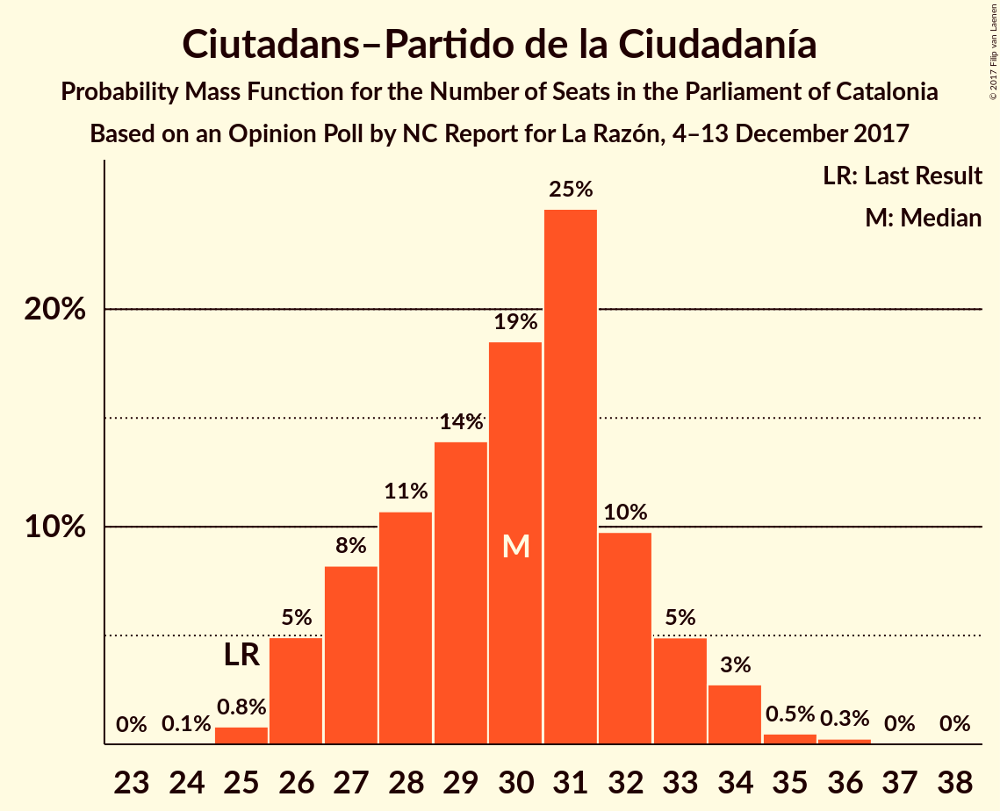
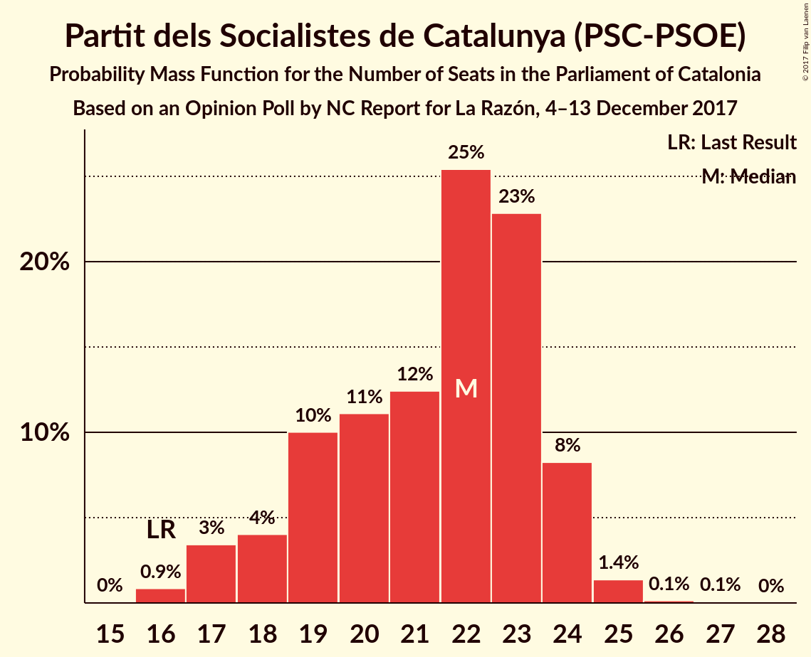

# Opinion Poll by NC Report for La Razón, 4–13 December 2017

<a href="#voting-intentions">Voting Intentions</a> | <a href="#seats">Seats</a> | <a href="#coalitions">Coalitions</a> | <a href="#technical-information">Technical Information</a>

## Voting Intentions

### Confidence Intervals

| Party | Last Result | Poll Result | 80% Confidence Interval | 90% Confidence Interval | 95% Confidence Interval | 99% Confidence Interval |
|:-----:|:-----------:|:-----------:|:-----------------------:|:-----------------------:|:-----------------------:|:-----------------------:|
| Esquerra Republicana de Catalunya–Catalunya Sí | 39.6% | 22.4% | 20.8–24.2% |20.3–24.7% |19.9–25.1% |19.2–26.0% |
| Ciutadans–Partido de la Ciudadanía | 17.9% | 21.8% | 20.2–23.5% |19.7–24.0% |19.3–24.5% |18.6–25.3% |
| Junts per Catalunya | 39.6% | 16.1% | 14.7–17.7% |14.3–18.1% |13.9–18.5% |13.3–19.3% |
| Partit dels Socialistes de Catalunya (PSC-PSOE) | 12.7% | 15.9% | 14.5–17.5% |14.1–17.9% |13.8–18.3% |13.1–19.1% |
| Catalunya en Comú | 8.9% | 7.6% | 6.6–8.8% |6.3–9.1% |6.1–9.4% |5.7–10.0% |
| Partit Popular | 8.5% | 7.3% | 6.3–8.5% |6.1–8.8% |5.8–9.1% |5.4–9.7% |
| Candidatura d’Unitat Popular | 8.2% | 5.8% | 5.0–6.9% |4.7–7.2% |4.5–7.4% |4.1–8.0% |

*Note:* The poll result column reflects the actual value used in the calculations. Published results may vary slightly, and in addition be rounded to fewer digits.

## Seats

### Confidence Intervals

| Party | Last Result | Median | 80% Confidence Interval | 90% Confidence Interval | 95% Confidence Interval | 99% Confidence Interval |
|:-----:|:-----------:|:------:|:-----------------------:|:-----------------------:|:-----------------------:|:-----------------------:|
| <a href="#esquerra-republicana-de-catalunya–catalunya-sí">Esquerra Republicana de Catalunya–Catalunya Sí</a> | 20 | 35 | 32–37 |31–38 |30–38 |29–40 |
| <a href="#ciutadans–partido-de-la-ciudadanía">Ciutadans–Partido de la Ciudadanía</a> | 25 | 30 | 27–32 |26–33 |26–34 |25–35 |
| <a href="#junts-per-catalunya">Junts per Catalunya</a> | 29 | 24 | 22–27 |21–28 |21–29 |19–29 |
| <a href="#partit-dels-socialistes-de-catalunya-(psc-psoe)">Partit dels Socialistes de Catalunya (PSC-PSOE)</a> | 16 | 22 | 19–24 |18–24 |17–24 |16–25 |
| <a href="#catalunya-en-comú">Catalunya en Comú</a> | 11 | 8 | 7–10 |6–11 |6–11 |5–12 |
| <a href="#partit-popular">Partit Popular</a> | 11 | 9 | 7–10 |7–11 |6–12 |6–13 |
| <a href="#candidatura-d’unitat-popular">Candidatura d’Unitat Popular</a> | 10 | 8 | 5–9 |5–9 |4–9 |3–10 |

### Esquerra Republicana de Catalunya–Catalunya Sí

*For a full overview of the results for this party, see the [Esquerra Republicana de Catalunya–Catalunya Sí](party-esquerrarepublicanadecatalunya–catalunyasí.html) page.*

| Number of Seats | Probability | Accumulated | Special Marks |
|:---------------:|:-----------:|:-----------:|:-------------:|
| 20 | 0% | 100% | Last Result |
| 21 | 0% | 100% |  |
| 22 | 0% | 100% |  |
| 23 | 0% | 100% |  |
| 24 | 0% | 100% |  |
| 25 | 0% | 100% |  |
| 26 | 0% | 100% |  |
| 27 | 0% | 100% |  |
| 28 | 0% | 100% |  |
| 29 | 0.8% | 99.9% |  |
| 30 | 2% | 99.1% |  |
| 31 | 5% | 97% |  |
| 32 | 17% | 91% |  |
| 33 | 9% | 74% |  |
| 34 | 12% | 65% |  |
| 35 | 19% | 53% | Median |
| 36 | 16% | 34% |  |
| 37 | 9% | 18% |  |
| 38 | 7% | 9% |  |
| 39 | 1.2% | 2% |  |
| 40 | 0.5% | 0.8% |  |
| 41 | 0.2% | 0.3% |  |
| 42 | 0.1% | 0.1% |  |
| 43 | 0% | 0% |  |

### Ciutadans–Partido de la Ciudadanía

*For a full overview of the results for this party, see the [Ciutadans–Partido de la Ciudadanía](party-ciutadans–partidodelaciudadanía.html) page.*

| Number of Seats | Probability | Accumulated | Special Marks |
|:---------------:|:-----------:|:-----------:|:-------------:|
| 24 | 0% | 100% |  |
| 25 | 0.7% | 99.9% | Last Result |
| 26 | 5% | 99.3% |  |
| 27 | 8% | 95% |  |
| 28 | 14% | 87% |  |
| 29 | 15% | 74% |  |
| 30 | 17% | 59% | Median |
| 31 | 24% | 42% |  |
| 32 | 8% | 17% |  |
| 33 | 6% | 9% |  |
| 34 | 3% | 4% |  |
| 35 | 0.4% | 0.8% |  |
| 36 | 0.3% | 0.4% |  |
| 37 | 0% | 0.1% |  |
| 38 | 0% | 0% |  |

### Junts per Catalunya

*For a full overview of the results for this party, see the [Junts per Catalunya](party-juntspercatalunya.html) page.*

| Number of Seats | Probability | Accumulated | Special Marks |
|:---------------:|:-----------:|:-----------:|:-------------:|
| 18 | 0.3% | 100% |  |
| 19 | 0.3% | 99.7% |  |
| 20 | 0.7% | 99.4% |  |
| 21 | 6% | 98.6% |  |
| 22 | 5% | 92% |  |
| 23 | 24% | 88% |  |
| 24 | 31% | 64% | Median |
| 25 | 12% | 33% |  |
| 26 | 9% | 21% |  |
| 27 | 6% | 12% |  |
| 28 | 4% | 6% |  |
| 29 | 2% | 3% | Last Result |
| 30 | 0.4% | 0.5% |  |
| 31 | 0.1% | 0.1% |  |
| 32 | 0% | 0% |  |

### Partit dels Socialistes de Catalunya (PSC-PSOE)

*For a full overview of the results for this party, see the [Partit dels Socialistes de Catalunya (PSC-PSOE)](party-partitdelssocialistesdecatalunyapsc-psoe.html) page.*

| Number of Seats | Probability | Accumulated | Special Marks |
|:---------------:|:-----------:|:-----------:|:-------------:|
| 16 | 0.8% | 100% | Last Result |
| 17 | 3% | 99.1% |  |
| 18 | 4% | 96% |  |
| 19 | 10% | 92% |  |
| 20 | 11% | 82% |  |
| 21 | 17% | 71% |  |
| 22 | 23% | 54% | Median |
| 23 | 21% | 32% |  |
| 24 | 9% | 11% |  |
| 25 | 1.4% | 2% |  |
| 26 | 0.2% | 0.3% |  |
| 27 | 0.1% | 0.1% |  |
| 28 | 0% | 0% |  |

### Catalunya en Comú

*For a full overview of the results for this party, see the [Catalunya en Comú](party-catalunyaencomú.html) page.*

| Number of Seats | Probability | Accumulated | Special Marks |
|:---------------:|:-----------:|:-----------:|:-------------:|
| 5 | 1.0% | 100% |  |
| 6 | 5% | 99.0% |  |
| 7 | 9% | 94% |  |
| 8 | 42% | 85% | Median |
| 9 | 32% | 43% |  |
| 10 | 4% | 11% |  |
| 11 | 5% | 6% | Last Result |
| 12 | 1.0% | 1.1% |  |
| 13 | 0.1% | 0.1% |  |
| 14 | 0% | 0% |  |

### Partit Popular

*For a full overview of the results for this party, see the [Partit Popular](party-partitpopular.html) page.*

| Number of Seats | Probability | Accumulated | Special Marks |
|:---------------:|:-----------:|:-----------:|:-------------:|
| 5 | 0.3% | 100% |  |
| 6 | 3% | 99.7% |  |
| 7 | 8% | 97% |  |
| 8 | 17% | 89% |  |
| 9 | 23% | 71% | Median |
| 10 | 39% | 48% |  |
| 11 | 5% | 10% | Last Result |
| 12 | 4% | 5% |  |
| 13 | 0.8% | 0.8% |  |
| 14 | 0% | 0% |  |

### Candidatura d’Unitat Popular

*For a full overview of the results for this party, see the [Candidatura d’Unitat Popular](party-candidaturad’unitatpopular.html) page.*

| Number of Seats | Probability | Accumulated | Special Marks |
|:---------------:|:-----------:|:-----------:|:-------------:|
| 3 | 1.5% | 100% |  |
| 4 | 1.4% | 98% |  |
| 5 | 11% | 97% |  |
| 6 | 3% | 87% |  |
| 7 | 12% | 84% |  |
| 8 | 55% | 72% | Median |
| 9 | 16% | 17% |  |
| 10 | 1.2% | 1.3% | Last Result |
| 11 | 0% | 0% |  |

## Coalitions

### Confidence Intervals

| Coalition | Last Result | Median | Majority? | 80% Confidence Interval | 90% Confidence Interval | 95% Confidence Interval | 99% Confidence Interval |
|:---------:|:-----------:|:------:|:---------:|:-----------------------:|:-----------------------:|:-----------------------:|:-----------------------:|
| Ciutadans–Partido de la Ciudadanía – Partit dels Socialistes de Catalunya (PSC-PSOE) – Catalunya en Comú – Partit Popular | 63 | 69 | 71% | 66–72 | 65–73 | 64–74 | 62–75 |
| Esquerra Republicana de Catalunya–Catalunya Sí – Junts per Catalunya – Catalunya en Comú | 60 | 67 | 42% | 63–70 | 63–71 | 62–72 | 61–74 |
| Esquerra Republicana de Catalunya–Catalunya Sí – Junts per Catalunya – Candidatura d’Unitat Popular | 59 | 66 | 29% | 63–69 | 62–70 | 61–71 | 60–73 |
| Esquerra Republicana de Catalunya–Catalunya Sí – Partit dels Socialistes de Catalunya (PSC-PSOE) – Catalunya en Comú | 47 | 64 | 10% | 61–67 | 60–68 | 59–69 | 57–70 |
| Ciutadans–Partido de la Ciudadanía – Partit dels Socialistes de Catalunya (PSC-PSOE) – Partit Popular | 52 | 60 | 0.2% | 57–64 | 56–64 | 56–65 | 54–67 |
| Esquerra Republicana de Catalunya–Catalunya Sí – Junts per Catalunya | 49 | 59 | 0% | 55–62 | 55–63 | 54–64 | 53–65 |

### Ciutadans–Partido de la Ciudadanía – Partit dels Socialistes de Catalunya (PSC-PSOE) – Catalunya en Comú – Partit Popular

| Number of Seats | Probability | Accumulated | Special Marks |
|:---------------:|:-----------:|:-----------:|:-------------:|
| 60 | 0% | 100% |  |
| 61 | 0.1% | 99.9% |  |
| 62 | 0.3% | 99.8% |  |
| 63 | 1.3% | 99.5% | Last Result |
| 64 | 2% | 98% |  |
| 65 | 5% | 96% |  |
| 66 | 9% | 91% |  |
| 67 | 12% | 82% |  |
| 68 | 19% | 71% | Majority |
| 69 | 12% | 51% | Median |
| 70 | 9% | 39% |  |
| 71 | 13% | 30% |  |
| 72 | 10% | 16% |  |
| 73 | 4% | 6% |  |
| 74 | 2% | 3% |  |
| 75 | 0.6% | 0.9% |  |
| 76 | 0.2% | 0.3% |  |
| 77 | 0.1% | 0.1% |  |
| 78 | 0% | 0% |  |

### Esquerra Republicana de Catalunya–Catalunya Sí – Junts per Catalunya – Catalunya en Comú

| Number of Seats | Probability | Accumulated | Special Marks |
|:---------------:|:-----------:|:-----------:|:-------------:|
| 59 | 0.1% | 100% |  |
| 60 | 0.2% | 99.9% | Last Result |
| 61 | 0.5% | 99.7% |  |
| 62 | 2% | 99.2% |  |
| 63 | 8% | 97% |  |
| 64 | 8% | 90% |  |
| 65 | 10% | 81% |  |
| 66 | 11% | 71% |  |
| 67 | 18% | 60% | Median |
| 68 | 15% | 42% | Majority |
| 69 | 11% | 27% |  |
| 70 | 8% | 16% |  |
| 71 | 4% | 8% |  |
| 72 | 2% | 4% |  |
| 73 | 1.4% | 2% |  |
| 74 | 0.4% | 0.6% |  |
| 75 | 0.1% | 0.2% |  |
| 76 | 0.1% | 0.1% |  |
| 77 | 0% | 0% |  |

### Esquerra Republicana de Catalunya–Catalunya Sí – Junts per Catalunya – Candidatura d’Unitat Popular

| Number of Seats | Probability | Accumulated | Special Marks |
|:---------------:|:-----------:|:-----------:|:-------------:|
| 58 | 0.1% | 100% |  |
| 59 | 0.2% | 99.9% | Last Result |
| 60 | 0.6% | 99.7% |  |
| 61 | 2% | 99.1% |  |
| 62 | 4% | 97% |  |
| 63 | 10% | 94% |  |
| 64 | 13% | 84% |  |
| 65 | 9% | 70% |  |
| 66 | 12% | 61% |  |
| 67 | 19% | 49% | Median |
| 68 | 12% | 29% | Majority |
| 69 | 9% | 18% |  |
| 70 | 5% | 9% |  |
| 71 | 2% | 4% |  |
| 72 | 1.3% | 2% |  |
| 73 | 0.3% | 0.5% |  |
| 74 | 0.1% | 0.2% |  |
| 75 | 0% | 0.1% |  |
| 76 | 0% | 0% |  |

### Esquerra Republicana de Catalunya–Catalunya Sí – Partit dels Socialistes de Catalunya (PSC-PSOE) – Catalunya en Comú

| Number of Seats | Probability | Accumulated | Special Marks |
|:---------------:|:-----------:|:-----------:|:-------------:|
| 47 | 0% | 100% | Last Result |
| 48 | 0% | 100% |  |
| 49 | 0% | 100% |  |
| 50 | 0% | 100% |  |
| 51 | 0% | 100% |  |
| 52 | 0% | 100% |  |
| 53 | 0% | 100% |  |
| 54 | 0% | 100% |  |
| 55 | 0% | 100% |  |
| 56 | 0.2% | 100% |  |
| 57 | 0.5% | 99.8% |  |
| 58 | 0.7% | 99.3% |  |
| 59 | 2% | 98.7% |  |
| 60 | 4% | 97% |  |
| 61 | 6% | 93% |  |
| 62 | 12% | 88% |  |
| 63 | 16% | 75% |  |
| 64 | 15% | 60% |  |
| 65 | 14% | 44% | Median |
| 66 | 10% | 30% |  |
| 67 | 10% | 19% |  |
| 68 | 5% | 10% | Majority |
| 69 | 3% | 5% |  |
| 70 | 1.2% | 2% |  |
| 71 | 0.3% | 0.5% |  |
| 72 | 0.1% | 0.2% |  |
| 73 | 0% | 0% |  |

### Ciutadans–Partido de la Ciudadanía – Partit dels Socialistes de Catalunya (PSC-PSOE) – Partit Popular

| Number of Seats | Probability | Accumulated | Special Marks |
|:---------------:|:-----------:|:-----------:|:-------------:|
| 52 | 0.1% | 100% | Last Result |
| 53 | 0.2% | 99.9% |  |
| 54 | 0.7% | 99.7% |  |
| 55 | 1.4% | 98.9% |  |
| 56 | 3% | 98% |  |
| 57 | 7% | 95% |  |
| 58 | 10% | 87% |  |
| 59 | 13% | 77% |  |
| 60 | 18% | 65% |  |
| 61 | 11% | 46% | Median |
| 62 | 11% | 35% |  |
| 63 | 12% | 24% |  |
| 64 | 8% | 12% |  |
| 65 | 3% | 4% |  |
| 66 | 1.0% | 2% |  |
| 67 | 0.5% | 0.7% |  |
| 68 | 0.1% | 0.2% | Majority |
| 69 | 0% | 0% |  |

### Esquerra Republicana de Catalunya–Catalunya Sí – Junts per Catalunya

| Number of Seats | Probability | Accumulated | Special Marks |
|:---------------:|:-----------:|:-----------:|:-------------:|
| 49 | 0% | 100% | Last Result |
| 50 | 0% | 100% |  |
| 51 | 0.1% | 100% |  |
| 52 | 0.3% | 99.9% |  |
| 53 | 0.8% | 99.6% |  |
| 54 | 3% | 98.8% |  |
| 55 | 9% | 96% |  |
| 56 | 11% | 87% |  |
| 57 | 9% | 76% |  |
| 58 | 11% | 67% |  |
| 59 | 21% | 56% | Median |
| 60 | 12% | 35% |  |
| 61 | 11% | 22% |  |
| 62 | 5% | 12% |  |
| 63 | 3% | 6% |  |
| 64 | 2% | 3% |  |
| 65 | 0.9% | 1.2% |  |
| 66 | 0.2% | 0.3% |  |
| 67 | 0.1% | 0.1% |  |
| 68 | 0% | 0% | Majority |

## Technical Information

### Opinion Poll

+ **Polling firm:** NC Report
+ **Commissioner(s):** La Razón
+ **Fieldwork period:** 4–13 December 2017

### Calculations

+ **Sample size:** 1000
+ **Simulations done:** 524,288
+ **Error estimate:** 0.91%

