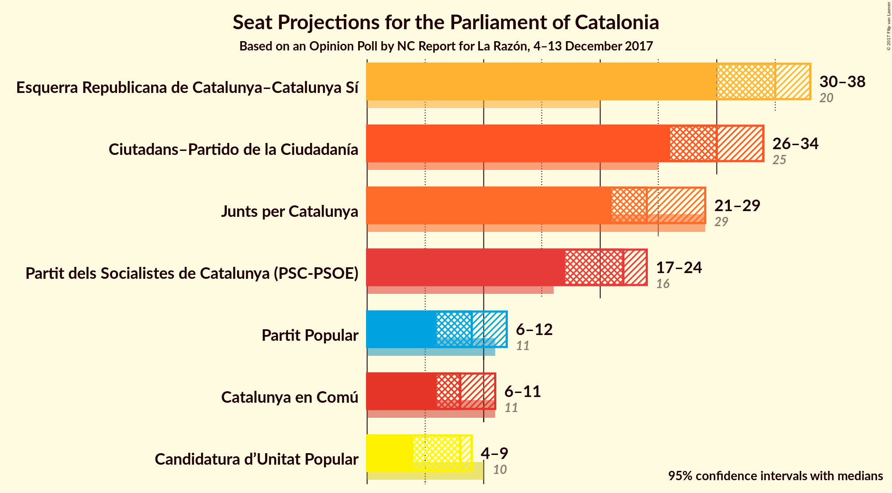
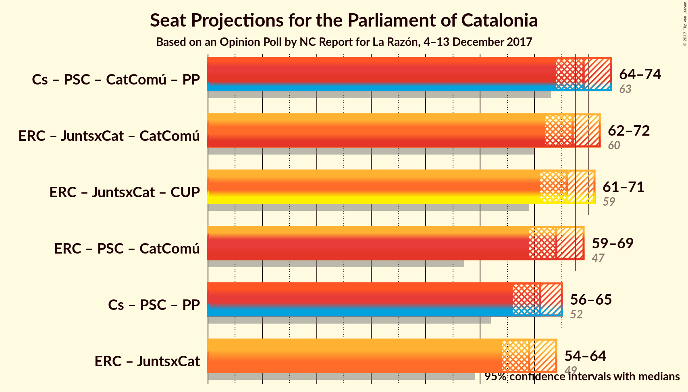

# Opinion Poll by NC Report for La Razón, 4–13 December 2017

<a href="#voting-intentions">Voting Intentions</a> | <a href="#seats">Seats</a> | <a href="#coalitions">Coalitions</a> | <a href="#technical-information">Technical Information</a>

## Voting Intentions

### Confidence Intervals

| Party | Last Result | Poll Result | 80% Confidence Interval | 90% Confidence Interval | 95% Confidence Interval | 99% Confidence Interval |
|:-----:|:-----------:|:-----------:|:-----------------------:|:-----------------------:|:-----------------------:|:-----------------------:|
| Esquerra Republicana de Catalunya–Catalunya Sí | 39.6% | 22.4% | N/A |N/A |N/A |N/A |
| Ciutadans–Partido de la Ciudadanía | 17.9% | 21.8% | N/A |N/A |N/A |N/A |
| Junts per Catalunya | 39.6% | 16.1% | N/A |N/A |N/A |N/A |
| Partit dels Socialistes de Catalunya (PSC-PSOE) | 12.7% | 15.9% | N/A |N/A |N/A |N/A |
| Catalunya en Comú | 8.9% | 7.6% | N/A |N/A |N/A |N/A |
| Partit Popular | 8.5% | 7.3% | N/A |N/A |N/A |N/A |
| Candidatura d’Unitat Popular | 8.2% | 5.8% | N/A |N/A |N/A |N/A |

*Note:* The poll result column reflects the actual value used in the calculations. Published results may vary slightly, and in addition be rounded to fewer digits.

## Seats

### Confidence Intervals

| Party | Last Result | Median | 80% Confidence Interval | 90% Confidence Interval | 95% Confidence Interval | 99% Confidence Interval |
|:-----:|:-----------:|:------:|:-----------------------:|:-----------------------:|:-----------------------:|:-----------------------:|
| <a href="#esquerra-republicana-de-catalunya–catalunya-sí">Esquerra Republicana de Catalunya–Catalunya Sí</a> | 20 | N/A | N/A |N/A |N/A |N/A |
| <a href="#ciutadans–partido-de-la-ciudadanía">Ciutadans–Partido de la Ciudadanía</a> | 25 | N/A | N/A |N/A |N/A |N/A |
| <a href="#junts-per-catalunya">Junts per Catalunya</a> | 29 | N/A | N/A |N/A |N/A |N/A |
| <a href="#partit-dels-socialistes-de-catalunya-(psc-psoe)">Partit dels Socialistes de Catalunya (PSC-PSOE)</a> | 16 | N/A | N/A |N/A |N/A |N/A |
| <a href="#catalunya-en-comú">Catalunya en Comú</a> | 11 | N/A | N/A |N/A |N/A |N/A |
| <a href="#partit-popular">Partit Popular</a> | 11 | N/A | N/A |N/A |N/A |N/A |
| <a href="#candidatura-d’unitat-popular">Candidatura d’Unitat Popular</a> | 10 | N/A | N/A |N/A |N/A |N/A |

## Coalitions

## Technical Information

### Opinion Poll

+ **Polling firm:** NC Report
+ **Commissioner(s):** La Razón
+ **Fieldwork period:** 4–13 December 2017

### Calculations

+ **Sample size:** 1000
+ **Simulations done:** 0
+ **Error estimate:** 100.00%

