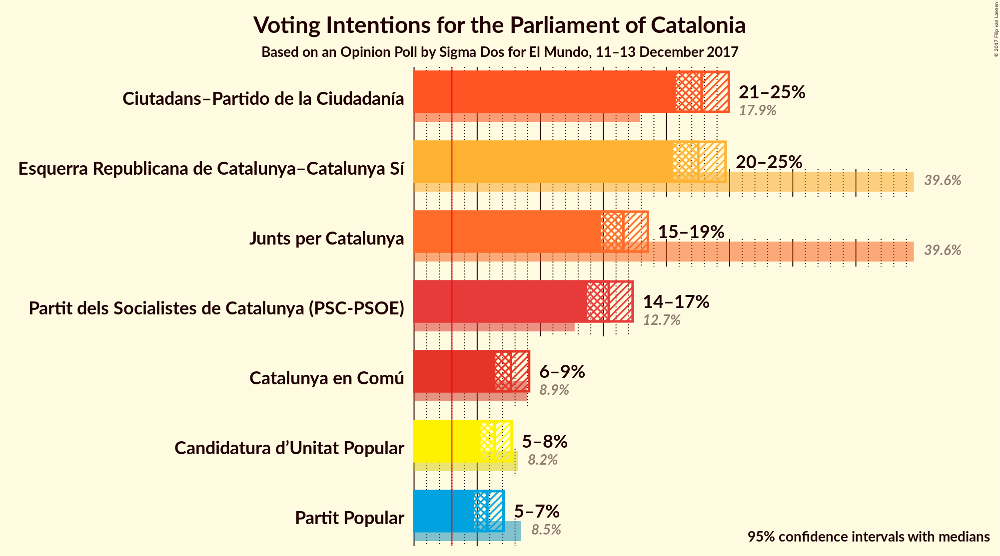
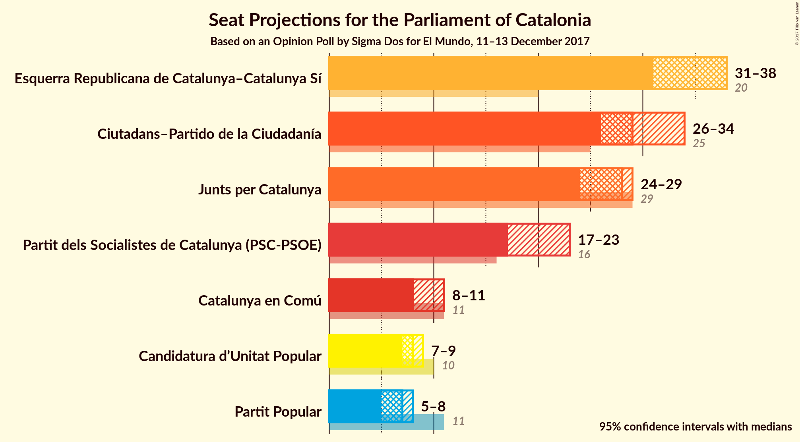
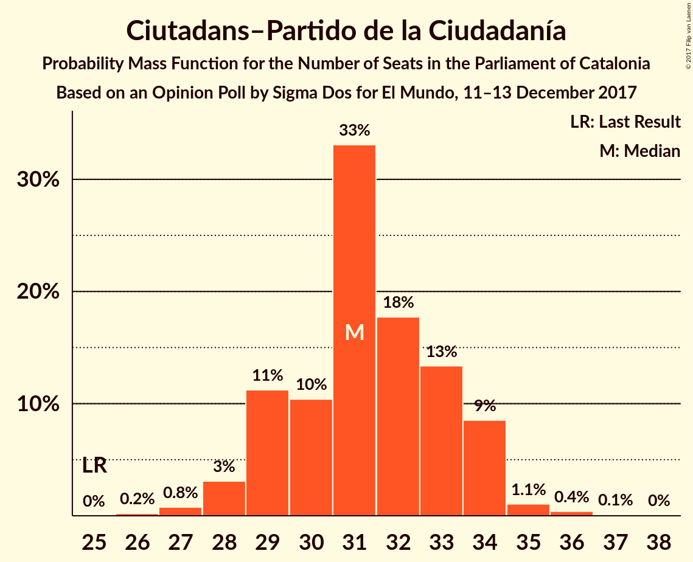
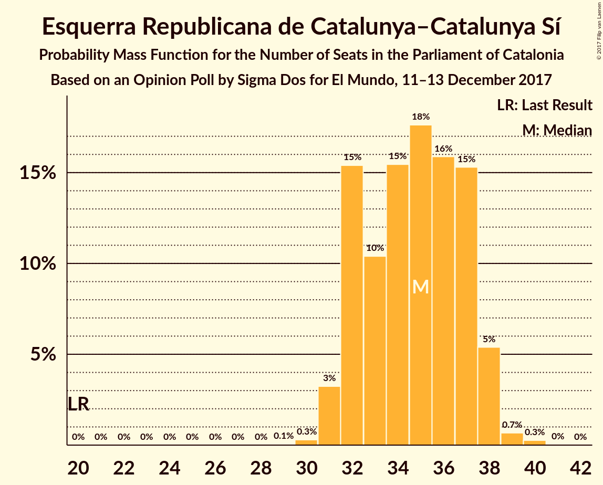
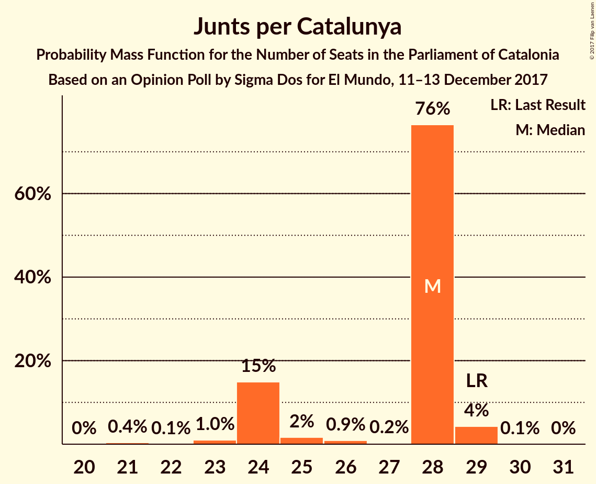
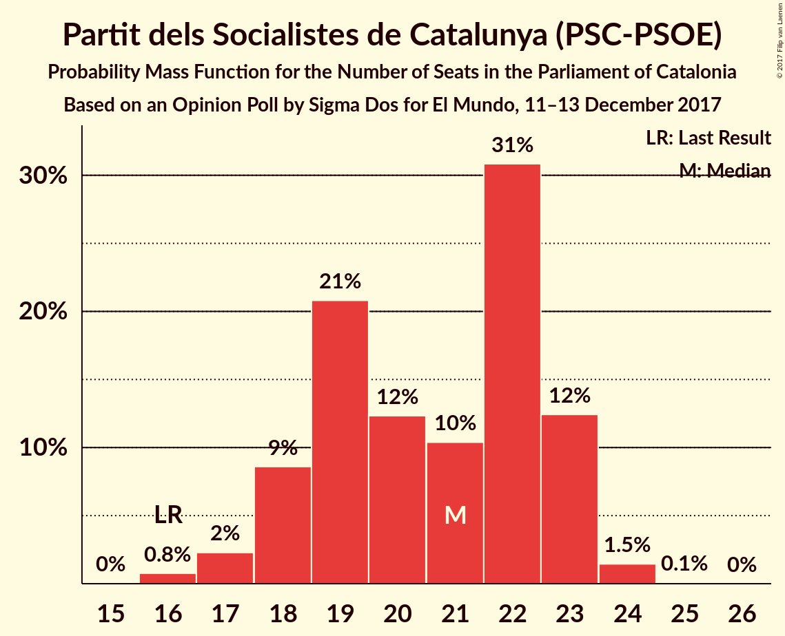
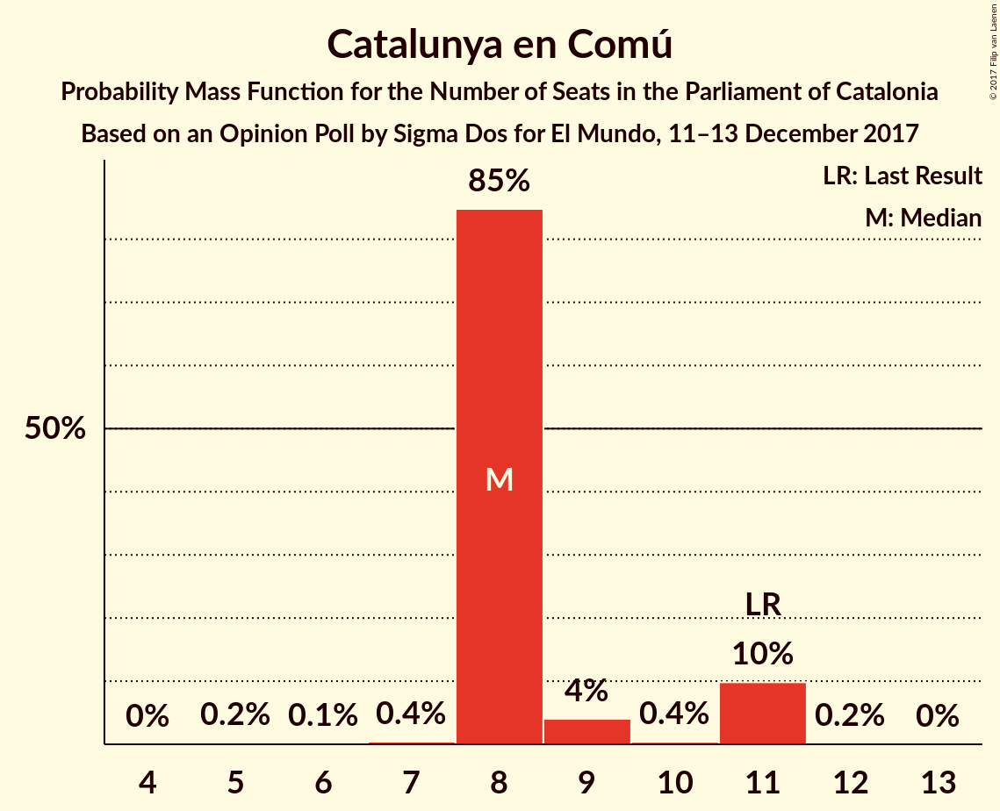
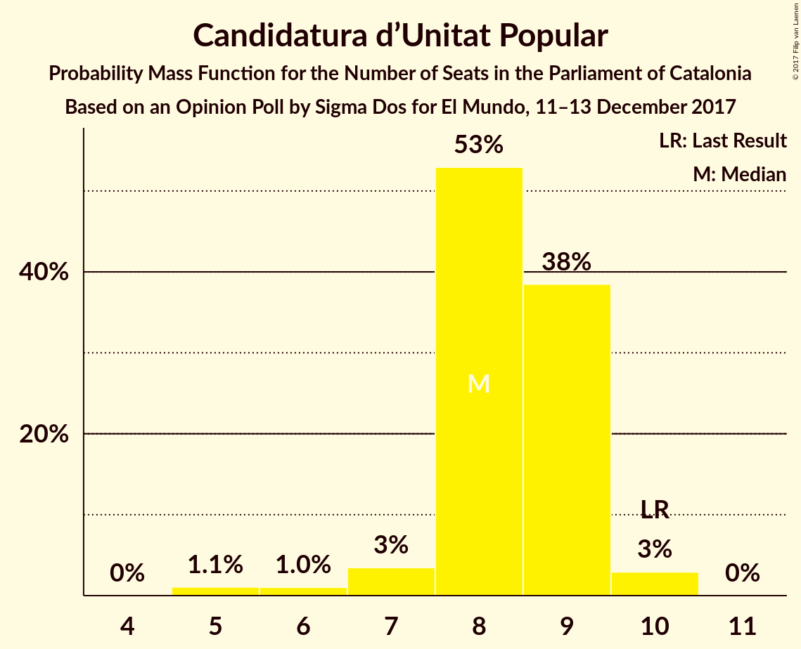
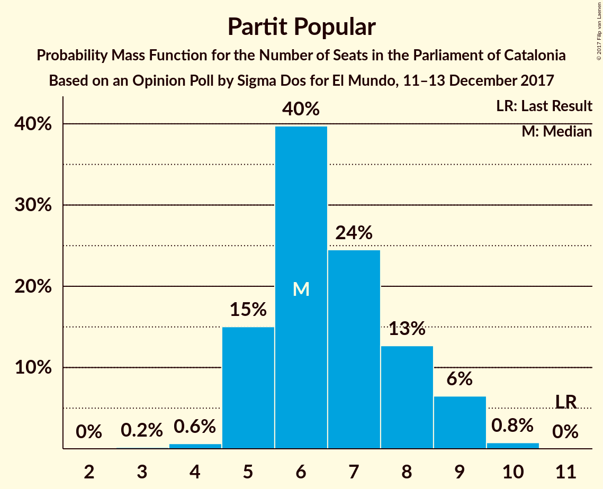
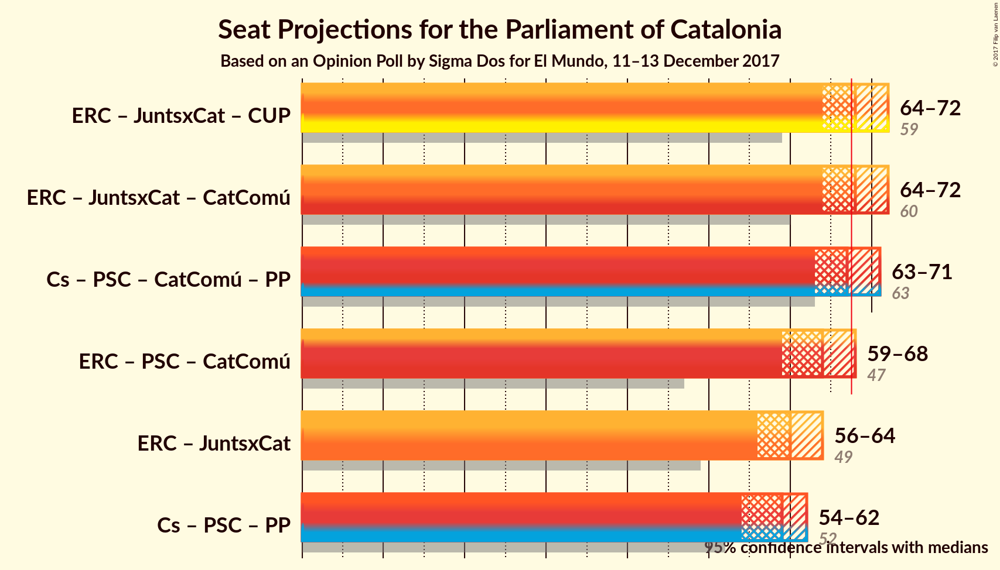

# Opinion Poll by Sigma Dos for El Mundo, 11–13 December 2017

<a href="#voting-intentions">Voting Intentions</a> | <a href="#seats">Seats</a> | <a href="#coalitions">Coalitions</a> | <a href="#technical-information">Technical Information</a>

## Voting Intentions

### Confidence Intervals

| Party | Last Result | Poll Result | 80% Confidence Interval | 90% Confidence Interval | 95% Confidence Interval | 99% Confidence Interval |
|:-----:|:-----------:|:-----------:|:-----------------------:|:-----------------------:|:-----------------------:|:-----------------------:|
| Ciutadans–Partido de la Ciudadanía | 17.9% | 22.8% | 21.4–24.2% |21.1–24.6% |20.7–24.9% |20.1–25.6% |
| Esquerra Republicana de Catalunya–Catalunya Sí | 39.6% | 22.5% | 21.2–23.9% |20.8–24.3% |20.5–24.7% |19.9–25.4% |
| Junts per Catalunya | 39.6% | 16.6% | 15.4–17.8% |15.1–18.2% |14.8–18.5% |14.3–19.1% |
| Partit dels Socialistes de Catalunya (PSC-PSOE) | 12.7% | 15.4% | 14.3–16.7% |14.0–17.0% |13.7–17.3% |13.2–17.9% |
| Catalunya en Comú | 8.9% | 7.7% | 6.9–8.6% |6.6–8.9% |6.4–9.1% |6.1–9.6% |
| Candidatura d’Unitat Popular | 8.2% | 6.4% | 5.7–7.3% |5.4–7.5% |5.3–7.7% |4.9–8.2% |
| Partit Popular | 8.5% | 5.8% | 5.1–6.6% |4.9–6.9% |4.7–7.1% |4.4–7.5% |

*Note:* The poll result column reflects the actual value used in the calculations. Published results may vary slightly, and in addition be rounded to fewer digits.

## Seats

### Confidence Intervals

| Party | Last Result | Median | 80% Confidence Interval | 90% Confidence Interval | 95% Confidence Interval | 99% Confidence Interval |
|:-----:|:-----------:|:------:|:-----------------------:|:-----------------------:|:-----------------------:|:-----------------------:|
| <a href="#ciutadans–partido-de-la-ciudadanía">Ciutadans–Partido de la Ciudadanía</a> | 25 | 31 | 29–33 |29–34 |28–34 |27–35 |
| <a href="#esquerra-republicana-de-catalunya–catalunya-sí">Esquerra Republicana de Catalunya–Catalunya Sí</a> | 20 | 35 | 32–37 |32–38 |31–38 |31–39 |
| <a href="#junts-per-catalunya">Junts per Catalunya</a> | 29 | 25 | 23–27 |23–28 |23–29 |21–29 |
| <a href="#partit-dels-socialistes-de-catalunya-(psc-psoe)">Partit dels Socialistes de Catalunya (PSC-PSOE)</a> | 16 | 21 | 18–23 |18–23 |17–23 |16–24 |
| <a href="#catalunya-en-comú">Catalunya en Comú</a> | 11 | 8 | 8–9 |7–10 |6–11 |6–11 |
| <a href="#candidatura-d’unitat-popular">Candidatura d’Unitat Popular</a> | 10 | 8 | 8–9 |7–9 |7–10 |5–10 |
| <a href="#partit-popular">Partit Popular</a> | 11 | 6 | 5–8 |5–9 |5–9 |4–10 |

### Ciutadans–Partido de la Ciudadanía

*For a full overview of the results for this party, see the [Ciutadans–Partido de la Ciudadanía](party-ciutadans–partidodelaciudadanía.html) page.*

| Number of Seats | Probability | Accumulated | Special Marks |
|:---------------:|:-----------:|:-----------:|:-------------:|
| 25 | 0% | 100% | Last Result |
| 26 | 0.2% | 100% |  |
| 27 | 0.7% | 99.8% |  |
| 28 | 3% | 99.1% |  |
| 29 | 11% | 96% |  |
| 30 | 11% | 85% |  |
| 31 | 34% | 74% | Median |
| 32 | 18% | 40% |  |
| 33 | 13% | 23% |  |
| 34 | 8% | 9% |  |
| 35 | 1.1% | 2% |  |
| 36 | 0.3% | 0.5% |  |
| 37 | 0.1% | 0.2% |  |
| 38 | 0% | 0% |  |

### Esquerra Republicana de Catalunya–Catalunya Sí

*For a full overview of the results for this party, see the [Esquerra Republicana de Catalunya–Catalunya Sí](party-esquerrarepublicanadecatalunya–catalunyasí.html) page.*

| Number of Seats | Probability | Accumulated | Special Marks |
|:---------------:|:-----------:|:-----------:|:-------------:|
| 20 | 0% | 100% | Last Result |
| 21 | 0% | 100% |  |
| 22 | 0% | 100% |  |
| 23 | 0% | 100% |  |
| 24 | 0% | 100% |  |
| 25 | 0% | 100% |  |
| 26 | 0% | 100% |  |
| 27 | 0% | 100% |  |
| 28 | 0% | 100% |  |
| 29 | 0.1% | 100% |  |
| 30 | 0.3% | 99.9% |  |
| 31 | 3% | 99.6% |  |
| 32 | 15% | 97% |  |
| 33 | 12% | 82% |  |
| 34 | 17% | 70% |  |
| 35 | 14% | 53% | Median |
| 36 | 19% | 39% |  |
| 37 | 14% | 21% |  |
| 38 | 5% | 6% |  |
| 39 | 0.6% | 0.9% |  |
| 40 | 0.3% | 0.3% |  |
| 41 | 0% | 0% |  |

### Junts per Catalunya

*For a full overview of the results for this party, see the [Junts per Catalunya](party-juntspercatalunya.html) page.*

| Number of Seats | Probability | Accumulated | Special Marks |
|:---------------:|:-----------:|:-----------:|:-------------:|
| 20 | 0.1% | 100% |  |
| 21 | 0.9% | 99.9% |  |
| 22 | 1.1% | 99.0% |  |
| 23 | 13% | 98% |  |
| 24 | 25% | 84% |  |
| 25 | 26% | 60% | Median |
| 26 | 21% | 34% |  |
| 27 | 5% | 13% |  |
| 28 | 3% | 7% |  |
| 29 | 4% | 4% | Last Result |
| 30 | 0.3% | 0.3% |  |
| 31 | 0% | 0% |  |

### Partit dels Socialistes de Catalunya (PSC-PSOE)

*For a full overview of the results for this party, see the [Partit dels Socialistes de Catalunya (PSC-PSOE)](party-partitdelssocialistesdecatalunyapsc-psoe.html) page.*

| Number of Seats | Probability | Accumulated | Special Marks |
|:---------------:|:-----------:|:-----------:|:-------------:|
| 16 | 0.7% | 100% | Last Result |
| 17 | 2% | 99.2% |  |
| 18 | 8% | 97% |  |
| 19 | 21% | 89% |  |
| 20 | 13% | 68% |  |
| 21 | 10% | 55% | Median |
| 22 | 31% | 45% |  |
| 23 | 12% | 13% |  |
| 24 | 1.4% | 2% |  |
| 25 | 0.1% | 0.1% |  |
| 26 | 0% | 0% |  |

### Catalunya en Comú

*For a full overview of the results for this party, see the [Catalunya en Comú](party-catalunyaencomú.html) page.*

| Number of Seats | Probability | Accumulated | Special Marks |
|:---------------:|:-----------:|:-----------:|:-------------:|
| 5 | 0.1% | 100% |  |
| 6 | 3% | 99.9% |  |
| 7 | 5% | 97% |  |
| 8 | 48% | 92% | Median |
| 9 | 37% | 44% |  |
| 10 | 3% | 8% |  |
| 11 | 4% | 5% | Last Result |
| 12 | 0.2% | 0.2% |  |
| 13 | 0% | 0% |  |

### Candidatura d’Unitat Popular

*For a full overview of the results for this party, see the [Candidatura d’Unitat Popular](party-candidaturad’unitatpopular.html) page.*

| Number of Seats | Probability | Accumulated | Special Marks |
|:---------------:|:-----------:|:-----------:|:-------------:|
| 5 | 1.1% | 100% |  |
| 6 | 0.9% | 98.9% |  |
| 7 | 4% | 98% |  |
| 8 | 53% | 94% | Median |
| 9 | 38% | 41% |  |
| 10 | 3% | 3% | Last Result |
| 11 | 0% | 0% |  |

### Partit Popular

*For a full overview of the results for this party, see the [Partit Popular](party-partitpopular.html) page.*

| Number of Seats | Probability | Accumulated | Special Marks |
|:---------------:|:-----------:|:-----------:|:-------------:|
| 3 | 0.1% | 100% |  |
| 4 | 0.6% | 99.9% |  |
| 5 | 16% | 99.3% |  |
| 6 | 38% | 83% | Median |
| 7 | 26% | 45% |  |
| 8 | 12% | 20% |  |
| 9 | 6% | 7% |  |
| 10 | 0.7% | 0.7% |  |
| 11 | 0% | 0% | Last Result |

## Coalitions

### Confidence Intervals

| Coalition | Last Result | Median | Majority? | 80% Confidence Interval | 90% Confidence Interval | 95% Confidence Interval | 99% Confidence Interval |
|:---------:|:-----------:|:------:|:---------:|:-----------------------:|:-----------------------:|:-----------------------:|:-----------------------:|
| Esquerra Republicana de Catalunya–Catalunya Sí – Junts per Catalunya – Candidatura d’Unitat Popular | 59 | 68 | 62% | 65–70 | 65–71 | 64–72 | 63–73 |
| Esquerra Republicana de Catalunya–Catalunya Sí – Junts per Catalunya – Catalunya en Comú | 60 | 68 | 61% | 65–71 | 65–71 | 64–72 | 63–74 |
| Ciutadans–Partido de la Ciudadanía – Partit dels Socialistes de Catalunya (PSC-PSOE) – Catalunya en Comú – Partit Popular | 63 | 67 | 38% | 65–70 | 64–70 | 63–71 | 62–72 |
| Esquerra Republicana de Catalunya–Catalunya Sí – Partit dels Socialistes de Catalunya (PSC-PSOE) – Catalunya en Comú | 47 | 64 | 5% | 61–67 | 60–67 | 59–68 | 58–69 |
| Esquerra Republicana de Catalunya–Catalunya Sí – Junts per Catalunya | 49 | 60 | 0% | 57–62 | 56–63 | 56–63 | 55–65 |
| Ciutadans–Partido de la Ciudadanía – Partit dels Socialistes de Catalunya (PSC-PSOE) – Partit Popular | 52 | 58 | 0% | 56–61 | 55–62 | 55–62 | 53–64 |

### Esquerra Republicana de Catalunya–Catalunya Sí – Junts per Catalunya – Candidatura d’Unitat Popular

| Number of Seats | Probability | Accumulated | Special Marks |
|:---------------:|:-----------:|:-----------:|:-------------:|
| 59 | 0% | 100% | Last Result |
| 60 | 0% | 100% |  |
| 61 | 0% | 100% |  |
| 62 | 0.3% | 100% |  |
| 63 | 1.2% | 99.7% |  |
| 64 | 3% | 98% |  |
| 65 | 8% | 96% |  |
| 66 | 11% | 87% |  |
| 67 | 14% | 76% |  |
| 68 | 18% | 62% | Median, Majority |
| 69 | 19% | 44% |  |
| 70 | 16% | 25% |  |
| 71 | 5% | 9% |  |
| 72 | 2% | 4% |  |
| 73 | 0.9% | 1.3% |  |
| 74 | 0.3% | 0.4% |  |
| 75 | 0.1% | 0.1% |  |
| 76 | 0% | 0% |  |

### Esquerra Republicana de Catalunya–Catalunya Sí – Junts per Catalunya – Catalunya en Comú

| Number of Seats | Probability | Accumulated | Special Marks |
|:---------------:|:-----------:|:-----------:|:-------------:|
| 60 | 0% | 100% | Last Result |
| 61 | 0% | 100% |  |
| 62 | 0.2% | 100% |  |
| 63 | 0.8% | 99.8% |  |
| 64 | 2% | 99.0% |  |
| 65 | 8% | 97% |  |
| 66 | 10% | 89% |  |
| 67 | 18% | 79% |  |
| 68 | 14% | 61% | Median, Majority |
| 69 | 21% | 47% |  |
| 70 | 16% | 26% |  |
| 71 | 6% | 10% |  |
| 72 | 2% | 4% |  |
| 73 | 1.0% | 2% |  |
| 74 | 0.5% | 0.6% |  |
| 75 | 0.1% | 0.2% |  |
| 76 | 0% | 0% |  |

### Ciutadans–Partido de la Ciudadanía – Partit dels Socialistes de Catalunya (PSC-PSOE) – Catalunya en Comú – Partit Popular

| Number of Seats | Probability | Accumulated | Special Marks |
|:---------------:|:-----------:|:-----------:|:-------------:|
| 60 | 0.1% | 100% |  |
| 61 | 0.3% | 99.9% |  |
| 62 | 0.9% | 99.6% |  |
| 63 | 2% | 98.7% | Last Result |
| 64 | 5% | 96% |  |
| 65 | 16% | 91% |  |
| 66 | 19% | 75% | Median |
| 67 | 18% | 56% |  |
| 68 | 14% | 38% | Majority |
| 69 | 11% | 24% |  |
| 70 | 8% | 13% |  |
| 71 | 3% | 4% |  |
| 72 | 1.2% | 2% |  |
| 73 | 0.3% | 0.3% |  |
| 74 | 0% | 0% |  |

### Esquerra Republicana de Catalunya–Catalunya Sí – Partit dels Socialistes de Catalunya (PSC-PSOE) – Catalunya en Comú

| Number of Seats | Probability | Accumulated | Special Marks |
|:---------------:|:-----------:|:-----------:|:-------------:|
| 47 | 0% | 100% | Last Result |
| 48 | 0% | 100% |  |
| 49 | 0% | 100% |  |
| 50 | 0% | 100% |  |
| 51 | 0% | 100% |  |
| 52 | 0% | 100% |  |
| 53 | 0% | 100% |  |
| 54 | 0% | 100% |  |
| 55 | 0% | 100% |  |
| 56 | 0% | 100% |  |
| 57 | 0.1% | 100% |  |
| 58 | 0.6% | 99.8% |  |
| 59 | 2% | 99.3% |  |
| 60 | 3% | 97% |  |
| 61 | 7% | 94% |  |
| 62 | 13% | 87% |  |
| 63 | 19% | 74% |  |
| 64 | 21% | 55% | Median |
| 65 | 14% | 35% |  |
| 66 | 9% | 21% |  |
| 67 | 7% | 12% |  |
| 68 | 3% | 5% | Majority |
| 69 | 1.5% | 2% |  |
| 70 | 0.1% | 0.2% |  |
| 71 | 0% | 0% |  |

### Esquerra Republicana de Catalunya–Catalunya Sí – Junts per Catalunya

| Number of Seats | Probability | Accumulated | Special Marks |
|:---------------:|:-----------:|:-----------:|:-------------:|
| 49 | 0% | 100% | Last Result |
| 50 | 0% | 100% |  |
| 51 | 0% | 100% |  |
| 52 | 0% | 100% |  |
| 53 | 0.1% | 100% |  |
| 54 | 0.4% | 99.9% |  |
| 55 | 2% | 99.6% |  |
| 56 | 4% | 98% |  |
| 57 | 10% | 94% |  |
| 58 | 10% | 83% |  |
| 59 | 18% | 73% |  |
| 60 | 18% | 56% | Median |
| 61 | 20% | 38% |  |
| 62 | 12% | 18% |  |
| 63 | 4% | 6% |  |
| 64 | 2% | 2% |  |
| 65 | 0.6% | 0.9% |  |
| 66 | 0.2% | 0.3% |  |
| 67 | 0.1% | 0.1% |  |
| 68 | 0% | 0% | Majority |

### Ciutadans–Partido de la Ciudadanía – Partit dels Socialistes de Catalunya (PSC-PSOE) – Partit Popular

| Number of Seats | Probability | Accumulated | Special Marks |
|:---------------:|:-----------:|:-----------:|:-------------:|
| 51 | 0.1% | 100% |  |
| 52 | 0.2% | 99.9% | Last Result |
| 53 | 0.6% | 99.7% |  |
| 54 | 2% | 99.2% |  |
| 55 | 3% | 98% |  |
| 56 | 8% | 94% |  |
| 57 | 21% | 86% |  |
| 58 | 15% | 65% | Median |
| 59 | 19% | 50% |  |
| 60 | 14% | 31% |  |
| 61 | 9% | 17% |  |
| 62 | 6% | 8% |  |
| 63 | 1.3% | 2% |  |
| 64 | 0.5% | 0.7% |  |
| 65 | 0.1% | 0.1% |  |
| 66 | 0% | 0% |  |

## Technical Information

### Opinion Poll

+ **Polling firm:** Sigma Dos
+ **Commissioner(s):** El Mundo
+ **Fieldwork period:** 11–13 December 2017

### Calculations

+ **Sample size:** 1550
+ **Simulations done:** 1,048,576
+ **Error estimate:** 0.79%

