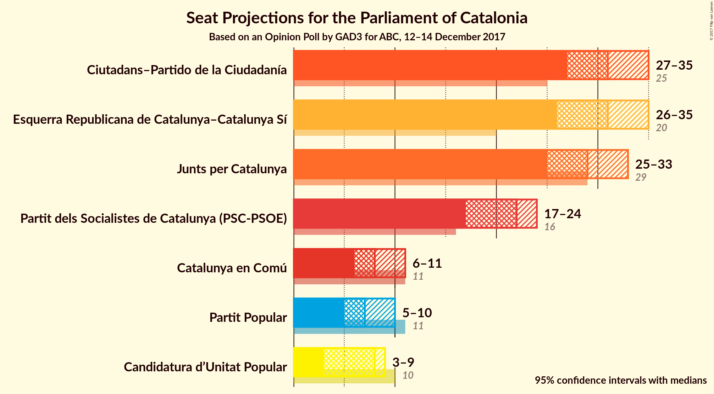

# Opinion Poll by GAD3 for ABC, 12–14 December 2017

<a href="#voting-intentions">Voting Intentions</a> | <a href="#seats">Seats</a> | <a href="#coalitions">Coalitions</a> | <a href="#technical-information">Technical Information</a>

## Voting Intentions

### Confidence Intervals

| Party | Last Result | Poll Result | 80% Confidence Interval | 90% Confidence Interval | 95% Confidence Interval | 99% Confidence Interval |
|:-----:|:-----------:|:-----------:|:-----------------------:|:-----------------------:|:-----------------------:|:-----------------------:|
| Ciutadans–Partido de la Ciudadanía | 17.9% | 23.2% | 21.6–25.0% |21.1–25.5% |20.7–25.9% |19.9–26.8% |
| Esquerra Republicana de Catalunya–Catalunya Sí | 39.6% | 20.3% | 18.7–22.0% |18.3–22.5% |17.9–22.9% |17.2–23.7% |
| Junts per Catalunya | 39.6% | 19.5% | 18.0–21.2% |17.5–21.7% |17.2–22.1% |16.4–22.9% |
| Partit dels Socialistes de Catalunya (PSC-PSOE) | 12.7% | 16.3% | 14.9–17.9% |14.5–18.3% |14.1–18.7% |13.5–19.5% |
| Catalunya en Comú | 8.9% | 7.5% | 6.5–8.7% |6.2–9.0% |6.0–9.3% |5.6–9.9% |
| Partit Popular | 8.5% | 6.2% | 5.3–7.3% |5.1–7.6% |4.9–7.9% |4.5–8.4% |
| Candidatura d’Unitat Popular | 8.2% | 5.6% | 4.8–6.6% |4.5–7.0% |4.3–7.2% |4.0–7.7% |

*Note:* The poll result column reflects the actual value used in the calculations. Published results may vary slightly, and in addition be rounded to fewer digits.

## Seats

### Confidence Intervals

| Party | Last Result | Median | 80% Confidence Interval | 90% Confidence Interval | 95% Confidence Interval | 99% Confidence Interval |
|:-----:|:-----------:|:------:|:-----------------------:|:-----------------------:|:-----------------------:|:-----------------------:|
| <a href="#ciutadans–partido-de-la-ciudadanía">Ciutadans–Partido de la Ciudadanía</a> | 25 | 31 | 29–34 |28–34 |27–35 |26–37 |
| <a href="#esquerra-republicana-de-catalunya–catalunya-sí">Esquerra Republicana de Catalunya–Catalunya Sí</a> | 20 | 31 | 28–33 |27–34 |26–35 |25–36 |
| <a href="#junts-per-catalunya">Junts per Catalunya</a> | 29 | 29 | 26–31 |26–32 |26–32 |24–35 |
| <a href="#partit-dels-socialistes-de-catalunya-(psc-psoe)">Partit dels Socialistes de Catalunya (PSC-PSOE)</a> | 16 | 22 | 20–23 |19–24 |18–24 |17–25 |
| <a href="#catalunya-en-comú">Catalunya en Comú</a> | 11 | 8 | 7–9 |6–10 |6–11 |5–11 |
| <a href="#partit-popular">Partit Popular</a> | 11 | 7 | 5–9 |5–10 |5–10 |4–10 |
| <a href="#candidatura-d’unitat-popular">Candidatura d’Unitat Popular</a> | 10 | 8 | 5–8 |4–9 |3–9 |3–9 |

### Ciutadans–Partido de la Ciudadanía

*For a full overview of the results for this party, see the [Ciutadans–Partido de la Ciudadanía](party-ciutadans–partidodelaciudadanía.html) page.*

| Number of Seats | Probability | Accumulated | Special Marks |
|:---------------:|:-----------:|:-----------:|:-------------:|
| 25 | 0.1% | 100% | Last Result |
| 26 | 0.8% | 99.9% |  |
| 27 | 2% | 99.1% |  |
| 28 | 4% | 97% |  |
| 29 | 13% | 93% |  |
| 30 | 9% | 80% |  |
| 31 | 29% | 71% | Median |
| 32 | 17% | 43% |  |
| 33 | 9% | 25% |  |
| 34 | 12% | 17% |  |
| 35 | 2% | 4% |  |
| 36 | 1.2% | 2% |  |
| 37 | 0.4% | 0.6% |  |
| 38 | 0.2% | 0.2% |  |
| 39 | 0% | 0% |  |

### Esquerra Republicana de Catalunya–Catalunya Sí

*For a full overview of the results for this party, see the [Esquerra Republicana de Catalunya–Catalunya Sí](party-esquerrarepublicanadecatalunya–catalunyasí.html) page.*

| Number of Seats | Probability | Accumulated | Special Marks |
|:---------------:|:-----------:|:-----------:|:-------------:|
| 20 | 0% | 100% | Last Result |
| 21 | 0% | 100% |  |
| 22 | 0% | 100% |  |
| 23 | 0% | 100% |  |
| 24 | 0.1% | 100% |  |
| 25 | 0.5% | 99.9% |  |
| 26 | 3% | 99.4% |  |
| 27 | 3% | 96% |  |
| 28 | 6% | 93% |  |
| 29 | 13% | 87% |  |
| 30 | 11% | 74% |  |
| 31 | 33% | 62% | Median |
| 32 | 17% | 29% |  |
| 33 | 6% | 12% |  |
| 34 | 3% | 6% |  |
| 35 | 2% | 3% |  |
| 36 | 1.1% | 1.4% |  |
| 37 | 0.2% | 0.3% |  |
| 38 | 0.1% | 0.1% |  |
| 39 | 0% | 0% |  |

### Junts per Catalunya

*For a full overview of the results for this party, see the [Junts per Catalunya](party-juntspercatalunya.html) page.*

| Number of Seats | Probability | Accumulated | Special Marks |
|:---------------:|:-----------:|:-----------:|:-------------:|
| 23 | 0.1% | 100% |  |
| 24 | 0.4% | 99.9% |  |
| 25 | 1.4% | 99.5% |  |
| 26 | 10% | 98% |  |
| 27 | 13% | 88% |  |
| 28 | 12% | 75% |  |
| 29 | 26% | 63% | Last Result, Median |
| 30 | 17% | 37% |  |
| 31 | 14% | 20% |  |
| 32 | 4% | 6% |  |
| 33 | 0.9% | 2% |  |
| 34 | 0.7% | 2% |  |
| 35 | 0.5% | 0.8% |  |
| 36 | 0.3% | 0.3% |  |
| 37 | 0% | 0% |  |

### Partit dels Socialistes de Catalunya (PSC-PSOE)

*For a full overview of the results for this party, see the [Partit dels Socialistes de Catalunya (PSC-PSOE)](party-partitdelssocialistesdecatalunyapsc-psoe.html) page.*

| Number of Seats | Probability | Accumulated | Special Marks |
|:---------------:|:-----------:|:-----------:|:-------------:|
| 16 | 0.5% | 100% | Last Result |
| 17 | 1.3% | 99.5% |  |
| 18 | 2% | 98% |  |
| 19 | 5% | 97% |  |
| 20 | 6% | 91% |  |
| 21 | 7% | 85% |  |
| 22 | 39% | 78% | Median |
| 23 | 30% | 39% |  |
| 24 | 8% | 9% |  |
| 25 | 0.8% | 1.0% |  |
| 26 | 0.1% | 0.2% |  |
| 27 | 0.1% | 0.1% |  |
| 28 | 0% | 0% |  |

### Catalunya en Comú

*For a full overview of the results for this party, see the [Catalunya en Comú](party-catalunyaencomú.html) page.*

| Number of Seats | Probability | Accumulated | Special Marks |
|:---------------:|:-----------:|:-----------:|:-------------:|
| 5 | 1.4% | 100% |  |
| 6 | 8% | 98.6% |  |
| 7 | 9% | 90% |  |
| 8 | 47% | 82% | Median |
| 9 | 26% | 34% |  |
| 10 | 3% | 8% |  |
| 11 | 4% | 5% | Last Result |
| 12 | 0.3% | 0.4% |  |
| 13 | 0% | 0% |  |

### Partit Popular

*For a full overview of the results for this party, see the [Partit Popular](party-partitpopular.html) page.*

| Number of Seats | Probability | Accumulated | Special Marks |
|:---------------:|:-----------:|:-----------:|:-------------:|
| 3 | 0.2% | 100% |  |
| 4 | 0.7% | 99.8% |  |
| 5 | 11% | 99.1% |  |
| 6 | 25% | 88% |  |
| 7 | 21% | 63% | Median |
| 8 | 28% | 43% |  |
| 9 | 9% | 14% |  |
| 10 | 5% | 6% |  |
| 11 | 0.2% | 0.3% | Last Result |
| 12 | 0.1% | 0.1% |  |
| 13 | 0% | 0% |  |

### Candidatura d’Unitat Popular

*For a full overview of the results for this party, see the [Candidatura d’Unitat Popular](party-candidaturad’unitatpopular.html) page.*

| Number of Seats | Probability | Accumulated | Special Marks |
|:---------------:|:-----------:|:-----------:|:-------------:|
| 3 | 4% | 100% |  |
| 4 | 2% | 96% |  |
| 5 | 24% | 94% |  |
| 6 | 10% | 70% |  |
| 7 | 7% | 60% |  |
| 8 | 46% | 53% | Median |
| 9 | 7% | 7% |  |
| 10 | 0.3% | 0.3% | Last Result |
| 11 | 0% | 0% |  |

## Coalitions

### Confidence Intervals

| Coalition | Last Result | Median | Majority? | 80% Confidence Interval | 90% Confidence Interval | 95% Confidence Interval | 99% Confidence Interval |
|:---------:|:-----------:|:------:|:---------:|:-----------------------:|:-----------------------:|:-----------------------:|:-----------------------:|
| Ciutadans–Partido de la Ciudadanía – Partit dels Socialistes de Catalunya (PSC-PSOE) – Catalunya en Comú – Partit Popular | 63 | 69 | 73% | 66–71 | 65–72 | 64–73 | 61–74 |
| Esquerra Republicana de Catalunya–Catalunya Sí – Junts per Catalunya – Catalunya en Comú | 60 | 68 | 58% | 65–71 | 64–71 | 63–72 | 61–74 |
| Esquerra Republicana de Catalunya–Catalunya Sí – Junts per Catalunya – Candidatura d’Unitat Popular | 59 | 66 | 27% | 64–69 | 63–70 | 62–71 | 61–74 |
| Esquerra Republicana de Catalunya–Catalunya Sí – Partit dels Socialistes de Catalunya (PSC-PSOE) – Catalunya en Comú | 47 | 61 | 0.1% | 58–63 | 57–64 | 56–65 | 54–66 |
| Ciutadans–Partido de la Ciudadanía – Partit dels Socialistes de Catalunya (PSC-PSOE) – Partit Popular | 52 | 61 | 0.2% | 57–63 | 57–64 | 56–65 | 54–66 |
| Esquerra Republicana de Catalunya–Catalunya Sí – Junts per Catalunya | 49 | 60 | 0.1% | 57–62 | 56–63 | 55–64 | 54–66 |

### Ciutadans–Partido de la Ciudadanía – Partit dels Socialistes de Catalunya (PSC-PSOE) – Catalunya en Comú – Partit Popular

| Number of Seats | Probability | Accumulated | Special Marks |
|:---------------:|:-----------:|:-----------:|:-------------:|
| 59 | 0% | 100% |  |
| 60 | 0.1% | 99.9% |  |
| 61 | 0.3% | 99.8% |  |
| 62 | 0.4% | 99.5% |  |
| 63 | 0.8% | 99.0% | Last Result |
| 64 | 1.4% | 98% |  |
| 65 | 4% | 97% |  |
| 66 | 10% | 93% |  |
| 67 | 10% | 83% |  |
| 68 | 14% | 73% | Median, Majority |
| 69 | 25% | 59% |  |
| 70 | 19% | 34% |  |
| 71 | 9% | 15% |  |
| 72 | 3% | 6% |  |
| 73 | 2% | 3% |  |
| 74 | 0.9% | 1.2% |  |
| 75 | 0.2% | 0.3% |  |
| 76 | 0.1% | 0.1% |  |
| 77 | 0% | 0% |  |

### Esquerra Republicana de Catalunya–Catalunya Sí – Junts per Catalunya – Catalunya en Comú

| Number of Seats | Probability | Accumulated | Special Marks |
|:---------------:|:-----------:|:-----------:|:-------------:|
| 60 | 0.1% | 100% | Last Result |
| 61 | 0.4% | 99.9% |  |
| 62 | 0.8% | 99.5% |  |
| 63 | 2% | 98.7% |  |
| 64 | 6% | 97% |  |
| 65 | 9% | 90% |  |
| 66 | 13% | 81% |  |
| 67 | 10% | 68% |  |
| 68 | 17% | 58% | Median, Majority |
| 69 | 20% | 41% |  |
| 70 | 10% | 21% |  |
| 71 | 6% | 11% |  |
| 72 | 3% | 5% |  |
| 73 | 1.2% | 2% |  |
| 74 | 0.7% | 1.1% |  |
| 75 | 0.3% | 0.4% |  |
| 76 | 0.1% | 0.1% |  |
| 77 | 0% | 0% |  |

### Esquerra Republicana de Catalunya–Catalunya Sí – Junts per Catalunya – Candidatura d’Unitat Popular

| Number of Seats | Probability | Accumulated | Special Marks |
|:---------------:|:-----------:|:-----------:|:-------------:|
| 59 | 0.1% | 100% | Last Result |
| 60 | 0.2% | 99.9% |  |
| 61 | 0.9% | 99.7% |  |
| 62 | 2% | 98.8% |  |
| 63 | 3% | 97% |  |
| 64 | 9% | 94% |  |
| 65 | 19% | 85% |  |
| 66 | 25% | 66% |  |
| 67 | 14% | 41% |  |
| 68 | 10% | 27% | Median, Majority |
| 69 | 10% | 17% |  |
| 70 | 4% | 7% |  |
| 71 | 1.4% | 3% |  |
| 72 | 0.8% | 2% |  |
| 73 | 0.4% | 1.0% |  |
| 74 | 0.3% | 0.5% |  |
| 75 | 0.1% | 0.2% |  |
| 76 | 0% | 0.1% |  |
| 77 | 0% | 0% |  |

### Esquerra Republicana de Catalunya–Catalunya Sí – Partit dels Socialistes de Catalunya (PSC-PSOE) – Catalunya en Comú

| Number of Seats | Probability | Accumulated | Special Marks |
|:---------------:|:-----------:|:-----------:|:-------------:|
| 47 | 0% | 100% | Last Result |
| 48 | 0% | 100% |  |
| 49 | 0% | 100% |  |
| 50 | 0% | 100% |  |
| 51 | 0% | 100% |  |
| 52 | 0.1% | 99.9% |  |
| 53 | 0.2% | 99.8% |  |
| 54 | 0.5% | 99.7% |  |
| 55 | 1.0% | 99.2% |  |
| 56 | 2% | 98% |  |
| 57 | 4% | 96% |  |
| 58 | 6% | 92% |  |
| 59 | 11% | 86% |  |
| 60 | 14% | 75% |  |
| 61 | 19% | 61% | Median |
| 62 | 25% | 42% |  |
| 63 | 10% | 17% |  |
| 64 | 5% | 7% |  |
| 65 | 1.3% | 3% |  |
| 66 | 0.9% | 1.2% |  |
| 67 | 0.2% | 0.3% |  |
| 68 | 0.1% | 0.1% | Majority |
| 69 | 0% | 0% |  |

### Ciutadans–Partido de la Ciudadanía – Partit dels Socialistes de Catalunya (PSC-PSOE) – Partit Popular

| Number of Seats | Probability | Accumulated | Special Marks |
|:---------------:|:-----------:|:-----------:|:-------------:|
| 52 | 0.1% | 100% | Last Result |
| 53 | 0.3% | 99.9% |  |
| 54 | 0.5% | 99.6% |  |
| 55 | 1.1% | 99.1% |  |
| 56 | 2% | 98% |  |
| 57 | 6% | 96% |  |
| 58 | 9% | 90% |  |
| 59 | 11% | 80% |  |
| 60 | 15% | 69% | Median |
| 61 | 24% | 54% |  |
| 62 | 15% | 31% |  |
| 63 | 9% | 16% |  |
| 64 | 3% | 7% |  |
| 65 | 2% | 4% |  |
| 66 | 1.0% | 1.3% |  |
| 67 | 0.2% | 0.4% |  |
| 68 | 0.1% | 0.2% | Majority |
| 69 | 0% | 0% |  |

### Esquerra Republicana de Catalunya–Catalunya Sí – Junts per Catalunya

| Number of Seats | Probability | Accumulated | Special Marks |
|:---------------:|:-----------:|:-----------:|:-------------:|
| 49 | 0% | 100% | Last Result |
| 50 | 0% | 100% |  |
| 51 | 0% | 100% |  |
| 52 | 0.1% | 100% |  |
| 53 | 0.3% | 99.9% |  |
| 54 | 0.7% | 99.6% |  |
| 55 | 2% | 98.9% |  |
| 56 | 5% | 97% |  |
| 57 | 10% | 92% |  |
| 58 | 15% | 82% |  |
| 59 | 12% | 67% |  |
| 60 | 21% | 55% | Median |
| 61 | 18% | 34% |  |
| 62 | 8% | 16% |  |
| 63 | 4% | 8% |  |
| 64 | 2% | 4% |  |
| 65 | 1.1% | 2% |  |
| 66 | 0.5% | 0.9% |  |
| 67 | 0.2% | 0.4% |  |
| 68 | 0.1% | 0.1% | Majority |
| 69 | 0% | 0% |  |

## Technical Information

### Opinion Poll

+ **Polling firm:** GAD3
+ **Commissioner(s):** ABC
+ **Fieldwork period:** 12–14 December 2017

### Calculations

+ **Sample size:** 1000
+ **Simulations done:** 1,048,576
+ **Error estimate:** 0.88%

