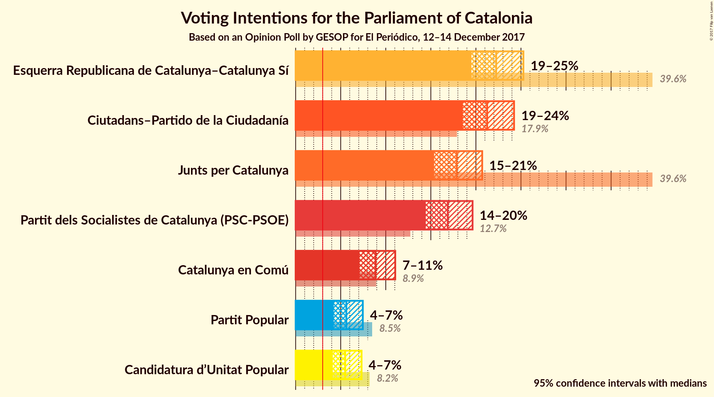
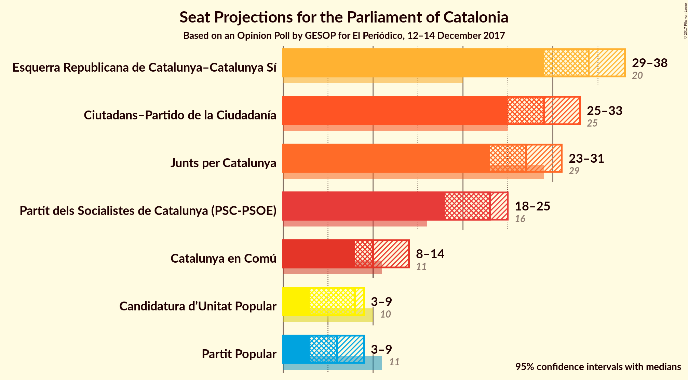
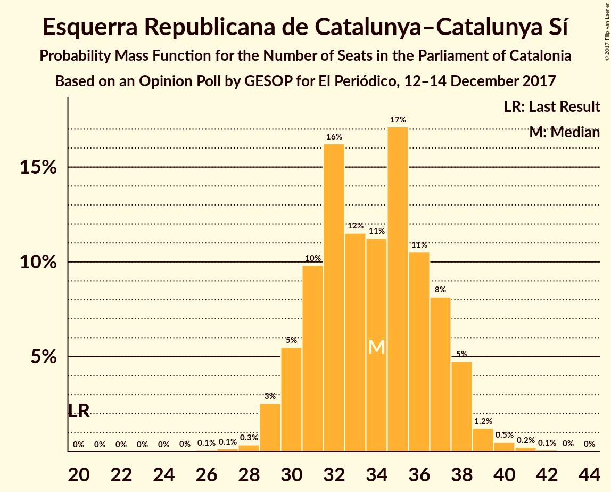
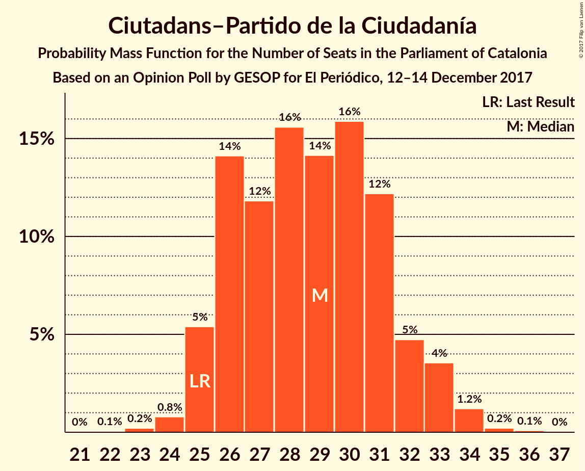
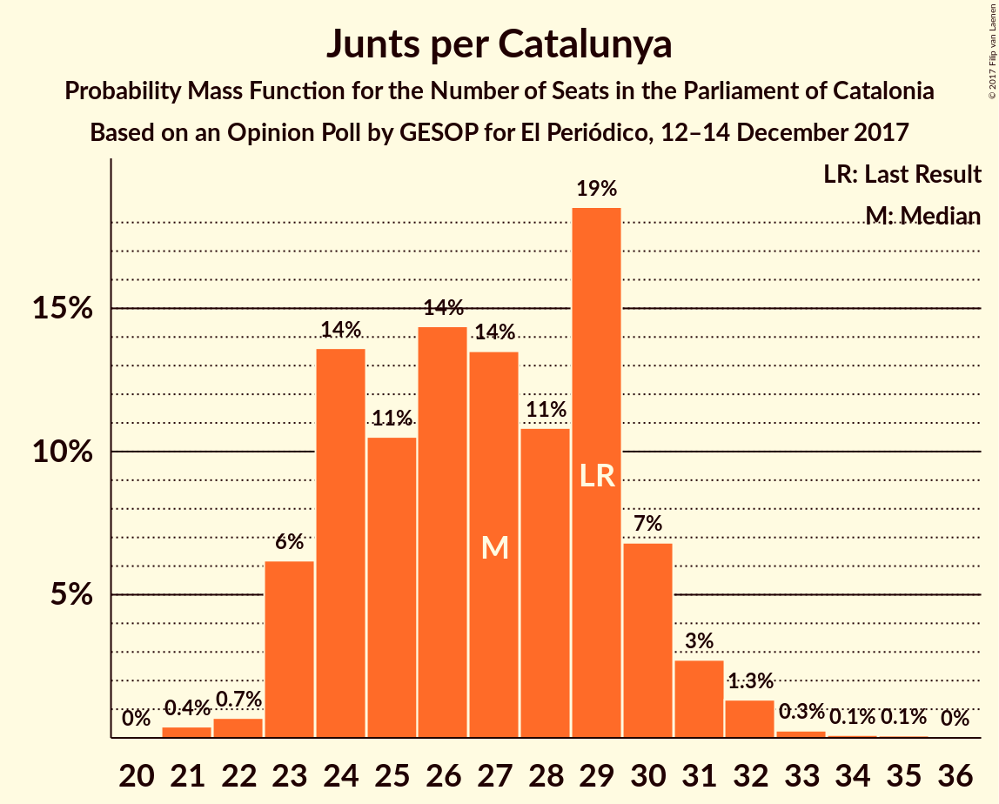
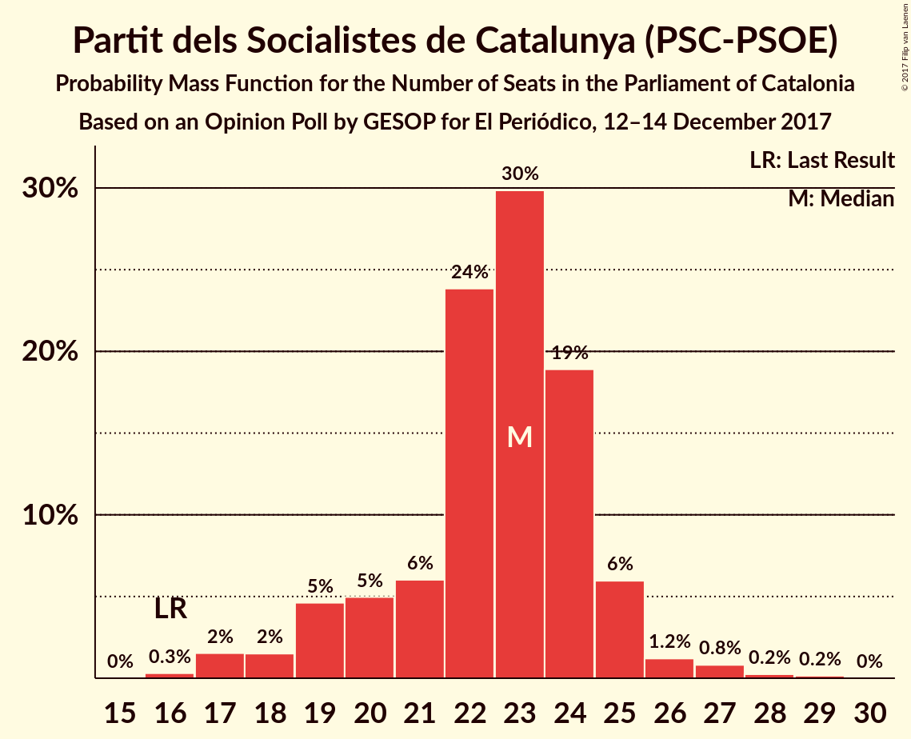
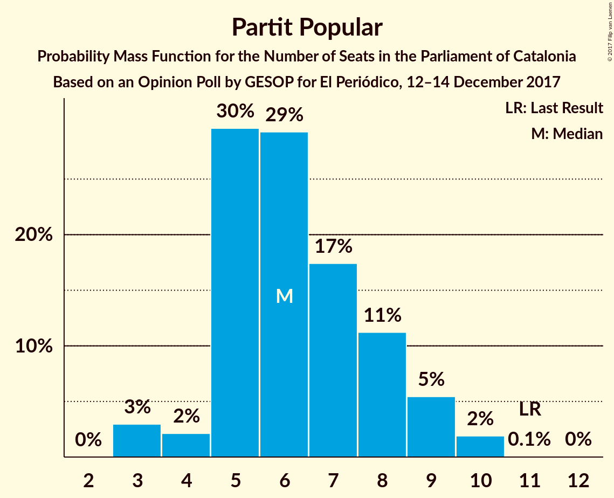
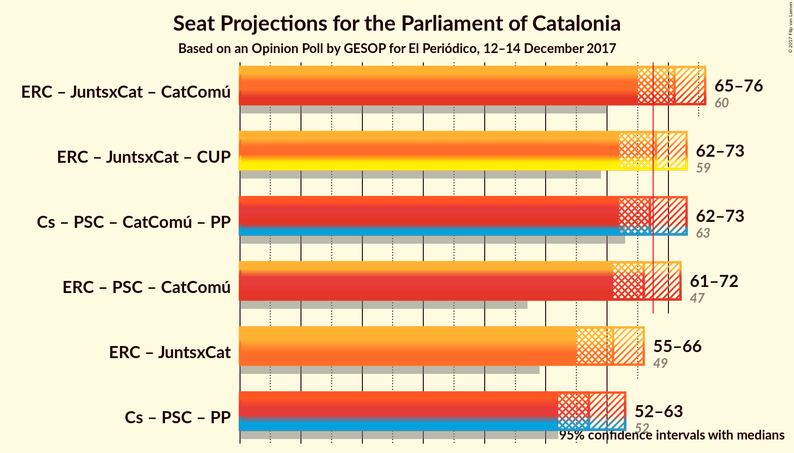

# Opinion Poll by GESOP for El Periódico, 12–14 December 2017

<a href="#voting-intentions">Voting Intentions</a> | <a href="#seats">Seats</a> | <a href="#coalitions">Coalitions</a> | <a href="#technical-information">Technical Information</a>

## Voting Intentions

### Confidence Intervals

| Party | Last Result | Poll Result | 80% Confidence Interval | 90% Confidence Interval | 95% Confidence Interval | 99% Confidence Interval |
|:-----:|:-----------:|:-----------:|:-----------------------:|:-----------------------:|:-----------------------:|:-----------------------:|
| Esquerra Republicana de Catalunya–Catalunya Sí | 39.6% | 22.2% | 20.4–24.2% |19.9–24.8% |19.5–25.3% |18.7–26.2% |
| Ciutadans–Partido de la Ciudadanía | 17.9% | 21.2% | 19.5–23.2% |19.0–23.7% |18.5–24.2% |17.7–25.2% |
| Junts per Catalunya | 39.6% | 17.9% | 16.2–19.7% |15.8–20.2% |15.4–20.7% |14.6–21.6% |
| Partit dels Socialistes de Catalunya (PSC-PSOE) | 12.7% | 16.9% | 15.3–18.7% |14.8–19.2% |14.4–19.6% |13.7–20.5% |
| Catalunya en Comú | 8.9% | 8.9% | 7.7–10.3% |7.4–10.7% |7.1–11.1% |6.6–11.8% |
| Partit Popular | 8.5% | 5.6% | 4.7–6.8% |4.5–7.1% |4.2–7.5% |3.8–8.1% |
| Candidatura d’Unitat Popular | 8.2% | 5.5% | 4.6–6.7% |4.3–7.0% |4.1–7.3% |3.7–7.9% |

*Note:* The poll result column reflects the actual value used in the calculations. Published results may vary slightly, and in addition be rounded to fewer digits.

## Seats

### Confidence Intervals

| Party | Last Result | Median | 80% Confidence Interval | 90% Confidence Interval | 95% Confidence Interval | 99% Confidence Interval |
|:-----:|:-----------:|:------:|:-----------------------:|:-----------------------:|:-----------------------:|:-----------------------:|
| <a href="#esquerra-republicana-de-catalunya–catalunya-sí">Esquerra Republicana de Catalunya–Catalunya Sí</a> | 20 | 34 | 31–37 |30–38 |29–38 |28–40 |
| <a href="#ciutadans–partido-de-la-ciudadanía">Ciutadans–Partido de la Ciudadanía</a> | 25 | 29 | 26–31 |25–32 |25–33 |24–34 |
| <a href="#junts-per-catalunya">Junts per Catalunya</a> | 29 | 27 | 24–30 |23–30 |23–31 |22–32 |
| <a href="#partit-dels-socialistes-de-catalunya-(psc-psoe)">Partit dels Socialistes de Catalunya (PSC-PSOE)</a> | 16 | 23 | 20–24 |19–25 |18–26 |17–27 |
| <a href="#catalunya-en-comú">Catalunya en Comú</a> | 11 | 10 | 8–12 |8–13 |8–14 |7–14 |
| <a href="#partit-popular">Partit Popular</a> | 11 | 6 | 5–8 |5–9 |3–9 |3–10 |
| <a href="#candidatura-d’unitat-popular">Candidatura d’Unitat Popular</a> | 10 | 8 | 5–9 |3–9 |3–9 |3–10 |

### Esquerra Republicana de Catalunya–Catalunya Sí

*For a full overview of the results for this party, see the [Esquerra Republicana de Catalunya–Catalunya Sí](party-esquerrarepublicanadecatalunya–catalunyasí.html) page.*

| Number of Seats | Probability | Accumulated | Special Marks |
|:---------------:|:-----------:|:-----------:|:-------------:|
| 20 | 0% | 100% | Last Result |
| 21 | 0% | 100% |  |
| 22 | 0% | 100% |  |
| 23 | 0% | 100% |  |
| 24 | 0% | 100% |  |
| 25 | 0% | 100% |  |
| 26 | 0.1% | 100% |  |
| 27 | 0.1% | 99.9% |  |
| 28 | 0.4% | 99.8% |  |
| 29 | 3% | 99.4% |  |
| 30 | 5% | 97% |  |
| 31 | 10% | 91% |  |
| 32 | 17% | 81% |  |
| 33 | 12% | 65% |  |
| 34 | 12% | 53% | Median |
| 35 | 16% | 41% |  |
| 36 | 10% | 25% |  |
| 37 | 7% | 15% |  |
| 38 | 5% | 7% |  |
| 39 | 1.4% | 2% |  |
| 40 | 0.4% | 0.7% |  |
| 41 | 0.2% | 0.3% |  |
| 42 | 0.1% | 0.1% |  |
| 43 | 0% | 0% |  |

### Ciutadans–Partido de la Ciudadanía

*For a full overview of the results for this party, see the [Ciutadans–Partido de la Ciudadanía](party-ciutadans–partidodelaciudadanía.html) page.*

| Number of Seats | Probability | Accumulated | Special Marks |
|:---------------:|:-----------:|:-----------:|:-------------:|
| 22 | 0% | 100% |  |
| 23 | 0.2% | 99.9% |  |
| 24 | 0.8% | 99.8% |  |
| 25 | 5% | 99.0% | Last Result |
| 26 | 16% | 94% |  |
| 27 | 10% | 78% |  |
| 28 | 15% | 68% |  |
| 29 | 14% | 53% | Median |
| 30 | 17% | 39% |  |
| 31 | 12% | 22% |  |
| 32 | 5% | 10% |  |
| 33 | 4% | 5% |  |
| 34 | 1.1% | 1.4% |  |
| 35 | 0.2% | 0.3% |  |
| 36 | 0.1% | 0.1% |  |
| 37 | 0% | 0% |  |

### Junts per Catalunya

*For a full overview of the results for this party, see the [Junts per Catalunya](party-juntspercatalunya.html) page.*

| Number of Seats | Probability | Accumulated | Special Marks |
|:---------------:|:-----------:|:-----------:|:-------------:|
| 20 | 0% | 100% |  |
| 21 | 0.4% | 99.9% |  |
| 22 | 0.7% | 99.6% |  |
| 23 | 6% | 98.9% |  |
| 24 | 15% | 93% |  |
| 25 | 10% | 78% |  |
| 26 | 14% | 68% |  |
| 27 | 13% | 54% | Median |
| 28 | 12% | 42% |  |
| 29 | 18% | 29% | Last Result |
| 30 | 7% | 11% |  |
| 31 | 3% | 4% |  |
| 32 | 1.2% | 2% |  |
| 33 | 0.2% | 0.4% |  |
| 34 | 0.1% | 0.2% |  |
| 35 | 0.1% | 0.1% |  |
| 36 | 0% | 0% |  |

### Partit dels Socialistes de Catalunya (PSC-PSOE)

*For a full overview of the results for this party, see the [Partit dels Socialistes de Catalunya (PSC-PSOE)](party-partitdelssocialistesdecatalunyapsc-psoe.html) page.*

| Number of Seats | Probability | Accumulated | Special Marks |
|:---------------:|:-----------:|:-----------:|:-------------:|
| 16 | 0.3% | 100% | Last Result |
| 17 | 2% | 99.7% |  |
| 18 | 1.3% | 98% |  |
| 19 | 4% | 97% |  |
| 20 | 6% | 93% |  |
| 21 | 5% | 87% |  |
| 22 | 24% | 82% |  |
| 23 | 30% | 58% | Median |
| 24 | 20% | 28% |  |
| 25 | 6% | 9% |  |
| 26 | 1.2% | 3% |  |
| 27 | 0.9% | 1.3% |  |
| 28 | 0.2% | 0.4% |  |
| 29 | 0.2% | 0.2% |  |
| 30 | 0% | 0% |  |

### Catalunya en Comú

*For a full overview of the results for this party, see the [Catalunya en Comú](party-catalunyaencomú.html) page.*

| Number of Seats | Probability | Accumulated | Special Marks |
|:---------------:|:-----------:|:-----------:|:-------------:|
| 6 | 0.5% | 100% |  |
| 7 | 1.0% | 99.5% |  |
| 8 | 13% | 98.5% |  |
| 9 | 30% | 85% |  |
| 10 | 10% | 55% | Median |
| 11 | 26% | 45% | Last Result |
| 12 | 13% | 19% |  |
| 13 | 3% | 6% |  |
| 14 | 3% | 3% |  |
| 15 | 0.3% | 0.4% |  |
| 16 | 0% | 0.1% |  |
| 17 | 0% | 0% |  |

### Partit Popular

*For a full overview of the results for this party, see the [Partit Popular](party-partitpopular.html) page.*

| Number of Seats | Probability | Accumulated | Special Marks |
|:---------------:|:-----------:|:-----------:|:-------------:|
| 3 | 3% | 100% |  |
| 4 | 2% | 97% |  |
| 5 | 30% | 95% |  |
| 6 | 30% | 66% | Median |
| 7 | 17% | 36% |  |
| 8 | 11% | 19% |  |
| 9 | 5% | 7% |  |
| 10 | 2% | 2% |  |
| 11 | 0.1% | 0.1% | Last Result |
| 12 | 0% | 0% |  |

### Candidatura d’Unitat Popular

*For a full overview of the results for this party, see the [Candidatura d’Unitat Popular](party-candidaturad’unitatpopular.html) page.*

| Number of Seats | Probability | Accumulated | Special Marks |
|:---------------:|:-----------:|:-----------:|:-------------:|
| 2 | 0.1% | 100% |  |
| 3 | 7% | 99.9% |  |
| 4 | 3% | 93% |  |
| 5 | 17% | 90% |  |
| 6 | 7% | 73% |  |
| 7 | 14% | 66% |  |
| 8 | 41% | 51% | Median |
| 9 | 9% | 10% |  |
| 10 | 0.7% | 0.7% | Last Result |
| 11 | 0% | 0% |  |

## Coalitions

### Confidence Intervals

| Coalition | Last Result | Median | Majority? | 80% Confidence Interval | 90% Confidence Interval | 95% Confidence Interval | 99% Confidence Interval |
|:---------:|:-----------:|:------:|:---------:|:-----------------------:|:-----------------------:|:-----------------------:|:-----------------------:|
| Esquerra Republicana de Catalunya–Catalunya Sí – Junts per Catalunya – Catalunya en Comú | 60 | 71 | 88% | 67–75 | 66–76 | 65–76 | 64–78 |
| Esquerra Republicana de Catalunya–Catalunya Sí – Junts per Catalunya – Candidatura d’Unitat Popular | 59 | 67 | 49% | 64–71 | 63–72 | 62–73 | 60–75 |
| Ciutadans–Partido de la Ciudadanía – Partit dels Socialistes de Catalunya (PSC-PSOE) – Catalunya en Comú – Partit Popular | 63 | 68 | 51% | 64–71 | 63–72 | 62–73 | 60–75 |
| Esquerra Republicana de Catalunya–Catalunya Sí – Partit dels Socialistes de Catalunya (PSC-PSOE) – Catalunya en Comú | 47 | 66 | 37% | 63–70 | 62–71 | 61–72 | 59–73 |
| Esquerra Republicana de Catalunya–Catalunya Sí – Junts per Catalunya | 49 | 61 | 0.8% | 57–64 | 56–65 | 55–66 | 54–68 |
| Ciutadans–Partido de la Ciudadanía – Partit dels Socialistes de Catalunya (PSC-PSOE) – Partit Popular | 52 | 57 | 0% | 54–61 | 53–62 | 52–63 | 50–64 |

### Esquerra Republicana de Catalunya–Catalunya Sí – Junts per Catalunya – Catalunya en Comú

| Number of Seats | Probability | Accumulated | Special Marks |
|:---------------:|:-----------:|:-----------:|:-------------:|
| 60 | 0% | 100% | Last Result |
| 61 | 0% | 100% |  |
| 62 | 0.1% | 100% |  |
| 63 | 0.2% | 99.9% |  |
| 64 | 0.8% | 99.7% |  |
| 65 | 2% | 98.9% |  |
| 66 | 4% | 97% |  |
| 67 | 5% | 93% |  |
| 68 | 10% | 88% | Majority |
| 69 | 12% | 78% |  |
| 70 | 15% | 67% |  |
| 71 | 15% | 51% | Median |
| 72 | 11% | 36% |  |
| 73 | 10% | 26% |  |
| 74 | 6% | 16% |  |
| 75 | 5% | 10% |  |
| 76 | 3% | 6% |  |
| 77 | 1.4% | 2% |  |
| 78 | 0.5% | 0.9% |  |
| 79 | 0.2% | 0.3% |  |
| 80 | 0.1% | 0.1% |  |
| 81 | 0% | 0% |  |

### Esquerra Republicana de Catalunya–Catalunya Sí – Junts per Catalunya – Candidatura d’Unitat Popular

| Number of Seats | Probability | Accumulated | Special Marks |
|:---------------:|:-----------:|:-----------:|:-------------:|
| 58 | 0.1% | 100% |  |
| 59 | 0.2% | 99.9% | Last Result |
| 60 | 0.3% | 99.8% |  |
| 61 | 1.0% | 99.5% |  |
| 62 | 2% | 98% |  |
| 63 | 5% | 96% |  |
| 64 | 8% | 91% |  |
| 65 | 8% | 84% |  |
| 66 | 10% | 76% |  |
| 67 | 16% | 65% |  |
| 68 | 13% | 49% | Majority |
| 69 | 15% | 36% | Median |
| 70 | 10% | 22% |  |
| 71 | 5% | 12% |  |
| 72 | 4% | 7% |  |
| 73 | 2% | 3% |  |
| 74 | 0.8% | 2% |  |
| 75 | 0.6% | 0.8% |  |
| 76 | 0.2% | 0.2% |  |
| 77 | 0% | 0% |  |

### Ciutadans–Partido de la Ciudadanía – Partit dels Socialistes de Catalunya (PSC-PSOE) – Catalunya en Comú – Partit Popular

| Number of Seats | Probability | Accumulated | Special Marks |
|:---------------:|:-----------:|:-----------:|:-------------:|
| 59 | 0.2% | 100% |  |
| 60 | 0.6% | 99.8% |  |
| 61 | 0.8% | 99.2% |  |
| 62 | 2% | 98% |  |
| 63 | 4% | 97% | Last Result |
| 64 | 5% | 93% |  |
| 65 | 10% | 88% |  |
| 66 | 15% | 78% |  |
| 67 | 13% | 64% |  |
| 68 | 16% | 51% | Median, Majority |
| 69 | 10% | 35% |  |
| 70 | 8% | 24% |  |
| 71 | 8% | 16% |  |
| 72 | 5% | 9% |  |
| 73 | 2% | 4% |  |
| 74 | 1.0% | 2% |  |
| 75 | 0.3% | 0.5% |  |
| 76 | 0.2% | 0.2% |  |
| 77 | 0.1% | 0.1% |  |
| 78 | 0% | 0% |  |

### Esquerra Republicana de Catalunya–Catalunya Sí – Partit dels Socialistes de Catalunya (PSC-PSOE) – Catalunya en Comú

| Number of Seats | Probability | Accumulated | Special Marks |
|:---------------:|:-----------:|:-----------:|:-------------:|
| 47 | 0% | 100% | Last Result |
| 48 | 0% | 100% |  |
| 49 | 0% | 100% |  |
| 50 | 0% | 100% |  |
| 51 | 0% | 100% |  |
| 52 | 0% | 100% |  |
| 53 | 0% | 100% |  |
| 54 | 0% | 100% |  |
| 55 | 0% | 100% |  |
| 56 | 0% | 100% |  |
| 57 | 0.1% | 100% |  |
| 58 | 0.2% | 99.9% |  |
| 59 | 0.6% | 99.7% |  |
| 60 | 0.8% | 99.1% |  |
| 61 | 2% | 98% |  |
| 62 | 4% | 96% |  |
| 63 | 8% | 92% |  |
| 64 | 11% | 84% |  |
| 65 | 13% | 73% |  |
| 66 | 12% | 61% |  |
| 67 | 12% | 49% | Median |
| 68 | 10% | 37% | Majority |
| 69 | 12% | 27% |  |
| 70 | 8% | 15% |  |
| 71 | 4% | 7% |  |
| 72 | 2% | 4% |  |
| 73 | 0.9% | 1.4% |  |
| 74 | 0.3% | 0.5% |  |
| 75 | 0.1% | 0.2% |  |
| 76 | 0.1% | 0.1% |  |
| 77 | 0% | 0% |  |

### Esquerra Republicana de Catalunya–Catalunya Sí – Junts per Catalunya

| Number of Seats | Probability | Accumulated | Special Marks |
|:---------------:|:-----------:|:-----------:|:-------------:|
| 49 | 0% | 100% | Last Result |
| 50 | 0% | 100% |  |
| 51 | 0% | 100% |  |
| 52 | 0% | 100% |  |
| 53 | 0.3% | 99.9% |  |
| 54 | 0.9% | 99.6% |  |
| 55 | 3% | 98.7% |  |
| 56 | 3% | 96% |  |
| 57 | 6% | 93% |  |
| 58 | 7% | 87% |  |
| 59 | 15% | 80% |  |
| 60 | 14% | 65% |  |
| 61 | 16% | 51% | Median |
| 62 | 12% | 34% |  |
| 63 | 8% | 22% |  |
| 64 | 6% | 15% |  |
| 65 | 5% | 9% |  |
| 66 | 2% | 4% |  |
| 67 | 1.4% | 2% |  |
| 68 | 0.5% | 0.8% | Majority |
| 69 | 0.1% | 0.2% |  |
| 70 | 0.1% | 0.1% |  |
| 71 | 0% | 0% |  |

### Ciutadans–Partido de la Ciudadanía – Partit dels Socialistes de Catalunya (PSC-PSOE) – Partit Popular

| Number of Seats | Probability | Accumulated | Special Marks |
|:---------------:|:-----------:|:-----------:|:-------------:|
| 48 | 0.1% | 100% |  |
| 49 | 0.2% | 99.9% |  |
| 50 | 0.5% | 99.7% |  |
| 51 | 0.9% | 99.3% |  |
| 52 | 2% | 98% | Last Result |
| 53 | 4% | 97% |  |
| 54 | 7% | 93% |  |
| 55 | 10% | 86% |  |
| 56 | 12% | 76% |  |
| 57 | 14% | 64% |  |
| 58 | 13% | 50% | Median |
| 59 | 13% | 37% |  |
| 60 | 11% | 23% |  |
| 61 | 6% | 13% |  |
| 62 | 4% | 7% |  |
| 63 | 1.4% | 3% |  |
| 64 | 0.8% | 1.2% |  |
| 65 | 0.3% | 0.5% |  |
| 66 | 0.1% | 0.1% |  |
| 67 | 0% | 0% |  |

## Technical Information

### Opinion Poll

+ **Polling firm:** GESOP
+ **Commissioner(s):** El Periódico
+ **Fieldwork period:** 12–14 December 2017

### Calculations

+ **Sample size:** 800
+ **Simulations done:** 1,048,576
+ **Error estimate:** 1.25%

