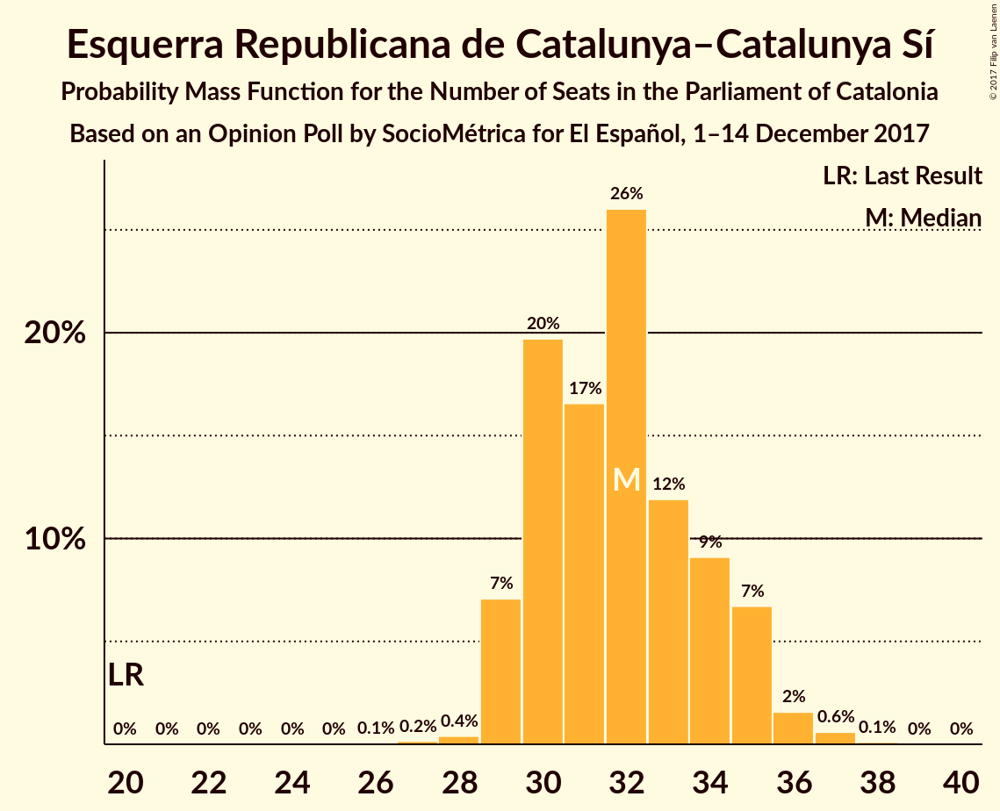
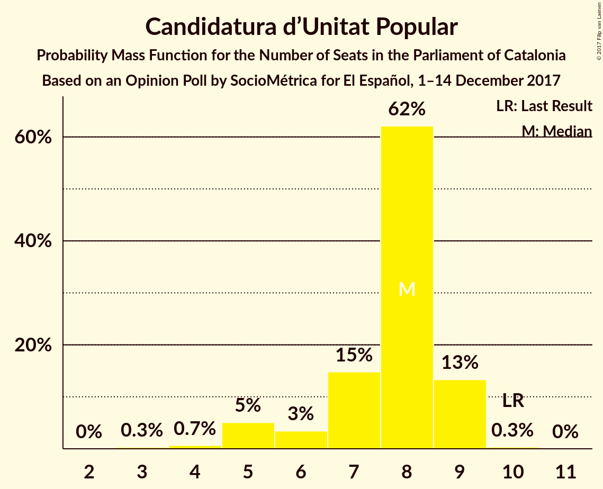

# Opinion Poll by SocioMétrica for El Español, 1–14 December 2017

<a href="#voting-intentions">Voting Intentions</a> | <a href="#seats">Seats</a> | <a href="#coalitions">Coalitions</a> | <a href="#technical-information">Technical Information</a>

## Voting Intentions

### Confidence Intervals

| Party | Last Result | Poll Result | 80% Confidence Interval | 90% Confidence Interval | 95% Confidence Interval | 99% Confidence Interval |
|:-----:|:-----------:|:-----------:|:-----------------------:|:-----------------------:|:-----------------------:|:-----------------------:|
| Ciutadans–Partido de la Ciudadanía | 17.9% | 22.9% | 21.6–24.4% |21.2–24.8% |20.9–25.1% |20.2–25.8% |
| Esquerra Republicana de Catalunya–Catalunya Sí | 39.6% | 21.1% | 19.8–22.5% |19.4–22.9% |19.1–23.3% |18.5–24.0% |
| Junts per Catalunya | 39.6% | 20.3% | 19.0–21.7% |18.7–22.1% |18.4–22.5% |17.8–23.1% |
| Partit dels Socialistes de Catalunya (PSC-PSOE) | 12.7% | 13.9% | 12.8–15.2% |12.5–15.5% |12.3–15.8% |11.8–16.4% |
| Catalunya en Comú | 8.9% | 9.0% | 8.1–10.0% |7.9–10.3% |7.7–10.6% |7.2–11.1% |
| Candidatura d’Unitat Popular | 8.2% | 5.9% | 5.2–6.8% |5.0–7.0% |4.8–7.3% |4.5–7.7% |
| Partit Popular | 8.5% | 5.5% | 4.8–6.4% |4.6–6.6% |4.5–6.8% |4.2–7.2% |

*Note:* The poll result column reflects the actual value used in the calculations. Published results may vary slightly, and in addition be rounded to fewer digits.

## Seats

### Confidence Intervals

| Party | Last Result | Median | 80% Confidence Interval | 90% Confidence Interval | 95% Confidence Interval | 99% Confidence Interval |
|:-----:|:-----------:|:------:|:-----------------------:|:-----------------------:|:-----------------------:|:-----------------------:|
| <a href="#ciutadans–partido-de-la-ciudadanía">Ciutadans–Partido de la Ciudadanía</a> | 25 | 31 | 29–33 |28–34 |27–34 |27–35 |
| <a href="#esquerra-republicana-de-catalunya–catalunya-sí">Esquerra Republicana de Catalunya–Catalunya Sí</a> | 20 | 32 | 30–34 |29–35 |29–35 |29–36 |
| <a href="#junts-per-catalunya">Junts per Catalunya</a> | 29 | 30 | 29–33 |29–33 |28–34 |26–35 |
| <a href="#partit-dels-socialistes-de-catalunya-(psc-psoe)">Partit dels Socialistes de Catalunya (PSC-PSOE)</a> | 16 | 17 | 16–20 |16–21 |15–22 |15–22 |
| <a href="#catalunya-en-comú">Catalunya en Comú</a> | 11 | 10 | 9–12 |9–12 |8–13 |8–14 |
| <a href="#candidatura-d’unitat-popular">Candidatura d’Unitat Popular</a> | 10 | 8 | 7–9 |5–9 |5–9 |4–9 |
| <a href="#partit-popular">Partit Popular</a> | 11 | 6 | 5–7 |5–8 |5–8 |3–9 |

### Ciutadans–Partido de la Ciudadanía

*For a full overview of the results for this party, see the [Ciutadans–Partido de la Ciudadanía](party-ciutadans–partidodelaciudadanía.html) page.*

| Number of Seats | Probability | Accumulated | Special Marks |
|:---------------:|:-----------:|:-----------:|:-------------:|
| 25 | 0% | 100% | Last Result |
| 26 | 0.5% | 100% |  |
| 27 | 2% | 99.5% |  |
| 28 | 3% | 97% |  |
| 29 | 5% | 94% |  |
| 30 | 19% | 89% |  |
| 31 | 29% | 70% | Median |
| 32 | 14% | 41% |  |
| 33 | 19% | 27% |  |
| 34 | 6% | 7% |  |
| 35 | 0.9% | 1.1% |  |
| 36 | 0.2% | 0.3% |  |
| 37 | 0% | 0% |  |

### Esquerra Republicana de Catalunya–Catalunya Sí

*For a full overview of the results for this party, see the [Esquerra Republicana de Catalunya–Catalunya Sí](party-esquerrarepublicanadecatalunya–catalunyasí.html) page.*

| Number of Seats | Probability | Accumulated | Special Marks |
|:---------------:|:-----------:|:-----------:|:-------------:|
| 20 | 0% | 100% | Last Result |
| 21 | 0% | 100% |  |
| 22 | 0% | 100% |  |
| 23 | 0% | 100% |  |
| 24 | 0% | 100% |  |
| 25 | 0% | 100% |  |
| 26 | 0.1% | 100% |  |
| 27 | 0.1% | 99.9% |  |
| 28 | 0.3% | 99.8% |  |
| 29 | 7% | 99.5% |  |
| 30 | 19% | 92% |  |
| 31 | 20% | 74% |  |
| 32 | 28% | 54% | Median |
| 33 | 13% | 26% |  |
| 34 | 6% | 13% |  |
| 35 | 5% | 7% |  |
| 36 | 1.2% | 2% |  |
| 37 | 0.3% | 0.4% |  |
| 38 | 0.1% | 0.1% |  |
| 39 | 0% | 0% |  |

### Junts per Catalunya

*For a full overview of the results for this party, see the [Junts per Catalunya](party-juntspercatalunya.html) page.*

| Number of Seats | Probability | Accumulated | Special Marks |
|:---------------:|:-----------:|:-----------:|:-------------:|
| 25 | 0.2% | 100% |  |
| 26 | 0.6% | 99.8% |  |
| 27 | 1.3% | 99.3% |  |
| 28 | 2% | 98% |  |
| 29 | 24% | 95% | Last Result |
| 30 | 26% | 71% | Median |
| 31 | 15% | 45% |  |
| 32 | 16% | 29% |  |
| 33 | 8% | 13% |  |
| 34 | 2% | 4% |  |
| 35 | 2% | 2% |  |
| 36 | 0.2% | 0.3% |  |
| 37 | 0.1% | 0.1% |  |
| 38 | 0% | 0% |  |

### Partit dels Socialistes de Catalunya (PSC-PSOE)

*For a full overview of the results for this party, see the [Partit dels Socialistes de Catalunya (PSC-PSOE)](party-partitdelssocialistesdecatalunyapsc-psoe.html) page.*

| Number of Seats | Probability | Accumulated | Special Marks |
|:---------------:|:-----------:|:-----------:|:-------------:|
| 14 | 0.2% | 100% |  |
| 15 | 4% | 99.8% |  |
| 16 | 29% | 96% | Last Result |
| 17 | 28% | 66% | Median |
| 18 | 15% | 38% |  |
| 19 | 11% | 23% |  |
| 20 | 6% | 12% |  |
| 21 | 3% | 5% |  |
| 22 | 2% | 3% |  |
| 23 | 0.1% | 0.1% |  |
| 24 | 0% | 0% |  |

### Catalunya en Comú

*For a full overview of the results for this party, see the [Catalunya en Comú](party-catalunyaencomú.html) page.*

| Number of Seats | Probability | Accumulated | Special Marks |
|:---------------:|:-----------:|:-----------:|:-------------:|
| 7 | 0.1% | 100% |  |
| 8 | 5% | 99.9% |  |
| 9 | 34% | 95% |  |
| 10 | 14% | 61% | Median |
| 11 | 34% | 48% | Last Result |
| 12 | 11% | 14% |  |
| 13 | 3% | 3% |  |
| 14 | 0.7% | 0.7% |  |
| 15 | 0% | 0% |  |

### Candidatura d’Unitat Popular

*For a full overview of the results for this party, see the [Candidatura d’Unitat Popular](party-candidaturad’unitatpopular.html) page.*

| Number of Seats | Probability | Accumulated | Special Marks |
|:---------------:|:-----------:|:-----------:|:-------------:|
| 3 | 0.2% | 100% |  |
| 4 | 0.5% | 99.8% |  |
| 5 | 5% | 99.3% |  |
| 6 | 3% | 94% |  |
| 7 | 13% | 91% |  |
| 8 | 65% | 78% | Median |
| 9 | 13% | 14% |  |
| 10 | 0.3% | 0.3% | Last Result |
| 11 | 0% | 0% |  |

### Partit Popular

*For a full overview of the results for this party, see the [Partit Popular](party-partitpopular.html) page.*

| Number of Seats | Probability | Accumulated | Special Marks |
|:---------------:|:-----------:|:-----------:|:-------------:|
| 3 | 1.0% | 100% |  |
| 4 | 1.0% | 99.0% |  |
| 5 | 25% | 98% |  |
| 6 | 43% | 73% | Median |
| 7 | 24% | 30% |  |
| 8 | 4% | 5% |  |
| 9 | 0.8% | 1.0% |  |
| 10 | 0.2% | 0.2% |  |
| 11 | 0% | 0% | Last Result |

## Coalitions

### Confidence Intervals

| Coalition | Last Result | Median | Majority? | 80% Confidence Interval | 90% Confidence Interval | 95% Confidence Interval | 99% Confidence Interval |
|:---------:|:-----------:|:------:|:---------:|:-----------------------:|:-----------------------:|:-----------------------:|:-----------------------:|
| Esquerra Republicana de Catalunya–Catalunya Sí – Junts per Catalunya – Catalunya en Comú | 60 | 72 | 99.6% | 70–75 | 69–76 | 69–77 | 68–78 |
| Esquerra Republicana de Catalunya–Catalunya Sí – Junts per Catalunya – Candidatura d’Unitat Popular | 59 | 70 | 92% | 68–72 | 67–73 | 66–74 | 65–75 |
| Ciutadans–Partido de la Ciudadanía – Partit dels Socialistes de Catalunya (PSC-PSOE) – Catalunya en Comú – Partit Popular | 63 | 65 | 8% | 63–67 | 62–68 | 61–69 | 60–70 |
| Esquerra Republicana de Catalunya–Catalunya Sí – Junts per Catalunya | 49 | 62 | 0.7% | 60–65 | 59–66 | 59–66 | 58–68 |
| Esquerra Republicana de Catalunya–Catalunya Sí – Partit dels Socialistes de Catalunya (PSC-PSOE) – Catalunya en Comú | 47 | 59 | 0% | 57–62 | 56–63 | 56–64 | 55–65 |
| Ciutadans–Partido de la Ciudadanía – Partit dels Socialistes de Catalunya (PSC-PSOE) – Partit Popular | 52 | 55 | 0% | 52–57 | 51–58 | 51–59 | 49–60 |

### Esquerra Republicana de Catalunya–Catalunya Sí – Junts per Catalunya – Catalunya en Comú

| Number of Seats | Probability | Accumulated | Special Marks |
|:---------------:|:-----------:|:-----------:|:-------------:|
| 60 | 0% | 100% | Last Result |
| 61 | 0% | 100% |  |
| 62 | 0% | 100% |  |
| 63 | 0% | 100% |  |
| 64 | 0% | 100% |  |
| 65 | 0% | 100% |  |
| 66 | 0.1% | 100% |  |
| 67 | 0.2% | 99.9% |  |
| 68 | 0.8% | 99.6% | Majority |
| 69 | 5% | 98.8% |  |
| 70 | 11% | 94% |  |
| 71 | 16% | 83% |  |
| 72 | 20% | 67% | Median |
| 73 | 17% | 47% |  |
| 74 | 14% | 30% |  |
| 75 | 9% | 16% |  |
| 76 | 4% | 7% |  |
| 77 | 2% | 3% |  |
| 78 | 0.7% | 1.0% |  |
| 79 | 0.2% | 0.3% |  |
| 80 | 0.1% | 0.1% |  |
| 81 | 0% | 0% |  |

### Esquerra Republicana de Catalunya–Catalunya Sí – Junts per Catalunya – Candidatura d’Unitat Popular

| Number of Seats | Probability | Accumulated | Special Marks |
|:---------------:|:-----------:|:-----------:|:-------------:|
| 59 | 0% | 100% | Last Result |
| 60 | 0% | 100% |  |
| 61 | 0% | 100% |  |
| 62 | 0% | 100% |  |
| 63 | 0.1% | 100% |  |
| 64 | 0.3% | 99.9% |  |
| 65 | 0.7% | 99.5% |  |
| 66 | 3% | 98.8% |  |
| 67 | 4% | 96% |  |
| 68 | 14% | 92% | Majority |
| 69 | 21% | 78% |  |
| 70 | 18% | 58% | Median |
| 71 | 16% | 40% |  |
| 72 | 14% | 24% |  |
| 73 | 5% | 9% |  |
| 74 | 2% | 4% |  |
| 75 | 2% | 2% |  |
| 76 | 0.4% | 0.5% |  |
| 77 | 0.1% | 0.1% |  |
| 78 | 0% | 0% |  |

### Ciutadans–Partido de la Ciudadanía – Partit dels Socialistes de Catalunya (PSC-PSOE) – Catalunya en Comú – Partit Popular

| Number of Seats | Probability | Accumulated | Special Marks |
|:---------------:|:-----------:|:-----------:|:-------------:|
| 58 | 0.1% | 100% |  |
| 59 | 0.4% | 99.9% |  |
| 60 | 2% | 99.5% |  |
| 61 | 2% | 98% |  |
| 62 | 5% | 96% |  |
| 63 | 14% | 91% | Last Result |
| 64 | 16% | 76% | Median |
| 65 | 18% | 60% |  |
| 66 | 21% | 42% |  |
| 67 | 14% | 22% |  |
| 68 | 4% | 8% | Majority |
| 69 | 3% | 4% |  |
| 70 | 0.7% | 1.2% |  |
| 71 | 0.3% | 0.5% |  |
| 72 | 0.1% | 0.1% |  |
| 73 | 0% | 0% |  |

### Esquerra Republicana de Catalunya–Catalunya Sí – Junts per Catalunya

| Number of Seats | Probability | Accumulated | Special Marks |
|:---------------:|:-----------:|:-----------:|:-------------:|
| 49 | 0% | 100% | Last Result |
| 50 | 0% | 100% |  |
| 51 | 0% | 100% |  |
| 52 | 0% | 100% |  |
| 53 | 0% | 100% |  |
| 54 | 0% | 100% |  |
| 55 | 0% | 100% |  |
| 56 | 0.1% | 100% |  |
| 57 | 0.3% | 99.9% |  |
| 58 | 1.3% | 99.5% |  |
| 59 | 3% | 98% |  |
| 60 | 11% | 95% |  |
| 61 | 23% | 84% |  |
| 62 | 17% | 60% | Median |
| 63 | 18% | 43% |  |
| 64 | 13% | 25% |  |
| 65 | 6% | 12% |  |
| 66 | 3% | 5% |  |
| 67 | 2% | 2% |  |
| 68 | 0.5% | 0.7% | Majority |
| 69 | 0.1% | 0.2% |  |
| 70 | 0% | 0.1% |  |
| 71 | 0% | 0% |  |

### Esquerra Republicana de Catalunya–Catalunya Sí – Partit dels Socialistes de Catalunya (PSC-PSOE) – Catalunya en Comú

| Number of Seats | Probability | Accumulated | Special Marks |
|:---------------:|:-----------:|:-----------:|:-------------:|
| 47 | 0% | 100% | Last Result |
| 48 | 0% | 100% |  |
| 49 | 0% | 100% |  |
| 50 | 0% | 100% |  |
| 51 | 0% | 100% |  |
| 52 | 0% | 100% |  |
| 53 | 0% | 100% |  |
| 54 | 0.2% | 100% |  |
| 55 | 0.8% | 99.8% |  |
| 56 | 6% | 99.0% |  |
| 57 | 14% | 93% |  |
| 58 | 16% | 79% |  |
| 59 | 21% | 63% | Median |
| 60 | 14% | 42% |  |
| 61 | 12% | 28% |  |
| 62 | 8% | 16% |  |
| 63 | 5% | 8% |  |
| 64 | 2% | 3% |  |
| 65 | 0.9% | 1.2% |  |
| 66 | 0.2% | 0.3% |  |
| 67 | 0.1% | 0.1% |  |
| 68 | 0% | 0% | Majority |

### Ciutadans–Partido de la Ciudadanía – Partit dels Socialistes de Catalunya (PSC-PSOE) – Partit Popular

| Number of Seats | Probability | Accumulated | Special Marks |
|:---------------:|:-----------:|:-----------:|:-------------:|
| 48 | 0.2% | 100% |  |
| 49 | 0.5% | 99.8% |  |
| 50 | 1.4% | 99.3% |  |
| 51 | 3% | 98% |  |
| 52 | 8% | 95% | Last Result |
| 53 | 13% | 87% |  |
| 54 | 18% | 73% | Median |
| 55 | 19% | 56% |  |
| 56 | 17% | 36% |  |
| 57 | 11% | 19% |  |
| 58 | 6% | 9% |  |
| 59 | 2% | 3% |  |
| 60 | 0.7% | 1.0% |  |
| 61 | 0.3% | 0.4% |  |
| 62 | 0% | 0% |  |

## Technical Information

### Opinion Poll

+ **Polling firm:** SocioMétrica
+ **Commissioner(s):** El Español
+ **Fieldwork period:** 1–14 December 2017

### Calculations

+ **Sample size:** 1500
+ **Simulations done:** 1,048,576
+ **Error estimate:** 0.88%

