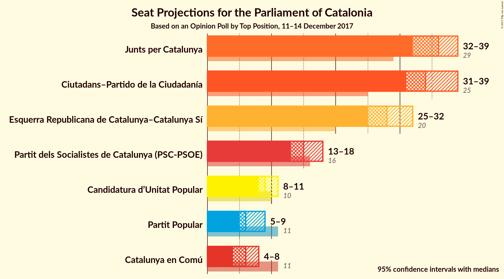
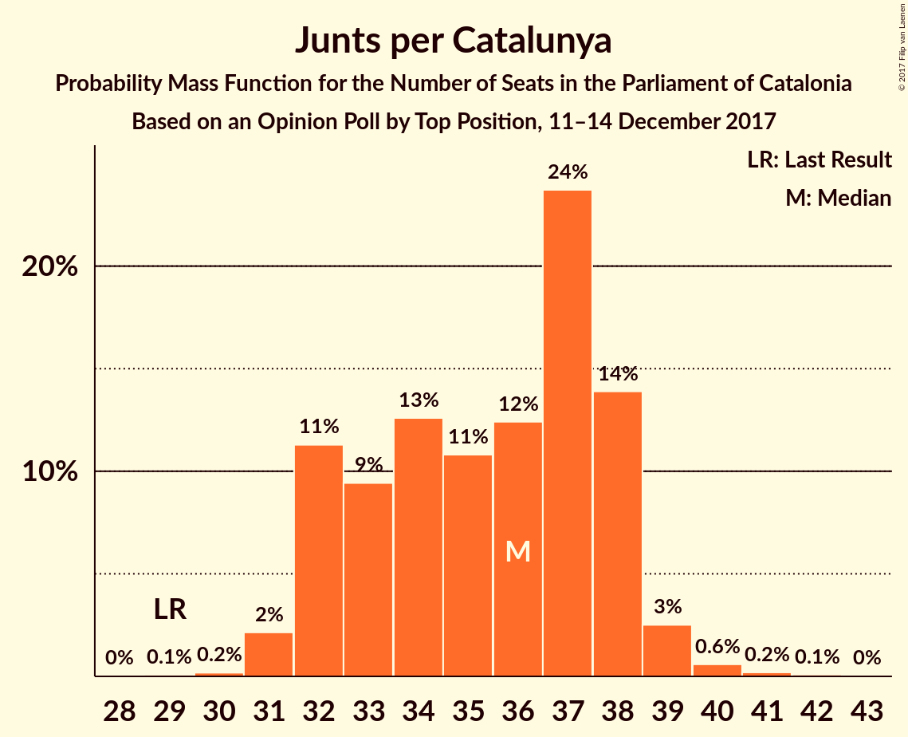
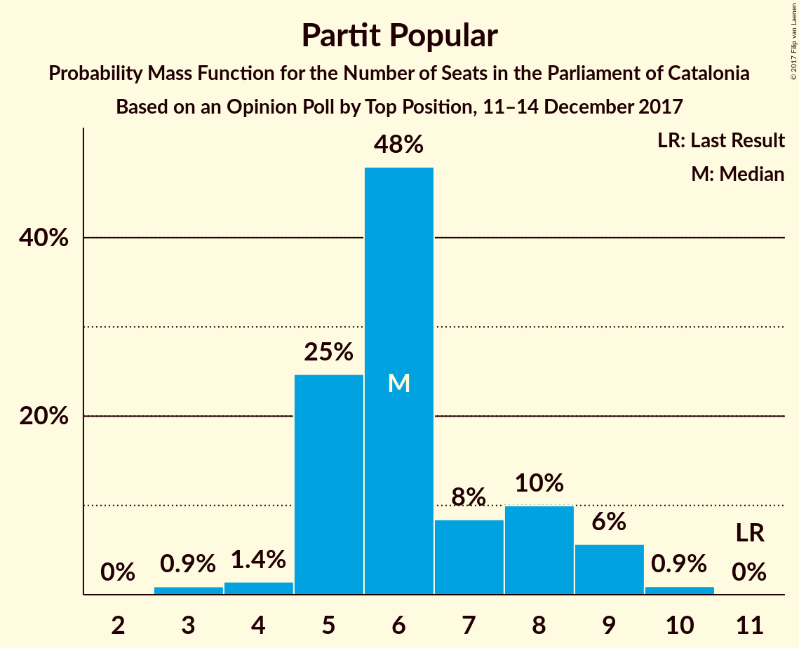

# Opinion Poll by Top Position for Commissioners, 11–14 December 2017

<a href="#voting-intentions">Voting Intentions</a> | <a href="#seats">Seats</a> | <a href="#coalitions">Coalitions</a> | <a href="#technical-information">Technical Information</a>

## Voting Intentions

### Confidence Intervals

| Party | Last Result | Poll Result | 80% Confidence Interval | 90% Confidence Interval | 95% Confidence Interval | 99% Confidence Interval |
|:-----:|:-----------:|:-----------:|:-----------------------:|:-----------------------:|:-----------------------:|:-----------------------:|
| Ciutadans–Partido de la Ciudadanía | 17.9% | 24.5% | 23.0–26.2% |22.5–26.6% |22.1–27.0% |21.4–27.8% |
| Junts per Catalunya | 39.6% | 22.4% | 20.9–24.0% |20.5–24.5% |20.1–24.9% |19.4–25.7% |
| Esquerra Republicana de Catalunya–Catalunya Sí | 39.6% | 18.2% | 16.8–19.7% |16.4–20.1% |16.1–20.5% |15.4–21.2% |
| Partit dels Socialistes de Catalunya (PSC-PSOE) | 12.7% | 11.7% | 10.5–12.9% |10.2–13.3% |10.0–13.6% |9.4–14.3% |
| Candidatura d’Unitat Popular | 8.2% | 7.0% | 6.1–8.0% |5.9–8.3% |5.7–8.6% |5.3–9.1% |
| Catalunya en Comú | 8.9% | 5.9% | 5.1–6.9% |4.9–7.2% |4.7–7.4% |4.4–7.9% |
| Partit Popular | 8.5% | 5.5% | 4.7–6.4% |4.5–6.7% |4.3–7.0% |4.0–7.4% |

*Note:* The poll result column reflects the actual value used in the calculations. Published results may vary slightly, and in addition be rounded to fewer digits.

## Seats

### Confidence Intervals

| Party | Last Result | Median | 80% Confidence Interval | 90% Confidence Interval | 95% Confidence Interval | 99% Confidence Interval |
|:-----:|:-----------:|:------:|:-----------------------:|:-----------------------:|:-----------------------:|:-----------------------:|
| <a href="#ciutadans–partido-de-la-ciudadanía">Ciutadans–Partido de la Ciudadanía</a> | 25 | 34 | 32–38 |32–38 |31–39 |30–40 |
| <a href="#junts-per-catalunya">Junts per Catalunya</a> | 29 | 36 | 32–38 |32–38 |31–39 |31–40 |
| <a href="#esquerra-republicana-de-catalunya–catalunya-sí">Esquerra Republicana de Catalunya–Catalunya Sí</a> | 20 | 28 | 25–31 |25–31 |25–31 |24–33 |
| <a href="#partit-dels-socialistes-de-catalunya-(psc-psoe)">Partit dels Socialistes de Catalunya (PSC-PSOE)</a> | 16 | 15 | 14–16 |14–18 |13–18 |12–19 |
| <a href="#candidatura-d’unitat-popular">Candidatura d’Unitat Popular</a> | 10 | 9 | 8–10 |8–10 |8–10 |7–12 |
| <a href="#catalunya-en-comú">Catalunya en Comú</a> | 11 | 6 | 5–8 |5–8 |4–8 |4–9 |
| <a href="#partit-popular">Partit Popular</a> | 11 | 6 | 5–8 |5–9 |5–9 |3–10 |

### Ciutadans–Partido de la Ciudadanía

*For a full overview of the results for this party, see the [Ciutadans–Partido de la Ciudadanía](party-ciutadans–partidodelaciudadanía.html) page.*

| Number of Seats | Probability | Accumulated | Special Marks |
|:---------------:|:-----------:|:-----------:|:-------------:|
| 25 | 0% | 100% | Last Result |
| 26 | 0% | 100% |  |
| 27 | 0% | 100% |  |
| 28 | 0% | 100% |  |
| 29 | 0.2% | 100% |  |
| 30 | 0.5% | 99.8% |  |
| 31 | 4% | 99.3% |  |
| 32 | 12% | 95% |  |
| 33 | 18% | 83% |  |
| 34 | 17% | 65% | Median |
| 35 | 19% | 47% |  |
| 36 | 9% | 29% |  |
| 37 | 7% | 19% |  |
| 38 | 8% | 13% |  |
| 39 | 4% | 5% |  |
| 40 | 0.7% | 0.8% |  |
| 41 | 0% | 0.1% |  |
| 42 | 0% | 0% |  |

### Junts per Catalunya

*For a full overview of the results for this party, see the [Junts per Catalunya](party-juntspercatalunya.html) page.*

| Number of Seats | Probability | Accumulated | Special Marks |
|:---------------:|:-----------:|:-----------:|:-------------:|
| 29 | 0.1% | 100% | Last Result |
| 30 | 0.1% | 99.9% |  |
| 31 | 2% | 99.8% |  |
| 32 | 8% | 97% |  |
| 33 | 11% | 89% |  |
| 34 | 9% | 77% |  |
| 35 | 7% | 68% |  |
| 36 | 14% | 61% | Median |
| 37 | 29% | 46% |  |
| 38 | 14% | 17% |  |
| 39 | 2% | 3% |  |
| 40 | 0.5% | 0.9% |  |
| 41 | 0.3% | 0.4% |  |
| 42 | 0% | 0.1% |  |
| 43 | 0% | 0% |  |

### Esquerra Republicana de Catalunya–Catalunya Sí

*For a full overview of the results for this party, see the [Esquerra Republicana de Catalunya–Catalunya Sí](party-esquerrarepublicanadecatalunya–catalunyasí.html) page.*

| Number of Seats | Probability | Accumulated | Special Marks |
|:---------------:|:-----------:|:-----------:|:-------------:|
| 20 | 0% | 100% | Last Result |
| 21 | 0% | 100% |  |
| 22 | 0.1% | 100% |  |
| 23 | 0.1% | 99.9% |  |
| 24 | 2% | 99.8% |  |
| 25 | 9% | 98% |  |
| 26 | 7% | 89% |  |
| 27 | 10% | 82% |  |
| 28 | 30% | 72% | Median |
| 29 | 12% | 41% |  |
| 30 | 12% | 29% |  |
| 31 | 15% | 17% |  |
| 32 | 1.4% | 2% |  |
| 33 | 0.9% | 1.1% |  |
| 34 | 0.1% | 0.2% |  |
| 35 | 0.1% | 0.1% |  |
| 36 | 0% | 0% |  |

### Partit dels Socialistes de Catalunya (PSC-PSOE)

*For a full overview of the results for this party, see the [Partit dels Socialistes de Catalunya (PSC-PSOE)](party-partitdelssocialistesdecatalunyapsc-psoe.html) page.*

| Number of Seats | Probability | Accumulated | Special Marks |
|:---------------:|:-----------:|:-----------:|:-------------:|
| 11 | 0.1% | 100% |  |
| 12 | 2% | 99.9% |  |
| 13 | 1.0% | 98% |  |
| 14 | 19% | 97% |  |
| 15 | 42% | 78% | Median |
| 16 | 28% | 36% | Last Result |
| 17 | 3% | 8% |  |
| 18 | 5% | 6% |  |
| 19 | 0.3% | 0.7% |  |
| 20 | 0.4% | 0.4% |  |
| 21 | 0% | 0.1% |  |
| 22 | 0% | 0% |  |

### Candidatura d’Unitat Popular

*For a full overview of the results for this party, see the [Candidatura d’Unitat Popular](party-candidaturad’unitatpopular.html) page.*

| Number of Seats | Probability | Accumulated | Special Marks |
|:---------------:|:-----------:|:-----------:|:-------------:|
| 5 | 0.2% | 100% |  |
| 6 | 0.2% | 99.8% |  |
| 7 | 0.3% | 99.5% |  |
| 8 | 16% | 99.3% |  |
| 9 | 55% | 83% | Median |
| 10 | 26% | 28% | Last Result |
| 11 | 0.8% | 2% |  |
| 12 | 1.2% | 1.3% |  |
| 13 | 0% | 0.1% |  |
| 14 | 0% | 0% |  |

### Catalunya en Comú

*For a full overview of the results for this party, see the [Catalunya en Comú](party-catalunyaencomú.html) page.*

| Number of Seats | Probability | Accumulated | Special Marks |
|:---------------:|:-----------:|:-----------:|:-------------:|
| 4 | 3% | 100% |  |
| 5 | 32% | 97% |  |
| 6 | 40% | 66% | Median |
| 7 | 12% | 26% |  |
| 8 | 13% | 14% |  |
| 9 | 1.4% | 1.5% |  |
| 10 | 0.1% | 0.1% |  |
| 11 | 0% | 0% | Last Result |

### Partit Popular

*For a full overview of the results for this party, see the [Partit Popular](party-partitpopular.html) page.*

| Number of Seats | Probability | Accumulated | Special Marks |
|:---------------:|:-----------:|:-----------:|:-------------:|
| 3 | 0.9% | 100% |  |
| 4 | 1.4% | 99.1% |  |
| 5 | 28% | 98% |  |
| 6 | 49% | 70% | Median |
| 7 | 7% | 21% |  |
| 8 | 7% | 14% |  |
| 9 | 6% | 7% |  |
| 10 | 1.2% | 1.2% |  |
| 11 | 0% | 0% | Last Result |

## Coalitions

### Confidence Intervals

| Coalition | Last Result | Median | Majority? | 80% Confidence Interval | 90% Confidence Interval | 95% Confidence Interval | 99% Confidence Interval |
|:---------:|:-----------:|:------:|:---------:|:-----------------------:|:-----------------------:|:-----------------------:|:-----------------------:|
| Junts per Catalunya – Esquerra Republicana de Catalunya–Catalunya Sí – Candidatura d’Unitat Popular | 59 | 74 | 98% | 70–76 | 68–76 | 68–77 | 66–78 |
| Junts per Catalunya – Esquerra Republicana de Catalunya–Catalunya Sí – Catalunya en Comú | 60 | 70 | 79% | 66–72 | 66–73 | 65–73 | 64–76 |
| Junts per Catalunya – Esquerra Republicana de Catalunya–Catalunya Sí | 49 | 64 | 4% | 61–67 | 60–67 | 59–68 | 57–69 |
| Ciutadans–Partido de la Ciudadanía – Partit dels Socialistes de Catalunya (PSC-PSOE) – Catalunya en Comú – Partit Popular | 63 | 61 | 2% | 59–65 | 59–67 | 58–67 | 57–69 |
| Ciutadans–Partido de la Ciudadanía – Partit dels Socialistes de Catalunya (PSC-PSOE) – Partit Popular | 52 | 55 | 0% | 53–59 | 53–60 | 53–61 | 50–62 |
| Esquerra Republicana de Catalunya–Catalunya Sí – Partit dels Socialistes de Catalunya (PSC-PSOE) – Catalunya en Comú | 47 | 50 | 0% | 47–52 | 46–53 | 45–54 | 44–55 |

### Junts per Catalunya – Esquerra Republicana de Catalunya–Catalunya Sí – Candidatura d’Unitat Popular

| Number of Seats | Probability | Accumulated | Special Marks |
|:---------------:|:-----------:|:-----------:|:-------------:|
| 59 | 0% | 100% | Last Result |
| 60 | 0% | 100% |  |
| 61 | 0% | 100% |  |
| 62 | 0% | 100% |  |
| 63 | 0% | 100% |  |
| 64 | 0% | 100% |  |
| 65 | 0% | 100% |  |
| 66 | 0.5% | 99.9% |  |
| 67 | 0.9% | 99.4% |  |
| 68 | 4% | 98% | Majority |
| 69 | 4% | 95% |  |
| 70 | 6% | 91% |  |
| 71 | 12% | 86% |  |
| 72 | 10% | 73% |  |
| 73 | 13% | 64% | Median |
| 74 | 23% | 51% |  |
| 75 | 12% | 27% |  |
| 76 | 12% | 16% |  |
| 77 | 3% | 4% |  |
| 78 | 0.7% | 1.0% |  |
| 79 | 0.3% | 0.3% |  |
| 80 | 0% | 0% |  |

### Junts per Catalunya – Esquerra Republicana de Catalunya–Catalunya Sí – Catalunya en Comú

| Number of Seats | Probability | Accumulated | Special Marks |
|:---------------:|:-----------:|:-----------:|:-------------:|
| 60 | 0% | 100% | Last Result |
| 61 | 0% | 100% |  |
| 62 | 0% | 100% |  |
| 63 | 0.2% | 99.9% |  |
| 64 | 0.7% | 99.7% |  |
| 65 | 3% | 99.1% |  |
| 66 | 8% | 96% |  |
| 67 | 9% | 89% |  |
| 68 | 4% | 79% | Majority |
| 69 | 3% | 75% |  |
| 70 | 22% | 72% | Median |
| 71 | 25% | 50% |  |
| 72 | 16% | 25% |  |
| 73 | 6% | 9% |  |
| 74 | 1.2% | 2% |  |
| 75 | 0.6% | 1.1% |  |
| 76 | 0.4% | 0.5% |  |
| 77 | 0.1% | 0.1% |  |
| 78 | 0% | 0% |  |

### Junts per Catalunya – Esquerra Republicana de Catalunya–Catalunya Sí

| Number of Seats | Probability | Accumulated | Special Marks |
|:---------------:|:-----------:|:-----------:|:-------------:|
| 49 | 0% | 100% | Last Result |
| 50 | 0% | 100% |  |
| 51 | 0% | 100% |  |
| 52 | 0% | 100% |  |
| 53 | 0% | 100% |  |
| 54 | 0% | 100% |  |
| 55 | 0% | 100% |  |
| 56 | 0.1% | 100% |  |
| 57 | 0.6% | 99.9% |  |
| 58 | 1.0% | 99.3% |  |
| 59 | 2% | 98% |  |
| 60 | 6% | 96% |  |
| 61 | 9% | 90% |  |
| 62 | 11% | 82% |  |
| 63 | 11% | 71% |  |
| 64 | 11% | 60% | Median |
| 65 | 23% | 49% |  |
| 66 | 12% | 27% |  |
| 67 | 11% | 14% |  |
| 68 | 3% | 4% | Majority |
| 69 | 0.8% | 1.0% |  |
| 70 | 0.1% | 0.2% |  |
| 71 | 0% | 0% |  |

### Ciutadans–Partido de la Ciudadanía – Partit dels Socialistes de Catalunya (PSC-PSOE) – Catalunya en Comú – Partit Popular

| Number of Seats | Probability | Accumulated | Special Marks |
|:---------------:|:-----------:|:-----------:|:-------------:|
| 56 | 0.3% | 100% |  |
| 57 | 0.7% | 99.7% |  |
| 58 | 3% | 99.0% |  |
| 59 | 12% | 96% |  |
| 60 | 12% | 84% |  |
| 61 | 23% | 73% | Median |
| 62 | 13% | 49% |  |
| 63 | 10% | 36% | Last Result |
| 64 | 12% | 27% |  |
| 65 | 6% | 14% |  |
| 66 | 4% | 9% |  |
| 67 | 4% | 5% |  |
| 68 | 0.9% | 2% | Majority |
| 69 | 0.5% | 0.6% |  |
| 70 | 0% | 0.1% |  |
| 71 | 0% | 0% |  |

### Ciutadans–Partido de la Ciudadanía – Partit dels Socialistes de Catalunya (PSC-PSOE) – Partit Popular

| Number of Seats | Probability | Accumulated | Special Marks |
|:---------------:|:-----------:|:-----------:|:-------------:|
| 50 | 0.6% | 100% |  |
| 51 | 0.5% | 99.4% |  |
| 52 | 0.9% | 98.9% | Last Result |
| 53 | 8% | 98% |  |
| 54 | 14% | 90% |  |
| 55 | 33% | 76% | Median |
| 56 | 15% | 43% |  |
| 57 | 4% | 28% |  |
| 58 | 5% | 24% |  |
| 59 | 12% | 20% |  |
| 60 | 3% | 8% |  |
| 61 | 3% | 4% |  |
| 62 | 1.0% | 1.2% |  |
| 63 | 0.1% | 0.2% |  |
| 64 | 0% | 0.1% |  |
| 65 | 0% | 0% |  |

### Esquerra Republicana de Catalunya–Catalunya Sí – Partit dels Socialistes de Catalunya (PSC-PSOE) – Catalunya en Comú

| Number of Seats | Probability | Accumulated | Special Marks |
|:---------------:|:-----------:|:-----------:|:-------------:|
| 43 | 0.3% | 100% |  |
| 44 | 0.4% | 99.7% |  |
| 45 | 2% | 99.3% |  |
| 46 | 4% | 97% |  |
| 47 | 9% | 93% | Last Result |
| 48 | 15% | 84% |  |
| 49 | 15% | 69% | Median |
| 50 | 20% | 54% |  |
| 51 | 18% | 34% |  |
| 52 | 7% | 16% |  |
| 53 | 4% | 9% |  |
| 54 | 3% | 5% |  |
| 55 | 1.1% | 1.4% |  |
| 56 | 0.2% | 0.3% |  |
| 57 | 0.1% | 0.1% |  |
| 58 | 0% | 0% |  |

## Technical Information

### Opinion Poll

+ **Polling firm:** Top Position
+ **Commissioner(s):** Commissioners
+ **Fieldwork period:** 11–14 December 2017

### Calculations

+ **Sample size:** 1200
+ **Simulations done:** 131,072
+ **Error estimate:** 1.87%

