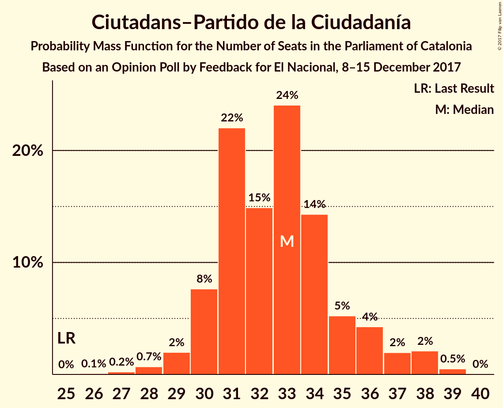
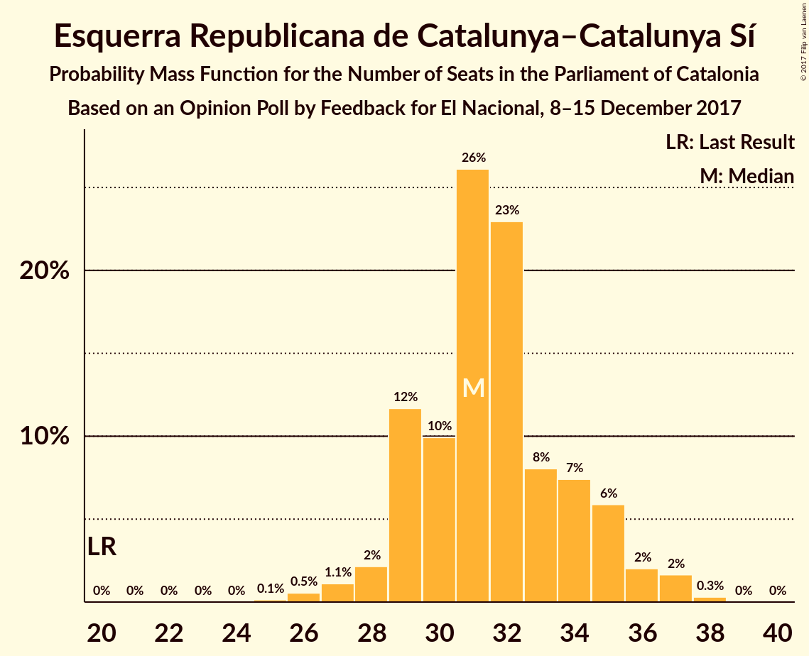
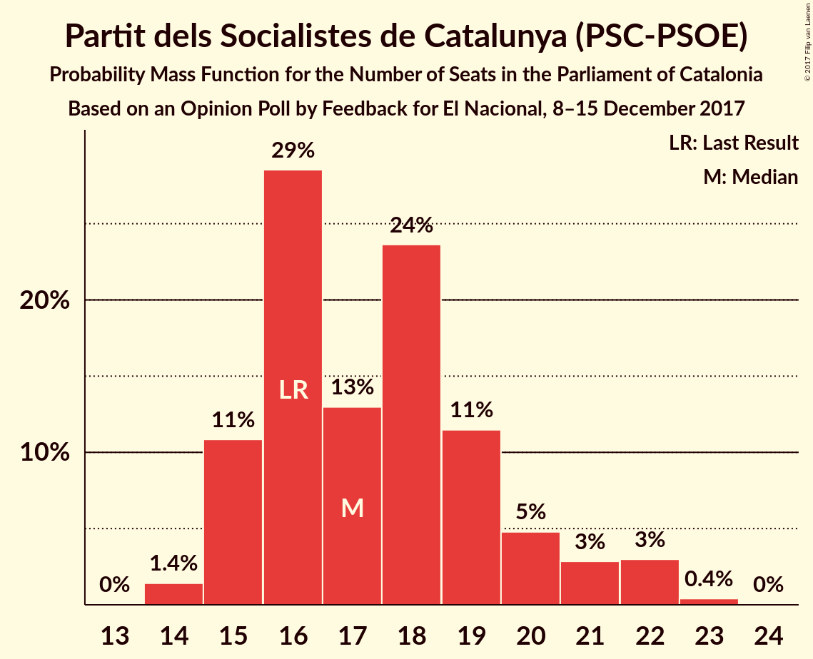
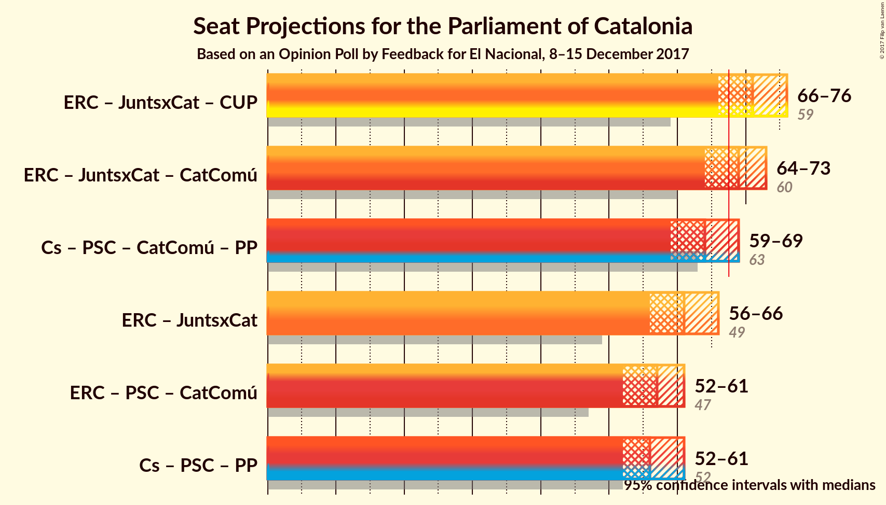

# Opinion Poll by Feedback for El Nacional, 8–15 December 2017

<a href="#voting-intentions">Voting Intentions</a> | <a href="#seats">Seats</a> | <a href="#coalitions">Coalitions</a> | <a href="#technical-information">Technical Information</a>

## Voting Intentions

### Confidence Intervals

| Party | Last Result | Poll Result | 80% Confidence Interval | 90% Confidence Interval | 95% Confidence Interval | 99% Confidence Interval |
|:-----:|:-----------:|:-----------:|:-----------------------:|:-----------------------:|:-----------------------:|:-----------------------:|
| Ciutadans–Partido de la Ciudadanía | 17.9% | 24.2% | 22.5–26.0% |22.1–26.5% |21.6–27.0% |20.9–27.8% |
| Esquerra Republicana de Catalunya–Catalunya Sí | 39.6% | 20.9% | 19.3–22.6% |18.9–23.1% |18.5–23.5% |17.8–24.4% |
| Junts per Catalunya | 39.6% | 19.5% | 18.0–21.2% |17.5–21.7% |17.2–22.1% |16.4–22.9% |
| Partit dels Socialistes de Catalunya (PSC-PSOE) | 12.7% | 13.7% | 12.4–15.2% |12.0–15.6% |11.7–16.0% |11.1–16.7% |
| Candidatura d’Unitat Popular | 8.2% | 8.3% | 7.3–9.5% |7.0–9.9% |6.7–10.2% |6.3–10.8% |
| Catalunya en Comú | 8.9% | 7.1% | 6.2–8.3% |5.9–8.6% |5.7–8.9% |5.2–9.4% |
| Partit Popular | 8.5% | 5.6% | 4.8–6.6% |4.5–7.0% |4.3–7.2% |4.0–7.7% |

*Note:* The poll result column reflects the actual value used in the calculations. Published results may vary slightly, and in addition be rounded to fewer digits.

## Seats

### Confidence Intervals

| Party | Last Result | Median | 80% Confidence Interval | 90% Confidence Interval | 95% Confidence Interval | 99% Confidence Interval |
|:-----:|:-----------:|:------:|:-----------------------:|:-----------------------:|:-----------------------:|:-----------------------:|
| <a href="#ciutadans–partido-de-la-ciudadanía">Ciutadans–Partido de la Ciudadanía</a> | 25 | 33 | 30–35 |30–36 |29–38 |28–38 |
| <a href="#esquerra-republicana-de-catalunya–catalunya-sí">Esquerra Republicana de Catalunya–Catalunya Sí</a> | 20 | 31 | 29–35 |29–35 |28–36 |26–37 |
| <a href="#junts-per-catalunya">Junts per Catalunya</a> | 29 | 29 | 27–32 |26–32 |25–33 |24–35 |
| <a href="#partit-dels-socialistes-de-catalunya-(psc-psoe)">Partit dels Socialistes de Catalunya (PSC-PSOE)</a> | 16 | 17 | 15–20 |15–21 |15–22 |14–22 |
| <a href="#candidatura-d’unitat-popular">Candidatura d’Unitat Popular</a> | 10 | 10 | 9–12 |9–12 |9–13 |8–15 |
| <a href="#catalunya-en-comú">Catalunya en Comú</a> | 11 | 8 | 6–9 |5–9 |5–10 |5–11 |
| <a href="#partit-popular">Partit Popular</a> | 11 | 6 | 5–8 |5–9 |4–9 |3–10 |

### Ciutadans–Partido de la Ciudadanía

*For a full overview of the results for this party, see the [Ciutadans–Partido de la Ciudadanía](party-ciutadans–partidodelaciudadanía.html) page.*

| Number of Seats | Probability | Accumulated | Special Marks |
|:---------------:|:-----------:|:-----------:|:-------------:|
| 25 | 0% | 100% | Last Result |
| 26 | 0.1% | 100% |  |
| 27 | 0.2% | 99.9% |  |
| 28 | 0.7% | 99.7% |  |
| 29 | 2% | 99.0% |  |
| 30 | 7% | 97% |  |
| 31 | 21% | 90% |  |
| 32 | 17% | 69% |  |
| 33 | 24% | 52% | Median |
| 34 | 15% | 28% |  |
| 35 | 5% | 14% |  |
| 36 | 3% | 8% |  |
| 37 | 2% | 5% |  |
| 38 | 3% | 3% |  |
| 39 | 0.5% | 0.5% |  |
| 40 | 0% | 0% |  |

### Esquerra Republicana de Catalunya–Catalunya Sí

*For a full overview of the results for this party, see the [Esquerra Republicana de Catalunya–Catalunya Sí](party-esquerrarepublicanadecatalunya–catalunyasí.html) page.*

| Number of Seats | Probability | Accumulated | Special Marks |
|:---------------:|:-----------:|:-----------:|:-------------:|
| 20 | 0% | 100% | Last Result |
| 21 | 0% | 100% |  |
| 22 | 0% | 100% |  |
| 23 | 0% | 100% |  |
| 24 | 0% | 100% |  |
| 25 | 0.1% | 100% |  |
| 26 | 0.6% | 99.8% |  |
| 27 | 1.2% | 99.2% |  |
| 28 | 2% | 98% |  |
| 29 | 14% | 96% |  |
| 30 | 10% | 83% |  |
| 31 | 24% | 72% | Median |
| 32 | 23% | 49% |  |
| 33 | 7% | 26% |  |
| 34 | 9% | 20% |  |
| 35 | 8% | 11% |  |
| 36 | 2% | 3% |  |
| 37 | 1.2% | 2% |  |
| 38 | 0.3% | 0.4% |  |
| 39 | 0% | 0% |  |

### Junts per Catalunya

*For a full overview of the results for this party, see the [Junts per Catalunya](party-juntspercatalunya.html) page.*

| Number of Seats | Probability | Accumulated | Special Marks |
|:---------------:|:-----------:|:-----------:|:-------------:|
| 23 | 0.2% | 100% |  |
| 24 | 0.6% | 99.8% |  |
| 25 | 2% | 99.2% |  |
| 26 | 5% | 97% |  |
| 27 | 7% | 92% |  |
| 28 | 6% | 84% |  |
| 29 | 30% | 78% | Last Result, Median |
| 30 | 12% | 48% |  |
| 31 | 24% | 36% |  |
| 32 | 9% | 13% |  |
| 33 | 2% | 4% |  |
| 34 | 0.9% | 1.5% |  |
| 35 | 0.4% | 0.6% |  |
| 36 | 0.1% | 0.2% |  |
| 37 | 0% | 0% |  |

### Partit dels Socialistes de Catalunya (PSC-PSOE)

*For a full overview of the results for this party, see the [Partit dels Socialistes de Catalunya (PSC-PSOE)](party-partitdelssocialistesdecatalunyapsc-psoe.html) page.*

| Number of Seats | Probability | Accumulated | Special Marks |
|:---------------:|:-----------:|:-----------:|:-------------:|
| 13 | 0% | 100% |  |
| 14 | 1.2% | 99.9% |  |
| 15 | 11% | 98.7% |  |
| 16 | 30% | 88% | Last Result |
| 17 | 10% | 58% | Median |
| 18 | 24% | 48% |  |
| 19 | 12% | 24% |  |
| 20 | 5% | 12% |  |
| 21 | 3% | 7% |  |
| 22 | 3% | 3% |  |
| 23 | 0.4% | 0.4% |  |
| 24 | 0% | 0% |  |

### Candidatura d’Unitat Popular

*For a full overview of the results for this party, see the [Candidatura d’Unitat Popular](party-candidaturad’unitatpopular.html) page.*

| Number of Seats | Probability | Accumulated | Special Marks |
|:---------------:|:-----------:|:-----------:|:-------------:|
| 8 | 2% | 100% |  |
| 9 | 26% | 98% |  |
| 10 | 46% | 72% | Last Result, Median |
| 11 | 8% | 26% |  |
| 12 | 14% | 18% |  |
| 13 | 2% | 4% |  |
| 14 | 0.9% | 2% |  |
| 15 | 0.8% | 1.0% |  |
| 16 | 0.2% | 0.2% |  |
| 17 | 0% | 0% |  |

### Catalunya en Comú

*For a full overview of the results for this party, see the [Catalunya en Comú](party-catalunyaencomú.html) page.*

| Number of Seats | Probability | Accumulated | Special Marks |
|:---------------:|:-----------:|:-----------:|:-------------:|
| 4 | 0.1% | 100% |  |
| 5 | 5% | 99.9% |  |
| 6 | 14% | 95% |  |
| 7 | 19% | 81% |  |
| 8 | 45% | 62% | Median |
| 9 | 13% | 17% |  |
| 10 | 2% | 3% |  |
| 11 | 2% | 2% | Last Result |
| 12 | 0.1% | 0.1% |  |
| 13 | 0% | 0% |  |

### Partit Popular

*For a full overview of the results for this party, see the [Partit Popular](party-partitpopular.html) page.*

| Number of Seats | Probability | Accumulated | Special Marks |
|:---------------:|:-----------:|:-----------:|:-------------:|
| 3 | 2% | 100% |  |
| 4 | 0.9% | 98% |  |
| 5 | 33% | 97% |  |
| 6 | 38% | 64% | Median |
| 7 | 16% | 26% |  |
| 8 | 4% | 10% |  |
| 9 | 5% | 6% |  |
| 10 | 0.8% | 0.9% |  |
| 11 | 0% | 0% | Last Result |

## Coalitions

### Confidence Intervals

| Coalition | Last Result | Median | Majority? | 80% Confidence Interval | 90% Confidence Interval | 95% Confidence Interval | 99% Confidence Interval |
|:---------:|:-----------:|:------:|:---------:|:-----------------------:|:-----------------------:|:-----------------------:|:-----------------------:|
| Esquerra Republicana de Catalunya–Catalunya Sí – Junts per Catalunya – Candidatura d’Unitat Popular | 59 | 71 | 95% | 68–74 | 67–75 | 67–76 | 65–77 |
| Esquerra Republicana de Catalunya–Catalunya Sí – Junts per Catalunya – Catalunya en Comú | 60 | 69 | 72% | 66–72 | 64–73 | 64–73 | 62–75 |
| Ciutadans–Partido de la Ciudadanía – Partit dels Socialistes de Catalunya (PSC-PSOE) – Catalunya en Comú – Partit Popular | 63 | 64 | 5% | 61–67 | 60–68 | 59–68 | 58–70 |
| Esquerra Republicana de Catalunya–Catalunya Sí – Junts per Catalunya | 49 | 61 | 0.4% | 58–64 | 57–65 | 56–66 | 55–67 |
| Esquerra Republicana de Catalunya–Catalunya Sí – Partit dels Socialistes de Catalunya (PSC-PSOE) – Catalunya en Comú | 47 | 56 | 0% | 53–60 | 53–61 | 52–61 | 50–63 |
| Ciutadans–Partido de la Ciudadanía – Partit dels Socialistes de Catalunya (PSC-PSOE) – Partit Popular | 52 | 56 | 0% | 53–59 | 52–60 | 52–61 | 50–63 |

### Esquerra Republicana de Catalunya–Catalunya Sí – Junts per Catalunya – Candidatura d’Unitat Popular

| Number of Seats | Probability | Accumulated | Special Marks |
|:---------------:|:-----------:|:-----------:|:-------------:|
| 59 | 0% | 100% | Last Result |
| 60 | 0% | 100% |  |
| 61 | 0% | 100% |  |
| 62 | 0% | 100% |  |
| 63 | 0.1% | 100% |  |
| 64 | 0.2% | 99.9% |  |
| 65 | 0.7% | 99.7% |  |
| 66 | 1.5% | 99.0% |  |
| 67 | 3% | 98% |  |
| 68 | 5% | 95% | Majority |
| 69 | 11% | 90% |  |
| 70 | 17% | 79% | Median |
| 71 | 18% | 62% |  |
| 72 | 13% | 44% |  |
| 73 | 11% | 31% |  |
| 74 | 11% | 20% |  |
| 75 | 4% | 9% |  |
| 76 | 3% | 5% |  |
| 77 | 1.2% | 2% |  |
| 78 | 0.4% | 0.4% |  |
| 79 | 0.1% | 0.1% |  |
| 80 | 0% | 0% |  |

### Esquerra Republicana de Catalunya–Catalunya Sí – Junts per Catalunya – Catalunya en Comú

| Number of Seats | Probability | Accumulated | Special Marks |
|:---------------:|:-----------:|:-----------:|:-------------:|
| 60 | 0.1% | 100% | Last Result |
| 61 | 0.2% | 99.9% |  |
| 62 | 0.6% | 99.8% |  |
| 63 | 1.3% | 99.1% |  |
| 64 | 3% | 98% |  |
| 65 | 4% | 94% |  |
| 66 | 9% | 90% |  |
| 67 | 9% | 81% |  |
| 68 | 19% | 72% | Median, Majority |
| 69 | 16% | 53% |  |
| 70 | 14% | 37% |  |
| 71 | 10% | 23% |  |
| 72 | 8% | 14% |  |
| 73 | 4% | 6% |  |
| 74 | 2% | 2% |  |
| 75 | 0.5% | 0.6% |  |
| 76 | 0.1% | 0.1% |  |
| 77 | 0% | 0% |  |

### Ciutadans–Partido de la Ciudadanía – Partit dels Socialistes de Catalunya (PSC-PSOE) – Catalunya en Comú – Partit Popular

| Number of Seats | Probability | Accumulated | Special Marks |
|:---------------:|:-----------:|:-----------:|:-------------:|
| 56 | 0.1% | 100% |  |
| 57 | 0.4% | 99.9% |  |
| 58 | 1.2% | 99.6% |  |
| 59 | 3% | 98% |  |
| 60 | 4% | 95% |  |
| 61 | 11% | 91% |  |
| 62 | 11% | 80% |  |
| 63 | 13% | 69% | Last Result |
| 64 | 18% | 56% | Median |
| 65 | 17% | 38% |  |
| 66 | 11% | 21% |  |
| 67 | 5% | 10% |  |
| 68 | 3% | 5% | Majority |
| 69 | 1.5% | 2% |  |
| 70 | 0.7% | 1.0% |  |
| 71 | 0.2% | 0.3% |  |
| 72 | 0.1% | 0.1% |  |
| 73 | 0% | 0% |  |

### Esquerra Republicana de Catalunya–Catalunya Sí – Junts per Catalunya

| Number of Seats | Probability | Accumulated | Special Marks |
|:---------------:|:-----------:|:-----------:|:-------------:|
| 49 | 0% | 100% | Last Result |
| 50 | 0% | 100% |  |
| 51 | 0% | 100% |  |
| 52 | 0% | 100% |  |
| 53 | 0.1% | 100% |  |
| 54 | 0.3% | 99.9% |  |
| 55 | 0.8% | 99.6% |  |
| 56 | 2% | 98.7% |  |
| 57 | 3% | 96% |  |
| 58 | 6% | 93% |  |
| 59 | 9% | 87% |  |
| 60 | 19% | 78% | Median |
| 61 | 19% | 59% |  |
| 62 | 10% | 39% |  |
| 63 | 11% | 30% |  |
| 64 | 11% | 19% |  |
| 65 | 5% | 8% |  |
| 66 | 2% | 3% |  |
| 67 | 0.7% | 1.0% |  |
| 68 | 0.3% | 0.4% | Majority |
| 69 | 0% | 0% |  |

### Esquerra Republicana de Catalunya–Catalunya Sí – Partit dels Socialistes de Catalunya (PSC-PSOE) – Catalunya en Comú

| Number of Seats | Probability | Accumulated | Special Marks |
|:---------------:|:-----------:|:-----------:|:-------------:|
| 47 | 0% | 100% | Last Result |
| 48 | 0% | 100% |  |
| 49 | 0.2% | 99.9% |  |
| 50 | 0.5% | 99.7% |  |
| 51 | 1.3% | 99.2% |  |
| 52 | 2% | 98% |  |
| 53 | 6% | 96% |  |
| 54 | 7% | 90% |  |
| 55 | 17% | 83% |  |
| 56 | 16% | 66% | Median |
| 57 | 14% | 50% |  |
| 58 | 14% | 36% |  |
| 59 | 10% | 21% |  |
| 60 | 6% | 11% |  |
| 61 | 4% | 6% |  |
| 62 | 2% | 2% |  |
| 63 | 0.4% | 0.5% |  |
| 64 | 0.1% | 0.2% |  |
| 65 | 0% | 0.1% |  |
| 66 | 0% | 0% |  |

### Ciutadans–Partido de la Ciudadanía – Partit dels Socialistes de Catalunya (PSC-PSOE) – Partit Popular

| Number of Seats | Probability | Accumulated | Special Marks |
|:---------------:|:-----------:|:-----------:|:-------------:|
| 49 | 0.1% | 100% |  |
| 50 | 0.3% | 99.8% |  |
| 51 | 2% | 99.5% |  |
| 52 | 4% | 98% | Last Result |
| 53 | 8% | 93% |  |
| 54 | 12% | 86% |  |
| 55 | 16% | 74% |  |
| 56 | 13% | 57% | Median |
| 57 | 18% | 45% |  |
| 58 | 11% | 26% |  |
| 59 | 7% | 15% |  |
| 60 | 4% | 8% |  |
| 61 | 2% | 4% |  |
| 62 | 0.8% | 2% |  |
| 63 | 0.5% | 0.7% |  |
| 64 | 0.1% | 0.2% |  |
| 65 | 0% | 0.1% |  |
| 66 | 0% | 0% |  |

## Technical Information

### Opinion Poll

+ **Polling firm:** Feedback
+ **Commissioner(s):** El Nacional
+ **Fieldwork period:** 8–15 December 2017

### Calculations

+ **Sample size:** 1000
+ **Simulations done:** 1,048,576
+ **Error estimate:** 0.76%

