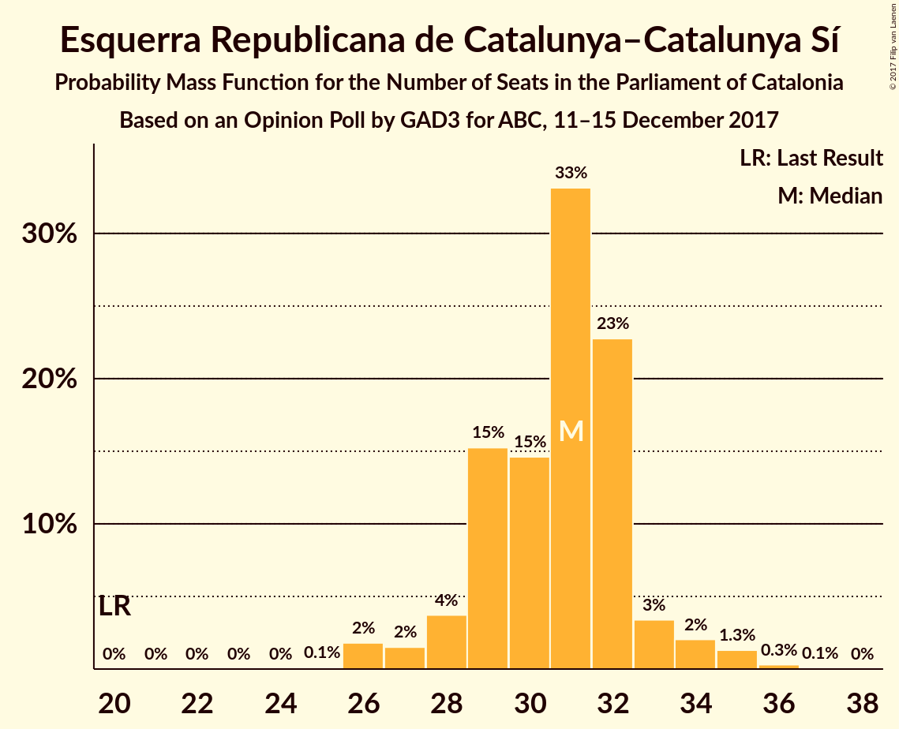
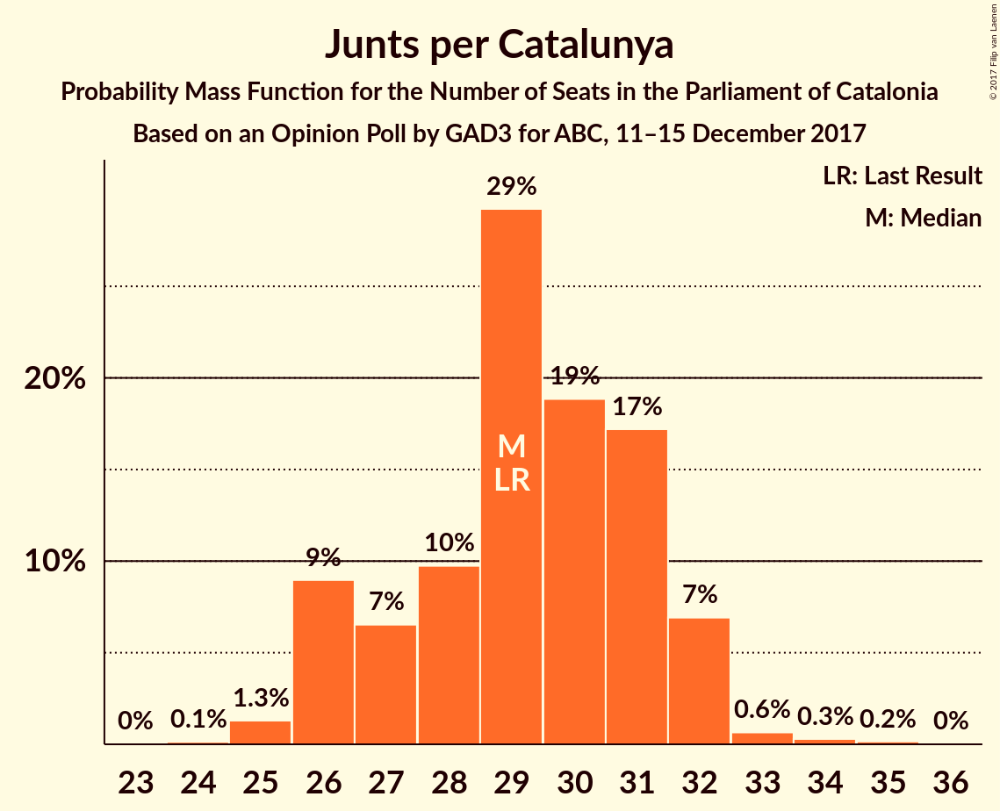
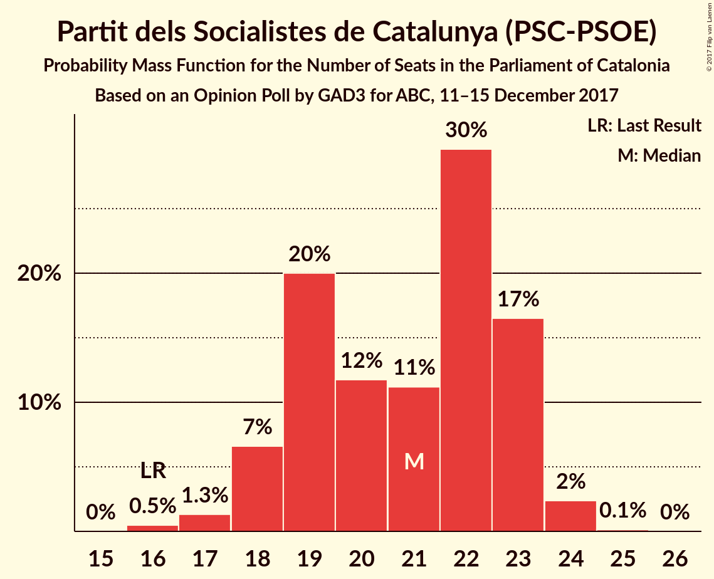
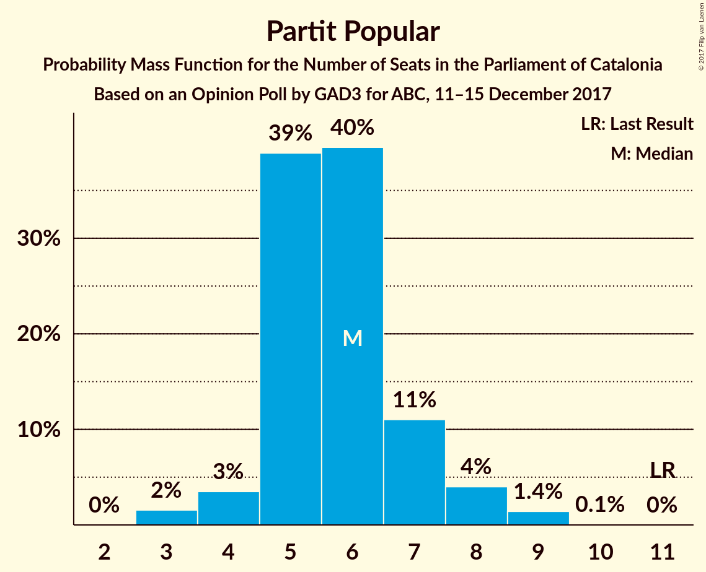

# Opinion Poll by GAD3 for ABC, 11–15 December 2017

<a href="#voting-intentions">Voting Intentions</a> | <a href="#seats">Seats</a> | <a href="#coalitions">Coalitions</a> | <a href="#technical-information">Technical Information</a>

## Voting Intentions

### Confidence Intervals

| Party | Last Result | Poll Result | 80% Confidence Interval | 90% Confidence Interval | 95% Confidence Interval | 99% Confidence Interval |
|:-----:|:-----------:|:-----------:|:-----------------------:|:-----------------------:|:-----------------------:|:-----------------------:|
| Ciutadans–Partido de la Ciudadanía | 17.9% | 25.1% | 23.7–26.6% |23.3–27.0% |23.0–27.4% |22.3–28.1% |
| Esquerra Republicana de Catalunya–Catalunya Sí | 39.6% | 20.3% | 19.1–21.7% |18.7–22.1% |18.4–22.5% |17.8–23.1% |
| Junts per Catalunya | 39.6% | 19.4% | 18.1–20.8% |17.8–21.2% |17.5–21.5% |16.9–22.1% |
| Partit dels Socialistes de Catalunya (PSC-PSOE) | 12.7% | 15.8% | 14.7–17.1% |14.3–17.5% |14.1–17.8% |13.5–18.4% |
| Catalunya en Comú | 8.9% | 7.1% | 6.3–8.0% |6.1–8.3% |5.9–8.5% |5.5–9.0% |
| Candidatura d’Unitat Popular | 8.2% | 5.5% | 4.8–6.3% |4.6–6.6% |4.5–6.8% |4.1–7.2% |
| Partit Popular | 8.5% | 5.4% | 4.7–6.3% |4.6–6.5% |4.4–6.7% |4.1–7.1% |

*Note:* The poll result column reflects the actual value used in the calculations. Published results may vary slightly, and in addition be rounded to fewer digits.

## Seats

### Confidence Intervals

| Party | Last Result | Median | 80% Confidence Interval | 90% Confidence Interval | 95% Confidence Interval | 99% Confidence Interval |
|:-----:|:-----------:|:------:|:-----------------------:|:-----------------------:|:-----------------------:|:-----------------------:|
| <a href="#ciutadans–partido-de-la-ciudadanía">Ciutadans–Partido de la Ciudadanía</a> | 25 | 34 | 32–36 |31–37 |31–38 |30–39 |
| <a href="#esquerra-republicana-de-catalunya–catalunya-sí">Esquerra Republicana de Catalunya–Catalunya Sí</a> | 20 | 31 | 29–32 |28–33 |27–34 |26–35 |
| <a href="#junts-per-catalunya">Junts per Catalunya</a> | 29 | 29 | 26–31 |26–32 |26–32 |25–34 |
| <a href="#partit-dels-socialistes-de-catalunya-(psc-psoe)">Partit dels Socialistes de Catalunya (PSC-PSOE)</a> | 16 | 21 | 19–23 |18–23 |18–24 |17–24 |
| <a href="#catalunya-en-comú">Catalunya en Comú</a> | 11 | 8 | 6–9 |6–9 |5–9 |5–10 |
| <a href="#candidatura-d’unitat-popular">Candidatura d’Unitat Popular</a> | 10 | 7 | 5–8 |5–8 |4–9 |3–9 |
| <a href="#partit-popular">Partit Popular</a> | 11 | 6 | 5–7 |4–7 |4–8 |3–9 |

### Ciutadans–Partido de la Ciudadanía

*For a full overview of the results for this party, see the [Ciutadans–Partido de la Ciudadanía](party-ciutadans–partidodelaciudadanía.html) page.*

| Number of Seats | Probability | Accumulated | Special Marks |
|:---------------:|:-----------:|:-----------:|:-------------:|
| 25 | 0% | 100% | Last Result |
| 26 | 0% | 100% |  |
| 27 | 0% | 100% |  |
| 28 | 0% | 100% |  |
| 29 | 0.4% | 100% |  |
| 30 | 0.9% | 99.6% |  |
| 31 | 4% | 98.7% |  |
| 32 | 10% | 95% |  |
| 33 | 16% | 85% |  |
| 34 | 35% | 69% | Median |
| 35 | 16% | 33% |  |
| 36 | 8% | 17% |  |
| 37 | 5% | 9% |  |
| 38 | 3% | 4% |  |
| 39 | 0.9% | 1.0% |  |
| 40 | 0.1% | 0.1% |  |
| 41 | 0% | 0% |  |

### Esquerra Republicana de Catalunya–Catalunya Sí

*For a full overview of the results for this party, see the [Esquerra Republicana de Catalunya–Catalunya Sí](party-esquerrarepublicanadecatalunya–catalunyasí.html) page.*

| Number of Seats | Probability | Accumulated | Special Marks |
|:---------------:|:-----------:|:-----------:|:-------------:|
| 20 | 0% | 100% | Last Result |
| 21 | 0% | 100% |  |
| 22 | 0% | 100% |  |
| 23 | 0% | 100% |  |
| 24 | 0% | 100% |  |
| 25 | 0.1% | 100% |  |
| 26 | 2% | 99.9% |  |
| 27 | 1.2% | 98% |  |
| 28 | 3% | 97% |  |
| 29 | 15% | 93% |  |
| 30 | 20% | 79% |  |
| 31 | 29% | 59% | Median |
| 32 | 23% | 30% |  |
| 33 | 4% | 7% |  |
| 34 | 2% | 4% |  |
| 35 | 2% | 2% |  |
| 36 | 0.3% | 0.3% |  |
| 37 | 0.1% | 0.1% |  |
| 38 | 0% | 0% |  |

### Junts per Catalunya

*For a full overview of the results for this party, see the [Junts per Catalunya](party-juntspercatalunya.html) page.*

| Number of Seats | Probability | Accumulated | Special Marks |
|:---------------:|:-----------:|:-----------:|:-------------:|
| 24 | 0.1% | 100% |  |
| 25 | 1.3% | 99.9% |  |
| 26 | 9% | 98.5% |  |
| 27 | 4% | 90% |  |
| 28 | 13% | 86% |  |
| 29 | 30% | 73% | Last Result, Median |
| 30 | 15% | 42% |  |
| 31 | 21% | 27% |  |
| 32 | 6% | 7% |  |
| 33 | 0.6% | 1.2% |  |
| 34 | 0.3% | 0.5% |  |
| 35 | 0.2% | 0.2% |  |
| 36 | 0% | 0% |  |

### Partit dels Socialistes de Catalunya (PSC-PSOE)

*For a full overview of the results for this party, see the [Partit dels Socialistes de Catalunya (PSC-PSOE)](party-partitdelssocialistesdecatalunyapsc-psoe.html) page.*

| Number of Seats | Probability | Accumulated | Special Marks |
|:---------------:|:-----------:|:-----------:|:-------------:|
| 16 | 0.5% | 100% | Last Result |
| 17 | 0.8% | 99.5% |  |
| 18 | 7% | 98.7% |  |
| 19 | 21% | 92% |  |
| 20 | 14% | 71% |  |
| 21 | 8% | 57% | Median |
| 22 | 31% | 48% |  |
| 23 | 15% | 18% |  |
| 24 | 2% | 3% |  |
| 25 | 0.1% | 0.1% |  |
| 26 | 0% | 0% |  |

### Catalunya en Comú

*For a full overview of the results for this party, see the [Catalunya en Comú](party-catalunyaencomú.html) page.*

| Number of Seats | Probability | Accumulated | Special Marks |
|:---------------:|:-----------:|:-----------:|:-------------:|
| 5 | 3% | 100% |  |
| 6 | 19% | 97% |  |
| 7 | 15% | 79% |  |
| 8 | 51% | 64% | Median |
| 9 | 12% | 13% |  |
| 10 | 0.6% | 1.0% |  |
| 11 | 0.4% | 0.4% | Last Result |
| 12 | 0% | 0% |  |

### Candidatura d’Unitat Popular

*For a full overview of the results for this party, see the [Candidatura d’Unitat Popular](party-candidaturad’unitatpopular.html) page.*

| Number of Seats | Probability | Accumulated | Special Marks |
|:---------------:|:-----------:|:-----------:|:-------------:|
| 3 | 2% | 100% |  |
| 4 | 0.9% | 98% |  |
| 5 | 26% | 97% |  |
| 6 | 8% | 71% |  |
| 7 | 15% | 63% | Median |
| 8 | 45% | 49% |  |
| 9 | 3% | 3% |  |
| 10 | 0% | 0% | Last Result |

### Partit Popular

*For a full overview of the results for this party, see the [Partit Popular](party-partitpopular.html) page.*

| Number of Seats | Probability | Accumulated | Special Marks |
|:---------------:|:-----------:|:-----------:|:-------------:|
| 3 | 2% | 100% |  |
| 4 | 4% | 98% |  |
| 5 | 38% | 95% |  |
| 6 | 40% | 56% | Median |
| 7 | 11% | 16% |  |
| 8 | 3% | 5% |  |
| 9 | 1.4% | 1.5% |  |
| 10 | 0.1% | 0.1% |  |
| 11 | 0% | 0% | Last Result |

## Coalitions

### Confidence Intervals

| Coalition | Last Result | Median | Majority? | 80% Confidence Interval | 90% Confidence Interval | 95% Confidence Interval | 99% Confidence Interval |
|:---------:|:-----------:|:------:|:---------:|:-----------------------:|:-----------------------:|:-----------------------:|:-----------------------:|
| Ciutadans–Partido de la Ciudadanía – Partit dels Socialistes de Catalunya (PSC-PSOE) – Catalunya en Comú – Partit Popular | 63 | 68 | 62% | 66–71 | 65–72 | 65–72 | 63–74 |
| Esquerra Republicana de Catalunya–Catalunya Sí – Junts per Catalunya – Catalunya en Comú | 60 | 68 | 55% | 65–70 | 64–70 | 63–71 | 62–73 |
| Esquerra Republicana de Catalunya–Catalunya Sí – Junts per Catalunya – Candidatura d’Unitat Popular | 59 | 67 | 38% | 64–69 | 63–70 | 63–70 | 61–72 |
| Ciutadans–Partido de la Ciudadanía – Partit dels Socialistes de Catalunya (PSC-PSOE) – Partit Popular | 52 | 61 | 0.1% | 58–63 | 58–64 | 57–65 | 56–67 |
| Esquerra Republicana de Catalunya–Catalunya Sí – Junts per Catalunya | 49 | 60 | 0% | 57–62 | 56–63 | 56–64 | 54–65 |
| Esquerra Republicana de Catalunya–Catalunya Sí – Partit dels Socialistes de Catalunya (PSC-PSOE) – Catalunya en Comú | 47 | 59 | 0% | 56–62 | 56–62 | 55–63 | 53–64 |

### Ciutadans–Partido de la Ciudadanía – Partit dels Socialistes de Catalunya (PSC-PSOE) – Catalunya en Comú – Partit Popular

| Number of Seats | Probability | Accumulated | Special Marks |
|:---------------:|:-----------:|:-----------:|:-------------:|
| 61 | 0.1% | 100% |  |
| 62 | 0.2% | 99.9% |  |
| 63 | 0.4% | 99.7% | Last Result |
| 64 | 2% | 99.3% |  |
| 65 | 4% | 98% |  |
| 66 | 18% | 94% |  |
| 67 | 14% | 76% |  |
| 68 | 15% | 62% | Majority |
| 69 | 22% | 47% | Median |
| 70 | 13% | 25% |  |
| 71 | 6% | 12% |  |
| 72 | 4% | 6% |  |
| 73 | 2% | 2% |  |
| 74 | 0.5% | 0.7% |  |
| 75 | 0.2% | 0.2% |  |
| 76 | 0% | 0% |  |

### Esquerra Republicana de Catalunya–Catalunya Sí – Junts per Catalunya – Catalunya en Comú

| Number of Seats | Probability | Accumulated | Special Marks |
|:---------------:|:-----------:|:-----------:|:-------------:|
| 60 | 0.1% | 100% | Last Result |
| 61 | 0.2% | 99.8% |  |
| 62 | 0.6% | 99.6% |  |
| 63 | 2% | 99.0% |  |
| 64 | 5% | 97% |  |
| 65 | 12% | 92% |  |
| 66 | 9% | 80% |  |
| 67 | 16% | 71% |  |
| 68 | 22% | 55% | Median, Majority |
| 69 | 20% | 33% |  |
| 70 | 9% | 14% |  |
| 71 | 3% | 5% |  |
| 72 | 1.4% | 2% |  |
| 73 | 0.5% | 0.7% |  |
| 74 | 0.1% | 0.1% |  |
| 75 | 0% | 0% |  |

### Esquerra Republicana de Catalunya–Catalunya Sí – Junts per Catalunya – Candidatura d’Unitat Popular

| Number of Seats | Probability | Accumulated | Special Marks |
|:---------------:|:-----------:|:-----------:|:-------------:|
| 59 | 0% | 100% | Last Result |
| 60 | 0.2% | 100% |  |
| 61 | 0.5% | 99.8% |  |
| 62 | 2% | 99.3% |  |
| 63 | 4% | 98% |  |
| 64 | 6% | 94% |  |
| 65 | 13% | 88% |  |
| 66 | 22% | 75% |  |
| 67 | 15% | 53% | Median |
| 68 | 14% | 38% | Majority |
| 69 | 18% | 24% |  |
| 70 | 4% | 6% |  |
| 71 | 2% | 2% |  |
| 72 | 0.4% | 0.7% |  |
| 73 | 0.2% | 0.3% |  |
| 74 | 0.1% | 0.1% |  |
| 75 | 0% | 0% |  |

### Ciutadans–Partido de la Ciudadanía – Partit dels Socialistes de Catalunya (PSC-PSOE) – Partit Popular

| Number of Seats | Probability | Accumulated | Special Marks |
|:---------------:|:-----------:|:-----------:|:-------------:|
| 52 | 0% | 100% | Last Result |
| 53 | 0% | 100% |  |
| 54 | 0.1% | 100% |  |
| 55 | 0.3% | 99.9% |  |
| 56 | 1.0% | 99.6% |  |
| 57 | 3% | 98.6% |  |
| 58 | 13% | 95% |  |
| 59 | 12% | 82% |  |
| 60 | 15% | 70% |  |
| 61 | 16% | 54% | Median |
| 62 | 20% | 38% |  |
| 63 | 10% | 18% |  |
| 64 | 4% | 8% |  |
| 65 | 2% | 3% |  |
| 66 | 0.8% | 1.4% |  |
| 67 | 0.4% | 0.6% |  |
| 68 | 0.1% | 0.1% | Majority |
| 69 | 0% | 0% |  |

### Esquerra Republicana de Catalunya–Catalunya Sí – Junts per Catalunya

| Number of Seats | Probability | Accumulated | Special Marks |
|:---------------:|:-----------:|:-----------:|:-------------:|
| 49 | 0% | 100% | Last Result |
| 50 | 0% | 100% |  |
| 51 | 0% | 100% |  |
| 52 | 0% | 100% |  |
| 53 | 0.1% | 100% |  |
| 54 | 0.5% | 99.8% |  |
| 55 | 2% | 99.4% |  |
| 56 | 3% | 98% |  |
| 57 | 5% | 95% |  |
| 58 | 8% | 89% |  |
| 59 | 18% | 81% |  |
| 60 | 19% | 63% | Median |
| 61 | 28% | 44% |  |
| 62 | 10% | 16% |  |
| 63 | 3% | 6% |  |
| 64 | 2% | 3% |  |
| 65 | 0.7% | 1.1% |  |
| 66 | 0.3% | 0.4% |  |
| 67 | 0.1% | 0.1% |  |
| 68 | 0% | 0% | Majority |

### Esquerra Republicana de Catalunya–Catalunya Sí – Partit dels Socialistes de Catalunya (PSC-PSOE) – Catalunya en Comú

| Number of Seats | Probability | Accumulated | Special Marks |
|:---------------:|:-----------:|:-----------:|:-------------:|
| 47 | 0% | 100% | Last Result |
| 48 | 0% | 100% |  |
| 49 | 0% | 100% |  |
| 50 | 0% | 100% |  |
| 51 | 0% | 100% |  |
| 52 | 0.1% | 100% |  |
| 53 | 0.4% | 99.9% |  |
| 54 | 1.0% | 99.5% |  |
| 55 | 3% | 98% |  |
| 56 | 9% | 96% |  |
| 57 | 9% | 87% |  |
| 58 | 16% | 78% |  |
| 59 | 20% | 61% |  |
| 60 | 13% | 41% | Median |
| 61 | 14% | 29% |  |
| 62 | 10% | 14% |  |
| 63 | 3% | 4% |  |
| 64 | 0.7% | 1.1% |  |
| 65 | 0.3% | 0.4% |  |
| 66 | 0.1% | 0.1% |  |
| 67 | 0% | 0% |  |

## Technical Information

### Opinion Poll

+ **Polling firm:** GAD3
+ **Commissioner(s):** ABC
+ **Fieldwork period:** 11–15 December 2017

### Calculations

+ **Sample size:** 1510
+ **Simulations done:** 524,288
+ **Error estimate:** 1.22%

