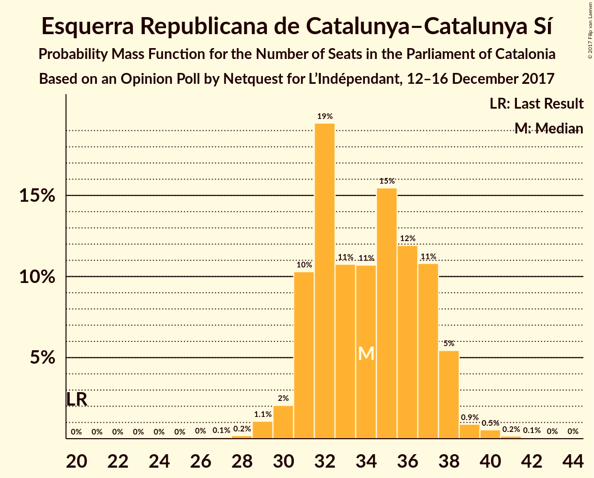
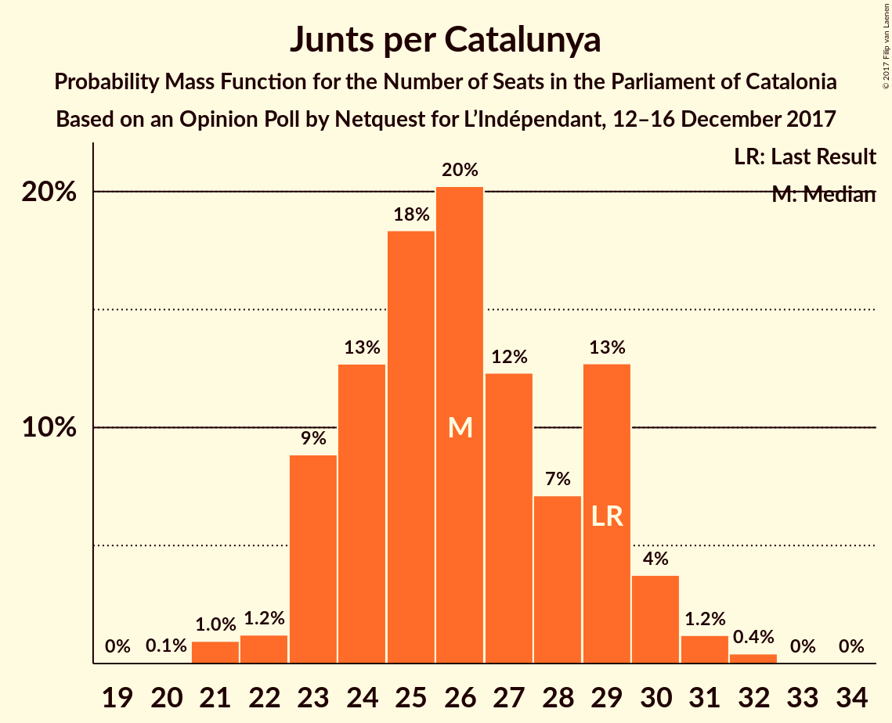
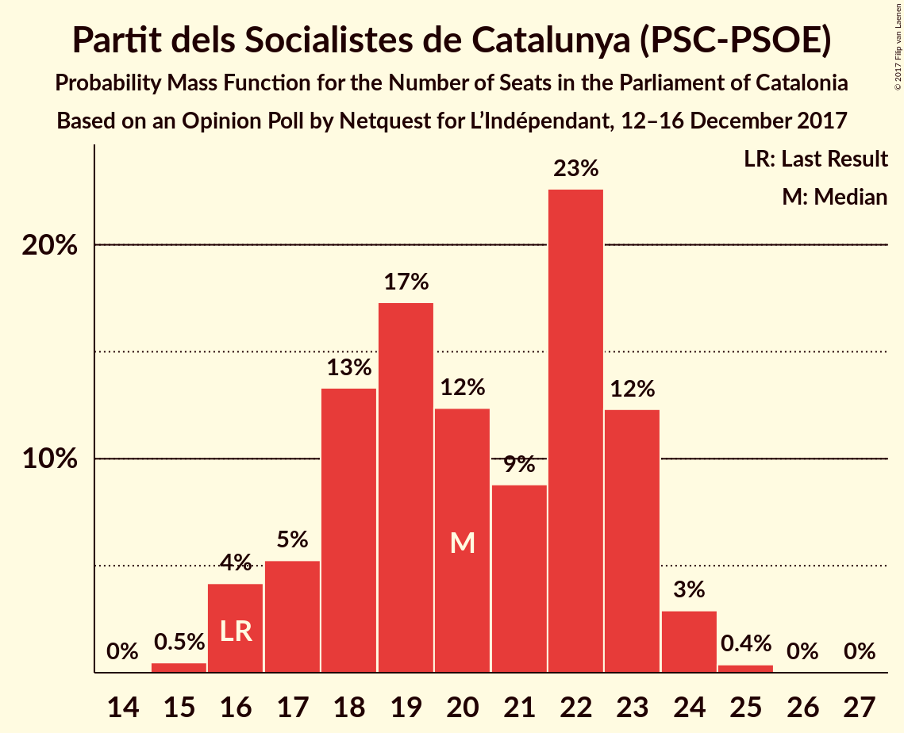

# Opinion Poll by Netquest for L’Indépendant, 12–16 December 2017

<a href="#voting-intentions">Voting Intentions</a> | <a href="#seats">Seats</a> | <a href="#coalitions">Coalitions</a> | <a href="#technical-information">Technical Information</a>

## Voting Intentions

### Confidence Intervals

| Party | Last Result | Poll Result | 80% Confidence Interval | 90% Confidence Interval | 95% Confidence Interval | 99% Confidence Interval |
|:-----:|:-----------:|:-----------:|:-----------------------:|:-----------------------:|:-----------------------:|:-----------------------:|
| Ciutadans–Partido de la Ciudadanía | 17.9% | 23.6% | 21.8–25.4% |21.3–26.0% |20.9–26.4% |20.1–27.4% |
| Esquerra Republicana de Catalunya–Catalunya Sí | 39.6% | 22.0% | 20.3–23.9% |19.8–24.4% |19.4–24.8% |18.6–25.7% |
| Junts per Catalunya | 39.6% | 17.1% | 15.6–18.8% |15.2–19.3% |14.8–19.7% |14.1–20.6% |
| Partit dels Socialistes de Catalunya (PSC-PSOE) | 12.7% | 15.1% | 13.7–16.7% |13.3–17.2% |12.9–17.6% |12.3–18.4% |
| Candidatura d’Unitat Popular | 8.2% | 6.9% | 5.9–8.1% |5.6–8.4% |5.4–8.7% |5.0–9.4% |
| Catalunya en Comú | 8.9% | 6.6% | 5.6–7.7% |5.3–8.1% |5.1–8.4% |4.7–9.0% |
| Partit Popular | 8.5% | 5.4% | 4.6–6.5% |4.3–6.9% |4.1–7.1% |3.8–7.7% |

*Note:* The poll result column reflects the actual value used in the calculations. Published results may vary slightly, and in addition be rounded to fewer digits.

## Seats

### Confidence Intervals

| Party | Last Result | Median | 80% Confidence Interval | 90% Confidence Interval | 95% Confidence Interval | 99% Confidence Interval |
|:-----:|:-----------:|:------:|:-----------------------:|:-----------------------:|:-----------------------:|:-----------------------:|
| <a href="#ciutadans–partido-de-la-ciudadanía">Ciutadans–Partido de la Ciudadanía</a> | 25 | 33 | 30–36 |29–36 |29–37 |27–39 |
| <a href="#esquerra-republicana-de-catalunya–catalunya-sí">Esquerra Republicana de Catalunya–Catalunya Sí</a> | 20 | 34 | 31–37 |31–38 |30–38 |29–40 |
| <a href="#junts-per-catalunya">Junts per Catalunya</a> | 29 | 26 | 23–29 |23–30 |23–30 |21–32 |
| <a href="#partit-dels-socialistes-de-catalunya-(psc-psoe)">Partit dels Socialistes de Catalunya (PSC-PSOE)</a> | 16 | 21 | 17–23 |17–23 |16–24 |16–24 |
| <a href="#candidatura-d’unitat-popular">Candidatura d’Unitat Popular</a> | 10 | 9 | 8–10 |8–10 |7–11 |5–12 |
| <a href="#catalunya-en-comú">Catalunya en Comú</a> | 11 | 7 | 5–8 |5–9 |5–9 |4–11 |
| <a href="#partit-popular">Partit Popular</a> | 11 | 6 | 5–8 |4–9 |3–9 |3–10 |

### Ciutadans–Partido de la Ciudadanía

*For a full overview of the results for this party, see the [Ciutadans–Partido de la Ciudadanía](party-ciutadans–partidodelaciudadanía.html) page.*

| Number of Seats | Probability | Accumulated | Special Marks |
|:---------------:|:-----------:|:-----------:|:-------------:|
| 25 | 0% | 100% | Last Result |
| 26 | 0.2% | 100% |  |
| 27 | 0.5% | 99.8% |  |
| 28 | 2% | 99.3% |  |
| 29 | 4% | 98% |  |
| 30 | 6% | 94% |  |
| 31 | 19% | 87% |  |
| 32 | 17% | 69% |  |
| 33 | 14% | 51% | Median |
| 34 | 20% | 37% |  |
| 35 | 7% | 17% |  |
| 36 | 6% | 10% |  |
| 37 | 2% | 4% |  |
| 38 | 2% | 2% |  |
| 39 | 0.5% | 0.6% |  |
| 40 | 0.1% | 0.1% |  |
| 41 | 0% | 0% |  |

### Esquerra Republicana de Catalunya–Catalunya Sí

*For a full overview of the results for this party, see the [Esquerra Republicana de Catalunya–Catalunya Sí](party-esquerrarepublicanadecatalunya–catalunyasí.html) page.*

| Number of Seats | Probability | Accumulated | Special Marks |
|:---------------:|:-----------:|:-----------:|:-------------:|
| 20 | 0% | 100% | Last Result |
| 21 | 0% | 100% |  |
| 22 | 0% | 100% |  |
| 23 | 0% | 100% |  |
| 24 | 0% | 100% |  |
| 25 | 0% | 100% |  |
| 26 | 0% | 100% |  |
| 27 | 0.1% | 99.9% |  |
| 28 | 0.2% | 99.9% |  |
| 29 | 1.1% | 99.7% |  |
| 30 | 2% | 98.6% |  |
| 31 | 10% | 96% |  |
| 32 | 21% | 87% |  |
| 33 | 10% | 66% |  |
| 34 | 12% | 55% | Median |
| 35 | 14% | 44% |  |
| 36 | 11% | 29% |  |
| 37 | 11% | 18% |  |
| 38 | 6% | 7% |  |
| 39 | 1.2% | 2% |  |
| 40 | 0.4% | 0.6% |  |
| 41 | 0.2% | 0.3% |  |
| 42 | 0.1% | 0.1% |  |
| 43 | 0% | 0% |  |

### Junts per Catalunya

*For a full overview of the results for this party, see the [Junts per Catalunya](party-juntspercatalunya.html) page.*

| Number of Seats | Probability | Accumulated | Special Marks |
|:---------------:|:-----------:|:-----------:|:-------------:|
| 20 | 0.1% | 100% |  |
| 21 | 0.9% | 99.9% |  |
| 22 | 1.2% | 99.0% |  |
| 23 | 8% | 98% |  |
| 24 | 14% | 89% |  |
| 25 | 19% | 75% |  |
| 26 | 19% | 56% | Median |
| 27 | 12% | 37% |  |
| 28 | 7% | 25% |  |
| 29 | 12% | 18% | Last Result |
| 30 | 4% | 6% |  |
| 31 | 1.3% | 2% |  |
| 32 | 0.5% | 0.5% |  |
| 33 | 0% | 0.1% |  |
| 34 | 0% | 0% |  |

### Partit dels Socialistes de Catalunya (PSC-PSOE)

*For a full overview of the results for this party, see the [Partit dels Socialistes de Catalunya (PSC-PSOE)](party-partitdelssocialistesdecatalunyapsc-psoe.html) page.*

| Number of Seats | Probability | Accumulated | Special Marks |
|:---------------:|:-----------:|:-----------:|:-------------:|
| 15 | 0.4% | 100% |  |
| 16 | 4% | 99.6% | Last Result |
| 17 | 6% | 95% |  |
| 18 | 13% | 90% |  |
| 19 | 16% | 76% |  |
| 20 | 10% | 60% |  |
| 21 | 10% | 50% | Median |
| 22 | 23% | 41% |  |
| 23 | 14% | 18% |  |
| 24 | 3% | 3% |  |
| 25 | 0.4% | 0.4% |  |
| 26 | 0.1% | 0.1% |  |
| 27 | 0% | 0% |  |

### Candidatura d’Unitat Popular

*For a full overview of the results for this party, see the [Candidatura d’Unitat Popular](party-candidaturad’unitatpopular.html) page.*

| Number of Seats | Probability | Accumulated | Special Marks |
|:---------------:|:-----------:|:-----------:|:-------------:|
| 5 | 0.6% | 100% |  |
| 6 | 0.8% | 99.3% |  |
| 7 | 1.3% | 98.5% |  |
| 8 | 30% | 97% |  |
| 9 | 46% | 68% | Median |
| 10 | 19% | 22% | Last Result |
| 11 | 2% | 3% |  |
| 12 | 1.3% | 1.4% |  |
| 13 | 0.1% | 0.1% |  |
| 14 | 0% | 0.1% |  |
| 15 | 0% | 0% |  |

### Catalunya en Comú

*For a full overview of the results for this party, see the [Catalunya en Comú](party-catalunyaencomú.html) page.*

| Number of Seats | Probability | Accumulated | Special Marks |
|:---------------:|:-----------:|:-----------:|:-------------:|
| 4 | 0.9% | 100% |  |
| 5 | 15% | 99.1% |  |
| 6 | 24% | 84% |  |
| 7 | 17% | 60% | Median |
| 8 | 34% | 43% |  |
| 9 | 6% | 8% |  |
| 10 | 1.0% | 2% |  |
| 11 | 0.7% | 0.7% | Last Result |
| 12 | 0% | 0% |  |

### Partit Popular

*For a full overview of the results for this party, see the [Partit Popular](party-partitpopular.html) page.*

| Number of Seats | Probability | Accumulated | Special Marks |
|:---------------:|:-----------:|:-----------:|:-------------:|
| 3 | 3% | 100% |  |
| 4 | 3% | 97% |  |
| 5 | 32% | 94% |  |
| 6 | 34% | 62% | Median |
| 7 | 13% | 28% |  |
| 8 | 9% | 15% |  |
| 9 | 5% | 7% |  |
| 10 | 1.2% | 1.2% |  |
| 11 | 0% | 0% | Last Result |

## Coalitions

### Confidence Intervals

| Coalition | Last Result | Median | Majority? | 80% Confidence Interval | 90% Confidence Interval | 95% Confidence Interval | 99% Confidence Interval |
|:---------:|:-----------:|:------:|:---------:|:-----------------------:|:-----------------------:|:-----------------------:|:-----------------------:|
| Esquerra Republicana de Catalunya–Catalunya Sí – Junts per Catalunya – Candidatura d’Unitat Popular | 59 | 69 | 72% | 66–72 | 65–74 | 64–75 | 62–76 |
| Esquerra Republicana de Catalunya–Catalunya Sí – Junts per Catalunya – Catalunya en Comú | 60 | 67 | 42% | 64–70 | 63–72 | 62–72 | 60–74 |
| Ciutadans–Partido de la Ciudadanía – Partit dels Socialistes de Catalunya (PSC-PSOE) – Catalunya en Comú – Partit Popular | 63 | 66 | 28% | 63–69 | 61–70 | 60–71 | 59–73 |
| Esquerra Republicana de Catalunya–Catalunya Sí – Partit dels Socialistes de Catalunya (PSC-PSOE) – Catalunya en Comú | 47 | 61 | 1.0% | 58–65 | 57–66 | 56–67 | 54–68 |
| Esquerra Republicana de Catalunya–Catalunya Sí – Junts per Catalunya | 49 | 60 | 0.3% | 57–63 | 56–65 | 55–66 | 54–67 |
| Ciutadans–Partido de la Ciudadanía – Partit dels Socialistes de Catalunya (PSC-PSOE) – Partit Popular | 52 | 59 | 0.1% | 56–62 | 55–63 | 54–64 | 52–66 |

### Esquerra Republicana de Catalunya–Catalunya Sí – Junts per Catalunya – Candidatura d’Unitat Popular

| Number of Seats | Probability | Accumulated | Special Marks |
|:---------------:|:-----------:|:-----------:|:-------------:|
| 59 | 0% | 100% | Last Result |
| 60 | 0% | 100% |  |
| 61 | 0.1% | 100% |  |
| 62 | 0.4% | 99.8% |  |
| 63 | 1.2% | 99.4% |  |
| 64 | 3% | 98% |  |
| 65 | 5% | 96% |  |
| 66 | 8% | 90% |  |
| 67 | 10% | 82% |  |
| 68 | 15% | 72% | Majority |
| 69 | 15% | 58% | Median |
| 70 | 16% | 42% |  |
| 71 | 10% | 26% |  |
| 72 | 8% | 17% |  |
| 73 | 4% | 9% |  |
| 74 | 3% | 5% |  |
| 75 | 2% | 3% |  |
| 76 | 0.7% | 1.0% |  |
| 77 | 0.2% | 0.2% |  |
| 78 | 0% | 0.1% |  |
| 79 | 0% | 0% |  |

### Esquerra Republicana de Catalunya–Catalunya Sí – Junts per Catalunya – Catalunya en Comú

| Number of Seats | Probability | Accumulated | Special Marks |
|:---------------:|:-----------:|:-----------:|:-------------:|
| 58 | 0% | 100% |  |
| 59 | 0.1% | 99.9% |  |
| 60 | 0.4% | 99.8% | Last Result |
| 61 | 0.9% | 99.4% |  |
| 62 | 2% | 98.5% |  |
| 63 | 4% | 96% |  |
| 64 | 9% | 92% |  |
| 65 | 13% | 83% |  |
| 66 | 12% | 70% |  |
| 67 | 17% | 59% | Median |
| 68 | 13% | 42% | Majority |
| 69 | 12% | 28% |  |
| 70 | 7% | 17% |  |
| 71 | 5% | 10% |  |
| 72 | 3% | 5% |  |
| 73 | 1.4% | 2% |  |
| 74 | 0.6% | 0.9% |  |
| 75 | 0.3% | 0.4% |  |
| 76 | 0.1% | 0.1% |  |
| 77 | 0% | 0% |  |

### Ciutadans–Partido de la Ciudadanía – Partit dels Socialistes de Catalunya (PSC-PSOE) – Catalunya en Comú – Partit Popular

| Number of Seats | Probability | Accumulated | Special Marks |
|:---------------:|:-----------:|:-----------:|:-------------:|
| 57 | 0% | 100% |  |
| 58 | 0.2% | 99.9% |  |
| 59 | 0.7% | 99.8% |  |
| 60 | 2% | 99.0% |  |
| 61 | 3% | 97% |  |
| 62 | 4% | 95% |  |
| 63 | 8% | 91% | Last Result |
| 64 | 10% | 83% |  |
| 65 | 16% | 74% |  |
| 66 | 15% | 58% |  |
| 67 | 15% | 42% | Median |
| 68 | 10% | 28% | Majority |
| 69 | 8% | 18% |  |
| 70 | 5% | 10% |  |
| 71 | 3% | 4% |  |
| 72 | 1.2% | 2% |  |
| 73 | 0.4% | 0.6% |  |
| 74 | 0.1% | 0.2% |  |
| 75 | 0% | 0% |  |

### Esquerra Republicana de Catalunya–Catalunya Sí – Partit dels Socialistes de Catalunya (PSC-PSOE) – Catalunya en Comú

| Number of Seats | Probability | Accumulated | Special Marks |
|:---------------:|:-----------:|:-----------:|:-------------:|
| 47 | 0% | 100% | Last Result |
| 48 | 0% | 100% |  |
| 49 | 0% | 100% |  |
| 50 | 0% | 100% |  |
| 51 | 0% | 100% |  |
| 52 | 0% | 100% |  |
| 53 | 0.2% | 100% |  |
| 54 | 0.6% | 99.8% |  |
| 55 | 1.0% | 99.2% |  |
| 56 | 2% | 98% |  |
| 57 | 4% | 96% |  |
| 58 | 7% | 92% |  |
| 59 | 9% | 85% |  |
| 60 | 14% | 76% |  |
| 61 | 15% | 62% |  |
| 62 | 13% | 47% | Median |
| 63 | 13% | 34% |  |
| 64 | 9% | 21% |  |
| 65 | 6% | 12% |  |
| 66 | 3% | 6% |  |
| 67 | 2% | 3% |  |
| 68 | 0.7% | 1.0% | Majority |
| 69 | 0.2% | 0.3% |  |
| 70 | 0.1% | 0.1% |  |
| 71 | 0% | 0% |  |

### Esquerra Republicana de Catalunya–Catalunya Sí – Junts per Catalunya

| Number of Seats | Probability | Accumulated | Special Marks |
|:---------------:|:-----------:|:-----------:|:-------------:|
| 49 | 0% | 100% | Last Result |
| 50 | 0% | 100% |  |
| 51 | 0% | 100% |  |
| 52 | 0.1% | 100% |  |
| 53 | 0.3% | 99.9% |  |
| 54 | 1.1% | 99.6% |  |
| 55 | 3% | 98.5% |  |
| 56 | 5% | 96% |  |
| 57 | 8% | 91% |  |
| 58 | 9% | 83% |  |
| 59 | 13% | 74% |  |
| 60 | 16% | 60% | Median |
| 61 | 18% | 45% |  |
| 62 | 10% | 27% |  |
| 63 | 8% | 17% |  |
| 64 | 4% | 9% |  |
| 65 | 3% | 5% |  |
| 66 | 1.3% | 3% |  |
| 67 | 0.9% | 1.2% |  |
| 68 | 0.2% | 0.3% | Majority |
| 69 | 0% | 0% |  |

### Ciutadans–Partido de la Ciudadanía – Partit dels Socialistes de Catalunya (PSC-PSOE) – Partit Popular

| Number of Seats | Probability | Accumulated | Special Marks |
|:---------------:|:-----------:|:-----------:|:-------------:|
| 50 | 0.1% | 100% |  |
| 51 | 0.2% | 99.9% |  |
| 52 | 0.5% | 99.7% | Last Result |
| 53 | 1.4% | 99.2% |  |
| 54 | 3% | 98% |  |
| 55 | 5% | 95% |  |
| 56 | 7% | 90% |  |
| 57 | 9% | 83% |  |
| 58 | 16% | 74% |  |
| 59 | 15% | 58% |  |
| 60 | 13% | 44% | Median |
| 61 | 12% | 31% |  |
| 62 | 11% | 19% |  |
| 63 | 4% | 8% |  |
| 64 | 2% | 4% |  |
| 65 | 1.2% | 2% |  |
| 66 | 0.5% | 0.7% |  |
| 67 | 0.1% | 0.2% |  |
| 68 | 0.1% | 0.1% | Majority |
| 69 | 0% | 0% |  |

## Technical Information

### Opinion Poll

+ **Polling firm:** Netquest
+ **Commissioner(s):** L’Indépendant
+ **Fieldwork period:** 12–16 December 2017

### Calculations

+ **Sample size:** 900
+ **Simulations done:** 1,048,576
+ **Error estimate:** 0.64%

