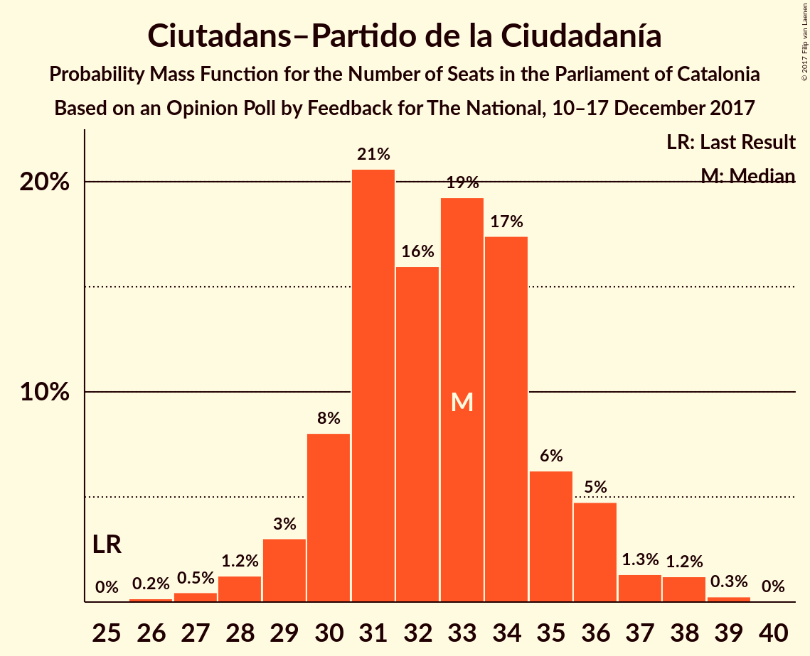
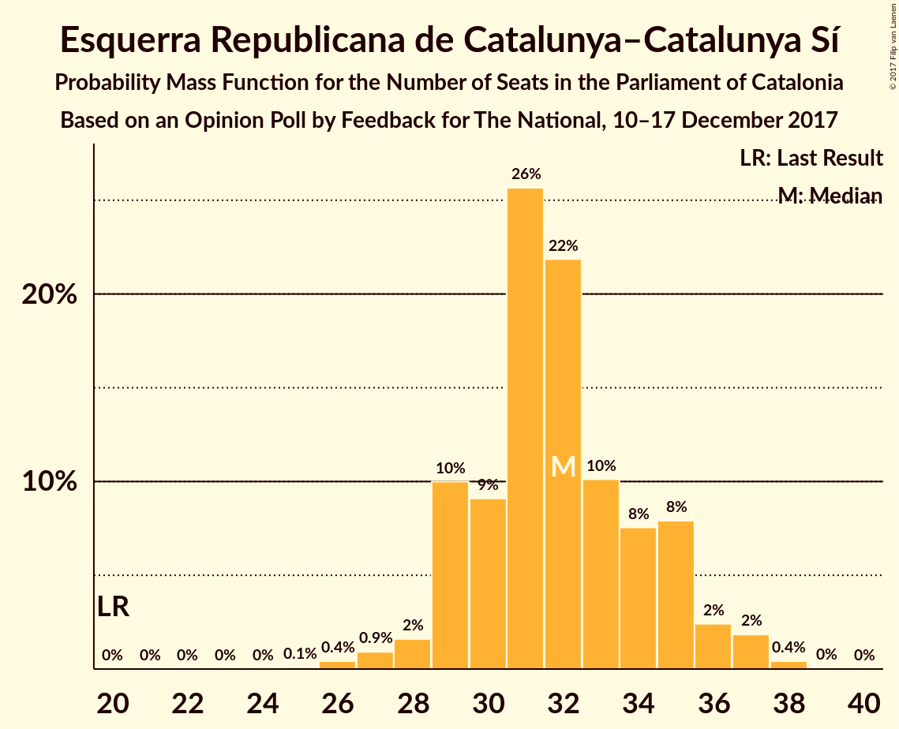
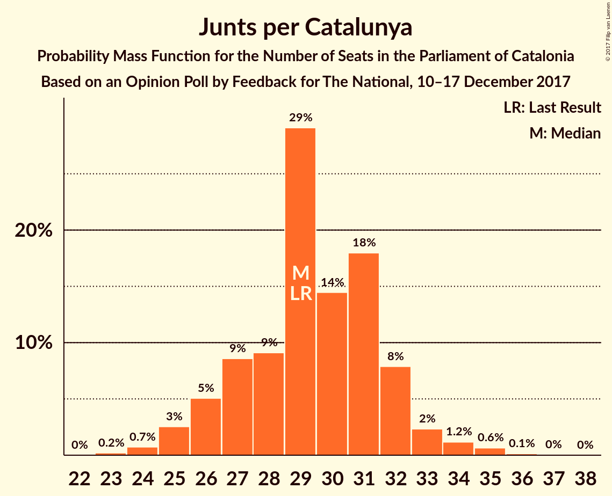
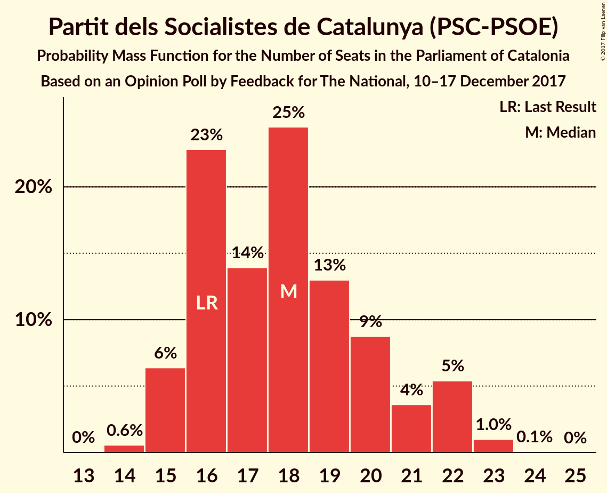
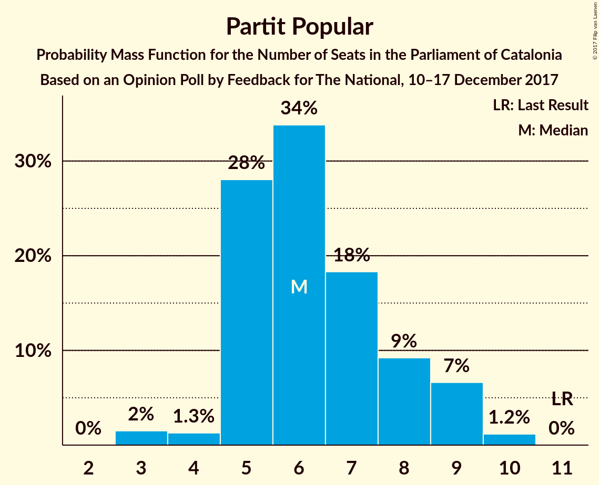

# Opinion Poll by Feedback for The National, 10–17 December 2017

<a href="#voting-intentions">Voting Intentions</a> | <a href="#seats">Seats</a> | <a href="#coalitions">Coalitions</a> | <a href="#technical-information">Technical Information</a>

## Voting Intentions

### Confidence Intervals

| Party | Last Result | Poll Result | 80% Confidence Interval | 90% Confidence Interval | 95% Confidence Interval | 99% Confidence Interval |
|:-----:|:-----------:|:-----------:|:-----------------------:|:-----------------------:|:-----------------------:|:-----------------------:|
| Ciutadans–Partido de la Ciudadanía | 17.9% | 24.0% | 22.3–25.8% |21.9–26.3% |21.4–26.7% |20.7–27.6% |
| Esquerra Republicana de Catalunya–Catalunya Sí | 39.6% | 21.1% | 19.5–22.8% |19.1–23.3% |18.7–23.7% |17.9–24.6% |
| Junts per Catalunya | 39.6% | 19.5% | 18.0–21.2% |17.5–21.7% |17.2–22.1% |16.4–22.9% |
| Partit dels Socialistes de Catalunya (PSC-PSOE) | 12.7% | 14.1% | 12.8–15.6% |12.4–16.0% |12.1–16.4% |11.5–17.1% |
| Candidatura d’Unitat Popular | 8.2% | 8.1% | 7.1–9.3% |6.8–9.7% |6.6–10.0% |6.1–10.6% |
| Catalunya en Comú | 8.9% | 6.8% | 5.9–7.9% |5.6–8.3% |5.4–8.5% |5.0–9.1% |
| Partit Popular | 8.5% | 5.7% | 4.9–6.8% |4.6–7.1% |4.4–7.3% |4.1–7.9% |

*Note:* The poll result column reflects the actual value used in the calculations. Published results may vary slightly, and in addition be rounded to fewer digits.

## Seats

### Confidence Intervals

| Party | Last Result | Median | 80% Confidence Interval | 90% Confidence Interval | 95% Confidence Interval | 99% Confidence Interval |
|:-----:|:-----------:|:------:|:-----------------------:|:-----------------------:|:-----------------------:|:-----------------------:|
| <a href="#ciutadans–partido-de-la-ciudadanía">Ciutadans–Partido de la Ciudadanía</a> | 25 | 33 | 30–35 |30–36 |29–37 |27–38 |
| <a href="#esquerra-republicana-de-catalunya–catalunya-sí">Esquerra Republicana de Catalunya–Catalunya Sí</a> | 20 | 32 | 29–35 |29–35 |28–36 |26–37 |
| <a href="#junts-per-catalunya">Junts per Catalunya</a> | 29 | 29 | 27–32 |26–32 |25–33 |24–35 |
| <a href="#partit-dels-socialistes-de-catalunya-(psc-psoe)">Partit dels Socialistes de Catalunya (PSC-PSOE)</a> | 16 | 18 | 16–21 |15–22 |15–22 |14–23 |
| <a href="#candidatura-d’unitat-popular">Candidatura d’Unitat Popular</a> | 10 | 10 | 9–12 |9–12 |8–12 |8–15 |
| <a href="#catalunya-en-comú">Catalunya en Comú</a> | 11 | 7 | 5–8 |5–9 |5–9 |5–11 |
| <a href="#partit-popular">Partit Popular</a> | 11 | 6 | 5–8 |5–9 |4–9 |3–10 |

### Ciutadans–Partido de la Ciudadanía

*For a full overview of the results for this party, see the [Ciutadans–Partido de la Ciudadanía](party-ciutadans–partidodelaciudadanía.html) page.*

| Number of Seats | Probability | Accumulated | Special Marks |
|:---------------:|:-----------:|:-----------:|:-------------:|
| 25 | 0% | 100% | Last Result |
| 26 | 0.2% | 100% |  |
| 27 | 0.5% | 99.8% |  |
| 28 | 1.2% | 99.4% |  |
| 29 | 3% | 98% |  |
| 30 | 8% | 95% |  |
| 31 | 21% | 87% |  |
| 32 | 16% | 66% |  |
| 33 | 19% | 50% | Median |
| 34 | 17% | 31% |  |
| 35 | 6% | 14% |  |
| 36 | 5% | 8% |  |
| 37 | 1.3% | 3% |  |
| 38 | 1.2% | 1.5% |  |
| 39 | 0.3% | 0.3% |  |
| 40 | 0% | 0% |  |

### Esquerra Republicana de Catalunya–Catalunya Sí

*For a full overview of the results for this party, see the [Esquerra Republicana de Catalunya–Catalunya Sí](party-esquerrarepublicanadecatalunya–catalunyasí.html) page.*

| Number of Seats | Probability | Accumulated | Special Marks |
|:---------------:|:-----------:|:-----------:|:-------------:|
| 20 | 0% | 100% | Last Result |
| 21 | 0% | 100% |  |
| 22 | 0% | 100% |  |
| 23 | 0% | 100% |  |
| 24 | 0% | 100% |  |
| 25 | 0.1% | 100% |  |
| 26 | 0.4% | 99.9% |  |
| 27 | 0.9% | 99.5% |  |
| 28 | 2% | 98.5% |  |
| 29 | 10% | 97% |  |
| 30 | 9% | 87% |  |
| 31 | 26% | 78% |  |
| 32 | 22% | 52% | Median |
| 33 | 10% | 30% |  |
| 34 | 8% | 20% |  |
| 35 | 8% | 13% |  |
| 36 | 2% | 5% |  |
| 37 | 2% | 2% |  |
| 38 | 0.4% | 0.5% |  |
| 39 | 0% | 0.1% |  |
| 40 | 0% | 0% |  |

### Junts per Catalunya

*For a full overview of the results for this party, see the [Junts per Catalunya](party-juntspercatalunya.html) page.*

| Number of Seats | Probability | Accumulated | Special Marks |
|:---------------:|:-----------:|:-----------:|:-------------:|
| 23 | 0.2% | 100% |  |
| 24 | 0.7% | 99.8% |  |
| 25 | 3% | 99.1% |  |
| 26 | 5% | 97% |  |
| 27 | 9% | 91% |  |
| 28 | 9% | 83% |  |
| 29 | 29% | 74% | Last Result, Median |
| 30 | 14% | 45% |  |
| 31 | 18% | 30% |  |
| 32 | 8% | 12% |  |
| 33 | 2% | 4% |  |
| 34 | 1.2% | 2% |  |
| 35 | 0.6% | 0.8% |  |
| 36 | 0.1% | 0.2% |  |
| 37 | 0% | 0.1% |  |
| 38 | 0% | 0% |  |

### Partit dels Socialistes de Catalunya (PSC-PSOE)

*For a full overview of the results for this party, see the [Partit dels Socialistes de Catalunya (PSC-PSOE)](party-partitdelssocialistesdecatalunyapsc-psoe.html) page.*

| Number of Seats | Probability | Accumulated | Special Marks |
|:---------------:|:-----------:|:-----------:|:-------------:|
| 14 | 0.6% | 100% |  |
| 15 | 6% | 99.4% |  |
| 16 | 23% | 93% | Last Result |
| 17 | 14% | 70% |  |
| 18 | 25% | 56% | Median |
| 19 | 13% | 32% |  |
| 20 | 9% | 19% |  |
| 21 | 4% | 10% |  |
| 22 | 5% | 6% |  |
| 23 | 1.0% | 1.1% |  |
| 24 | 0.1% | 0.1% |  |
| 25 | 0% | 0% |  |

### Candidatura d’Unitat Popular

*For a full overview of the results for this party, see the [Candidatura d’Unitat Popular](party-candidaturad’unitatpopular.html) page.*

| Number of Seats | Probability | Accumulated | Special Marks |
|:---------------:|:-----------:|:-----------:|:-------------:|
| 8 | 3% | 100% |  |
| 9 | 32% | 96% |  |
| 10 | 43% | 64% | Last Result, Median |
| 11 | 7% | 21% |  |
| 12 | 12% | 14% |  |
| 13 | 0.8% | 2% |  |
| 14 | 0.6% | 1.2% |  |
| 15 | 0.5% | 0.6% |  |
| 16 | 0.1% | 0.1% |  |
| 17 | 0% | 0% |  |

### Catalunya en Comú

*For a full overview of the results for this party, see the [Catalunya en Comú](party-catalunyaencomú.html) page.*

| Number of Seats | Probability | Accumulated | Special Marks |
|:---------------:|:-----------:|:-----------:|:-------------:|
| 4 | 0.4% | 100% |  |
| 5 | 12% | 99.6% |  |
| 6 | 20% | 88% |  |
| 7 | 23% | 68% | Median |
| 8 | 35% | 45% |  |
| 9 | 8% | 10% |  |
| 10 | 0.7% | 1.3% |  |
| 11 | 0.6% | 0.6% | Last Result |
| 12 | 0% | 0% |  |

### Partit Popular

*For a full overview of the results for this party, see the [Partit Popular](party-partitpopular.html) page.*

| Number of Seats | Probability | Accumulated | Special Marks |
|:---------------:|:-----------:|:-----------:|:-------------:|
| 3 | 2% | 100% |  |
| 4 | 1.3% | 98% |  |
| 5 | 28% | 97% |  |
| 6 | 34% | 69% | Median |
| 7 | 18% | 35% |  |
| 8 | 9% | 17% |  |
| 9 | 7% | 8% |  |
| 10 | 1.2% | 1.2% |  |
| 11 | 0% | 0% | Last Result |

## Coalitions

### Confidence Intervals

| Coalition | Last Result | Median | Majority? | 80% Confidence Interval | 90% Confidence Interval | 95% Confidence Interval | 99% Confidence Interval |
|:---------:|:-----------:|:------:|:---------:|:-----------------------:|:-----------------------:|:-----------------------:|:-----------------------:|
| Esquerra Republicana de Catalunya–Catalunya Sí – Junts per Catalunya – Candidatura d’Unitat Popular | 59 | 71 | 94% | 68–75 | 67–75 | 66–76 | 65–77 |
| Esquerra Republicana de Catalunya–Catalunya Sí – Junts per Catalunya – Catalunya en Comú | 60 | 68 | 65% | 65–71 | 64–72 | 63–73 | 62–75 |
| Ciutadans–Partido de la Ciudadanía – Partit dels Socialistes de Catalunya (PSC-PSOE) – Catalunya en Comú – Partit Popular | 63 | 64 | 6% | 60–67 | 60–68 | 59–69 | 58–70 |
| Esquerra Republicana de Catalunya–Catalunya Sí – Junts per Catalunya | 49 | 61 | 0.4% | 58–64 | 57–65 | 56–66 | 55–67 |
| Esquerra Republicana de Catalunya–Catalunya Sí – Partit dels Socialistes de Catalunya (PSC-PSOE) – Catalunya en Comú | 47 | 57 | 0% | 54–60 | 53–61 | 52–62 | 50–63 |
| Ciutadans–Partido de la Ciudadanía – Partit dels Socialistes de Catalunya (PSC-PSOE) – Partit Popular | 52 | 57 | 0% | 54–60 | 53–61 | 52–62 | 50–63 |

### Esquerra Republicana de Catalunya–Catalunya Sí – Junts per Catalunya – Candidatura d’Unitat Popular

| Number of Seats | Probability | Accumulated | Special Marks |
|:---------------:|:-----------:|:-----------:|:-------------:|
| 59 | 0% | 100% | Last Result |
| 60 | 0% | 100% |  |
| 61 | 0% | 100% |  |
| 62 | 0% | 100% |  |
| 63 | 0.1% | 100% |  |
| 64 | 0.3% | 99.9% |  |
| 65 | 0.8% | 99.6% |  |
| 66 | 2% | 98.8% |  |
| 67 | 3% | 97% |  |
| 68 | 6% | 94% | Majority |
| 69 | 11% | 88% |  |
| 70 | 16% | 77% |  |
| 71 | 17% | 61% | Median |
| 72 | 15% | 43% |  |
| 73 | 11% | 28% |  |
| 74 | 8% | 18% |  |
| 75 | 5% | 10% |  |
| 76 | 3% | 5% |  |
| 77 | 1.3% | 2% |  |
| 78 | 0.3% | 0.4% |  |
| 79 | 0.1% | 0.1% |  |
| 80 | 0% | 0% |  |

### Esquerra Republicana de Catalunya–Catalunya Sí – Junts per Catalunya – Catalunya en Comú

| Number of Seats | Probability | Accumulated | Special Marks |
|:---------------:|:-----------:|:-----------:|:-------------:|
| 60 | 0.1% | 100% | Last Result |
| 61 | 0.3% | 99.9% |  |
| 62 | 0.9% | 99.6% |  |
| 63 | 2% | 98.7% |  |
| 64 | 4% | 97% |  |
| 65 | 6% | 93% |  |
| 66 | 10% | 88% |  |
| 67 | 13% | 78% |  |
| 68 | 18% | 65% | Median, Majority |
| 69 | 15% | 47% |  |
| 70 | 13% | 32% |  |
| 71 | 9% | 18% |  |
| 72 | 5% | 10% |  |
| 73 | 3% | 5% |  |
| 74 | 1.3% | 2% |  |
| 75 | 0.5% | 0.6% |  |
| 76 | 0.1% | 0.1% |  |
| 77 | 0% | 0% |  |

### Ciutadans–Partido de la Ciudadanía – Partit dels Socialistes de Catalunya (PSC-PSOE) – Catalunya en Comú – Partit Popular

| Number of Seats | Probability | Accumulated | Special Marks |
|:---------------:|:-----------:|:-----------:|:-------------:|
| 56 | 0.1% | 100% |  |
| 57 | 0.3% | 99.9% |  |
| 58 | 1.3% | 99.6% |  |
| 59 | 3% | 98% |  |
| 60 | 5% | 95% |  |
| 61 | 8% | 90% |  |
| 62 | 11% | 82% |  |
| 63 | 15% | 72% | Last Result |
| 64 | 17% | 57% | Median |
| 65 | 16% | 39% |  |
| 66 | 11% | 23% |  |
| 67 | 6% | 12% |  |
| 68 | 3% | 6% | Majority |
| 69 | 2% | 3% |  |
| 70 | 0.8% | 1.2% |  |
| 71 | 0.3% | 0.4% |  |
| 72 | 0.1% | 0.1% |  |
| 73 | 0% | 0% |  |

### Esquerra Republicana de Catalunya–Catalunya Sí – Junts per Catalunya

| Number of Seats | Probability | Accumulated | Special Marks |
|:---------------:|:-----------:|:-----------:|:-------------:|
| 49 | 0% | 100% | Last Result |
| 50 | 0% | 100% |  |
| 51 | 0% | 100% |  |
| 52 | 0% | 100% |  |
| 53 | 0.1% | 100% |  |
| 54 | 0.3% | 99.9% |  |
| 55 | 0.9% | 99.6% |  |
| 56 | 2% | 98.7% |  |
| 57 | 3% | 97% |  |
| 58 | 6% | 94% |  |
| 59 | 9% | 87% |  |
| 60 | 17% | 78% |  |
| 61 | 19% | 61% | Median |
| 62 | 13% | 42% |  |
| 63 | 12% | 29% |  |
| 64 | 7% | 17% |  |
| 65 | 5% | 10% |  |
| 66 | 3% | 4% |  |
| 67 | 1.3% | 2% |  |
| 68 | 0.3% | 0.4% | Majority |
| 69 | 0.1% | 0.1% |  |
| 70 | 0% | 0% |  |

### Esquerra Republicana de Catalunya–Catalunya Sí – Partit dels Socialistes de Catalunya (PSC-PSOE) – Catalunya en Comú

| Number of Seats | Probability | Accumulated | Special Marks |
|:---------------:|:-----------:|:-----------:|:-------------:|
| 47 | 0% | 100% | Last Result |
| 48 | 0% | 100% |  |
| 49 | 0.2% | 100% |  |
| 50 | 0.3% | 99.8% |  |
| 51 | 0.9% | 99.5% |  |
| 52 | 2% | 98.6% |  |
| 53 | 5% | 97% |  |
| 54 | 8% | 92% |  |
| 55 | 16% | 84% |  |
| 56 | 16% | 69% |  |
| 57 | 15% | 53% | Median |
| 58 | 13% | 38% |  |
| 59 | 10% | 25% |  |
| 60 | 7% | 15% |  |
| 61 | 4% | 7% |  |
| 62 | 2% | 3% |  |
| 63 | 0.7% | 1.1% |  |
| 64 | 0.3% | 0.4% |  |
| 65 | 0.1% | 0.2% |  |
| 66 | 0% | 0% |  |

### Ciutadans–Partido de la Ciudadanía – Partit dels Socialistes de Catalunya (PSC-PSOE) – Partit Popular

| Number of Seats | Probability | Accumulated | Special Marks |
|:---------------:|:-----------:|:-----------:|:-------------:|
| 49 | 0.1% | 100% |  |
| 50 | 0.4% | 99.9% |  |
| 51 | 1.2% | 99.4% |  |
| 52 | 3% | 98% | Last Result |
| 53 | 5% | 95% |  |
| 54 | 9% | 90% |  |
| 55 | 13% | 82% |  |
| 56 | 16% | 69% |  |
| 57 | 17% | 53% | Median |
| 58 | 13% | 36% |  |
| 59 | 10% | 22% |  |
| 60 | 6% | 13% |  |
| 61 | 3% | 6% |  |
| 62 | 2% | 3% |  |
| 63 | 0.7% | 1.1% |  |
| 64 | 0.3% | 0.4% |  |
| 65 | 0.1% | 0.1% |  |
| 66 | 0% | 0% |  |

## Technical Information

### Opinion Poll

+ **Polling firm:** Feedback
+ **Commissioner(s):** The National
+ **Fieldwork period:** 10–17 December 2017

### Calculations

+ **Sample size:** 1000
+ **Simulations done:** 8,388,608
+ **Error estimate:** 0.66%

