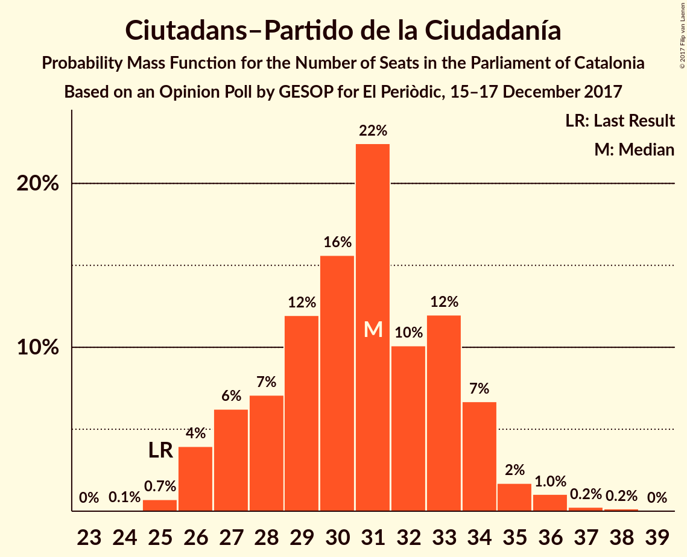
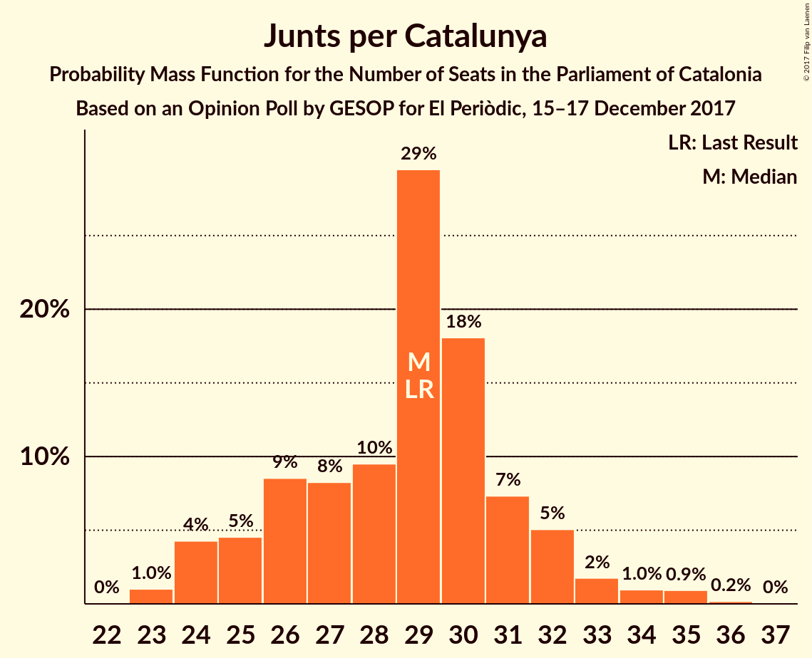
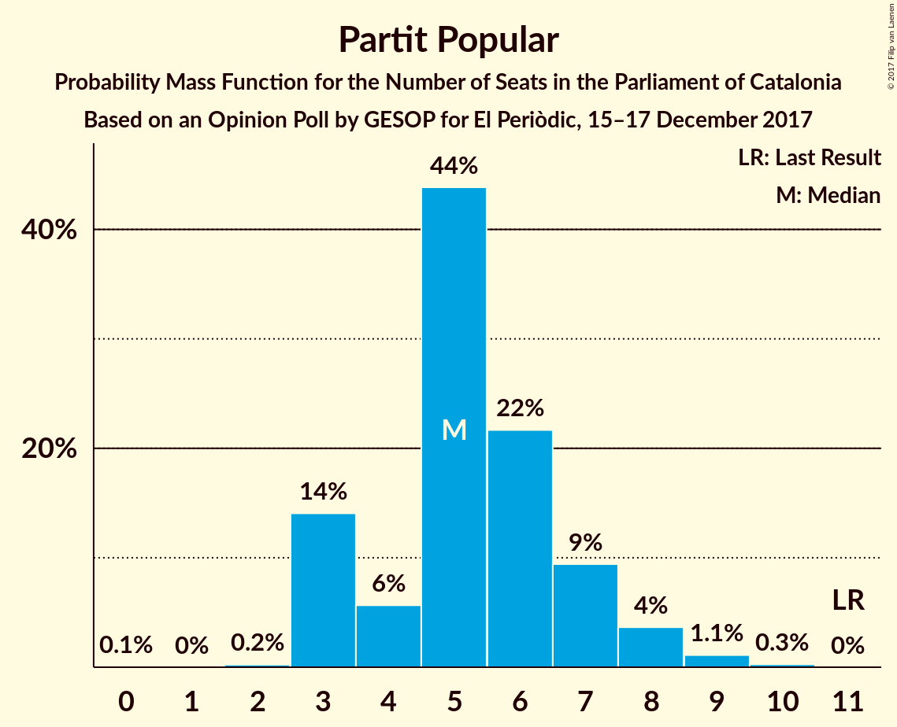

# Opinion Poll by GESOP for El Periòdic, 15–17 December 2017

<a href="#voting-intentions">Voting Intentions</a> | <a href="#seats">Seats</a> | <a href="#coalitions">Coalitions</a> | <a href="#technical-information">Technical Information</a>

## Voting Intentions

### Confidence Intervals

| Party | Last Result | Poll Result | 80% Confidence Interval | 90% Confidence Interval | 95% Confidence Interval | 99% Confidence Interval |
|:-----:|:-----------:|:-----------:|:-----------------------:|:-----------------------:|:-----------------------:|:-----------------------:|
| Ciutadans–Partido de la Ciudadanía | 17.9% | 22.5% | 20.7–24.5% |20.2–25.0% |19.7–25.5% |18.9–26.5% |
| Esquerra Republicana de Catalunya–Catalunya Sí | 39.6% | 21.2% | 19.5–23.2% |19.0–23.7% |18.5–24.2% |17.7–25.2% |
| Junts per Catalunya | 39.6% | 19.0% | 17.3–20.9% |16.8–21.4% |16.4–21.9% |15.7–22.8% |
| Partit dels Socialistes de Catalunya (PSC-PSOE) | 12.7% | 15.9% | 14.3–17.6% |13.9–18.1% |13.5–18.6% |12.8–19.4% |
| Catalunya en Comú | 8.9% | 9.0% | 7.8–10.4% |7.5–10.8% |7.2–11.2% |6.7–11.9% |
| Candidatura d’Unitat Popular | 8.2% | 5.5% | 4.6–6.7% |4.3–7.0% |4.1–7.3% |3.7–7.9% |
| Partit Popular | 8.5% | 5.0% | 4.1–6.1% |3.9–6.5% |3.7–6.8% |3.3–7.3% |

*Note:* The poll result column reflects the actual value used in the calculations. Published results may vary slightly, and in addition be rounded to fewer digits.

## Seats

### Confidence Intervals

| Party | Last Result | Median | 80% Confidence Interval | 90% Confidence Interval | 95% Confidence Interval | 99% Confidence Interval |
|:-----:|:-----------:|:------:|:-----------------------:|:-----------------------:|:-----------------------:|:-----------------------:|
| <a href="#ciutadans–partido-de-la-ciudadanía">Ciutadans–Partido de la Ciudadanía</a> | 25 | 31 | 27–33 |27–34 |26–35 |25–36 |
| <a href="#esquerra-republicana-de-catalunya–catalunya-sí">Esquerra Republicana de Catalunya–Catalunya Sí</a> | 20 | 32 | 29–35 |29–36 |29–37 |27–38 |
| <a href="#junts-per-catalunya">Junts per Catalunya</a> | 29 | 29 | 25–31 |24–32 |24–33 |23–35 |
| <a href="#partit-dels-socialistes-de-catalunya-(psc-psoe)">Partit dels Socialistes de Catalunya (PSC-PSOE)</a> | 16 | 22 | 18–23 |17–24 |16–24 |16–25 |
| <a href="#catalunya-en-comú">Catalunya en Comú</a> | 11 | 10 | 8–12 |8–13 |8–14 |7–15 |
| <a href="#candidatura-d’unitat-popular">Candidatura d’Unitat Popular</a> | 10 | 8 | 4–9 |3–9 |3–9 |3–10 |
| <a href="#partit-popular">Partit Popular</a> | 11 | 5 | 3–7 |3–7 |3–8 |3–9 |

### Ciutadans–Partido de la Ciudadanía

*For a full overview of the results for this party, see the [Ciutadans–Partido de la Ciudadanía](party-ciutadans–partidodelaciudadanía.html) page.*

| Number of Seats | Probability | Accumulated | Special Marks |
|:---------------:|:-----------:|:-----------:|:-------------:|
| 24 | 0.1% | 100% |  |
| 25 | 0.7% | 99.9% | Last Result |
| 26 | 4% | 99.2% |  |
| 27 | 7% | 95% |  |
| 28 | 7% | 88% |  |
| 29 | 12% | 81% |  |
| 30 | 15% | 69% |  |
| 31 | 21% | 54% | Median |
| 32 | 10% | 34% |  |
| 33 | 14% | 24% |  |
| 34 | 6% | 10% |  |
| 35 | 2% | 3% |  |
| 36 | 1.0% | 1.5% |  |
| 37 | 0.3% | 0.5% |  |
| 38 | 0.1% | 0.2% |  |
| 39 | 0% | 0% |  |

### Esquerra Republicana de Catalunya–Catalunya Sí

*For a full overview of the results for this party, see the [Esquerra Republicana de Catalunya–Catalunya Sí](party-esquerrarepublicanadecatalunya–catalunyasí.html) page.*

| Number of Seats | Probability | Accumulated | Special Marks |
|:---------------:|:-----------:|:-----------:|:-------------:|
| 20 | 0% | 100% | Last Result |
| 21 | 0% | 100% |  |
| 22 | 0% | 100% |  |
| 23 | 0% | 100% |  |
| 24 | 0.1% | 100% |  |
| 25 | 0.1% | 99.9% |  |
| 26 | 0.3% | 99.8% |  |
| 27 | 0.5% | 99.5% |  |
| 28 | 1.2% | 99.0% |  |
| 29 | 15% | 98% |  |
| 30 | 10% | 83% |  |
| 31 | 6% | 73% |  |
| 32 | 24% | 67% | Median |
| 33 | 15% | 43% |  |
| 34 | 11% | 28% |  |
| 35 | 9% | 17% |  |
| 36 | 3% | 8% |  |
| 37 | 3% | 5% |  |
| 38 | 2% | 2% |  |
| 39 | 0.3% | 0.3% |  |
| 40 | 0% | 0.1% |  |
| 41 | 0% | 0% |  |

### Junts per Catalunya

*For a full overview of the results for this party, see the [Junts per Catalunya](party-juntspercatalunya.html) page.*

| Number of Seats | Probability | Accumulated | Special Marks |
|:---------------:|:-----------:|:-----------:|:-------------:|
| 22 | 0% | 100% |  |
| 23 | 1.1% | 99.9% |  |
| 24 | 4% | 98.9% |  |
| 25 | 5% | 95% |  |
| 26 | 9% | 90% |  |
| 27 | 9% | 80% |  |
| 28 | 9% | 72% |  |
| 29 | 28% | 63% | Last Result, Median |
| 30 | 20% | 35% |  |
| 31 | 6% | 15% |  |
| 32 | 4% | 9% |  |
| 33 | 2% | 5% |  |
| 34 | 1.2% | 2% |  |
| 35 | 1.0% | 1.2% |  |
| 36 | 0.2% | 0.2% |  |
| 37 | 0% | 0% |  |

### Partit dels Socialistes de Catalunya (PSC-PSOE)

*For a full overview of the results for this party, see the [Partit dels Socialistes de Catalunya (PSC-PSOE)](party-partitdelssocialistesdecatalunyapsc-psoe.html) page.*

| Number of Seats | Probability | Accumulated | Special Marks |
|:---------------:|:-----------:|:-----------:|:-------------:|
| 15 | 0.2% | 100% |  |
| 16 | 2% | 99.8% | Last Result |
| 17 | 7% | 97% |  |
| 18 | 6% | 91% |  |
| 19 | 10% | 85% |  |
| 20 | 8% | 75% |  |
| 21 | 9% | 67% |  |
| 22 | 29% | 57% | Median |
| 23 | 20% | 29% |  |
| 24 | 7% | 9% |  |
| 25 | 2% | 2% |  |
| 26 | 0.2% | 0.3% |  |
| 27 | 0.1% | 0.1% |  |
| 28 | 0% | 0% |  |

### Catalunya en Comú

*For a full overview of the results for this party, see the [Catalunya en Comú](party-catalunyaencomú.html) page.*

| Number of Seats | Probability | Accumulated | Special Marks |
|:---------------:|:-----------:|:-----------:|:-------------:|
| 6 | 0.3% | 100% |  |
| 7 | 0.6% | 99.7% |  |
| 8 | 10% | 99.1% |  |
| 9 | 31% | 89% |  |
| 10 | 11% | 59% | Median |
| 11 | 25% | 47% | Last Result |
| 12 | 14% | 23% |  |
| 13 | 4% | 8% |  |
| 14 | 4% | 4% |  |
| 15 | 0.4% | 0.5% |  |
| 16 | 0.1% | 0.1% |  |
| 17 | 0% | 0% |  |

### Candidatura d’Unitat Popular

*For a full overview of the results for this party, see the [Candidatura d’Unitat Popular](party-candidaturad’unitatpopular.html) page.*

| Number of Seats | Probability | Accumulated | Special Marks |
|:---------------:|:-----------:|:-----------:|:-------------:|
| 2 | 0% | 100% |  |
| 3 | 7% | 99.9% |  |
| 4 | 3% | 93% |  |
| 5 | 17% | 90% |  |
| 6 | 6% | 73% |  |
| 7 | 15% | 67% |  |
| 8 | 42% | 52% | Median |
| 9 | 9% | 10% |  |
| 10 | 0.7% | 0.8% | Last Result |
| 11 | 0% | 0% |  |

### Partit Popular

*For a full overview of the results for this party, see the [Partit Popular](party-partitpopular.html) page.*

| Number of Seats | Probability | Accumulated | Special Marks |
|:---------------:|:-----------:|:-----------:|:-------------:|
| 0 | 0.1% | 100% |  |
| 1 | 0% | 99.9% |  |
| 2 | 0.3% | 99.9% |  |
| 3 | 15% | 99.7% |  |
| 4 | 5% | 85% |  |
| 5 | 44% | 80% | Median |
| 6 | 21% | 37% |  |
| 7 | 10% | 15% |  |
| 8 | 4% | 5% |  |
| 9 | 1.1% | 1.4% |  |
| 10 | 0.3% | 0.3% |  |
| 11 | 0% | 0% | Last Result |

## Coalitions

### Confidence Intervals

| Coalition | Last Result | Median | Majority? | 80% Confidence Interval | 90% Confidence Interval | 95% Confidence Interval | 99% Confidence Interval |
|:---------:|:-----------:|:------:|:---------:|:-----------------------:|:-----------------------:|:-----------------------:|:-----------------------:|
| Esquerra Republicana de Catalunya–Catalunya Sí – Junts per Catalunya – Catalunya en Comú | 60 | 71 | 91% | 68–75 | 67–76 | 66–77 | 64–79 |
| Esquerra Republicana de Catalunya–Catalunya Sí – Junts per Catalunya – Candidatura d’Unitat Popular | 59 | 68 | 55% | 64–71 | 63–72 | 62–73 | 61–75 |
| Ciutadans–Partido de la Ciudadanía – Partit dels Socialistes de Catalunya (PSC-PSOE) – Catalunya en Comú – Partit Popular | 63 | 67 | 45% | 64–71 | 63–72 | 62–73 | 60–74 |
| Esquerra Republicana de Catalunya–Catalunya Sí – Partit dels Socialistes de Catalunya (PSC-PSOE) – Catalunya en Comú | 47 | 64 | 11% | 60–68 | 59–69 | 58–69 | 56–71 |
| Esquerra Republicana de Catalunya–Catalunya Sí – Junts per Catalunya | 49 | 61 | 1.0% | 57–64 | 56–66 | 55–67 | 54–68 |
| Ciutadans–Partido de la Ciudadanía – Partit dels Socialistes de Catalunya (PSC-PSOE) – Partit Popular | 52 | 57 | 0% | 53–61 | 52–61 | 51–62 | 49–64 |

### Esquerra Republicana de Catalunya–Catalunya Sí – Junts per Catalunya – Catalunya en Comú

| Number of Seats | Probability | Accumulated | Special Marks |
|:---------------:|:-----------:|:-----------:|:-------------:|
| 60 | 0% | 100% | Last Result |
| 61 | 0% | 100% |  |
| 62 | 0% | 100% |  |
| 63 | 0.1% | 99.9% |  |
| 64 | 0.4% | 99.8% |  |
| 65 | 1.2% | 99.4% |  |
| 66 | 3% | 98% |  |
| 67 | 5% | 95% |  |
| 68 | 7% | 91% | Majority |
| 69 | 13% | 84% |  |
| 70 | 15% | 72% |  |
| 71 | 14% | 57% | Median |
| 72 | 12% | 43% |  |
| 73 | 10% | 31% |  |
| 74 | 7% | 21% |  |
| 75 | 6% | 14% |  |
| 76 | 4% | 8% |  |
| 77 | 2% | 4% |  |
| 78 | 1.0% | 2% |  |
| 79 | 0.4% | 0.6% |  |
| 80 | 0.2% | 0.3% |  |
| 81 | 0.1% | 0.1% |  |
| 82 | 0% | 0% |  |

### Esquerra Republicana de Catalunya–Catalunya Sí – Junts per Catalunya – Candidatura d’Unitat Popular

| Number of Seats | Probability | Accumulated | Special Marks |
|:---------------:|:-----------:|:-----------:|:-------------:|
| 59 | 0.1% | 100% | Last Result |
| 60 | 0.3% | 99.8% |  |
| 61 | 0.6% | 99.5% |  |
| 62 | 2% | 98.9% |  |
| 63 | 5% | 97% |  |
| 64 | 5% | 92% |  |
| 65 | 8% | 87% |  |
| 66 | 12% | 78% |  |
| 67 | 11% | 66% |  |
| 68 | 12% | 55% | Majority |
| 69 | 16% | 43% | Median |
| 70 | 13% | 27% |  |
| 71 | 5% | 14% |  |
| 72 | 4% | 9% |  |
| 73 | 3% | 5% |  |
| 74 | 1.3% | 2% |  |
| 75 | 0.8% | 1.2% |  |
| 76 | 0.4% | 0.5% |  |
| 77 | 0.1% | 0.1% |  |
| 78 | 0% | 0% |  |

### Ciutadans–Partido de la Ciudadanía – Partit dels Socialistes de Catalunya (PSC-PSOE) – Catalunya en Comú – Partit Popular

| Number of Seats | Probability | Accumulated | Special Marks |
|:---------------:|:-----------:|:-----------:|:-------------:|
| 58 | 0.1% | 100% |  |
| 59 | 0.4% | 99.9% |  |
| 60 | 0.8% | 99.5% |  |
| 61 | 1.3% | 98.8% |  |
| 62 | 3% | 98% |  |
| 63 | 4% | 95% | Last Result |
| 64 | 5% | 91% |  |
| 65 | 13% | 86% |  |
| 66 | 16% | 73% |  |
| 67 | 12% | 57% |  |
| 68 | 11% | 45% | Median, Majority |
| 69 | 12% | 34% |  |
| 70 | 8% | 22% |  |
| 71 | 5% | 13% |  |
| 72 | 5% | 8% |  |
| 73 | 2% | 3% |  |
| 74 | 0.6% | 1.1% |  |
| 75 | 0.3% | 0.5% |  |
| 76 | 0.1% | 0.2% |  |
| 77 | 0% | 0% |  |

### Esquerra Republicana de Catalunya–Catalunya Sí – Partit dels Socialistes de Catalunya (PSC-PSOE) – Catalunya en Comú

| Number of Seats | Probability | Accumulated | Special Marks |
|:---------------:|:-----------:|:-----------:|:-------------:|
| 47 | 0% | 100% | Last Result |
| 48 | 0% | 100% |  |
| 49 | 0% | 100% |  |
| 50 | 0% | 100% |  |
| 51 | 0% | 100% |  |
| 52 | 0% | 100% |  |
| 53 | 0% | 100% |  |
| 54 | 0% | 100% |  |
| 55 | 0.1% | 100% |  |
| 56 | 0.4% | 99.8% |  |
| 57 | 1.3% | 99.4% |  |
| 58 | 2% | 98% |  |
| 59 | 5% | 96% |  |
| 60 | 6% | 92% |  |
| 61 | 8% | 85% |  |
| 62 | 12% | 78% |  |
| 63 | 14% | 66% |  |
| 64 | 14% | 51% | Median |
| 65 | 12% | 38% |  |
| 66 | 9% | 26% |  |
| 67 | 6% | 17% |  |
| 68 | 5% | 11% | Majority |
| 69 | 4% | 6% |  |
| 70 | 1.5% | 2% |  |
| 71 | 0.5% | 0.8% |  |
| 72 | 0.2% | 0.3% |  |
| 73 | 0.1% | 0.1% |  |
| 74 | 0% | 0% |  |

### Esquerra Republicana de Catalunya–Catalunya Sí – Junts per Catalunya

| Number of Seats | Probability | Accumulated | Special Marks |
|:---------------:|:-----------:|:-----------:|:-------------:|
| 49 | 0% | 100% | Last Result |
| 50 | 0% | 100% |  |
| 51 | 0% | 100% |  |
| 52 | 0.1% | 100% |  |
| 53 | 0.1% | 99.9% |  |
| 54 | 0.7% | 99.8% |  |
| 55 | 3% | 99.1% |  |
| 56 | 3% | 96% |  |
| 57 | 4% | 94% |  |
| 58 | 11% | 90% |  |
| 59 | 11% | 79% |  |
| 60 | 8% | 68% |  |
| 61 | 16% | 59% | Median |
| 62 | 17% | 43% |  |
| 63 | 11% | 27% |  |
| 64 | 6% | 16% |  |
| 65 | 3% | 10% |  |
| 66 | 3% | 6% |  |
| 67 | 2% | 3% |  |
| 68 | 0.7% | 1.0% | Majority |
| 69 | 0.2% | 0.4% |  |
| 70 | 0.1% | 0.2% |  |
| 71 | 0% | 0.1% |  |
| 72 | 0% | 0% |  |

### Ciutadans–Partido de la Ciudadanía – Partit dels Socialistes de Catalunya (PSC-PSOE) – Partit Popular

| Number of Seats | Probability | Accumulated | Special Marks |
|:---------------:|:-----------:|:-----------:|:-------------:|
| 47 | 0% | 100% |  |
| 48 | 0.1% | 99.9% |  |
| 49 | 0.4% | 99.8% |  |
| 50 | 1.0% | 99.5% |  |
| 51 | 2% | 98% |  |
| 52 | 3% | 97% | Last Result |
| 53 | 4% | 94% |  |
| 54 | 8% | 89% |  |
| 55 | 10% | 81% |  |
| 56 | 13% | 71% |  |
| 57 | 14% | 57% |  |
| 58 | 14% | 43% | Median |
| 59 | 10% | 30% |  |
| 60 | 9% | 20% |  |
| 61 | 7% | 11% |  |
| 62 | 3% | 4% |  |
| 63 | 1.0% | 2% |  |
| 64 | 0.4% | 0.6% |  |
| 65 | 0.2% | 0.3% |  |
| 66 | 0.1% | 0.1% |  |
| 67 | 0% | 0% |  |

## Technical Information

### Opinion Poll

+ **Polling firm:** GESOP
+ **Commissioner(s):** El Periòdic
+ **Fieldwork period:** 15–17 December 2017

### Calculations

+ **Sample size:** 800
+ **Simulations done:** 2,097,152
+ **Error estimate:** 0.49%

