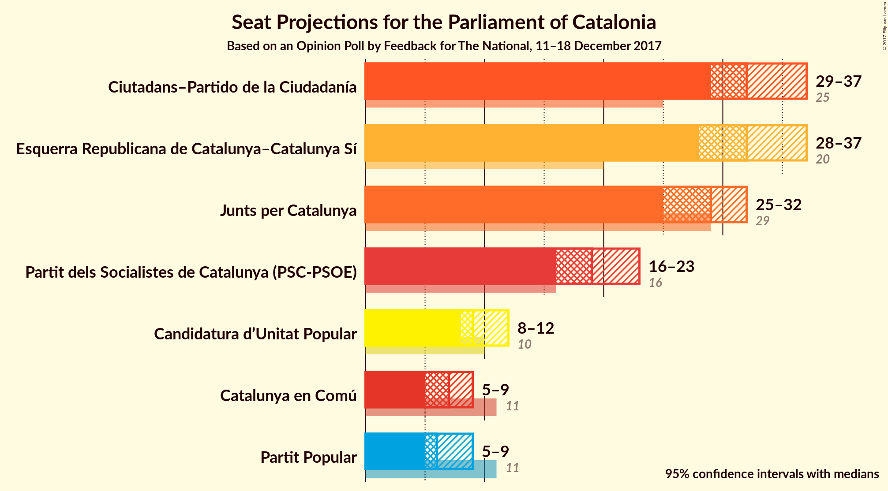
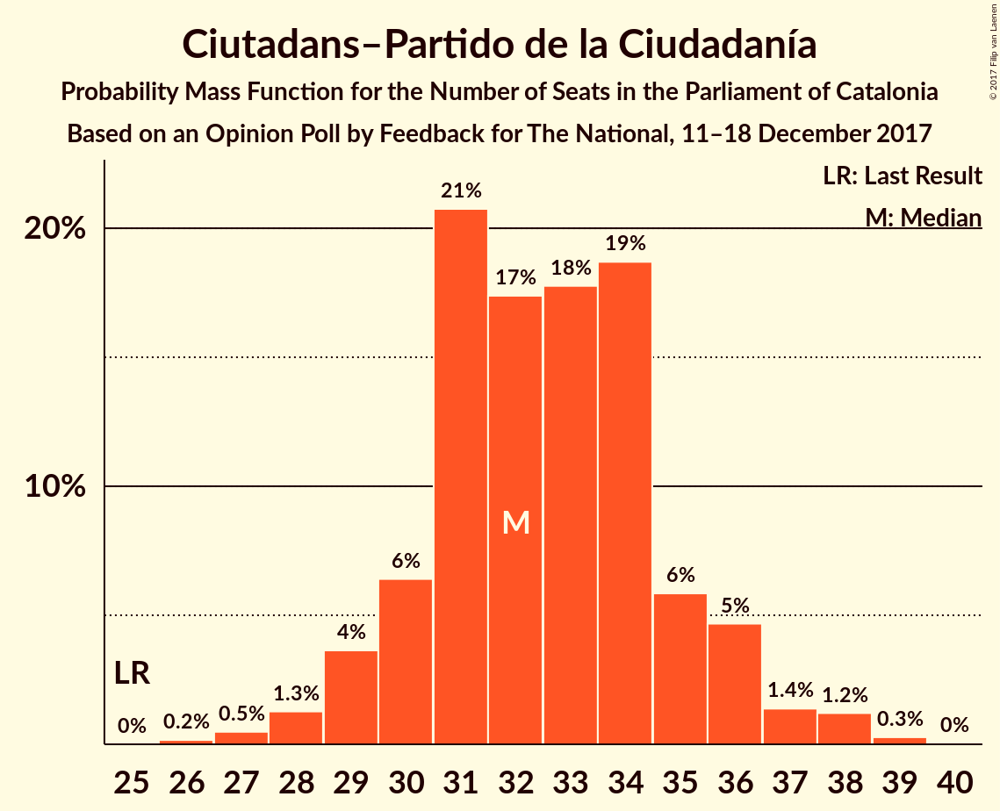
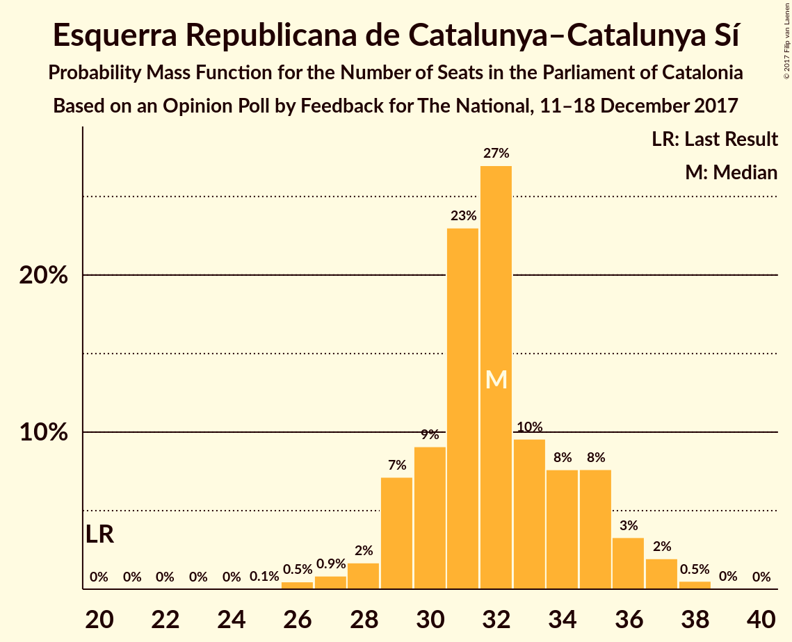
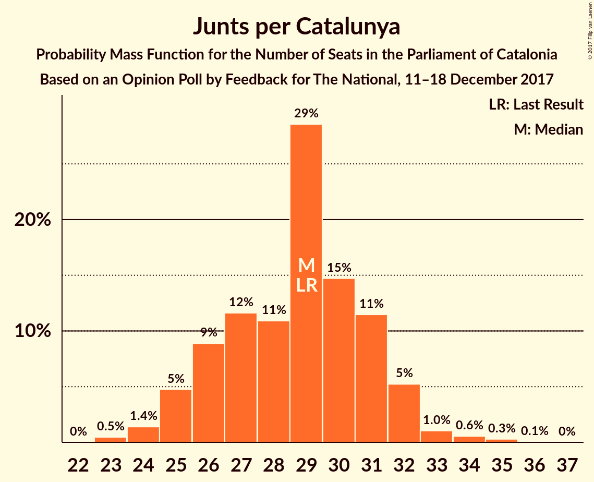
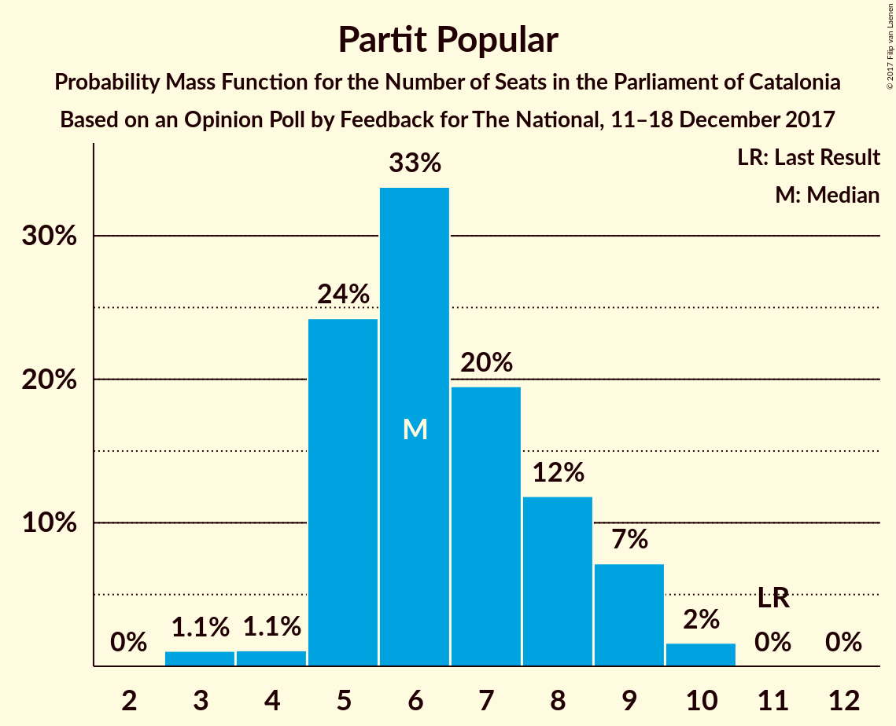

# Opinion Poll by Feedback for The National, 11–18 December 2017

<a href="#voting-intentions">Voting Intentions</a> | <a href="#seats">Seats</a> | <a href="#coalitions">Coalitions</a> | <a href="#technical-information">Technical Information</a>

## Voting Intentions

### Confidence Intervals

| Party | Last Result | Poll Result | 80% Confidence Interval | 90% Confidence Interval | 95% Confidence Interval | 99% Confidence Interval |
|:-----:|:-----------:|:-----------:|:-----------------------:|:-----------------------:|:-----------------------:|:-----------------------:|
| Ciutadans–Partido de la Ciudadanía | 17.9% | 24.0% | 22.3–25.8% |21.9–26.3% |21.4–26.7% |20.7–27.6% |
| Esquerra Republicana de Catalunya–Catalunya Sí | 39.6% | 21.2% | 19.6–22.9% |19.2–23.4% |18.8–23.9% |18.0–24.7% |
| Junts per Catalunya | 39.6% | 19.1% | 17.6–20.8% |17.1–21.2% |16.8–21.7% |16.1–22.5% |
| Partit dels Socialistes de Catalunya (PSC-PSOE) | 12.7% | 14.7% | 13.3–16.2% |13.0–16.7% |12.6–17.0% |12.0–17.8% |
| Candidatura d’Unitat Popular | 8.2% | 7.6% | 6.6–8.8% |6.3–9.1% |6.1–9.4% |5.7–10.0% |
| Catalunya en Comú | 8.9% | 6.7% | 5.8–7.8% |5.5–8.2% |5.3–8.4% |4.9–9.0% |
| Partit Popular | 8.5% | 5.8% | 5.0–6.9% |4.7–7.2% |4.5–7.4% |4.1–8.0% |

*Note:* The poll result column reflects the actual value used in the calculations. Published results may vary slightly, and in addition be rounded to fewer digits.

## Seats

### Confidence Intervals

| Party | Last Result | Median | 80% Confidence Interval | 90% Confidence Interval | 95% Confidence Interval | 99% Confidence Interval |
|:-----:|:-----------:|:------:|:-----------------------:|:-----------------------:|:-----------------------:|:-----------------------:|
| <a href="#ciutadans–partido-de-la-ciudadanía">Ciutadans–Partido de la Ciudadanía</a> | 25 | 33 | 30–35 |29–36 |29–37 |27–38 |
| <a href="#esquerra-republicana-de-catalunya–catalunya-sí">Esquerra Republicana de Catalunya–Catalunya Sí</a> | 20 | 32 | 29–35 |29–36 |28–37 |26–38 |
| <a href="#junts-per-catalunya">Junts per Catalunya</a> | 29 | 29 | 26–31 |25–32 |25–32 |24–34 |
| <a href="#partit-dels-socialistes-de-catalunya-(psc-psoe)">Partit dels Socialistes de Catalunya (PSC-PSOE)</a> | 16 | 19 | 16–22 |16–22 |16–23 |15–23 |
| <a href="#candidatura-d’unitat-popular">Candidatura d’Unitat Popular</a> | 10 | 9 | 8–10 |8–11 |8–12 |8–12 |
| <a href="#catalunya-en-comú">Catalunya en Comú</a> | 11 | 7 | 5–8 |5–9 |5–9 |4–10 |
| <a href="#partit-popular">Partit Popular</a> | 11 | 6 | 5–8 |5–9 |5–9 |3–10 |

### Ciutadans–Partido de la Ciudadanía

*For a full overview of the results for this party, see the [Ciutadans–Partido de la Ciudadanía](party-ciutadans–partidodelaciudadanía.html) page.*

| Number of Seats | Probability | Accumulated | Special Marks |
|:---------------:|:-----------:|:-----------:|:-------------:|
| 25 | 0% | 100% | Last Result |
| 26 | 0.2% | 100% |  |
| 27 | 0.5% | 99.8% |  |
| 28 | 1.3% | 99.3% |  |
| 29 | 4% | 98% |  |
| 30 | 7% | 94% |  |
| 31 | 21% | 88% |  |
| 32 | 17% | 67% |  |
| 33 | 18% | 50% | Median |
| 34 | 19% | 33% |  |
| 35 | 6% | 13% |  |
| 36 | 5% | 7% |  |
| 37 | 1.4% | 3% |  |
| 38 | 1.2% | 2% |  |
| 39 | 0.3% | 0.3% |  |
| 40 | 0% | 0% |  |

### Esquerra Republicana de Catalunya–Catalunya Sí

*For a full overview of the results for this party, see the [Esquerra Republicana de Catalunya–Catalunya Sí](party-esquerrarepublicanadecatalunya–catalunyasí.html) page.*

| Number of Seats | Probability | Accumulated | Special Marks |
|:---------------:|:-----------:|:-----------:|:-------------:|
| 20 | 0% | 100% | Last Result |
| 21 | 0% | 100% |  |
| 22 | 0% | 100% |  |
| 23 | 0% | 100% |  |
| 24 | 0% | 100% |  |
| 25 | 0.1% | 100% |  |
| 26 | 0.5% | 99.9% |  |
| 27 | 0.8% | 99.4% |  |
| 28 | 2% | 98.5% |  |
| 29 | 7% | 97% |  |
| 30 | 10% | 89% |  |
| 31 | 22% | 80% |  |
| 32 | 26% | 58% | Median |
| 33 | 11% | 32% |  |
| 34 | 8% | 21% |  |
| 35 | 8% | 13% |  |
| 36 | 3% | 6% |  |
| 37 | 2% | 3% |  |
| 38 | 0.6% | 0.6% |  |
| 39 | 0% | 0.1% |  |
| 40 | 0% | 0% |  |

### Junts per Catalunya

*For a full overview of the results for this party, see the [Junts per Catalunya](party-juntspercatalunya.html) page.*

| Number of Seats | Probability | Accumulated | Special Marks |
|:---------------:|:-----------:|:-----------:|:-------------:|
| 23 | 0.5% | 100% |  |
| 24 | 1.4% | 99.5% |  |
| 25 | 4% | 98% |  |
| 26 | 9% | 94% |  |
| 27 | 11% | 84% |  |
| 28 | 11% | 73% |  |
| 29 | 29% | 62% | Last Result, Median |
| 30 | 14% | 33% |  |
| 31 | 12% | 19% |  |
| 32 | 5% | 7% |  |
| 33 | 1.1% | 2% |  |
| 34 | 0.6% | 0.9% |  |
| 35 | 0.3% | 0.4% |  |
| 36 | 0.1% | 0.1% |  |
| 37 | 0% | 0% |  |

### Partit dels Socialistes de Catalunya (PSC-PSOE)

*For a full overview of the results for this party, see the [Partit dels Socialistes de Catalunya (PSC-PSOE)](party-partitdelssocialistesdecatalunyapsc-psoe.html) page.*

| Number of Seats | Probability | Accumulated | Special Marks |
|:---------------:|:-----------:|:-----------:|:-------------:|
| 14 | 0.1% | 100% |  |
| 15 | 2% | 99.9% |  |
| 16 | 11% | 98% | Last Result |
| 17 | 10% | 86% |  |
| 18 | 24% | 77% |  |
| 19 | 18% | 52% | Median |
| 20 | 12% | 35% |  |
| 21 | 6% | 22% |  |
| 22 | 12% | 16% |  |
| 23 | 3% | 4% |  |
| 24 | 0.4% | 0.4% |  |
| 25 | 0% | 0% |  |

### Candidatura d’Unitat Popular

*For a full overview of the results for this party, see the [Candidatura d’Unitat Popular](party-candidaturad’unitatpopular.html) page.*

| Number of Seats | Probability | Accumulated | Special Marks |
|:---------------:|:-----------:|:-----------:|:-------------:|
| 5 | 0.1% | 100% |  |
| 6 | 0.1% | 99.9% |  |
| 7 | 0.2% | 99.9% |  |
| 8 | 11% | 99.6% |  |
| 9 | 46% | 88% | Median |
| 10 | 34% | 42% | Last Result |
| 11 | 3% | 8% |  |
| 12 | 4% | 5% |  |
| 13 | 0.2% | 0.5% |  |
| 14 | 0.1% | 0.3% |  |
| 15 | 0.1% | 0.1% |  |
| 16 | 0% | 0% |  |

### Catalunya en Comú

*For a full overview of the results for this party, see the [Catalunya en Comú](party-catalunyaencomú.html) page.*

| Number of Seats | Probability | Accumulated | Special Marks |
|:---------------:|:-----------:|:-----------:|:-------------:|
| 4 | 0.6% | 100% |  |
| 5 | 14% | 99.4% |  |
| 6 | 23% | 85% |  |
| 7 | 22% | 63% | Median |
| 8 | 33% | 41% |  |
| 9 | 7% | 8% |  |
| 10 | 0.5% | 0.9% |  |
| 11 | 0.4% | 0.4% | Last Result |
| 12 | 0% | 0% |  |

### Partit Popular

*For a full overview of the results for this party, see the [Partit Popular](party-partitpopular.html) page.*

| Number of Seats | Probability | Accumulated | Special Marks |
|:---------------:|:-----------:|:-----------:|:-------------:|
| 3 | 1.0% | 100% |  |
| 4 | 1.2% | 99.0% |  |
| 5 | 24% | 98% |  |
| 6 | 34% | 74% | Median |
| 7 | 19% | 40% |  |
| 8 | 12% | 21% |  |
| 9 | 7% | 9% |  |
| 10 | 2% | 2% |  |
| 11 | 0% | 0.1% | Last Result |
| 12 | 0% | 0% |  |

## Coalitions

### Confidence Intervals

| Coalition | Last Result | Median | Majority? | 80% Confidence Interval | 90% Confidence Interval | 95% Confidence Interval | 99% Confidence Interval |
|:---------:|:-----------:|:------:|:---------:|:-----------------------:|:-----------------------:|:-----------------------:|:-----------------------:|
| Esquerra Republicana de Catalunya–Catalunya Sí – Junts per Catalunya – Candidatura d’Unitat Popular | 59 | 70 | 86% | 67–73 | 66–74 | 65–75 | 64–77 |
| Esquerra Republicana de Catalunya–Catalunya Sí – Junts per Catalunya – Catalunya en Comú | 60 | 68 | 54% | 64–71 | 64–72 | 63–73 | 61–74 |
| Ciutadans–Partido de la Ciudadanía – Partit dels Socialistes de Catalunya (PSC-PSOE) – Catalunya en Comú – Partit Popular | 63 | 65 | 14% | 62–68 | 61–69 | 60–70 | 58–71 |
| Esquerra Republicana de Catalunya–Catalunya Sí – Junts per Catalunya | 49 | 61 | 0.3% | 58–64 | 57–65 | 56–66 | 54–67 |
| Esquerra Republicana de Catalunya–Catalunya Sí – Partit dels Socialistes de Catalunya (PSC-PSOE) – Catalunya en Comú | 47 | 58 | 0% | 55–61 | 54–62 | 53–63 | 51–64 |
| Ciutadans–Partido de la Ciudadanía – Partit dels Socialistes de Catalunya (PSC-PSOE) – Partit Popular | 52 | 58 | 0% | 55–61 | 54–62 | 53–63 | 51–64 |

### Esquerra Republicana de Catalunya–Catalunya Sí – Junts per Catalunya – Candidatura d’Unitat Popular

| Number of Seats | Probability | Accumulated | Special Marks |
|:---------------:|:-----------:|:-----------:|:-------------:|
| 59 | 0% | 100% | Last Result |
| 60 | 0% | 100% |  |
| 61 | 0% | 100% |  |
| 62 | 0.1% | 100% |  |
| 63 | 0.3% | 99.9% |  |
| 64 | 0.8% | 99.6% |  |
| 65 | 2% | 98.8% |  |
| 66 | 4% | 97% |  |
| 67 | 7% | 93% |  |
| 68 | 10% | 86% | Majority |
| 69 | 14% | 76% |  |
| 70 | 19% | 62% | Median |
| 71 | 16% | 43% |  |
| 72 | 10% | 27% |  |
| 73 | 7% | 17% |  |
| 74 | 5% | 9% |  |
| 75 | 2% | 4% |  |
| 76 | 1.2% | 2% |  |
| 77 | 0.5% | 0.6% |  |
| 78 | 0.1% | 0.1% |  |
| 79 | 0% | 0% |  |

### Esquerra Republicana de Catalunya–Catalunya Sí – Junts per Catalunya – Catalunya en Comú

| Number of Seats | Probability | Accumulated | Special Marks |
|:---------------:|:-----------:|:-----------:|:-------------:|
| 59 | 0.1% | 100% |  |
| 60 | 0.2% | 99.9% | Last Result |
| 61 | 0.5% | 99.8% |  |
| 62 | 1.2% | 99.2% |  |
| 63 | 3% | 98% |  |
| 64 | 6% | 95% |  |
| 65 | 9% | 89% |  |
| 66 | 11% | 81% |  |
| 67 | 15% | 69% |  |
| 68 | 17% | 54% | Median, Majority |
| 69 | 14% | 37% |  |
| 70 | 11% | 23% |  |
| 71 | 6% | 12% |  |
| 72 | 3% | 6% |  |
| 73 | 2% | 3% |  |
| 74 | 0.7% | 1.0% |  |
| 75 | 0.3% | 0.4% |  |
| 76 | 0.1% | 0.1% |  |
| 77 | 0% | 0% |  |

### Ciutadans–Partido de la Ciudadanía – Partit dels Socialistes de Catalunya (PSC-PSOE) – Catalunya en Comú – Partit Popular

| Number of Seats | Probability | Accumulated | Special Marks |
|:---------------:|:-----------:|:-----------:|:-------------:|
| 57 | 0.1% | 100% |  |
| 58 | 0.5% | 99.9% |  |
| 59 | 1.2% | 99.4% |  |
| 60 | 2% | 98% |  |
| 61 | 5% | 96% |  |
| 62 | 7% | 91% |  |
| 63 | 10% | 83% | Last Result |
| 64 | 16% | 73% |  |
| 65 | 19% | 57% | Median |
| 66 | 14% | 38% |  |
| 67 | 10% | 24% |  |
| 68 | 7% | 14% | Majority |
| 69 | 4% | 7% |  |
| 70 | 2% | 3% |  |
| 71 | 0.8% | 1.2% |  |
| 72 | 0.3% | 0.4% |  |
| 73 | 0.1% | 0.1% |  |
| 74 | 0% | 0% |  |

### Esquerra Republicana de Catalunya–Catalunya Sí – Junts per Catalunya

| Number of Seats | Probability | Accumulated | Special Marks |
|:---------------:|:-----------:|:-----------:|:-------------:|
| 49 | 0% | 100% | Last Result |
| 50 | 0% | 100% |  |
| 51 | 0% | 100% |  |
| 52 | 0% | 100% |  |
| 53 | 0.2% | 100% |  |
| 54 | 0.4% | 99.8% |  |
| 55 | 1.2% | 99.4% |  |
| 56 | 3% | 98% |  |
| 57 | 5% | 95% |  |
| 58 | 8% | 90% |  |
| 59 | 12% | 83% |  |
| 60 | 15% | 71% |  |
| 61 | 20% | 55% | Median |
| 62 | 14% | 36% |  |
| 63 | 9% | 21% |  |
| 64 | 6% | 13% |  |
| 65 | 4% | 7% |  |
| 66 | 2% | 3% |  |
| 67 | 0.8% | 1.1% |  |
| 68 | 0.2% | 0.3% | Majority |
| 69 | 0% | 0.1% |  |
| 70 | 0% | 0% |  |

### Esquerra Republicana de Catalunya–Catalunya Sí – Partit dels Socialistes de Catalunya (PSC-PSOE) – Catalunya en Comú

| Number of Seats | Probability | Accumulated | Special Marks |
|:---------------:|:-----------:|:-----------:|:-------------:|
| 47 | 0% | 100% | Last Result |
| 48 | 0% | 100% |  |
| 49 | 0% | 100% |  |
| 50 | 0.1% | 99.9% |  |
| 51 | 0.4% | 99.8% |  |
| 52 | 1.0% | 99.5% |  |
| 53 | 3% | 98% |  |
| 54 | 4% | 96% |  |
| 55 | 9% | 92% |  |
| 56 | 13% | 82% |  |
| 57 | 14% | 69% |  |
| 58 | 17% | 56% | Median |
| 59 | 13% | 39% |  |
| 60 | 11% | 26% |  |
| 61 | 7% | 15% |  |
| 62 | 5% | 8% |  |
| 63 | 2% | 3% |  |
| 64 | 0.9% | 1.4% |  |
| 65 | 0.3% | 0.4% |  |
| 66 | 0.1% | 0.2% |  |
| 67 | 0% | 0.1% |  |
| 68 | 0% | 0% | Majority |

### Ciutadans–Partido de la Ciudadanía – Partit dels Socialistes de Catalunya (PSC-PSOE) – Partit Popular

| Number of Seats | Probability | Accumulated | Special Marks |
|:---------------:|:-----------:|:-----------:|:-------------:|
| 50 | 0.1% | 100% |  |
| 51 | 0.4% | 99.8% |  |
| 52 | 1.2% | 99.4% | Last Result |
| 53 | 2% | 98% |  |
| 54 | 4% | 96% |  |
| 55 | 8% | 92% |  |
| 56 | 12% | 83% |  |
| 57 | 17% | 72% |  |
| 58 | 15% | 54% | Median |
| 59 | 14% | 40% |  |
| 60 | 10% | 25% |  |
| 61 | 7% | 15% |  |
| 62 | 5% | 8% |  |
| 63 | 2% | 3% |  |
| 64 | 0.8% | 1.3% |  |
| 65 | 0.3% | 0.4% |  |
| 66 | 0.1% | 0.2% |  |
| 67 | 0% | 0% |  |

## Technical Information

### Opinion Poll

+ **Polling firm:** Feedback
+ **Commissioner(s):** The National
+ **Fieldwork period:** 11–18 December 2017

### Calculations

+ **Sample size:** 1000
+ **Simulations done:** 4,194,304
+ **Error estimate:** 0.98%

