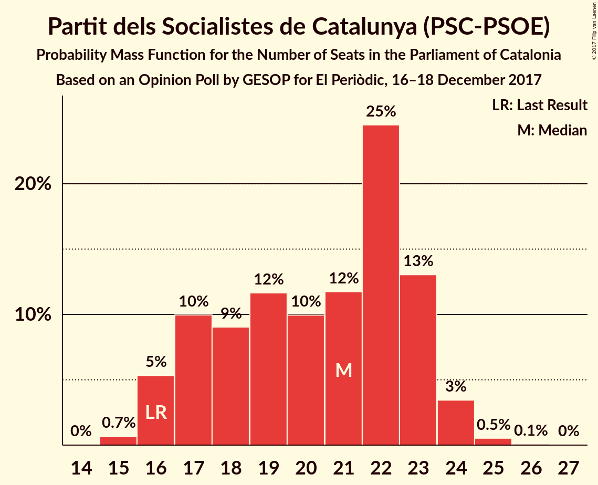

# Opinion Poll by GESOP for El Periòdic, 16–18 December 2017

<a href="#voting-intentions">Voting Intentions</a> | <a href="#seats">Seats</a> | <a href="#coalitions">Coalitions</a> | <a href="#technical-information">Technical Information</a>

## Voting Intentions

### Confidence Intervals

| Party | Last Result | Poll Result | 80% Confidence Interval | 90% Confidence Interval | 95% Confidence Interval | 99% Confidence Interval |
|:-----:|:-----------:|:-----------:|:-----------------------:|:-----------------------:|:-----------------------:|:-----------------------:|
| Esquerra Republicana de Catalunya–Catalunya Sí | 39.6% | 23.2% | 21.4–25.3% |20.9–25.8% |20.5–26.3% |19.6–27.3% |
| Ciutadans–Partido de la Ciudadanía | 17.9% | 23.2% | 21.4–25.3% |20.9–25.8% |20.5–26.3% |19.6–27.3% |
| Junts per Catalunya | 39.6% | 18.0% | 16.4–19.8% |15.9–20.4% |15.5–20.8% |14.7–21.7% |
| Partit dels Socialistes de Catalunya (PSC-PSOE) | 12.7% | 15.4% | 13.8–17.1% |13.4–17.6% |13.0–18.0% |12.3–18.9% |
| Catalunya en Comú | 8.9% | 8.8% | 7.6–10.2% |7.3–10.6% |7.0–10.9% |6.5–11.6% |
| Candidatura d’Unitat Popular | 8.2% | 4.9% | 4.0–6.0% |3.8–6.3% |3.6–6.6% |3.2–7.2% |
| Partit Popular | 8.5% | 4.8% | 3.9–5.9% |3.7–6.2% |3.5–6.5% |3.1–7.0% |

*Note:* The poll result column reflects the actual value used in the calculations. Published results may vary slightly, and in addition be rounded to fewer digits.

## Seats

### Confidence Intervals

| Party | Last Result | Median | 80% Confidence Interval | 90% Confidence Interval | 95% Confidence Interval | 99% Confidence Interval |
|:-----:|:-----------:|:------:|:-----------------------:|:-----------------------:|:-----------------------:|:-----------------------:|
| <a href="#esquerra-republicana-de-catalunya–catalunya-sí">Esquerra Republicana de Catalunya–Catalunya Sí</a> | 20 | 41 | 34–41 |32–41 |32–41 |32–43 |
| <a href="#ciutadans–partido-de-la-ciudadanía">Ciutadans–Partido de la Ciudadanía</a> | 25 | 31 | 31–37 |28–37 |28–37 |26–37 |
| <a href="#junts-per-catalunya">Junts per Catalunya</a> | 29 | 30 | 25–30 |24–31 |24–31 |21–34 |
| <a href="#partit-dels-socialistes-de-catalunya-(psc-psoe)">Partit dels Socialistes de Catalunya (PSC-PSOE)</a> | 16 | 16 | 16–19 |16–25 |16–25 |16–25 |
| <a href="#catalunya-en-comú">Catalunya en Comú</a> | 11 | 9 | 9–11 |8–11 |8–12 |6–12 |
| <a href="#candidatura-d’unitat-popular">Candidatura d’Unitat Popular</a> | 10 | 5 | 5–9 |5–9 |5–9 |4–9 |
| <a href="#partit-popular">Partit Popular</a> | 11 | 3 | 3 |3–5 |3–5 |3–6 |

### Esquerra Republicana de Catalunya–Catalunya Sí

*For a full overview of the results for this party, see the [Esquerra Republicana de Catalunya–Catalunya Sí](party-esquerrarepublicanadecatalunya–catalunyasí.html) page.*

| Number of Seats | Probability | Accumulated | Special Marks |
|:---------------:|:-----------:|:-----------:|:-------------:|
| 20 | 0% | 100% | Last Result |
| 21 | 0% | 100% |  |
| 22 | 0% | 100% |  |
| 23 | 0% | 100% |  |
| 24 | 0% | 100% |  |
| 25 | 0% | 100% |  |
| 26 | 0% | 100% |  |
| 27 | 0% | 100% |  |
| 28 | 0.1% | 100% |  |
| 29 | 0.1% | 99.9% |  |
| 30 | 0.1% | 99.9% |  |
| 31 | 0.1% | 99.7% |  |
| 32 | 7% | 99.7% |  |
| 33 | 0% | 93% |  |
| 34 | 10% | 93% |  |
| 35 | 11% | 83% |  |
| 36 | 0.8% | 72% |  |
| 37 | 0.4% | 71% |  |
| 38 | 0.1% | 71% |  |
| 39 | 0.3% | 71% |  |
| 40 | 0.1% | 70% |  |
| 41 | 70% | 70% | Median |
| 42 | 0% | 0.8% |  |
| 43 | 0.7% | 0.8% |  |
| 44 | 0% | 0.1% |  |
| 45 | 0.1% | 0.1% |  |
| 46 | 0% | 0% |  |

### Ciutadans–Partido de la Ciudadanía

*For a full overview of the results for this party, see the [Ciutadans–Partido de la Ciudadanía](party-ciutadans–partidodelaciudadanía.html) page.*

| Number of Seats | Probability | Accumulated | Special Marks |
|:---------------:|:-----------:|:-----------:|:-------------:|
| 25 | 0% | 100% | Last Result |
| 26 | 1.3% | 100% |  |
| 27 | 0% | 98.7% |  |
| 28 | 6% | 98.7% |  |
| 29 | 0.2% | 92% |  |
| 30 | 0.2% | 92% |  |
| 31 | 69% | 92% | Median |
| 32 | 0% | 23% |  |
| 33 | 11% | 23% |  |
| 34 | 0.1% | 11% |  |
| 35 | 0% | 11% |  |
| 36 | 0.1% | 11% |  |
| 37 | 11% | 11% |  |
| 38 | 0.3% | 0.3% |  |
| 39 | 0% | 0% |  |

### Junts per Catalunya

*For a full overview of the results for this party, see the [Junts per Catalunya](party-juntspercatalunya.html) page.*

| Number of Seats | Probability | Accumulated | Special Marks |
|:---------------:|:-----------:|:-----------:|:-------------:|
| 20 | 0% | 100% |  |
| 21 | 0.8% | 99.9% |  |
| 22 | 0.2% | 99.2% |  |
| 23 | 0.2% | 99.0% |  |
| 24 | 6% | 98.8% |  |
| 25 | 4% | 93% |  |
| 26 | 0% | 88% |  |
| 27 | 11% | 88% |  |
| 28 | 1.0% | 78% |  |
| 29 | 0.1% | 77% | Last Result |
| 30 | 69% | 77% | Median |
| 31 | 6% | 7% |  |
| 32 | 0% | 1.1% |  |
| 33 | 0% | 1.0% |  |
| 34 | 1.0% | 1.0% |  |
| 35 | 0% | 0.1% |  |
| 36 | 0.1% | 0.1% |  |
| 37 | 0% | 0% |  |

### Partit dels Socialistes de Catalunya (PSC-PSOE)

*For a full overview of the results for this party, see the [Partit dels Socialistes de Catalunya (PSC-PSOE)](party-partitdelssocialistesdecatalunyapsc-psoe.html) page.*

| Number of Seats | Probability | Accumulated | Special Marks |
|:---------------:|:-----------:|:-----------:|:-------------:|
| 15 | 0.1% | 100% |  |
| 16 | 79% | 99.9% | Last Result, Median |
| 17 | 2% | 21% |  |
| 18 | 4% | 19% |  |
| 19 | 7% | 15% |  |
| 20 | 0.3% | 8% |  |
| 21 | 0% | 8% |  |
| 22 | 0.1% | 7% |  |
| 23 | 0.3% | 7% |  |
| 24 | 0.8% | 7% |  |
| 25 | 6% | 6% |  |
| 26 | 0% | 0% |  |

### Catalunya en Comú

*For a full overview of the results for this party, see the [Catalunya en Comú](party-catalunyaencomú.html) page.*

| Number of Seats | Probability | Accumulated | Special Marks |
|:---------------:|:-----------:|:-----------:|:-------------:|
| 6 | 1.1% | 100% |  |
| 7 | 0% | 98.9% |  |
| 8 | 8% | 98.9% |  |
| 9 | 70% | 91% | Median |
| 10 | 0.7% | 21% |  |
| 11 | 16% | 20% | Last Result |
| 12 | 4% | 5% |  |
| 13 | 0% | 0.2% |  |
| 14 | 0.1% | 0.2% |  |
| 15 | 0.1% | 0.2% |  |
| 16 | 0% | 0% |  |

### Candidatura d’Unitat Popular

*For a full overview of the results for this party, see the [Candidatura d’Unitat Popular](party-candidaturad’unitatpopular.html) page.*

| Number of Seats | Probability | Accumulated | Special Marks |
|:---------------:|:-----------:|:-----------:|:-------------:|
| 0 | 0.3% | 100% |  |
| 1 | 0% | 99.7% |  |
| 2 | 0.1% | 99.7% |  |
| 3 | 0% | 99.6% |  |
| 4 | 0.1% | 99.6% |  |
| 5 | 70% | 99.5% | Median |
| 6 | 0.9% | 30% |  |
| 7 | 16% | 29% |  |
| 8 | 2% | 13% |  |
| 9 | 11% | 11% |  |
| 10 | 0.1% | 0.1% | Last Result |
| 11 | 0% | 0% |  |

### Partit Popular

*For a full overview of the results for this party, see the [Partit Popular](party-partitpopular.html) page.*

| Number of Seats | Probability | Accumulated | Special Marks |
|:---------------:|:-----------:|:-----------:|:-------------:|
| 0 | 0.3% | 100% |  |
| 1 | 0% | 99.7% |  |
| 2 | 0% | 99.7% |  |
| 3 | 91% | 99.7% | Median |
| 4 | 0.1% | 8% |  |
| 5 | 8% | 8% |  |
| 6 | 0.3% | 0.7% |  |
| 7 | 0.3% | 0.4% |  |
| 8 | 0.1% | 0.1% |  |
| 9 | 0% | 0% |  |
| 10 | 0% | 0% |  |
| 11 | 0% | 0% | Last Result |

## Coalitions

### Confidence Intervals

| Coalition | Last Result | Median | Majority? | 80% Confidence Interval | 90% Confidence Interval | 95% Confidence Interval | 99% Confidence Interval |
|:---------:|:-----------:|:------:|:---------:|:-----------------------:|:-----------------------:|:-----------------------:|:-----------------------:|
| Esquerra Republicana de Catalunya–Catalunya Sí – Junts per Catalunya – Catalunya en Comú | 60 | 80 | 93% | 72–80 | 67–80 | 67–80 | 65–81 |
| Esquerra Republicana de Catalunya–Catalunya Sí – Junts per Catalunya – Candidatura d’Unitat Popular | 59 | 76 | 93% | 68–76 | 63–76 | 63–76 | 63–79 |
| Ciutadans–Partido de la Ciudadanía – Partit dels Socialistes de Catalunya (PSC-PSOE) – Catalunya en Comú – Partit Popular | 63 | 59 | 7% | 59–67 | 59–72 | 59–72 | 56–72 |
| Esquerra Republicana de Catalunya–Catalunya Sí – Junts per Catalunya | 49 | 71 | 70% | 60–71 | 56–71 | 56–71 | 56–71 |
| Esquerra Republicana de Catalunya–Catalunya Sí – Partit dels Socialistes de Catalunya (PSC-PSOE) – Catalunya en Comú | 47 | 66 | 8% | 61–66 | 61–68 | 61–68 | 55–72 |
| Ciutadans–Partido de la Ciudadanía – Partit dels Socialistes de Catalunya (PSC-PSOE) – Partit Popular | 52 | 50 | 0% | 50–56 | 50–61 | 50–61 | 46–64 |

### Esquerra Republicana de Catalunya–Catalunya Sí – Junts per Catalunya – Catalunya en Comú

| Number of Seats | Probability | Accumulated | Special Marks |
|:---------------:|:-----------:|:-----------:|:-------------:|
| 60 | 0% | 100% | Last Result |
| 61 | 0% | 100% |  |
| 62 | 0% | 100% |  |
| 63 | 0% | 100% |  |
| 64 | 0.1% | 100% |  |
| 65 | 0.8% | 99.9% |  |
| 66 | 0.1% | 99.2% |  |
| 67 | 6% | 99.1% |  |
| 68 | 0% | 93% | Majority |
| 69 | 0% | 93% |  |
| 70 | 0.3% | 93% |  |
| 71 | 0% | 93% |  |
| 72 | 15% | 93% |  |
| 73 | 0.1% | 77% |  |
| 74 | 7% | 77% |  |
| 75 | 0.1% | 70% |  |
| 76 | 0% | 70% |  |
| 77 | 0.1% | 70% |  |
| 78 | 0% | 70% |  |
| 79 | 0% | 70% |  |
| 80 | 69% | 70% | Median |
| 81 | 0.7% | 0.7% |  |
| 82 | 0% | 0% |  |

### Esquerra Republicana de Catalunya–Catalunya Sí – Junts per Catalunya – Candidatura d’Unitat Popular

| Number of Seats | Probability | Accumulated | Special Marks |
|:---------------:|:-----------:|:-----------:|:-------------:|
| 58 | 0.2% | 100% |  |
| 59 | 0.2% | 99.8% | Last Result |
| 60 | 0% | 99.6% |  |
| 61 | 0% | 99.6% |  |
| 62 | 0% | 99.6% |  |
| 63 | 7% | 99.6% |  |
| 64 | 0% | 93% |  |
| 65 | 0.1% | 93% |  |
| 66 | 0.1% | 93% |  |
| 67 | 0.1% | 93% |  |
| 68 | 10% | 93% | Majority |
| 69 | 4% | 83% |  |
| 70 | 0.3% | 79% |  |
| 71 | 0.2% | 78% |  |
| 72 | 0% | 78% |  |
| 73 | 0.5% | 78% |  |
| 74 | 1.0% | 78% |  |
| 75 | 6% | 77% |  |
| 76 | 69% | 70% | Median |
| 77 | 0.1% | 0.8% |  |
| 78 | 0% | 0.7% |  |
| 79 | 0.7% | 0.7% |  |
| 80 | 0% | 0% |  |

### Ciutadans–Partido de la Ciudadanía – Partit dels Socialistes de Catalunya (PSC-PSOE) – Catalunya en Comú – Partit Popular

| Number of Seats | Probability | Accumulated | Special Marks |
|:---------------:|:-----------:|:-----------:|:-------------:|
| 56 | 0.7% | 100% |  |
| 57 | 0% | 99.3% |  |
| 58 | 0.1% | 99.3% |  |
| 59 | 69% | 99.2% | Median |
| 60 | 6% | 30% |  |
| 61 | 1.0% | 23% |  |
| 62 | 0.5% | 22% |  |
| 63 | 0% | 22% | Last Result |
| 64 | 0.2% | 22% |  |
| 65 | 0.3% | 22% |  |
| 66 | 4% | 21% |  |
| 67 | 10% | 17% |  |
| 68 | 0.1% | 7% | Majority |
| 69 | 0.1% | 7% |  |
| 70 | 0.1% | 7% |  |
| 71 | 0% | 7% |  |
| 72 | 7% | 7% |  |
| 73 | 0% | 0.4% |  |
| 74 | 0% | 0.4% |  |
| 75 | 0% | 0.4% |  |
| 76 | 0.2% | 0.4% |  |
| 77 | 0.2% | 0.2% |  |
| 78 | 0% | 0% |  |

### Esquerra Republicana de Catalunya–Catalunya Sí – Junts per Catalunya

| Number of Seats | Probability | Accumulated | Special Marks |
|:---------------:|:-----------:|:-----------:|:-------------:|
| 49 | 0% | 100% | Last Result |
| 50 | 0% | 100% |  |
| 51 | 0% | 100% |  |
| 52 | 0% | 100% |  |
| 53 | 0% | 100% |  |
| 54 | 0% | 100% |  |
| 55 | 0% | 100% |  |
| 56 | 6% | 100% |  |
| 57 | 1.0% | 94% |  |
| 58 | 0.3% | 93% |  |
| 59 | 0.1% | 93% |  |
| 60 | 4% | 93% |  |
| 61 | 10% | 89% |  |
| 62 | 0% | 79% |  |
| 63 | 0.2% | 79% |  |
| 64 | 0% | 78% |  |
| 65 | 0.4% | 78% |  |
| 66 | 8% | 78% |  |
| 67 | 0.1% | 70% |  |
| 68 | 0% | 70% | Majority |
| 69 | 0.1% | 70% |  |
| 70 | 0% | 70% |  |
| 71 | 70% | 70% | Median |
| 72 | 0% | 0% |  |

### Esquerra Republicana de Catalunya–Catalunya Sí – Partit dels Socialistes de Catalunya (PSC-PSOE) – Catalunya en Comú

| Number of Seats | Probability | Accumulated | Special Marks |
|:---------------:|:-----------:|:-----------:|:-------------:|
| 47 | 0% | 100% | Last Result |
| 48 | 0% | 100% |  |
| 49 | 0% | 100% |  |
| 50 | 0% | 100% |  |
| 51 | 0% | 100% |  |
| 52 | 0% | 100% |  |
| 53 | 0% | 100% |  |
| 54 | 0% | 100% |  |
| 55 | 1.0% | 100% |  |
| 56 | 0.1% | 99.0% |  |
| 57 | 0.1% | 99.0% |  |
| 58 | 0% | 98.9% |  |
| 59 | 0% | 98.9% |  |
| 60 | 0% | 98.9% |  |
| 61 | 10% | 98.9% |  |
| 62 | 6% | 89% |  |
| 63 | 0.1% | 82% |  |
| 64 | 0% | 82% |  |
| 65 | 4% | 82% |  |
| 66 | 70% | 78% | Median |
| 67 | 0.1% | 8% |  |
| 68 | 7% | 8% | Majority |
| 69 | 0.1% | 2% |  |
| 70 | 0.8% | 1.5% |  |
| 71 | 0.1% | 0.7% |  |
| 72 | 0.3% | 0.6% |  |
| 73 | 0.3% | 0.3% |  |
| 74 | 0% | 0% |  |

### Ciutadans–Partido de la Ciudadanía – Partit dels Socialistes de Catalunya (PSC-PSOE) – Partit Popular

| Number of Seats | Probability | Accumulated | Special Marks |
|:---------------:|:-----------:|:-----------:|:-------------:|
| 46 | 0.7% | 100% |  |
| 47 | 0% | 99.3% |  |
| 48 | 0% | 99.3% |  |
| 49 | 0% | 99.3% |  |
| 50 | 69% | 99.3% | Median |
| 51 | 0% | 30% |  |
| 52 | 6% | 30% | Last Result |
| 53 | 0.1% | 23% |  |
| 54 | 5% | 23% |  |
| 55 | 1.1% | 19% |  |
| 56 | 10% | 18% |  |
| 57 | 0.1% | 7% |  |
| 58 | 0% | 7% |  |
| 59 | 0% | 7% |  |
| 60 | 0.1% | 7% |  |
| 61 | 6% | 7% |  |
| 62 | 0.1% | 1.1% |  |
| 63 | 0% | 1.0% |  |
| 64 | 0.8% | 1.0% |  |
| 65 | 0.2% | 0.2% |  |
| 66 | 0% | 0% |  |

## Technical Information

### Opinion Poll

+ **Polling firm:** GESOP
+ **Commissioner(s):** El Periòdic
+ **Fieldwork period:** 16–18 December 2017

### Calculations

+ **Sample size:** 800
+ **Simulations done:** 1,024
+ **Error estimate:** 3.93%

