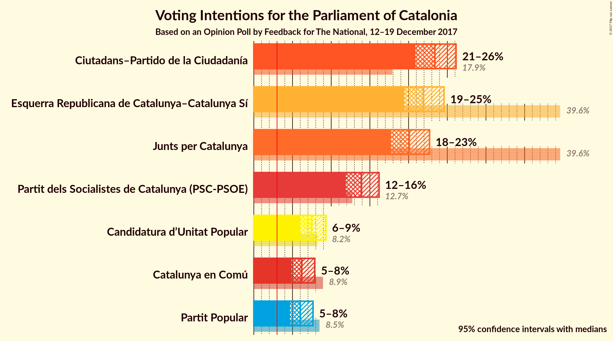
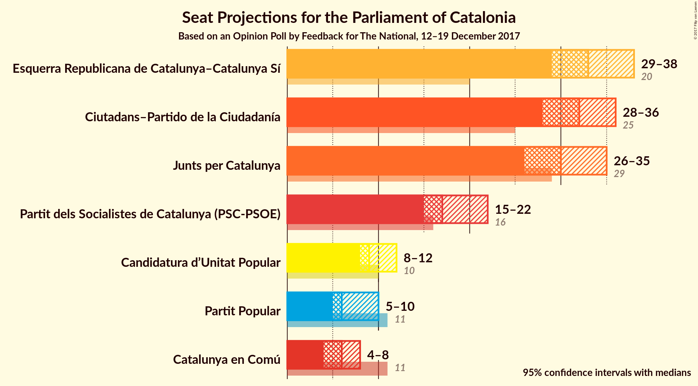
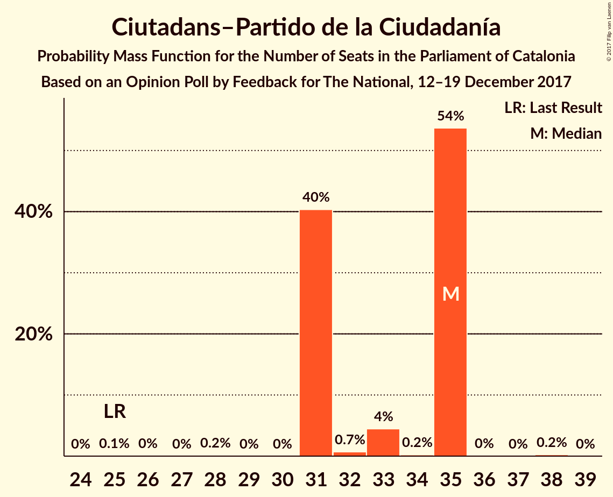
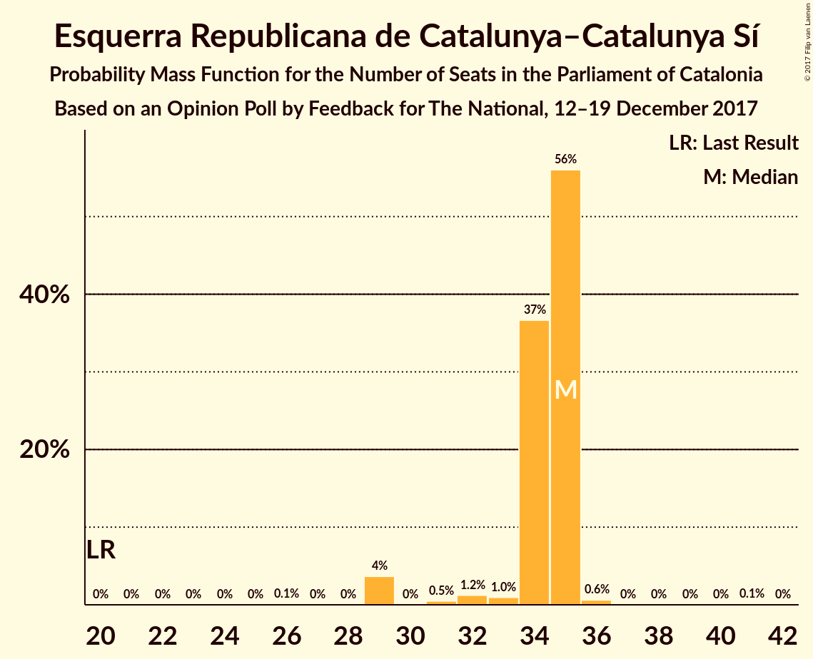
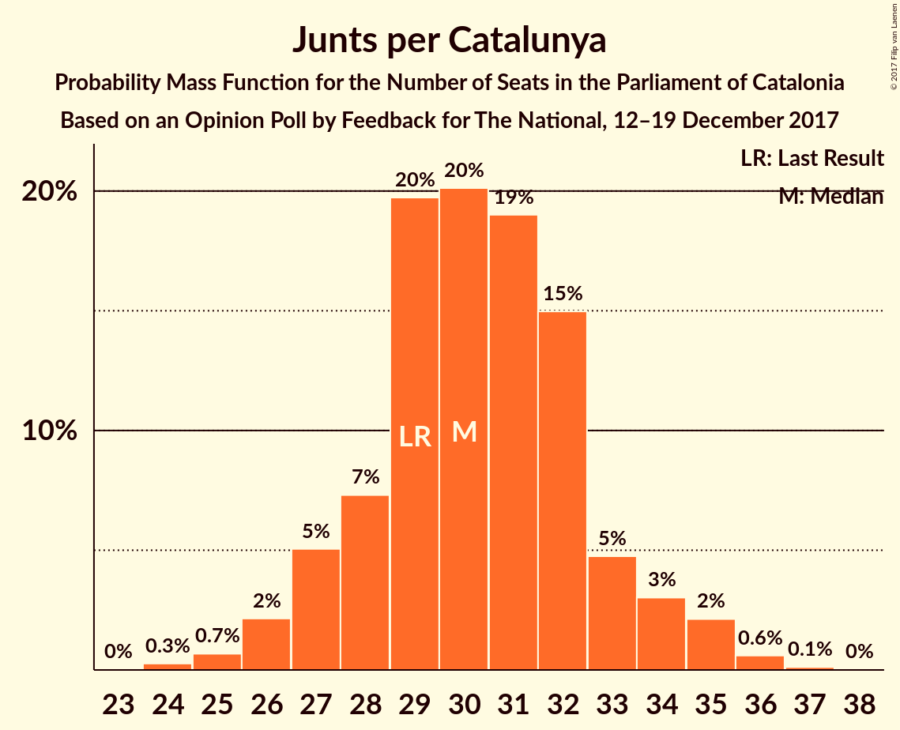
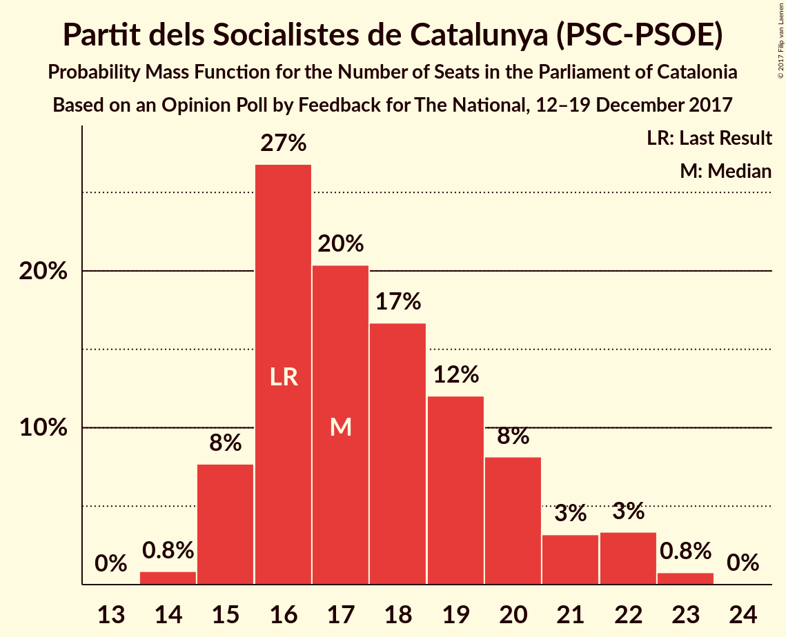
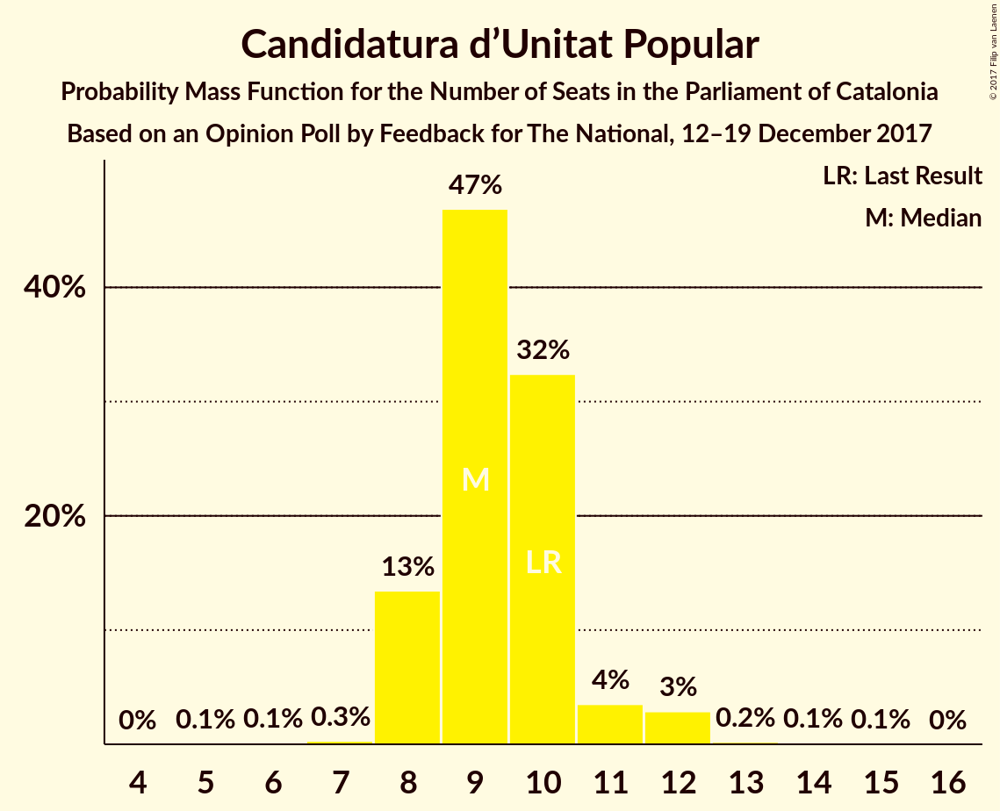
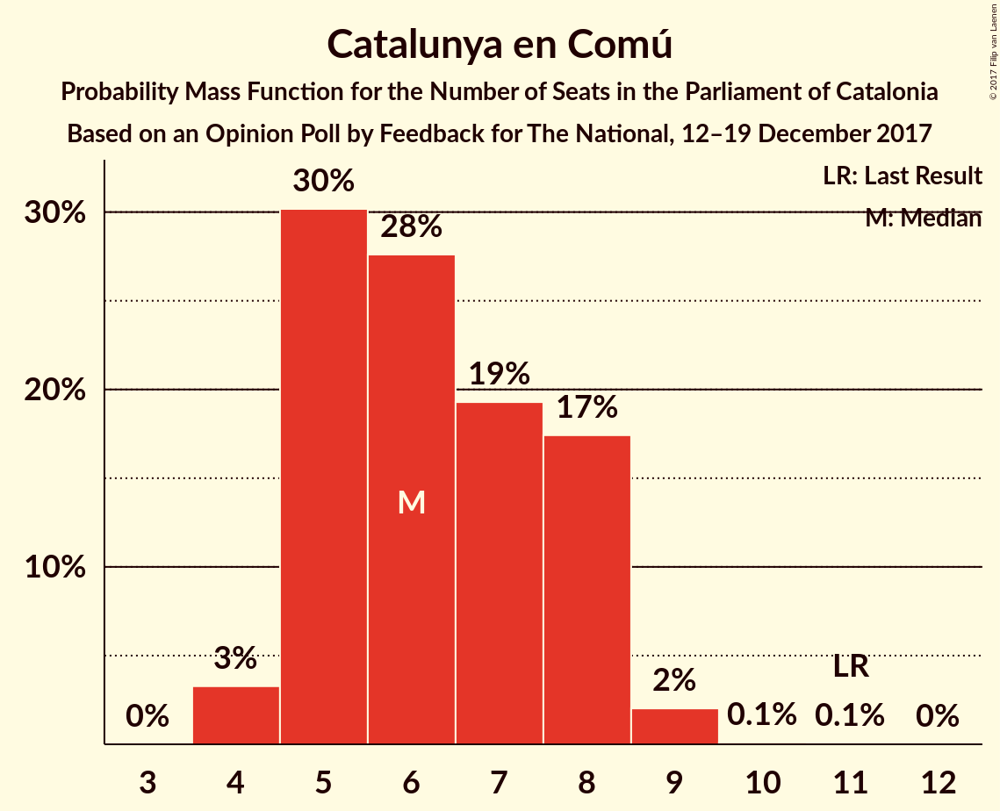
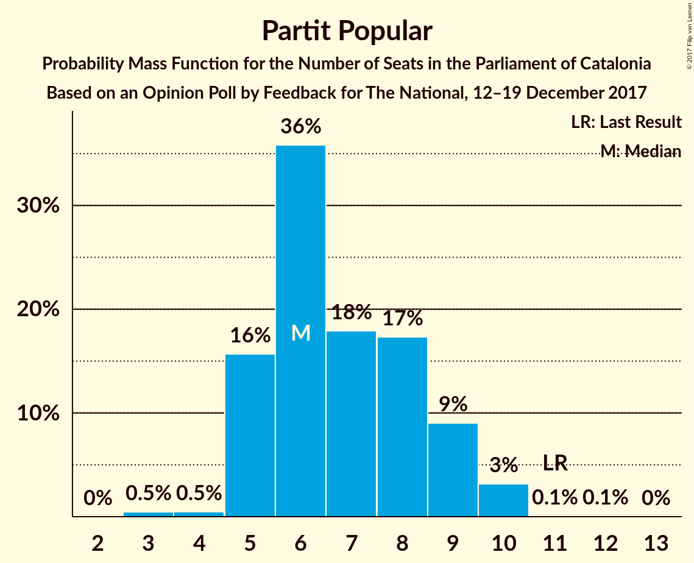
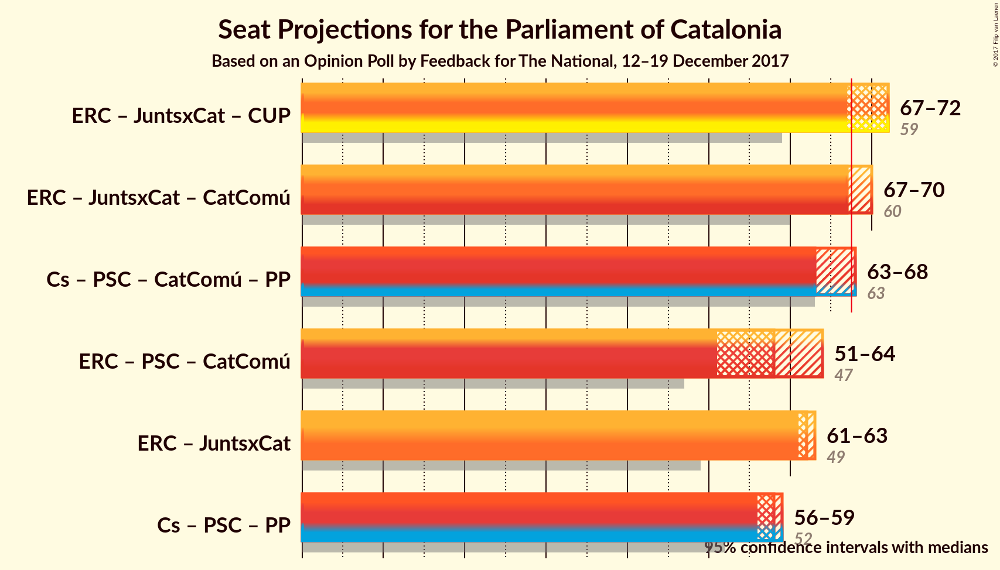

# Opinion Poll by Feedback for The National, 12–19 December 2017

<a href="#voting-intentions">Voting Intentions</a> | <a href="#seats">Seats</a> | <a href="#coalitions">Coalitions</a> | <a href="#technical-information">Technical Information</a>

## Voting Intentions

### Confidence Intervals

| Party | Last Result | Poll Result | 80% Confidence Interval | 90% Confidence Interval | 95% Confidence Interval | 99% Confidence Interval |
|:-----:|:-----------:|:-----------:|:-----------------------:|:-----------------------:|:-----------------------:|:-----------------------:|
| Ciutadans–Partido de la Ciudadanía | 17.9% | 23.4% | 21.7–25.2% |21.3–25.7% |20.9–26.1% |20.1–27.0% |
| Esquerra Republicana de Catalunya–Catalunya Sí | 39.6% | 21.9% | 20.3–23.7% |19.8–24.1% |19.4–24.6% |18.7–25.4% |
| Junts per Catalunya | 39.6% | 20.1% | 18.5–21.8% |18.1–22.3% |17.7–22.7% |17.0–23.5% |
| Partit dels Socialistes de Catalunya (PSC-PSOE) | 12.7% | 13.9% | 12.6–15.4% |12.2–15.8% |11.9–16.2% |11.3–16.9% |
| Candidatura d’Unitat Popular | 8.2% | 7.5% | 6.5–8.7% |6.2–9.0% |6.0–9.3% |5.6–9.9% |
| Catalunya en Comú | 8.9% | 6.2% | 5.3–7.3% |5.1–7.6% |4.9–7.9% |4.5–8.4% |
| Partit Popular | 8.5% | 6.0% | 5.1–7.1% |4.9–7.4% |4.7–7.7% |4.3–8.2% |

*Note:* The poll result column reflects the actual value used in the calculations. Published results may vary slightly, and in addition be rounded to fewer digits.

## Seats

### Confidence Intervals

| Party | Last Result | Median | 80% Confidence Interval | 90% Confidence Interval | 95% Confidence Interval | 99% Confidence Interval |
|:-----:|:-----------:|:------:|:-----------------------:|:-----------------------:|:-----------------------:|:-----------------------:|
| <a href="#ciutadans–partido-de-la-ciudadanía">Ciutadans–Partido de la Ciudadanía</a> | 25 | 32 | 30–34 |29–35 |28–36 |26–38 |
| <a href="#esquerra-republicana-de-catalunya–catalunya-sí">Esquerra Republicana de Catalunya–Catalunya Sí</a> | 20 | 33 | 30–36 |30–37 |29–38 |28–38 |
| <a href="#junts-per-catalunya">Junts per Catalunya</a> | 29 | 30 | 28–33 |27–34 |26–35 |25–36 |
| <a href="#partit-dels-socialistes-de-catalunya-(psc-psoe)">Partit dels Socialistes de Catalunya (PSC-PSOE)</a> | 16 | 17 | 16–20 |15–21 |15–22 |14–23 |
| <a href="#candidatura-d’unitat-popular">Candidatura d’Unitat Popular</a> | 10 | 9 | 8–10 |8–11 |8–12 |8–12 |
| <a href="#catalunya-en-comú">Catalunya en Comú</a> | 11 | 6 | 5–8 |5–8 |4–8 |4–9 |
| <a href="#partit-popular">Partit Popular</a> | 11 | 6 | 5–9 |5–9 |5–10 |4–10 |

### Ciutadans–Partido de la Ciudadanía

*For a full overview of the results for this party, see the [Ciutadans–Partido de la Ciudadanía](party-ciutadans–partidodelaciudadanía.html) page.*

| Number of Seats | Probability | Accumulated | Special Marks |
|:---------------:|:-----------:|:-----------:|:-------------:|
| 25 | 0% | 100% | Last Result |
| 26 | 0.6% | 100% |  |
| 27 | 2% | 99.4% |  |
| 28 | 2% | 98% |  |
| 29 | 5% | 95% |  |
| 30 | 12% | 90% |  |
| 31 | 27% | 79% |  |
| 32 | 21% | 51% | Median |
| 33 | 13% | 31% |  |
| 34 | 10% | 18% |  |
| 35 | 4% | 8% |  |
| 36 | 3% | 4% |  |
| 37 | 0.6% | 1.2% |  |
| 38 | 0.4% | 0.5% |  |
| 39 | 0.1% | 0.1% |  |
| 40 | 0% | 0% |  |

### Esquerra Republicana de Catalunya–Catalunya Sí

*For a full overview of the results for this party, see the [Esquerra Republicana de Catalunya–Catalunya Sí](party-esquerrarepublicanadecatalunya–catalunyasí.html) page.*

| Number of Seats | Probability | Accumulated | Special Marks |
|:---------------:|:-----------:|:-----------:|:-------------:|
| 20 | 0% | 100% | Last Result |
| 21 | 0% | 100% |  |
| 22 | 0% | 100% |  |
| 23 | 0% | 100% |  |
| 24 | 0% | 100% |  |
| 25 | 0% | 100% |  |
| 26 | 0.1% | 100% |  |
| 27 | 0.2% | 99.9% |  |
| 28 | 0.6% | 99.7% |  |
| 29 | 3% | 99.1% |  |
| 30 | 7% | 96% |  |
| 31 | 13% | 90% |  |
| 32 | 23% | 77% |  |
| 33 | 12% | 54% | Median |
| 34 | 15% | 41% |  |
| 35 | 12% | 26% |  |
| 36 | 8% | 15% |  |
| 37 | 5% | 7% |  |
| 38 | 2% | 3% |  |
| 39 | 0.2% | 0.3% |  |
| 40 | 0.1% | 0.1% |  |
| 41 | 0% | 0% |  |

### Junts per Catalunya

*For a full overview of the results for this party, see the [Junts per Catalunya](party-juntspercatalunya.html) page.*

| Number of Seats | Probability | Accumulated | Special Marks |
|:---------------:|:-----------:|:-----------:|:-------------:|
| 24 | 0.3% | 100% |  |
| 25 | 0.7% | 99.7% |  |
| 26 | 2% | 99.0% |  |
| 27 | 5% | 97% |  |
| 28 | 7% | 92% |  |
| 29 | 20% | 85% | Last Result |
| 30 | 20% | 65% | Median |
| 31 | 19% | 45% |  |
| 32 | 15% | 26% |  |
| 33 | 5% | 11% |  |
| 34 | 3% | 6% |  |
| 35 | 2% | 3% |  |
| 36 | 0.6% | 0.8% |  |
| 37 | 0.1% | 0.2% |  |
| 38 | 0% | 0% |  |

### Partit dels Socialistes de Catalunya (PSC-PSOE)

*For a full overview of the results for this party, see the [Partit dels Socialistes de Catalunya (PSC-PSOE)](party-partitdelssocialistesdecatalunyapsc-psoe.html) page.*

| Number of Seats | Probability | Accumulated | Special Marks |
|:---------------:|:-----------:|:-----------:|:-------------:|
| 14 | 0.8% | 100% |  |
| 15 | 8% | 99.1% |  |
| 16 | 27% | 91% | Last Result |
| 17 | 20% | 65% | Median |
| 18 | 17% | 44% |  |
| 19 | 12% | 28% |  |
| 20 | 8% | 16% |  |
| 21 | 3% | 7% |  |
| 22 | 3% | 4% |  |
| 23 | 0.8% | 0.8% |  |
| 24 | 0% | 0% |  |

### Candidatura d’Unitat Popular

*For a full overview of the results for this party, see the [Candidatura d’Unitat Popular](party-candidaturad’unitatpopular.html) page.*

| Number of Seats | Probability | Accumulated | Special Marks |
|:---------------:|:-----------:|:-----------:|:-------------:|
| 5 | 0.1% | 100% |  |
| 6 | 0.1% | 99.9% |  |
| 7 | 0.3% | 99.8% |  |
| 8 | 13% | 99.5% |  |
| 9 | 47% | 86% | Median |
| 10 | 32% | 39% | Last Result |
| 11 | 4% | 7% |  |
| 12 | 3% | 3% |  |
| 13 | 0.2% | 0.4% |  |
| 14 | 0.1% | 0.2% |  |
| 15 | 0.1% | 0.1% |  |
| 16 | 0% | 0% |  |

### Catalunya en Comú

*For a full overview of the results for this party, see the [Catalunya en Comú](party-catalunyaencomú.html) page.*

| Number of Seats | Probability | Accumulated | Special Marks |
|:---------------:|:-----------:|:-----------:|:-------------:|
| 4 | 3% | 100% |  |
| 5 | 30% | 97% |  |
| 6 | 27% | 67% | Median |
| 7 | 19% | 39% |  |
| 8 | 18% | 20% |  |
| 9 | 2% | 2% |  |
| 10 | 0.1% | 0.2% |  |
| 11 | 0.1% | 0.1% | Last Result |
| 12 | 0% | 0% |  |

### Partit Popular

*For a full overview of the results for this party, see the [Partit Popular](party-partitpopular.html) page.*

| Number of Seats | Probability | Accumulated | Special Marks |
|:---------------:|:-----------:|:-----------:|:-------------:|
| 3 | 0.4% | 100% |  |
| 4 | 0.5% | 99.6% |  |
| 5 | 17% | 99.1% |  |
| 6 | 35% | 82% | Median |
| 7 | 18% | 48% |  |
| 8 | 18% | 30% |  |
| 9 | 9% | 12% |  |
| 10 | 3% | 3% |  |
| 11 | 0.1% | 0.1% | Last Result |
| 12 | 0.1% | 0.1% |  |
| 13 | 0% | 0% |  |

## Coalitions

### Confidence Intervals

| Coalition | Last Result | Median | Majority? | 80% Confidence Interval | 90% Confidence Interval | 95% Confidence Interval | 99% Confidence Interval |
|:---------:|:-----------:|:------:|:---------:|:-----------------------:|:-----------------------:|:-----------------------:|:-----------------------:|
| Esquerra Republicana de Catalunya–Catalunya Sí – Junts per Catalunya – Candidatura d’Unitat Popular | 59 | 73 | 98% | 70–76 | 69–77 | 68–77 | 66–79 |
| Esquerra Republicana de Catalunya–Catalunya Sí – Junts per Catalunya – Catalunya en Comú | 60 | 70 | 80% | 66–73 | 65–74 | 65–74 | 63–76 |
| Esquerra Republicana de Catalunya–Catalunya Sí – Junts per Catalunya | 49 | 63 | 4% | 60–67 | 59–67 | 59–68 | 57–69 |
| Ciutadans–Partido de la Ciudadanía – Partit dels Socialistes de Catalunya (PSC-PSOE) – Catalunya en Comú – Partit Popular | 63 | 62 | 2% | 59–65 | 58–66 | 58–67 | 56–69 |
| Esquerra Republicana de Catalunya–Catalunya Sí – Partit dels Socialistes de Catalunya (PSC-PSOE) – Catalunya en Comú | 47 | 57 | 0% | 54–60 | 53–61 | 52–62 | 51–63 |
| Ciutadans–Partido de la Ciudadanía – Partit dels Socialistes de Catalunya (PSC-PSOE) – Partit Popular | 52 | 56 | 0% | 53–59 | 52–60 | 51–61 | 50–63 |

### Esquerra Republicana de Catalunya–Catalunya Sí – Junts per Catalunya – Candidatura d’Unitat Popular

| Number of Seats | Probability | Accumulated | Special Marks |
|:---------------:|:-----------:|:-----------:|:-------------:|
| 59 | 0% | 100% | Last Result |
| 60 | 0% | 100% |  |
| 61 | 0% | 100% |  |
| 62 | 0% | 100% |  |
| 63 | 0% | 100% |  |
| 64 | 0% | 100% |  |
| 65 | 0.1% | 99.9% |  |
| 66 | 0.4% | 99.8% |  |
| 67 | 1.0% | 99.4% |  |
| 68 | 3% | 98% | Majority |
| 69 | 6% | 96% |  |
| 70 | 11% | 90% |  |
| 71 | 13% | 80% |  |
| 72 | 14% | 67% | Median |
| 73 | 15% | 53% |  |
| 74 | 14% | 38% |  |
| 75 | 10% | 25% |  |
| 76 | 8% | 14% |  |
| 77 | 4% | 6% |  |
| 78 | 1.4% | 2% |  |
| 79 | 0.4% | 0.6% |  |
| 80 | 0.1% | 0.2% |  |
| 81 | 0.1% | 0.1% |  |
| 82 | 0% | 0% |  |

### Esquerra Republicana de Catalunya–Catalunya Sí – Junts per Catalunya – Catalunya en Comú

| Number of Seats | Probability | Accumulated | Special Marks |
|:---------------:|:-----------:|:-----------:|:-------------:|
| 60 | 0% | 100% | Last Result |
| 61 | 0% | 100% |  |
| 62 | 0.2% | 99.9% |  |
| 63 | 0.6% | 99.8% |  |
| 64 | 2% | 99.2% |  |
| 65 | 3% | 98% |  |
| 66 | 6% | 95% |  |
| 67 | 9% | 89% |  |
| 68 | 13% | 80% | Majority |
| 69 | 16% | 67% | Median |
| 70 | 14% | 51% |  |
| 71 | 14% | 37% |  |
| 72 | 10% | 23% |  |
| 73 | 7% | 13% |  |
| 74 | 3% | 5% |  |
| 75 | 1.5% | 2% |  |
| 76 | 0.6% | 0.8% |  |
| 77 | 0.1% | 0.2% |  |
| 78 | 0% | 0% |  |

### Esquerra Republicana de Catalunya–Catalunya Sí – Junts per Catalunya

| Number of Seats | Probability | Accumulated | Special Marks |
|:---------------:|:-----------:|:-----------:|:-------------:|
| 49 | 0% | 100% | Last Result |
| 50 | 0% | 100% |  |
| 51 | 0% | 100% |  |
| 52 | 0% | 100% |  |
| 53 | 0% | 100% |  |
| 54 | 0% | 100% |  |
| 55 | 0.1% | 100% |  |
| 56 | 0.2% | 99.9% |  |
| 57 | 0.6% | 99.7% |  |
| 58 | 1.3% | 99.1% |  |
| 59 | 4% | 98% |  |
| 60 | 6% | 94% |  |
| 61 | 13% | 88% |  |
| 62 | 14% | 75% |  |
| 63 | 15% | 62% | Median |
| 64 | 14% | 47% |  |
| 65 | 13% | 33% |  |
| 66 | 9% | 21% |  |
| 67 | 7% | 11% |  |
| 68 | 3% | 4% | Majority |
| 69 | 0.9% | 1.3% |  |
| 70 | 0.3% | 0.4% |  |
| 71 | 0.1% | 0.1% |  |
| 72 | 0% | 0% |  |

### Ciutadans–Partido de la Ciudadanía – Partit dels Socialistes de Catalunya (PSC-PSOE) – Catalunya en Comú – Partit Popular

| Number of Seats | Probability | Accumulated | Special Marks |
|:---------------:|:-----------:|:-----------:|:-------------:|
| 54 | 0.1% | 100% |  |
| 55 | 0.1% | 99.9% |  |
| 56 | 0.4% | 99.8% |  |
| 57 | 1.4% | 99.4% |  |
| 58 | 4% | 98% |  |
| 59 | 8% | 94% |  |
| 60 | 10% | 86% |  |
| 61 | 14% | 75% | Median |
| 62 | 15% | 62% |  |
| 63 | 14% | 47% | Last Result |
| 64 | 13% | 33% |  |
| 65 | 11% | 20% |  |
| 66 | 6% | 10% |  |
| 67 | 3% | 4% |  |
| 68 | 1.0% | 2% | Majority |
| 69 | 0.4% | 0.6% |  |
| 70 | 0.1% | 0.2% |  |
| 71 | 0% | 0.1% |  |
| 72 | 0% | 0% |  |

### Esquerra Republicana de Catalunya–Catalunya Sí – Partit dels Socialistes de Catalunya (PSC-PSOE) – Catalunya en Comú

| Number of Seats | Probability | Accumulated | Special Marks |
|:---------------:|:-----------:|:-----------:|:-------------:|
| 47 | 0% | 100% | Last Result |
| 48 | 0% | 100% |  |
| 49 | 0.1% | 100% |  |
| 50 | 0.2% | 99.9% |  |
| 51 | 0.8% | 99.6% |  |
| 52 | 2% | 98.8% |  |
| 53 | 5% | 97% |  |
| 54 | 8% | 92% |  |
| 55 | 14% | 84% |  |
| 56 | 15% | 70% | Median |
| 57 | 17% | 56% |  |
| 58 | 14% | 39% |  |
| 59 | 10% | 25% |  |
| 60 | 7% | 15% |  |
| 61 | 4% | 7% |  |
| 62 | 2% | 3% |  |
| 63 | 0.8% | 1.2% |  |
| 64 | 0.3% | 0.4% |  |
| 65 | 0.1% | 0.1% |  |
| 66 | 0% | 0% |  |

### Ciutadans–Partido de la Ciudadanía – Partit dels Socialistes de Catalunya (PSC-PSOE) – Partit Popular

| Number of Seats | Probability | Accumulated | Special Marks |
|:---------------:|:-----------:|:-----------:|:-------------:|
| 48 | 0.1% | 100% |  |
| 49 | 0.2% | 99.9% |  |
| 50 | 0.8% | 99.7% |  |
| 51 | 2% | 98.9% |  |
| 52 | 4% | 97% | Last Result |
| 53 | 8% | 93% |  |
| 54 | 12% | 84% |  |
| 55 | 15% | 73% | Median |
| 56 | 15% | 58% |  |
| 57 | 15% | 43% |  |
| 58 | 12% | 28% |  |
| 59 | 8% | 16% |  |
| 60 | 4% | 8% |  |
| 61 | 3% | 4% |  |
| 62 | 1.0% | 2% |  |
| 63 | 0.4% | 0.5% |  |
| 64 | 0.1% | 0.2% |  |
| 65 | 0% | 0% |  |

## Technical Information

### Opinion Poll

+ **Polling firm:** Feedback
+ **Commissioner(s):** The National
+ **Fieldwork period:** 12–19 December 2017

### Calculations

+ **Sample size:** 1000
+ **Simulations done:** 4,194,304
+ **Error estimate:** 1.16%

