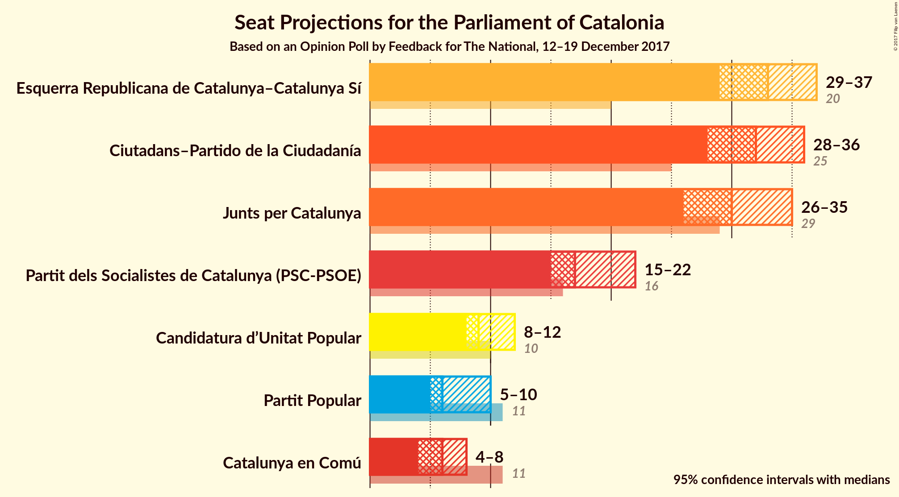
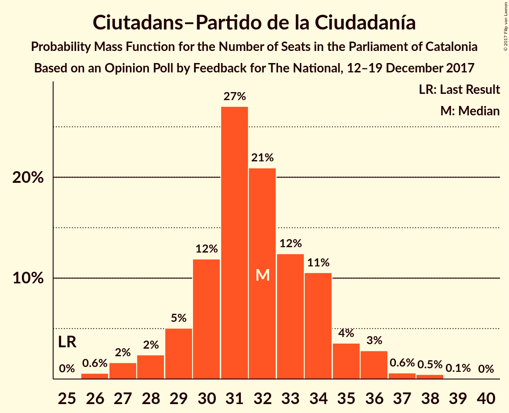
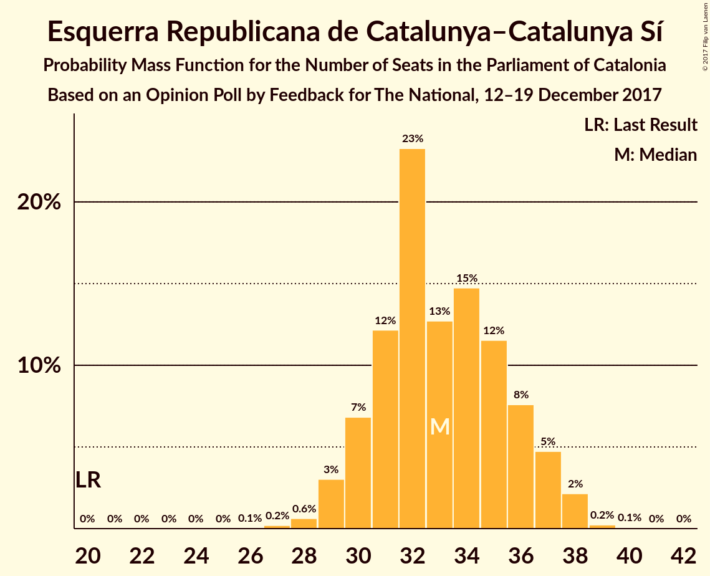
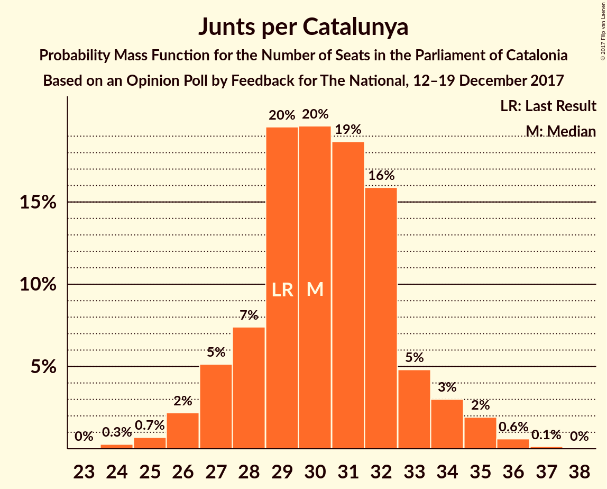
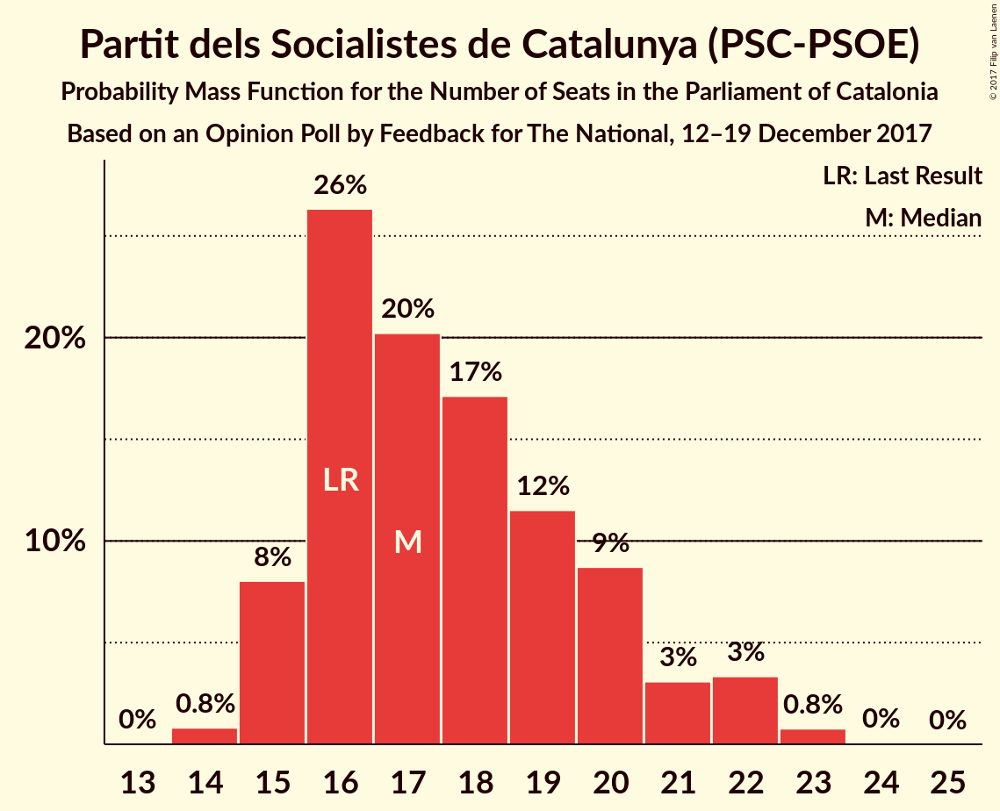
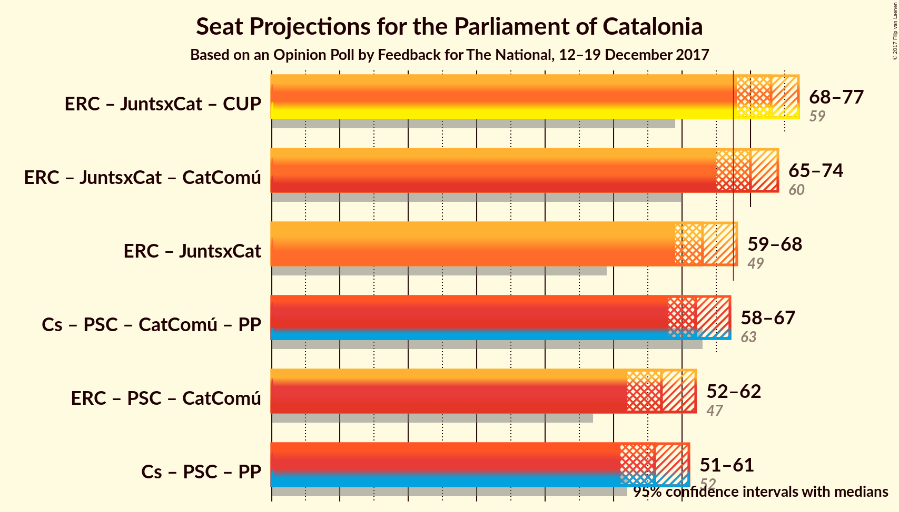

# Opinion Poll by Feedback for The National, 12–19 December 2017

<a href="#voting-intentions">Voting Intentions</a> | <a href="#seats">Seats</a> | <a href="#coalitions">Coalitions</a> | <a href="#technical-information">Technical Information</a>

## Voting Intentions

### Confidence Intervals

| Party | Last Result | Poll Result | 80% Confidence Interval | 90% Confidence Interval | 95% Confidence Interval | 99% Confidence Interval |
|:-----:|:-----------:|:-----------:|:-----------------------:|:-----------------------:|:-----------------------:|:-----------------------:|
| Ciutadans–Partido de la Ciudadanía | 17.9% | 23.4% | 21.7–25.2% |21.3–25.7% |20.9–26.1% |20.1–27.0% |
| Esquerra Republicana de Catalunya–Catalunya Sí | 39.6% | 21.9% | 20.3–23.7% |19.8–24.1% |19.4–24.6% |18.7–25.4% |
| Junts per Catalunya | 39.6% | 20.1% | 18.5–21.8% |18.1–22.3% |17.7–22.7% |17.0–23.5% |
| Partit dels Socialistes de Catalunya (PSC-PSOE) | 12.7% | 13.9% | 12.6–15.4% |12.2–15.8% |11.9–16.2% |11.3–16.9% |
| Candidatura d’Unitat Popular | 8.2% | 7.5% | 6.5–8.7% |6.2–9.0% |6.0–9.3% |5.6–9.9% |
| Catalunya en Comú | 8.9% | 6.2% | 5.3–7.3% |5.1–7.6% |4.9–7.9% |4.5–8.4% |
| Partit Popular | 8.5% | 6.0% | 5.1–7.1% |4.9–7.4% |4.7–7.7% |4.3–8.2% |

*Note:* The poll result column reflects the actual value used in the calculations. Published results may vary slightly, and in addition be rounded to fewer digits.

## Seats

### Confidence Intervals

| Party | Last Result | Median | 80% Confidence Interval | 90% Confidence Interval | 95% Confidence Interval | 99% Confidence Interval |
|:-----:|:-----------:|:------:|:-----------------------:|:-----------------------:|:-----------------------:|:-----------------------:|
| <a href="#ciutadans–partido-de-la-ciudadanía">Ciutadans–Partido de la Ciudadanía</a> | 25 | 35 | 31–35 |31–35 |31–35 |31–35 |
| <a href="#esquerra-republicana-de-catalunya–catalunya-sí">Esquerra Republicana de Catalunya–Catalunya Sí</a> | 20 | 35 | 34–35 |32–35 |29–35 |29–36 |
| <a href="#junts-per-catalunya">Junts per Catalunya</a> | 29 | 27 | 27 |27–29 |27–34 |25–34 |
| <a href="#partit-dels-socialistes-de-catalunya-(psc-psoe)">Partit dels Socialistes de Catalunya (PSC-PSOE)</a> | 16 | 18 | 18 |17–20 |17–23 |15–23 |
| <a href="#candidatura-d’unitat-popular">Candidatura d’Unitat Popular</a> | 10 | 10 | 9–10 |8–10 |8–10 |5–12 |
| <a href="#catalunya-en-comú">Catalunya en Comú</a> | 11 | 5 | 5–9 |5–9 |5–9 |5–9 |
| <a href="#partit-popular">Partit Popular</a> | 11 | 5 | 5–7 |5–9 |3–9 |3–10 |

### Ciutadans–Partido de la Ciudadanía

*For a full overview of the results for this party, see the [Ciutadans–Partido de la Ciudadanía](party-ciutadans–partidodelaciudadanía.html) page.*

| Number of Seats | Probability | Accumulated | Special Marks |
|:---------------:|:-----------:|:-----------:|:-------------:|
| 25 | 0.1% | 100% | Last Result |
| 26 | 0% | 99.9% |  |
| 27 | 0% | 99.9% |  |
| 28 | 0.2% | 99.9% |  |
| 29 | 0% | 99.7% |  |
| 30 | 0% | 99.7% |  |
| 31 | 40% | 99.7% |  |
| 32 | 0.7% | 59% |  |
| 33 | 4% | 59% |  |
| 34 | 0.2% | 54% |  |
| 35 | 54% | 54% | Median |
| 36 | 0% | 0.3% |  |
| 37 | 0% | 0.2% |  |
| 38 | 0.2% | 0.2% |  |
| 39 | 0% | 0% |  |

### Esquerra Republicana de Catalunya–Catalunya Sí

*For a full overview of the results for this party, see the [Esquerra Republicana de Catalunya–Catalunya Sí](party-esquerrarepublicanadecatalunya–catalunyasí.html) page.*

| Number of Seats | Probability | Accumulated | Special Marks |
|:---------------:|:-----------:|:-----------:|:-------------:|
| 20 | 0% | 100% | Last Result |
| 21 | 0% | 100% |  |
| 22 | 0% | 100% |  |
| 23 | 0% | 100% |  |
| 24 | 0% | 100% |  |
| 25 | 0% | 100% |  |
| 26 | 0.1% | 100% |  |
| 27 | 0% | 99.9% |  |
| 28 | 0% | 99.9% |  |
| 29 | 4% | 99.9% |  |
| 30 | 0% | 96% |  |
| 31 | 0.5% | 96% |  |
| 32 | 1.2% | 96% |  |
| 33 | 1.0% | 94% |  |
| 34 | 37% | 94% |  |
| 35 | 56% | 57% | Median |
| 36 | 0.6% | 0.8% |  |
| 37 | 0% | 0.2% |  |
| 38 | 0% | 0.2% |  |
| 39 | 0% | 0.1% |  |
| 40 | 0% | 0.1% |  |
| 41 | 0.1% | 0.1% |  |
| 42 | 0% | 0% |  |

### Junts per Catalunya

*For a full overview of the results for this party, see the [Junts per Catalunya](party-juntspercatalunya.html) page.*

| Number of Seats | Probability | Accumulated | Special Marks |
|:---------------:|:-----------:|:-----------:|:-------------:|
| 24 | 0.4% | 100% |  |
| 25 | 2% | 99.6% |  |
| 26 | 0.2% | 98% |  |
| 27 | 89% | 98% | Median |
| 28 | 4% | 9% |  |
| 29 | 1.0% | 5% | Last Result |
| 30 | 0.1% | 4% |  |
| 31 | 0.6% | 4% |  |
| 32 | 0.1% | 4% |  |
| 33 | 0% | 4% |  |
| 34 | 4% | 4% |  |
| 35 | 0% | 0% |  |

### Partit dels Socialistes de Catalunya (PSC-PSOE)

*For a full overview of the results for this party, see the [Partit dels Socialistes de Catalunya (PSC-PSOE)](party-partitdelssocialistesdecatalunyapsc-psoe.html) page.*

| Number of Seats | Probability | Accumulated | Special Marks |
|:---------------:|:-----------:|:-----------:|:-------------:|
| 14 | 0.2% | 100% |  |
| 15 | 0.7% | 99.8% |  |
| 16 | 1.4% | 99.0% | Last Result |
| 17 | 4% | 98% |  |
| 18 | 89% | 94% | Median |
| 19 | 0% | 5% |  |
| 20 | 1.1% | 5% |  |
| 21 | 0% | 4% |  |
| 22 | 0.5% | 4% |  |
| 23 | 4% | 4% |  |
| 24 | 0% | 0.1% |  |
| 25 | 0.1% | 0.1% |  |
| 26 | 0% | 0% |  |

### Candidatura d’Unitat Popular

*For a full overview of the results for this party, see the [Candidatura d’Unitat Popular](party-candidaturad’unitatpopular.html) page.*

| Number of Seats | Probability | Accumulated | Special Marks |
|:---------------:|:-----------:|:-----------:|:-------------:|
| 5 | 0.8% | 100% |  |
| 6 | 0.1% | 99.2% |  |
| 7 | 0% | 99.1% |  |
| 8 | 5% | 99.1% |  |
| 9 | 40% | 94% |  |
| 10 | 54% | 55% | Last Result, Median |
| 11 | 0% | 0.5% |  |
| 12 | 0.4% | 0.5% |  |
| 13 | 0.1% | 0.1% |  |
| 14 | 0% | 0% |  |

### Catalunya en Comú

*For a full overview of the results for this party, see the [Catalunya en Comú](party-catalunyaencomú.html) page.*

| Number of Seats | Probability | Accumulated | Special Marks |
|:---------------:|:-----------:|:-----------:|:-------------:|
| 4 | 0.2% | 100% |  |
| 5 | 56% | 99.8% | Median |
| 6 | 4% | 43% |  |
| 7 | 1.1% | 40% |  |
| 8 | 0.3% | 38% |  |
| 9 | 38% | 38% |  |
| 10 | 0% | 0% |  |
| 11 | 0% | 0% | Last Result |

### Partit Popular

*For a full overview of the results for this party, see the [Partit Popular](party-partitpopular.html) page.*

| Number of Seats | Probability | Accumulated | Special Marks |
|:---------------:|:-----------:|:-----------:|:-------------:|
| 3 | 3% | 100% |  |
| 4 | 0.5% | 97% |  |
| 5 | 53% | 96% | Median |
| 6 | 1.0% | 43% |  |
| 7 | 36% | 42% |  |
| 8 | 0.6% | 6% |  |
| 9 | 4% | 6% |  |
| 10 | 1.3% | 1.3% |  |
| 11 | 0.1% | 0.1% | Last Result |
| 12 | 0% | 0% |  |

## Coalitions

### Confidence Intervals

| Coalition | Last Result | Median | Majority? | 80% Confidence Interval | 90% Confidence Interval | 95% Confidence Interval | 99% Confidence Interval |
|:---------:|:-----------:|:------:|:---------:|:-----------------------:|:-----------------------:|:-----------------------:|:-----------------------:|
| Esquerra Republicana de Catalunya–Catalunya Sí – Junts per Catalunya – Candidatura d’Unitat Popular | 59 | 72 | 97% | 70–72 | 70–72 | 67–72 | 64–75 |
| Esquerra Republicana de Catalunya–Catalunya Sí – Junts per Catalunya – Catalunya en Comú | 60 | 67 | 45% | 67–70 | 67–70 | 67–70 | 64–75 |
| Ciutadans–Partido de la Ciudadanía – Partit dels Socialistes de Catalunya (PSC-PSOE) – Catalunya en Comú – Partit Popular | 63 | 63 | 3% | 63–65 | 63–65 | 63–68 | 60–71 |
| Esquerra Republicana de Catalunya–Catalunya Sí – Partit dels Socialistes de Catalunya (PSC-PSOE) – Catalunya en Comú | 47 | 58 | 0% | 58–61 | 56–61 | 51–64 | 51–64 |
| Esquerra Republicana de Catalunya–Catalunya Sí – Junts per Catalunya | 49 | 62 | 0% | 61–62 | 61–63 | 61–63 | 56–67 |
| Ciutadans–Partido de la Ciudadanía – Partit dels Socialistes de Catalunya (PSC-PSOE) – Partit Popular | 52 | 58 | 0% | 56–58 | 56–59 | 56–59 | 51–62 |

### Esquerra Republicana de Catalunya–Catalunya Sí – Junts per Catalunya – Candidatura d’Unitat Popular

| Number of Seats | Probability | Accumulated | Special Marks |
|:---------------:|:-----------:|:-----------:|:-------------:|
| 59 | 0% | 100% | Last Result |
| 60 | 0% | 100% |  |
| 61 | 0% | 100% |  |
| 62 | 0% | 100% |  |
| 63 | 0% | 100% |  |
| 64 | 0.5% | 100% |  |
| 65 | 0.1% | 99.5% |  |
| 66 | 0% | 99.4% |  |
| 67 | 2% | 99.4% |  |
| 68 | 0% | 97% | Majority |
| 69 | 0.2% | 97% |  |
| 70 | 37% | 97% |  |
| 71 | 4% | 60% |  |
| 72 | 56% | 57% | Median |
| 73 | 0% | 0.8% |  |
| 74 | 0.2% | 0.8% |  |
| 75 | 0.5% | 0.6% |  |
| 76 | 0.1% | 0.1% |  |
| 77 | 0% | 0.1% |  |
| 78 | 0% | 0.1% |  |
| 79 | 0% | 0.1% |  |
| 80 | 0.1% | 0.1% |  |
| 81 | 0% | 0% |  |

### Esquerra Republicana de Catalunya–Catalunya Sí – Junts per Catalunya – Catalunya en Comú

| Number of Seats | Probability | Accumulated | Special Marks |
|:---------------:|:-----------:|:-----------:|:-------------:|
| 60 | 0% | 100% | Last Result |
| 61 | 0.1% | 100% |  |
| 62 | 0.2% | 99.9% |  |
| 63 | 0% | 99.7% |  |
| 64 | 1.3% | 99.7% |  |
| 65 | 0.6% | 98% |  |
| 66 | 0.1% | 98% |  |
| 67 | 53% | 98% | Median |
| 68 | 4% | 45% | Majority |
| 69 | 3% | 41% |  |
| 70 | 36% | 38% |  |
| 71 | 0.9% | 2% |  |
| 72 | 0.1% | 0.7% |  |
| 73 | 0% | 0.6% |  |
| 74 | 0% | 0.6% |  |
| 75 | 0.1% | 0.6% |  |
| 76 | 0.4% | 0.5% |  |
| 77 | 0% | 0% |  |

### Ciutadans–Partido de la Ciudadanía – Partit dels Socialistes de Catalunya (PSC-PSOE) – Catalunya en Comú – Partit Popular

| Number of Seats | Probability | Accumulated | Special Marks |
|:---------------:|:-----------:|:-----------:|:-------------:|
| 55 | 0.1% | 100% |  |
| 56 | 0% | 99.9% |  |
| 57 | 0% | 99.9% |  |
| 58 | 0% | 99.9% |  |
| 59 | 0.1% | 99.9% |  |
| 60 | 0.5% | 99.9% |  |
| 61 | 0.2% | 99.4% |  |
| 62 | 0% | 99.2% |  |
| 63 | 56% | 99.2% | Last Result, Median |
| 64 | 4% | 43% |  |
| 65 | 37% | 40% |  |
| 66 | 0.2% | 3% |  |
| 67 | 0% | 3% |  |
| 68 | 2% | 3% | Majority |
| 69 | 0% | 0.6% |  |
| 70 | 0.1% | 0.6% |  |
| 71 | 0.5% | 0.5% |  |
| 72 | 0% | 0% |  |

### Esquerra Republicana de Catalunya–Catalunya Sí – Partit dels Socialistes de Catalunya (PSC-PSOE) – Catalunya en Comú

| Number of Seats | Probability | Accumulated | Special Marks |
|:---------------:|:-----------:|:-----------:|:-------------:|
| 47 | 0% | 100% | Last Result |
| 48 | 0% | 100% |  |
| 49 | 0% | 100% |  |
| 50 | 0.2% | 100% |  |
| 51 | 4% | 99.8% |  |
| 52 | 0% | 96% |  |
| 53 | 0% | 96% |  |
| 54 | 0% | 96% |  |
| 55 | 1.1% | 96% |  |
| 56 | 0.3% | 95% |  |
| 57 | 0.1% | 95% |  |
| 58 | 53% | 95% | Median |
| 59 | 0.1% | 42% |  |
| 60 | 0.6% | 42% |  |
| 61 | 36% | 41% |  |
| 62 | 1.3% | 5% |  |
| 63 | 0.1% | 3% |  |
| 64 | 3% | 3% |  |
| 65 | 0% | 0% |  |

### Esquerra Republicana de Catalunya–Catalunya Sí – Junts per Catalunya

| Number of Seats | Probability | Accumulated | Special Marks |
|:---------------:|:-----------:|:-----------:|:-------------:|
| 49 | 0% | 100% | Last Result |
| 50 | 0% | 100% |  |
| 51 | 0% | 100% |  |
| 52 | 0% | 100% |  |
| 53 | 0% | 100% |  |
| 54 | 0% | 100% |  |
| 55 | 0.1% | 100% |  |
| 56 | 0.5% | 99.9% |  |
| 57 | 1.4% | 99.4% |  |
| 58 | 0.2% | 98% |  |
| 59 | 0.1% | 98% |  |
| 60 | 0.2% | 98% |  |
| 61 | 36% | 98% |  |
| 62 | 53% | 61% | Median |
| 63 | 7% | 8% |  |
| 64 | 0% | 1.0% |  |
| 65 | 0.1% | 0.9% |  |
| 66 | 0.2% | 0.8% |  |
| 67 | 0.6% | 0.6% |  |
| 68 | 0% | 0% | Majority |

### Ciutadans–Partido de la Ciudadanía – Partit dels Socialistes de Catalunya (PSC-PSOE) – Partit Popular

| Number of Seats | Probability | Accumulated | Special Marks |
|:---------------:|:-----------:|:-----------:|:-------------:|
| 47 | 0.1% | 100% |  |
| 48 | 0% | 99.9% |  |
| 49 | 0% | 99.9% |  |
| 50 | 0% | 99.9% |  |
| 51 | 0.4% | 99.9% |  |
| 52 | 0% | 99.4% | Last Result |
| 53 | 0% | 99.4% |  |
| 54 | 0.1% | 99.4% |  |
| 55 | 0% | 99.3% |  |
| 56 | 36% | 99.3% |  |
| 57 | 4% | 63% |  |
| 58 | 53% | 59% | Median |
| 59 | 4% | 7% |  |
| 60 | 0% | 2% |  |
| 61 | 2% | 2% |  |
| 62 | 0.6% | 0.7% |  |
| 63 | 0% | 0.1% |  |
| 64 | 0.1% | 0.1% |  |
| 65 | 0% | 0% |  |

## Technical Information

### Opinion Poll

+ **Polling firm:** Feedback
+ **Commissioner(s):** The National
+ **Fieldwork period:** 12–19 December 2017

### Calculations

+ **Sample size:** 1000
+ **Simulations done:** 1,024
+ **Error estimate:** 3.51%

