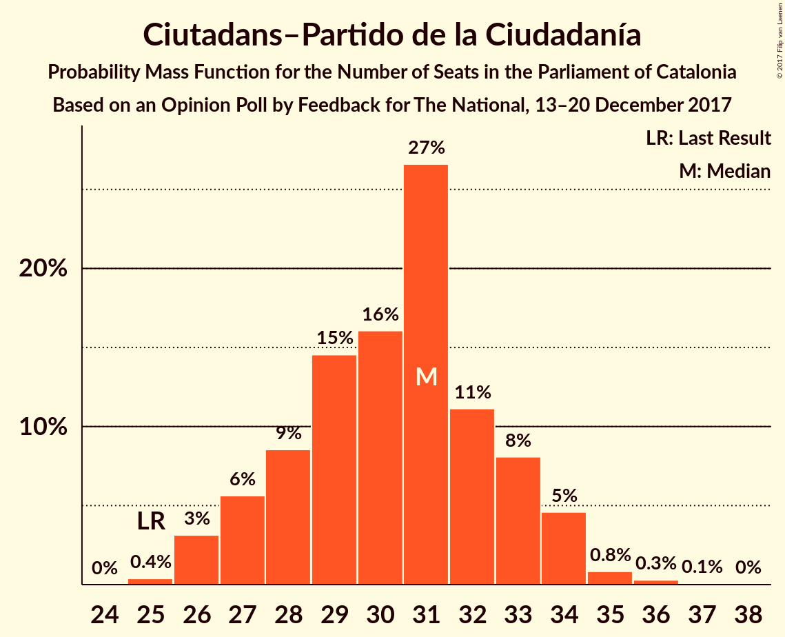
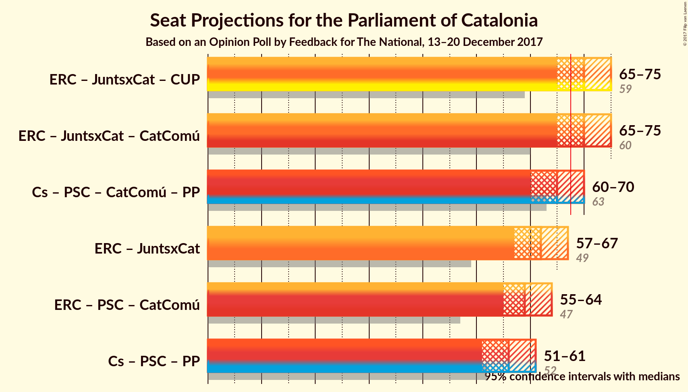

# Opinion Poll by Feedback for The National, 13–20 December 2017

<a href="#voting-intentions">Voting Intentions</a> | <a href="#seats">Seats</a> | <a href="#coalitions">Coalitions</a> | <a href="#technical-information">Technical Information</a>

## Voting Intentions

### Confidence Intervals

| Party | Last Result | Poll Result | 80% Confidence Interval | 90% Confidence Interval | 95% Confidence Interval | 99% Confidence Interval |
|:-----:|:-----------:|:-----------:|:-----------------------:|:-----------------------:|:-----------------------:|:-----------------------:|
| Ciutadans–Partido de la Ciudadanía | 17.9% | 22.5% | 20.9–24.3% |20.4–24.8% |20.0–25.2% |19.3–26.1% |
| Esquerra Republicana de Catalunya–Catalunya Sí | 39.6% | 21.2% | 19.6–22.9% |19.2–23.4% |18.8–23.9% |18.0–24.7% |
| Junts per Catalunya | 39.6% | 20.0% | 18.4–21.7% |18.0–22.2% |17.6–22.6% |16.9–23.4% |
| Partit dels Socialistes de Catalunya (PSC-PSOE) | 12.7% | 14.9% | 13.5–16.4% |13.2–16.9% |12.8–17.3% |12.2–18.0% |
| Catalunya en Comú | 8.9% | 7.8% | 6.8–9.0% |6.5–9.3% |6.3–9.6% |5.8–10.2% |
| Candidatura d’Unitat Popular | 8.2% | 6.5% | 5.6–7.6% |5.3–7.9% |5.1–8.2% |4.7–8.8% |
| Partit Popular | 8.5% | 6.0% | 5.1–7.1% |4.9–7.4% |4.7–7.7% |4.3–8.2% |

*Note:* The poll result column reflects the actual value used in the calculations. Published results may vary slightly, and in addition be rounded to fewer digits.

## Seats

### Confidence Intervals

| Party | Last Result | Median | 80% Confidence Interval | 90% Confidence Interval | 95% Confidence Interval | 99% Confidence Interval |
|:-----:|:-----------:|:------:|:-----------------------:|:-----------------------:|:-----------------------:|:-----------------------:|
| <a href="#ciutadans–partido-de-la-ciudadanía">Ciutadans–Partido de la Ciudadanía</a> | 25 | 30 | 27–33 |27–34 |26–34 |25–35 |
| <a href="#esquerra-republicana-de-catalunya–catalunya-sí">Esquerra Republicana de Catalunya–Catalunya Sí</a> | 20 | 32 | 29–35 |29–35 |28–36 |26–38 |
| <a href="#junts-per-catalunya">Junts per Catalunya</a> | 29 | 30 | 27–33 |26–34 |26–34 |24–36 |
| <a href="#partit-dels-socialistes-de-catalunya-(psc-psoe)">Partit dels Socialistes de Catalunya (PSC-PSOE)</a> | 16 | 19 | 16–22 |16–23 |16–23 |15–24 |
| <a href="#catalunya-en-comú">Catalunya en Comú</a> | 11 | 9 | 7–10 |6–11 |6–11 |5–12 |
| <a href="#candidatura-d’unitat-popular">Candidatura d’Unitat Popular</a> | 10 | 8 | 7–9 |6–10 |5–10 |5–10 |
| <a href="#partit-popular">Partit Popular</a> | 11 | 7 | 5–9 |5–9 |5–10 |3–10 |

### Ciutadans–Partido de la Ciudadanía

*For a full overview of the results for this party, see the [Ciutadans–Partido de la Ciudadanía](party-ciutadans–partidodelaciudadanía.html) page.*

| Number of Seats | Probability | Accumulated | Special Marks |
|:---------------:|:-----------:|:-----------:|:-------------:|
| 25 | 0.5% | 100% | Last Result |
| 26 | 3% | 99.5% |  |
| 27 | 8% | 96% |  |
| 28 | 7% | 88% |  |
| 29 | 13% | 81% |  |
| 30 | 18% | 68% | Median |
| 31 | 26% | 50% |  |
| 32 | 11% | 23% |  |
| 33 | 7% | 13% |  |
| 34 | 4% | 6% |  |
| 35 | 1.0% | 1.3% |  |
| 36 | 0.2% | 0.3% |  |
| 37 | 0% | 0.1% |  |
| 38 | 0% | 0% |  |

### Esquerra Republicana de Catalunya–Catalunya Sí

*For a full overview of the results for this party, see the [Esquerra Republicana de Catalunya–Catalunya Sí](party-esquerrarepublicanadecatalunya–catalunyasí.html) page.*

| Number of Seats | Probability | Accumulated | Special Marks |
|:---------------:|:-----------:|:-----------:|:-------------:|
| 20 | 0% | 100% | Last Result |
| 21 | 0% | 100% |  |
| 22 | 0% | 100% |  |
| 23 | 0% | 100% |  |
| 24 | 0% | 100% |  |
| 25 | 0.1% | 100% |  |
| 26 | 0.9% | 99.9% |  |
| 27 | 0.8% | 99.0% |  |
| 28 | 3% | 98% |  |
| 29 | 9% | 96% |  |
| 30 | 17% | 86% |  |
| 31 | 15% | 69% |  |
| 32 | 26% | 54% | Median |
| 33 | 10% | 28% |  |
| 34 | 7% | 18% |  |
| 35 | 7% | 12% |  |
| 36 | 3% | 5% |  |
| 37 | 1.0% | 2% |  |
| 38 | 0.7% | 0.8% |  |
| 39 | 0.1% | 0.1% |  |
| 40 | 0% | 0% |  |

### Junts per Catalunya

*For a full overview of the results for this party, see the [Junts per Catalunya](party-juntspercatalunya.html) page.*

| Number of Seats | Probability | Accumulated | Special Marks |
|:---------------:|:-----------:|:-----------:|:-------------:|
| 23 | 0.1% | 100% |  |
| 24 | 0.5% | 99.9% |  |
| 25 | 1.3% | 99.4% |  |
| 26 | 5% | 98% |  |
| 27 | 3% | 93% |  |
| 28 | 5% | 90% |  |
| 29 | 21% | 85% | Last Result |
| 30 | 16% | 64% | Median |
| 31 | 15% | 47% |  |
| 32 | 21% | 33% |  |
| 33 | 4% | 11% |  |
| 34 | 5% | 8% |  |
| 35 | 2% | 2% |  |
| 36 | 0.4% | 0.5% |  |
| 37 | 0.1% | 0.1% |  |
| 38 | 0% | 0% |  |

### Partit dels Socialistes de Catalunya (PSC-PSOE)

*For a full overview of the results for this party, see the [Partit dels Socialistes de Catalunya (PSC-PSOE)](party-partitdelssocialistesdecatalunyapsc-psoe.html) page.*

| Number of Seats | Probability | Accumulated | Special Marks |
|:---------------:|:-----------:|:-----------:|:-------------:|
| 15 | 1.4% | 100% |  |
| 16 | 10% | 98.5% | Last Result |
| 17 | 14% | 89% |  |
| 18 | 16% | 75% |  |
| 19 | 21% | 58% | Median |
| 20 | 12% | 38% |  |
| 21 | 7% | 26% |  |
| 22 | 13% | 19% |  |
| 23 | 5% | 6% |  |
| 24 | 0.7% | 0.8% |  |
| 25 | 0.1% | 0.1% |  |
| 26 | 0% | 0% |  |

### Catalunya en Comú

*For a full overview of the results for this party, see the [Catalunya en Comú](party-catalunyaencomú.html) page.*

| Number of Seats | Probability | Accumulated | Special Marks |
|:---------------:|:-----------:|:-----------:|:-------------:|
| 5 | 1.0% | 100% |  |
| 6 | 5% | 99.0% |  |
| 7 | 9% | 94% |  |
| 8 | 33% | 85% |  |
| 9 | 38% | 52% | Median |
| 10 | 5% | 14% |  |
| 11 | 8% | 9% | Last Result |
| 12 | 0.9% | 1.1% |  |
| 13 | 0.1% | 0.2% |  |
| 14 | 0.1% | 0.1% |  |
| 15 | 0% | 0% |  |

### Candidatura d’Unitat Popular

*For a full overview of the results for this party, see the [Candidatura d’Unitat Popular](party-candidaturad’unitatpopular.html) page.*

| Number of Seats | Probability | Accumulated | Special Marks |
|:---------------:|:-----------:|:-----------:|:-------------:|
| 3 | 0.2% | 100% |  |
| 4 | 0.2% | 99.8% |  |
| 5 | 3% | 99.7% |  |
| 6 | 2% | 97% |  |
| 7 | 8% | 94% |  |
| 8 | 37% | 87% | Median |
| 9 | 41% | 50% |  |
| 10 | 9% | 9% | Last Result |
| 11 | 0.3% | 0.4% |  |
| 12 | 0.1% | 0.1% |  |
| 13 | 0% | 0% |  |

### Partit Popular

*For a full overview of the results for this party, see the [Partit Popular](party-partitpopular.html) page.*

| Number of Seats | Probability | Accumulated | Special Marks |
|:---------------:|:-----------:|:-----------:|:-------------:|
| 3 | 0.6% | 100% |  |
| 4 | 0.8% | 99.4% |  |
| 5 | 17% | 98.6% |  |
| 6 | 27% | 82% |  |
| 7 | 30% | 55% | Median |
| 8 | 13% | 25% |  |
| 9 | 8% | 12% |  |
| 10 | 3% | 4% |  |
| 11 | 0.1% | 0.2% | Last Result |
| 12 | 0% | 0% |  |

## Coalitions

### Confidence Intervals

| Coalition | Last Result | Median | Majority? | 80% Confidence Interval | 90% Confidence Interval | 95% Confidence Interval | 99% Confidence Interval |
|:---------:|:-----------:|:------:|:---------:|:-----------------------:|:-----------------------:|:-----------------------:|:-----------------------:|
| Esquerra Republicana de Catalunya–Catalunya Sí – Junts per Catalunya – Catalunya en Comú | 60 | 71 | 87% | 67–74 | 66–74 | 66–75 | 64–77 |
| Esquerra Republicana de Catalunya–Catalunya Sí – Junts per Catalunya – Candidatura d’Unitat Popular | 59 | 70 | 87% | 67–74 | 66–75 | 65–75 | 64–77 |
| Ciutadans–Partido de la Ciudadanía – Partit dels Socialistes de Catalunya (PSC-PSOE) – Catalunya en Comú – Partit Popular | 63 | 65 | 13% | 61–68 | 60–69 | 60–70 | 58–71 |
| Esquerra Republicana de Catalunya–Catalunya Sí – Junts per Catalunya | 49 | 62 | 1.2% | 59–65 | 58–66 | 57–67 | 56–68 |
| Esquerra Republicana de Catalunya–Catalunya Sí – Partit dels Socialistes de Catalunya (PSC-PSOE) – Catalunya en Comú | 47 | 59 | 0.1% | 56–63 | 56–64 | 55–65 | 54–66 |
| Ciutadans–Partido de la Ciudadanía – Partit dels Socialistes de Catalunya (PSC-PSOE) – Partit Popular | 52 | 56 | 0% | 53–60 | 52–61 | 51–61 | 50–63 |

### Esquerra Republicana de Catalunya–Catalunya Sí – Junts per Catalunya – Catalunya en Comú

| Number of Seats | Probability | Accumulated | Special Marks |
|:---------------:|:-----------:|:-----------:|:-------------:|
| 60 | 0% | 100% | Last Result |
| 61 | 0% | 100% |  |
| 62 | 0.1% | 100% |  |
| 63 | 0.2% | 99.9% |  |
| 64 | 0.4% | 99.7% |  |
| 65 | 1.4% | 99.3% |  |
| 66 | 3% | 98% |  |
| 67 | 7% | 95% |  |
| 68 | 7% | 87% | Majority |
| 69 | 15% | 80% |  |
| 70 | 11% | 65% |  |
| 71 | 18% | 53% | Median |
| 72 | 15% | 36% |  |
| 73 | 9% | 21% |  |
| 74 | 7% | 11% |  |
| 75 | 3% | 5% |  |
| 76 | 1.2% | 2% |  |
| 77 | 0.7% | 1.0% |  |
| 78 | 0.2% | 0.3% |  |
| 79 | 0.1% | 0.1% |  |
| 80 | 0% | 0% |  |

### Esquerra Republicana de Catalunya–Catalunya Sí – Junts per Catalunya – Candidatura d’Unitat Popular

| Number of Seats | Probability | Accumulated | Special Marks |
|:---------------:|:-----------:|:-----------:|:-------------:|
| 59 | 0% | 100% | Last Result |
| 60 | 0% | 100% |  |
| 61 | 0% | 100% |  |
| 62 | 0.1% | 100% |  |
| 63 | 0.3% | 99.8% |  |
| 64 | 0.9% | 99.6% |  |
| 65 | 3% | 98.6% |  |
| 66 | 4% | 95% |  |
| 67 | 5% | 92% |  |
| 68 | 7% | 87% | Majority |
| 69 | 11% | 80% |  |
| 70 | 22% | 69% | Median |
| 71 | 15% | 47% |  |
| 72 | 15% | 32% |  |
| 73 | 5% | 17% |  |
| 74 | 6% | 12% |  |
| 75 | 4% | 5% |  |
| 76 | 1.1% | 2% |  |
| 77 | 0.5% | 0.7% |  |
| 78 | 0.1% | 0.2% |  |
| 79 | 0% | 0% |  |

### Ciutadans–Partido de la Ciudadanía – Partit dels Socialistes de Catalunya (PSC-PSOE) – Catalunya en Comú – Partit Popular

| Number of Seats | Probability | Accumulated | Special Marks |
|:---------------:|:-----------:|:-----------:|:-------------:|
| 57 | 0.1% | 100% |  |
| 58 | 0.5% | 99.8% |  |
| 59 | 1.1% | 99.3% |  |
| 60 | 4% | 98% |  |
| 61 | 6% | 95% |  |
| 62 | 5% | 88% |  |
| 63 | 15% | 83% | Last Result |
| 64 | 15% | 68% |  |
| 65 | 22% | 53% | Median |
| 66 | 11% | 31% |  |
| 67 | 7% | 20% |  |
| 68 | 5% | 13% | Majority |
| 69 | 4% | 8% |  |
| 70 | 3% | 5% |  |
| 71 | 0.9% | 1.4% |  |
| 72 | 0.3% | 0.4% |  |
| 73 | 0.1% | 0.2% |  |
| 74 | 0% | 0% |  |

### Esquerra Republicana de Catalunya–Catalunya Sí – Junts per Catalunya

| Number of Seats | Probability | Accumulated | Special Marks |
|:---------------:|:-----------:|:-----------:|:-------------:|
| 49 | 0% | 100% | Last Result |
| 50 | 0% | 100% |  |
| 51 | 0% | 100% |  |
| 52 | 0% | 100% |  |
| 53 | 0% | 100% |  |
| 54 | 0.1% | 100% |  |
| 55 | 0.3% | 99.8% |  |
| 56 | 1.3% | 99.5% |  |
| 57 | 3% | 98% |  |
| 58 | 5% | 96% |  |
| 59 | 4% | 91% |  |
| 60 | 12% | 87% |  |
| 61 | 18% | 75% |  |
| 62 | 16% | 57% | Median |
| 63 | 14% | 41% |  |
| 64 | 12% | 27% |  |
| 65 | 6% | 15% |  |
| 66 | 5% | 8% |  |
| 67 | 2% | 4% |  |
| 68 | 0.9% | 1.2% | Majority |
| 69 | 0.2% | 0.4% |  |
| 70 | 0.1% | 0.2% |  |
| 71 | 0% | 0% |  |

### Esquerra Republicana de Catalunya–Catalunya Sí – Partit dels Socialistes de Catalunya (PSC-PSOE) – Catalunya en Comú

| Number of Seats | Probability | Accumulated | Special Marks |
|:---------------:|:-----------:|:-----------:|:-------------:|
| 47 | 0% | 100% | Last Result |
| 48 | 0% | 100% |  |
| 49 | 0% | 100% |  |
| 50 | 0% | 100% |  |
| 51 | 0% | 100% |  |
| 52 | 0.1% | 99.9% |  |
| 53 | 0.3% | 99.9% |  |
| 54 | 0.4% | 99.6% |  |
| 55 | 4% | 99.2% |  |
| 56 | 11% | 95% |  |
| 57 | 18% | 84% |  |
| 58 | 13% | 65% |  |
| 59 | 7% | 52% |  |
| 60 | 8% | 45% | Median |
| 61 | 13% | 37% |  |
| 62 | 8% | 24% |  |
| 63 | 9% | 16% |  |
| 64 | 4% | 7% |  |
| 65 | 2% | 4% |  |
| 66 | 2% | 2% |  |
| 67 | 0.3% | 0.4% |  |
| 68 | 0.1% | 0.1% | Majority |
| 69 | 0% | 0% |  |

### Ciutadans–Partido de la Ciudadanía – Partit dels Socialistes de Catalunya (PSC-PSOE) – Partit Popular

| Number of Seats | Probability | Accumulated | Special Marks |
|:---------------:|:-----------:|:-----------:|:-------------:|
| 48 | 0.1% | 100% |  |
| 49 | 0.2% | 99.9% |  |
| 50 | 1.0% | 99.6% |  |
| 51 | 2% | 98.6% |  |
| 52 | 4% | 97% | Last Result |
| 53 | 7% | 93% |  |
| 54 | 11% | 86% |  |
| 55 | 17% | 75% |  |
| 56 | 15% | 58% | Median |
| 57 | 18% | 43% |  |
| 58 | 10% | 26% |  |
| 59 | 6% | 16% |  |
| 60 | 5% | 10% |  |
| 61 | 3% | 5% |  |
| 62 | 1.5% | 2% |  |
| 63 | 0.4% | 0.6% |  |
| 64 | 0.1% | 0.2% |  |
| 65 | 0% | 0% |  |

## Technical Information

### Opinion Poll

+ **Polling firm:** Feedback
+ **Commissioner(s):** The National
+ **Fieldwork period:** 13–20 December 2017

### Calculations

+ **Sample size:** 1000
+ **Simulations done:** 262,144
+ **Error estimate:** 1.46%

